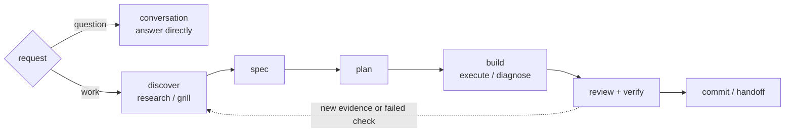
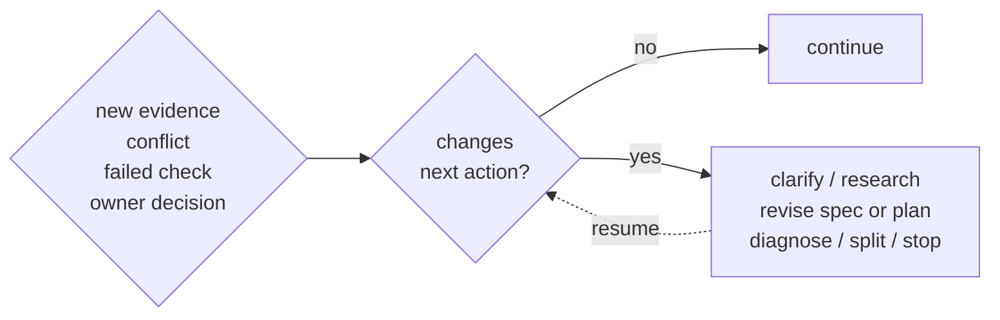

# Freeflow

Lightweight workflow for coding agents.

Agent workflow tools tend to choose one side of the problem: sharp point skills, full lifecycle methodology, or enforcement-heavy runtimes. The missing layer is a small workflow spine that prevents silent product decisions, source-truth rewrites, fake verification, and messy handoffs without turning every change into a process operating system.

## Workflow

Freeflow is a workflow layer, not a new agent. It helps the agent choose the right amount of process for the task.

### Modes

- `conversation`: answer, explain, critique, or explore without workflow pressure.
- `workflow`: default for consequential work; use the workflow spine and scale detail to risk.
- `strict-workflow`: high-risk or hard-to-reverse work with stronger gates.

Use strict-workflow for security, privacy, billing, public APIs, migrations, data loss, compatibility, permissions, deployment, or irreversible architecture.

### Map



The map is orienting, not mandatory. Small reversible work can skip unnecessary artifacts and gates.

### Backward Edge

Loop back when new evidence changes the path:



The agent should not silently choose the backward destination when the choice changes product behavior, scope, compatibility, public APIs, security, privacy, billing, data loss, permissions, or irreversible architecture.

### Bypass

Bypass skips ceremony, not judgment.

Use `bypass` only to skip an unnecessary gate. It does not skip user-owned decisions, source-truth conflicts, risky checks, or fresh verification before completion claims.

## Install

### Codex

Register the GitHub repo as a Codex marketplace, refresh it, then install Freeflow:

```bash
codex plugin marketplace add https://github.com/hassan-mohiddin/freeflow.git
codex plugin marketplace upgrade freeflow
codex plugin add freeflow@freeflow
codex plugin list | rg freeflow
```

In the Codex app, add the same GitHub marketplace URL from `/plugins`, then search for `freeflow`.

### Claude Code

Register the marketplace:

```bash
/plugin marketplace add hassan-mohiddin/freeflow
/plugin install freeflow
```

Or install directly from GitHub:

```bash
/plugin install hassan-mohiddin/freeflow
```

### Pi Coding Agent

Install Freeflow as a native Pi package:

```bash
pi install git:github.com/hassan-mohiddin/freeflow
```

For local development from this checkout:

```bash
pi install .
```

The Pi package exposes Freeflow skills and a small extension that registers direct Freeflow commands and loads workflow skill/map context before agent turns.

### Required Step 1: Run Setup

**Run this in every repo after installing Freeflow:**

```text
/setup-freeflow
```

Setup creates the repo activation file and `.freeflow/config.json`. It does not create repo-local hooks, docs inventories, state files, handoffs, or `.codex/rules` behavior files.

After successful setup, the setup skill reads the workflow skill and workflow map before its final response so the current session can continue with Freeflow loaded.

### Required Step 2: Enable Hooks

**In Codex, open the hooks screen and trust the Freeflow `SessionStart` hook:**

```text
/hooks
```

Press `t` to trust/enable the hook when Codex marks it as needing review.

Once enabled, the hook loads Freeflow workflow context at session start, resume, clear, and compact.

In Pi, Freeflow's package extension provides the context-loading hook through Pi lifecycle events. It refreshes workflow context on session start and compact, then injects it before agent turns. If you install it project-locally, trust the project when Pi prompts for project-local package resources.

These hooks do not run after every edit, block tools, grant permissions, or enforce workflow policy.

### Other Agents

Copy the `plugins/freeflow/skills/` directory into the agent's skills/plugin system and make sure the agent can read `SKILL.md` files with bundled `references/`.

## Usage

Use natural language first:

```text
Use Freeflow workflow mode for this task.
Keep this in conversation mode.
Use strict-workflow for this billing change.
Verify before claiming completion.
Capture the durable decision.
```

Slash-style prompts are model-routed in v0.1:

```text
/workflow conversation
/workflow workflow
/workflow strict-workflow
/workflow reset
/write-spec
/write-plan
/execute-plan
/verify-work
/commit-work
/handoff
```

For Codex and Claude, these commands work as skill-routing language. In Pi, the package extension registers native command handlers for Freeflow commands. Pi `/workflow` mode changes are session-scoped and update the footer; `.freeflow/config.json` remains the repo default only.

## Docs

- [Docs index](plugins/freeflow/docs/README.md)
- [Workflow](plugins/freeflow/docs/workflow.md)
- [Skills](plugins/freeflow/docs/skills.md)
- [Architecture](plugins/freeflow/docs/architecture.md)
- [Release evidence](plugins/freeflow/docs/release-evidence.md)
- [ADRs](plugins/freeflow/docs/adr/README.md)

## Evidence

Freeflow does not claim to beat Matt Pocock's skills or Obra's Superpowers. Those are references for skill sharpness and lifecycle discipline. Current evals compare baseline agent behavior against Freeflow instructions/skills, then verify command coverage.

| Report | Baseline | With Freeflow | What It Shows |
| --- | ---: | ---: | --- |
| v0.1 acceptance suite | - | 15/15 pass | Required release behaviors passed after measured fixes. |
| Always-on source-truth conflict | 2/10 | 10/10 | Freeflow stopped a pressured billing rewrite, made no edits, named the conflict, and asked for the policy decision. |
| Write spec from stale handoff | 4/10 | 10/10 | Freeflow refused to supersede billing policy from stale handoff text. |
| Write plan with hidden billing decision | 4/10 | 10/10 | Freeflow created no plan, named the policy conflict, and asked which path to follow. |
| Cold spec call without context | 2/10 | 10/10 | Freeflow did not invent onboarding behavior from adjacent files. |
| Workflow context lifecycle | fail | pass | Setup loads workflow context for the same session; session-start hooks load workflow context without `PostToolUse`. |
| Command surface audit | - | Pass | 3 mode commands, 13 direct skill calls, and 2 developer skill calls are covered while native slash handlers remain disabled. |

Eval sources and reports live with the plugin under `plugins/freeflow/evals/`; generated run output is ignored. Concise release evidence is summarized in [plugins/freeflow/docs/release-evidence.md](plugins/freeflow/docs/release-evidence.md).

## What Freeflow Is Not

- Not a new agent.
- Not a CLI framework.
- Not an enforcement hook system.
- Not old Orchestra with a smaller README.
- Not a replacement for Matt's skills or Superpowers.

The shipped hooks are context-loading only. They do not enforce policy, block tools, or replace repo instructions.

Freeflow is the lightweight workflow layer between point skills and full process systems.

## License

MIT License. Copyright (c) 2026 Hassan Mohiddin.
