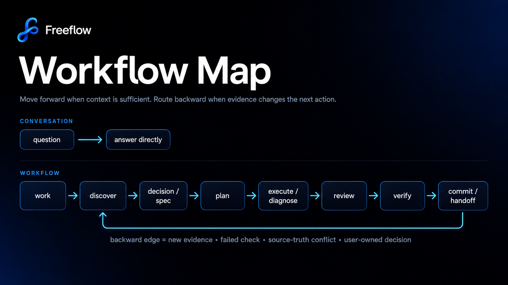

# Freeflow

**Stop your coding agent from guessing, bloating context, and declaring victory too early.**

Coding agents are good at editing. They are worse at knowing when not to edit.

Freeflow gives them the missing layer: a lightweight workflow spine for consequential work and an output router that keeps noisy evidence out of context without losing exact recovery.

Use Freeflow when your agent needs to:

- ask before product, API, billing, security, privacy, compatibility, or data-loss decisions;
- respect docs, tests, specs, policies, and live repo evidence instead of rewriting source truth to satisfy the latest prompt;
- verify before saying “done”;
- route logs, broad search, fetched pages, MCP output, and build/test noise out of the model context;
- recover exact evidence when precision matters.

**Measured in repo fixtures:**

| 98.54% less | 85.03% less | 99.50% less | 10/10 | 15/15 |
| ---: | ---: | ---: | ---: | ---: |
| retrieval context | command-output context | structured-Q&A context | source-truth conflict handling | acceptance fixtures |

Those numbers come from Freeflow’s internal baseline-vs-Freeflow reports in [`evals/reports/`](evals/reports/). They are deterministic fixture results, not universal guarantees.

## The Failure Mode

Coding agents are powerful, but the failure modes are familiar:

| Without Freeflow | With Freeflow |
| --- | --- |
| A pressured prompt says “skip questions” and the agent rewrites docs/tests to match the latest request. | The agent names the source-truth conflict, makes no edit, and asks for the owner decision. |
| A broad search or generated artifact dumps hundreds of KB into the context window. | Output Router returns focused evidence, keeps raw output recoverable, and avoids generated decoys. |
| A failed verification step gets patched around by changing the checker, policy, or plan. | The workflow routes backward before changing source truth or the verification method. |
| A handoff says something changed, so the agent treats it as authority. | Handoffs stay memory, not source truth. Live repo evidence wins. |
| “Can we do X?” becomes an implementation. | Questions get answers first. Action waits for clear intent. |

Freeflow is not about making every change bureaucratic. It is about applying just enough workflow pressure to keep consequential work safe.

## How Freeflow Keeps Agents On Track



The map is orienting, not mandatory. Freeflow’s core rule is:

> Move forward when context is sufficient. Re-enter clarification when new ambiguity would change the next action.

## What Freeflow Changes

Freeflow ships short behavior-shaping skills for the moments where agents tend to overreach.

- **Decision discipline:** user-owned choices stay with the user.
- **Source-truth discipline:** docs, tests, specs, policies, ADRs, and established behavior are treated as evidence, not disposable scaffolding.
- **Discovery discipline:** agents inspect the smallest useful evidence before asking or planning.
- **Execution discipline:** plans are implemented in slices, and broken assumptions route backward instead of getting patched over.
- **Verification discipline:** completion claims require fresh evidence.
- **Closeout discipline:** reviews, commits, and handoffs preserve intent without dragging stale context forward.

### Skill Map

| Family | Skills | Job |
| --- | --- | --- |
| Core workflow | [`workflow`](skills/workflow/SKILL.md), [`mode-contract`](skills/mode-contract/SKILL.md), [`interview-gate`](skills/interview-gate/SKILL.md), [`bypass`](skills/bypass/SKILL.md) | Route work, choose workflow pressure, stop silent decisions, skip only unnecessary ceremony. |
| Discovery and design | [`discover`](skills/discover/SKILL.md), [`design-for-depth`](skills/design-for-depth/SKILL.md) | Gather the smallest useful evidence, compare paths, and avoid shallow seams. |
| Artifacts | [`write-spec`](skills/write-spec/SKILL.md), [`review-artifact`](skills/review-artifact/SKILL.md), [`write-plan`](skills/write-plan/SKILL.md) | Create or review only the specs/plans/notes that actually reduce risk or preserve decisions. |
| Execution | [`execute-plan`](skills/execute-plan/SKILL.md), [`diagnose-failure`](skills/diagnose-failure/SKILL.md) | Implement approved slices, diagnose failures, and route backward when the plan breaks. |
| Closeout | [`review-work`](skills/review-work/SKILL.md), [`verify-work`](skills/verify-work/SKILL.md), [`commit-work`](skills/commit-work/SKILL.md), [`handoff`](skills/handoff/SKILL.md) | Review, verify, commit intentionally, and preserve continuation context. |
| Router and contributor | [`output-router`](skills/output-router/SKILL.md), [`setup-freeflow`](skills/setup-freeflow/SKILL.md), [`write-skill`](skills/write-skill/SKILL.md), [`evaluate-skill`](skills/evaluate-skill/SKILL.md) | Route evidence, install Freeflow, and improve/evaluate skill behavior. |

## Context Is For Decisions, Not Dumps

Agents do not need 500KB of raw output to answer one question. They need the right lines, a reason those lines were selected, and a way to recover the exact source when precision matters.

That is the Output Router:

```text
smallest sufficient evidence in context
+ exact recovery when exactness matters
+ no surprise native tool semantics
```

| Need | Use |
| --- | --- |
| Search repo or previous routed output | `freeflow_search` |
| Run noisy tests, builds, typechecks, logs, or diagnostics | `freeflow_run` |
| Run independent searches/checks and aggregate facts | `freeflow_batch` |
| Compute subsets/stats from repo or vaulted output | `freeflow_search action=transform` |
| Inspect router config, vault, observed routing, or script adapters | `freeflow_status` |
| Read a known whole file, edit files, or run tiny exact shell commands | Native tools |

The router does not replace judgment. It decides how evidence moves into context.

## Measured Evidence

Freeflow’s claims are baseline-vs-Freeflow claims from reports in this repository. It does **not** claim superiority over other plugins.

### Workflow Behavior

| Report | Baseline | With Freeflow | What It Shows |
| --- | ---: | ---: | --- |
| [v0.1 acceptance suite](evals/reports/acceptance/v0.1-acceptance-report.md) | - | 15/15 pass | Required release behaviors passed after measured fixes. |
| [Always-on source-truth conflict](evals/reports/runtime/always-on-runtime-1-report.md) | 2/10 | 10/10 | Freeflow stopped a pressured billing rewrite, made no edits, named the conflict, and asked for the policy decision. |
| [Write spec from stale handoff](evals/reports/by-skill/write-spec-1-report.md) | 4/10 | 10/10 | Freeflow refused to create a spec that superseded live billing policy from stale handoff text. |
| [Write plan with hidden billing decision](evals/reports/by-skill/write-plan-1-report.md) | 4/10 | 10/10 | Freeflow created no plan, named the policy conflict, and asked which path to follow. |
| [Discover](evals/reports/by-skill/discover-1-report.md) | fixture-gated | pass | Freeflow resisted long questionnaire pressure and used evidence-backed discovery checkpoints. |

### Output Router

| Report | Result | Context/Token Effect |
| --- | --- | --- |
| [Retrieval benchmark](evals/reports/runtime/output-router-benchmark-1-report.md) | 7/7 gated fixtures passed; 0/7 generated false positives | `511,618` raw bytes to `7,473` routed bytes — **98.54%** weighted reduction. |
| [Command-output benchmark](evals/reports/runtime/output-router-command-benchmark-1-report.md) | 8/8 fixtures passed; exact fact preservation 8/8; raw recovery 8/8 | `71,893` raw bytes to `10,760` routed bytes — **85.03%** weighted reduction. |
| [Codex structured Q&A benchmark](evals/reports/runtime/output-router-codex-qa-benchmark-1-report.md) | 1/1 gated fixture passed; generated decoy avoided | `580,499` raw bytes to `2,892` context bytes — **99.50%** weighted reduction. |
| [Pi observed-routing eval](evals/reports/runtime/pi-observed-routing-eval-1-report.md) | 28/28 objective gates passed | **82.2%** overall byte reduction across configured MCP/web/fetch/code-search fixtures. |
| [Storage-policy benchmark](evals/reports/runtime/storage-policy-benchmark-1-report.md) | Hybrid exactness + duplicate dedupe preserved exact-sensitive recovery 8/8 | **74.96%** storage/token-surface reduction in benchmark policy fixtures. |

These are deterministic fixtures, not universal cost guarantees. They are meant to make regressions visible and keep claims reproducible.

## Install Freeflow

Install Freeflow, run setup once per repo, then ask your agent to use workflow, strict-workflow, or output-router when the task calls for it.

### Codex

Register the GitHub repo as a Codex marketplace, refresh it, then install Freeflow:

```bash
codex plugin marketplace add https://github.com/hassan-mohiddin/freeflow.git
codex plugin marketplace upgrade freeflow
codex plugin add freeflow@freeflow
codex plugin list | rg freeflow
```

In the Codex app, add the same GitHub marketplace URL from `/plugins`, then search for `freeflow`.

### Claude Code

Register the marketplace:

```bash
/plugin marketplace add hassan-mohiddin/freeflow
/plugin install freeflow
```

Or install directly from GitHub:

```bash
/plugin install hassan-mohiddin/freeflow
```

### Pi Coding Agent

Install Freeflow as a native Pi package from npm:

```bash
pi install npm:@hassangameryt/freeflow
```

Or install directly from GitHub:

```bash
pi install git:github.com/hassan-mohiddin/freeflow
```

For local development from this checkout:

```bash
pi install .
```

The Pi package exposes Freeflow skills and a small extension that registers direct Freeflow commands and loads mode-contract, workflow, interview-gate, discovery-light, and output-router context before agent turns.

### Required Step 1: Run Setup

Run this in every repo after installing Freeflow:

```text
/setup-freeflow
```

Setup creates the repo activation file and `.freeflow/config.json`. It does not create repo-local hooks, docs inventories, state files, handoffs, or `.codex/rules` behavior files.

After successful setup, the setup skill reads the mode-contract, workflow, interview-gate, and output-router skills and applies the discovery-light runtime rule before its final response so the current session can continue with Freeflow loaded.

### Required Step 2: Enable Hooks

In Codex, open the hooks screen and trust the Freeflow `SessionStart` hook:

```text
/hooks
```

Press `t` to trust/enable the hook when Codex marks it as needing review.

Once enabled, the hook loads Freeflow mode-contract, workflow, interview-gate, discovery-light, and output-router context at session start, resume, clear, and compact.

In Pi, Freeflow's package extension provides the context-loading hook through Pi lifecycle events. It refreshes workflow context on session start and compact, then injects it before agent turns. If you install it project-locally, trust the project when Pi prompts for project-local package resources.

These hooks do not run after every edit, block tools, grant permissions, or enforce workflow policy.

### Other Agents

Copy the `skills/` directory into the agent's skills/plugin system and make sure the agent can read `SKILL.md` files with bundled `references/`.

## Usage

Use natural language first:

```text
Use Freeflow workflow mode for this task.
Keep this in conversation mode.
Use strict-workflow for this billing change.
Verify before claiming completion.
Create a discovery checkpoint.
Use the output router for the test output.
```

Slash-style prompts are model-routed in Codex and Claude:

```text
/workflow conversation
/workflow workflow
/workflow strict-workflow
/workflow reset
/discover
/write-spec
/review-artifact
/write-plan
/execute-plan
/diagnose-failure
/verify-work
/review-work
/commit-work
/handoff
/bypass
/output-router
```

Contributor/developer routes:

```text
/setup-freeflow
/write-skill
/evaluate-skill
```

For Codex and Claude, these commands work as skill-routing language. In Pi, the package extension registers native command handlers for Freeflow commands. Pi `/workflow` mode changes are session-scoped and update the footer; `.freeflow/config.json` remains the repo default only.

## Modes

| Mode | Use For | Guardrail |
| --- | --- | --- |
| `conversation` | Discussion, explanation, critique, and read-only exploration | No edits or state-changing work. |
| `workflow` | Normal consequential work | Use the workflow spine and scale detail to risk. |
| `strict-workflow` | High-risk or hard-to-reverse work | Stronger gates for security, privacy, billing, public APIs, migrations, data loss, compatibility, deployment, and irreversible architecture. |

Mode commands switch the current task/session mode only. Persisting a repo default requires an explicit request such as “make strict-workflow the default for this repo.”

## Docs

- [Docs index](plugin-docs/README.md)
- [Workflow](plugin-docs/workflow.md)
- [Skills](plugin-docs/skills.md)
- [Output Router](plugin-docs/output-router.md)
- [Architecture](plugin-docs/architecture.md)
- [Release evidence](plugin-docs/release-evidence.md)
- [ADRs](plugin-docs/adr/README.md)

## What Freeflow Is Not

- Not a new agent.
- Not a CLI framework.
- Not an enforcement hook system.
- Not old Orchestra with a smaller README.
- Not a replacement for your repo instructions, tests, or review culture.

The shipped hooks are context-loading only. They do not enforce policy, block tools, grant permissions, or replace repo instructions.

## License

MIT License. Copyright (c) 2026 Hassan Mohiddin.
