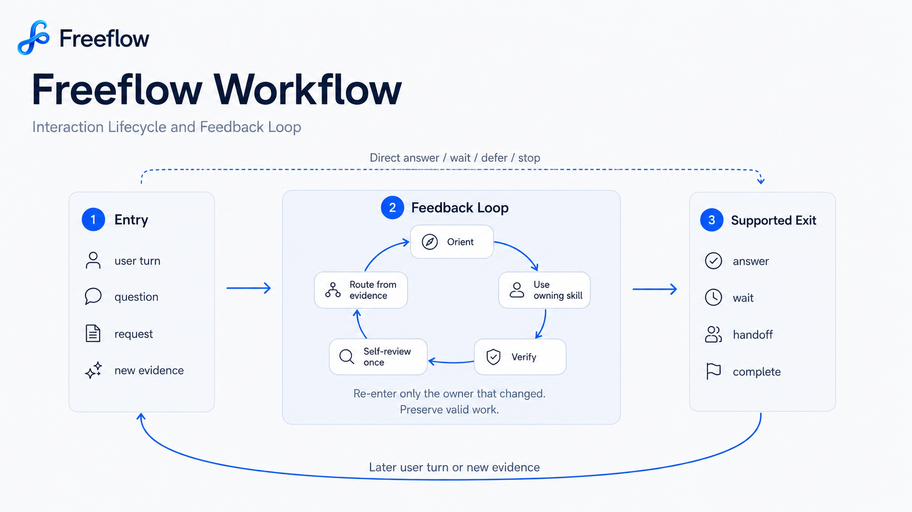
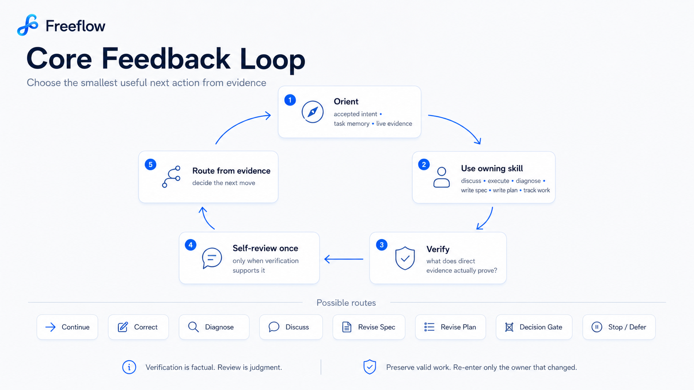

# Freeflow

**A feedback-based control system for coding agents.**

Freeflow helps coding agents move through consequential work without a rigid pipeline, silent decisions, or context-heavy ceremony.

> Use feedback to choose the smallest useful next action.
>
> Re-enter the narrowest owning activity when evidence changes the path.
>
> Memory preserves context. It does not create authority.

The active agent still does the work. Freeflow supplies the interaction contract, workflow routing, focused methods, task memory, and evidence discipline that help it decide what to do next—and when not to edit.

## Why Freeflow

Coding agents are strong at mutation and weak at control boundaries:

| Common failure | Freeflow response |
| --- | --- |
| A question or tentative idea becomes an edit. | The Interaction Contract answers first and waits for clear action authority. |
| A prompt conflicts with tests, policy, or accepted behavior. | Decision Gate names the conflict and stops before mutation. |
| Work follows a plan after evidence invalidates it. | Workflow routes from evidence and preserves unaffected work. |
| Every task gets a spec, plan, review, and status ceremony. | Workflow enters at the narrowest useful owner and creates artifacts only when they help. |
| A passing command becomes an unsupported completion claim. | Verify Work matches direct evidence to the exact claim and boundary. |
| Review findings are treated as commands. | The active agent adjudicates; corrections require existing or explicit authority. |
| Compaction loses task state or imports stale branch authority. | Track Work restores the complete Working Record and reconciles it with the current conversation and live repo. |
| Consumed tool results keep occupying future context. | Pi's optional Context Virtualization archives consumed results while preserving canonical session history. |

Freeflow is not a new agent or workflow engine. It is a portable control layer for Codex, Claude Code, Pi, and similar coding environments.

## The Control System

One user interaction is an **Interaction Lifecycle**:



```text
[Entry] -> [Feedback Loop when needed] -> [Supported Exit]
   ^              ^        |                  |
   |              |________|                  |
   |__________________________________________|
            later user turn or evidence
```

When work is needed, the inner **Feedback Loop** applies to every bounded activity:



```text
orient to accepted intent, task memory, and live evidence
-> use the narrowest owning skill
-> implement, discuss, test, or observe
-> verify what the evidence proves
-> once initially supported, self-review the resulting state
-> only then accept, reuse, or claim that activity complete
-> continue, correct, diagnose, revise, ask, defer, or stop
```

A Supported Exit may answer, wait, pause, hand off, defer, stop, preserve a controlled boundary, or complete. Freeflow does not invent another phase merely because one exists in the full skill pack.

## Core Principles

- **The active agent owns the current route.** Independent review may add judgment; it does not take over routing or verification.
- **Authority is outcome-and-effect scoped.** Each interaction carries a requested outcome, permitted effects, evidence boundary, and stop condition established by a direct request or still-valid approval. Mode, skill selection, usefulness, and new evidence do not widen it.
- **Passive observation differs from active evidence generation.** Inspecting existing evidence may support an inquiry; exercising target behavior or changing repository, durable task or session, or external state requires coverage by the current authority envelope. Effects are cumulative, so the strongest relevant boundary applies.
- **Verification is factual. Review is judgment.** The active agent verifies; self-review is silent; selected independent review uses a separate context.
- **Pass is not the only review exit.** Pass, Non-blocking, Inconclusive, and Blocking all end review and return evidence to Workflow.
- **Review findings do not authorize edits.** Ask for unapproved corrections and any warranted focused follow-up together.
- **Specs and Plans have separate jobs and separate reviews.** Working Records carry evolving state; Plans remain stable ordered strategy.
- **A slice may span several feedback iterations.** Extend its boundary write-ahead only while the intended result remains coherent.
- **Diagnose before redesigning.** Ordinary mistakes do not prove structural failure.
- **Bypass skips optional pressure, not authority, safety, evidence, or selected review.**

## Modes

Freeflow has exactly three modes:

| Mode | Use for | Guardrail |
| --- | --- | --- |
| `conversation` | Discussion, critique, explanation, and passive inspection of existing evidence | Active evidence generation and mutation or delivery require switching mode plus authority. |
| `workflow` | Active evidence generation and normal consequential or mutating work | Use the adaptive lifecycle and proportionate evidence. |
| `strict-workflow` | High-risk or hard-to-reverse work | Stronger decision, evidence, and checkpoint pressure without mandatory independent review after every slice. |

Task type and direct skill calls do not silently switch mode.

## Skills And Routing

Freeflow ships 26 model/contributor skills to Codex, Claude Code, and Pi, including Action Selection. Pi also provides gated Cognitive Routing, Context Virtualization, and Conversation History capabilities outside the shared skill surface.

See the [typed skill routing map](https://github.com/hassan-mohiddin/freeflow/blob/main/plugin-docs/skill-routing.md) for every owner, sibling route, and reference dependency. See [Workflow](https://github.com/hassan-mohiddin/freeflow/blob/main/plugin-docs/workflow.md) for the lifecycle and [Architecture](https://github.com/hassan-mohiddin/freeflow/blob/main/plugin-docs/architecture.md) for delivery and configuration.

## Task Memory Without A Second Task System

Track Work maintains one Working Record for an ongoing task:

- current context;
- one current slice;
- ordered proposed slices;
- task-local decisions and hypotheses;
- evidence pointers and completed history;
- one next useful action;
- optional inert Notes.

It records state transitions, not every edit or comment. Routine in-slice feedback is not checkpoint history. After compaction, summarization, clear, resume, or session navigation, Workflow uses the bounded `resume` view and retrieves exact history only when needed, treating the record as memory rather than authority.

## Context Is For Decisions, Not Dumps

In Pi, optional Context Virtualization lets the model archive consumed tool-result content from future context while preserving canonical session history. Use native host tools for direct file reads, commands, and mutations.

## Evidence, Not Marketing Certainty

Historical workflow and router benchmarks remain documentary evidence, not universal guarantees. Retired Output Router material is preserved under `.deprecated/output-router/`. The current adaptive skill candidate is **Unverified** pending baseline-vs-with-skill behavioral evaluation.

| Evidence | Result |
| --- | --- |
| Historical v0.1 acceptance suite | 15/15 fixtures passed after measured fixes. |
| Historical source-truth conflict pressure | Baseline 2/10; with-skill 10/10. |
| Retrieval benchmark | 7/7 gated fixtures; 98.54% weighted context reduction. |
| Command-output benchmark | 8/8 fixtures with exact recovery; 85.03% weighted reduction. |
| Pi observed-routing eval | 28/28 objective gates; 82.2% overall byte reduction. |

See [release evidence](https://github.com/hassan-mohiddin/freeflow/blob/main/plugin-docs/release-evidence.md) for boundaries, reports, and deferred checks.

## Install

### Codex

```bash
codex plugin marketplace add https://github.com/hassan-mohiddin/freeflow.git
codex plugin marketplace upgrade freeflow
codex plugin add freeflow@freeflow
codex plugin list | rg freeflow
```

Trust the Freeflow `SessionStart` hook from `/hooks` when Codex requests review, then start a new session so skills and lifecycle context load from the installed plugin.

### Claude Code

```bash
/plugin marketplace add hassan-mohiddin/freeflow
/plugin install freeflow
/reload-plugins
```

Start a new session after first install when the current session predates the plugin.

### Pi

```bash
pi install npm:@hassangameryt/freeflow
```

Or:

```bash
pi install git:github.com/hassan-mohiddin/freeflow
```

## Activate In A Repository

Run:

```text
/setup-freeflow
```

Minimal setup creates shared activation:

```json
{
  "defaultMode": "workflow"
}
```

Configuration layers are:

```text
host session mode override
-> .freeflow/local.json personal core override
-> .freeflow/config.json shared repository value
-> built-in default
```

`.freeflow/config.json` is required. `.freeflow/local.json` is optional and cannot activate Freeflow by itself. Pi stores session overrides in branch-aware session JSONL; Claude and Codex store mode overrides in plugin-owned data keyed by host session ID. Session controls do not mutate config files and cannot bypass missing or invalid repository activation. Setup does not write Freeflow instructions into `AGENTS.md`, `CLAUDE.md`, or host rule files.

## Runtime Delivery

When effective, host adapters compose static fragments from `runtime/prompts/` and expose discoverable skills/tools from the same effective-state snapshot. Runtime State is appended to every provider invocation with current mode, capability, and Cognitive Routing facts.

Skills is the parent gate for Cognitive Routing, Context Virtualization, and Conversation History. Full Workflow, Action Selection, and capability skill bodies are discoverable rather than persistent bootstrap content. Interaction Contract is prompt-only at `runtime/prompts/interaction-contract.md`. Hooks load context only; they do not enforce policy, block tools, grant permissions, or replace repo instructions.

Pi composes effective fragments before agent turns and filters historical bootstrap entries. Codex and Claude use one packaged runtime hook without injecting a full Workflow bootstrap. Setup reports automatic delivery as confirmed, unavailable, or unconfirmed.

## Commands

Natural language is preferred. Pi registers these canonical direct calls:

```text
/discuss
/action-selection
/track-work
/write-spec
/review-artifact
/write-plan
/execute-work
/simplify-code
/migration-work
/diagnose-failure
/verify-work
/review-work
/commit-work
/handoff
/finish-branch
/release-work
/launch-work
/bypass
```

Pi-only compatibility aliases:

```text
/discover
/execute-plan
```

Contributor calls:

```text
/setup-freeflow
/write-skill
/evaluate-skill
```

Mode controls:

```text
/freeflow mode conversation
/freeflow mode workflow
/freeflow mode strict-workflow
/freeflow mode reset
```

Pi-native settings controls:

```text
/freeflow
```

Pi `/freeflow settings` edits personal core overrides, `/freeflow settings session` manages temporary core and mode overrides, and `/freeflow settings repo` edits shared settings. For session mode, Pi uses `/freeflow mode <mode|reset>`, Claude uses `/freeflow:mode-contract <mode|reset>`, and Codex uses `$mode-contract <mode|reset>`. Clear natural-language instructions such as “Switch to conversation mode” use the same host-managed session control; questions and hypotheticals do not.

Claude exposes plugin skills as namespaced commands such as `/freeflow:discuss`; Codex exposes them through `/skills` and `$discuss`. Freeflow uses these host-native skill surfaces instead of duplicate manifest command handlers. Direct skill calls select a method. They do not change mode, widen the authority envelope, or create independent review context.

A request to change the **default** is separate. Explicit local/personal wording targets `.freeflow/local.json`; explicit repository/shared/team wording targets `.freeflow/config.json`. An unqualified “change the default mode” request requires one local-versus-repository clarification before editing.

## Public Docs

- [Docs index](https://github.com/hassan-mohiddin/freeflow/blob/main/plugin-docs/README.md)
- [Workflow](https://github.com/hassan-mohiddin/freeflow/blob/main/plugin-docs/workflow.md)
- [Skill routing](https://github.com/hassan-mohiddin/freeflow/blob/main/plugin-docs/skill-routing.md)
- [Architecture](https://github.com/hassan-mohiddin/freeflow/blob/main/plugin-docs/architecture.md)
- [Release evidence](https://github.com/hassan-mohiddin/freeflow/blob/main/plugin-docs/release-evidence.md)
- [Release ADRs](https://github.com/hassan-mohiddin/freeflow/blob/main/plugin-docs/adr/README.md)

## What Freeflow Is Not

- Not a new agent.
- Not a mandatory phase pipeline.
- Not a CLI enforcement framework.
- Not a replacement for repository instructions, tests, policies, or review culture.
- Not old Orchestra with a smaller README.
- Not proof that the current candidate is behaviorally ready.

## License

MIT License. Copyright (c) 2026 Hassan Mohiddin.
