# Codex CLI Agent Harness Study - Pass 0 Repo Map

> **Doc ID:** RESEARCH-2026-06-12-codex-cli-agent-harness-pass-0
> **Date:** 2026-06-12
> **Audit update:** 2026-06-14
> **Owner:** Hassan Mohiddin
> **Type:** Research
> **Status:** Draft
> **Original source snapshot:** `openai/codex` commit `b65fe3d8976d6fcc44ee6c6cf988654af5fc4d2d`
> **Current-source audit snapshot:** fetched `origin/main` commit `0fed4497f50ad5f0b2f7972a1bfd14c5a09a85c5`

## Purpose

Preserve a first-pass map of the public `openai/codex` repository so later research passes can discuss the turn loop, tool system, sandboxing, subagents, model providers, memory, and config without repeatedly rebuilding the repo mental model.

This document is research memory, not shipped Freeflow behavior and not an implementation plan.

Pass 0 should answer:

- Where does the actual agent harness live?
- Which repo areas are user interfaces, engine internals, provider adapters, tools, safety layers, or persistence?
- What should a future Freeflow local-delegation harness learn from this structure?
- What should be left to later, deeper passes?

Pass 0 should not try to fully explain `run_turn`. Pass 1 is the canonical turn-loop artifact. This pass now includes only enough turn-loop orientation to place the code in the repo map.

## How To Read This

If this is your first time reading the series, read:

- `If You Only Read 10 Minutes`
- `Core Idea`
- `Tiny Diagram`
- `Repo Map`
- `Where The Harness Actually Lives`
- `Freeflow Translation`

If you are checking whether the map is current enough, read:

- `Source Snapshot And Drift`
- `Audit Findings`
- `Current-Source Delta`
- `Source Evidence Appendix`

If you are preparing a deeper pass, read:

- `Pass Boundary`
- `What To Study Next`
- `What To Ignore For Now`

## Diagram Map

Use these diagrams as checkpoints. They are not replacements for the source evidence.

| If you are trying to understand... | Start with... |
| --- | --- |
| Why a model is not an agent | `Tiny Diagram` |
| The top-level `openai/codex` repo shape | `Top-Level Repo Map` |
| Why `codex-rs/` matters most | `codex-rs Workspace Map` |
| The difference between UI, protocol, engine, tools, and safety | `Harness Layer Map` |
| How user input reaches the turn loop | `Normal User Turn Path` |
| Why Pass 0 should not duplicate Pass 1 | `Turn-Loop Checkpoint` |
| How tools are split between specs, router, registry, handlers, and runtime | `Tool Boundary Map` |
| How mutable state differs from service providers | `State And Services Map` |
| How subagents are modeled | `Subagent Map` |
| What Freeflow should borrow | `Freeflow Local Harness Translation` |

## If You Only Read 10 Minutes

Codex CLI is not a single prompt wrapper.

It is a terminal-first agent runtime made of several layers:

1. User surfaces: CLI, TUI, exec mode, app server, SDKs, MCP server.
2. Protocol: structured operations in and structured events out.
3. Session runtime: live thread/session state, input queues, task lifecycle, cancellation.
4. Turn loop: model call, streamed response handling, tool execution, follow-up sampling.
5. Tools: model-visible specs plus runtime handlers wrapped by policy, hooks, telemetry, and output shaping.
6. Safety: approval policy, sandboxing, command policy, guardian review, permission grants.
7. Context: AGENTS.md, skills, plugins, app context, environment, token budget, memory, and conversation history.
8. Persistence and traces: threads, rollouts, trace records, state databases.
9. Extensibility: MCP, plugins, skills, apps, extensions, hooks, and subagents.

For Freeflow, the most important lesson is:

```text
A local model adapter is only one component.
The harness is the runtime around it.
```

A useful local-delegation harness needs:

- a bounded task packet
- a model adapter
- a turn loop
- tool definitions
- tool execution policy
- workspace/sandbox policy
- logs and traces
- structured results
- verification boundaries
- optional child-job/subagent management

## Tiny Diagram

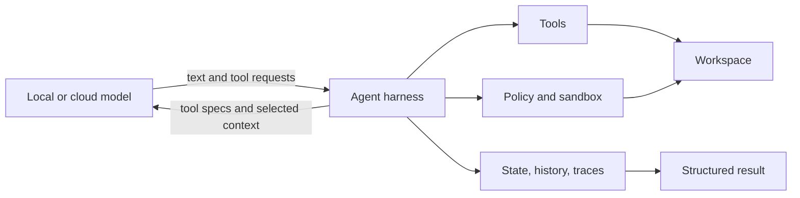

Beginner version:

- The model is the reasoning engine.
- The harness is the operating system around that reasoning engine.
- Tools are the hands.
- Policy is the permission boundary.
- History and traces are the memory of what happened.

Production version:

- The model is untrusted for authority.
- The harness owns execution, context assembly, persistence, cancellation, and result contracts.
- The model can request action; the runtime decides whether, how, and under what constraints action happens.

## Source Snapshot And Drift

The original Pass 0 source was cloned to:

```text
/private/tmp/openai-codex-study-pass0
```

Original snapshot:

```text
repo: openai/codex
commit: b65fe3d8976d6fcc44ee6c6cf988654af5fc4d2d
short: b65fe3d
commit date: 2026-06-12
commit title: fix: serialize auth environment tests (#27879)
```

This audit refreshed upstream and read current files from `origin/main` without checking out the worktree:

```text
repo: openai/codex
commit: 0fed4497f50ad5f0b2f7972a1bfd14c5a09a85c5
short: 0fed449
commit date: 2026-06-13 13:56:42 -0700
commit title: [codex] Carry exec-server cwd as PathUri (#28032)
```

The checked-out worktree remains on the original `b65fe3d` snapshot. Current-source audit claims in this document refer to `origin/main` through `git show origin/main:...`, `git grep origin/main`, and `git ls-tree origin/main`.

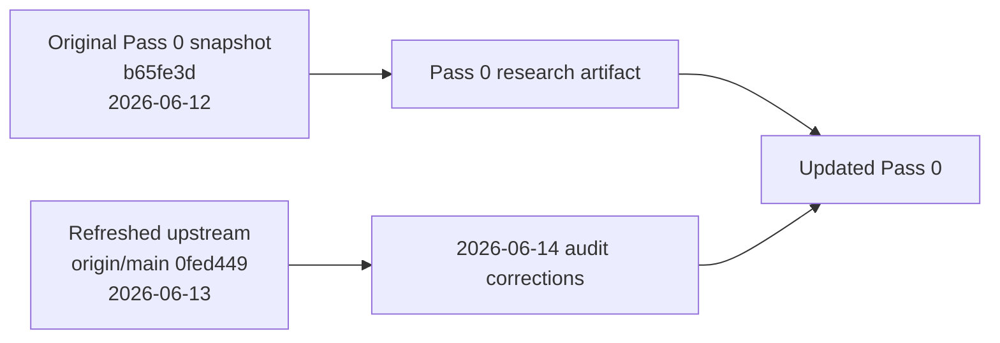

Source drift matters because Codex is active. A repo map should name stable architectural boundaries, not pretend every crate list is timeless.

## Pass Boundary

Pass 0 is an orientation pass.

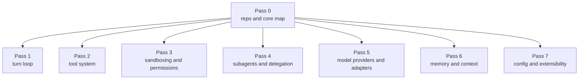

The original document leaked too much Pass 1, Pass 2, Pass 4, and Pass 6 detail into Pass 0. This update keeps the orientation but moves the burden of mechanism-level detail to the later pass artifacts.

## Core Idea

The `openai/codex` repo has many product surfaces, but the reusable harness idea concentrates around:

- `codex-rs/core`: session runtime, turn loop, tools, context, config, safety integration, subagent control.
- `codex-rs/protocol`: operation and event types.
- `codex-rs/tools`: shared tool primitives that can live outside `codex-core`.
- `codex-rs/config`: config loading and requirement layers.
- `codex-rs/sandboxing`, `execpolicy`, `exec-server`, `shell-command`, `shell-escalation`: execution and safety infrastructure.
- `codex-rs/model-provider`, `model-provider-info`, `models-manager`, `ollama`, `lmstudio`: model/provider boundary.
- `codex-rs/thread-store`, `rollout`, `rollout-trace`, `state`: persistence and traceability.

The mental model:

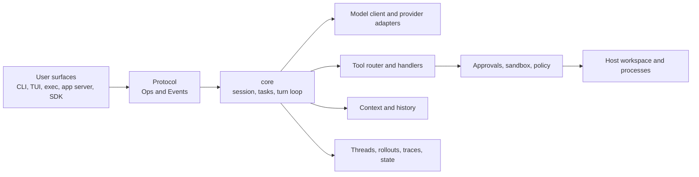

## Top-Level Repo Map

The stable top-level shape is:

```mermaid
flowchart TD
    Repo["openai/codex"]
    Repo --> Rust["codex-rs<br/>Rust workspace and real runtime"]
    Repo --> Npm["codex-cli<br/>npm wrapper for codex binary"]
    Repo --> Sdk["sdk<br/>Python and TypeScript control surfaces"]
    Repo --> Docs["docs<br/>repo-local docs and links"]
    Repo --> Scripts["scripts<br/>build, packaging, debug helpers"]
    Repo --> Tools["tools<br/>repo maintenance tools"]
    Repo --> Patches["patches<br/>build or dependency patches"]
    Repo --> ThirdParty["third_party<br/>vendored dependencies"]
    Repo --> CodexConfig[".codex<br/>dogfooding config and skills"]
    Repo --> GitHub[".github<br/>CI and templates"]
    Repo --> Bazel["Bazel and package metadata"]
```

### `codex-rs/`

Main study target.

This is the Rust workspace containing the actual CLI binary, interactive TUI, non-interactive exec mode, app server, agent core, tool system, model/provider adapters, sandboxing, memory, MCP, skills, plugins, apps, hooks, traces, and subagent support.

### `codex-cli/`

Thin npm distribution package for `@openai/codex`.

It exposes the `codex` command, but it is not the core agent harness. Use it to understand installation and packaging, not the agent loop.

### `sdk/`

Programmatic control surfaces around Codex.

This matters if Freeflow later wants a clean programmatic interface for local delegation. It is not the core implementation of the agent runtime.

### `docs/`

Repo-local documentation. Useful for orientation, but the source code is the stronger evidence for internals.

### `.codex/`

Codex dogfooding setup inside the Codex repo. Useful when studying how Codex uses its own repo-local skills and environments.

## codex-rs Workspace Map

`codex-rs/` is a Rust workspace with many crates. A crate is roughly an independently compiled package/module with explicit dependencies.

Instead of memorizing every crate, group them by purpose.

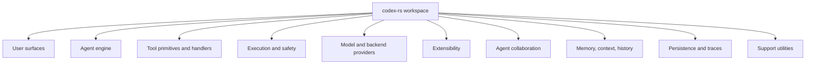

This grouping is more durable than a full crate inventory.

## User Surfaces

User surfaces are the ways a person, script, app, or another agent system talks to Codex.

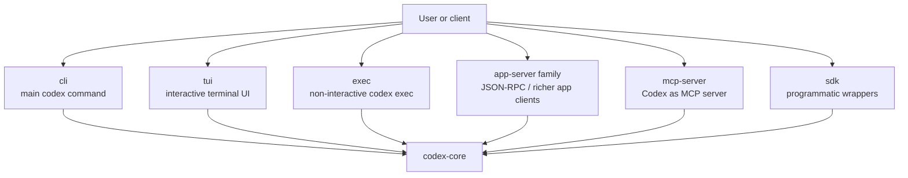

### `cli/`

The command-line front door. It parses command groups such as normal interactive use, `codex exec`, MCP, app-server, login/logout, plugin commands, sandbox helpers, resume/fork/archive/delete, and related surfaces.

### `tui/`

Interactive terminal interface. It renders chat, streaming output, diffs, approvals, command output, and status.

### `exec/`

Non-interactive execution mode. This is useful for scripts and CI-like usage where JSONL/event discipline and stdout/stderr behavior matter.

### `app-server` family

Current source has more than one app-server crate:

- `app-server`
- `app-server-client`
- `app-server-daemon`
- `app-server-protocol`
- `app-server-test-client`
- `app-server-transport`

The original doc described this too much like a single crate. The better current mental model is an app/client protocol surface around the same underlying agent machinery.

### `mcp-server`

Lets MCP clients call Codex as a server/tool. This is relevant if Freeflow later exposes its harness through MCP.

## Harness Layer Map

Codex is easiest to understand as layers:

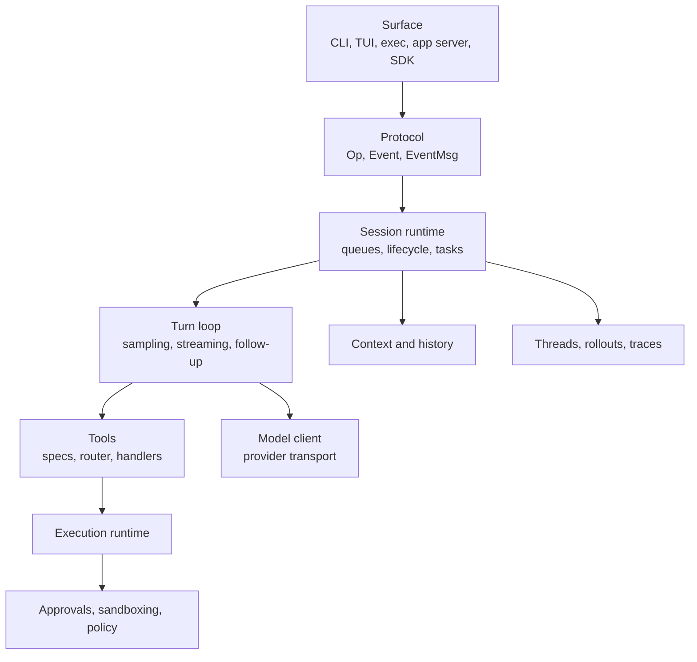

Beginner version:

- Surface is how the user talks to Codex.
- Protocol is the language between the surface and the engine.
- Session is the live runtime.
- Turn loop is one unit of agent reasoning and action.
- Tools are how the model affects the world.
- Safety decides what tools can actually do.
- Persistence records what happened.

## Agent Engine

The agent engine spans several crates and `core` submodules.

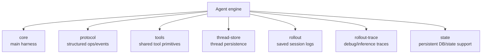

### `core/`

Main engine. This is the closest thing to "the harness."

Current important areas inside `core/src/`:

- `session/`: live session, input queues, operation dispatch, turn context, turn loop.
- `tasks/`: task types such as regular turns, review, compaction, user shell.
- `state/`: session-local mutable state, services, active turn state.
- `tools/`: core-facing tool router, registry, handlers, runtimes, sandbox glue.
- `agent/`: subagent control, spawning, registry, roles, status.
- `context/`: model-visible context fragments.
- `context_manager/`: conversation/history normalization and token accounting.
- `config/`: effective runtime config used by core.
- `guardian/`: safety and approval review machinery.
- `plugins/`: plugin discovery/rendering helpers.
- `sandboxing/`: core adapter for sandboxed execution.
- `unified_exec/`: managed process execution plumbing.
- `apps/`: app connector rendering/context.
- `utils/`: core-local support helpers.

Important top-level files in `core/src/` include:

- `client.rs`: talks to model APIs and streams responses.
- `client_common.rs`: prompt and response stream types.
- `codex_thread.rs`: public thread wrapper.
- `thread_manager.rs`: starts, resumes, forks, and manages threads.
- `codex_delegate.rs`: delegated/child Codex support.
- `agents_md.rs`: loads AGENTS.md instructions.
- `apply_patch.rs`: patch application support.
- `mcp.rs`, `mcp_tool_call.rs`, `mcp_tool_exposure.rs`: MCP integration.
- `compact.rs`, `compact_remote.rs`, `compact_remote_v2.rs`: compaction.
- `hook_runtime.rs`: lifecycle hook execution.
- `event_mapping.rs`: converts lower-level runtime/model events to protocol events.
- `stream_events_utils.rs`: stream event handling helpers.

### `protocol/`

The structured language between clients and the agent.

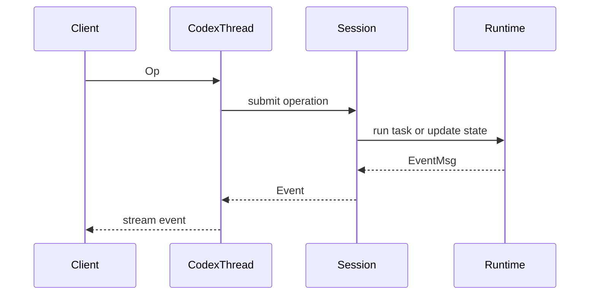

This is a key design lesson for Freeflow: an agent harness should return structured events and artifacts, not just raw chat text.

### `tools/`

`codex-rs/tools` is the shared tool primitive crate. It contains reusable definitions such as tool specs, schemas, tool outputs, dynamic tools, tool search/discovery types, and conversion to model API tool shapes.

The concrete Codex runtime tool router and most handlers live under `codex-rs/core/src/tools/`.

This distinction matters:

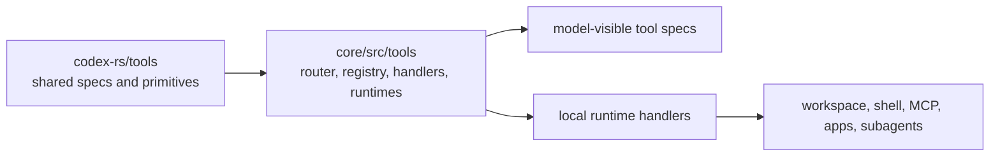

The original doc mostly had this right, but it was too easy to read as "all tool behavior lives in the `tools` crate." The current source shows the practical split more clearly.

## Where The Harness Actually Lives

For learning and design, focus here:

- `codex-rs/core/src/tasks/regular.rs`
- `codex-rs/core/src/session/turn.rs`
- `codex-rs/core/src/session/session.rs`
- `codex-rs/core/src/session/handlers.rs`
- `codex-rs/core/src/session/input_queue.rs`
- `codex-rs/core/src/session/turn_context.rs`
- `codex-rs/core/src/codex_thread.rs`
- `codex-rs/core/src/thread_manager.rs`
- `codex-rs/core/src/tools/`
- `codex-rs/core/src/agent/`
- `codex-rs/core/src/context/`
- `codex-rs/core/src/context_manager/`
- `codex-rs/core/src/state/`

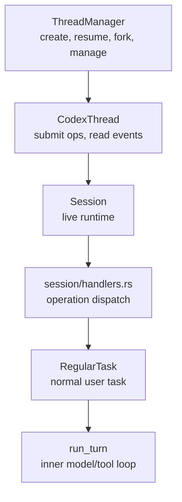

The turn loop is not the public API. It is an internal worker below the session/task architecture.

## Normal User Turn Path

A normal user turn follows this shape:

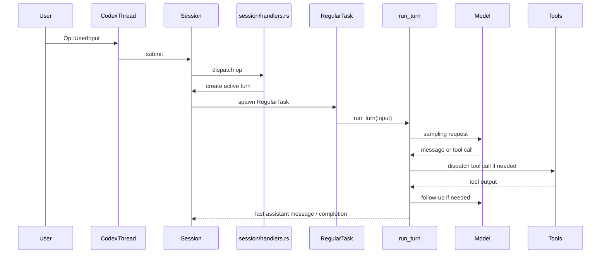

This matters because a real harness has two loops:

1. The outer runtime loop accepts operations, manages tasks, handles interrupts, tracks input queues, and emits events.
2. The inner turn loop samples the model, dispatches tools, records outputs, and decides whether another sampling request is needed.

A one-shot prompt wrapper skips the outer runtime loop. That is why it does not behave like Codex or Claude Code.

## Turn-Loop Checkpoint

Pass 1 owns the detailed turn-loop explanation. This pass only records the spine verified against current source:

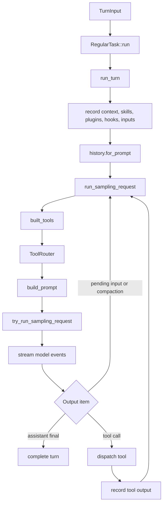

Current-source details that Pass 0 should not miss:

- `RegularTask::run` emits `TurnStarted`, consumes startup prewarm if available, calls `run_turn`, then loops again if the input queue still has pending input.
- `run_turn` handles pre-sampling compaction, context updates, skills/plugins, hooks, input recording, connector selection, prior turn settings, history preparation, pending input, token status, and follow-up conditions.
- `run_sampling_request` rebuilds the tool router for a sampling request, starts the code-mode worker, builds the prompt, and retries retryable stream failures.
- `built_tools` gathers MCP tools, plugin app connectors, discoverable tools, extension tool executors, and dynamic tools before creating `ToolRouter`.
- `build_prompt` attaches model-visible tool specs, base instructions, personality, output schema, strictness, and parallel-tool-call capability.
- `try_run_sampling_request` streams model events, maps output items, dispatches tool calls, records messages, tracks token and diff emission, and decides whether follow-up sampling is needed.

Freeflow implication:

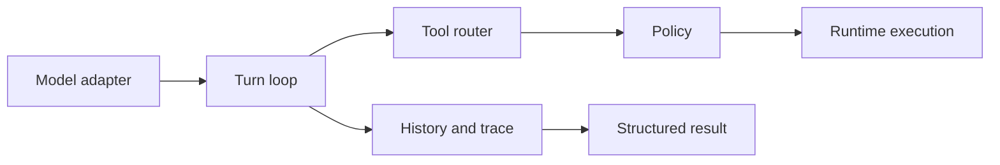

A local model adapter plugs below the turn loop. It does not replace the harness.

## State And Services Map

`core/src/state/` splits mutable session memory from capability providers and active-turn bookkeeping.

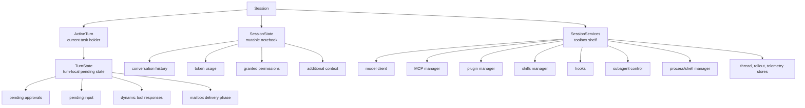

Beginner version:

- `SessionState` is the notebook.
- `SessionServices` is the set of service handles.
- `TurnState` is the checklist for the currently running turn.

Freeflow lesson: do not put all of this into one `Agent` class. State and service boundaries keep the harness understandable.

## Context And History

Codex separates context fragments from recorded history.

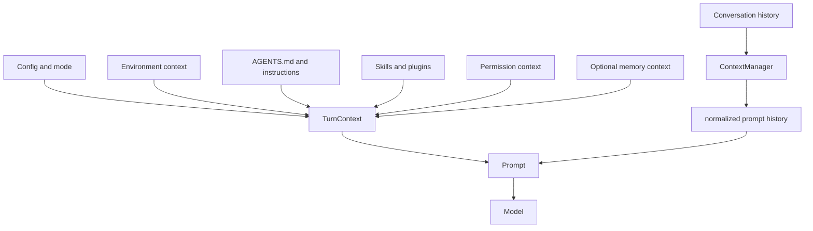

The key design lesson:

```text
Recorded history is not the same thing as model prompt input.
```

Pass 6 owns the full memory/context explanation. Pass 0 only needs the boundary: prompt assembly is a real subsystem, not ad hoc string concatenation.

## Tool Boundary Map

The tool system is one of the clearest differences between an LLM wrapper and an agent.

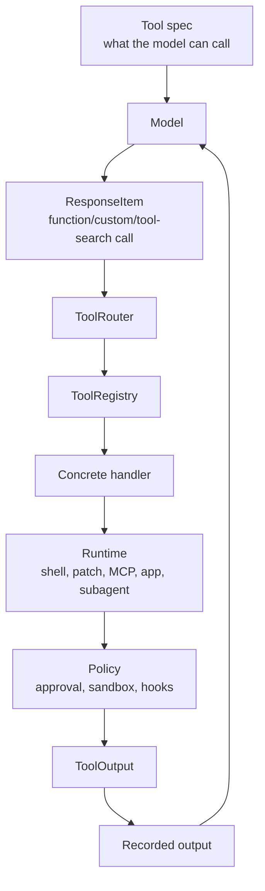

Important split:

- Tool spec: model-visible description and schema.
- Tool router: maps response items to calls.
- Tool registry: knows handlers, exposure, parallel support, diff consumers, lifecycle behavior.
- Tool handler: concrete implementation.
- Tool runtime: lower-level execution machinery.
- Tool policy: approvals, sandboxing, hooks, telemetry, visibility.
- Tool output: structured result returned to the model and/or client.

Tool exposure also matters:

- Direct tools are visible to the model.
- Hidden/internal tools can be registered without direct model visibility.
- Deferred tools can be discovered or exposed indirectly.
- Hosted tools may be provider-side rather than locally executed.
- Dynamic and extension tools can be added at runtime.

Freeflow lesson: local harness tools should be small, explicit, and policy wrapped. A local model should not receive arbitrary shell authority just because it can produce text.

## Execution And Safety

Execution and safety are spread across several crates because host access is high risk.

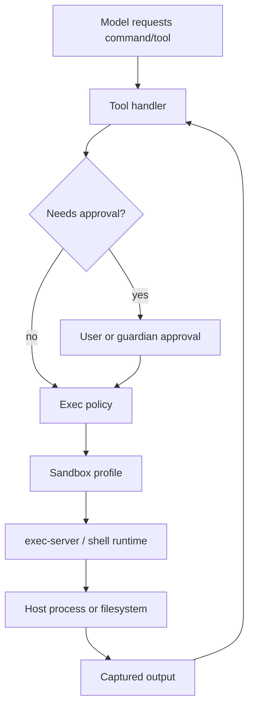

Relevant areas:

- `sandboxing/`
- `linux-sandbox/`
- `windows-sandbox-rs/`
- `bwrap/`
- `exec-server/`
- `shell-command/`
- `shell-escalation/`
- `execpolicy/`
- `execpolicy-legacy/`
- `process-hardening/`
- `core/src/sandboxing/`
- `core/src/tools/sandboxing.rs`

Codex separates policy from enforcement. The harness can describe permissions in one place while platform adapters enforce them differently.

Freeflow lesson: configuration is part of the harness architecture. Runtime config must describe what the local worker can do, not only which model URL to call.

## Model And Provider Layer

Model access is a boundary below the turn loop.

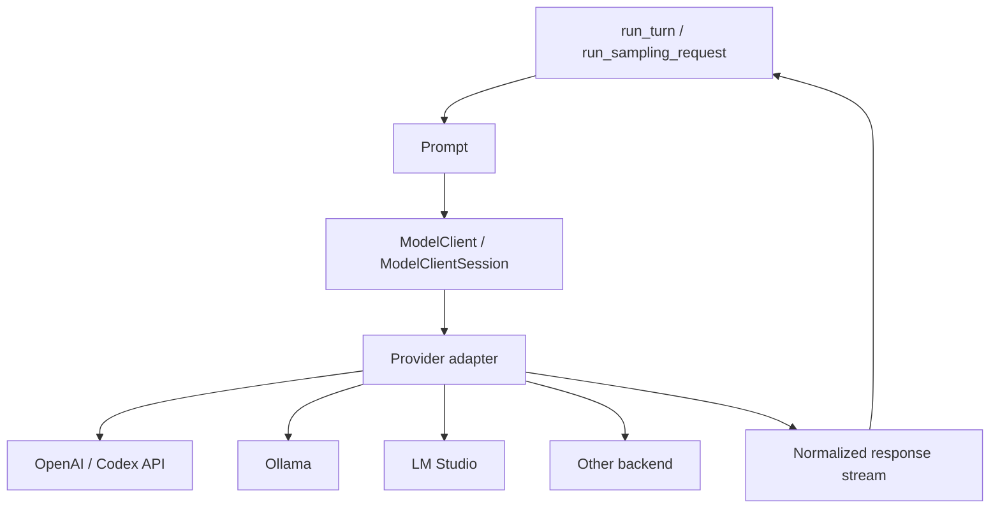

Relevant areas:

- `model-provider/`
- `model-provider-info/`
- `models-manager/`
- `codex-api/`
- `codex-client/`
- `backend-client/`
- `responses-api-proxy/`
- `ollama/`
- `lmstudio/`
- `aws-auth/`

Important caveat:

```text
Provider support is not the agent.
Provider support is how the harness talks to a model.
```

For Freeflow, Ollama, LM Studio, MLX server, and cloud providers should all look like model adapters from the harness point of view.

## Extensibility

Codex grows through MCP, skills, plugins, apps, hooks, dynamic tools, and extensions.

```mermaid
flowchart TD
    Core["codex-core"] --> MCP["codex-mcp / rmcp-client / ext/mcp"]
    Core --> Skills["skills / core-skills / ext/skills"]
    Core --> Plugins["plugin / core-plugins"]
    Core --> Apps["apps and connectors"]
    Core --> Hooks["hooks and hook_runtime"]
    Core --> Extensions["ext/*"]
    Extensions --> MemoryExt["ext/memories"]
    Extensions --> WebSearch["ext/web-search"]
    Extensions --> Guardian["ext/guardian"]
    Extensions --> Goal["ext/goal"]
    Extensions --> ImageGen["ext/image-generation"]
```

This is advanced architecture. It matters later, but a first Freeflow local harness should not copy the whole extension surface.

Freeflow v0 should prefer:

- a small fixed tool set
- explicit runtime policy
- simple task packet schema
- traceable results
- optional adapters behind stable interfaces

## Agent Collaboration

Codex subagents are real child threads, not informal prompts.

```mermaid
flowchart TD
    Parent["Parent session"] --> Spawn["spawn_agent"]
    Spawn --> AgentControl["agent/control"]
    AgentControl --> Child["Child Codex thread"]
    Child --> Status["status watcher"]
    Parent --> Message["send_message / followup_task"]
    Message --> Child
    Parent --> Wait["wait_agent"]
    Wait --> Status
    Parent --> Interrupt["interrupt_agent"]
    Interrupt --> Child
    Child --> Mailbox["inter-agent mailbox"]
    Mailbox --> Parent
```

Relevant areas:

- `agent-identity/`
- `agent-graph-store/`
- `external-agent-migration/`
- `external-agent-sessions/`
- `core/src/agent/`
- `core/src/codex_delegate.rs`
- `core/src/tools/handlers/multi_agents*`
- `core/src/session/input_queue.rs`
- `protocol::Op::InterAgentCommunication`

Current source has both legacy and V2 multi-agent handler surfaces. The model-visible V2 surface includes plain tool names such as:

- `spawn_agent`
- `send_message`
- `followup_task`
- `wait_agent`
- `interrupt_agent`
- `list_agents`

The hidden machinery is larger:

- child thread creation
- parent/child metadata
- role config layers
- forked context selection
- depth and thread limits
- mailbox delivery
- status watching
- event forwarding
- approval routing
- cleanup when child agents finish or die

Freeflow lesson: if the local harness is meant to act as a local worker, it needs a bounded child-job abstraction with status and result collection. A raw local-model function call is not enough.

## Roles Instead Of Duplicated Profiles

Codex subagents can be shaped through role/config layers.

```mermaid
flowchart LR
    BaseConfig["Base config"] --> Role["Role config"]
    Role --> Effective["Effective child config"]
    Effective --> ChildAgent["Child agent"]
    Role --> Model["model / effort / tier"]
    Role --> Instructions["developer instructions"]
    Role --> Policy["tool and runtime policy"]
```

The practical design lesson is not "copy Codex roles." It is:

```text
Prefer capability tags and config layers over duplicated static profiles.
```

For Freeflow, a local worker role should be a constrained runtime policy plus task packet shape, not a pasted prompt repeated under every model profile.

## Persistence And Traceability

Production agents need to answer "what happened?"

```mermaid
flowchart TD
    Session["Live session"] --> ThreadStore["thread-store"]
    Session --> Rollout["rollout"]
    Session --> Trace["rollout-trace"]
    Session --> StateDB["state crate / DB"]
    Rollout --> Replay["reconstruct or inspect history"]
    Trace --> Debug["debug model/tool behavior"]
    StateDB --> Durable["durable metadata and jobs"]
```

For Freeflow local delegation, the simpler v0 equivalent is:

- one trace directory per local run
- task packet saved
- selected context saved
- tool calls saved
- policy denials saved
- final structured result saved
- orchestrator verification notes saved

Do not rely on final chat text as the only record.

## Current-Source Delta

The high-level Pass 0 architecture still holds, but the current source makes several corrections necessary.

```mermaid
flowchart TD
    Original["Original Pass 0"] --> Stable["Still stable"]
    Original --> NeedsUpdate["Needed correction"]
    Stable --> Core["core is main harness"]
    Stable --> Protocol["protocol separates Ops and Events"]
    Stable --> TurnLoop["RegularTask -> run_turn"]
    Stable --> Tools["tool specs and handlers are separated"]
    Stable --> Safety["policy and sandboxing are separate from execution"]
    NeedsUpdate --> AppSplit["app-server is now a family of crates"]
    NeedsUpdate --> ToolCrate["codex-rs/tools is shared primitives, not all runtime behavior"]
    NeedsUpdate --> CrateGrowth["workspace has more support crates"]
    NeedsUpdate --> InterAgent["InterAgentCommunication is now explicit protocol input"]
    NeedsUpdate --> CodeMode["code-mode deserves mention in current map"]
    NeedsUpdate --> OriginMain["current audit read origin/main, not checked-out HEAD"]
```

Notable current-source additions or areas the original map underplayed:

- `analytics`
- `app-server-client`
- `app-server-daemon`
- `app-server-protocol`
- `app-server-test-client`
- `app-server-transport`
- `backend-client`
- `cloud-config`
- `cloud-tasks*`
- `code-mode`, `code-mode-host`, `code-mode-protocol`
- `core-api`
- `external-agent-migration`
- `external-agent-sessions`
- `responses-api-proxy`
- `response-debug-context`
- many `utils/*` crates

This does not mean Pass 0 should become a full inventory. It means the map should teach categories and call out current areas that materially affect harness understanding.

## Audit Findings

### Finding 1: The original document used non-Mermaid diagrams

The original artifact relied heavily on ASCII trees and arrow diagrams. Those were useful for quick note taking but weak for a research artifact meant to teach architecture.

Resolution: replaced structural diagrams with Mermaid and added a diagram map.

### Finding 2: The source snapshot was historically correct but no longer current

The original snapshot was `b65fe3d`. The refreshed upstream audit is `0fed449`.

Resolution: keep the original snapshot as historical research provenance and add a current-source audit layer.

### Finding 3: The crate inventory was too static

Some repo/crate descriptions were already stale against current `origin/main`, especially the app-server split and support crates.

Resolution: use durable groups, then list notable current deltas where they matter.

### Finding 4: Pass 0 leaked too much later-pass detail

The original Pass 0 tried to explain core state, tools, subagents, review-as-subagent, config, and turn-loop behavior in detail.

Resolution: keep map-depth explanations and point to Passes 1-7 for mechanism-level detail.

### Finding 5: `codex-rs/tools` needed a sharper explanation

The original text could be read as if the `tools` crate owned concrete runtime tool behavior.

Resolution: clarify that `codex-rs/tools` owns shared primitives while `core/src/tools` owns the core router, registry, handlers, and runtimes.

### Finding 6: State naming can mislead readers

There is both `codex-rs/core/src/state` and a workspace `codex-rs/state` crate. They are not the same boundary.

Resolution: explain core-local state separately from persistent state/DB support.

### Finding 7: Turn-loop source checkpoint was missing current details

Pass 0 did not need a full turn-loop deep dive, but it needed a verified current spine.

Resolution: added `Turn-Loop Checkpoint` with the current `RegularTask::run` -> `run_turn` -> `run_sampling_request` -> `built_tools` -> `build_prompt` -> `try_run_sampling_request` path.

### Finding 8: Inter-agent communication is now more explicit

Current protocol includes `Op::InterAgentCommunication`, and agent messages appear as structured `AgentMessage` response items/events.

Resolution: add this to the subagent and protocol maps.

## What Matters Most For Freeflow

Study first:

1. `core/src/session/turn.rs`
   - how model calls, streamed items, tool calls, tool outputs, pending input, retries, compaction, and stop conditions interact

2. `core/src/tools/` and `codex-rs/tools/`
   - how tools are described, registered, dispatched, exposed, and returned to the model

3. `protocol/`
   - how agent work becomes structured operations and events

4. `config/`, `sandboxing/`, `execpolicy/`, and execution crates
   - how user/runtime policy becomes enforceable behavior

5. `model-provider/`, `model-provider-info/`, `models-manager/`, `ollama/`, `lmstudio/`
   - how provider adapters work and why local model support is below the harness

6. `core/src/agent/` and `core/src/tools/handlers/multi_agents*`
   - how subagents are spawned, tracked, messaged, waited on, and interrupted

7. `context/`, `context_manager/`, `memories/read`, `memories/write`, `ext/memories`
   - how prompt input differs from raw transcript history and durable memory

## What To Ignore For Now

Defer these until the harness design needs them:

- full app-server protocol details
- full SDK internals
- plugin marketplace mechanics
- cloud task execution
- rich memory write pipeline
- Windows-specific sandbox internals
- Bazel packaging details
- release scripts
- V8/WebRTC experiments
- remote environment machinery
- complete extension marketplace behavior

These are valuable later, but they make the first harness mental model too noisy.

## Freeflow Local Harness Translation

Codex's production architecture is larger than Freeflow needs. The point is to borrow boundaries, not complexity.

```mermaid
flowchart TD
    Codex["Codex production harness"] --> Lesson["Boundary lessons"]
    Lesson --> Packet["LocalTaskPacket"]
    Lesson --> Adapter["Model adapter"]
    Lesson --> Loop["Small turn loop"]
    Lesson --> Tools["Small tool router"]
    Lesson --> Policy["Strict policy wrapper"]
    Lesson --> Trace["Trace directory"]
    Lesson --> Result["Structured local result"]
    Result --> Orchestrator["Frontier orchestrator verifies"]
```

Freeflow v0 should probably be:

- packet-first, not transcript-first
- read-only by default
- explicit about allowed files/tools
- small enough to inspect
- traceable enough to distrust
- model-agnostic but MLX-friendly
- frontier-orchestrator-authoritative

The local worker should return evidence and uncertainty, not just a confident answer.

```mermaid
flowchart LR
    Orchestrator["Frontier agent"] --> Packet["LocalTaskPacket"]
    Packet --> LocalHarness["Local harness"]
    LocalHarness --> LocalModel["Local model"]
    LocalHarness --> ReadTools["Allowed read/search tools"]
    LocalHarness --> Trace["Trace"]
    LocalHarness --> LocalResult["LocalResult<br/>answer, evidence, uncertainty"]
    LocalResult --> Orchestrator
    Orchestrator --> Verify["Verify or reject"]
```

## First Production-Code Lesson

This repo is not "one clean agent file."

Real production agent code separates:

- user surfaces
- protocol
- session lifecycle
- model calls
- tool definitions
- tool execution
- permissions
- sandboxing
- context and memory
- persistence
- observability
- extensions
- packaging

The repo also shows a normal production pressure: the core crate has many responsibilities and must resist becoming the place where every new feature lands.

For Freeflow:

```text
Start with a small deep harness.
Do not create a giant local-agent core that everything falls into.
```

## What To Study Next

Pass 1 should remain the detailed turn-loop source:

- how `Prompt` is built
- how tools are attached
- how streaming response events are parsed
- how tool calls are detected
- how tool calls are executed
- how tool outputs are fed back to the model
- how the loop decides to continue or stop
- how history and token usage are updated
- how cancellation and errors flow
- how pending input and inter-agent mail can alter the turn

Do not mix that with full tool-system or subagent internals. `run_turn` alone is rich enough for a separate pass.

## Running Study Index

The directory README is the canonical pass index and roadmap:

```text
docs/research/codex-cli-agent-harness/README.md
```

Completed in this artifact:

- Pass 0A: top-level repo map and orientation.
- Pass 0B: `codex-rs/` and `codex-rs/core/` orientation.
- Pass 0C: current-source audit against fetched `origin/main`.

Completed pass order:

- Pass 1: turn loop.
- Pass 2: tool system.
- Pass 3: sandboxing and permissions.
- Pass 4: subagents and delegation.
- Pass 5: model providers and runtime adapters.
- Pass 6: memory and context.
- Pass 7: config and extensibility.

Remaining work is comparison research, then the Freeflow local harness design spec.

## Source Evidence Appendix

Current audit source:

```text
repo: openai/codex
ref: origin/main
commit: 0fed4497f50ad5f0b2f7972a1bfd14c5a09a85c5
```

Historical source:

```text
repo: openai/codex
checked-out commit: b65fe3d8976d6fcc44ee6c6cf988654af5fc4d2d
```

Commands used for this audit:

```text
git -C /private/tmp/openai-codex-study-pass0 fetch origin
git -C /private/tmp/openai-codex-study-pass0 log -1 origin/main --oneline --decorate --date=iso --format='%h %H %ad %s'
git -C /private/tmp/openai-codex-study-pass0 ls-tree -d --name-only origin/main
git -C /private/tmp/openai-codex-study-pass0 ls-tree --name-only origin/main:codex-rs/core/src/session
git -C /private/tmp/openai-codex-study-pass0 diff --stat b65fe3d8976d6fcc44ee6c6cf988654af5fc4d2d..origin/main -- codex-rs
```

Primary source areas checked:

- `codex-rs/Cargo.toml`
- `codex-rs/core/src/tasks/regular.rs`
- `codex-rs/core/src/session/turn.rs`
- `codex-rs/core/src/session/handlers.rs`
- `codex-rs/core/src/session/input_queue.rs`
- `codex-rs/core/src/session/turn_context.rs`
- `codex-rs/core/src/state/session.rs`
- `codex-rs/core/src/state/service.rs`
- `codex-rs/core/src/state/turn.rs`
- `codex-rs/core/src/tools/router.rs`
- `codex-rs/core/src/tools/spec_plan.rs`
- `codex-rs/core/src/tools/handlers/`
- `codex-rs/tools/src/lib.rs`
- `codex-rs/protocol/src/protocol.rs`
- `codex-rs/protocol/src/models.rs`
- `codex-rs/core/src/agent/`
- `codex-rs/core/src/codex_delegate.rs`

Important verified functions and types:

- `RegularTask::run`
- `run_turn`
- `run_sampling_request`
- `built_tools`
- `build_prompt`
- `try_run_sampling_request`
- `ToolRouter`
- `ToolRouterParams`
- `SessionState`
- `SessionServices`
- `ActiveTurn`
- `TurnState`
- `InputQueue`
- `Op`
- `Event`
- `EventMsg`
- `InterAgentCommunication`
- `AgentMessage`

## Open Questions

These belong to future Freeflow design, not this repo map:

1. Should the first Freeflow local harness be Python, TypeScript, Rust, or a thin wrapper around a smaller runtime?
2. Should local workers ever write files directly, or only propose patches?
3. Should the first local worker have MCP exposure, or should it be a private CLI/tool only?
4. How much of a local worker trace should be injected back into the frontier context by default?
5. Which benchmark proves that local delegation saves tokens without reducing correctness?

## Change Log

- 2026-06-12: Added Pass 0A repo map and Pass 0B `codex-rs/core` orientation.
- 2026-06-14: Reworked Pass 0 structure, replaced ASCII architecture diagrams with Mermaid, added source snapshot drift handling, current-source audit against `origin/main` `0fed449`, corrected app-server/tool/state map nuances, added a turn-loop checkpoint without duplicating Pass 1, and clarified Freeflow local harness lessons.
