# Codex CLI Agent Harness Study - Pass 1 Turn Loop

> **Doc ID:** RESEARCH-2026-06-12-codex-cli-agent-harness-pass-1
> **Date:** 2026-06-12
> **Last audit:** 2026-06-14
> **Owner:** Hassan Mohiddin
> **Type:** Research
> **Status:** Draft, audited
> **Source:** `openai/codex` source snapshot `b65fe3d8976d6fcc44ee6c6cf988654af5fc4d2d`; current upstream check at `0fed4497f50ad5f0b2f7972a1bfd14c5a09a85c5`; Pass 0 repo map; Pass 6 memory/context artifact; Freeflow local delegation design discussion.

## Purpose

Preserve the Pass 1 research into Codex's turn loop: the part of the harness that turns a model into an agent by repeatedly sampling the model, executing tools, recording results, and deciding whether the turn is finished.

This document is intentionally beginner-friendly, but it should not be shallow. It starts with the mental model a student needs, then keeps the code-level mechanics, edge cases, dependencies, and source evidence required for research and future implementation work.

This is research memory, not an implementation plan. It should inform future Freeflow local delegation design, but it does not define shipped Freeflow behavior.

## How To Read This

If this is your first pass, read only:

- `If You Only Read 10 Minutes`
- `Core Idea`
- `Tiny Diagram`
- `Glossary`
- `One Turn In Plain English`
- `What Freeflow Should Borrow`

If you are designing the local harness, also read:

- `Audit Scope And Current Upstream Check`
- `Deep Mechanism`
- `Prompt Construction`
- `Model Adapter Boundary`
- `Tool Execution`
- `State, Queues, And History`
- `Compaction`
- `Stop Conditions`
- `What Not To Copy Yet`

If you are implementing or reviewing later, use:

- `Behavioral Evidence From Tests`
- `Source Evidence Appendix`
- the current `openai/codex` source, refreshed again before implementation

## Diagram Map

Use the diagrams as checkpoints. They do not replace the source notes.

| If you are trying to understand... | Start with... |
| --- | --- |
| Why an agent is not just a model wrapper | `Core Idea` |
| The whole turn-loop shape | `Tiny Diagram` |
| How one user request can contain several model calls | `One Turn In Plain English` |
| The task loop, turn loop, and stream loop | `The Three Nested Loops` |
| Prompt construction and provider boundaries | `Prompt Construction` and `Model Adapter Boundary` |
| How tools are detected, run, and fed back | `Tool Execution` |
| Why pending input and mailbox state exist | `Input Queue And Mailbox Delivery` |
| Why the loop can continue after a model response completes | `Stop Conditions` |
| What Freeflow should copy for a local harness | `What Freeflow Should Borrow` |

## If You Only Read 10 Minutes

A local LLM by itself is only a text generator. The harness is what turns that generator into an agent.

The turn loop is the harness core:

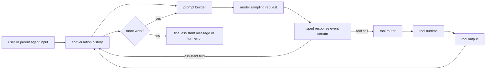

The key lesson:

```text
Build a loop, not a wrapper.
```

A wrapper asks the model once. A turn loop keeps going until tools, pending input, compaction, stop hooks, cancellation, and errors have all reached a stable boundary.

The most important implementation point is this:

```text
Tool output is not just shown to the user.
It is recorded into history, then sent back to the model in a later sampling request.
```

That is how the model can inspect files, react to command output, patch code, retry after errors, and produce a final answer based on real evidence.

## Audit Scope And Current Upstream Check

The original Pass 1 source snapshot was:

```text
repo: openai/codex
commit: b65fe3d8976d6fcc44ee6c6cf988654af5fc4d2d
short: b65fe3d
commit date: 2026-06-12
commit title: fix: serialize auth environment tests (#27879)
local path used during research: /private/tmp/openai-codex-study-pass0
```

For this audit, the same clone was fetched and compared against:

```text
repo: openai/codex
ref checked: origin/main
commit: 0fed4497f50ad5f0b2f7972a1bfd14c5a09a85c5
short: 0fed449
commit date: 2026-06-13
commit title: [codex] Carry exec-server cwd as PathUri (#28032)
audit date: 2026-06-14
```

Relevant files changed between the original snapshot and the current upstream check:

- `codex-rs/core/src/client.rs`
- `codex-rs/core/src/client_common.rs`
- `codex-rs/core/src/hook_runtime.rs`
- `codex-rs/core/src/session/input_queue.rs`
- `codex-rs/core/src/session/tests.rs`
- `codex-rs/core/src/session/turn.rs`
- `codex-rs/core/src/stream_events_utils.rs`
- `codex-rs/protocol/src/models.rs`

Current-source audit result:

- The core architecture still matches this document: `RegularTask::run` calls `run_turn`; `run_turn` loops sampling requests; `run_sampling_request` builds tools and prompt; `try_run_sampling_request` consumes one model stream; completed tool calls become futures; tool outputs are drained and recorded for the follow-up.
- The original doc under-explained mailbox delivery. Current source makes `InterAgentCommunication` its own `TurnInput` variant and records it through `record_inter_agent_communication`, which converts it to a model-visible `AgentMessage`.
- The original doc under-explained prompt strictness. `build_prompt` sets `output_schema_strict` to false for guardian reviewer source and true otherwise.
- The original doc risked implying Codex serializes shell. It does not in the tested path: current tests assert shell tools can run in parallel. Freeflow can still choose to serialize shell in a conservative local harness, but that is a Freeflow v0 policy choice, not a Codex fact.
- The original doc did not call out the code-mode worker started per sampling request. That worker is part of the current runtime boundary even though a Freeflow v0 local harness should not copy it first.
- The current source moved some inter-agent formatting out of `Prompt::get_formatted_input_for_request`; inter-agent communication is now recorded into history earlier as an `AgentMessage`.
- No current-source change invalidated the main turn-loop conclusions.

## Core Idea

A model wrapper is simple:

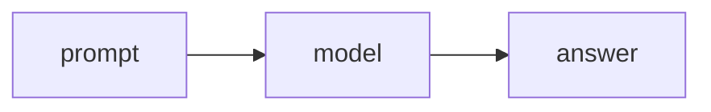

An agent loop is different:

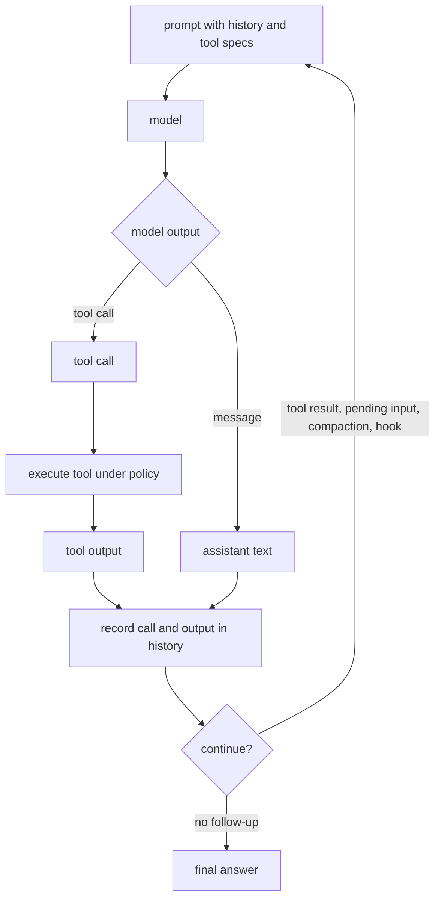

An agent harness is the runtime around the model that can:

- keep conversation history
- expose model-visible tool specs
- detect completed tool-call items
- execute tools through safe runtime paths
- record tool calls and tool outputs
- call the model again with the new evidence
- enforce policy, sandboxing, approvals, hooks, and cancellation
- compact context when the next step would exceed limits
- emit events so a UI, another agent, or a human can inspect what happened

That loop is the difference between "Gemma responds in terminal" and "Gemma acts like a small coding/research subagent."

## Tiny Diagram

This is the simplified Codex turn-loop shape:

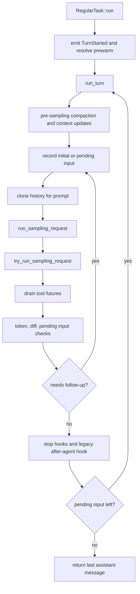

Codex has many systems around this, but this is the load-bearing loop.

## Glossary

`Agent harness`
: The runtime that surrounds a model and gives it tools, memory/history, policy, and a loop.

`Turn`
: One unit of agent work started by user input, pending input, subagent message, or task continuation. A single user message can produce multiple internal model requests.

`Sampling request`
: One call to the model. Codex may make several sampling requests inside one turn if tools run, pending input arrives, compaction happens, or hooks request continuation.

`Prompt`
: The model request object. In Codex it includes history, tool specs, base instructions, personality, output schema, strict-schema behavior, and parallel-tool settings.

`Response event`
: A streamed typed event from the model provider, such as output item added, output item done, text delta, tool-call input delta, reasoning delta, rate limits, model metadata, or completed.

`Response item`
: A completed model-visible item, such as assistant message, reasoning, function call, custom tool call, tool output, agent message, web search call, image generation call, or compaction item.

`Tool router`
: The object that maps a model's tool-call item to the correct internal tool handler.

`Tool runtime`
: The execution layer that runs the tool handler, handles cancellation, parallelism, tracing, hooks, and output conversion.

`History`
: The persisted model-visible transcript. Tool calls and tool outputs are both recorded so the next model request can reason from them.

`Follow-up`
: A signal that the model must be called again, usually because a tool ran, a model response used `end_turn: false`, pending input exists, compaction occurred, or a stop hook requested continuation.

## One Turn In Plain English

Imagine the user asks Codex to inspect a file.

Codex does not simply ask the model once.

It does this:

1. Store the user's message in history.
2. Build a prompt that includes relevant history, instructions, and available tools.
3. Ask the model what to do next.
4. The model may respond with a tool call like `shell_command` or `apply_patch`.
5. Codex records that tool call in history.
6. Codex runs the tool through the router/runtime/policy layer.
7. Codex records the tool output in history.
8. Codex asks the model again, now with the tool output visible.
9. The model may ask for another tool, produce more text, or finish.
10. Codex stops only when no tool follow-up, pending input, compaction continuation, stop-hook continuation, or fatal path remains.

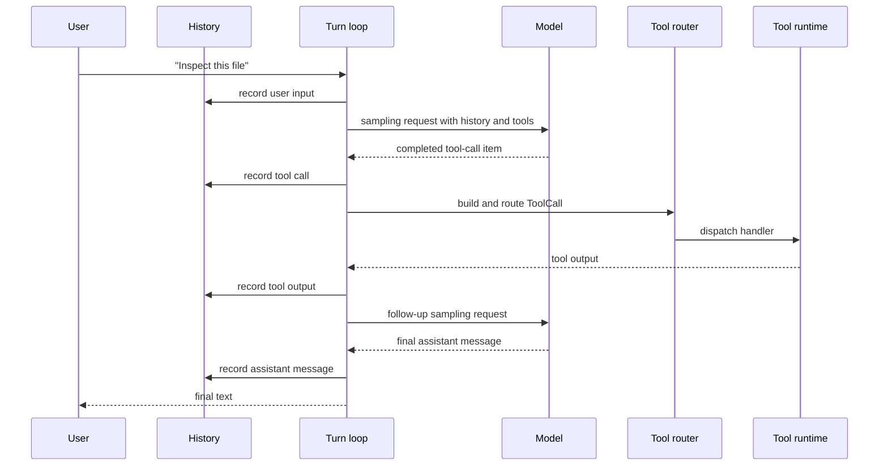

The important part is that the tool output is not just returned to the user. It is fed back to the model as part of the next model request.

That is how the model can do multi-step work.

## Deep Mechanism

### The Three Nested Loops

Codex's turn behavior is easiest to understand as three nested loops:

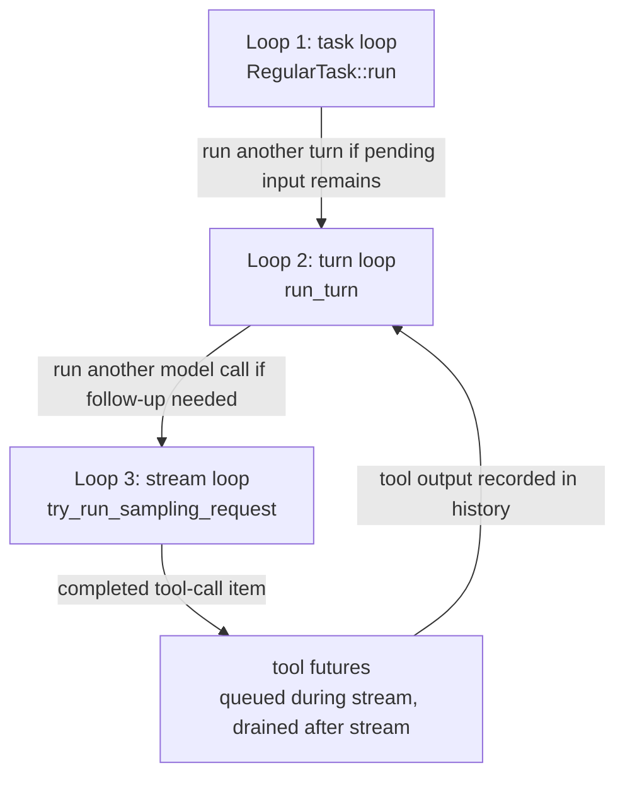

The loops have different jobs:

- The task loop decides whether another turn should run.
- The turn loop decides whether another model call should happen inside the same turn.
- The stream loop handles one model response stream and queues tools as completed output items arrive.

### Loop 1: `RegularTask`

`RegularTask` is the normal user-facing task runner.

Its job is:

- emit `TurnStarted` inline
- reset server-reasoning state
- resolve any prewarmed model session
- call `run_turn`
- after `run_turn` returns, check whether pending input still exists
- if pending input exists, call `run_turn` again with empty initial input

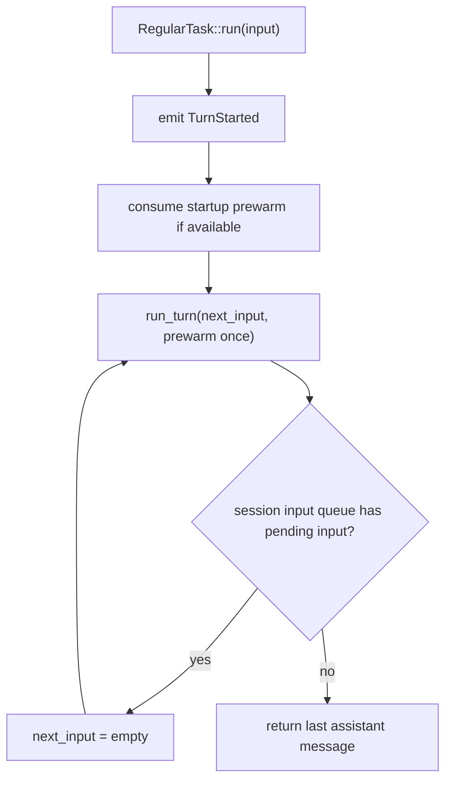

Why it matters:

One user request is not necessarily one internal turn. The agent might finish a visible response while user or subagent input arrived during the run. Codex keeps draining that work in a controlled way.

Source:

- `codex-rs/core/src/tasks/regular.rs`

### Loop 2: `run_turn`

`run_turn` is the main turn state machine.

It accepts:

- the live `Session`
- the per-turn `TurnContext`
- turn-scoped extension data
- initial turn input
- an optional prewarmed model session
- cancellation token

Its job is:

- run pre-sampling compaction when needed
- record context updates
- build skill/plugin/extension injections
- run session-start and user-prompt hooks
- record inputs and injections into history
- merge connector selection
- track previous-turn model settings
- build model-visible history
- call `run_sampling_request`
- decide whether to continue
- start a new context window or run auto-compaction when needed
- run stop hooks and legacy after-agent hook
- return the last assistant message if available

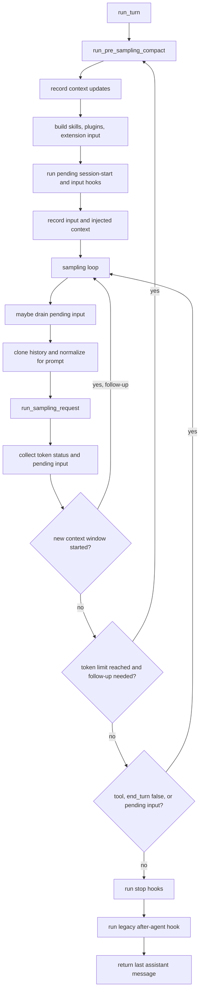

Important behavior:

- Pre-turn compaction happens before context updates and new user input are recorded. The source has a TODO noting this can miss incoming context size and should eventually estimate pending items.
- Pending input is not always drained immediately. Fresh initial input gets sampled first, and after auto-compaction the model/tool continuation resumes before a steer is drained.
- The same turn-scoped `ModelClientSession` is reused across retries and compaction paths.
- `run_sampling_request` has its own retry loop. On retryable stream errors, Codex can back off, notify the UI, reuse the session, rebuild prompt input from current history after the first attempt, and eventually fall back from WebSocket to HTTPS transport.
- `run_turn` records token usage and context-window pressure after sampling.
- `run_turn` can continue because of model tool follow-up, `end_turn: false`, pending input, context-window handling, or stop hooks.
- `InvalidImageRequest` has a special recovery path: Codex attempts to sanitize the last turn's images and retry before surfacing the error.

Source:

- `codex-rs/core/src/session/turn.rs`
- `codex-rs/core/src/responses_retry.rs`

### Loop 3: `try_run_sampling_request`

`try_run_sampling_request` handles one model response stream.

Its job is:

- send a `Prompt` to the model through `ModelClientSession`
- consume typed `ResponseEvent` values
- emit UI/protocol events
- track active streamed items
- stream assistant text/reasoning/tool-argument deltas
- detect completed tool-call items
- queue tool execution futures
- record assistant messages, reasoning, tool calls, and metadata
- record token usage when the response completes
- drain tool futures after the model stream boundary
- record tool outputs into history
- emit token counts only after pending tool futures resolve
- emit turn diffs after the tool drain
- handle plan-mode output parsing and extension turn-item contributors
- return whether the model needs a follow-up

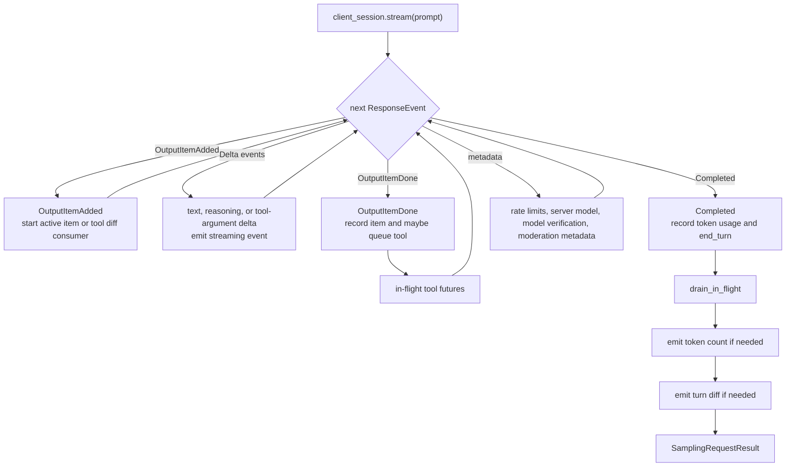

This loop is why Codex can start tool execution before the whole model response is complete. A completed tool-call item is actionable as soon as it arrives, even if `response.completed` arrives later.

Two subtle boundaries matter:

- Completed non-tool items are recorded immediately so history and rollout stay in sync even if the turn is later cancelled.
- Tool outputs are not recorded when the tool future is created. They are recorded when `drain_in_flight` resolves the futures after the stream boundary. Codex delays token-count emission until after that drain so tools like `request_user_input` do not create misleading progress events while the turn is intentionally waiting.

Source:

- `codex-rs/core/src/session/turn.rs`
- `codex-rs/core/src/stream_events_utils.rs`

## Prompt Construction

Codex builds a `Prompt` object before calling the model.

`run_sampling_request` also rebuilds the `ToolRouter` for the sampling request. That means the available model-visible tools are not a global static list; they are derived from current config, MCP state, plugin/app exposure, discoverable tools, extension tools, and dynamic tools in the `TurnContext`.

The important fields are:

- `input`: conversation history visible to the model
- `tools`: model-visible tool specs
- `parallel_tool_calls`: whether the model may emit parallel tool calls
- `base_instructions`: system/developer-level instructions
- `personality`: optional behavior style
- `output_schema`: optional final output schema
- `output_schema_strict`: strict schema validation, except disabled for guardian reviewer source

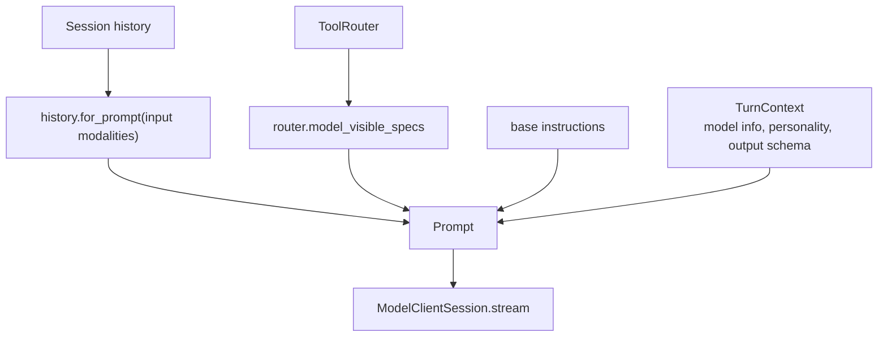

A simplified local harness prompt type could be:

```text
LocalAgentPrompt:
  messages
  tool_specs
  system_instructions
  output_schema
  max_tokens
  model_capabilities
```

Then each model adapter translates this into the provider-specific request.

Why this matters for Freeflow:

The local harness should have a similarly clean prompt boundary. The turn loop should not know whether the model is OpenAI, Anthropic, Ollama, LM Studio, MLX, or something else.

Source:

- `codex-rs/core/src/client_common.rs`
- `codex-rs/core/src/session/turn.rs`
- `codex-rs/core/src/tools/router.rs`

## Model Adapter Boundary

Codex currently uses the Responses API shape internally. The important design pattern is not "use Responses API." The important design pattern is:

```text
Normalize provider output into typed internal events.
```

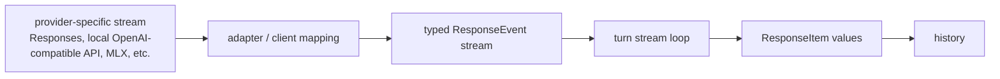

Codex uses typed events such as:

- `Created`
- `OutputItemAdded`
- `OutputItemDone`
- `OutputTextDelta`
- `ToolCallInputDelta`
- `ReasoningSummaryDelta`
- `ReasoningContentDelta`
- `Completed`
- `RateLimits`
- `ServerModel`
- `ModelVerifications`
- `TurnModerationMetadata`
- `ModelsEtag`

Codex also uses typed response items such as:

- `Message`
- `AgentMessage`
- `Reasoning`
- `LocalShellCall`
- `FunctionCall`
- `CustomToolCall`
- `ToolSearchCall`
- `FunctionCallOutput`
- `CustomToolCallOutput`
- `ToolSearchOutput`
- `WebSearchCall`
- `ImageGenerationCall`
- compaction-related items

Why this matters:

If our local harness exposes raw Ollama chunks everywhere, the rest of the runtime becomes tangled with Ollama behavior. If we later support LM Studio, MLX, vLLM, OpenAI, or Anthropic, every part of the harness would need special cases.

A first Freeflow local harness could use a smaller event set:

```text
LocalAgentEvent:
  message_delta
  tool_call_delta
  tool_call_done
  completed
  error
```

For providers that cannot stream tool-call structure, the adapter can emit the tool call only after the response completes. That is less fast than Codex's ideal path, but still architecturally compatible with better streaming later.

Source:

- `codex-rs/codex-api/src/common.rs`
- `codex-rs/protocol/src/models.rs`
- `codex-rs/core/src/client.rs`

## Tool Execution

### Tool Call Detection

The model emits a completed response item. `ToolRouter::build_tool_call` checks whether that item is a tool call.

It handles:

- normal function calls
- client-side tool search calls
- custom tool calls

If the item is a tool call, it becomes an internal `ToolCall`:

```text
ToolCall:
  tool_name
  call_id
  payload
```

If it is not a tool call, it is handled as assistant text, reasoning, image generation, web search metadata, or another non-tool item.

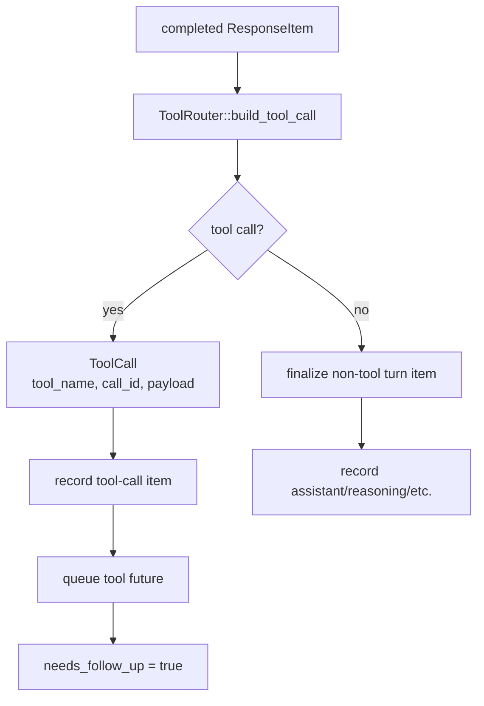

Source:

- `codex-rs/core/src/tools/router.rs`
- `codex-rs/core/src/stream_events_utils.rs`

### Tool Routing

The `ToolRouter` has two main jobs:

1. expose tool specs to the model
2. dispatch actual tool calls to the registered handler

This is a key architecture lesson.

The model-visible tool spec and the local executable tool handler are related, but they should not be the same object everywhere in the code.

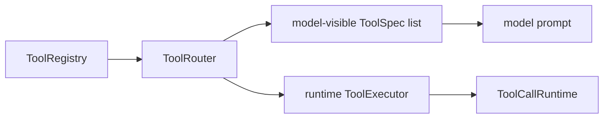

For Freeflow's local harness, keep the same separation:

```text
ToolSpec:
  name
  description
  input_schema
  output_schema
  model_visible

ToolHandler:
  validate(input)
  execute(input, context)
  return ToolOutput
```

Source:

- `codex-rs/core/src/tools/router.rs`
- `codex-rs/core/src/tools/registry.rs`

### Tool Runtime

`ToolCallRuntime` is the execution wrapper around tool dispatch.

It handles:

- cancellation
- parallel execution policy
- tool task spawning
- fallback error response
- aborted tool response
- waiting for runtime cleanup when needed

Tools do not run directly inline inside the stream loop. Codex converts them into futures and stores them in an in-flight queue.

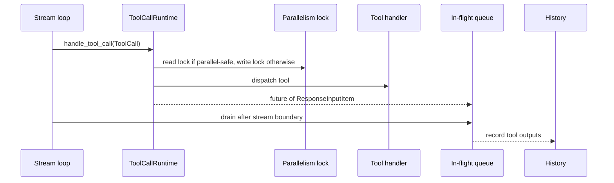

That lets Codex:

- keep consuming the model stream
- run multiple parallel-safe tools together
- wait for all tool outputs at the right boundary
- record outputs in grouped order

Source:

- `codex-rs/core/src/tools/parallel.rs`
- `codex-rs/core/src/session/turn.rs`

### Parallelism

Codex supports per-tool parallelism.

The runtime shape is:

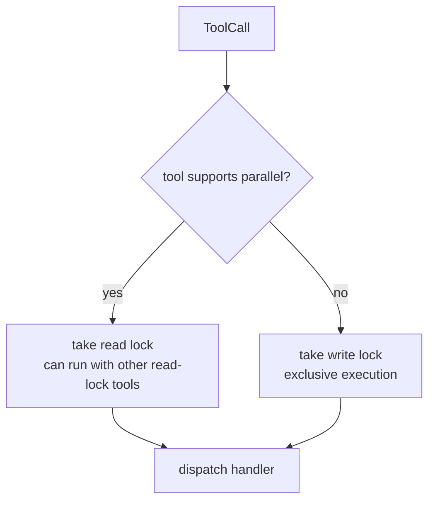

Important audit correction:

Codex tests assert that shell tools can run in parallel in the tested path. So do not describe Codex itself as serializing shell by default.

For Freeflow's first local harness, a conservative policy can still choose:

```text
parallel-safe:
  read_file
  list_files
  grep/search
  inspect metadata

serialized in Freeflow v0 even if Codex can parallelize some of these:
  shell command
  apply_patch
  write_file
  install dependency
  run formatter
```

Why this matters:

Our local harness should be fast, but speed cannot mean unsafe concurrent edits. Codex has a richer registry and test suite; Freeflow v0 should start with stricter defaults and loosen only with evidence.

Source:

- `codex-rs/core/src/tools/parallel.rs`
- `codex-rs/core/tests/suite/tool_parallelism.rs`

### Tool Output

A tool handler returns a typed output. Codex converts that output into a model-visible response item.

Examples:

- function tool output
- MCP tool output
- apply patch output
- exec command output
- aborted tool output

Tool output is not just log text. It is structured enough to:

- show a useful preview in logs
- tell whether execution succeeded
- convert into a model-visible tool-output item
- provide hook-facing input/output
- provide code-mode output when needed
- truncate large command output before sending to the model

For a local harness, every tool should return something like:

```text
ToolResult:
  call_id
  success
  output_for_model
  output_for_log
  metadata
  error_kind
```

This is especially important for small local models because raw tool output can overwhelm context.

Source:

- `codex-rs/core/src/tools/context.rs`
- `codex-rs/core/src/tools/registry.rs`

## State, Queues, And History

### Why State Exists

The harness cannot be stateless because an agent turn has many moving parts:

- active model request
- pending user input
- pending inter-agent mailbox messages
- pending approvals
- pending request-permissions calls
- pending user-input requests
- pending dynamic tools
- granted permissions
- token usage
- history
- cancellation
- turn events
- diff tracking

This is why a one-shot terminal command around a local model is not enough.

### Session State And Turn State

Codex separates long-lived session state from per-turn state.

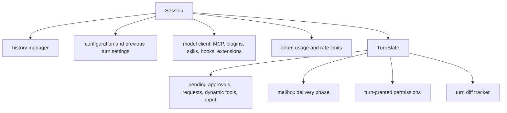

The lesson:

Do not build one giant `Agent` object with everything in it. Use explicit state layers:

```text
AgentSessionState
TurnState
ToolInvocationState
ModelRequestState
```

Source:

- `codex-rs/core/src/state/session.rs`
- `codex-rs/core/src/state/turn.rs`
- `codex-rs/core/src/session/session.rs`

### Input Queue And Mailbox Delivery

Codex has a queue for pending input.

Pending input can come from:

- user messages submitted while the model is running
- response items injected as continuation
- inter-agent mailbox communication

The current source represents mailbox communication as `TurnInput::InterAgentCommunication`, not just as a generic response item. When recorded, `record_inter_agent_communication` converts it to a model-visible `AgentMessage` and persists the rollout item separately.

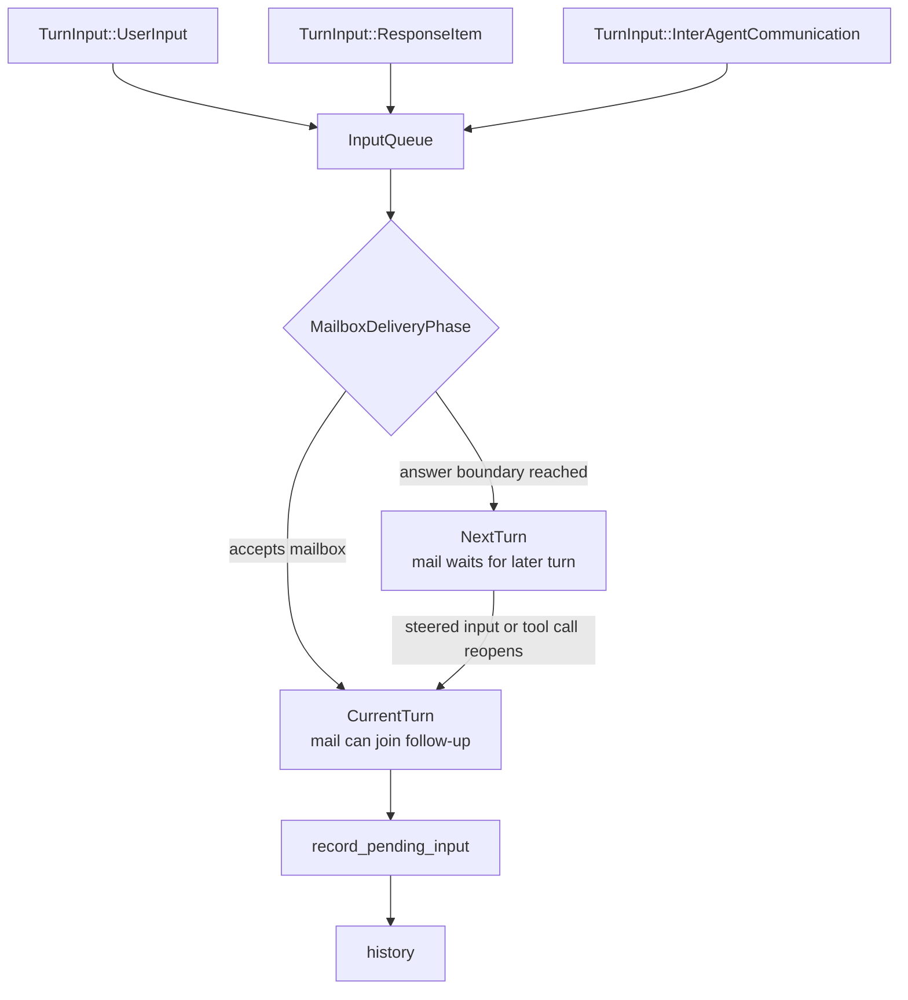

Why it matters:

If the agent already showed final answer text, late subagent mail should usually not silently change that same answer. But if the model makes a tool call or a user steer reopens the turn, pending mail can be folded into the follow-up.

The source has more nuance:

- Assistant final-answer text defers mailbox delivery to the next turn.
- Untagged assistant messages are treated like final-answer text when they contain visible output, because older providers do not always set `MessagePhase`.
- Assistant commentary and reasoning can preempt the current stream if mailbox mail is waiting, forcing a follow-up where that mail can be included.
- Tool calls explicitly reopen current-turn mailbox delivery.
- Image generation calls also defer mailbox delivery.

For Freeflow's first local harness, we probably do not need Codex's full mailbox design. But we do need a basic queue:

```text
pending_inputs
pending_tool_outputs
pending_parent_messages
```

Source:

- `codex-rs/core/src/session/input_queue.rs`
- `codex-rs/core/src/state/turn.rs`
- `codex-rs/core/src/session/mod.rs`
- `codex-rs/protocol/src/protocol.rs`

### History

History is the model-visible transcript.

Codex records:

- user input
- contextual fragments
- skill/plugin/extension injections
- assistant messages
- reasoning and tool metadata
- tool calls
- tool outputs
- inter-agent messages
- compaction summaries

The turn loop builds the next prompt from this history.

Why this matters for local models:

Small local models have limited context. The harness must be more aggressive about:

- selecting only relevant context
- truncating tool output
- summarizing previous steps
- keeping task scope narrow
- returning uncertainty instead of trying to remember everything

The local harness should treat context-building as a first-class component, not as string concatenation.

Source:

- `codex-rs/core/src/context_manager/history.rs`
- `codex-rs/core/src/session/turn.rs`

## Compaction

Codex runs compaction when context gets too large.

There are several triggers:

- before sampling, if token limits are already reached
- when switching models and the new model has a smaller context window
- when compaction compatibility changes
- mid-turn, if a follow-up is needed but the token limit is reached
- through pre/post compaction hooks

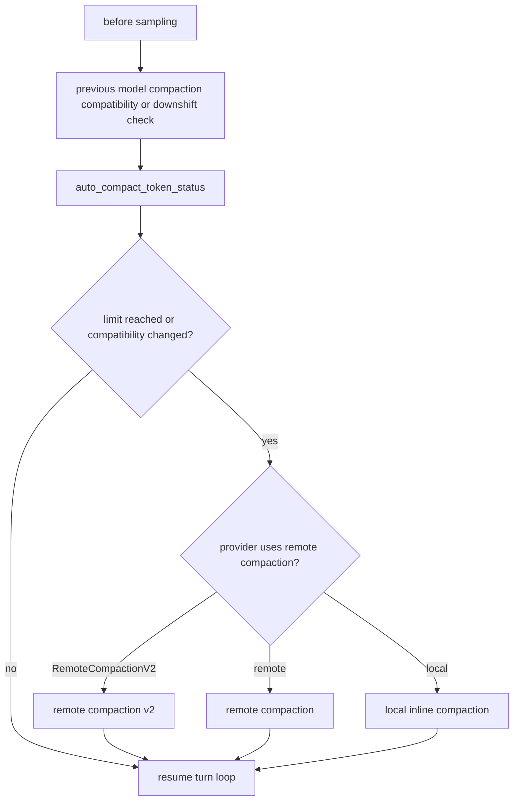

The key idea:

```text
If the model needs another step but context is too large,
compact first, then continue.
```

For a local model harness, compaction is even more important because local models usually have smaller usable context windows and weaker long-context performance.

But the first version should be simple:

```text
if context too large:
  summarize older transcript
  keep current task, recent tool outputs, and explicit constraints
```

Do not build Codex's full remote/local compaction system first.

Source:

- `codex-rs/core/src/session/turn.rs`
- `codex-rs/core/src/compact.rs`
- `codex-rs/core/src/compact_remote.rs`
- `codex-rs/core/src/compact_remote_v2.rs`
- `codex-rs/core/src/hook_runtime.rs`

## Hooks And Policy Gates

Codex has hooks at important choke points:

- session start
- user prompt submit
- pre-tool-use
- permission request
- post-tool-use
- stop
- pre-compact
- post-compact

The hook system can:

- block an input
- inject additional context
- block a tool call
- rewrite tool input
- add post-tool feedback
- request continuation after a stop
- stop compaction paths

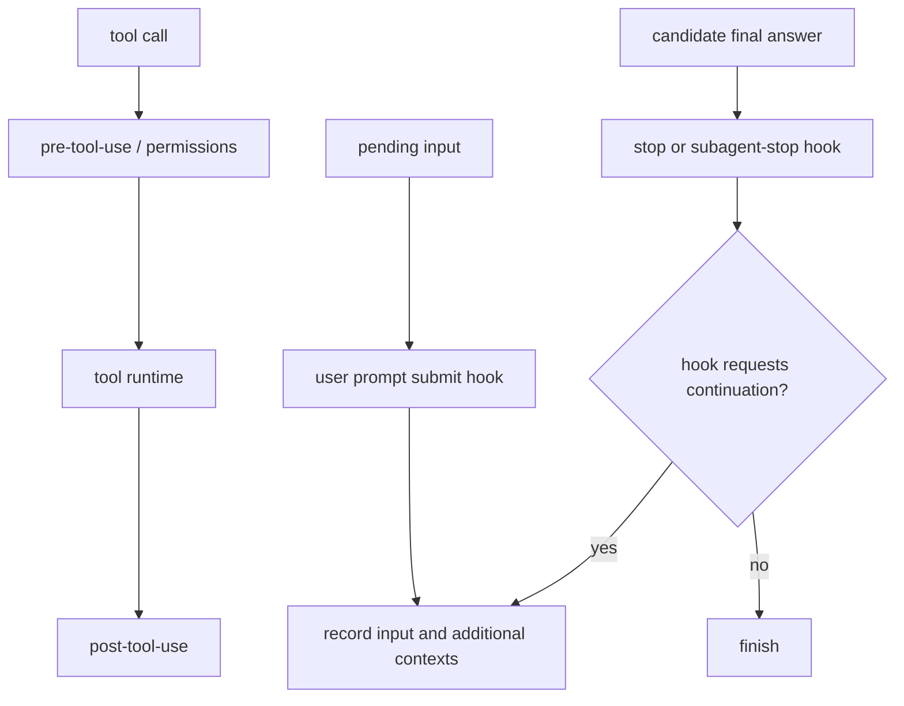

This is powerful, but not needed in full for the first local harness.

What we should borrow:

```text
keep explicit extension points
```

For example:

```text
before_user_input(input) -> allow/block/add_context
before_tool_call(tool_call) -> allow/block/rewrite
after_tool_call(result) -> add_context/rewrite_model_output
before_final_answer(answer) -> accept/continue
```

This lets Freeflow policy plug in later without redesigning the turn loop.

Source:

- `codex-rs/core/src/hook_runtime.rs`
- `codex-rs/core/src/tools/registry.rs`
- `codex-rs/core/src/session/turn.rs`

## Stop Conditions

Codex does not stop merely because the model response stream completed.

It stops only when the runtime decides there is no more work.

Reasons to continue:

- the model emitted a tool call
- the model response has `end_turn: false`
- pending user input exists
- pending inter-agent mailbox input exists and the current turn accepts mailbox delivery
- a new context window or compaction path needs a follow-up
- a stop hook requests continuation and provides prompt fragments

Reasons to stop:

- no tool follow-up is needed
- no pending input is available for this turn
- no compaction continuation is pending
- stop hooks do not block
- no fatal error or cancellation path is active

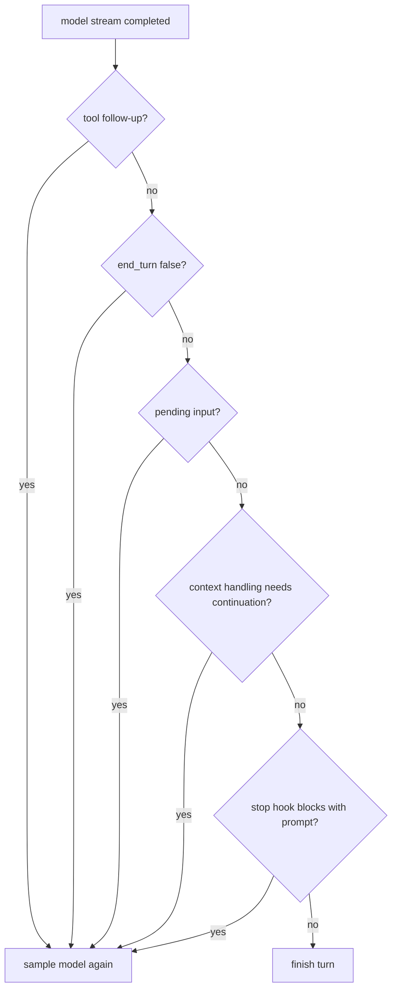

For a local harness, this should become explicit:

```text
ContinueReason:
  tool_output_pending
  model_requested_continue
  pending_parent_message
  context_compacted
  verifier_requested_retry

StopReason:
  final_answer
  max_steps
  max_time
  blocked_by_policy
  model_error
  verifier_failed
  cancelled
```

This will make traces easier for the frontier orchestrator to judge.

Source:

- `codex-rs/core/src/session/turn.rs`
- `codex-rs/core/src/hook_runtime.rs`

## Behavioral Evidence From Tests

Tests reveal which behavior is intentional.

### Parallel Tools Should Run Quickly

`tool_parallelism.rs` tests that multiple parallel-capable tool calls finish quickly.

```mermaid
sequenceDiagram
  participant M as Mock model
  participant T as Turn loop
  participant A as Tool call 1
  participant B as Tool call 2

  M-->>T: call-1 and call-2
  par parallel-safe execution
    T->>A: start
  and
    T->>B: start
  end
  A-->>T: output
  B-->>T: output
  T->>M: follow-up request with both outputs
```

Why it matters:

Local harness speed depends on not serializing all safe read-only work. But Freeflow v0 can still choose stricter serialization for shell/write tools until its policy and tests prove concurrency is safe.

Source:

- `codex-rs/core/tests/suite/tool_parallelism.rs`

### Tool Outputs Are Grouped After Calls

The tests check that when multiple function calls happen, all function-call items appear before their outputs, and outputs match call IDs.

```mermaid
flowchart TD
  C1["call-1"]
  C2["call-2"]
  C3["call-3"]
  O1["output-for-call-1"]
  O2["output-for-call-2"]
  O3["output-for-call-3"]

  C1 --> C2 --> C3 --> O1 --> O2 --> O3
```

Why it matters:

The next model request receives a coherent tool-call/tool-output block.

Source:

- `codex-rs/core/tests/suite/tool_parallelism.rs`

### Tools Can Start Before Response Completion

The tests check that shell tools start before the delayed `response.completed` event arrives.

```mermaid
sequenceDiagram
  participant M as Model stream
  participant T as Turn loop
  participant X as Tool runtime

  M-->>T: response.created
  M-->>T: completed shell tool-call item
  T->>X: start shell tool
  M-->>T: response.completed arrives later
  X-->>T: shell output
```

Why it matters:

This is a latency optimization. Our first local harness may not support this if local model adapters only emit final text, but the architecture should allow it later.

Source:

- `codex-rs/core/tests/suite/tool_parallelism.rs`

### Tool Calls Reopen Same-Turn Mailbox Delivery

Current session tests check that a tool call can reopen delivery for queued inter-agent mail in the current turn.

Why it matters:

Codex has a careful distinction between "final answer already shown" and "turn still has work." We probably do not copy this full mailbox system first, but it explains why Codex's turn state is more complex than a simple loop.

Source:

- `codex-rs/core/src/session/tests.rs`

### Shell Cancellation Waits For Cleanup

A test checks that cancelling a shell tool gives it time to run cleanup.

Why it matters:

Tool cancellation is not just killing a future. Real tools may own subprocesses, files, terminals, locks, and cleanup hooks. A local harness needs cancellation semantics for long shell commands.

Source:

- `codex-rs/core/src/session/tests.rs`

### Plan Mode Uses Contributed Turn Items

`turn_tests.rs` checks that plan-mode assistant output uses the contributed turn item when computing the last agent message.

Why it matters:

The turn loop is not just "stream text and return it." Extensions can contribute to finalized turn items, and in plan mode Codex strips hidden plan markup before visible output and last-message handling.

Source:

- `codex-rs/core/src/session/turn_tests.rs`
- `codex-rs/core/src/stream_events_utils.rs`

## What Freeflow Should Borrow

For the optional local delegation harness, borrow the shapes, not the full implementation.

### Borrow This

```text
AgentSession
TurnRunner
ModelAdapter
PromptBuilder
ConversationStore
ToolRouter
ToolRegistry
ToolRuntime
PolicyGate
EventLog
Verifier
```

### Minimal Local Harness Loop

First real version:

```mermaid
flowchart TD
  Task["local-agent run TASK"]
  Config["load config"]
  Adapter["resolve model adapter"]
  Packet["build small LocalTaskPacket"]
  Tools["build allowed tool list"]
  Model["ask local model for next action"]
  Action{"action type"}
  Final["final answer"]
  Verify["verify result"]
  Tool["validate and execute tool"]
  Record["record tool output"]
  Limit{"max steps or failure?"}
  Result["structured result and trace"]

  Task --> Config --> Adapter --> Packet --> Tools --> Model --> Action
  Action -->|final| Final --> Verify --> Result
  Action -->|tool call| Tool --> Record --> Limit
  Limit -->|continue| Model
  Limit -->|stop| Result
```

### Suggested First Tool Set

Keep the first local tool set small:

- `read_file`
- `list_files`
- `search_text`
- `inspect_diff`
- `run_command` with strict policy
- maybe `write_file` or `apply_patch` later, behind stronger gates

For early delegation, read-only tools are enough for many valuable tasks:

- summarize a file
- map a module
- find references
- review a diff
- extract TODOs
- compare test outputs
- classify likely issue areas

### Suggested First Result Shape

The local agent should return structured output to the frontier orchestrator:

```text
LocalAgentResult:
  status: success | partial | failed | blocked
  task
  summary
  findings
  files_examined
  tools_used
  confidence
  risks
  trace_path
  raw_final_answer
```

```mermaid
flowchart LR
  Local["local harness"]
  Result["LocalAgentResult"]
  Trace["trace file"]
  Parent["frontier orchestrator"]
  Trust{"trust, re-check, or ignore?"}

  Local --> Result --> Parent
  Local --> Trace --> Parent
  Parent --> Trust
```

This matters because the main orchestrator should not blindly trust local output.

### Suggested First Safety Policy

Because local models are smaller and less reliable:

```text
default:
  read-only tools
  max 6 tool calls
  max 1 shell command unless task allows
  no network by default
  no writes by default
  no destructive commands
  no dependency installs
  no secrets access
```

If the parent orchestrator wants a stronger local agent, it can explicitly grant a higher capability.

## What Not To Copy Yet

Do not copy Codex wholesale.

Avoid in the first version:

- full MCP/plugin system
- full hook runtime
- full mailbox/subagent communication layer
- websocket optimization
- remote compaction
- complex telemetry
- code-mode worker
- all Codex protocol types
- broad shell/write access
- multiple UI event layers

These are production-grade systems, but they would slow us down and create too much surface area before we validate whether local delegation improves cost/quality.

Instead, design the interfaces so these can exist later.

## Beginner-Friendly Pseudocode

This pseudocode is intentionally simple. It is not Codex code. It shows the shape we can build for the local harness.

```python
async def run_local_agent(task, session):
    turn = TurnState(task=task)
    history = session.history.load_recent_context(task)

    for step in range(session.config.max_steps):
        prompt = build_prompt(
            task=task,
            history=history,
            tools=session.tools.visible_specs(),
            instructions=session.instructions,
        )

        response = await session.model.generate(prompt)

        if response.type == "final_answer":
            result = await verify_answer(response.text, history, task)
            return result

        if response.type == "tool_call":
            tool_call = session.tools.parse_and_validate(response)
            policy_decision = session.policy.before_tool_call(tool_call)

            if not policy_decision.allowed:
                history.add_tool_error(tool_call, policy_decision.reason)
                continue

            tool_result = await session.tools.execute(tool_call)
            history.add_tool_call(tool_call)
            history.add_tool_result(tool_result)
            continue

        history.add_system_note("Model returned invalid action.")

    return LocalAgentResult(
        status="failed",
        summary="Max steps reached before final answer.",
        trace_path=session.trace.path,
    )
```

The real version needs better error handling, streaming, cancellation, logging, and context limits. But the shape is correct:

```mermaid
flowchart LR
  Model["model"] --> Action["action"] --> Tool["tool"] --> History["history"] --> Again["model again"]
```

## Design Lessons For Small Local Models

Small local models need a stricter harness than frontier models.

### Keep The Task Narrow

Do not give a local model the whole user request.

Good local tasks:

- "Find all references to this function."
- "Summarize this 200-line module."
- "Review this diff for obvious test gaps."
- "Extract commands used in this log."
- "Classify these 10 files by likely relevance."

Bad local tasks:

- "Design the whole architecture."
- "Refactor this subsystem."
- "Decide security policy."
- "Implement the feature end to end."

### Keep Context Small

Codex can handle large, complex context because it usually uses frontier models. A local harness should do more context selection before the model call.

Good rule:

```text
Give the local model exactly what it needs, not everything the parent knows.
```

### Prefer Structured Tool Calls

Local models can be messy with free-form tool syntax.

The harness should require strict action JSON:

```json
{
  "action": "read_file",
  "args": {
    "path": "plugins/freeflow/skills/workflow/SKILL.md"
  }
}
```

If parsing fails, the harness should ask once for corrected JSON or fail cleanly.

### Verify Before Trusting

Local output should be treated as evidence, not authority.

Useful verification:

- did the claimed files actually exist?
- did the tool calls succeed?
- did the local model cite files it read?
- did it answer within the delegated scope?
- did it return uncertainty where appropriate?

The main orchestrator can then decide whether to use, ignore, or re-check the local result.

## Dependencies And Edge Cases To Carry Forward

The turn loop depends on surrounding systems that a local harness must either implement, simplify, or explicitly defer:

- prompt/history normalization
- tool spec generation
- tool dispatch and output conversion
- cancellation and cleanup
- context-window accounting
- compaction or summarization
- input queue semantics
- policy gates and permission grants
- event log / trace persistence
- verification before parent-agent trust

Do not hide these dependencies behind a single `agent.run()` abstraction. The harness can expose a simple public API, but the internals need named boundaries so failures are inspectable.

## Open Questions

These should be answered after more passes, not inside this artifact:

1. Should the first harness be Python, TypeScript, or Rust?
2. Should the model adapter use LiteLLM, direct OpenAI-compatible HTTP, Ollama API, LM Studio API, MLX server, or multiple adapters from day one?
3. What exact tool set should v0 expose?
4. Should writes be supported in v0, or should v0 be read-only plus review?
5. How should the frontier orchestrator launch the local harness?
6. How should traces be stored so Codex/Claude/Gemini can inspect them?
7. What benchmark proves local delegation saves tokens without degrading quality?

## Next Research Passes

This local roadmap has been superseded by the directory README:

```text
docs/research/codex-cli-agent-harness/README.md
```

The important correction is that later research split the original roadmap into narrower passes:

- Pass 2: tool system.
- Pass 3: sandboxing and permissions.
- Pass 4: subagents and delegation.
- Pass 5: model providers and runtime adapters.
- Pass 6: memory and context.
- Pass 7: config and extensibility.
- Pass 8: agent harness comparisons.

Remaining work is comparison research, then the Freeflow local harness design spec.

## Source Evidence Appendix

### Original Source Snapshot

```text
repo: openai/codex
commit: b65fe3d8976d6fcc44ee6c6cf988654af5fc4d2d
short: b65fe3d
commit date: 2026-06-12
commit title: fix: serialize auth environment tests (#27879)
local path: /private/tmp/openai-codex-study-pass0
```

### Current Upstream Audit Snapshot

```text
repo: openai/codex
ref checked: origin/main
commit: 0fed4497f50ad5f0b2f7972a1bfd14c5a09a85c5
short: 0fed449
commit date: 2026-06-13
commit title: [codex] Carry exec-server cwd as PathUri (#28032)
local path: /private/tmp/openai-codex-study-pass0
```

### Most Relevant Files

```text
codex-rs/core/src/tasks/regular.rs
  Normal task runner. Emits TurnStarted, resolves prewarm, calls run_turn,
  and loops if pending input remains.

codex-rs/core/src/session/turn.rs
  Main turn loop, prompt construction, sampling request loop, streaming response handling,
  compaction continuation, stop hooks, token accounting, code-mode worker startup,
  and turn diff handling.

codex-rs/core/src/responses_retry.rs
  Shared retry and transport-fallback behavior for sampling and remote-compaction streams.

codex-rs/core/src/stream_events_utils.rs
  Converts completed model response items into tool futures or user-visible turn items.
  Records completed response items and tool outputs into history, applies turn-item
  contributors, strips hidden assistant markup, and manages mailbox deferral facts.

codex-rs/core/src/tools/router.rs
  Converts model response items into internal ToolCall values and dispatches through registry.

codex-rs/core/src/tools/parallel.rs
  ToolCallRuntime. Handles tool futures, cancellation, parallelism locks, cleanup,
  abort responses, and fatal-vs-model-visible tool failures.

codex-rs/core/src/tools/registry.rs
  Tool registry, pre/post tool hooks, telemetry, unsupported-tool behavior, and dispatch.

codex-rs/core/src/tools/context.rs
  ToolInvocation and ToolOutput types. Converts tool outputs into model-visible response items.

codex-rs/core/src/client_common.rs
  Prompt and ResponseStream types. Current source strips image detail for Responses Lite
  but no longer rewrites inter-agent messages here.

codex-rs/core/src/client.rs
  ModelClientSession, Responses request building, transport handling, stream mapping.

codex-rs/codex-api/src/common.rs
  ResponseEvent enum.

codex-rs/protocol/src/models.rs
  ResponseInputItem, ResponseItem, AgentMessageInputContent, MessagePhase,
  and FunctionCallOutputPayload enums/types.

codex-rs/protocol/src/protocol.rs
  InterAgentCommunication shape and conversion to model-visible AgentMessage.

codex-rs/core/src/session/input_queue.rs
  Pending input and inter-agent mailbox delivery coordination.

codex-rs/core/src/state/turn.rs
  TurnState, pending approvals, pending input, mailbox phase, granted permissions,
  tool call count, memory citation flag, and token usage at turn start.

codex-rs/core/src/hook_runtime.rs
  User prompt, tool, permission, stop, subagent-stop, and compaction hook runtime.

codex-rs/core/tests/suite/tool_parallelism.rs
  Behavioral evidence for parallel tools, grouped outputs, and tool start before response completion.

codex-rs/core/src/session/tests.rs
  Behavioral evidence for pending input, mailbox reopening, cancellation, permissions,
  and tool/runtime edge cases.

codex-rs/core/src/session/turn_tests.rs
  Behavioral evidence for plan-mode output and turn-item contributors affecting last-agent-message handling.
```

## Change Log

2026-06-14 audit:

- Replaced ASCII diagrams with Mermaid diagrams.
- Added `Diagram Map`.
- Added `If You Only Read 10 Minutes`.
- Added current upstream audit against `0fed449`.
- Clarified that Codex's tested shell path can run in parallel, while Freeflow v0 may still serialize shell by policy.
- Clarified `TurnInput::InterAgentCommunication` and mailbox delivery state.
- Clarified `output_schema_strict` behavior in prompt construction.
- Added code-mode worker and extension data to the relevant boundaries.
- Reorganized the document into mental model, deep mechanism, evidence, and Freeflow implications.

2026-06-14 second pass:

- Render-validated all 27 Mermaid diagrams with `mmdc`.
- Added retry and WebSocket-to-HTTPS fallback behavior.
- Added per-sampling tool-router rebuild detail.
- Added token-count and turn-diff emission boundaries after tool drain.
- Added mailbox nuance for commentary, reasoning, untagged final-answer text, tool calls, and image generation.
- Added plan-mode turn-item contributor evidence.

## Working Interpretation

The turn loop is the heart of the harness.

For Freeflow's future local delegation harness, the correct first target is not a full Codex clone. The correct first target is a small, strict, observable loop:

```mermaid
flowchart LR
  Task["task"]
  Context["context builder"]
  Adapter["local model adapter"]
  Parser["structured action parser"]
  Router["tool router"]
  Runtime["tool runtime"]
  History["history update"]
  Continue["model continuation"]
  Verify["verifier"]
  Result["structured result for parent orchestrator"]

  Task --> Context --> Adapter --> Parser --> Router --> Runtime --> History --> Continue --> Verify --> Result
  History --> Adapter
```

Once that works, we can add richer tools, subagent coordination, local-model profiles, policy gates, and Freeflow skills.
