# Codex CLI Agent Harness Study - Pass 2 Tool System

> **Doc ID:** RESEARCH-2026-06-12-codex-cli-agent-harness-pass-2
> **Date:** 2026-06-12
> **Last audit:** 2026-06-14
> **Owner:** Hassan Mohiddin
> **Type:** Research
> **Status:** Draft, audited
> **Source:** `openai/codex` source snapshot `b65fe3d8976d6fcc44ee6c6cf988654af5fc4d2d`; current upstream check at `0fed4497f50ad5f0b2f7972a1bfd14c5a09a85c5`; Pass 0 repo map; Pass 1 turn-loop artifact; Pass 6 memory/context artifact; Freeflow local delegation design discussion.

## Purpose

Preserve the Pass 2 research into Codex's tool system: the part of the agent harness that exposes tools to the model, receives model tool calls, dispatches them through safe runtime paths, and returns tool outputs back into the turn loop.

This document is written to be beginner-friendly without flattening the architecture. The early sections explain the mental model. The later sections keep the actual moving parts, source evidence, and Freeflow/local-harness implications.

This is research memory, not an implementation plan. It should inform future Freeflow local delegation design, but it does not define shipped Freeflow behavior.

## How To Read This

If this is your first pass, read only:

- `If You Only Read 10 Minutes`
- `Core Idea`
- `Tiny Diagram`
- `Diagram Map`
- `Glossary`
- `Tool Calls In Plain English`
- `What Freeflow Should Borrow`

If you are designing the local harness, also read:

- `Deep Mechanism`
- `Tool Visibility`
- `Tool Dispatch`
- `Turn Loop Integration`
- `Approval And Sandboxing`
- `Design Lessons For Small Local Models`

If you are implementing or reviewing later, use:

- `Audit Scope And Current Upstream Check`
- `Behavioral Evidence From Tests`
- `Suggested First Local Tool Contract`
- `Source Evidence Appendix`
- the current `openai/codex` source, refreshed again before implementation

## Diagram Map

Use the diagrams as checkpoints. They do not replace the source notes.

| If you are trying to understand... | Start with... |
| --- | --- |
| Why the model does not directly run tools | `Core Idea` and `Tiny Diagram` |
| How Codex separates model-visible specs from execution | `The Tool Stack Has Two Source Areas` |
| How the current turn gets a tool menu | `Tool Planning` |
| Why visible, deferred, model-only, and hidden are different | `Tool Visibility` |
| How provider response items become internal tool calls | `Tool Routing` |
| How tool calls re-enter the turn loop | `Turn Loop Integration` |
| Why dispatch is more than a map lookup | `Tool Dispatch` |
| How parallel calls avoid racing unsafe tools | `Parallel Tool Execution` |
| How approval, sandboxing, and retries compose | `Approval And Sandboxing` |
| How shells, patches, MCP, dynamic tools, and extensions fit | `Shell And Unified Exec`, `Apply Patch`, and `MCP, Dynamic Tools, And Extensions` |
| What Freeflow should copy first | `What Freeflow Should Borrow` and `Suggested First Local Tool Contract` |

## If You Only Read 10 Minutes

Codex turns a model into an agent by putting a policy-aware tool runtime around it.

The model receives tool descriptions. It does not receive raw shell, filesystem, MCP, plugin, or sandbox objects.

The runtime owns:

- which tools are visible in this sampling request
- which hidden or deferred tools remain dispatchable
- how provider-specific tool-call items normalize into one internal call shape
- whether a call is allowed, blocked, approved, sandboxed, retried, cancelled, or turned into a model-visible error
- how the output is shaped, logged, recorded, and fed back into the next model request

The key design rule is:

```text
Tool specs are model interface.
Tool runtimes are authority.
The turn loop is what connects them.
```

For Freeflow's future local harness, this means the first useful version should not be a thin "ask Gemma once" wrapper. It should be a small loop with a strict router, central registry, narrow tools, explicit permission model, compact outputs, and traces the frontier orchestrator can verify.

## Audit Scope And Current Upstream Check

The original Pass 2 source snapshot was:

```text
repo: openai/codex
commit: b65fe3d8976d6fcc44ee6c6cf988654af5fc4d2d
short: b65fe3d
commit date: 2026-06-12
commit title: fix: serialize auth environment tests (#27879)
local path used during research: /private/tmp/openai-codex-study-pass0
```

For this audit, the same clone was compared against:

```text
repo: openai/codex
ref checked: origin/main
commit: 0fed4497f50ad5f0b2f7972a1bfd14c5a09a85c5
short: 0fed449
commit date: 2026-06-13
commit title: [codex] Carry exec-server cwd as PathUri (#28032)
audit date: 2026-06-14
current worktree used during audit: /private/tmp/openai-codex-study-current
```

Relevant files changed between the original snapshot and the current upstream check:

- `codex-rs/core/src/client.rs`
- `codex-rs/core/src/session/turn.rs`
- `codex-rs/core/src/tools/handlers/apply_patch.rs`
- `codex-rs/core/src/tools/handlers/extension_tools.rs`
- `codex-rs/core/src/tools/handlers/unified_exec/exec_command.rs`
- `codex-rs/core/src/tools/handlers/view_image.rs`
- `codex-rs/core/src/tools/orchestrator.rs`
- `codex-rs/core/src/tools/runtimes/mod.rs`
- `codex-rs/core/src/tools/runtimes/unified_exec.rs`
- `codex-rs/core/src/tools/sandboxing.rs`
- related tests under `codex-rs/core/src/tools/` and `codex-rs/core/tests/suite/`

Current-source audit result:

- The core Pass 2 architecture still holds: reusable contracts live under `codex-rs/tools/src/`; core planning, routing, dispatch, sandboxing, and runtime behavior live under `codex-rs/core/src/tools/`.
- Current `origin/main` did not materially change `ToolExecutor`, `ToolSpec`, `ToolPayload`, or `ToolOutput`; those contracts remain the right anchors for this pass.
- The original document under-explained turn-loop integration. Current source shows the path through `run_sampling_request`, `try_run_sampling_request`, `handle_output_item_done`, `ToolCallRuntime`, and `drain_in_flight`.
- Tool futures start as completed tool-call items arrive from the stream. Codex waits until after `response.completed` to drain and record tool outputs, which preserves transcript order without delaying execution start.
- The turn loop around tools also handles pending user input, mid-turn compaction, context-window rollover, stop hooks, and retryable stream errors. A local harness can start smaller, but it should not confuse the tool loop with the whole turn loop.
- Router errors split into recoverable model feedback and fatal errors. Some malformed call shapes become a synthetic tool output followed by another model request; incompatible payload kinds inside registry dispatch are fatal in current Codex source.
- The original document was broadly right about sandbox cwd, but current source is more precise: tool paths now carry sandbox policy cwd as `PathUri` through apply-patch, view-image, extension-tool, unified-exec, sandboxing, and orchestrator paths. This matters for remote and multi-environment execution.
- Extension tools are more concrete than the original wording suggested: the adapter passes conversation history, scoped environments, filesystem sandbox contexts, a turn-item emitter, model/truncation metadata, and payload.
- Shell-like tools can run in parallel in the tested path. Freeflow can still choose to serialize command tools by policy, but that is a local-harness decision, not a Codex fact.
- No current-source change invalidated the main local-harness conclusions: keep tool specs separate from authority, centralize dispatch, start narrow/read-only, and record traceable outputs for orchestrator verification.

## Core Idea

A model does not "have tools" by magic.

The harness gives the model a tool menu, waits for the model to request a tool, validates the request, runs the tool, and feeds the result back into the next model request.

Codex's important lesson is:

```text
Separate tool description from tool execution.
```

The model sees a clean description:

```text
Tool name: exec_command
Input schema: { cmd, workdir, yield_time_ms, ... }
Description: run a command
```

The runtime owns the real behavior:

```text
parse arguments
resolve working directory
check policy
maybe ask approval
choose sandbox
execute process
truncate output
record lifecycle events
return output to the model
```

That split is what lets Codex be flexible without giving the model raw unsafe access to the machine.

For our local harness, this means the model adapter can be simple, but the tool system must be serious.

## Tiny Diagram

This is the simplified Codex tool path:

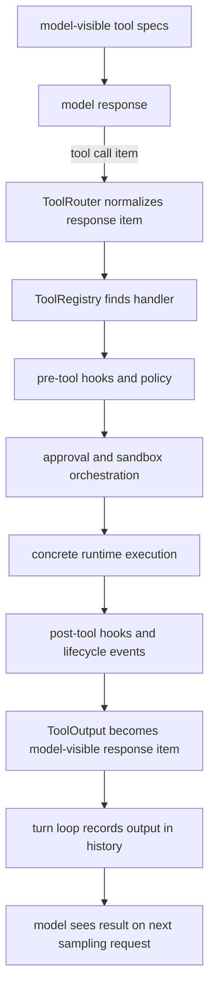

Codex has many tool kinds, but most of them pass through this shape.

## Glossary

`Tool spec`
: The model-visible description of a tool. It includes the name, description, input schema, and sometimes grammar/freeform format.

`Tool executor`
: The runtime object that actually handles a tool invocation.

`Tool exposure`
: A visibility setting. Codex tools can be directly visible, deferred/searchable, direct-model-only, or hidden from the model.

`Tool router`
: The object that converts a model response item into Codex's internal `ToolCall`.

`Tool registry`
: The lookup table from tool name to executable runtime.

`Tool payload`
: The normalized call body. Codex supports function arguments, tool-search arguments, and custom/freeform input.

`Tool output`
: The normalized result that can be logged, sent to hooks, converted into a model-visible response item, or converted into code-mode output.

`Approval requirement`
: A decision object that says a tool can run, needs approval, or is forbidden.

`Sandbox attempt`
: One concrete execution attempt under a selected sandbox and permission profile.

`Deferred tool`
: A registered tool that is not shown to the model initially. The model can discover it later through `tool_search`.

`Code mode`
: A special tool surface where the model writes code, and that code can request nested tool calls. Even there, nested calls route back through the same tool runtime.

## Tool Calls In Plain English

Imagine the model wants to inspect files.

Codex does not hand the model a Python object or a real shell.

It gives the model a list of tool descriptions, like:

```text
exec_command(cmd, workdir, yield_time_ms, ...)
apply_patch(raw patch text)
view_image(path)
tool_search(query)
```

The model emits a structured tool call.

Codex then:

1. Parses the model response item into an internal tool call.
2. Checks that the tool exists.
3. Checks that the call shape matches the tool kind.
4. Runs pre-tool hooks.
5. For dangerous tools, calculates approval and sandbox requirements.
6. Executes the concrete runtime.
7. Runs post-tool hooks.
8. Converts the result into a response item.
9. Adds the result to conversation history.
10. Calls the model again if the turn loop needs a follow-up.

So the model is not "running a command." It is asking the harness to run a command. The harness decides how, whether, and under what constraints.

That distinction matters even more for a local model, because a small local model will make more tool-use mistakes than a frontier model.

## Deep Mechanism

### The Tool Stack Has Two Source Areas

Codex splits reusable tool abstractions from core runtime behavior.

The reusable types live under:

```text
codex-rs/tools/src/
```

Examples:

- `tool_executor.rs`
- `tool_spec.rs`
- `tool_payload.rs`
- `tool_output.rs`
- `tool_discovery.rs`
- `tool_search.rs`
- `dynamic_tool.rs`
- `responses_api.rs`

The agent-core routing and execution logic lives under:

```text
codex-rs/core/src/tools/
```

Examples:

- `spec_plan.rs`
- `router.rs`
- `registry.rs`
- `parallel.rs`
- `orchestrator.rs`
- `sandboxing.rs`
- `handlers/`
- `runtimes/`
- `code_mode/`

Plain-English distinction:

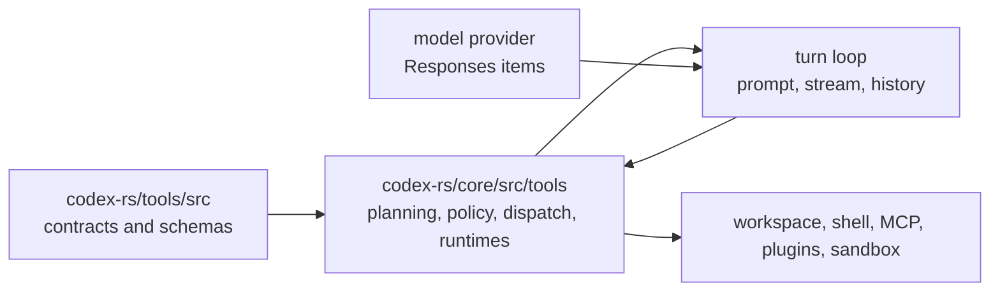

Plain version:

- `codex-rs/tools/src/` defines what a tool is.
- `codex-rs/core/src/tools/` decides which tools exist in a turn and how they actually run.

For Freeflow's local harness, this suggests we should separate:

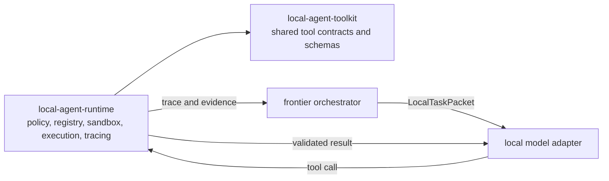

We do not need two packages immediately, but we should keep the boundary clean in the design.

### Load-Bearing Types

Codex has a small set of types that explain the whole tool system.

#### `ToolSpec`

`ToolSpec` is the model-visible tool description.

It can represent:

- normal function tools
- namespace tools
- tool search
- hosted image generation
- hosted web search
- freeform/custom tools

The important point:

```text
ToolSpec is for the model request.
It is not the executable handler.
```

Source:

- `/private/tmp/openai-codex-study-pass0/codex-rs/tools/src/tool_spec.rs`

#### `ToolExecutor`

`ToolExecutor` is the runtime contract.

It exposes:

- `tool_name`
- `spec`
- `exposure`
- `search_info`
- `supports_parallel_tool_calls`
- `handle`

The important point:

```text
One runtime object owns both:
  - the spec the model sees
  - the handler the system runs
```

This reduces drift. If a tool's schema changes, its handler is nearby.

Source:

- `/private/tmp/openai-codex-study-pass0/codex-rs/tools/src/tool_executor.rs`

#### `ToolExposure`

`ToolExposure` controls where the tool appears.

Codex has four exposure modes:

```text
Direct
  visible in the initial model-visible tool list

Deferred
  registered, but hidden until discovered through tool_search

DirectModelOnly
  visible to the model, but excluded from some nested surfaces like code mode

Hidden
  registered for dispatch, but not exposed to the model
```

This is subtle and important. A tool can be executable without being model-visible.

That helps Codex support compatibility paths, internal transport tools, and deferred discovery.

Source:

- `/private/tmp/openai-codex-study-pass0/codex-rs/tools/src/tool_executor.rs`

#### `ToolPayload`

`ToolPayload` is the normalized call body.

Codex supports:

```text
Function { arguments: String }
ToolSearch { arguments: SearchToolCallParams }
Custom { input: String }
```

This means the rest of the runtime does not have to care whether the provider called something `function_call`, `custom_tool_call`, or `tool_search_call`. It sees one internal shape.

Source:

- `/private/tmp/openai-codex-study-pass0/codex-rs/tools/src/tool_payload.rs`

#### `ToolOutput`

`ToolOutput` is the normalized result contract.

It can:

- produce a logging preview
- report success for logging
- mark whether output contains external context
- convert itself into a model-visible response item
- expose data to post-tool hooks
- produce code-mode result data

The important point:

```text
Tool output is not just stdout.
It is structured enough for model history, hooks, telemetry, and nested runtimes.
```

Source:

- `/private/tmp/openai-codex-study-pass0/codex-rs/tools/src/tool_output.rs`

## Tool Planning

Codex does not keep one permanent global tool list.

For each sampling request inside a turn, it builds a `ToolRouter` from the current `TurnContext`.

The entry point is:

```text
build_tool_router(turn_context, params)
```

That calls:

```text
build_tool_specs_and_registry
```

And that returns two things:

```text
model_visible_specs
registry
```

This is the key shape:

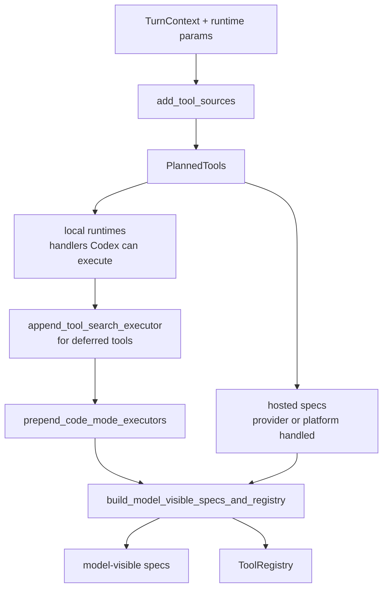

These two outputs are related but not identical.

Why they can differ:

- hidden tools may be registered but not visible
- deferred tools may be searchable but not initially visible
- legacy tools may be dispatch-only
- hosted model tools may be visible but not dispatched by local runtime
- code-mode wrapping may alter what the model sees

Source:

- `/private/tmp/openai-codex-study-pass0/codex-rs/core/src/tools/spec_plan.rs`

### Planned Tools

`spec_plan.rs` uses an internal `PlannedTools` structure.

It contains:

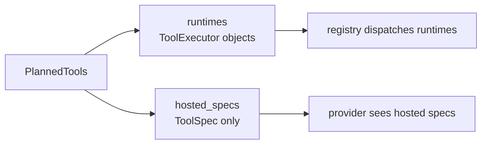

Runtimes are local executable handlers.

Hosted specs are tools handled by the model provider or platform, not by the local dispatch registry.

Plain version:

- Some tools are run by Codex.
- Some tools are declared to the model/provider but are not dispatched by Codex.

For a local harness, this distinction could become:

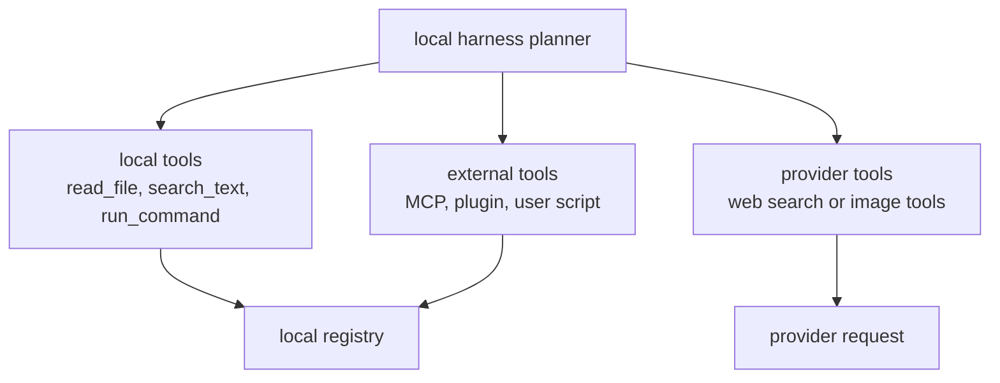

### Tool Sources

Codex adds tools from multiple sources:

- shell tools
- MCP resource tools
- core utility tools
- collaboration/subagent tools
- MCP runtime tools
- extension tools
- dynamic tools
- hosted model tools

The source function is:

```text
add_tool_sources
```

This is where Codex decides what exists for the current turn.

Source:

- `/private/tmp/openai-codex-study-pass0/codex-rs/core/src/tools/spec_plan.rs`

For our first local harness, we should not mirror all of these. We should start with a smaller set:

- workspace read/search tools
- a very restricted command tool
- optional structured patch tool
- optional verifier tool
- optional local subtask result reporter

The architecture can allow more tool sources later.

## Tool Visibility

### Direct Tools

Direct tools appear in the model request immediately.

This is useful for common tools the model almost always needs, such as:

- reading files
- searching text
- updating plan
- running carefully restricted commands

For small local models, direct tools should be few. Too many tools increase confusion and token cost.

### Deferred Tools

Deferred tools are registered but hidden from the initial model-visible list.

If search-tool support and namespace tools are enabled, Codex adds `tool_search`.

The model can search for relevant deferred tools, then receive matching tool specs.

This is useful when there are many tools, especially MCP or app/plugin tools.

Source:

- `/private/tmp/openai-codex-study-pass0/codex-rs/core/src/tools/spec_plan.rs`
- `/private/tmp/openai-codex-study-pass0/codex-rs/core/src/tools/handlers/tool_search.rs`

For local models, this is extremely useful:

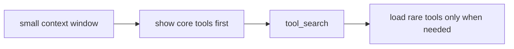

But first implementation can skip full BM25 tool search. We can start with static tool groups and add search later.

### Hidden Tools

Hidden tools are dispatchable but not visible to the model.

Codex uses this for cases like keeping a legacy shell tool registered while unified exec is model-visible.

Source:

- `/private/tmp/openai-codex-study-pass0/codex-rs/core/src/tools/spec_plan.rs`

For our harness, hidden tools can support compatibility and internal control:

- report_result
- internal verifier
- trace writer
- shell transport continuation

The model should not see these unless it needs them.

### DirectModelOnly

Direct-model-only tools are visible to the model but excluded from some nested surfaces.

Codex uses this when a tool should remain a normal model tool but not become available inside code-mode nesting.

For our first harness, we probably do not need this exact mode.

But the principle matters:

```text
tool availability can depend on the execution surface
```

Example:

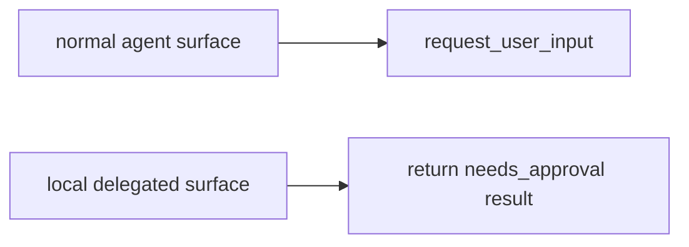

### Visibility Flow

The visibility decision is a dispatch-vs-exposure split:

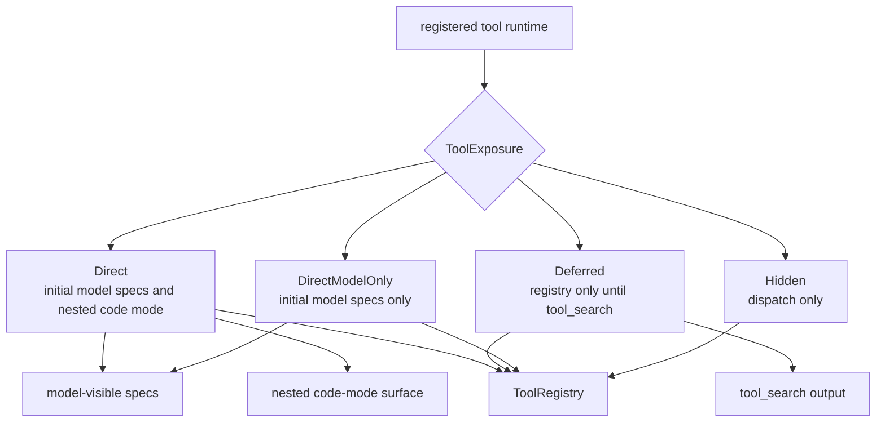

## Tool Routing

`ToolRouter` owns two things:

```text
registry
model_visible_specs
```

Its two major jobs:

1. Give the prompt builder the tool specs for the model request.
2. Convert completed model response items into internal `ToolCall` values.

Source:

- `/private/tmp/openai-codex-study-pass0/codex-rs/core/src/tools/router.rs`

### `build_tool_call`

`build_tool_call` handles different model output item types:

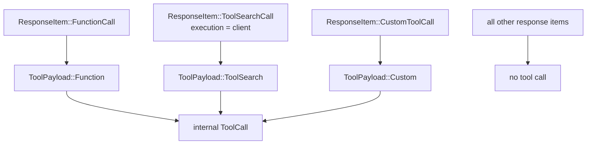

Everything else returns no tool call.

This adapter boundary is important. Provider events are messy. The rest of the runtime wants one internal shape.

There are two important edge cases:

- A `ToolSearchCall` only becomes a client-side tool call when `execution == "client"` and a `call_id` is present. Hosted/provider-handled search calls are not local registry dispatches.
- A function call name is not just a string label. If the provider includes a namespace, `build_tool_call` includes that namespace in the internal `ToolName`. Handler lookup and parallel-safety lookup both use the exact name.

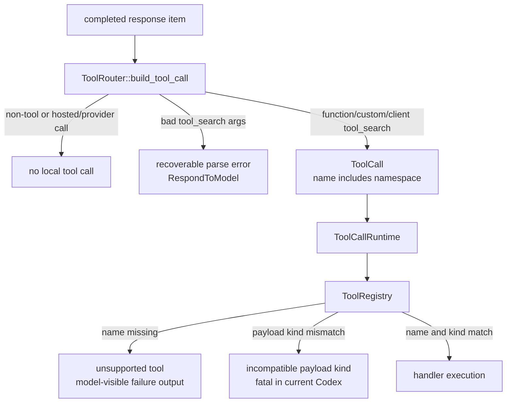

For our local harness:

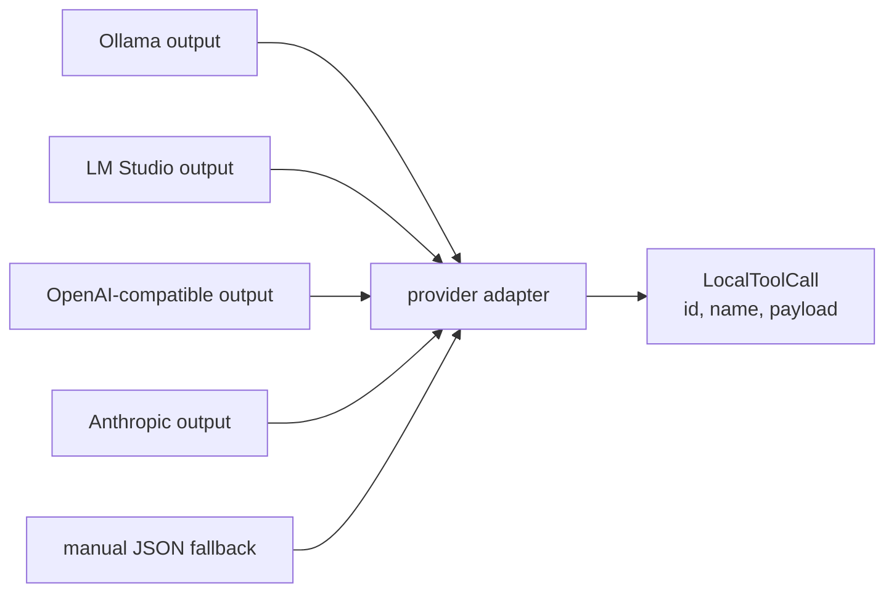

should all normalize into:

```text
LocalToolCall {
  id
  name
  payload
}
```

Do not leak provider-specific chunks through the whole runtime.

## Turn Loop Integration

The tool system only becomes useful because the turn loop feeds tool outputs back into history and samples the model again.

Current `origin/main` path:

1. `run_turn` clones normalized history for prompt input.
2. `run_sampling_request` calls `built_tools`, which builds a `ToolRouter` for this sampling request.
3. `build_prompt` puts `router.model_visible_specs()` into the model request.
4. `try_run_sampling_request` consumes the model response stream.
5. Each completed output item goes through `handle_output_item_done`.
6. `ToolRouter::build_tool_call` normalizes tool-call items.
7. Tool-call items are recorded immediately, then queued as tool futures through `ToolCallRuntime`.
8. Those tool futures may start running before `response.completed`.
9. After the response stream completes, `drain_in_flight` waits for already-started futures and records their model-visible outputs into history.
10. `needs_follow_up` tells `run_turn` to build another sampling request with the tool output now visible to the model.

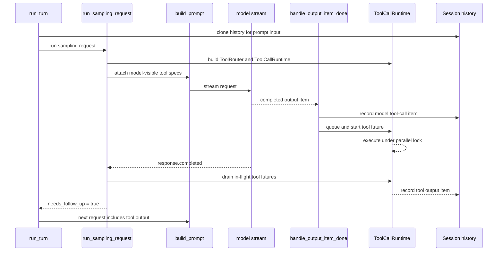

The subtle point is ordering.

Codex records the model's tool-call item before the tool output, starts the tool future immediately, then records tool outputs after the model response stream is done. That preserves a coherent transcript while still allowing tool execution to overlap the tail of the stream:

```text
assistant tool call
tool output for that call
assistant follow-up message
```

This matters for local models because malformed ordering makes repair harder. If the local harness records output without the call, or records outputs before calls, the next model request becomes harder to interpret and provider compatibility gets worse.

Do not overread this as "the turn loop is only a tool loop." In current source, `run_turn` also wraps the tool-follow-up loop with pending input handling, session-start hooks, input hooks, context-window rollover, mid-turn auto-compaction, retryable stream errors, stop hooks, legacy after-agent hooks, token-count events, and turn diff events. A first local harness does not need all of that, but it should keep the boundary clear:

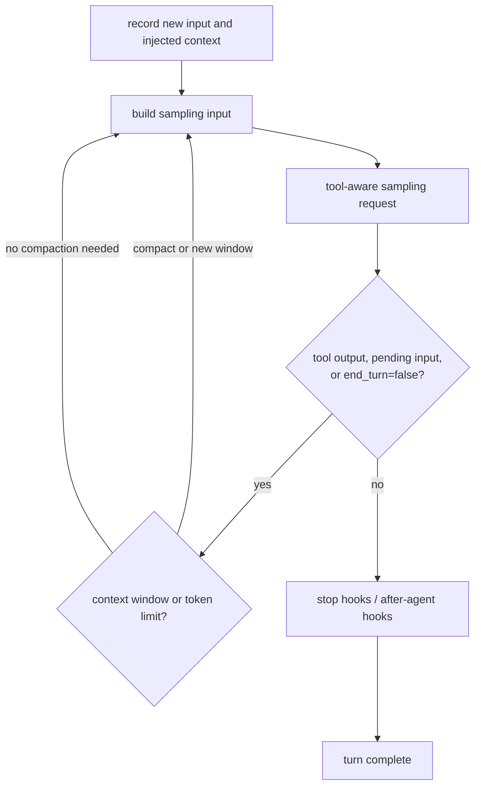

### Turn-Loop Dependencies

Tool execution depends on more than the tool files:

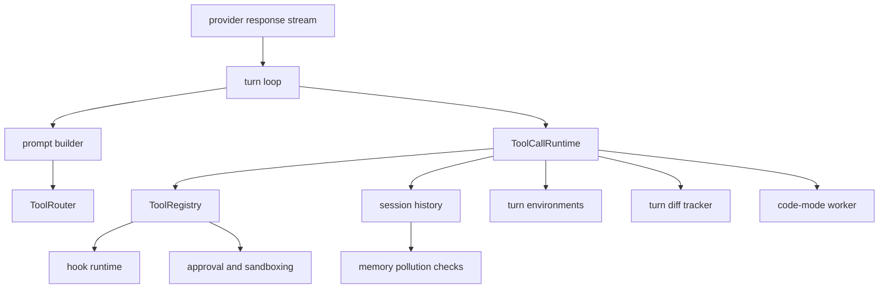

For Freeflow, this is the reason a local tool system cannot be designed as a standalone utility module only. It needs at least a small history model, prompt builder, policy gate, trace writer, and follow-up loop.

## Tool Dispatch

Once the router has a `ToolCall`, the runtime dispatch path begins.

The key objects:

```text
ToolCallRuntime
ToolRegistry
CoreToolRuntime
ToolInvocation
AnyToolResult
```

### `ToolInvocation`

`ToolInvocation` packages the context needed to run a tool:

- session
- turn context
- cancellation token
- diff tracker
- call id
- tool name
- source
- payload

Source:

- `/private/tmp/openai-codex-study-pass0/codex-rs/core/src/tools/context.rs`

Plain version:

```text
ToolCall is what the model asked for.
ToolInvocation is what the runtime needs to execute it.
```

For our harness, a minimal invocation could be:

```text
ToolInvocation:
  run_id
  step_id
  tool_call_id
  tool_name
  payload
  workspace_root
  policy
  cancellation_token
  trace
```

### `ToolRegistry`

The registry maps tool names to handlers.

It:

- rejects unsupported tool calls
- checks payload compatibility
- runs lifecycle start
- runs pre-tool hooks
- lets hooks rewrite input
- executes the tool handler
- records telemetry
- runs post-tool hooks
- can replace model-visible output with hook feedback
- records lifecycle finish

Source:

- `/private/tmp/openai-codex-study-pass0/codex-rs/core/src/tools/registry.rs`

This is much more than a dictionary lookup.

It is the central checkpoint where cross-cutting behavior happens.

For our harness, we should not scatter policy checks inside every tool. We should have:

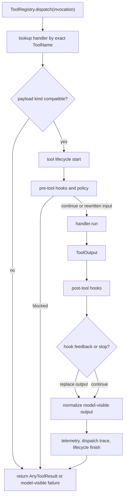

### Payload Compatibility

Codex checks whether the handler accepts the payload kind.

For example:

- `exec_command` expects function arguments
- `apply_patch` expects custom/freeform input
- `tool_search` expects tool-search arguments

If the model calls a tool with the wrong payload, the runtime rejects or reports it.

Current Codex behavior is sharper than that plain-English sentence:

- Missing handler names become recoverable model-visible failures such as `unsupported call: ...`.
- Pre-tool hook blocks become recoverable model-visible failures.
- Bad `tool_search` argument parsing becomes a recoverable synthetic tool output.
- Registry payload-kind mismatches are treated as fatal errors in current source.

This matters for local models because they may emit invalid tool-call shapes.

Our harness can be more forgiving than Codex here. For a small local model, most invalid tool calls should be treated as normal recoverable model errors:

```text
Tool call failed:
  read_file expected { path: string }, got string
```

Then the loop can decide whether to let the model repair the call or stop.

## Parallel Tool Execution

Codex has a separate `ToolCallRuntime` to execute tool calls with cancellation and parallel behavior.

The clever part:

```text
if tool supports parallel:
  take a read lock
else:
  take a write lock
```

Multiple read-lock tools can run together.

A write-lock tool blocks other tool execution.

The lock decision is made from exact registry metadata, not from a fuzzy name check. Tests verify that a namespaced MCP tool whose local name happens to match `shell_command` does not inherit shell parallel behavior accidentally.

Source:

- `/private/tmp/openai-codex-study-pass0/codex-rs/core/src/tools/parallel.rs`
- `/private/tmp/openai-codex-study-current/codex-rs/core/src/tools/router_tests.rs`

This gives Codex a simple safety model:

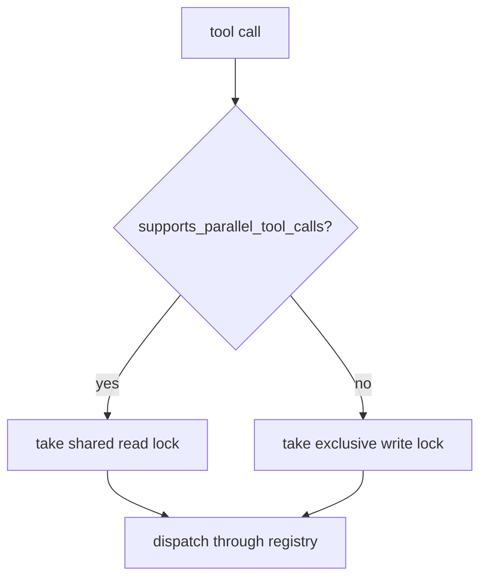

Plain version:

- Read-like tools can overlap.
- State-changing or unsafe tools serialize.

For our local harness:

```text
read_file:
  parallel_safe = true

search_text:
  parallel_safe = true

inspect_diff:
  parallel_safe = true

run_command:
  parallel_safe = false by default

apply_patch:
  parallel_safe = false
```

Small local models may not use parallel tool calls reliably at first, but the runtime should still encode the capability.

### Cancellation

`ToolCallRuntime` also handles cancellation.

If cancellation arrives:

- some tools are aborted immediately
- some tools are allowed to finish teardown
- an aborted response is returned to the model-visible history
- lifecycle events record the abort

For a local harness, cancellation matters because delegated agents should have hard budgets:

- max steps
- max wall time
- max command time
- max output size
- max retries

If a local agent exceeds a budget, the orchestrator should get a structured partial result, not a hanging process.

## Approval And Sandboxing

Codex has a dedicated `ToolOrchestrator` for approval and sandbox behavior.

The file-level comment summarizes its job:

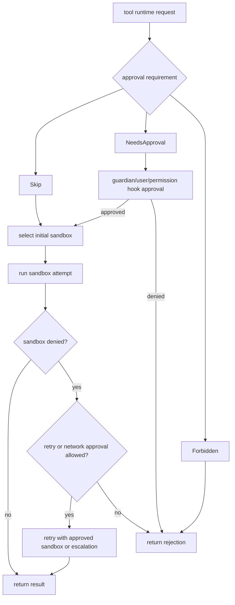

Source:

- `/private/tmp/openai-codex-study-pass0/codex-rs/core/src/tools/orchestrator.rs`

### Approval Requirement

Codex represents approval as:

```text
Skip
NeedsApproval
Forbidden
```

Source:

- `/private/tmp/openai-codex-study-pass0/codex-rs/core/src/tools/sandboxing.rs`

This is better than a boolean.

A boolean can only say:

```text
allowed / not allowed
```

Codex needs:

```text
allowed without prompt
needs human/guardian approval
forbidden by policy
```

For our local harness, we can use:

```text
PolicyDecision:
  allow
  deny
  needs_orchestrator_approval
  needs_user_approval
```

Since the local agent is delegated by a frontier orchestrator, many "approval" decisions may route back to the orchestrator instead of a human.

### Sandbox Attempt

`SandboxAttempt` contains:

- selected sandbox type
- permission profile
- network enforcement
- sandbox policy cwd, represented as `PathUri` in the current source
- workspace roots
- platform-specific sandbox settings
- network cancellation token

Source:

- `/private/tmp/openai-codex-study-pass0/codex-rs/core/src/tools/sandboxing.rs`
- `/private/tmp/openai-codex-study-current/codex-rs/core/src/tools/sandboxing.rs`
- `/private/tmp/openai-codex-study-current/codex-rs/core/src/tools/orchestrator.rs`

The important lesson:

```text
tools do not just run
they run inside an explicit attempt context
```

Current-source correction:

```text
Do not model sandbox cwd as just a native path string.
Codex now carries sandbox policy cwd as PathUri so local, remote, and multi-environment paths stay explicit.
```

For our local harness, the first version can be simpler:

```text
SandboxAttempt:
  cwd
  read_roots
  write_roots
  network_allowed
  command_timeout_ms
  env_policy
```

We do not need OS-level sandboxing on day one if that slows us down, but we should still model the permission decision explicitly.

### Denied Reads Matter

Codex has tests showing that explicit escalation must not bypass denied-read restrictions.

If a policy says "do not read `.env` files," running outside the sandbox could silently remove that restriction.

So Codex preserves denied-read constraints even when escalation is requested.

Source:

- `/private/tmp/openai-codex-study-pass0/codex-rs/core/src/tools/sandboxing_tests.rs`

For our local harness:

```text
deny paths must be enforced before tool execution
```

Even a read-only local agent should not read:

- `.env`
- secrets
- credentials
- private keys
- package manager auth tokens
- user home directories outside allowed roots

### Network Approval

Codex has a separate network approval service.

It can:

- detect blocked network requests
- ask for host approval
- cache session approvals/denials
- support immediate or deferred approval modes
- cancel network-denied runs

Source:

- `/private/tmp/openai-codex-study-pass0/codex-rs/core/src/tools/network_approval.rs`

For our first local harness:

```text
network: false by default
```

If the delegated local model needs external docs, the frontier orchestrator should usually fetch or provide that context. Giving a small local model open network access increases noise and risk.

Later, local harness could support:

```text
network:
  disabled
  allowlist
  orchestrator-approved
```

## Shell And Unified Exec

Codex has shell-like tools, but the architecture is not "just shell out."

There are handler layers and runtime layers.

### Handler Layer

The handler parses the model arguments and prepares a request.

For `exec_command`, the handler:

- parses JSON arguments
- resolves environment and working directory
- resolves shell mode
- creates process id
- validates additional permission requests
- intercepts `apply_patch`
- calls the unified exec manager
- converts response into `ToolOutput`

Source:

- `/private/tmp/openai-codex-study-pass0/codex-rs/core/src/tools/handlers/unified_exec/exec_command.rs`

### Runtime Layer

The runtime owns:

- approval keys
- guardian/user approval request shape
- permission request hook payload
- sandbox policy cwd
- network approval spec
- process launch under a sandbox attempt

Source:

- `/private/tmp/openai-codex-study-pass0/codex-rs/core/src/tools/runtimes/unified_exec.rs`
- `/private/tmp/openai-codex-study-pass0/codex-rs/core/src/tools/runtimes/shell.rs`

Plain version:

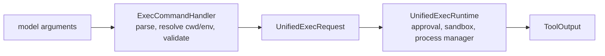

For our local harness, keep this split:

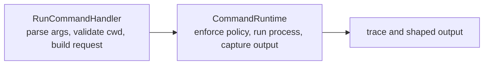

Do not let random handler code call `subprocess.run` directly.

## Apply Patch

`apply_patch` is one of the best design references for our local harness.

It is a freeform/custom tool backed by a grammar.

The model does not pass JSON. It passes patch text matching a grammar.

Source:

- `/private/tmp/openai-codex-study-pass0/codex-rs/core/src/tools/handlers/apply_patch_spec.rs`

### Why It Is Structured

File editing is dangerous.

Codex avoids treating it as arbitrary shell text.

Instead, `apply_patch`:

```mermaid
flowchart TD
  PatchText["freeform patch text"]
  Grammar["parse grammar"]
  Verify["verify against filesystem"]
  Env["resolve selected environment"]
  Paths["compute affected paths"]
  Permissions["compute write permissions"]
  Safety["safety assessment"]
  Orchestrator["shared approval/sandbox orchestrator"]
  Runtime["apply patch runtime"]
  Events["patch lifecycle events"]
  Result["model-visible result"]

  PatchText --> Grammar --> Verify --> Env --> Paths --> Permissions --> Safety
  Safety --> Orchestrator --> Runtime --> Events --> Result
```

Source:

- `/private/tmp/openai-codex-study-pass0/codex-rs/core/src/tools/handlers/apply_patch.rs`
- `/private/tmp/openai-codex-study-pass0/codex-rs/core/src/tools/runtimes/apply_patch.rs`

### Shell Interception

Codex also intercepts `apply_patch` when the model tries to invoke it through shell-like tools.

That means a patch-shaped shell command can be routed into the structured patch path instead of becoming arbitrary shell execution.

Source:

- `/private/tmp/openai-codex-study-pass0/codex-rs/core/src/tools/handlers/apply_patch.rs`
- `/private/tmp/openai-codex-study-pass0/codex-rs/core/src/tools/handlers/shell.rs`
- `/private/tmp/openai-codex-study-pass0/codex-rs/core/src/tools/handlers/unified_exec/exec_command.rs`

For our local harness:

```text
make the safe edit path easy
make the unsafe shell-edit path hard
```

First version can be read-only. Second version can add structured patch suggestions without applying them. Later version can apply patches behind policy gates.

## MCP, Dynamic Tools, And Extensions

Codex supports more than built-in tools.

### MCP Tools

MCP handlers adapt external MCP tool metadata into Codex tool specs and runtime handlers.

They also:

- support namespaced tool names
- expose source information for tool search
- infer parallel safety from read-only hints
- convert MCP results into model-visible outputs
- participate in hooks

Source:

- `/private/tmp/openai-codex-study-pass0/codex-rs/core/src/tools/handlers/mcp.rs`

### Dynamic Tools

Dynamic tools come from the current thread/session.

They can be direct or deferred.

When invoked, Codex sends a dynamic tool request event and waits for a response.

Source:

- `/private/tmp/openai-codex-study-pass0/codex-rs/core/src/tools/handlers/dynamic.rs`

### Extension Tools

Extension tools are adapted into the core runtime.

The adapter passes:

- conversation history
- environments
- filesystem sandbox contexts
- turn item emitters
- model and truncation metadata
- payload

Source:

- `/private/tmp/openai-codex-study-pass0/codex-rs/core/src/tools/handlers/extension_tools.rs`
- `/private/tmp/openai-codex-study-current/codex-rs/core/src/tools/handlers/extension_tools.rs`

The external-tool shape is:

```mermaid
flowchart TD
  Planner["tool planner"]
  MCP["MCP metadata"]
  Dynamic["dynamic thread tools"]
  Extension["extension executors"]
  Handler["adapter handler"]
  Spec["ToolSpec or loadable spec"]
  Registry["ToolRegistry"]
  ExternalRuntime["external runtime or host"]
  Output["model-visible output"]

  MCP --> Handler
  Dynamic --> Handler
  Extension --> Handler
  Handler --> Spec
  Planner --> Registry
  Handler --> Registry
  Registry --> ExternalRuntime --> Output
```

For our local harness:

Do not build all of this first.

But design the registry so later external tool sources can plug in:

```mermaid
flowchart LR
  Builtin["builtin"]
  Skill["freeflow_skill"]
  MCPSource["mcp"]
  Plugin["plugin"]
  Script["custom_user_script"]
  Registry["registry"]

  Builtin --> Registry
  Skill --> Registry
  MCPSource --> Registry
  Plugin --> Registry
  Script --> Registry
```

The first implementation can use only built-ins.

## Tool Search

`tool_search` is Codex's answer to a large tool catalog.

It uses BM25 over tool search text.

The model calls:

```text
tool_search(query, limit)
```

The handler returns matching loadable tool specs.

Source:

- `/private/tmp/openai-codex-study-pass0/codex-rs/core/src/tools/handlers/tool_search.rs`

This is very relevant for local models.

Small models have less context and worse tool-selection reliability.

So instead of showing every possible tool, use:

```mermaid
flowchart TD
  Task["task packet"]
  Core["core tools visible by default"]
  Searchable["rare tools searchable"]
  Injected["task-specific tools injected by orchestrator"]
  Model["local model tool menu"]

  Task --> Core --> Model
  Task --> Searchable --> Model
  Task --> Injected --> Model
```

For our first local harness, a simple static capability filter is enough:

```text
task.kind = "review"
  visible tools: read_file, search_text, inspect_diff

task.kind = "research"
  visible tools: read_file, search_text, summarize_chunk

task.kind = "patch_suggestion"
  visible tools: read_file, search_text, propose_patch
```

Later, add tool search if tool count grows.

## Code Mode

Codex has a code-mode surface where the model writes code into a runtime.

Code mode can expose nested tool definitions to the code runtime.

Important detail:

```mermaid
flowchart LR
  CodeMode["code-mode surface"]
  Nested["nested tool call"]
  Runtime["ToolCallRuntime"]
  Registry["ToolRegistry"]
  Policy["same policy-aware dispatcher"]

  CodeMode --> Nested --> Runtime --> Registry --> Policy
```

The code-mode runtime does not get a separate unsafe dispatch path.

Source:

- `/private/tmp/openai-codex-study-pass0/codex-rs/core/src/tools/code_mode/mod.rs`
- `/private/tmp/openai-codex-study-pass0/codex-rs/core/src/tools/code_mode/delegate.rs`
- `/private/tmp/openai-codex-study-pass0/codex-rs/core/src/tools/code_mode/execute_handler.rs`

For our local harness:

Do not build code mode first.

But learn the principle:

Every execution surface should route tools through the same policy-aware dispatcher.

If we later add a Python scratchpad, Node scratchpad, or SQL scratchpad, tool calls from that scratchpad should not bypass policy.

## Output Handling

Codex does not dump raw output blindly.

Outputs are shaped for:

- model history
- logging
- hooks
- lifecycle events
- code-mode responses
- truncation policy

Examples:

- shell output includes exit code, wall time, and truncation
- MCP output includes wall time and content sanitization
- apply_patch output contains patch application result
- aborted tools return structured abort messages

Source:

- `/private/tmp/openai-codex-study-pass0/codex-rs/core/src/tools/mod.rs`
- `/private/tmp/openai-codex-study-pass0/codex-rs/core/src/tools/context.rs`
- `/private/tmp/openai-codex-study-pass0/codex-rs/tools/src/tool_output.rs`

For local models, output shaping is a performance feature.

Bad output:

```text
giant raw command output
```

Better output:

```text
Exit code: 0
Wall time: 0.2 seconds
Output:
first relevant lines...
[truncated]
```

Best output for delegated tasks:

```text
ToolResult:
  success: true
  summary: found 3 matches
  evidence:
    - file.py:10
    - file.py:42
  raw_excerpt: ...
  truncated: true
```

The local agent should receive compact, evidence-rich tool outputs.

```mermaid
flowchart TD
  Raw["raw runtime result"]
  Shape["ToolOutput shaping"]
  ModelItem["model-visible response item"]
  Hooks["post-tool hook payload"]
  Logs["telemetry/log preview"]
  CodeMode["code-mode result"]
  Memory["external-context memory guard"]
  History["recorded history"]

  Raw --> Shape
  Shape --> ModelItem --> History
  Shape --> Hooks
  Shape --> Logs
  Shape --> CodeMode
  Shape --> Memory
```

## Hooks And Lifecycle

Codex tools participate in lifecycle and hook systems.

The registry can run:

- pre-tool-use hooks
- post-tool-use hooks
- permission request hooks
- lifecycle start/finish notifications

Pre-tool hooks can block or rewrite input.

Post-tool hooks can add context, stop execution, or replace model-visible output with feedback.

Source:

- `/private/tmp/openai-codex-study-pass0/codex-rs/core/src/tools/registry.rs`
- `/private/tmp/openai-codex-study-pass0/codex-rs/core/src/tools/orchestrator.rs`

For our local harness:

Do not build a full hook system first.

But preserve these extension points:

```mermaid
flowchart TD
  Invocation["before_tool(invocation)"]
  Before{"allow, block, or rewrite?"}
  Run["run tool"]
  After["after_tool(invocation, output)"]
  AfterDecision{"continue, stop, or add context?"}
  Final["before_final(result)"]
  FinalDecision{"accept, request revision, or mark failed?"}

  Invocation --> Before
  Before -->|block| Final
  Before -->|allow or rewrite| Run --> After --> AfterDecision
  AfterDecision --> Final --> FinalDecision
```

This can power Freeflow policy later without hardcoding everything in tool handlers.

## Behavioral Evidence From Tests

Codex has tests that reveal intended behavior.

### Parallel Tools Actually Run In Parallel

Tests assert that safe tools overlap in time.

Examples:

- read-like sync tools run in parallel
- shell tools can run in parallel
- mixed parallel tools run in parallel

Source:

- `/private/tmp/openai-codex-study-pass0/codex-rs/core/tests/suite/tool_parallelism.rs`

Lesson:

Parallel safety is not just declared. It is behaviorally tested.

### Tool Outputs Are Grouped After Tool Calls

Codex tests that function calls appear before function call outputs and that outputs match call order.

Source:

- `/private/tmp/openai-codex-study-pass0/codex-rs/core/tests/suite/tool_parallelism.rs`

Lesson:

History ordering matters. The next model request depends on a coherent transcript.

### Tool Execution Can Start Before Stream Completion

Current tests also assert that shell tools can start before `response.completed` when the model stream delays completion.

Source:

- `/private/tmp/openai-codex-study-current/codex-rs/core/tests/suite/tool_parallelism.rs`

Lesson:

Do not confuse output recording order with execution start time. The harness can start safe tool futures as soon as calls are complete, then wait to record outputs until transcript order is safe.

### Namespaced Tool Names Must Match Exactly

Codex tests that parallel support and handler lookup do not accidentally match the wrong namespaced tool.

Source:

- `/private/tmp/openai-codex-study-pass0/codex-rs/core/src/tools/router_tests.rs`
- `/private/tmp/openai-codex-study-pass0/codex-rs/core/src/tools/registry_tests.rs`

Lesson:

Tool names are identities, not loose strings.

For our harness:

```text
mcp.github.search
github.search
search
```

must not accidentally point to the same handler unless explicitly aliased.

### Deferred Tools Are Hidden From Initial Specs

Codex tests that deferred dynamic tools are omitted from the initial model-visible spec list.

Source:

- `/private/tmp/openai-codex-study-pass0/codex-rs/core/src/tools/router_tests.rs`

Lesson:

Visibility policy is testable.

### Sandbox Escalation Preserves Denied Reads

Codex tests that escalation does not drop denied-read restrictions.

Source:

- `/private/tmp/openai-codex-study-pass0/codex-rs/core/src/tools/sandboxing_tests.rs`

Lesson:

Security policy has edge cases. Tests should encode them directly.

## What Freeflow Should Borrow

### Borrow The Spec/Runtime Split

Freeflow local harness should distinguish:

```mermaid
flowchart LR
  Model["local model"]
  Spec["ToolSpec<br/>what the model sees"]
  Runtime["ToolRuntime<br/>what actually runs"]
  Machine["workspace and process boundary"]

  Spec --> Model
  Model -->|tool call| Runtime
  Runtime --> Machine
```

This makes the harness model-agnostic. Ollama, LM Studio, MLX, OpenAI-compatible servers, Anthropic, and others can all receive provider-specific specs, while the local runtime still uses one internal registry.

### Borrow Visibility Levels

Start with simpler visibility:

```text
visible
hidden
deferred
```

We probably do not need `DirectModelOnly` at first.

Use visible tools sparingly for local models.

### Borrow Central Dispatch

All tools should go through:

```mermaid
flowchart LR
  Router["ToolRouter"]
  Registry["ToolRegistry"]
  Runtime["ToolRuntime"]
  Policy["PolicyGate"]
  Trace["TraceLog"]

  Router --> Registry --> Policy --> Runtime --> Trace
```

No tool should directly perform dangerous side effects outside this path.

### Borrow Structured Editing

Do not let the first write-capable local model use arbitrary shell edits.

Use:

```mermaid
flowchart LR
  Suggest["propose_patch"]
  Review["orchestrator or policy review"]
  Apply["apply_patch behind approval"]
  Verify["verify patch"]

  Suggest --> Review --> Apply --> Verify
```

And require patch verification before writes.

### Borrow Permission Modeling

Even before OS-level sandboxing, model permissions explicitly:

```text
read_roots
write_roots
deny_paths
network
max_command_time
max_output
```

### Borrow Evidence-First Outputs

Tool results should be optimized for local model accuracy:

```text
small
structured
evidence-rich
truncated safely
```

### Borrow Tests As Design

The local harness should have tests for:

- invalid tool calls
- unknown tools
- hidden tools not visible
- read tools parallel-safe
- write tools serialized
- deny-path enforcement
- command timeout
- output truncation
- trace creation
- final result schema validation

## What Not To Copy Yet

Do not copy these in the first version:

- full MCP connector system
- dynamic tool request/response events
- extension tool bridge
- code mode
- multi-environment execution
- zsh-fork execution
- guardian review
- managed network proxy
- granular long-lived approvals
- platform-specific sandbox integrations

These are real production systems, but they are not needed for the first proof of the local harness.

Copy the architecture principles, not the entire system.

## Design Lessons For Small Local Models

Small local models are fast and cheap, but weaker at:

- long-horizon planning
- following large tool catalogs
- recovering from malformed tool schemas
- judging risky side effects
- interpreting huge command outputs
- knowing when they are uncertain

So the harness should compensate.

### Give Fewer Tools

Default tool list:

```text
read_file
list_files
search_text
inspect_diff
final_result
```

Only add command or patch tools when the task requires them.

### Make Tool Schemas Narrow

Bad:

```text
run_command(command: string)
```

Better:

```text
search_text(pattern, path_glob, max_results)
read_file(path, start_line, max_lines)
inspect_diff(file_path)
```

Use shell only when narrow tools cannot do the job.

### Prefer Read-Only Delegation First

The first local agent should be excellent at:

- scanning files
- finding references
- summarizing evidence
- checking diffs
- doing second-opinion review
- extracting TODOs
- comparing artifacts

Write-capable local agents can come later.

### Return Structured Results

The local agent's final answer should not be casual prose only.

Use a result schema:

```text
LocalAgentResult:
  status: success | partial | failed | blocked
  task
  summary
  findings
  evidence
  files_examined
  tools_used
  confidence
  risks
  trace_path
  raw_final_answer
```

The frontier orchestrator can verify and decide whether to trust it.

### Treat Local Output As Evidence, Not Authority

The local model can be used generously because it is cheap.

But its output should be paired with:

- trace logs
- source citations
- confidence
- risk notes
- frontier-model verification

The orchestrator remains responsible for final trust.

## Suggested First Local Tool Contract

This is not the implementation spec, but a useful first shape.

### Tool Spec Type

```text
ToolSpec:
  name: string
  description: string
  input_schema: JSON schema
  visibility: visible | deferred | hidden
  parallel_safe: boolean
  risk: low | medium | high
```

### Tool Call Type

```text
ToolCall:
  id: string
  name: string
  arguments: object | string
```

### Tool Output Type

```text
ToolOutput:
  success: boolean
  summary: string
  content: string | object
  evidence: EvidenceRef[]
  truncated: boolean
  metadata: object
```

### Evidence Ref

```text
EvidenceRef:
  path: string
  line_start: number?
  line_end: number?
  note: string?
```

### Tool Runtime Interface

```text
ToolRuntime:
  name()
  spec()
  visibility()
  parallel_safe()
  validate(arguments)
  run(invocation, sandbox_attempt)
```

### Policy Gate

```text
PolicyGate:
  before_tool(invocation) -> allow | deny | ask_orchestrator
  after_tool(invocation, output) -> continue | stop
```

### First Tool Set

```text
list_files:
  visible, parallel_safe, low risk

read_file:
  visible, parallel_safe, low risk

search_text:
  visible, parallel_safe, low risk

inspect_diff:
  visible, parallel_safe, low risk

run_command:
  deferred or disabled by default, not parallel_safe, medium/high risk

propose_patch:
  deferred, not parallel_safe, medium risk

apply_patch:
  hidden or orchestrator-only at first, high risk
```

## Beginner-Friendly Pseudocode

This is the simple version of the tool system:

```text
tools = build_tools_for_task(task)
in_flight = []

prompt = build_prompt(task, visible_tool_specs(tools))

model_stream = model.stream(prompt)

for completed_item in model_stream.completed_items:
  maybe_call = router.parse_tool_call(completed_item)

  if maybe_call is none:
    finalize_and_record_non_tool_item(completed_item)
    continue

  if maybe_call is recoverable_parse_error:
    record_tool_call_item(completed_item)
    history.add_tool_output(error_message_for_model)
    continue

  call = maybe_call

  record_tool_call_item(completed_item)
  in_flight.append(start_tool_future(call))

wait until response.completed

for future in in_flight in call_order:
  result = await future
  history.add_tool_output(result)

if in_flight is not empty:
  ask model again with updated history
else:
  return final answer
```

This is the more realistic version:

```text
dispatch(call):
  handler = registry.lookup(call.name)

  if handler missing:
    return model_error("unsupported tool")

  validated = handler.validate(call.payload)

  if invalid:
    # Codex treats registry payload-kind mismatches as fatal today.
    # A small local harness may choose recoverable model feedback instead.
    return model_error("invalid arguments")

  decision = policy.before_tool(call)

  if decision denies:
    return model_error(decision.reason)

  if decision needs approval:
    approval = ask_orchestrator(call, decision)
    if approval denied:
      return model_error("approval denied")

  attempt = sandbox.select(call, policy)

  output = handler.run(call, attempt)

  output = truncate_and_shape(output)

  post = policy.after_tool(call, output)

  trace.record(call, decision, attempt, output, post)

  return output
```

## Open Questions

These should be answered later in the actual harness design spec.

1. Should the first local harness be read-only, or should it support patch proposals immediately?
2. Should `run_command` exist in v0, or should we start with structured read/search tools only?
3. Should the local agent be allowed to call Freeflow skills directly, or should the frontier orchestrator inject relevant skill guidance into its prompt?
4. Should tool definitions be authored in Python, YAML, or code-first Pydantic models?
5. Should local tool traces be stored under `.freeflow/`, `docs/research/`, temp files, or a companion runtime state directory?
6. Should policy decisions route to the frontier orchestrator through a result envelope, or should the local harness ever prompt the human directly?
7. How much provider-specific tool calling should v0 support, given local servers vary widely in function-call quality?

## Next Research Passes

This local roadmap has been superseded by the directory README:

```text
docs/research/codex-cli-agent-harness/README.md
```

The next pass after this artifact was correctly Pass 3, because tool execution without a safety model becomes unrealistic quickly.

The completed sequence after this artifact is:

- Pass 3: sandboxing and permissions.
- Pass 4: subagents and delegation.
- Pass 5: model providers and runtime adapters.
- Pass 6: memory and context.
- Pass 7: config and extensibility.
- Pass 8: agent harness comparisons.

Remaining work is to convert the Codex research plus comparison findings into the Freeflow local harness design spec, after refreshing active upstream sources again.

## Source Evidence Appendix

### Current Audit Source

- Original snapshot worktree: `/private/tmp/openai-codex-study-pass0`
- Current audit worktree: `/private/tmp/openai-codex-study-current`
- Current audit ref: `origin/main` at `0fed4497f50ad5f0b2f7972a1bfd14c5a09a85c5`

### Turn Loop Integration

- `/private/tmp/openai-codex-study-current/codex-rs/core/src/session/turn.rs`
- `/private/tmp/openai-codex-study-current/codex-rs/core/src/stream_events_utils.rs`
- `/private/tmp/openai-codex-study-current/codex-rs/core/src/tools/parallel.rs`
- `/private/tmp/openai-codex-study-current/codex-rs/core/src/tools/router.rs`

### Tool Contracts

- `/private/tmp/openai-codex-study-pass0/codex-rs/tools/src/tool_executor.rs`
- `/private/tmp/openai-codex-study-pass0/codex-rs/tools/src/tool_spec.rs`
- `/private/tmp/openai-codex-study-pass0/codex-rs/tools/src/tool_payload.rs`
- `/private/tmp/openai-codex-study-pass0/codex-rs/tools/src/tool_output.rs`
- `/private/tmp/openai-codex-study-pass0/codex-rs/protocol/src/tool_name.rs`

### Tool Planning And Visibility

- `/private/tmp/openai-codex-study-pass0/codex-rs/core/src/tools/spec_plan.rs`
- `/private/tmp/openai-codex-study-pass0/codex-rs/core/src/tools/mod.rs`
- `/private/tmp/openai-codex-study-pass0/codex-rs/core/src/tools/hosted_spec.rs`

### Routing And Registry

- `/private/tmp/openai-codex-study-pass0/codex-rs/core/src/tools/router.rs`
- `/private/tmp/openai-codex-study-pass0/codex-rs/core/src/tools/registry.rs`
- `/private/tmp/openai-codex-study-pass0/codex-rs/core/src/tools/context.rs`
- `/private/tmp/openai-codex-study-pass0/codex-rs/core/src/tools/parallel.rs`

### Approval And Sandboxing

- `/private/tmp/openai-codex-study-pass0/codex-rs/core/src/tools/orchestrator.rs`
- `/private/tmp/openai-codex-study-pass0/codex-rs/core/src/tools/sandboxing.rs`
- `/private/tmp/openai-codex-study-pass0/codex-rs/core/src/tools/network_approval.rs`
- `/private/tmp/openai-codex-study-pass0/codex-rs/core/src/tools/runtimes/mod.rs`
- `/private/tmp/openai-codex-study-current/codex-rs/core/src/tools/orchestrator.rs`
- `/private/tmp/openai-codex-study-current/codex-rs/core/src/tools/sandboxing.rs`
- `/private/tmp/openai-codex-study-current/codex-rs/core/src/tools/runtimes/mod.rs`

### Shell And Exec

- `/private/tmp/openai-codex-study-pass0/codex-rs/core/src/tools/handlers/shell.rs`
- `/private/tmp/openai-codex-study-pass0/codex-rs/core/src/tools/runtimes/shell.rs`
- `/private/tmp/openai-codex-study-pass0/codex-rs/core/src/tools/handlers/unified_exec.rs`
- `/private/tmp/openai-codex-study-pass0/codex-rs/core/src/tools/handlers/unified_exec/exec_command.rs`
- `/private/tmp/openai-codex-study-pass0/codex-rs/core/src/tools/handlers/unified_exec/write_stdin.rs`
- `/private/tmp/openai-codex-study-pass0/codex-rs/core/src/tools/runtimes/unified_exec.rs`
- `/private/tmp/openai-codex-study-current/codex-rs/core/src/tools/handlers/unified_exec/exec_command.rs`
- `/private/tmp/openai-codex-study-current/codex-rs/core/src/tools/runtimes/unified_exec.rs`

### Apply Patch

- `/private/tmp/openai-codex-study-pass0/codex-rs/core/src/tools/handlers/apply_patch_spec.rs`
- `/private/tmp/openai-codex-study-pass0/codex-rs/core/src/tools/handlers/apply_patch.rs`
- `/private/tmp/openai-codex-study-pass0/codex-rs/core/src/tools/runtimes/apply_patch.rs`
- `/private/tmp/openai-codex-study-pass0/codex-rs/core/src/tools/handlers/apply_patch.lark`
- `/private/tmp/openai-codex-study-current/codex-rs/core/src/tools/handlers/apply_patch.rs`

### External And Dynamic Tools

- `/private/tmp/openai-codex-study-pass0/codex-rs/core/src/tools/handlers/mcp.rs`
- `/private/tmp/openai-codex-study-pass0/codex-rs/core/src/tools/handlers/dynamic.rs`
- `/private/tmp/openai-codex-study-pass0/codex-rs/core/src/tools/handlers/extension_tools.rs`
- `/private/tmp/openai-codex-study-pass0/codex-rs/core/src/tools/handlers/tool_search.rs`
- `/private/tmp/openai-codex-study-current/codex-rs/core/src/tools/handlers/extension_tools.rs`
- `/private/tmp/openai-codex-study-current/codex-rs/core/src/tools/handlers/view_image.rs`

### Code Mode

- `/private/tmp/openai-codex-study-pass0/codex-rs/core/src/tools/code_mode/mod.rs`
- `/private/tmp/openai-codex-study-pass0/codex-rs/core/src/tools/code_mode/execute_handler.rs`
- `/private/tmp/openai-codex-study-pass0/codex-rs/core/src/tools/code_mode/execute_spec.rs`
- `/private/tmp/openai-codex-study-pass0/codex-rs/core/src/tools/code_mode/delegate.rs`

### Tests

- `/private/tmp/openai-codex-study-pass0/codex-rs/core/tests/suite/tool_parallelism.rs`
- `/private/tmp/openai-codex-study-pass0/codex-rs/core/src/tools/router_tests.rs`
- `/private/tmp/openai-codex-study-pass0/codex-rs/core/src/tools/registry_tests.rs`
- `/private/tmp/openai-codex-study-pass0/codex-rs/core/src/tools/sandboxing_tests.rs`
- `/private/tmp/openai-codex-study-pass0/codex-rs/core/src/tools/handlers/apply_patch_tests.rs`
- `/private/tmp/openai-codex-study-pass0/codex-rs/core/src/tools/handlers/unified_exec_tests.rs`
- `/private/tmp/openai-codex-study-current/codex-rs/core/tests/suite/tool_parallelism.rs`
- `/private/tmp/openai-codex-study-current/codex-rs/core/src/tools/router_tests.rs`
- `/private/tmp/openai-codex-study-current/codex-rs/core/src/tools/registry_tests.rs`
- `/private/tmp/openai-codex-study-current/codex-rs/core/src/tools/sandboxing_tests.rs`

## Working Interpretation

Codex's tool system is a production-grade answer to a simple problem:

```text
How can a model safely affect the outside world?
```

The answer is not:

```text
give the model shell access
```

The answer is:

```text
give the model schemas
normalize its calls
dispatch through one registry
enforce policy centrally
run dangerous tools under explicit attempts
shape outputs for the next model request
record traces and lifecycle events
test the edge cases
```

For the Freeflow local-model harness, this pass strongly supports a custom minimal harness rather than a thin prompt wrapper around Gemma or another local model.

The first useful local harness should be:

- model-agnostic
- mostly read-only
- narrow-tool-first
- policy-aware
- trace-heavy
- small-context-friendly
- easy for the frontier orchestrator to verify

That is how a local model can become a realistic subagent helper without pretending it is as capable or trustworthy as the main frontier model.
