# Codex CLI Agent Harness Study - Pass 3 Sandboxing And Permissions

> **Doc ID:** RESEARCH-2026-06-12-codex-cli-agent-harness-pass-3
> **Date:** 2026-06-12
> **Owner:** Hassan Mohiddin
> **Type:** Research
> **Status:** Draft
> **Source:** `openai/codex` source snapshot `b65fe3d8976d6fcc44ee6c6cf988654af5fc4d2d`; Pass 0 repo map; Pass 1 turn-loop artifact; Pass 2 tool-system artifact; Freeflow local delegation design discussion.

## Purpose

Preserve the Pass 3 research into Codex's sandboxing, permissions, approval flow, network approval, request-permissions machinery, and safety gates.

This document is written to be beginner-friendly without flattening the architecture. The early sections explain the mental model. The later sections preserve the actual mechanisms, source evidence, test evidence, and implications for Freeflow's future local-agent harness.

This is research memory, not an implementation plan. It should inform future Freeflow local delegation design, but it does not define shipped Freeflow behavior.

## Numbering Note

The original high-level study outline had a broad pass named:

```text
Pass 2 - Tools And Sandbox
```

During research, that became too large to explain cleanly. It was split into two focused passes:

```text
Pass 2 - Tool System
Pass 3 - Sandboxing And Permissions
```

So this document is not a new direction. It is the safety half of the original tool-and-sandbox research.

## How To Read This

If this is your first pass, read only:

- `Core Idea`
- `Diagram Map`
- `Tiny Diagram`
- `Glossary`
- `Safety In Plain English`
- `What Freeflow Should Borrow`

If you are designing the local harness, also read:

- `Deep Mechanism`
- `Permission Profiles`
- `Approval Requirements`
- `Sandbox Attempts`
- `Denied Reads`
- `Request Permissions`
- `Network Approval`
- `Focused Audit Recommendation From Second Pass`
- `Suggested First Local Safety Contract`

If you are implementing or reviewing later, use:

- `Behavioral Evidence From Tests`
- `Source Evidence Appendix`
- `Beginner-Friendly Pseudocode`

## Diagram Map

Use the diagrams as checkpoints. They are not substitutes for the source-backed detail in the later sections.

| If you are trying to understand... | Start with... |
| --- | --- |
| The whole safety path | `Tiny Diagram` |
| Where sandboxing fits in the Codex turn loop | `Turn Loop Integration` |
| Why handlers do not execute effectful tools directly | `Safety Is Centralized Around Tool Runtimes` |
| How permission profiles separate filesystem and network authority | `Permission Profiles` |
| How allow, ask, and deny decisions are made | `Default Approval Policy` |
| How approval, sandbox selection, network approval, and retry compose | `ToolOrchestrator` |
| Why denied reads block unsandboxed escalation | `Denied Reads` |
| How shell execution is normalized before runtime | `Shell Handler` |
| How patching becomes a permission-aware runtime | `Apply Patch` |
| How a model asks for more authority without receiving it directly | `Request Permissions` |
| Why network is approved at runtime, not only before process start | `Network Approval` |
| The recommended first local harness safety contract | `Focused Audit Recommendation From Second Pass` |
| How a blocked local run asks the frontier model for approval | `Approval Return And Resume Model` |
| How path checks avoid root, symlink, and secret-file mistakes | `Path And Secret Boundary Rules` |

## Core Idea

Codex does not let the model directly control the machine.

The model can ask for a tool call. The harness decides whether that tool call is allowed, whether it needs approval, which sandbox it runs in, what filesystem and network access it gets, whether it may retry after a sandbox denial, and how the result is returned.

The strongest lesson from this pass is:

```text
Safety is a typed runtime system, not a paragraph in the prompt.
```

Codex's safety layer is built around data structures such as:

- `PermissionProfile`
- `FileSystemSandboxPolicy`
- `NetworkSandboxPolicy`
- `SandboxPermissions`
- `ExecApprovalRequirement`
- `SandboxAttempt`
- `RequestPermissionsResponse`

Plain-language version:

```text
The model can request action.
The harness owns authority.
```

That distinction matters even more for a local model. A smaller local model can be useful and fast, but it will make more mistakes. A strict harness lets us use it generously without trusting it blindly.

## Tiny Diagram

The simplified safety path:

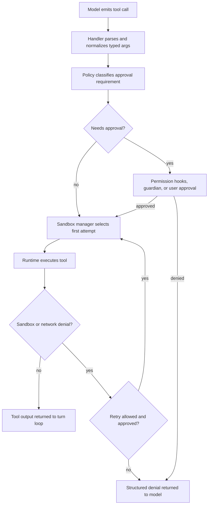

For shell-like tools, the shape becomes:

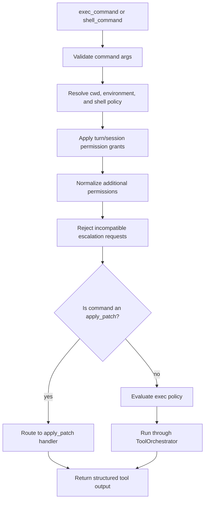

For patching:

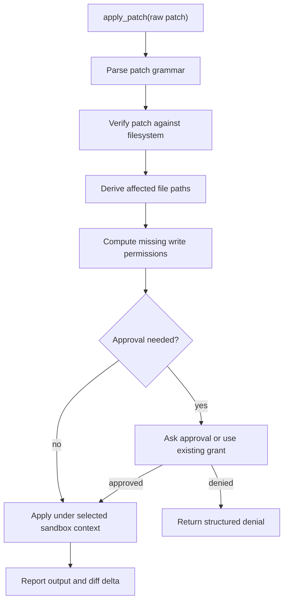

## Glossary

`Permission profile`
: The active authority shape for a turn or session. It says whether Codex owns sandboxing, whether sandboxing is disabled, or whether an external sandbox is expected.

`Filesystem sandbox policy`
: The concrete read/write/deny rules for files and directories.

`Network sandbox policy`
: Whether network is restricted or enabled.

`Sandbox permissions`
: A per-tool-call override request. Codex uses `UseDefault`, `RequireEscalated`, and `WithAdditionalPermissions`.

`Additional permissions`
: Bounded extra authority, such as write access to one extra directory or network access for a specific command.

`Approval requirement`
: The decision object that says a tool can run, needs approval, or is forbidden.

`Sandbox attempt`
: One concrete attempt to run a tool with a selected sandbox, permission profile, cwd, network policy, and platform-specific sandbox settings.

`Exec policy`
: Rule and heuristic system that classifies commands into allow, prompt, or forbid.

`Prefix rule`
: A command-prefix policy rule, such as "allow commands starting with `cargo test`".

`Denied read`
: A filesystem rule that explicitly blocks reading a path or glob. This matters because bypassing the sandbox would accidentally drop the deny rule.

`Request permissions`
: A tool path where the model can ask for more permission as structured data. The response may grant permission for the current turn or the whole session.

`Strict auto-review`
: A mode where later commands in the same turn receive stricter automated review after extra permissions are granted.

`Network approval`
: Separate approval machinery for network access, because network denial can happen during execution rather than before process start.

## Safety In Plain English

Think of the harness like a workshop with locked rooms.

The model can ask:

```text
I want to run this command.
I want to write this file.
I want network access.
I want to patch this directory.
```

But the model does not get the keys directly.

The harness checks:

```text
Is this command safe?
Is this command dangerous?
Is this command explicitly allowed by policy?
Is it asking to leave the sandbox?
Does it need extra write access?
Would escalation drop secret-file protections?
Is network disabled?
Was this permission already granted?
Is the grant turn-scoped or session-scoped?
```

Then the harness decides:

```text
allow
ask for approval
deny
run sandboxed
run with bounded extra permissions
retry after approval
return a failure to the model
```

This is the heart of a real agent harness.

A prompt-only wrapper says:

```text
Be careful. Do not run dangerous commands.
```

A real harness says:

```text
The model cannot run anything until the policy engine permits it.
```

For Freeflow's local model goal, this is the difference between a useful local helper and a risky toy.

## Deep Mechanism

### Safety Is Centralized Around Tool Runtimes

Pass 2 showed that tools are routed through a registry and handlers.

Pass 3 shows what happens when a tool can affect the outside world:

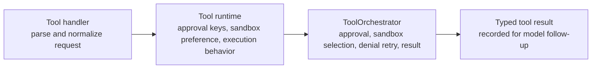

The important part is that the shell handler does not simply call `subprocess.run`, and the patch handler does not simply write files.

They both route through shared machinery.

Source anchors:

- `core/src/tools/sandboxing.rs`
- `core/src/tools/orchestrator.rs`
- `core/src/tools/runtimes/shell.rs`
- `core/src/tools/runtimes/unified_exec.rs`
- `core/src/tools/runtimes/apply_patch.rs`

### Turn Loop Integration

Sandboxing is not a side feature bolted onto shell execution. It sits inside the normal Codex turn loop.

The source path is:

1. `RegularTask::run`
2. `run_turn`
3. `run_sampling_request`
4. `try_run_sampling_request`
5. `handle_output_item_done`
6. `ToolCallRuntime::handle_tool_call`
7. `ToolRouter::dispatch_tool_call_with_terminal_outcome`
8. tool handler
9. `ToolOrchestrator` for effectful runtimes

Mermaid view:

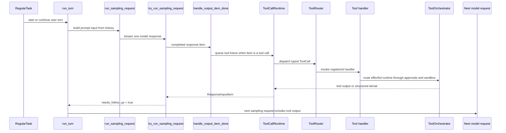

This matters for three reasons.

First, the model does not synchronously "run a command." The model produces a response item. `ToolRouter::build_tool_call` converts that response item into an internal `ToolCall`, and `ToolCallRuntime` queues a future. After the stream completes, the turn loop drains in-flight tool futures and records their outputs as model input for the follow-up request.

Second, approvals and sandbox denials are model-visible outcomes, not panics. A denied shell request, failed permission request, or aborted tool becomes a structured tool output that the next sampling request can see.

Third, `RegularTask::run` may call `run_turn` again with empty initial input if user input arrived while the task was active. That is separate from the inner sampling loop. Codex has:

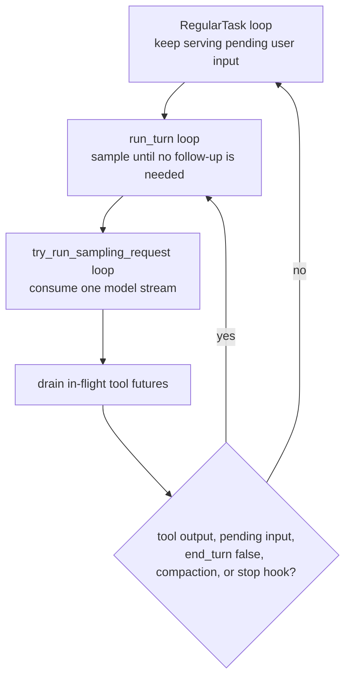

For Freeflow's local harness, the safety lesson is that the permission system should be in the tool-execution path, not in a preamble before the model runs. A local model should emit a request; the harness should convert it into a typed tool call; policy should decide; the result should go back into the loop.

### Permission Profiles

Codex's canonical active permissions live in `PermissionProfile`.

The main variants are:

```text
Managed
Disabled
External
```

Plain-language meaning:

```text
Managed:
  Codex owns sandbox construction.

Disabled:
  No outer sandbox.

External:
  Caller says filesystem isolation is enforced elsewhere.
```

`Managed` contains:

```text
file_system: ManagedFileSystemPermissions
network: NetworkSandboxPolicy
```

The raw runtime authority and the display/profile identity are related but not identical:

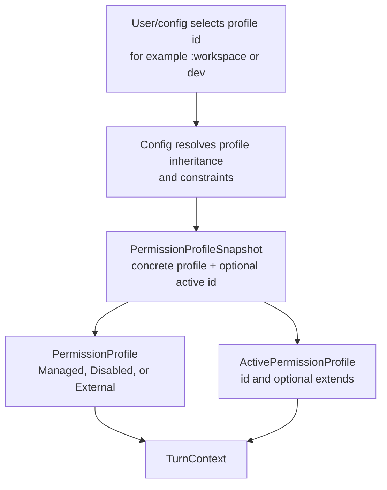

The runtime must honor the concrete `PermissionProfile`. The active profile sidecar exists so clients and analytics can show a stable profile identity without reverse-engineering a name from compiled permissions.

This split matters because filesystem and network are different forms of authority.

Filesystem is about:

- read
- write
- deny
- special paths such as project roots or temp directories
- metadata protections

Network is about:

- restricted
- enabled
- limited/managed network policy in more advanced flows

For Freeflow's local harness, we can borrow the split without copying the full type system.

Suggested first mental model:

```text
LocalPermissionProfile:
  filesystem:
    readable_roots
    writable_roots
    denied_reads
  network:
    disabled | allowed_hosts
  shell:
    disabled | allowed_commands
```

### Filesystem Policy

Codex's filesystem policy can express:

```text
read
write
deny
```

It can target:

- root
- project roots
- tmpdir
- slash tmp
- exact paths
- glob patterns

The surprising part is that `deny` is a first-class access mode, not just absence of read access.

That lets Codex say:

```text
read most things
but do not read **/*.env
```

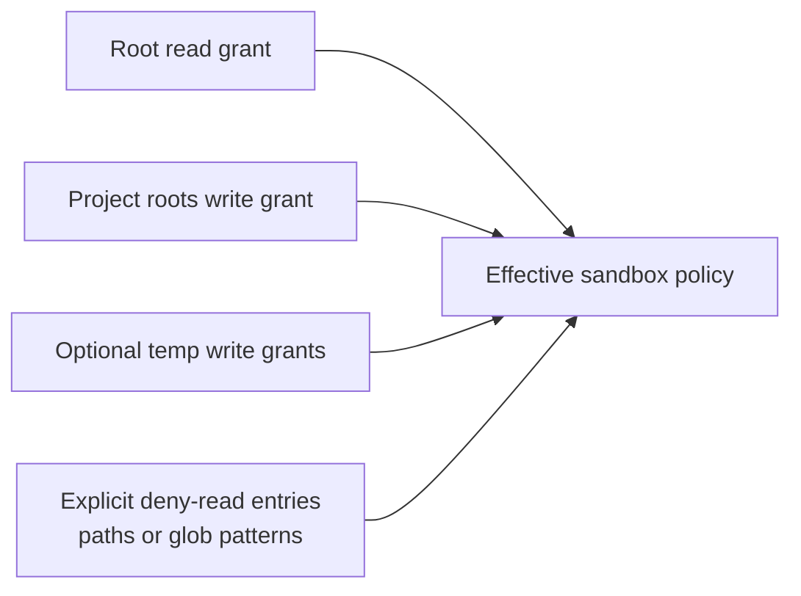

That is different from a naive allowlist. It means the runtime must preserve explicit denials even when other permissions become broader.

For a local harness, this is essential. If we let a local model inspect a repo, denied-read rules should cover:

- `.env`
- `.env.*`
- secret files
- credentials
- private keys
- token caches
- user home secrets
- plugin/auth files where relevant

### Sandbox Permissions

`SandboxPermissions` is a per-command request shape.

Codex defines:

```text
UseDefault
RequireEscalated
WithAdditionalPermissions
```

Plain-language meaning:

```text
UseDefault:
  Run with the turn's normal sandbox.

RequireEscalated:
  Request unsandboxed execution.

WithAdditionalPermissions:
  Stay sandboxed but widen permissions for this one command.
```

This is a strong pattern for local agents.

The model should not say:

```text
please trust me
```

It should say:

```json
{
  "sandbox_permissions": "with_additional_permissions",
  "additional_permissions": {
    "file_system": {
      "write": ["/repo/generated"]
    }
  },
  "justification": "Need to write generated artifact"
}
```

Then policy decides.

### Approval Requirements

Codex's central approval decision is `ExecApprovalRequirement`.

The variants are:

```text
Skip
NeedsApproval
Forbidden
```

`Skip` also carries:

```text
bypass_sandbox: bool
proposed_execpolicy_amendment: Option<...>
```

`NeedsApproval` carries:

```text
reason: Option<String>
proposed_execpolicy_amendment: Option<...>
```

`Forbidden` carries:

```text
reason: String
```

This is one of the cleanest design pieces to borrow.

For the local harness:

```text
PolicyDecision:
  Allow { sandbox_mode }
  NeedsApproval { reason, requested_permissions }
  Deny { reason }
```

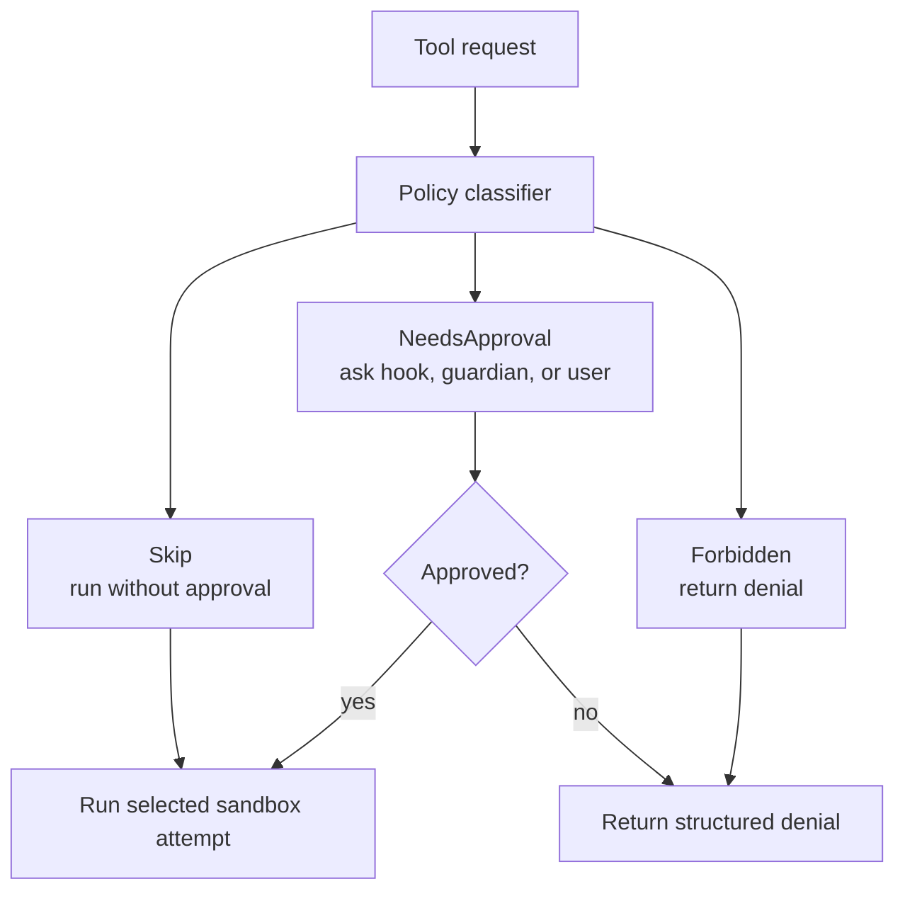

Do not let tools return random strings like:

```text
I think this is unsafe.
```

Make safety decisions structured.

### Default Approval Policy

Codex has user-facing approval policies such as:

```text
UnlessTrusted
OnFailure
OnRequest
Granular(...)
Never
```

The names are less important than the matrix.

Codex combines:

```text
approval policy
filesystem sandbox kind
command classification
per-command sandbox override request
exec-policy rules
```

to decide:

```text
allow, prompt, or forbid
```

The test suite shows this is intentionally a matrix, not a single if-statement.

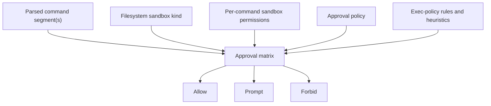

Examples:

- In a restricted sandbox, many non-dangerous commands can run because the sandbox contains them.
- If a command asks for `RequireEscalated`, even `echo hello` may need approval.
- If granular policy disables sandbox approvals, escalation requests are rejected rather than shown to the user.
- If approval policy is `Never`, dangerous commands may be forbidden instead of prompting.

For Freeflow, this suggests an early local harness policy matrix:

```text
read-only task:
  read/list/search allowed
  shell disabled
  write disabled
  network disabled

review task:
  read/list/search/diff allowed
  shell allowlisted test commands only
  write disabled
  network disabled

patch proposal task:
  read/list/search/diff allowed
  propose_patch allowed
  apply_patch disabled or orchestrator-only
  shell allowlisted only
  network disabled
```

### Exec Policy

Codex has an `ExecPolicyManager` that evaluates command rules.

It can load policy files, parse prefix rules, and classify commands.

At runtime, it lowers a shell command into one or more command segments when possible.

Example:

```text
bash -lc "cat LOG.md && curl ... && bash setup.sh"
```

can become:

```text
cat LOG.md
curl ...
bash setup.sh
```

Codex only bypasses the sandbox when every parsed command segment is explicitly allowed by policy.

This matters because a naive prefix rule can be dangerous.

Bad mental model:

```text
The command starts with cat, so allow it.
```

Safer mental model:

```text
Every independent command segment must be allowed.
```

Codex also avoids broad persistent prefix suggestions for dangerous interpreter/shell shapes such as:

- `python`
- `python -c`
- `bash`
- `bash -lc`
- `sh -c`
- `zsh -lc`
- `node`
- `node -e`
- `sudo`
- `osascript`

The local harness should copy that idea.

Allowlisting `python` or `bash` is almost never a safe durable rule. Allowlisting a specific command like `pytest tests/foo.py` is much safer.

### ToolOrchestrator

`ToolOrchestrator` is the central coordinator.

Its flow is roughly:

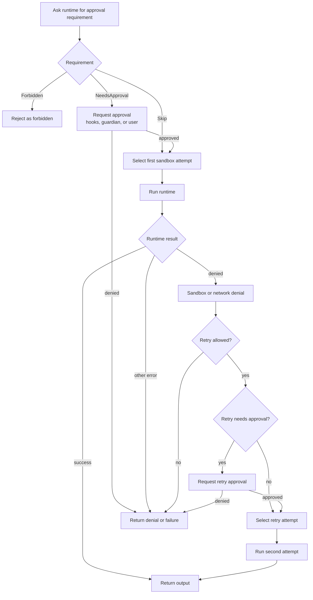

This is a great harness pattern because it keeps safety behavior consistent across tools.

Shell and patching are very different operations, but both pass through the same orchestrator shape.

For Freeflow:

```text
Do not put safety logic inside each local tool ad hoc.
```

Instead:

```text
LocalToolOrchestrator.run(tool, request, context)
```

should own approval, sandbox, retry, trace, and output shaping.

### Approval Cache

Codex has an `ApprovalStore`.

The pattern:

```text
If all approval keys are approved for session:
  skip prompting.
Otherwise:
  ask.
If approved for session:
  cache each key.
```

For shell, the approval key includes:

- canonical command
- cwd
- sandbox permissions
- additional permissions

For apply_patch, approval keys are per file path.

That distinction is important.

Approving one shell command should not approve all shell commands.

Approving one patch file path should not approve unrelated paths.

For a local harness, approval keys should be narrow:

```text
run_command:
  command + cwd + permission request

write_file:
  path + operation

apply_patch:
  affected paths

network:
  host + protocol + port
```

### Sandbox Attempts

`SandboxAttempt` packages the concrete conditions for one execution attempt:

- selected sandbox type
- permission profile
- managed network flag
- sandbox manager
- sandbox cwd
- workspace roots
- Linux sandbox executable
- legacy Landlock flag
- Windows sandbox settings
- network-denial cancellation token

The platform details are not what we need to copy first.

The design principle is:

```text
An execution attempt is data.
```

Do not let a runtime vaguely know "we are sandboxed."

Pass an explicit object:

```text
Attempt:
  cwd
  readable_roots
  writable_roots
  denied_reads
  network_policy
  timeout
  cancellation
```

This makes tests easier and prevents hidden authority leaks.

### Denied Reads

This is the most subtle and important safety finding in Pass 3.

Codex has a rule:

```text
If filesystem policy contains denied-read restrictions,
do not bypass the sandbox.
```

Why?

Because denied reads only exist inside the sandbox. If a command runs without the sandbox, it may accidentally gain access to files that the policy explicitly denied.

Example:

```text
filesystem:
  root = read
  **/*.env = deny

model asks:
  run command with require_escalated
```

Naive behavior:

```text
User approved escalation.
Run outside sandbox.
```

Codex behavior:

```text
Denied reads are active.
Running outside sandbox would drop them.
Keep sandbox enforcement.
```

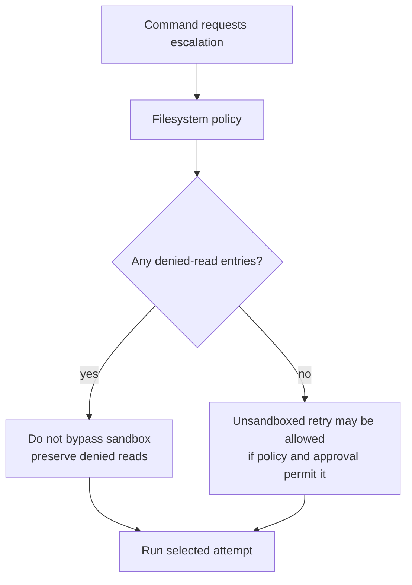

For Freeflow/local harness, this should become a hard rule:

```text
Secret-deny rules are sticky.
Escalation can widen writes or commands only if denied reads remain enforced.
```

This is critical if local agents read repo files.

### Shell Handler

The shell handler does not directly execute a shell command.

It:

1. Resolves the tool environment.
2. Gets the environment filesystem.
3. Applies granted turn/session permissions.
4. Normalizes additional permissions.
5. Rejects invalid escalation requests under incompatible approval policies.
6. Intercepts `apply_patch` commands.
7. Builds a tool lifecycle emitter.
8. Asks exec policy for an approval requirement.
9. Builds a `ShellRequest`.
10. Runs the request through `ToolOrchestrator`.
11. Formats and returns output.

The important split:

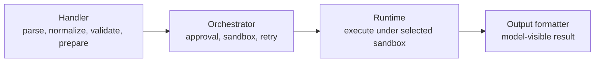

For the first local harness, follow the same split even if the code is much smaller.

### Unified Exec

Codex has both a shell-command runtime and a unified-exec runtime.

Unified exec supports process ids, PTYs, `write_stdin`, and longer-lived process interaction.

For local harness v0, we probably should not copy this.

Reason:

```text
Long-lived interactive processes increase state complexity and safety risk.
```

A first local harness can use:

```text
run_command(command, cwd, timeout_ms, max_output_chars)
```

and return final captured output only.

Interactive process support can wait.

### Apply Patch

Codex treats patching as a structured operation.

Key behaviors:

1. Parse the freeform patch with grammar-backed parsing.
2. Verify the patch against the selected filesystem.
3. Derive affected paths.
4. Compute missing write permissions.
5. Route through the same approval/sandbox orchestrator.
6. Apply using the selected environment filesystem and sandbox context.

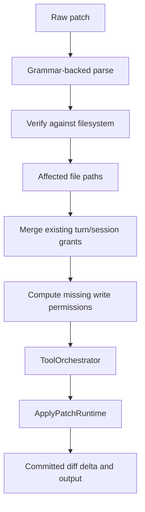

This is exactly what a local harness should do.

Do not let a small local model write arbitrary files via shell:

```text
python - <<'PY'
open("file.py", "w").write(...)
PY
```

Prefer:

```text
propose_patch(patch)
```

then:

```text
main orchestrator verifies and applies
```

For v0, the local model may not need `apply_patch` at all. It can produce:

```text
PatchProposal:
  files
  diff
  rationale
  risks
```

The frontier orchestrator can decide whether to apply.

### Request Permissions

Codex has a `request_permissions` tool.

This lets the model ask for more capability as structured data.

A request includes:

- environment id
- reason
- requested filesystem permissions
- requested network permissions

The response includes:

- granted permissions
- scope: turn or session
- strict auto-review flag

Important behaviors:

- If approval policy is `Never`, Codex returns an empty grant.
- If granular policy disables request-permissions, Codex returns an empty grant.
- Responses are intersected with the original request, so a response cannot grant more than was asked.
- Turn-scoped grants live only in active turn state.
- Session-scoped grants live in session state.
- Strict auto-review cannot be session-scoped; Codex normalizes that away.

This is a very useful idea for local delegation.

The local model should be allowed to say:

```text
I need write access to docs/generated/
```

But the local model should not be allowed to simply take it.

First local harness design:

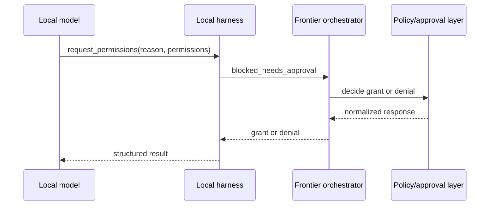

### Permission Grant Scope

Codex separates turn grants and session grants.

Turn-scoped grants:

```text
valid only for the current turn
```

Session-scoped grants:

```text
valid across later turns
```

Tests verify that turn grants do not leak into later turns.

For local harness v0, default should be:

```text
task-scoped only
```

Session grants can exist later, but they should be rare and explicit.

Why?

Local agents are cheap and repeated. If grants leak silently, the system becomes harder to reason about.

### Strict Auto-Review

Codex can pair a permission grant with stricter review for later tool calls in the same turn.

This is important because extra power should increase scrutiny.

The design lesson:

```text
More permission should not mean more trust.
More permission should mean more verification.
```

For Freeflow local delegation:

```text
If local agent gets write/network/shell permission:
  require stronger trace
  require structured final result
  require frontier verification
  maybe require second local review or main model review
```

This aligns with the user's goal: use local models generously but carefully.

### Network Approval

Network is handled separately from filesystem/process safety.

Reason:

```text
Network denial may happen during process execution.
```

A command can start, then try to access a blocked host.

Codex's network approval service tracks:

- active network approval calls
- pending host approvals
- session-approved hosts
- session-denied hosts
- call outcomes

The inline network approval path is gated. Codex denies instead of prompting when there is no active turn, the active permission profile is not `Managed`, or approval policy is `Never`.

The approval key includes:

- host
- protocol
- port

Tests verify:

- pending approvals dedupe by host/protocol/port
- different ports are separate
- session approvals preserve protocol and port
- denied requests cancel active calls
- ambiguous concurrent blocked requests are not guessed

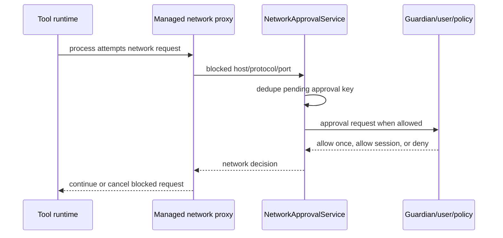

For local harness v0:

```text
network: disabled
```

If we support network later:

```text
network:
  allowlist host/protocol/port
  no broad internet by default
  log every request
  no session-wide open network unless explicitly configured
```

### Hooks And Automated Review

Codex routes some approval decisions through:

- permission request hooks
- guardian review
- user approval

We do not need to copy the full hook/guardian system in v0.

But we should preserve the extension point:

```text
PolicyGate.can_run(tool_call, context) -> PolicyDecision
```

Later, Freeflow can add:

- skill-based policy rules
- repo policy files
- main-orchestrator review
- human approval
- benchmark/eval gates

### Output Handling

When a command or patch fails due to policy or sandboxing, Codex does not simply crash the turn.

It returns a structured failure back through the tool system so the model can continue or report failure.

For local harness, tool outputs should be:

```text
success
failure
blocked
needs_approval
```

and should include:

- command/tool name
- normalized args
- cwd
- policy decision
- output excerpt
- files touched or examined
- risk flags

The frontier orchestrator should be able to inspect the trace without reading every raw log.

## Behavioral Evidence From Tests

Tests are the best way to understand what Codex maintainers consider important.

### Restricted Sandbox Requires Approval Under OnRequest

`default_exec_approval_requirement` skips approval for external sandbox under `OnRequest`, but requires approval for restricted sandbox under `OnRequest`.

Evidence:

- `core/src/tools/sandboxing_tests.rs`

Design lesson:

```text
Approval depends on sandbox shape.
```

### Granular Policy Can Auto-Reject Prompts

If granular approval disables sandbox approval, Codex returns `Forbidden` instead of showing a prompt.

Design lesson:

```text
Do not ask for approval if policy says approval prompts are disabled.
```

For local harness:

```text
Policy can say "never ask local model/human; just deny."
```

### Denied Reads Block Escalation

Tests verify that denied-read rules prevent explicit escalation and policy bypass from dropping the sandbox.

Evidence:

- `deny_read_blocks_explicit_escalation_and_policy_bypass`

Design lesson:

```text
Secret protection beats escalation convenience.
```

### Known-Safe Escalation Still Needs Approval

`echo hello` can require approval if it asks to run with escalated permissions.

Design lesson:

```text
The command text is not the only signal.
The requested authority also matters.
```

### Multi-Segment Commands Need Every Segment Allowed

A shell command containing `cat && curl && bash` does not get full bypass just because `cat` is allowed.

Design lesson:

```text
Every parsed command segment must be independently safe or allowed.
```

### Broad Prefix Rule Suggestions Are Suppressed

Tests verify that amendment suggestions are suppressed for exact broad prefixes such as `python -c`, shell wrappers, PowerShell wrappers, and similar dangerous durable rules.

Design lesson:

```text
Never turn one approval into a broad interpreter allowlist.
```

### Request-Permission Grants Do Not Leak Across Turns

Tests verify turn-scoped grants disappear after the turn, while session grants persist.

Design lesson:

```text
Permission scope must be explicit and testable.
```

### Partial Grants Do Not Preapprove Larger Later Requests

If the model asks for two directories and only one is granted, later access to the second directory still requires approval.

Design lesson:

```text
Grant intersection matters.
Do not treat partial approval as full approval.
```

### Network Approval Is Scoped By Host, Protocol, And Port

Tests verify network approvals dedupe by exact target and do not conflate different ports.

Design lesson:

```text
Network permission must be narrow.
```

### Ambiguous Concurrent Network Denials Are Not Guessed

If multiple active calls exist and a blocked network request cannot be attributed to one call, Codex does not guess.

Design lesson:

```text
When safety attribution is ambiguous, avoid making up certainty.
```

## Source Audit Updates From This Pass

This re-read found no contradiction to the main Pass 3 thesis, but it did sharpen several details.

### Turn Loop Boundary

Do not describe `CodexThread` as the turn loop. In this snapshot, `core/src/codex_thread.rs` is mostly the public thread wrapper and settings surface. The turn-loop path runs through:

- `core/src/tasks/regular.rs`
- `core/src/session/turn.rs`
- `core/src/stream_events_utils.rs`
- `core/src/tools/parallel.rs`
- `core/src/tools/router.rs`

The effectful safety path begins only after a streamed model item becomes an internal `ToolCall`.

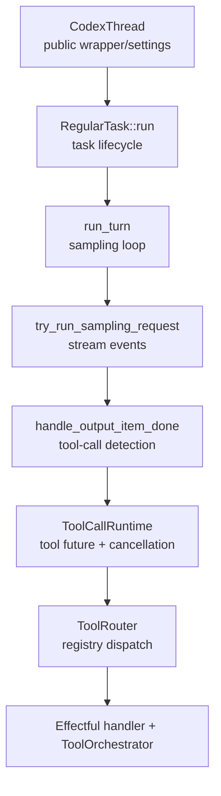

### Permission Model File Boundary

The source evidence appendix should not collapse all permission types into one file.

- `protocol/src/models.rs` defines `SandboxPermissions`, `AdditionalPermissionProfile`, `PermissionProfile`, and `ActivePermissionProfile`.
- `protocol/src/permissions.rs` defines filesystem and network sandbox policy types such as `FileSystemSandboxPolicy`, `FileSystemAccessMode`, `FileSystemPath`, `ReadDenyMatcher`, and `NetworkSandboxPolicy`.
- `core/src/config/resolved_permission_profile.rs` preserves the bridge between a resolved concrete permission profile and its optional active profile identity.

### Managed Network Is Separate From The Enum

`NetworkSandboxPolicy` is the simple policy enum: restricted or enabled. The managed network approval machinery is separate runtime state. `ToolOrchestrator` checks whether managed network is active from the turn context, begins a network approval call around the runtime attempt, and may return a deferred network approval with the tool output. Inline network approval also requires a managed permission profile and an approval policy that is not `Never`.

### Request Permissions Are Environment-Scoped And Intersected

`request_permissions` grants are stored by environment id. The response is normalized by intersecting granted permissions with the original request and cwd. That prevents a reviewer or client response from granting more than the model asked for.

Strict auto-review is turn-scoped only. If a response tries to combine `strict_auto_review` with a session-scoped grant, Codex normalizes it to an empty turn-scoped response.

### Deny Rules Fail Closed

Read-deny matching is not only a runtime sandbox detail. `ReadDenyMatcher` fails closed for malformed deny-read glob patterns during direct read checks, and host-side expansion paths can ask for explicit errors. That is stronger than "ignore invalid deny patterns."

### Workspace Metadata Gets Extra Protection

Workspace-write policy adds read-only protection for workspace metadata such as `.git`, `.agents`, and `.codex` unless an explicit write rule overrides the protected target. Freeflow should copy the idea, not necessarily the exact path list.

### Local Harness Contract Corrections

The second audit pass checked the local-harness recommendations against the Codex source and the draft `docs/local-delegation-harness-design.md`.

Corrections from that pass:

- Do not leave `run_command` as a vague v0 choice. Recommend read/search/diff/propose-only by default, with shell as an explicit allowlisted verifier capability.
- Do not imply local `apply_patch` is a near-term default. Recommend patch proposals only for v0; real worktree mutation stays with the frontier orchestrator.
- Do not copy Codex's session-scoped grants as a v0 default. Codex needs them for a long-running assistant session; local delegation can use short task runs and task-scoped grants.
- Do not use noisy broad denied-read globs as defaults. Use high-signal secret filenames first, and reserve `*token*` or `*secret*` style rules for stricter presets.
- Do not invent an interactive approval UI inside the local harness. Return `blocked_needs_approval` to the frontier orchestrator and rerun with an intersected task-scoped grant if approved.

## What Freeflow Should Borrow

### Borrow The Safety Shape, Not The Whole System

Codex's exact implementation is large because it supports:

- multiple platforms
- many sandbox backends
- managed network
- guardian review
- hooks
- MCP
- interactive unified exec
- app/server integration
- persistent config rules

Freeflow local harness v0 does not need all that.

It should borrow the smaller pattern:

```text
typed tool request
typed policy decision
typed permission profile
typed sandbox attempt
central orchestrator
structured trace
```

### Start Read-Only

A local model can produce useful work with:

- list files
- read files
- search text
- inspect diff
- summarize findings
- produce structured review

This is enough for many delegation tasks:

- second review
- code search
- docs summarization
- test failure triage
- duplication scan
- architecture map
- risk checklist

### Add Writes Through Patch Proposals

The first write-capable path should probably be:

```text
propose_patch
```

not:

```text
apply_patch
```

Reason:

```text
The local agent can draft.
The main orchestrator verifies and applies.
```

This protects output quality while still saving frontier-model tokens.

### Shell Should Be Narrow And Boring

If a v0 verifier task includes shell, it should be:

```text
disabled by default
allowlisted commands only
short timeout
captured output only
no interactive PTY
no network
no install commands
no destructive commands
```

Example first allowlist:

```text
rg
git diff -- <paths>
git status --short
python -m pytest <specific test path>
npm test -- --runInBand <specific test path>
```

But even this should be policy-controlled per task.

### Preserve Denied Paths

Freeflow should define default denied reads for local delegation:

```text
**/.env
**/.env.*
**/*.pem
**/*.key
**/id_rsa
**/id_ed25519
**/.npmrc
**/.pypirc
**/.netrc
**/.aws/**
**/.config/**
**/.codex/auth*
```

The exact list needs design review later. The default list should avoid broad substring patterns like `*token*`, `*secret*`, and `*credential*` unless a stricter preset opts into them.

The rule is clear:

```text
Denied reads are sticky and cannot be bypassed by local escalation.
```

### Use Task-Scoped Permission Grants

Default grant scope should be:

```text
task
```

not:

```text
session
```

The local model can be spawned often, so short-lived grants are easier to reason about.

### Make Approval A Return Value

In many cases, the local harness should not prompt the human directly.

Instead, it should return:

```json
{
  "status": "blocked_needs_approval",
  "request": {
    "tool": "run_command",
    "reason": "...",
    "permissions": { "...": "..." }
  }
}
```

Then the frontier orchestrator decides whether to approve, deny, or rerun with a narrower task.

This keeps the main model in control.

## Focused Audit Recommendation From Second Pass

This section answers the concrete v0 safety-contract questions as research recommendations. It is still not a final Freeflow product spec.

The Codex source points to one strong local-harness shape:

```text
read/search/diff/propose only by default
shell only as an explicit allowlisted verifier capability
real writes only by the frontier orchestrator
network disabled for the local loop
permission grants task-scoped only
approval returned as data, not handled inside the local model
```

### V0 Safety Contract In One Diagram

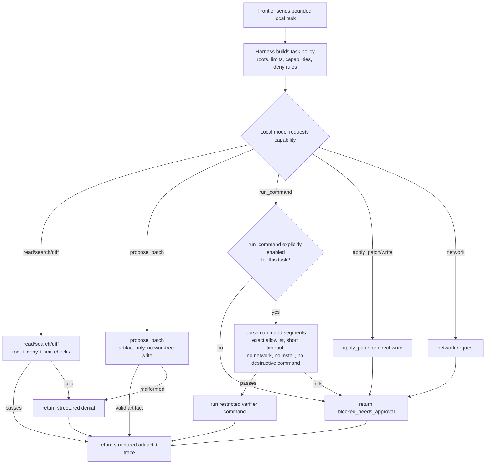

### Recommended V0 Answers

`run_command`
: Do not expose command execution to the autonomous local loop by default. If shell is needed, expose a separate opt-in capability such as `run_allowlisted_command` for verifier tasks. The frontier task packet must enable it explicitly.

`apply_patch`
: Do not let the local model apply patches to the real worktree in v0. Allow `propose_patch` as an artifact. The frontier orchestrator verifies and applies any patch.

`permission grants`
: Use task-scoped grants only in v0. Codex supports turn and session scopes, but the local harness can spawn cheap short-lived tasks, so session grants add risk before they add much value.

`network`
: Keep disabled in the local loop. If a task needs web evidence, the frontier orchestrator should fetch or cite it and pass bounded excerpts to the local task.

`OS sandbox`
: Read/search/diff/propose-only v0 can start with strict root checks, deny rules, and output limits. OS-level sandboxing should become mandatory before direct writes, broad shell, install commands, or any network-capable local execution.

`approval`
: The local harness should return a blocked result. It should not prompt the user, mutate global policy, or keep granting itself authority.

### Approval Return And Resume Model

Codex can suspend a request-permissions tool call and later notify the active turn with a response. A first Freeflow local harness can be simpler.

For v0, use a pause-return-rerun model:

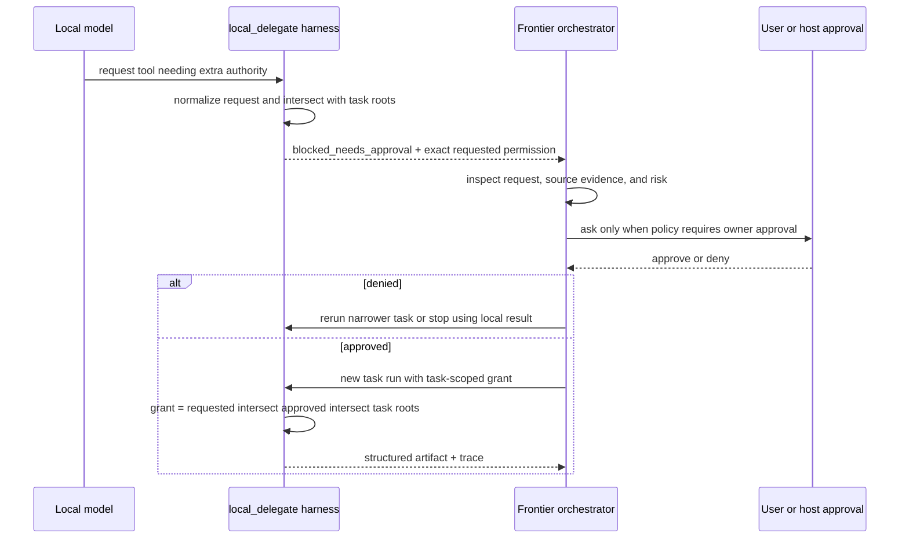

The important detail is the intersection step:

```text
effective_grant = requested_permissions
  intersect approved_permissions
  intersect task_roots_and_limits
```

This copies Codex's safety lesson without copying its whole active-turn machinery. A reviewer response can never broaden the local model beyond what it asked for or beyond the task packet.

The blocked output should be structured enough for the frontier orchestrator to resume intentionally:

```json
{
  "status": "blocked_needs_approval",
  "tool": "run_command",
  "reason": "pytest is not enabled for this local task",
  "requested_permissions": {
    "capabilities": ["run_allowlisted_command"],
    "command_prefixes": [["python", "-m", "pytest", "tests/foo_test.py"]]
  },
  "resume_strategy": "rerun_with_task_scoped_grant"
}
```

Avoid long-lived suspended local turns until the basic harness proves useful. Rerunning a small local task is cheaper and easier to audit.

### Path And Secret Boundary Rules

Codex does not rely on string-prefix checks alone. The source normalizes absolute paths, protects workspace metadata, and treats denied-read entries as a reason not to bypass the sandbox.

Freeflow's local harness should copy these rules:

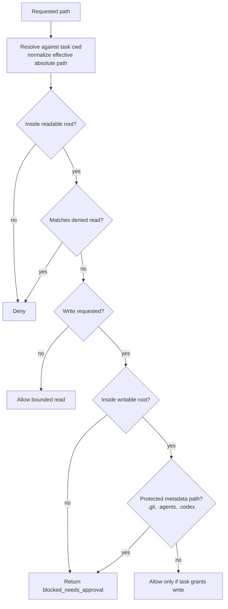

Starter denied reads should favor high-signal secret-bearing filenames and directories:

```text
**/.env
**/.env.*
**/*.pem
**/*.key
**/id_rsa
**/id_ed25519
**/.npmrc
**/.pypirc
**/.netrc
**/.aws/**
**/.config/**
```

Avoid broad substring globs such as `**/*token*` or `**/*secret*` as default rules. They sound safe, but they can block legitimate code-review targets such as token parsers, tokenizer modules, OAuth token tests, and secret-management documentation. Keep those broad rules for an optional stricter preset if needed.

If a denied-read glob fails to compile, fail closed and refuse the local task. A malformed safety rule should not silently become no safety rule.

## What Not To Copy Yet

Do not copy these in v0:

- full guardian automated reviewer
- managed network proxy
- zsh-fork runtime
- long-lived unified exec PTY sessions
- Windows sandbox internals
- Linux Landlock/seatbelt abstraction
- MCP elicitation approval flow
- persistent Starlark exec-policy rules
- multi-environment remote execution
- dynamic tool eventing
- session-wide network policy amendments

These are production layers. They are interesting, but they are not necessary to validate local delegation.

## Design Lessons For Small Local Models

### Small Models Need Less Authority And Better Structure

A small local model is not useless. It is just less reliable.

The harness should compensate with:

- smaller tasks
- narrower tools
- explicit schemas
- lower context pressure
- strict time/tool limits
- traceable evidence
- main-model verification

### Prefer Capabilities Over Profiles

This connects to the earlier Freeflow discussion about profiles.

Instead of many duplicated fixed profiles, define capability tags:

```text
read_files
search_text
inspect_diff
run_allowlisted_command
propose_patch
request_permission
network_allowlisted
```

Then each task gets a policy:

```text
task_kind: review
capabilities: [read_files, search_text, inspect_diff]
limits:
  max_tool_calls: 12
  max_files_read: 20
  max_output_chars: 12000
```

This is more generalizable than hardcoded profiles like:

```text
reviewer
researcher
coder
```

Profiles can still exist as presets, but the real mechanism should be capabilities and policy gates.

### Treat Local Output As Evidence, Not Authority

The local agent should return:

```text
findings
evidence
confidence
files_examined
commands_run
risks
open_questions
```

The main orchestrator decides:

```text
trust
verify
ignore
rerun
ask a different agent
```

This preserves quality while reducing token usage.

### Safety And Speed Can Coexist

The user wants the local harness to preserve local-model speed.

The safety system should therefore be:

- mostly in-process checks
- simple path matching
- simple command allowlists
- short JSON schemas
- no heavy framework on hot path
- no network unless explicitly needed
- minimal prompt overhead

Do not build a slow enterprise policy engine before validating local delegation.

## Suggested First Local Safety Contract

This is not the final spec. It is the research-derived candidate shape after the second focused audit.

```text
LocalAgentPolicy:
  readable_roots:
    - repo root
  writable_roots:
    - none by default
  protected_metadata:
    - ".git"
    - ".agents"
    - ".codex"
  denied_reads:
    - "**/.env"
    - "**/.env.*"
    - "**/*.pem"
    - "**/*.key"
    - "**/id_rsa"
    - "**/id_ed25519"
    - "**/.npmrc"
    - "**/.pypirc"
    - "**/.netrc"
    - "**/.aws/**"
    - "**/.config/**"
  network:
    mode: disabled
    allowed_hosts: []
  shell:
    mode: disabled
    optional_capability: run_allowlisted_command
    allowed_prefixes: []
  limits:
    max_tool_calls: 12
    max_files_read: 25
    max_command_seconds: 20
    max_output_chars_per_tool: 12000
    max_total_output_chars: 50000
```

```text
ToolPolicyDecision:
  Allow:
    sandbox_mode
  NeedsApproval:
    reason
    requested_permissions
  Deny:
    reason
```

```text
PermissionGrant:
  scope: task
  permissions
  strict_review: boolean
```

Session-scoped grants are a future option, not a v0 default.

```text
LocalAgentTrace:
  task_id
  model
  policy
  tool_calls
  approvals_requested
  denials
  files_read
  files_written
  commands_run
  final_result
```

```text
BlockedApprovalResult:
  status: blocked_needs_approval
  tool
  reason
  requested_permissions
  resume_strategy: rerun_with_task_scoped_grant
```

## Suggested First Tool Safety Modes

### Read File

Default:

```text
allowed if path is under readable roots and not denied
```

Denied if:

```text
path matches denied read
path outside readable roots
path too large
binary file unless explicitly allowed
```

### Search Text

Default:

```text
allowed under readable roots
respects denied reads
bounded output
```

Implementation hint:

```text
Use rg when available.
Post-filter denied paths defensively.
```

### Inspect Diff

Default:

```text
allowed
read-only
bounded output
```

Useful for local review tasks.

### Run Command

Default:

```text
disabled
```

If enabled:

```text
frontier task packet must opt in
allowlisted prefixes only
short timeout
no network
no shell wrappers by default
no writes unless writable roots exist
no install commands
no destructive commands
each shell segment must pass independently
```

Treat this as a verifier capability, not as a general local-agent tool.

### Propose Patch

Default:

```text
allowed for patch proposal output
does not write files
```

The local agent can produce a patch proposal, but applying it is a separate authority.

### Apply Patch

Default:

```text
orchestrator-only
```

For v0, applying to the real worktree should remain outside the local loop. It could be enabled later only if the harness has:

- patch parser
- affected path derivation
- write permission check
- denied-read preservation
- trace recording
- rollback or diff verification

### Request Permission

Default:

```text
allowed
```

But it should not directly grant anything. It returns a structured request to the main orchestrator. Any approval must be intersected with the original request and the task roots before a new local run starts.

## Beginner-Friendly Pseudocode

### Tool Run Flow

```python
def run_tool(agent, tool_call):
    request = parse_tool_call(tool_call)

    decision = policy.check(request, agent.context)

    if decision.kind == "deny":
        trace.record_denial(request, decision.reason)
        return ToolResult.blocked(decision.reason)

    if decision.kind == "needs_approval":
        trace.record_approval_request(request, decision)
        return ToolResult.needs_approval(decision)

    attempt = sandbox.build_attempt(
        request=request,
        policy=agent.policy,
        decision=decision,
    )

    output = runtime.execute(request, attempt)

    trace.record_tool_result(request, attempt, output)

    return output
```

### Shell Policy Flow

```python
def check_command(command, requested_permissions, policy):
    segments = parse_command_segments(command)

    if requested_permissions == "require_escalated":
        if policy.has_denied_reads:
            return Deny("cannot bypass sandbox while denied reads are active")
        return NeedsApproval("command requests escalated permissions")

    if any(is_destructive(segment) for segment in segments):
        return Deny("destructive command blocked")

    if not all(matches_allowlist(segment, policy.shell.allowed_prefixes) for segment in segments):
        return NeedsApproval("command is not allowlisted")

    return Allow(sandbox_mode="default")
```

### Permission Request Flow

```python
def request_permission(request, active_policy):
    normalized = normalize(request.permissions)

    if normalized.is_empty():
        return PermissionResponse.empty()

    if not active_policy.allow_permission_requests:
        return PermissionResponse.empty()

    return NeedsApproval(
        reason=request.reason,
        requested_permissions=normalized,
    )
```

### Applying A Grant

```python
def apply_grant(agent, grant):
    if grant.scope != "task":
        return Deny("local harness v0 only accepts task-scoped grants")

    grant = intersect(
        grant,
        agent.pending_permission_request,
        agent.task_roots,
        agent.task_limits,
    )

    agent.task_grants.merge(grant.permissions)

    if grant.strict_review:
        agent.strict_review = True
```

### Denied Reads Rule

```python
def can_bypass_sandbox(policy):
    if policy.denied_reads:
        return False
    return True
```

This tiny function encodes one of the most important lessons from Codex.

## Open Questions

These should be answered or confirmed in the eventual Freeflow local harness spec, not hidden inside this research artifact.

Second-pass audit recommendations to confirm:

1. Default v0 should be read/search/diff/propose-only. `run_command` should be disabled unless a task explicitly enables `run_allowlisted_command`.
2. Patching should start as `propose_patch` only. Applying a patch to the real worktree remains orchestrator-owned.
3. Permission grants should be task-scoped only in v0.
4. Policy checks and workspace-root enforcement are enough only while v0 is read/search/diff/propose-only. OS sandboxing becomes required before broad shell or real writes.
5. Denied-read defaults should prefer high-signal secret filenames and avoid broad default substring globs such as `*token*`.
6. Permission requests should return `blocked_needs_approval`; the frontier orchestrator approves, denies, or reruns with a narrower task-scoped grant.
7. Network should stay disabled for local tasks; frontier should fetch bounded external evidence when needed.

Still open for the local harness spec:

1. Where should local traces live: `.freeflow/`, a companion CLI state directory, or temp files returned to the orchestrator?
2. What exact task-packet schema should represent capabilities, path roots, command prefixes, denied reads, and output budgets?
3. What benchmark proves this safety layer still preserves enough local-model speed?
4. How much of this belongs in the optional companion harness versus Freeflow skills/policy docs?
5. Should an approved local task be rerun from scratch every time, or should a later version support a resumable local turn state?
6. Which stricter preset, if any, should include broad denied-read globs like `*token*` and `*secret*`?

## Next Research Passes

The canonical pass index and roadmap now live in:

```text
docs/research/codex-cli-agent-harness/README.md
```

Completed after the original Pass 3 artifact:

- Pass 4: subagents and delegation.
- Pass 5: model providers and runtime adapters.
- Pass 6: memory and context.
- Pass 7: config and extensibility.
- Pass 8: agent harness comparisons.

The second focused audit has now added concrete local safety-contract recommendations for shell, patching, denied reads, network, task-scoped grants, and approval resume behavior.

The next best continuation from this Pass 3 audit is to promote the confirmed recommendations into the Freeflow local harness design spec, or create a dedicated local harness safety contract if the spec needs a sharper implementation boundary.

## Source Evidence Appendix

### Source Snapshot

```text
repo: openai/codex
commit: b65fe3d8976d6fcc44ee6c6cf988654af5fc4d2d
short: b65fe3d
commit date: 2026-06-12
commit title: fix: serialize auth environment tests (#27879)
local path: /private/tmp/openai-codex-study-pass0
```

### Turn Loop And Tool Dispatch

- `/private/tmp/openai-codex-study-pass0/codex-rs/core/src/tasks/regular.rs`
  - Regular task lifecycle, `TurnStarted` emission, startup prewarm handling, repeated `run_turn` calls when pending input remains.

- `/private/tmp/openai-codex-study-pass0/codex-rs/core/src/session/turn.rs`
  - Main turn loop, prompt construction, sampling request loop, stream retry, pending input handling, compaction checks, stop hooks, and follow-up decision.

- `/private/tmp/openai-codex-study-pass0/codex-rs/core/src/stream_events_utils.rs`
  - Converts completed model response items into internal tool calls, records model items, queues tool futures, and converts tool outputs back into response items.

- `/private/tmp/openai-codex-study-pass0/codex-rs/core/src/tools/parallel.rs`
  - `ToolCallRuntime`, parallelism lock, cancellation behavior, aborted tool outputs, and terminal-outcome coordination.

- `/private/tmp/openai-codex-study-pass0/codex-rs/core/src/tools/router.rs`
  - `ToolRouter`, model-visible tool specs, response-item to `ToolCall` conversion, and registry dispatch.

### Core Safety Interfaces

- `/private/tmp/openai-codex-study-pass0/codex-rs/core/src/tools/sandboxing.rs`
  - Shared approval and sandbox traits.
  - Defines `ApprovalStore`, `ApprovalCtx`, `ExecApprovalRequirement`, `Approvable`, `Sandboxable`, `ToolRuntime`, `SandboxAttempt`.

- `/private/tmp/openai-codex-study-pass0/codex-rs/core/src/tools/orchestrator.rs`
  - Central approval, sandbox selection, first attempt, retry, and result flow.

- `/private/tmp/openai-codex-study-pass0/codex-rs/core/src/sandboxing/mod.rs`
  - Core exec request adapter and transformed sandbox execution request shape.

### Permission Models

- `/private/tmp/openai-codex-study-pass0/codex-rs/protocol/src/models.rs`
  - Defines `SandboxPermissions`, `PermissionProfile`, `ManagedFileSystemPermissions`, `ActivePermissionProfile`.

- `/private/tmp/openai-codex-study-pass0/codex-rs/protocol/src/permissions.rs`
  - Defines filesystem access modes, special paths, sandbox policies, denied read checks, workspace-write defaults, and path read/write checks.

- `/private/tmp/openai-codex-study-pass0/codex-rs/protocol/src/protocol.rs`
  - Defines `AskForApproval`, `GranularApprovalConfig`, and legacy `SandboxPolicy`.

- `/private/tmp/openai-codex-study-pass0/codex-rs/core/src/config/resolved_permission_profile.rs`
  - Resolves legacy, built-in, and named permission profiles while preserving active profile identity.

### Exec Policy

- `/private/tmp/openai-codex-study-pass0/codex-rs/core/src/exec_policy.rs`
  - Loads policy rules, classifies commands, handles prefix-rule amendments, suppresses broad dangerous prefix suggestions, and renders allow/prompt/forbid decisions.

- `/private/tmp/openai-codex-study-pass0/codex-rs/core/src/exec_policy_tests.rs`
  - Tests dangerous command handling, sandbox override behavior, multi-segment command policy, and prefix amendment safety.

### Shell And Unified Exec

- `/private/tmp/openai-codex-study-pass0/codex-rs/core/src/tools/handlers/shell.rs`
  - Shell handler: environment resolution, permission normalization, escalation guard, apply_patch interception, exec-policy evaluation, orchestrator handoff.

- `/private/tmp/openai-codex-study-pass0/codex-rs/core/src/tools/runtimes/shell.rs`
  - Shell runtime: approval keys, permission-request payload, network approval spec, sandboxed execution.

- `/private/tmp/openai-codex-study-pass0/codex-rs/core/src/tools/handlers/unified_exec/exec_command.rs`
  - Unified exec command handler: process id allocation, args parsing, permission handling, apply_patch interception, process manager call.

- `/private/tmp/openai-codex-study-pass0/codex-rs/core/src/tools/runtimes/unified_exec.rs`
  - Unified exec runtime: approval keys, network approval, sandbox cwd, execution through process manager.

- `/private/tmp/openai-codex-study-pass0/codex-rs/core/src/tools/runtimes/mod.rs`
  - Shared runtime helpers for sandbox command construction, env stripping for escalated execution, PATH prepends, and shell snapshot wrapping.

### Apply Patch

- `/private/tmp/openai-codex-study-pass0/codex-rs/core/src/tools/handlers/apply_patch.rs`
  - Patch parsing, verification, affected path derivation, extra permission calculation, shell interception, orchestrator handoff.

- `/private/tmp/openai-codex-study-pass0/codex-rs/core/src/tools/runtimes/apply_patch.rs`
  - Apply patch runtime: per-path approval keys, guardian/user approval flow, sandboxed patch application, sandbox-denial detection.

- `/private/tmp/openai-codex-study-pass0/codex-rs/core/src/tools/handlers/apply_patch.lark`
  - Patch grammar.

- `/private/tmp/openai-codex-study-pass0/codex-rs/core/src/tools/handlers/apply_patch_spec.rs`
  - Model-visible apply_patch tool spec.

### Request Permissions

- `/private/tmp/openai-codex-study-pass0/codex-rs/core/src/tools/handlers/request_permissions.rs`
  - Tool handler for structured permission requests.

- `/private/tmp/openai-codex-study-pass0/codex-rs/protocol/src/request_permissions.rs`
  - Defines request/response/event models, grant scope, and strict-auto-review flag.

- `/private/tmp/openai-codex-study-pass0/codex-rs/core/src/session/mod.rs`
  - Request-permission approval flow, response normalization, grant recording, turn/session grant accessors.

- `/private/tmp/openai-codex-study-pass0/codex-rs/core/src/state/turn.rs`
  - Turn-scoped grants and strict-auto-review state.

- `/private/tmp/openai-codex-study-pass0/codex-rs/core/src/state/session.rs`
  - Session-scoped grants.

### Network Approval

- `/private/tmp/openai-codex-study-pass0/codex-rs/core/src/tools/network_approval.rs`
  - Active/deferred network approvals, host/protocol/port keys, pending approvals, session-approved and session-denied host caches, blocked request handling.

- `/private/tmp/openai-codex-study-pass0/codex-rs/core/src/tools/network_approval_tests.rs`
  - Tests dedupe behavior, host/protocol/port scoping, cancellation on denial, deferred denial reuse, and ambiguous blocked-request behavior.

### Tests And Behavior Evidence

- `/private/tmp/openai-codex-study-pass0/codex-rs/core/src/tools/sandboxing_tests.rs`
  - Approval defaults, granular rejection, sandbox override, denied-read preservation.

- `/private/tmp/openai-codex-study-pass0/codex-rs/core/tests/suite/approvals.rs`
  - End-to-end approval matrix, prefix-rule behavior, dangerous command behavior, network retry with denied-read sandbox preservation.

- `/private/tmp/openai-codex-study-pass0/codex-rs/core/tests/suite/request_permissions.rs`
  - Additional permission requests, denied approvals, sticky grants, partial grants, turn/session scope.

- `/private/tmp/openai-codex-study-pass0/codex-rs/core/tests/suite/request_permissions_tool.rs`
  - Standalone request-permissions tool granting later exec/apply_patch operations.

- `/private/tmp/openai-codex-study-pass0/codex-rs/core/src/tools/runtimes/mod_tests.rs`
  - Runtime env behavior, especially managed proxy stripping on escalated execution.

- `/private/tmp/openai-codex-study-pass0/codex-rs/core/src/tools/runtimes/unified_exec.rs`
  - Includes tests for network denial cancellation and sandbox cwd use.

## Working Interpretation

Codex's safety layer answers this question:

```text
How can a model safely affect a real machine?
```

The answer is not:

```text
Tell the model to be careful.
```

The answer is:

```text
Represent authority as data.
Route every risky tool through one orchestrator.
Keep filesystem, network, and shell permissions separate.
Make escalation explicit.
Preserve denied reads.
Scope grants.
Test the weird edge cases.
Return structured traces.
```

For Freeflow's local-agent harness, this pass strongly supports a conservative first design:

```text
read/search/diff first
patch proposals before writes
shell disabled or allowlisted
network disabled
task-scoped grants
strict denied-read defaults
frontier orchestrator verification
```

That is how we can use local models generously without pretending they are as trustworthy as the main frontier model.
