# Codex CLI Agent Harness Study - Pass 4 Subagents And Delegation

> **Doc ID:** RESEARCH-2026-06-12-codex-cli-agent-harness-pass-4
> **Date:** 2026-06-12
> **Audit update:** 2026-06-13 current-source check
> **Owner:** Hassan Mohiddin
> **Type:** Research
> **Status:** Audited draft
> **Primary source:** `openai/codex` source snapshot `b65fe3d8976d6fcc44ee6c6cf988654af5fc4d2d`
> **Current upstream check:** `origin/main` at `0fed4497f50ad5f0b2f7972a1bfd14c5a09a85c5`
> **Related passes:** Pass 0 repo map; Pass 1 turn loop; Pass 2 tool system; Pass 3 sandboxing and permissions; Pass 6 memory and context.

## Purpose

This pass explains how Codex delegates work to subagents.

The important point is simple but easy to miss:

```text
Codex subagents are not just second prompts.
They are child agent threads with identity, status, tool access, context, mailbox delivery, and lifecycle control.
```

This document is beginner-friendly, but it does not flatten the mechanism. The early sections explain the mental model. The later sections preserve source-level behavior, current-source drift, test evidence, and implications for a future Freeflow local-agent harness.

This is research memory, not shipped Freeflow behavior. Runtime truth for Freeflow still lives under `plugins/freeflow/`.

## Audit Summary

This audit changed the document in five ways:

- Replaced ASCII flow diagrams with Mermaid diagrams.
- Reorganized the document around the actual delegation stack: model-visible tools, protocol items, control plane, turn loop, mailbox, status, and persistence.
- Added current-source drift against `origin/main` at `0fed4497f50ad5f0b2f7972a1bfd14c5a09a85c5`.
- Corrected under-explained turn-loop details: typed `TurnInput::InterAgentCommunication`, typed rollout persistence, `AgentMessage` history, mailbox preemption, and completion notification.
- Tightened Freeflow recommendations so local models are framed as bounded evidence workers, not equally capable Codex subagents.

## How To Read This

If this is your first pass, read:

- `Core Idea`
- `Tiny System Diagram`
- `Subagents In Plain English`
- `What Freeflow Should Borrow`
- `What Freeflow Should Not Copy Yet`

If you are designing the local harness, also read:

- `Delegation Surfaces`
- `MultiAgentV2 Tool Surface`
- `Spawn Flow`
- `Mailbox And Turn Boundaries`
- `Concurrency, Depth, And Residency`
- `Suggested First Local Delegation Contract`

If you are checking source truth, use:

- `Current-Source Delta`
- `Audit Findings`
- `Behavioral Evidence From Tests`
- `Source Evidence Appendix`

## Diagram Map

Use these diagrams as checkpoints. They are not a replacement for the source notes.

| Concept | Diagram |
| --- | --- |
| Overall subagent shape | `Tiny System Diagram` |
| Delegation surfaces | `Delegation Surfaces` |
| MultiAgentV2 tools | `MultiAgentV2 Tool Surface` |
| Spawn path | `Spawn Flow` |
| Agent path identity | `AgentPath Identity` |
| Typed agent message envelope | `InterAgentCommunication` |
| Forked context filtering | `Forked Context` |
| Control plane ownership | `AgentControl` |
| Mailbox and turn boundaries | `Mailbox And Turn Boundaries` |
| Completion notification | `Status And Completion` |
| Concurrency and residency | `Concurrency, Depth, And Residency` |
| Roles and usage hints | `Roles And Usage Hints` |
| Agent jobs | `Agent Jobs` |
| Older delegate path | `Older Delegate Path` |
| Freeflow translation | `Freeflow Local Harness Translation` |

## Core Idea

Codex subagents are real child agent threads.

They have:

- a `ThreadId`;
- a `SessionSource::SubAgent`;
- an optional `AgentPath`;
- a model turn loop;
- a tool plan;
- inherited runtime policy;
- status derived from events;
- mailbox communication;
- optional forked parent history;
- registry metadata;
- residency and concurrency limits;
- completion notification back to the direct parent.

That means this design is closer to a process supervisor than a prompt helper.

For Freeflow, the big lesson is:

Do not build "prompt local model to produce a text response" and call it a subagent. Build "spawn bounded worker, trace work, return structured evidence, and have the orchestrator verify it."

## Tiny System Diagram

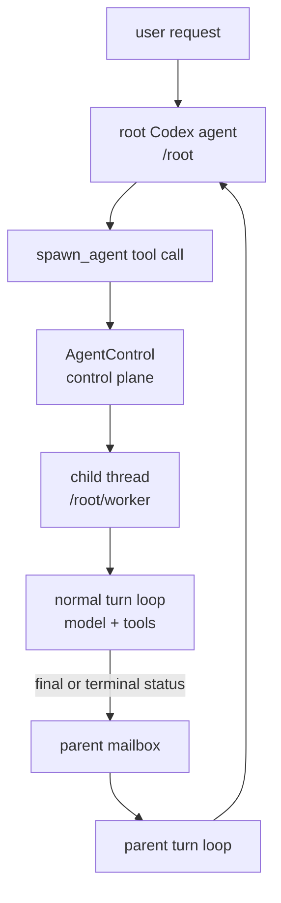

The model sees tool calls. The runtime owns the child thread.

## Subagents In Plain English

A weak delegation design is:

```text
"Smaller model, summarize this file."
```

That gives you a text completion. It does not give you a real worker. There is no state, no tool loop, no status, no lifecycle, no trace, and no clean way to continue or interrupt the work.

Codex's design is closer to:

```text
"Create a new named worker.
Give it this task.
Let it run the same agent loop.
Track whether it is running or done.
Let it message me.
Let me wait for mailbox activity.
Let me interrupt it.
When it reaches a terminal status, deliver a structured notification."
```

The useful mental model:

```text
LLM = reasoning engine
agent harness = operating environment
subagent = another harness instance with controlled identity, context, tools, and lifecycle
```

For Freeflow, a local model only becomes useful as a delegated worker if it receives:

- a bounded task;
- selected context;
- a strict tool policy;
- an output schema;
- an uncertainty requirement;
- a trace;
- a parent orchestrator that verifies the output.

## Current-Source Delta

The original pass used source snapshot `b65fe3d8976d6fcc44ee6c6cf988654af5fc4d2d`. This audit also checked `origin/main` at `0fed4497f50ad5f0b2f7972a1bfd14c5a09a85c5`.

The broad architecture still matches:

- MultiAgentV2 exposes `spawn_agent`, `send_message`, `followup_task`, `wait_agent`, `interrupt_agent`, and `list_agents`.
- `AgentControl` owns spawn, messaging, interrupt, list, status lookup, registry, residency, and execution capacity.
- Child agents are real threads with `SessionSource::SubAgent(SubAgentSource::ThreadSpawn { ... })`.
- Mailbox messages enter the turn loop through the session input queue.
- Child completion is delivered to the direct parent through inter-agent communication.

Important source drift and corrections:

- Inter-agent mail is now explicitly represented as `TurnInput::InterAgentCommunication`.
- When recorded, inter-agent communication is converted to model-visible `ResponseItem::AgentMessage`.
- Rollouts now have a typed `RolloutItem::InterAgentCommunication`, so replay can reconstruct agent messages without relying only on assistant-message JSON.
- Forked history now explicitly drops `RolloutItem::InterAgentCommunication`.
- `AgentMessageInputContent` now has an `InputText` variant, so plain agent mail no longer has to become an assistant JSON message for model input.
- The default MultiAgentV2 guidance says not to spawn subagents unless the user explicitly asks for subagents, delegation, or parallel agent work.
- MultiAgentV2 ignores the legacy configured `agents.max_depth`; v2 still records depth, but active execution capacity and residency are the meaningful runtime limits.
- `AgentStatus::Interrupted` is not final for completion notification, but an interrupted idle v2 resident can be unloaded from memory.
- The `awaiter.toml` built-in file exists, but the role is commented out in `role.rs`; active built-ins are `default`, `explorer`, and `worker`.
- `wait_agent` v2 has timeout-only arguments and waits on the current session mailbox. It does not target specific agents and does not return child content.

## Delegation Surfaces

Codex has several delegation-related mechanisms.

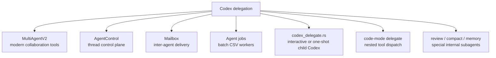

The cleanest reference for Freeflow local delegation is:

```text
MultiAgentV2 + AgentControl + mailbox/status/event trace
```

Agent jobs and `codex_delegate.rs` are useful secondary references, but they are heavier than a first local harness needs.

## Glossary

`Subagent`
: A child agent created by a parent agent for a bounded task.

`Thread`
: Codex's durable unit of conversation/session execution. A spawned subagent is another thread, not merely a function call.

`AgentControl`
: The control plane for spawning agents, messaging agents, resolving references, listing agents, interrupting agents, tracking metadata, enforcing limits, and managing residency.

`AgentPath`
: A stable path identity such as `/root/worker` or `/root/research/api_reader`.

`ThreadId`
: The unique id for the underlying thread. Codex can target agents by thread id or path depending on the tool.

`SessionSource`
: Metadata describing where a session came from: CLI, VSCode, exec, MCP, custom, internal, subagent, or unknown.

`SubAgentSource`
: More precise subagent metadata. For spawned agents, `ThreadSpawn` stores parent thread id, depth, path, nickname, and role.

`InterAgentCommunication`
: A structured message envelope from one `AgentPath` to another. It has author, recipient, optional other recipients, content or encrypted content, and `trigger_turn`.

`Mailbox`
: A session-scoped queue for inter-agent messages. It lets one agent send mail to another without directly mutating an in-flight model stream.

`Trigger-turn mail`
: Mail with `trigger_turn = true`. It can wake an idle session and start a new turn.

`Queue-only mail`
: Mail with `trigger_turn = false`. It is stored and delivered at a safe boundary.

`AgentStatus`
: Lifecycle state derived from events: pending init, running, interrupted, completed, errored, shutdown, or not found.

`Forked context`
: A filtered slice of parent history copied into the child session.

`Role`
: A spawn-time config/instruction layer such as `default`, `explorer`, or `worker`. A role is not a separate runtime.

`Residency`
: The mechanism for keeping a bounded number of v2 subagent threads loaded and unloading idle residents when capacity is needed.

`Agent job`
: A batch delegation system where many workers process items and must report structured results.

## MultiAgentV2 Tool Surface

MultiAgentV2 exposes six primary model-visible tools.

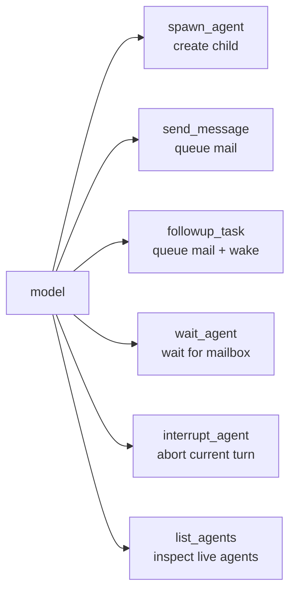

| Tool | Purpose | Important nuance |
| --- | --- | --- |
| `spawn_agent` | Create a named child task. | `task_name` is required in v2. Plain text initial input becomes `InterAgentCommunication`. |
| `send_message` | Send mail without waking an idle agent. | Uses `trigger_turn = false`. |
| `followup_task` | Send work and wake the child if idle. | Uses `trigger_turn = true`; rejects targeting root. |
| `wait_agent` | Wait for mailbox activity. | V2 does not return child content and has no target argument. |
| `list_agents` | List live agents and last task messages. | It lists live loaded agents, not every unloaded persisted thread. |
| `interrupt_agent` | Interrupt the target's current turn. | Rejects root and self; returns previous status. |

Tool registration is centralized in `spec_plan.rs`. When v2 is enabled, the tools can be direct, model-only direct, or namespaced depending on config and environment.

Default v2 config values include:

```text
max_concurrent_threads_per_session = 4
min_wait_timeout_ms = 10000
max_wait_timeout_ms = 3600000
default_wait_timeout_ms = 30000
usage_hint_enabled = true
hide_spawn_agent_metadata = true
non_code_mode_only = true
```

`non_code_mode_only = true` means the tools are exposed as `DirectModelOnly` instead of normal direct tools in the default plan path.

## AgentPath Identity

`AgentPath` turns informal helper names into targetable addresses.

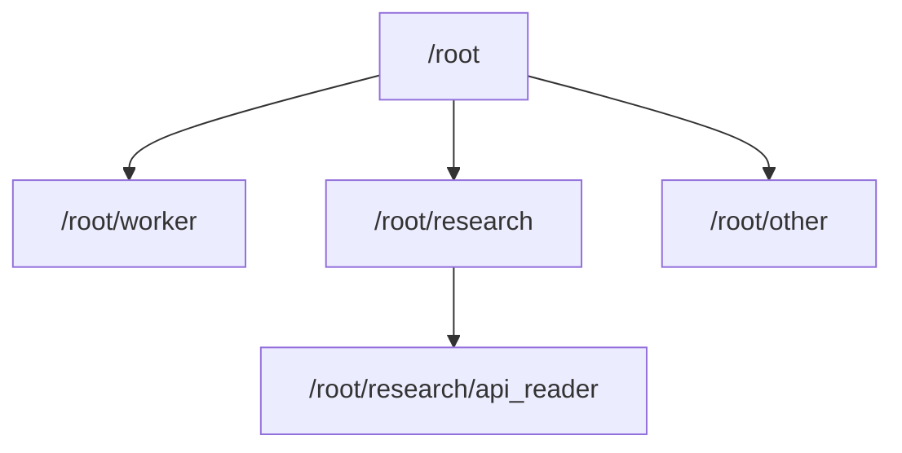

Rules from `codex-rs/protocol/src/agent_path.rs`:

- absolute paths start with `/root`, except special `/morpheus`;
- names use lowercase ASCII letters, digits, and underscores;
- `root`, `.`, and `..` are reserved names;
- a name cannot contain `/`;
- `join` creates child paths;
- `resolve` supports relative references from the current path.

Example:

```text
current: /root/research
spawn task_name: api_reader
child: /root/research/api_reader
```

Why it matters:

```text
Names become addresses.
Messages can target addresses.
Status and listing can use addresses.
Nested agents can resolve relative names safely.
```

For Freeflow, a simpler first version can use:

```text
run_id: local-20260613-...
task_name: search_auth_tests
parent_run_id: frontier-turn-...
```

But the result should not be anonymous text.

## Protocol Primitives

### `SessionSource` And `SubAgentSource`

Spawned subagents use:

```text
SessionSource::SubAgent(SubAgentSource::ThreadSpawn {
  parent_thread_id,
  depth,
  agent_path,
  agent_nickname,
  agent_role,
})
```

That tells the child:

- who its parent thread is;
- how deep it is in the spawned-agent tree;
- what path identity it has;
- what nickname it may display;
- what role it is using.

Current source also has other subagent sources:

- `Review`
- `Compact`
- `MemoryConsolidation`
- `Other(String)`

These are not the same thing as normal MultiAgentV2 spawned workers, but they show Codex uses the same subagent concept for multiple internal child-thread jobs.

### `InterAgentCommunication`

`InterAgentCommunication` is the message envelope.

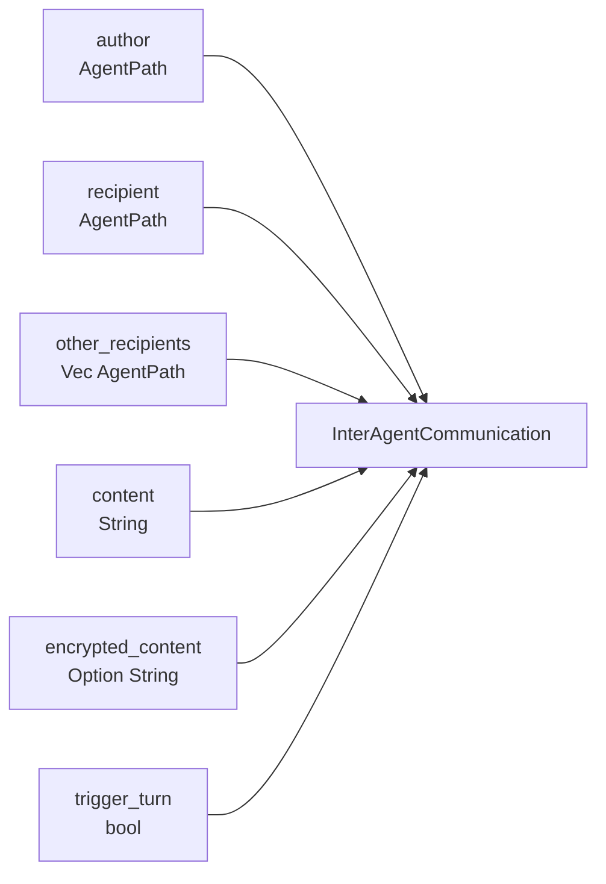

The critical bit is `trigger_turn`.

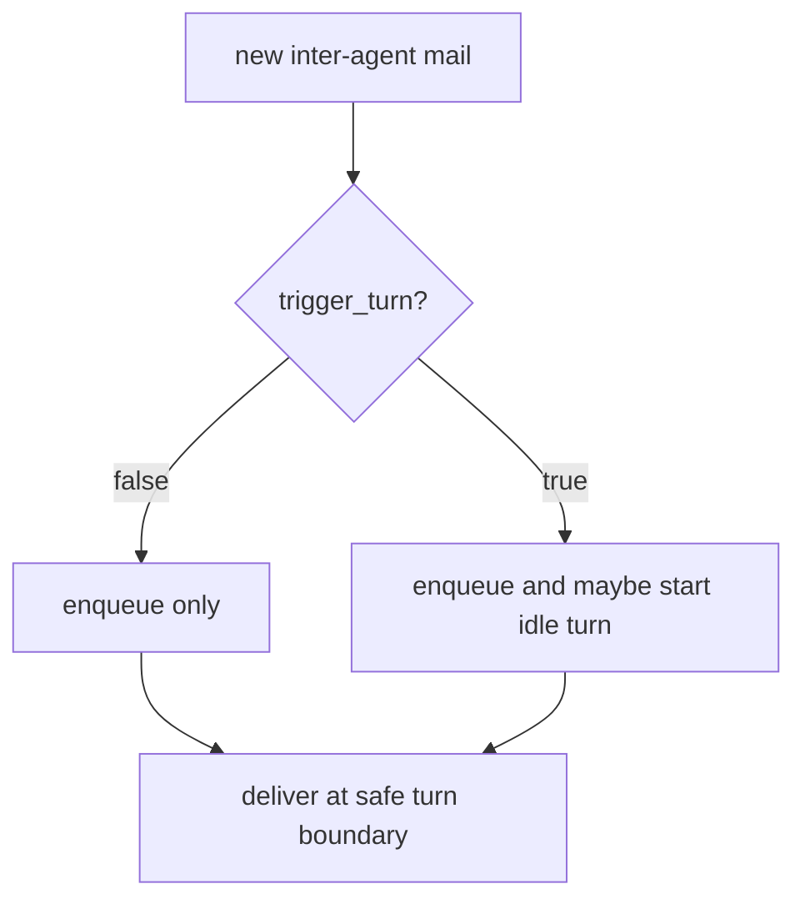

Current source nuance:

- `to_model_input_item` converts mail to `ResponseItem::AgentMessage`.
- Plain content becomes `AgentMessageInputContent::InputText`.
- Encrypted content becomes `AgentMessageInputContent::EncryptedContent`.
- `record_inter_agent_communication` persists a typed `RolloutItem::InterAgentCommunication`.
- Rollout reconstruction converts typed inter-agent communication back to `AgentMessage`.

That means current source treats inter-agent messages as first-class agent messages, not merely assistant text containing serialized JSON.

For Freeflow, preserve the structure even if v0 is one-shot:

```json
{
  "author": "/root",
  "recipient": "/root/search_tests",
  "content": "Find auth refresh tests.",
  "trigger_turn": true
}
```

### `AgentStatus`

Codex derives status from events.

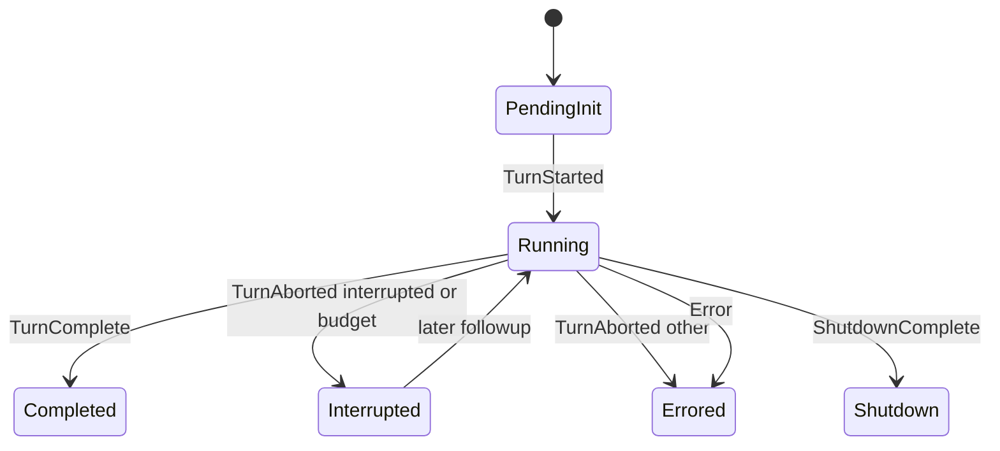

Important nuance:

- `Completed`, `Errored`, and `Shutdown` are final for completion notification.
- `Interrupted` is not final in `agent::status::is_final`.
- Residency may still unload an interrupted agent if it is idle and has no pending mailbox items.

For Freeflow, status should also be event-derived:

```text
LocalAgentEvent -> reduce -> LocalAgentStatus
```

Do not infer status only from whether a process is alive.

## Spawn Flow

The v2 spawn flow is the heart of this pass.

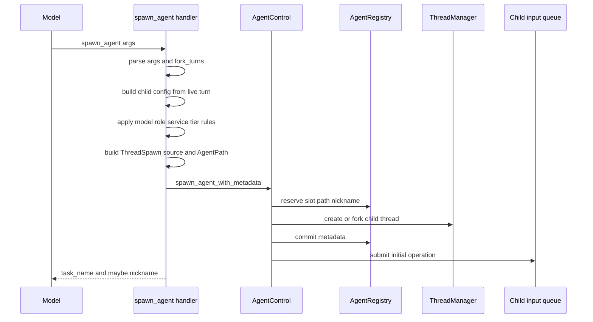

### Step 1: Parse Arguments

The v2 handler parses:

```text
message
task_name
agent_type
model
reasoning_effort
service_tier
fork_turns
fork_context
```

`task_name` is required by the Rust argument struct and v2 schema.

`fork_context` is explicitly rejected:

```text
fork_context is not supported in MultiAgentV2; use fork_turns instead
```

This is a good migration pattern. Old fields fail loudly instead of being silently ignored.

### Step 2: Resolve Fork Mode

`fork_turns` accepts:

```text
none
all
positive integer string, such as "3"
```

Default is `all`.

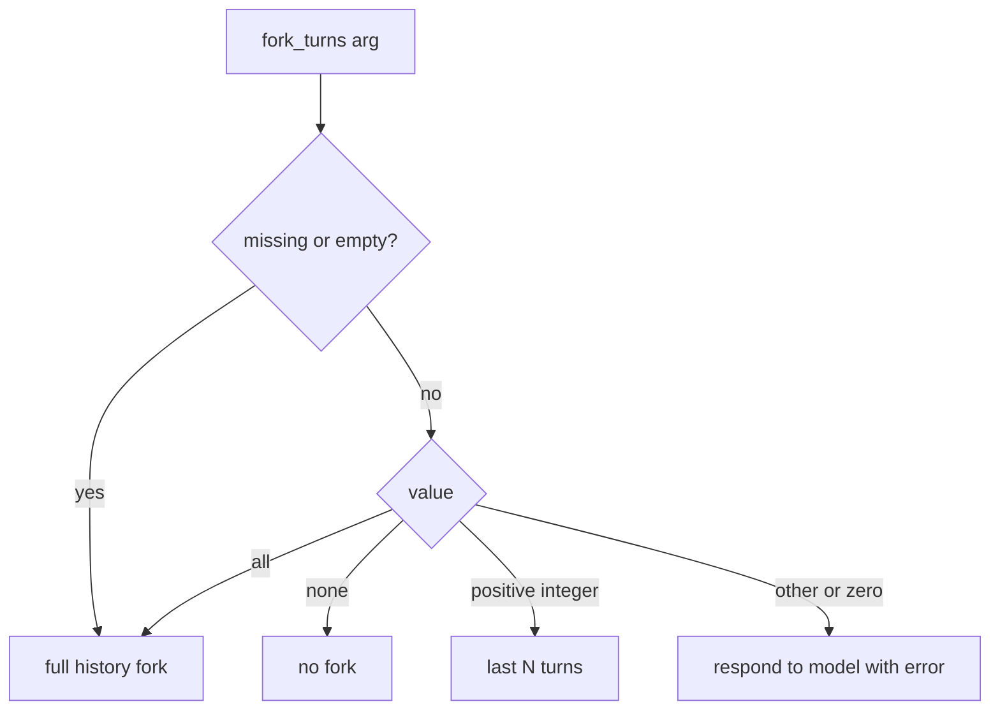

For Freeflow local models, defaulting to full context is usually the wrong default. A local harness should default to selected context or no context, then require explicit evidence packets.

### Step 3: Build Child Config From Live Turn

The child starts from the parent turn's effective config, not stale persisted config.

Codex refreshes:

- model and provider;
- reasoning effort and reasoning summary;
- developer instructions;
- compact prompt;
- approval policy;
- approvals reviewer;
- shell environment policy;
- sandbox executable path;
- cwd;
- permission profile.

Why this matters:

```text
The child should inherit the live authority and environment of the parent turn.
```

For Freeflow, local delegation cannot be only:

```text
call local model
```

It needs an explicit runtime packet:

```text
cwd
readable roots
writable roots
denied reads
network policy
tool set
max tool calls
max runtime seconds
trace path
model adapter
output schema
```

### Step 4: Apply Model, Role, And Service Tier Rules

If the spawn is not a full-history fork, Codex can apply requested model and reasoning overrides and then apply role config.

If the spawn is a full-history fork, Codex rejects:

```text
agent_type
model
reasoning_effort
```

The source does not reject `service_tier` in that same check; service-tier handling is applied separately.

The intent is sound:

```text
If the child receives the parent's full history,
do not pretend that history came from a different role/model/reasoning setup.
```

For Freeflow, a local model with a small context window should not receive raw full-history context by default.

### Step 5: Build Session Source And Agent Path

The handler builds a `ThreadSpawn` source and computes:

```text
new_agent_path = parent_agent_path.join(task_name)
```

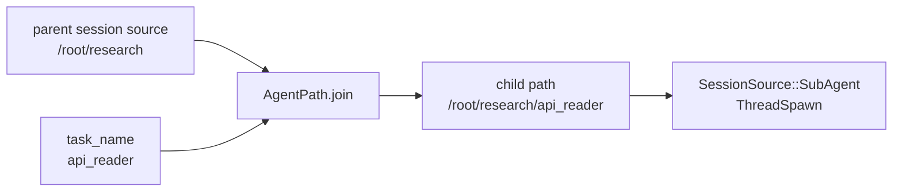

This identity becomes the child's address for mail, listing, status, and notification.

### Step 6: Convert Plain Initial Text To Agent Mail

If the initial operation is plain text user input, v2 converts it to:

```text
Op::InterAgentCommunication { communication }
```

with:

```text
author = parent AgentPath
recipient = child AgentPath
trigger_turn = true
```

That preserves who asked whom to do the work.

If the parsed initial operation is not plain text-only user input, the handler leaves it as the parsed operation.

### Step 7: Spawn The Thread

`AgentControl.spawn_agent_with_metadata` creates the child thread.

It handles:

- effective multi-agent version;
- active execution capacity;
- v2 residency slot reservation;
- spawn slot reservation;
- path reservation;
- nickname reservation;
- inherited shell snapshot and exec policy;
- thread creation or forked thread creation;
- registry commit;
- analytics;
- thread-created notification;
- persisted parent-child edge;
- initial input submission.

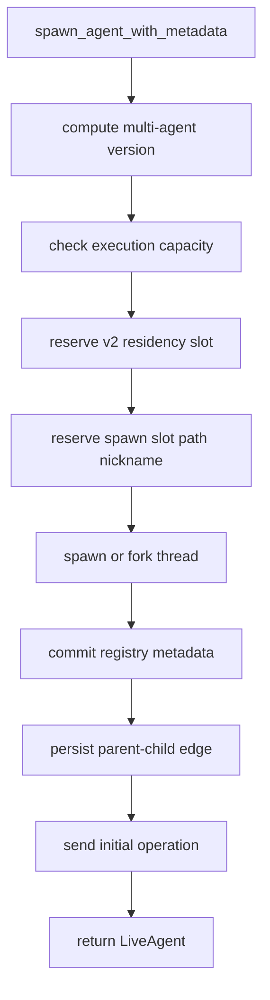

For Freeflow, the equivalent should return:

```text
run_id
task_name
status
trace_path
```

not only generated text.

## Forked Context

Codex can fork parent history into a child.

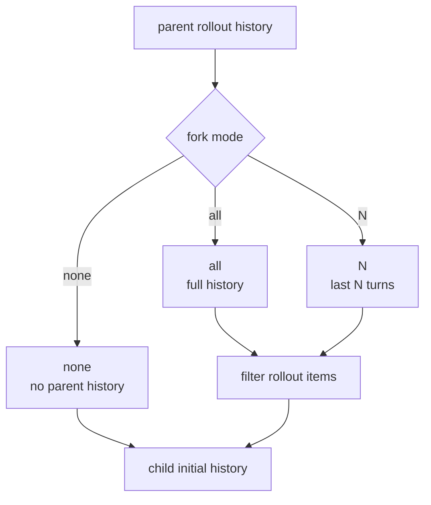

The fork filter keeps semantic context and removes mechanical traces.

Kept:

- system, developer, and user messages;
- assistant final answers;
- session metadata;
- compacted summaries;
- `TurnContext` only for full-history forks;
- compaction/session/event metadata needed for reconstruction.

Dropped:

- reasoning;
- agent messages;
- shell calls;
- function calls;
- tool search calls;
- tool outputs;
- web and image calls;
- compaction trigger artifacts;
- typed `RolloutItem::InterAgentCommunication`;
- miscellaneous tool artifacts.

It also filters MultiAgentV2 usage hints so the child does not inherit stale root/subagent guidance and duplicate it.

Current source nuance:

```text
Full-history forks preserve the reference context item.
Truncated forks drop that prompt prefix and must rebuild context on the first child turn.
```

Freeflow lesson:

```text
Do not delegate the whole frontier transcript to a local model.
Delegate a task packet.
```

Good local packet:

```text
Task:
  Find all call sites for X and summarize risk.

Allowed tools:
  read_file, search_text

Context:
  repo root, target files, current diff summary

Output:
  JSON with findings, file paths, line refs, confidence, uncertainty.

Do not:
  edit files, run network, install dependencies, make final product decisions.
```

## AgentControl

`AgentControl` is the control plane.

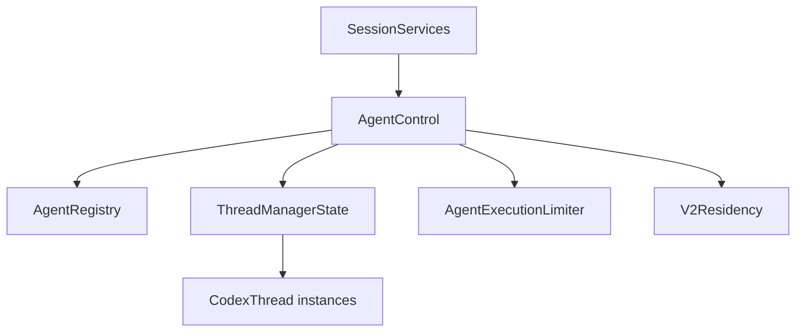

Responsibilities:

- spawn new agents;
- send ordinary input to agents;
- send inter-agent communication;
- interrupt agents;
- get status;
- subscribe to status;
- list live agents;
- resolve path references;
- register root threads;
- track metadata;
- persist parent-child thread edges;
- reload unloaded v2 agents;
- enforce capacity;
- manage v2 residency.

The key mental model:

```text
The model sees tools.
The runtime owns AgentControl.
AgentControl owns the actual agent tree.
```

For Freeflow:

```text
The frontier model should see a simple CLI/tool interface.
The local harness should own LocalAgentManager.
LocalAgentManager should own local jobs, policies, traces, and lifecycle.
```

## Agent Registry

`AgentRegistry` tracks active agent metadata.

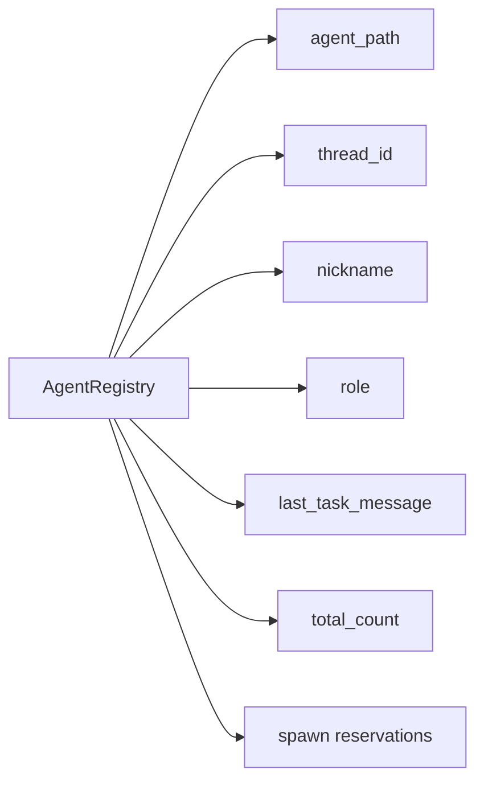

Reservations matter because spawn has multiple steps:

```text
reserve capacity
reserve path
reserve nickname
create thread
commit metadata
```

If spawn fails midway, `Drop` releases the reservation.

Production lesson:

```text
Do not leave half-created agents in the registry.
```

Freeflow v0 can simplify, but local run creation should still be transactional:

```text
create run directory
write initial metadata
start process/task
mark status running
```

If startup fails:

```text
mark failed
write error
do not pretend a worker exists
```

## Roles And Usage Hints

Active built-in roles in current source:

- `default`
- `explorer`
- `worker`

There is also an `awaiter.toml` file, but its role declaration is commented out in `role.rs`, so it is not currently advertised as an active built-in.

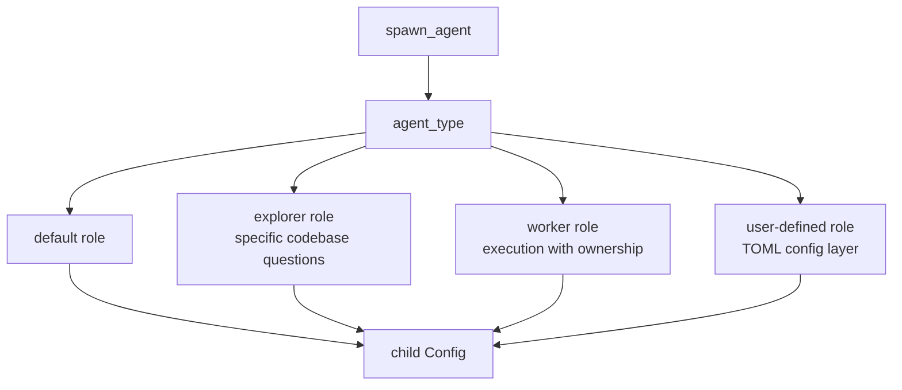

Roles are config/instruction layers, not separate runtimes.

The role layer can be inserted at high precedence and can override model, reasoning effort, service tier, or developer instructions if the role file sets those keys.

Current default MultiAgentV2 usage hints include these important behaviors:

- root and child agents are described as team agents;
- child agents can spawn subagents;
- all agents are described as equally intelligent and capable;
- agents have the same tools;
- `fork_turns` controls context propagation;
- `send_message` does not trigger a turn;
- `followup_task` triggers a turn;
- do not spawn subagents unless the user explicitly asks for subagents, delegation, or parallel agent work.

For Freeflow local delegation, copy the role layering idea, not the exact hint.

The local hint should say the opposite of "equally capable":

```text
You are a local helper model.
You are fast and cheap but less reliable than the frontier orchestrator.
Work only inside the delegated scope.
Use evidence.
Report uncertainty.
Do not make product, security, billing, privacy, compatibility, or public API decisions.
Return structured output for the orchestrator to verify.
```

## Mailbox And Turn Boundaries

Codex uses a session-scoped mailbox for inter-agent messages.

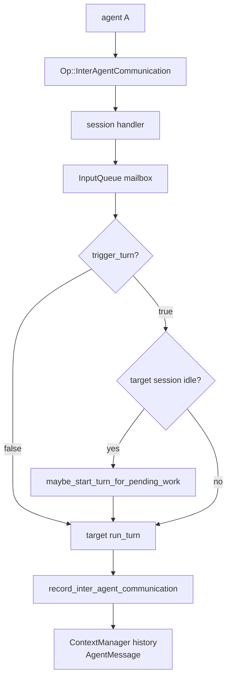

The important design is not just "queue messages." It is:

```text
deliver messages only at safe turn boundaries.
```

Codex avoids corrupting an active model generation with late child messages.

Current turn-loop behavior:

- `InputQueue` stores mailbox mail separately from turn-local pending input.
- `get_pending_input` drains mailbox mail only if the current turn accepts mailbox delivery.
- Assistant final-answer boundaries can defer mailbox delivery to the next turn.
- User steering can reopen mailbox delivery for the current turn.
- Tool calls can reopen mailbox delivery for the current turn.
- Commentary and reasoning output can preempt for pending mailbox mail and force a follow-up.
- `TurnInput::InterAgentCommunication` is recorded through `record_inter_agent_communication`.

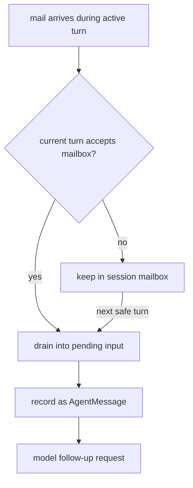

For Freeflow local async runs:

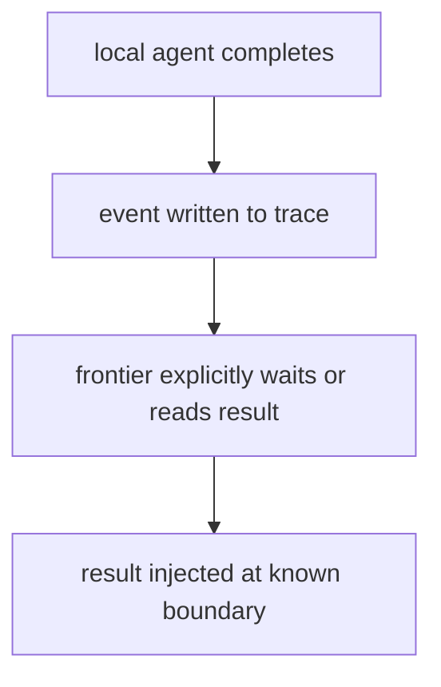

Do not paste local output into the frontier context at arbitrary times.

## Send Message Vs Followup Task

Codex separates two actions that many agent systems accidentally merge.

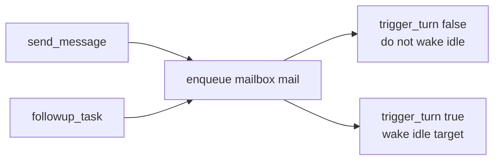

`send_message`:

```text
deliver promptly when possible, but do not start a new turn
```

`followup_task`:

```text
deliver and start a turn if the target is idle
```

This avoids a common bug:

```text
Every message accidentally becomes work.
```

For Freeflow v0, we can avoid this by supporting only one-shot local runs. If reusable local workers are added later, this distinction should be preserved.

## Status And Completion

For MultiAgentV2, child completion is not a plain return value from `spawn_agent`.

The child runs its own turn. When the child emits a terminal `TurnComplete` or `TurnAborted`, `Session::maybe_notify_parent_of_terminal_turn` decides whether to notify the direct parent.

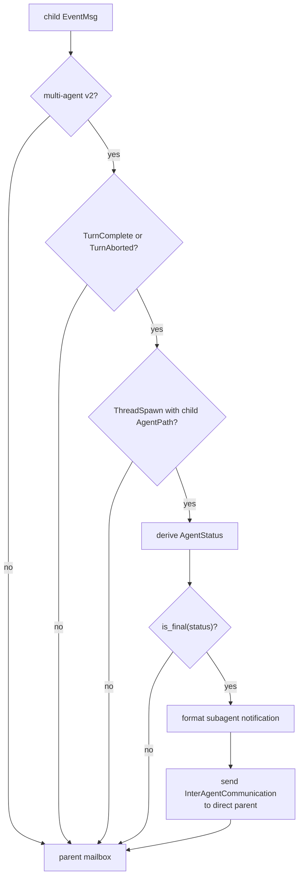

The notification body is a contextual user fragment:

```text
<subagent_notification>
{
  "agent_path": "/root/worker",
  "status": ...
}
</subagent_notification>
```

The child does not directly overwrite parent state. It sends mail to the parent.

Subtlety:

- `Completed`, `Errored`, and `Shutdown` notify as final.
- `Interrupted` does not notify as final.
- A user or parent can still follow up later.

For Freeflow local harness:

```text
LocalAgentStatus should be derived from LocalAgentEvent.
```

Suggested events:

```text
run_created
run_started
model_request_started
model_request_completed
tool_call_started
tool_call_completed
tool_call_failed
policy_denied
run_completed
run_failed
run_cancelled
```

Then:

```text
status = reduce(events)
```

## Wait Semantics

V2 `wait_agent` is intentionally small.

```mermaid
sequenceDiagram
  participant M as Model
  participant W as wait_agent
  participant Q as Current session mailbox

  M->>W: wait_agent(timeout_ms)
  W->>Q: subscribe_mailbox()
  Q-->>W: changed or timeout
  W-->>M: Wait completed or Wait timed out
```

It returns:

```json
{
  "message": "Wait completed.",
  "timed_out": false
}
```

or:

```json
{
  "message": "Wait timed out.",
  "timed_out": true
}
```

It does not include child final content.

Why this is good:

- wait does not become a giant result transport;
- output delivery stays in normal message/history flow;
- the parent separates "something happened" from "read the actual result";
- content is not duplicated across status and history.

For Freeflow:

```text
freeflow-local wait <run-id> --timeout-ms 30000
```

could return:

```json
{
  "run_id": "local-...",
  "status": "completed",
  "changed": true,
  "result_available": true,
  "trace_path": ".freeflow/local-runs/.../trace.jsonl"
}
```

Then:

```text
freeflow-local result <run-id>
```

returns the structured result.

## Listing, Targeting, And Interrupt

Codex can resolve agent targets by path reference. The resolver first tries thread id parsing in the tool path, then path resolution.

Examples:

```text
worker
/root/worker
worker/child
/root/worker/child
```

`list_agents` returns live loaded agents with:

```json
{
  "agent_name": "/root/worker",
  "agent_status": "running",
  "last_task_message": "Find auth refresh tests"
}
```

`interrupt_agent`:

- resolves the target;
- rejects root;
- rejects self;
- records previous status;
- sends `Op::Interrupt`;
- treats already-unavailable threads as acceptable for this operation;
- emits a subagent interrupted activity event;
- returns previous status.

For local harness:

```text
cancel/interrupt should not erase traces.
```

It should:

1. signal the process or task to stop;
2. mark the run cancelled or interrupted;
3. preserve partial trace;
4. preserve partial result only if explicitly marked partial.

## Concurrency, Depth, And Residency

Codex has several limit layers that are easy to confuse.

```mermaid
flowchart TD
  Limits["agent limits"]
  SpawnCount["spawn count / max threads"]
  ActiveExec["active execution capacity"]
  Depth["legacy agents.max_depth"]
  Residency["v2 residency capacity"]

  Limits --> SpawnCount
  Limits --> ActiveExec
  Limits --> Depth
  Limits --> Residency

  ActiveExec --> Starts["counts UserInput and trigger-turn mail"]
  Depth --> Legacy["enforced by legacy handler"]
  Depth --> V2Note["v2 records depth but ignores max_depth"]
  Residency --> Unload["unload idle resident when full"]
```

Active execution capacity counts operations that start turns:

```text
Op::UserInput
Op::InterAgentCommunication with trigger_turn = true
```

Queue-only mail does not count as active execution.

Current source nuance:

- `DEFAULT_AGENT_MAX_DEPTH = 1` exists.
- Legacy multi-agent handlers enforce the configured max depth.
- MultiAgentV2 has a test showing v2 spawn ignores configured max depth.
- V2 still records depth in `SubAgentSource::ThreadSpawn`.
- V2 relies on active execution capacity and residency for practical control.

Residency controls loaded v2 subagent threads.

```mermaid
flowchart TD
  Need["need v2 resident slot"]
  Slot{"capacity available?"}
  Reserve["reserve pending slot"]
  Scan["scan LRU residents"]
  Unloadable{"completed, errored, or interrupted<br/>and idle<br/>and mailbox empty?"}
  Shutdown["materialize rollout<br/>shutdown thread<br/>remove from manager"]
  Fail["AgentLimitReached"]

  Need --> Slot
  Slot -->|yes| Reserve
  Slot -->|no| Scan --> Unloadable
  Unloadable -->|yes| Shutdown --> Reserve
  Unloadable -->|no more candidates| Fail
```

For local models, limits are not optional.

Local inference is financially cheap but physically expensive.

Suggested Freeflow v0 defaults:

```text
max_concurrent_local_agents: 1
max_total_local_agents_per_turn: 3
max_runtime_seconds: 60 to 120
max_tool_calls_per_agent: 8 to 12
max_total_output_chars: bounded
nested_local_agents: disabled
```

## Agent Jobs

Agent jobs are batch delegation.

```mermaid
flowchart TD
  Csv["CSV input"]
  Job["create agent job"]
  Items["one job item per row"]
  Workers["spawn worker subagents"]
  Report["worker calls report_agent_job_result"]
  Store["state DB records results"]
  Export["export output CSV"]
  Fail["missing or stale reports become failures"]

  Csv --> Job --> Items --> Workers
  Workers --> Report --> Store --> Export
  Workers --> Fail --> Store
```

The important pattern:

```text
Workers must report structured results.
Missing reports are failures, not invisible success.
```

Agent jobs are not the first thing Freeflow should copy. They are a later capability for:

- local batch research;
- repeated classification;
- file-by-file summarization;
- issue triage pre-passes;
- CSV-backed evaluation work.

The first local harness should focus on one bounded delegated task with a trace and structured result.

## Older Delegate Path

`codex_delegate.rs` starts an interactive or one-shot sub-Codex thread and bridges events and approvals.

```mermaid
flowchart TD
  Parent["parent session"]
  Delegate["run_codex_thread_interactive"]
  Child["child Codex thread"]
  Events["forward child events"]
  Approvals["route approvals through parent"]
  Ops["forward ops to child"]
  Cancel["child cancellation token"]

  Parent --> Delegate --> Child
  Child --> Events --> Parent
  Child --> Approvals --> Parent
  Parent --> Ops --> Child
  Parent --> Cancel --> Child
```

This is useful for:

- approval forwarding;
- child cancellation;
- bridging child events;
- one-shot child tasks;
- inherited services and policies.

But it is heavier than Freeflow local v0.

The best lessons to borrow:

- child tools must not bypass parent authority;
- approval requests from child should be routed or denied by parent policy;
- cancellation should cascade;
- child events need a controlled bridge;
- one-shot mode should close further input after the initial request.

Code-mode delegation is a separate nested tool dispatch broker. It is useful for understanding event/tool delegation, but it is not the main local harness target.

## Turn-Loop Dependencies

Subagents depend on the turn loop. They are not an isolated feature.

```mermaid
flowchart TD
  Spawn["spawn_agent creates child thread"]
  ChildRun["child RegularTask::run"]
  RunTurn["run_turn"]
  Sample["run_sampling_request"]
  Stream["try_run_sampling_request"]
  Tools["ToolRouter handles tools"]
  Mail["InterAgentCommunication"]
  ParentQueue["parent InputQueue mailbox"]
  ParentRun["parent run_turn follow-up"]

  Spawn --> ChildRun --> RunTurn --> Sample --> Stream --> Tools
  Stream -->|final or terminal event| Mail --> ParentQueue --> ParentRun
```

Pass 1 owns the detailed turn-loop mechanics. The relevant Pass 4 takeaways are:

- subagent mail is a turn input variant;
- mailbox delivery can be deferred or accepted depending on turn state;
- typed agent messages are recorded into history;
- completion notification uses the same event and input machinery as other turns;
- `wait_agent` is only synchronization over mailbox changes.

## Behavioral Evidence From Tests

| Behavior | Evidence area | Lesson |
| --- | --- | --- |
| Nested v2 active execution capacity | `core/tests/suite/agent_execution.rs` | Nested delegation shares one active execution budget. |
| V2 ignores configured max depth | `multi_agents_tests.rs` | Do not claim `agents.max_depth` controls v2 nesting. |
| Completion notification without explicit wait | `subagent_notifications.rs` | Parent can receive child status through mailbox flow. |
| Forked parent context filtering | `subagent_notifications.rs`, `control/spawn.rs` | Forks keep semantic context and drop mechanical trace. |
| Typed inter-agent replay | `rollout_reconstruction_tests.rs` | Typed rollout mail reconstructs as `AgentMessage`. |
| Wait mailbox behavior | `multi_agents_tests.rs`, `wait.rs` | V2 wait returns on mailbox change and does not return content. |
| Interrupt target rules | `multi_agents_tests.rs`, `interrupt_agent.rs` | Control tools need root/self/target safety rules. |
| Runtime policy inheritance | `multi_agents_tests.rs`, `multi_agents_common.rs` | Children inherit live approval, cwd, sandbox, and permission profile. |
| Role override behavior | `role_tests.rs`, `subagent_notifications.rs` | Roles are config layers and can override model/reasoning when set. |
| Agent job result reporting | `agent_jobs.rs` tests | Structured result reporting is a first-class state transition. |

## Audit Findings

### Correct In Original Doc

- Subagents are real child threads, not prompt wrappers.
- MultiAgentV2 is the best Codex reference for Freeflow local delegation.
- `AgentControl` is the control plane.
- `AgentPath` is the stable address shape.
- `send_message` and `followup_task` differ by `trigger_turn`.
- `wait_agent` v2 is not result transport.
- Freeflow should start with bounded local evidence workers, not a full Codex clone.

### Needed Corrections

- Inter-agent communication should be described as typed `AgentMessage` history in current source, not only assistant-message JSON.
- Current source has typed `RolloutItem::InterAgentCommunication`.
- Forked history explicitly drops typed inter-agent communication.
- V2 completion notification is session-side terminal event handling, not the legacy detached watcher path.
- `Interrupted` is not final for completion notification.
- V2 ignores `agents.max_depth`, though it still records depth.
- Active built-in roles are `default`, `explorer`, and `worker`; `awaiter.toml` is present but not active.
- Default usage hints require explicit user authorization for delegation.
- `list_agents` is live-agent listing, not complete persistent tree listing.

### Underplayed Dependencies

- Tool registration is rebuilt per turn through the tool plan, so the collaboration tools are not a permanent global list.
- Child config inherits live runtime policy, not only static config.
- Mailbox delivery is tied to `ActiveTurn`, `TurnState`, and `MailboxDeliveryPhase`.
- Rollout replay now matters for inter-agent messages because typed mail becomes model-visible history.
- Residency and active execution capacity are separate mechanisms.
- Agent jobs use state DB persistence and required result reporting.

## What Freeflow Should Borrow

### Borrow The Control Plane

Build a small local control plane:

```text
LocalAgentManager
  spawn
  list
  status
  wait
  result
  cancel
```

This can be a CLI/package first, not baked into the Freeflow plugin runtime.

### Borrow Stable Task Identity

Every local run should have:

```text
run_id
task_name
parent_run_id or parent_thread_id
```

The frontier orchestrator should not manage anonymous helper responses.

### Borrow Event-Derived Status

Status should come from events:

- created, then running, then completed;
- created, then running, then failed;
- created, then running, then cancelled.

Store events in JSONL.

### Borrow Mailbox-Like Separation

Do not make `wait` return huge content.

Use:

```text
wait = synchronization
result = content retrieval
trace = evidence/debugging
```

### Borrow Context Forking, But Make It Smaller

Codex can fork history because Codex subagents are frontier-level.

Local models should usually receive selected context only:

```text
task + file snippets + constraints + output schema
```

not:

```text
entire orchestrator transcript
```

### Borrow Roles As Thin Layers

Avoid heavy duplicated profiles.

Use:

```text
task_kind
policy caps
tool grants
output schemas
```

Examples:

```text
code_search
summarize_file
review_diff
extract_evidence
propose_patch
```

### Borrow Concurrency Caps

Default local concurrency should be conservative:

```text
max_concurrent_local_agents = 1
```

Maybe `2` on strong machines after benchmarking.

### Borrow Structured Result Requirements

Local results should include:

```text
answer
evidence
files_read
tools_used
uncertainty
confidence
recommendation
needs_frontier_review
```

### Borrow Parent Authority

Local agents should not approve risky actions.

Risky request becomes:

```text
NeedsApproval or Denied
```

and the frontier orchestrator decides.

## What Freeflow Should Not Copy Yet

### Do Not Copy Full Thread Persistence Yet

Codex persists threads, rollout history, state database entries, and parent-child edges.

Freeflow v0 can store:

```text
metadata.json
trace.jsonl
result.json
```

### Do Not Copy Nested Local Subagents Yet

Codex lets subagents spawn subagents. Local models should not do this in v0.

Default:

```text
nested_local_agents: disabled
```

### Do Not Copy Same-Tool Parity

Codex hints say spawned agents have the same tools. Local agents should not.

Use a smaller tool set:

```text
read_file
list_files
search_text
inspect_diff
final_result
```

Default disabled:

```text
network
write_file
apply_patch
dependency install
destructive shell
```

### Do Not Copy Encrypted Message Machinery

Encrypted agent messages matter for Codex product architecture. They are not needed for the first Freeflow local harness.

### Do Not Copy Batch Agent Jobs First

Agent jobs are powerful, but they are a later feature.

First build:

```text
one local delegated task
safe tools
structured result
trace
verification by frontier model
```

### Do Not Copy Heavy Role Config First

Codex role config reloads config layers.

Freeflow v0 can start with:

```text
task_kind -> instructions + tool_policy + output_schema
```

## Design Lessons For Small Local Models

Small local models change the delegation strategy.

Codex subagents can handle larger tasks because they are frontier-level agents with the same tool access. Local models should get tasks that are:

- bounded;
- evidence-heavy;
- easy to verify;
- low-risk;
- parallelizable;
- not product-authority decisions;
- not security, privacy, billing, compatibility, or public API decisions;
- not broad architecture ownership;
- not open-ended debugging with many unknowns.

Good local tasks:

```text
Find all files mentioning X.
Summarize this file.
Extract API routes from these files.
List possible tests affected by this diff.
Review this diff for obvious typos/null checks.
Compare two snippets.
Generate candidate grep queries.
Classify files by likely relevance.
```

Risky local tasks:

```text
Design the whole harness.
Change authentication behavior.
Migrate data.
Approve shell or network access.
Refactor many files.
Make final product decisions.
Diagnose a deep intermittent bug alone.
```

Best pattern:

```text
local agent produces evidence
frontier orchestrator judges and integrates
```

## Freeflow Local Harness Translation

```mermaid
flowchart TD
  Frontier["frontier orchestrator<br/>Codex or Claude"]
  Packet["delegation packet<br/>task + selected context"]
  Manager["LocalAgentManager"]
  Worker["local model worker"]
  Tools["bounded read-only tools"]
  Trace["trace.jsonl"]
  Result["result.json"]
  Verify["frontier verification"]

  Frontier --> Packet --> Manager --> Worker
  Worker --> Tools
  Worker --> Trace
  Worker --> Result
  Result --> Verify
  Trace --> Verify
  Verify --> Frontier
```

The local model is not the final decider. It is an evidence producer.

## Suggested First Local Delegation Contract

### Commands

```text
freeflow-local spawn --task-name NAME --task-json PATH
freeflow-local list
freeflow-local status RUN_ID
freeflow-local wait RUN_ID --timeout-ms 30000
freeflow-local result RUN_ID
freeflow-local cancel RUN_ID
```

These can later become function tools or MCP tools.

### Spawn Request

```json
{
  "task_name": "search_auth_tests",
  "task_kind": "code_search",
  "message": "Find tests that cover auth token refresh.",
  "context": {
    "repo_root": "/path/to/repo",
    "files": [],
    "snippets": [],
    "diff_summary": ""
  },
  "model": {
    "provider": "mlx_server",
    "model": "gemma-..."
  },
  "policy": {
    "tools": ["list_files", "read_file", "search_text"],
    "writes": false,
    "network": false,
    "shell": false,
    "max_tool_calls": 12,
    "max_runtime_seconds": 90
  },
  "output_schema": "local_agent_result_v1"
}
```

### Spawn Response

```json
{
  "run_id": "local-20260613-...",
  "task_name": "search_auth_tests",
  "status": "running",
  "trace_path": ".freeflow/local-runs/local-.../trace.jsonl"
}
```

### Status

```json
{
  "run_id": "local-20260613-...",
  "task_name": "search_auth_tests",
  "status": "completed",
  "started_at": "2026-06-13T00:00:00Z",
  "completed_at": "2026-06-13T00:01:12Z",
  "result_available": true
}
```

### Result

```json
{
  "run_id": "local-20260613-...",
  "task_name": "search_auth_tests",
  "status": "completed",
  "answer": "Found likely auth refresh tests in tests/auth_refresh.test.ts.",
  "evidence": [
    {
      "path": "tests/auth_refresh.test.ts",
      "line": 42,
      "reason": "Contains refresh token expiry assertions."
    }
  ],
  "files_read": ["tests/auth_refresh.test.ts"],
  "tools_used": ["search_text", "read_file"],
  "confidence": "medium",
  "uncertainty": [
    "Did not run tests.",
    "Search may miss dynamically named refresh helpers."
  ],
  "needs_frontier_review": true
}
```

### Event Trace

```json
{"type":"run_created","run_id":"...","task_name":"search_auth_tests"}
{"type":"run_started","model":"gemma-...","provider":"mlx_server"}
{"type":"tool_call_started","tool":"search_text","query":"refresh token"}
{"type":"tool_call_completed","tool":"search_text","matches":12}
{"type":"model_response_completed","tokens_estimated":1234}
{"type":"run_completed","status":"completed"}
```

## Beginner-Friendly Pseudocode

This is not Codex code. It is the simplified architecture in Python-like pseudocode.

```python
class LocalAgentManager:
    def __init__(self, store, model_adapters, tool_registry, policy):
        self.store = store
        self.model_adapters = model_adapters
        self.tool_registry = tool_registry
        self.policy = policy
        self.running = {}

    async def spawn(self, request):
        self.policy.validate_spawn(request)

        run = self.store.create_run(
            task_name=request.task_name,
            parent=request.parent,
            policy=request.policy,
            model=request.model,
        )

        self.store.append_event(run.id, {
            "type": "run_created",
            "task_name": request.task_name,
        })

        task = asyncio.create_task(self._run_agent(run, request))
        self.running[run.id] = task

        return {
            "run_id": run.id,
            "task_name": run.task_name,
            "status": "running",
            "trace_path": run.trace_path,
        }

    async def _run_agent(self, run, request):
        try:
            self.store.append_event(run.id, {"type": "run_started"})

            session = LocalAgentSession(
                run=run,
                model=self.model_adapters.get(request.model.provider),
                tools=self.tool_registry.for_policy(request.policy),
                policy=request.policy,
                store=self.store,
            )

            result = await session.run_turn(request.message, request.context)
            self.store.write_result(run.id, result)
            self.store.append_event(run.id, {
                "type": "run_completed",
                "status": "completed",
            })
        except CancelledError:
            self.store.append_event(run.id, {
                "type": "run_cancelled",
                "status": "cancelled",
            })
        except Exception as error:
            self.store.append_event(run.id, {
                "type": "run_failed",
                "error": str(error),
            })

    async def wait(self, run_id, timeout_ms):
        return await self.store.wait_for_status_change(run_id, timeout_ms)

    def result(self, run_id):
        return self.store.read_result(run_id)

    def list(self):
        return self.store.list_runs()

    def cancel(self, run_id):
        task = self.running.get(run_id)
        if task:
            task.cancel()
        self.store.append_event(run_id, {"type": "cancel_requested"})
```

Local turn loop:

```python
class LocalAgentSession:
    async def run_turn(self, message, context):
        history = self.build_initial_history(message, context)

        for step in range(self.policy.max_model_steps):
            response = await self.model.complete(
                messages=history,
                tools=self.tools.visible_specs(),
            )

            if response.final:
                return self.parse_final_result(response)

            for tool_call in response.tool_calls:
                decision = self.policy.check_tool_call(tool_call)
                if decision.denied:
                    output = {"error": decision.reason}
                else:
                    output = await self.tools.execute(tool_call)

                self.store.append_event(self.run.id, {
                    "type": "tool_call_completed",
                    "tool": tool_call.name,
                    "success": output.get("success", True),
                })
                history.append_tool_output(tool_call, output)

        return {
            "status": "failed",
            "answer": "",
            "uncertainty": ["max model steps reached"],
            "needs_frontier_review": True,
        }
```

## Open Questions

These should be answered after more passes and design work:

1. Should local delegation v0 support async background runs, or only synchronous one-shot calls?
2. Should the first local harness be Python, TypeScript, or Rust?
3. Should local results be stored under `.freeflow/local-runs/` or another tool-owned directory?
4. Should the orchestrator call the harness through CLI, MCP, or direct plugin tool?
5. Which local provider should be first-class for Apple Silicon: MLX server, Ollama, LM Studio, or OpenAI-compatible HTTP?
6. Should local agents ever write files in v0, or only propose patches/results?
7. How should Freeflow skills instruct Codex, Claude, or other agents to choose local delegation?
8. What benchmark proves token savings without output degradation?
9. How much local trace should be injected back into the frontier context by default?
10. Should nested local agents be disallowed permanently or only for v0?

## Next Research Passes

The canonical pass index and roadmap live in:

```text
docs/research/codex-cli-agent-harness/README.md
```

This pass should be cross-checked with:

- Pass 1 for turn-loop and mailbox delivery;
- Pass 2 for tool planning and tool runtime;
- Pass 3 for sandbox and permission inheritance;
- Pass 6 for context packet design.

## Source Evidence Appendix

Source snapshots:

```text
historical repo: openai/codex
historical commit: b65fe3d8976d6fcc44ee6c6cf988654af5fc4d2d
historical date: 2026-06-12
historical title: fix: serialize auth environment tests (#27879)

current upstream: origin/main
current commit: 0fed4497f50ad5f0b2f7972a1bfd14c5a09a85c5
current date: 2026-06-13
current title: [codex] Carry exec-server cwd as PathUri (#28032)

local path: /private/tmp/openai-codex-study-pass0
```

### Protocol And Identity

- `/private/tmp/openai-codex-study-pass0/codex-rs/protocol/src/agent_path.rs`
  - Defines `AgentPath`, `/root`, `/morpheus`, validation, `join`, and relative resolution.

- `/private/tmp/openai-codex-study-pass0/codex-rs/protocol/src/protocol.rs`
  - Defines `InterAgentCommunication`, `AgentStatus`, `SessionSource`, `SubAgentSource`, `ThreadSource`, collaboration events, and typed rollout items.

- `/private/tmp/openai-codex-study-pass0/codex-rs/protocol/src/models.rs`
  - Defines `AgentMessageInputContent::InputText` and `EncryptedContent`, plus `ResponseItem::AgentMessage`.

### MultiAgentV2 Tool Handlers

- `/private/tmp/openai-codex-study-pass0/codex-rs/core/src/tools/handlers/multi_agents_v2.rs`
  - Entry module for v2 collaboration handlers.

- `/private/tmp/openai-codex-study-pass0/codex-rs/core/src/tools/handlers/multi_agents_v2/spawn.rs`
  - Implements v2 `spawn_agent`: arg parsing, fork mode, config inheritance, role/model handling, path creation, initial text conversion to `InterAgentCommunication`, `AgentControl.spawn_agent_with_metadata`, activity event, and response.

- `/private/tmp/openai-codex-study-pass0/codex-rs/core/src/tools/handlers/multi_agents_v2/message_tool.rs`
  - Shared `send_message` and `followup_task` submission path; queue-only vs trigger-turn behavior.

- `/private/tmp/openai-codex-study-pass0/codex-rs/core/src/tools/handlers/multi_agents_v2/wait.rs`
  - V2 wait subscribes to current mailbox and returns only a timeout summary.

- `/private/tmp/openai-codex-study-pass0/codex-rs/core/src/tools/handlers/multi_agents_v2/list_agents.rs`
  - Lists live agents with status and last task message.

- `/private/tmp/openai-codex-study-pass0/codex-rs/core/src/tools/handlers/multi_agents_v2/interrupt_agent.rs`
  - Resolves target, rejects root/self, interrupts current turn, returns previous status.

### Tool Specs And Config

- `/private/tmp/openai-codex-study-pass0/codex-rs/core/src/tools/handlers/multi_agents_spec.rs`
  - Model-visible schemas and descriptions for spawn, send, followup, wait, list, and interrupt.

- `/private/tmp/openai-codex-study-pass0/codex-rs/core/src/tools/spec_plan.rs`
  - Registers collaboration tools based on features, multi-agent version, namespace support, exposure, and config.

- `/private/tmp/openai-codex-study-pass0/codex-rs/core/src/config/mod.rs`
  - Defines default MultiAgentV2 usage hints, wait timeouts, max concurrency, `MultiAgentV2Config`, and `DEFAULT_AGENT_MAX_DEPTH`.

### Agent Control Plane

- `/private/tmp/openai-codex-study-pass0/codex-rs/core/src/agent/control.rs`
  - Main `AgentControl`: send input, send inter-agent communication, interrupt, status, list, resolve references, environment context, legacy completion watcher, root registration, and parent-child edges.

- `/private/tmp/openai-codex-study-pass0/codex-rs/core/src/agent/control/spawn.rs`
  - Spawn internals: residency slots, reservations, thread creation/forking, fork filtering, history replay, resume, and metadata commit.

- `/private/tmp/openai-codex-study-pass0/codex-rs/core/src/agent/control/execution.rs`
  - Active execution limiter and operation classification.

- `/private/tmp/openai-codex-study-pass0/codex-rs/core/src/agent/control/residency.rs`
  - V2 resident capacity, LRU unload, and unloadability rules.

- `/private/tmp/openai-codex-study-pass0/codex-rs/core/src/agent/registry.rs`
  - Active agent metadata, reservations, path/nickname handling, last task message, depth helpers, and total count.

- `/private/tmp/openai-codex-study-pass0/codex-rs/core/src/agent/agent_resolver.rs`
  - Resolves thread ids or path references to target agents.

- `/private/tmp/openai-codex-study-pass0/codex-rs/core/src/agent/status.rs`
  - Derives `AgentStatus` from lifecycle events and defines final-status logic.

- `/private/tmp/openai-codex-study-pass0/codex-rs/core/src/agent/role.rs`
  - Applies role config layers and defines active built-in roles.

### Session, Mailbox, And Turn Loop

- `/private/tmp/openai-codex-study-pass0/codex-rs/core/src/session/input_queue.rs`
  - `TurnInput`, mailbox queue, trigger-turn checks, mailbox draining, delivery deferral, and turn-local pending input.

- `/private/tmp/openai-codex-study-pass0/codex-rs/core/src/session/handlers.rs`
  - Handles `Op::InterAgentCommunication`, enqueues mailbox mail, and starts pending work when needed.

- `/private/tmp/openai-codex-study-pass0/codex-rs/core/src/tasks/mod.rs`
  - Starts regular turns for pending trigger-turn mailbox work and attaches agent execution guards.

- `/private/tmp/openai-codex-study-pass0/codex-rs/core/src/session/mod.rs`
  - Records inter-agent communication, forwards terminal v2 child notifications to parents, sends events, and records rollout items.

- `/private/tmp/openai-codex-study-pass0/codex-rs/core/src/session/turn.rs`
  - Handles stream output, mailbox preemption, agent-message streaming, tool futures, token counts, and follow-up decisions.

- `/private/tmp/openai-codex-study-pass0/codex-rs/core/src/session/rollout_reconstruction.rs`
  - Reconstructs typed inter-agent rollout items into model-visible history.

- `/private/tmp/openai-codex-study-pass0/codex-rs/core/src/context_manager/history.rs`
  - Treats `AgentMessage` as a user turn boundary and preserves it in context.

### Context And Notifications

- `/private/tmp/openai-codex-study-pass0/codex-rs/core/src/context/subagent_notification.rs`
  - Defines contextual user fragment for child completion notification.

- `/private/tmp/openai-codex-study-pass0/codex-rs/core/src/session_prefix.rs`
  - Formats subagent notifications and environment-context subagent lines.

- `/private/tmp/openai-codex-study-pass0/codex-rs/core/src/context/environment_context.rs`
  - Renders subagent list inside model-visible environment context.

### Agent Jobs

- `/private/tmp/openai-codex-study-pass0/codex-rs/core/src/tools/handlers/agent_jobs.rs`
  - Batch job loop, concurrency, status recovery, stale worker timeout, finalization, and CSV export.

- `/private/tmp/openai-codex-study-pass0/codex-rs/core/src/tools/handlers/agent_jobs/spawn_agents_on_csv.rs`
  - CSV-backed job creation and worker spawning.

- `/private/tmp/openai-codex-study-pass0/codex-rs/core/src/tools/handlers/agent_jobs/report_agent_job_result.rs`
  - Worker-only structured result reporting.

- `/private/tmp/openai-codex-study-pass0/codex-rs/core/src/tools/handlers/agent_jobs_spec.rs`
  - Model-visible specs for job spawn and report tools.

### Older Delegate And Code Mode

- `/private/tmp/openai-codex-study-pass0/codex-rs/core/src/codex_delegate.rs`
  - Runs interactive or one-shot sub-Codex threads, forwards events, routes approvals to parent, forwards ops, and handles cancellation.

- `/private/tmp/openai-codex-study-pass0/codex-rs/core/src/tools/code_mode/delegate.rs`
  - Code-mode nested tool dispatch broker.

### Tests

- `/private/tmp/openai-codex-study-pass0/codex-rs/core/tests/suite/agent_execution.rs`
  - Verifies nested v2 spawn respects shared active execution capacity.

- `/private/tmp/openai-codex-study-pass0/codex-rs/core/tests/suite/subagent_notifications.rs`
  - Verifies subagent lifecycle hooks, notifications, forked context, inherited developer context, encrypted agent messages, model/reasoning overrides, and role behavior.

- `/private/tmp/openai-codex-study-pass0/codex-rs/core/src/tools/handlers/multi_agents_tests.rs`
  - Broad handler tests for spawn, wait, interrupt, list, config inheritance, wait mailbox behavior, self/root target rejection, depth handling, and legacy behavior.

- `/private/tmp/openai-codex-study-pass0/codex-rs/core/src/tools/handlers/multi_agents_spec_tests.rs`
  - Tool schema and description tests for spawn, send, followup, wait, list, and metadata hiding.

- `/private/tmp/openai-codex-study-pass0/codex-rs/core/tests/suite/spawn_agent_description.rs`
  - Tests model-visible spawn-agent description, visible model listing, inherited-model guidance, explicit authorization rule, and hidden model omission.

- `/private/tmp/openai-codex-study-pass0/codex-rs/core/tests/suite/agent_jobs.rs`
  - Tests agent job behavior.

- `/private/tmp/openai-codex-study-pass0/codex-rs/core/src/session/rollout_reconstruction_tests.rs`
  - Tests typed inter-agent mail reconstruction.

## Working Interpretation

Codex's subagent architecture answers this question:

```text
How can one agent delegate work to another without losing control of context, tools, safety, status, and output?
```

The answer is not:

```text
Send a prompt to another model.
```

The answer is:

```text
Create a child agent thread.
Give it stable identity.
Give it bounded context.
Give it a real tool loop.
Track lifecycle through events.
Communicate through a mailbox.
Expose list, wait, followup, message, and interrupt tools.
Limit concurrency.
Keep parent authority.
Return traceable results.
```

For Freeflow's future local-agent harness, the right first target is:

```text
local model as traceable bounded evidence worker
```

not:

```text
local model as invisible autocomplete helper
```

That design lets Freeflow use local models generously while still treating their outputs as evidence to inspect, not truth to trust blindly.

## Change Log

- Converted conceptual flow diagrams to Mermaid.
- Added diagram map and audit summary.
- Added current-source check against `origin/main` at `0fed4497f50ad5f0b2f7972a1bfd14c5a09a85c5`.
- Corrected inter-agent mail to current typed `AgentMessage` and `RolloutItem::InterAgentCommunication` behavior.
- Clarified v2 completion notification, wait semantics, interrupt semantics, and mailbox boundaries.
- Clarified MultiAgentV2 depth behavior and active execution limits.
- Clarified active built-in roles and inactive `awaiter.toml` nuance.
- Tightened Freeflow local harness contract around bounded context, structured evidence, parent authority, and conservative local concurrency.
