# Codex CLI Agent Harness Study - Pass 5 Model Providers And Runtime Adapters

> **Doc ID:** RESEARCH-2026-06-12-codex-cli-agent-harness-pass-5
> **Date:** 2026-06-12
> **Owner:** Hassan Mohiddin
> **Type:** Research
> **Status:** Draft - source-audited 2026-06-14
> **Source:** `openai/codex` source snapshot `b65fe3d8976d6fcc44ee6c6cf988654af5fc4d2d`; current-source audit against `openai/codex` `0fed4497f50ad5f0b2f7972a1bfd14c5a09a85c5` on 2026-06-14; Pass 0 repo map; Pass 1 turn-loop artifact; Pass 2 tool-system artifact; Pass 3 sandboxing-and-permissions artifact; Pass 4 subagents-and-delegation artifact; Pass 6 memory-and-context artifact; `ml-explore/mlx-lm` GitHub README and `mlx_lm/server.py` fetched 2026-06-12 and spot-checked upstream again on 2026-06-14.

## Purpose

Preserve the Pass 5 research into how Codex separates model provider configuration, model capability metadata, request construction, transport, streaming, and event normalization.

This pass also adds the first MLX-focused design analysis for Freeflow's future local-agent harness.

This is research memory, not an implementation plan. It should inform future Freeflow local delegation design, but it does not define shipped Freeflow behavior.

## How To Read This

If this is your first pass, read only:

- `If You Only Read 10 Minutes`
- `Core Idea`
- `Tiny Diagram`
- `MLX-Focused Finding`
- `What Freeflow Should Borrow`

If you are designing the local harness, also read:

- `Deep Mechanism`
- `Model Metadata`
- `MLX Runtime Options`
- `Suggested First Adapter Contract`
- `Suggested First MLX Configuration`

If you are implementing or reviewing later, use:

- `Source Evidence Appendix`
- `Beginner-Friendly Pseudocode`
- `Open Questions`

## Last Audit Result - 2026-06-14

This pass was re-audited after the target correction from Pass 2 to Pass 5.

Current Codex source still supports the core conclusion:

- Codex's configured provider wire API is still Responses-only. `wire_api = "chat"` is rejected with a migration error.
- Built-in local provider IDs still include `ollama` and `lmstudio`, and they are modeled as OpenAI-compatible Responses providers, not Chat Completions providers.
- `ModelClient` remains session-scoped, while `ModelClientSession` is intentionally turn-scoped because it carries WebSocket and sticky-routing state.
- The turn loop receives normalized `ResponseEvent` values. It does not parse raw provider JSON.
- Provider capabilities and model metadata are separate control surfaces. Provider capabilities are upper bounds for provider-owned features; `ModelInfo` gates model-level behavior such as context windows, reasoning summaries, verbosity, Responses Lite, tool mode, input modalities, and parallel tool calls.
- Current source adds a few important details this draft now calls out: WebSocket fallback/prewarm state, `ResponseEvent` metadata such as server model, rate limits, models ETag, moderation metadata, model verification, and server reasoning inclusion.
- The MLX-LM upstream spot-check still supports the Pass 5 external claim: MLX-LM documents generation/chat/streaming/prompt caching, and `mlx_lm.server` is still Chat Completions-style with no `/v1/responses` route found in the inspected source.

No source evidence was found that would justify making MLX look like Responses in v0. The stronger recommendation is still: use a Freeflow-owned internal event protocol and write an MLX Chat Completions adapter first.

## Diagram Map

Use the diagrams as checkpoints, not as replacements for the source-backed text.

| If you are trying to understand... | Start with... |
| --- | --- |
| The whole provider boundary | `Tiny Diagram` |
| Why provider config is not the adapter | `Provider Definition` and `Provider Runtime` |
| Why model calls need a fresh per-turn object | `Model Client And Turn Session` |
| How feature flags reach the request body | `Request Builder` |
| Where provider JSON stops and agent-loop events begin | `Stream Normalization` |
| Why MLX needs a Chat Completions adapter | `MLX-Focused Finding` and `MLX Runtime Options` |
| How tools should interact with weak local tool calling | `MLX And Tool Calling` |
| What the first Freeflow harness should expose | `Suggested First Adapter Contract` |
| How Pass 5 connects back to the turn loop | `Beginner-Friendly Pseudocode` |

## If You Only Read 10 Minutes

Codex does not treat a model provider as only a URL.

It separates:

1. Provider config: where requests go, auth, headers, retry behavior, streaming timeouts, and transport support.
2. Model metadata: what the model can safely handle, such as context window, tool calling, reasoning summaries, output schemas, and parallel tool calls.
3. Model client: the runtime object that sends a prompt to the selected provider.
4. Model client session: a turn-scoped object that owns per-turn streaming state.
5. Event normalization: provider-specific stream output becomes a stable event stream for the agent loop.

The central design lesson:

```text
The agent loop should not care whether the model is OpenAI, Ollama, LM Studio, MLX, or something else.
The adapter should hide that.
```

For Freeflow, the MLX-specific finding is important:

```text
mlx_lm.server looks OpenAI-like, but it is Chat Completions oriented.
Codex's current provider path is Responses API oriented.
Therefore, copying Codex's Responses-only provider path is not enough for an MLX-first Freeflow harness.
```

The recommended Freeflow shape is:

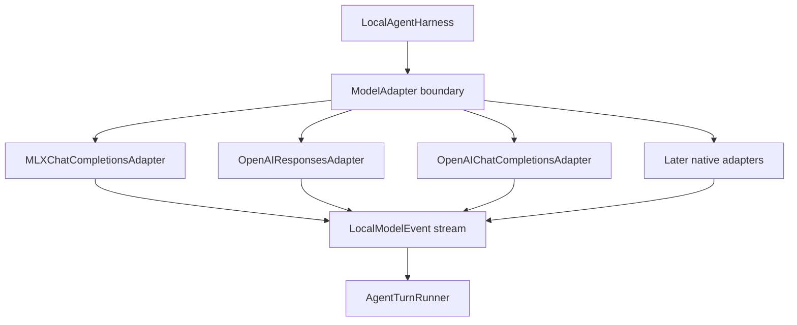

In plain English:

```text
MLX should be first-class.
But MLX details should stay inside the model adapter, not leak into tools, memory, safety, or subagent orchestration.
```

## Core Idea

An agent harness is not just a prompt and a model call.

The harness needs a stable boundary between:

- the agent loop;
- the model provider;
- the model's actual capabilities;
- the model's streaming output format;
- the tool system;
- the verifier/orchestrator that decides whether to trust the result.

Codex's model provider layer exists so the rest of the agent can say:

```text
Here is a Prompt.
Here is the selected model metadata.
Give me a stream of normalized model events.
```

The model layer then handles:

- auth;
- base URL;
- headers;
- transport;
- retries;
- request shape;
- reasoning settings;
- output schema settings;
- streaming protocol;
- server-reported model changes;
- token usage;
- model catalog refresh.

For Freeflow, the same idea should exist, but smaller:

```text
freeflow-local should have a ModelAdapter boundary.
The first implementation should optimize for local MLX speed while keeping the agent loop provider-agnostic.
```

## Tiny Diagram

Codex simplified:

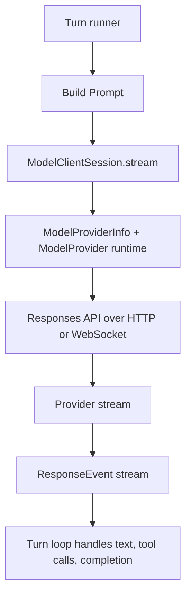

Freeflow suggested:

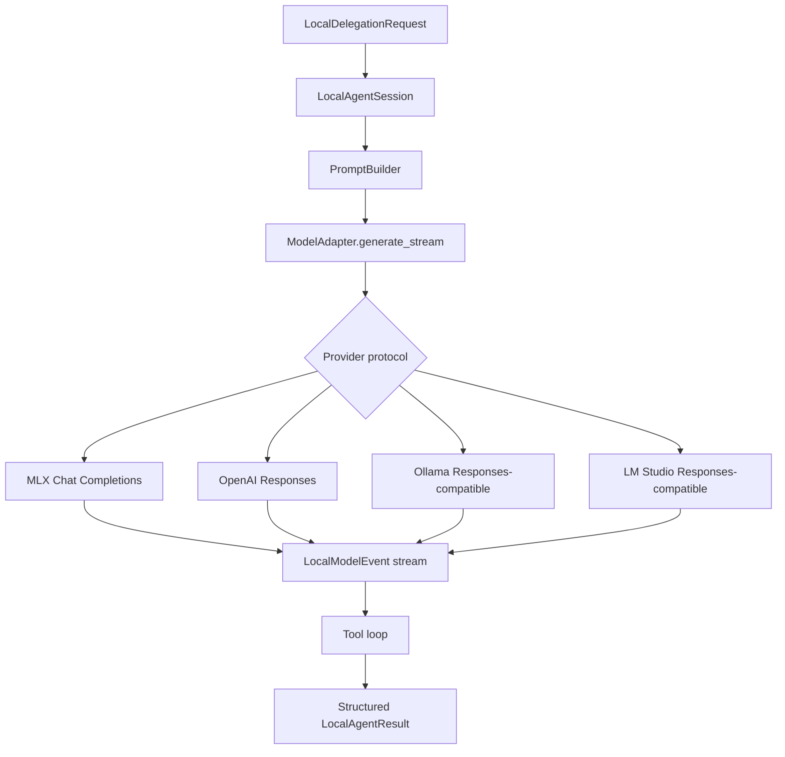

## Glossary

`ModelProviderInfo`
: Codex's serializable provider definition. It includes base URL, auth style, headers, retry settings, stream timeout settings, and wire API.

`ModelProvider`
: Codex's runtime provider abstraction. It turns configured provider data into API clients, auth providers, model managers, and provider capabilities.

`ModelClient`
: Codex's session-scoped model client. It owns stable provider and auth state for a Codex session.

`ModelClientSession`
: Codex's turn-scoped streaming client. It owns per-turn transport state and should be fresh for each turn.

`Prompt`
: Codex's model request envelope. It contains model-visible input, tools, base instructions, optional personality, and optional output schema.

`ModelInfo`
: Codex's model capability metadata. It tells the rest of the runtime what the selected model supports.

`Responses API`
: OpenAI's newer agent-friendly API shape. Codex's current provider wire API supports this path.

`Chat Completions`
: Older OpenAI-compatible chat API shape. Many local servers support this before they support Responses.

`MLX`
: Apple's machine learning array framework for Apple silicon.

`MLX-LM`
: Apple's Python package for text generation and fine-tuning LLMs on Apple silicon with MLX.

`mlx_lm.server`
: MLX-LM's local HTTP server. In the source studied here, it exposes OpenAI-like chat/completions endpoints but not a `/v1/responses` endpoint.

## Deep Mechanism

### Provider Definition

Codex defines provider configuration in `ModelProviderInfo`.

The fields include:

- friendly provider name;
- base URL;
- environment variable for API key;
- command-backed bearer token auth;
- AWS auth;
- wire API;
- query parameters;
- static HTTP headers;
- environment-backed HTTP headers;
- request retry count;
- stream reconnect count;
- stream idle timeout;
- WebSocket connect timeout;
- whether first-party OpenAI auth is required;
- whether Responses-over-WebSocket is supported.

The important part is not the exact Rust struct.

The important part is the separation:

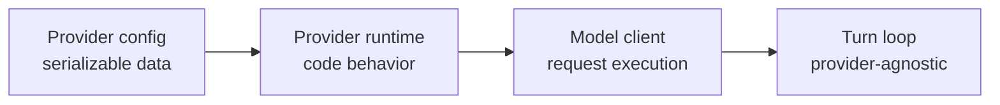

That lets Codex load built-in providers and user-defined providers without hardcoding every provider into the turn loop.

Current-source nuance:

- `ModelProviderInfo` is the configured data shape.
- `ModelProvider` is the runtime trait.
- `ProviderCapabilities` are provider-owned upper bounds for provider-level features such as namespace tools, image generation, and web search.
- `ModelInfo` is separate model metadata. It decides model-level behavior such as reasoning summaries, verbosity, context windows, Responses Lite, tool mode, input modalities, and parallel tool calls.
- `WireApi` currently has one live value: `Responses`. Deserializing `wire_api = "chat"` produces a migration error, not a Chat Completions path.

### Provider Runtime

Codex wraps `ModelProviderInfo` with a runtime `ModelProvider`.

The runtime provider can answer questions like:

- What provider info is active?
- What capabilities are upper bounds for this provider?
- What auth manager should be used?
- What current auth value exists?
- What app-visible account state exists?
- What API provider should the HTTP client use?
- What auth headers should be attached?
- What model manager should be used?

For Freeflow, we do not need all of this.

But we do need the same boundary:

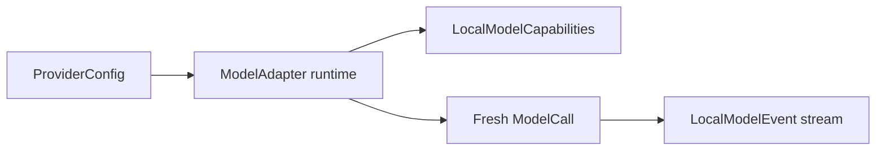

A future Freeflow adapter should be able to say:

```text
I am provider "mlx-local".
I speak Chat Completions.
I support streaming text.
I may support tool calling only for models/tokenizers that expose tool-call markers.
I do not support first-party reasoning summaries.
My context window is user-configured or discovered.
```

### Model Client And Turn Session

Codex splits the model client into two lifetimes.

`ModelClient` is session-scoped.

It owns stable state:

- auth manager;
- thread id;
- provider info;
- session source;
- verbosity config;
- request compression setting;
- telemetry flags;
- transport fallback state;
- cached WebSocket session.

`ModelClientSession` is turn-scoped.

It owns state that must not leak between turns:

- last request;
- last response;
- sticky routing token;
- WebSocket connection for the current turn;
- per-turn transport behavior.

The source comments explicitly warn that a fresh `ModelClientSession` should be created for each Codex turn because reusing it across turns can replay the previous turn's sticky routing token.

Freeflow should borrow the lifetime split, but with fewer moving parts:

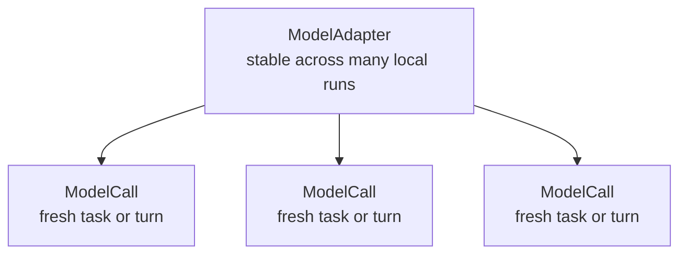

For MLX:

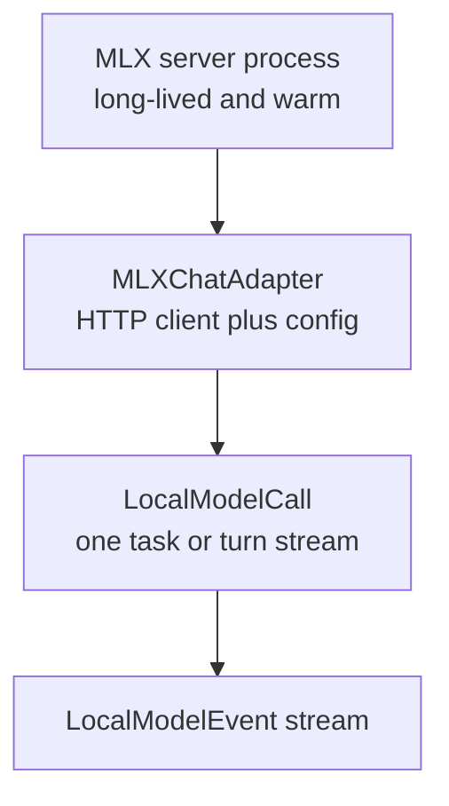

### Prompt Object

Codex's `Prompt` contains:

- input history;
- model-visible tools;
- parallel tool call setting;
- base instructions;
- optional personality;
- optional output schema;
- strict schema flag.

That is the right shape for Freeflow too, but smaller.

Suggested first Freeflow prompt envelope:

```text
LocalPrompt:
  instructions: string
  messages: list[role/content]
  tools: list[ToolSpec]
  tool_choice: auto | none
  output_schema: optional JSON schema
  max_output_tokens: int
  temperature: float
  stop: list[string]
```

The prompt should not contain:

- raw repo-wide context by default;
- full orchestrator transcript by default;
- every available tool by default;
- hidden cloud model reasoning;
- unrelated Freeflow docs.

Small local models should receive a small, shaped task packet.

### Request Builder

Codex builds a Responses request from:

- prompt instructions;
- formatted input;
- serialized tools;
- model reasoning settings;
- verbosity settings;
- output schema settings;
- service tier;
- prompt cache key;
- client metadata.

The request builder checks model metadata before enabling behavior.

For example:

- reasoning is only attached if the model supports reasoning summaries;
- verbosity is only attached if the model supports verbosity;
- parallel tool calls are disabled if the model is in Responses Lite mode;
- service tier is filtered through model-supported tiers.

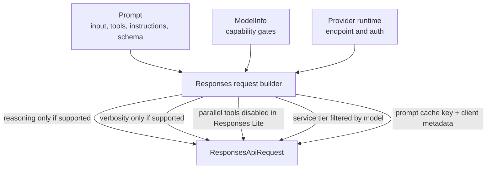

Freeflow should do the same kind of capability check:

```text
If the local model profile does not support tool calling,
do not expose tool specs directly.

If it does not support structured output,
ask for plain JSON and validate externally.

If it has a small context window,
refuse oversized task packets before calling the model.
```

### Stream Normalization

Codex's provider stream becomes a `ResponseEvent` stream.

The normalized events include:

- created;
- output item added;
- output item done;
- text delta;
- tool-call input delta;
- reasoning summary delta;
- reasoning content delta;
- reasoning summary part added;
- completed;
- rate limits;
- model ETag;
- server-reported model;
- model verification metadata;
- moderation metadata;
- server reasoning-included metadata.

This is one of the biggest design lessons.

The turn loop should not parse raw provider-specific JSON.

Instead:

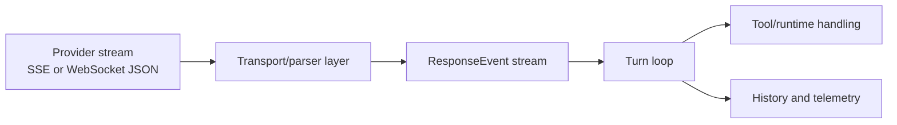

For Freeflow:

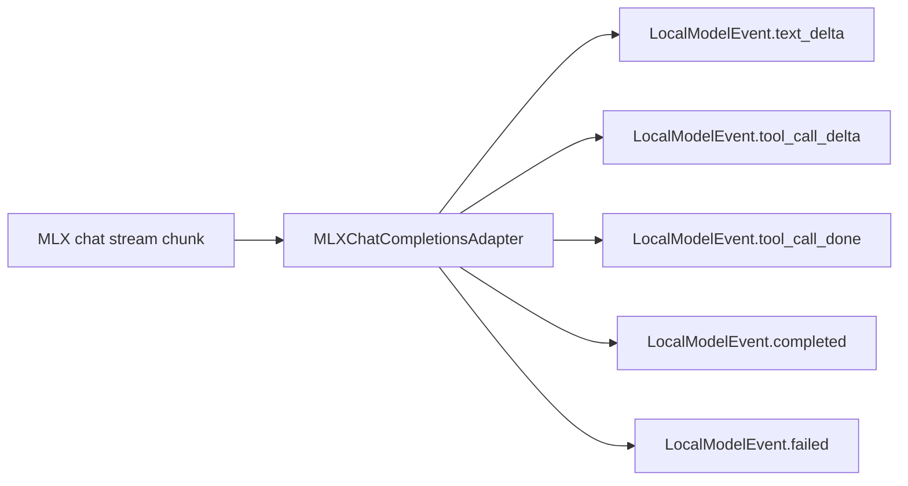

The harness should have one internal event vocabulary even if providers differ.

## Model Metadata

Codex uses model metadata as a control surface.

`ModelInfo` includes:

- slug;
- display name;
- default reasoning effort;
- supported reasoning levels;
- shell tool type;
- visibility;
- service tiers;
- base instructions;
- model messages;
- reasoning summary support;
- verbosity support;
- apply patch tool type;
- web search tool type;
- truncation policy;
- parallel tool call support;
- image detail support;
- context window;
- max context window;
- auto-compact token limit;
- effective context window percent;
- supported tools;
- input modalities;
- search support;
- Responses Lite flag;
- tool mode;
- multi-agent version.

This is the hidden part of "running a model."

If the harness does not know what the model can do, it will either:

- underuse the model;
- overfeed the model;
- expose tools the model cannot call reliably;
- trust malformed output;
- exceed context;
- blame the model for harness mistakes.

For Freeflow local models, we need a smaller but explicit profile:

```text
LocalModelCapabilities:
  context_window_tokens: int
  safe_input_tokens: int
  max_output_tokens_default: int
  supports_streaming: bool
  supports_tool_calling: bool
  supports_parallel_tool_calls: bool
  supports_json_schema: bool
  supports_system_messages: bool
  supports_reasoning_summary: bool
  preferred_prompt_style: chat | completion
  max_tool_calls_per_turn: int
  recommended_task_types: list[string]
```

The most important rule:

```text
Do not guess local model context from a cloud-model fallback.
```

Codex has a fallback model metadata path for unknown slugs. That fallback is useful in Codex, but it would be risky for Freeflow local delegation because laptop-local models can have smaller practical context windows and weaker tool-call reliability.

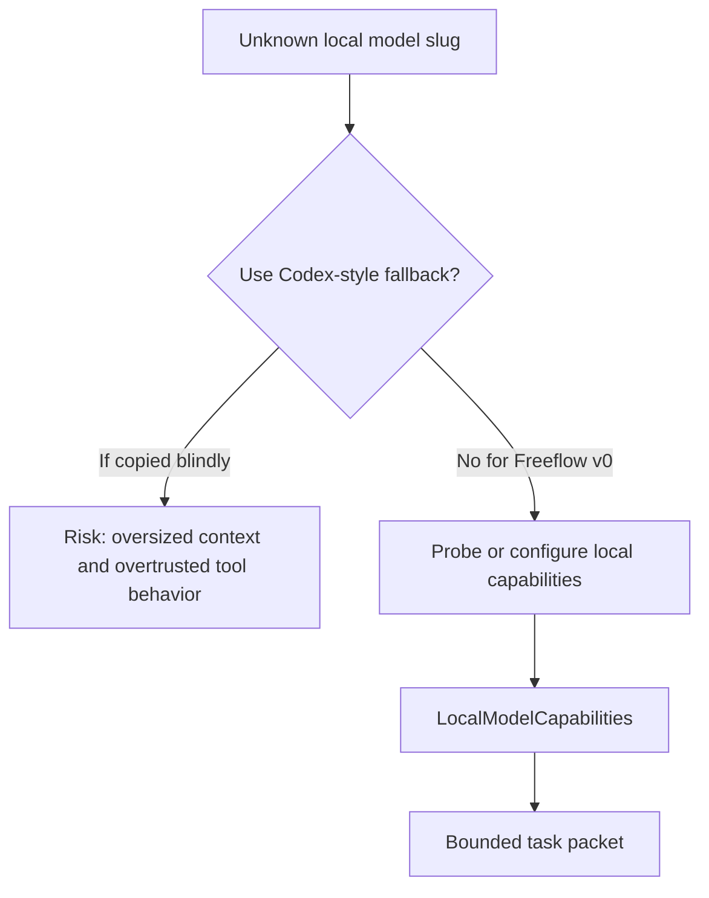

## Codex Local Provider Path

In the studied Codex snapshot, built-in providers include:

- `openai`;
- `amazon-bedrock`;
- `ollama`;
- `lmstudio`.

The OSS providers are OpenAI-compatible provider definitions with:

- local base URL;
- no API key;
- `wire_api = responses`;
- no WebSocket support.

Codex also has helper packages for Ollama and LM Studio.

Those helpers:

- probe whether the local server is running;
- list local models;
- pull or download a default OSS model when appropriate;
- check that Ollama is new enough for the Responses API.

But these helpers are setup/probe helpers, not the core agent runtime.

The runtime still goes through:

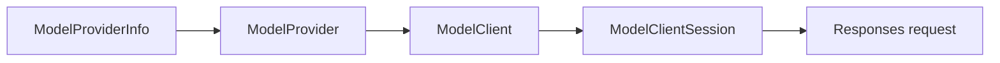

Freeflow should preserve that distinction:

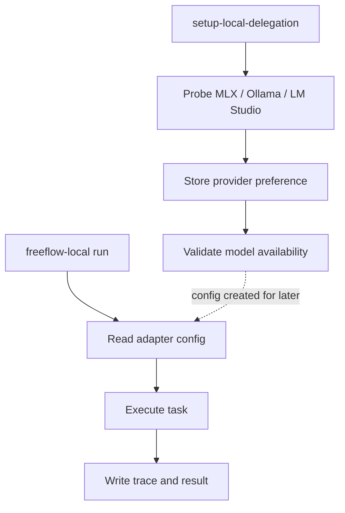

Setup should not be tangled with each delegated task.

## MLX-Focused Finding

The user expects MLX to be the majority runtime because it is fast on Apple silicon.

That changes our design priority.

The first Freeflow local harness should not treat MLX as an exotic custom provider. It should treat MLX as the primary local path.

The source evidence points to two different facts that must both be held:

1. MLX-LM gives us a fast local Apple-silicon generation runtime, streaming APIs, prompt caching, and an HTTP server.
2. The `mlx_lm.server` source studied here does not expose `/v1/responses`; it exposes OpenAI-like chat/completions-style behavior.

So the design should not be:

```text
Only implement Responses API because Codex currently does that.
```

The design should be:

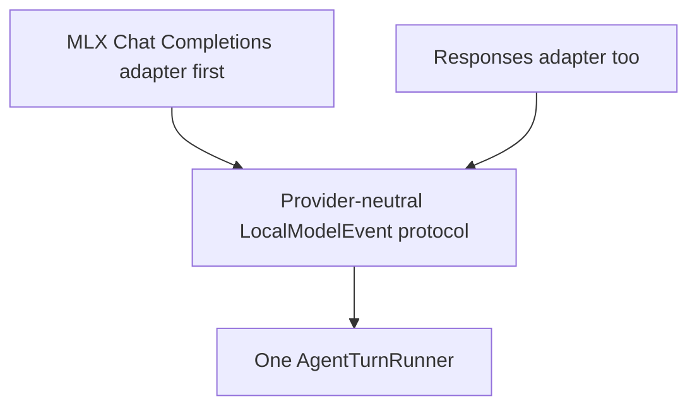

This is the important split:

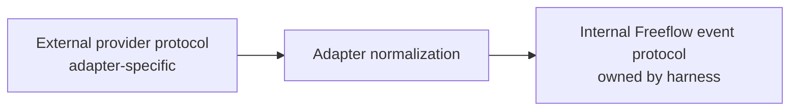

## What MLX-LM Gives Us

From the MLX-LM README and server source, the relevant capabilities are:

- Apple silicon local LLM generation.
- Hugging Face Hub integration.
- CLI generation via `mlx_lm.generate`.
- Chat REPL via `mlx_lm.chat`.
- Python API via `load`, `generate`, and `stream_generate`.
- Streaming generation through `stream_generate`.
- Rotating fixed-size KV cache via `--max-kv-size`.
- Prompt caching via `mlx_lm.cache_prompt`.
- MLX-LM server with configurable `--host` and `--port`.
- Server default host `127.0.0.1`.
- Server default port `8080`.
- Model loading through `--model`.
- Optional adapter path.
- Optional draft model for speculative decoding.
- Optional tokenizer `trust_remote_code`.
- Default sampling controls.
- Decode and prompt concurrency settings.
- Prompt cache size and prompt cache bytes settings.

The server source also warns that `mlx_lm.server` is not recommended for production and only implements basic security checks.

For Freeflow, that means:

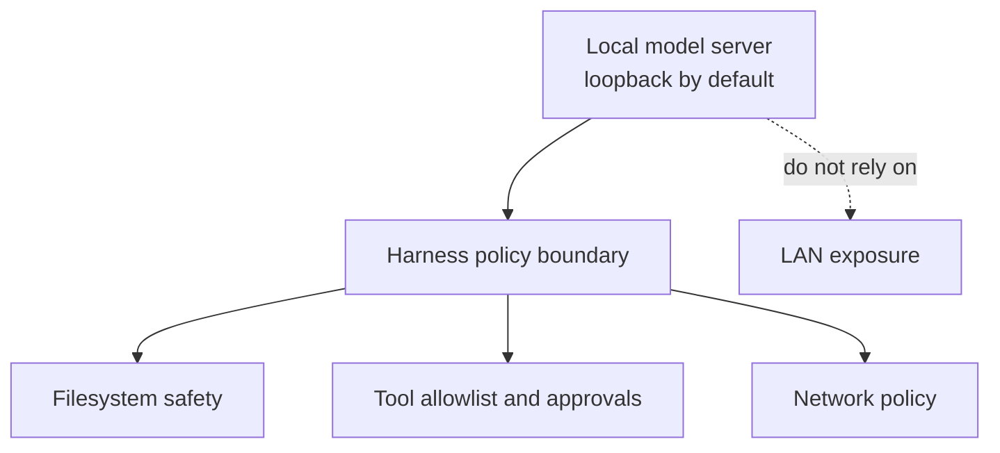

## MLX Runtime Options

### Option 1 - Call `mlx_lm.server` Over HTTP

This should be the first path.

Shape:

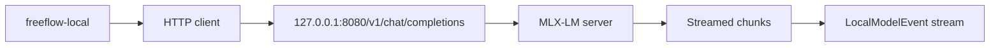

Why this is the best v0 path:

- It keeps the harness language flexible.
- It avoids embedding Python runtime complexity into the harness process.
- It lets users start/stop MLX independently.
- It matches how local model users already think: start a local server, point tools at it.
- It gives us streaming output.
- It keeps setup separate from runtime.

Risks:

- Chat Completions tool-call support depends on model/tokenizer support.
- Chat Completions is not identical to Responses.
- The server is not a security boundary.
- We may need compatibility code for exact chunk shapes.

Mitigation:

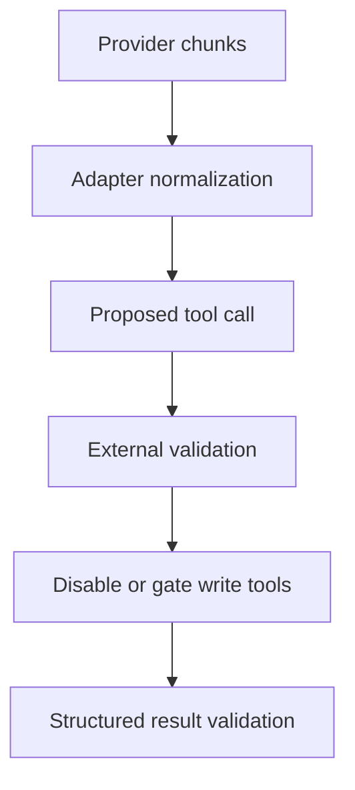

### Option 2 - Embed MLX-LM Python API

This should not be v0, but it may be a later performance path.

Shape:

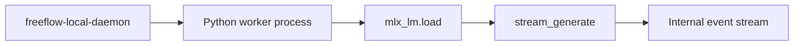

Why it could be useful:

- Avoid HTTP overhead.
- Give tighter control over prompt caching.
- Give tighter control over model lifecycle.
- Potentially support better batching and warm model residency.

Why it is not a good first step:

- It couples the harness runtime to Python packaging.
- It complicates installation.
- It complicates process supervision.
- It makes crashes and memory leaks more painful.
- It is harder to keep model-agnostic.

The practical path:

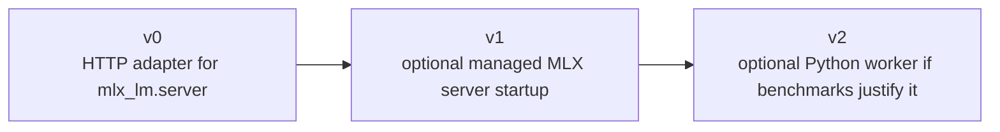

### Option 3 - Build A Responses-Compatible Shim Around MLX

This may be useful later, but not first.

Shape:

```mermaid
flowchart LR
  Shim[Freeflow shim<br/>exposes /v1/responses]
  Translate[Translate Responses request]
  MLX[MLX chat/completions or Python API]
  Stream[Responses-like stream]

  Shim --> Translate --> MLX --> Stream
```

Why it is tempting:

- It makes MLX look like Codex's preferred provider shape.
- It could reuse more Responses-oriented code.
- It could help future compatibility with tools expecting Responses.

Why it is not first:

- It adds another protocol surface before we have proven the local agent loop.
- It hides provider differences too early.
- It risks building a fake Responses API that only partially behaves like the real one.

Better v0:

```mermaid
flowchart LR
  MLX[MLX Chat Completions]
  Adapter[MLX adapter]
  Events[Freeflow LocalModelEvent]
  Loop[Agent turn loop]

  MLX --> Adapter --> Events --> Loop
```

## MLX Adapter Design

The MLX adapter should own all MLX-specific behavior.

It should know:

- base URL;
- model id;
- whether to use `/v1/chat/completions` or `/chat/completions`;
- streaming mode;
- max tokens;
- temperature;
- stop sequences;
- optional tools;
- how to parse streaming chunks;
- how to surface tool calls;
- how to detect completion;
- how to report errors.

The agent loop should only see:

```mermaid
flowchart LR
  Adapter[MLX adapter]
  Text[TextDelta]
  ToolDelta[ToolCallDelta]
  ToolDone[ToolCall]
  Completed[Completed]
  Error[Error]
  Loop[Agent loop]

  Adapter --> Text --> Loop
  Adapter --> ToolDelta --> Loop
  Adapter --> ToolDone --> Loop
  Adapter --> Completed --> Loop
  Adapter --> Error --> Loop
```

Suggested event vocabulary:

```text
LocalModelEvent:
  started(provider_id, model)
  text_delta(text)
  tool_call_delta(call_id, name, arguments_delta)
  tool_call_done(call_id, name, arguments)
  completed(finish_reason, usage)
  failed(error_kind, message)
```

This is intentionally smaller than Codex's `ResponseEvent`.

We can add more only when we need it.

## MLX And Tool Calling

MLX-LM server has source code for tool-call formatting and request tools.

But tool calling is conditional:

- The request can contain tools.
- The tokenizer may or may not have tool-calling support.
- If tools are received but the tokenizer lacks tool-call support, the server warns.
- Tool-call parsing can fail if generated tool text is malformed or truncated.

For Freeflow, the rule should be conservative:

```text
Do not assume MLX model tool calling is reliable just because the server accepts a tools field.
```

Recommended v0:

```mermaid
flowchart TD
  Default[MLX direct tool calling<br/>disabled by default]
  Proposal[Ask model for structured action proposal]
  Validate[Validate action in harness]
  Run[Run allowed tool]
  Summarize[Summarize tool result]
  Followup[Feed result back to model]

  Default --> Proposal --> Validate --> Run --> Summarize --> Followup
```

This is slower than perfect native tool calling, but safer and more reliable for small models.

Later, if a selected model/tokenizer proves reliable:

```text
supports_tool_calling = true
max_tool_calls_per_turn = 3
supports_parallel_tool_calls = false
```

Parallel tool calls should remain off for MLX until benchmark evidence says otherwise.

## MLX And Speed

The harness can easily destroy MLX's speed if it adds too much ceremony.

Speed risks:

- starting a model process per task;
- sending huge context packets;
- exposing too many tools;
- forcing many model-tool-model loops;
- asking for long explanations;
- using JSON schemas the local model cannot follow;
- reading too many files before calling the model;
- letting multiple local agents compete for memory.

Speed-preserving choices:

- Keep the MLX server warm.
- Reuse the same local server across delegated tasks.
- Keep local task envelopes small.
- Use narrow output schemas.
- Cap output tokens aggressively.
- Cap tool calls.
- Disable local subagent nesting.
- Prefer one local model call plus optional one tool round.
- Let the frontier orchestrator do final judgment.

Suggested defaults:

```text
max_input_tokens: 6000 to 12000 depending on model
max_output_tokens: 800 to 1600
max_tool_calls: 0 to 3
max_turns: 1 to 3
temperature: 0.0 or low
parallel_local_agents: 1
```

For review/helper tasks, one local pass is often enough:

```mermaid
sequenceDiagram
  participant F as Frontier model
  participant L as MLX local agent
  participant T as Narrow tools

  F->>L: bounded question + task packet
  L->>T: optional narrow read/search
  T-->>L: selected evidence
  L-->>F: structured opinion + uncertainty
  F->>F: verify or reject
```

## MLX And Context

MLX-LM supports long-prompt tools such as rotating KV cache and prompt caching.

That is useful, but it does not mean we should feed the local model the entire cloud-agent transcript.

For local delegation, the better pattern is:

```text
Task packet:
  objective
  relevant files/snippets
  constraints
  allowed tools
  expected output schema
  known uncertainties
```

Avoid:

```text
full repo context
full chat transcript
all prior research artifacts
all skills
all plugin docs
all tool docs
```

```mermaid
flowchart LR
  Full[Full frontier transcript<br/>too large and noisy]
  Packet[Small LocalTaskPacket<br/>objective, evidence, constraints]
  Local[Local MLX model]
  Trace[Full trace kept outside prompt]
  Frontier[Frontier orchestrator]

  Full -. do not send wholesale .-> Local
  Packet --> Local
  Full --> Trace --> Frontier
  Local -->|structured answer + evidence| Frontier
```

Prompt caching may become valuable later for repeated local tasks over the same stable context, for example:

- current repo conventions;
- stable task instructions;
- local harness policy;
- skill instructions;
- project glossary.

But v0 should be simple:

```text
Small explicit task packet first.
Prompt caching after benchmark evidence.
```

## Suggested First Adapter Contract

The local harness should expose one model adapter interface.

Beginner-friendly pseudocode:

```python
class ModelAdapter:
    def capabilities(self) -> LocalModelCapabilities:
        ...

    async def generate_stream(self, prompt: LocalPrompt) -> AsyncIterator[LocalModelEvent]:
        ...
```

MLX implementation:

```python
class MLXChatCompletionsAdapter(ModelAdapter):
    def __init__(self, base_url, model, timeout):
        self.base_url = base_url
        self.model = model
        self.timeout = timeout

    async def generate_stream(self, prompt):
        request = to_chat_completions_request(prompt)
        async for chunk in stream_http(self.base_url, request):
            yield from parse_mlx_chat_chunk(chunk)
```

Responses implementation:

```python
class OpenAIResponsesAdapter(ModelAdapter):
    async def generate_stream(self, prompt):
        request = to_responses_request(prompt)
        async for event in stream_responses(request):
            yield from parse_responses_event(event)
```

The turn loop should not care which adapter was used:

```python
async for event in adapter.generate_stream(prompt):
    if event.type == "text_delta":
        transcript.append_text(event.text)
    elif event.type == "tool_call_done":
        tool_result = await tool_router.run(event.tool_call)
        history.add_tool_result(tool_result)
    elif event.type == "completed":
        break
```

The relationship is:

```mermaid
classDiagram
  class ModelAdapter {
    capabilities() LocalModelCapabilities
    generate_stream(LocalPrompt) LocalModelEventStream
  }

  class MLXChatCompletionsAdapter {
    base_url
    model
    timeout
    generate_stream(LocalPrompt)
  }

  class OpenAIResponsesAdapter {
    generate_stream(LocalPrompt)
  }

  class AgentTurnRunner {
    run(LocalTaskPacket) LocalAgentResult
  }

  ModelAdapter <|.. MLXChatCompletionsAdapter
  ModelAdapter <|.. OpenAIResponsesAdapter
  AgentTurnRunner --> ModelAdapter
```

## Suggested First MLX Configuration

Use a compact local provider config.

Example:

```toml
[local_model]
default_provider = "mlx"

[local_model.providers.mlx]
kind = "openai_chat_completions"
base_url = "http://127.0.0.1:8080/v1"
model = "mlx-community/Llama-3.2-3B-Instruct-4bit"
stream = true
timeout_ms = 60000

[local_model.providers.mlx.capabilities]
context_window_tokens = 8192
safe_input_tokens = 6000
max_output_tokens_default = 1200
supports_streaming = true
supports_tool_calling = false
supports_parallel_tool_calls = false
supports_json_schema = false
supports_system_messages = true
supports_reasoning_summary = false
preferred_prompt_style = "chat"
max_tool_calls_per_turn = 1
```

The default model above is only an example from MLX-LM documentation.

Freeflow setup should discover or ask for the user's actual model, especially because the user may run Gemma, Qwen, Llama, Mistral, or another MLX-compatible model.

## Suggested Setup Flow For MLX

The setup flow should be optional.

It should not run during normal `setup-freeflow` unless the user opts into local delegation.

Suggested flow:

```mermaid
flowchart TD
  Setup[setup-local-delegation]
  OptIn{User opts into local model support?}
  Probe[Probe 127.0.0.1:8080]
  Running{MLX server running?}
  Models[Fetch /v1/models or /models]
  Select[Ask/select model if multiple]
  Save[Save provider config]
  StartHint[Show mlx_lm.server start command]
  Desired[Optionally record desired config]
  Smoke[Smoke test<br/>small prompt + streaming + JSON-ish validation]
  Write[Write local harness config]

  Setup --> OptIn
  OptIn -->|No| Write
  OptIn -->|Yes| Probe --> Running
  Running -->|Yes| Models --> Select --> Save --> Smoke --> Write
  Running -->|No| StartHint --> Desired --> Write
```

The harness should support manually configured MLX too:

```text
freeflow-local run --provider mlx --model <model-id>
```

## What Freeflow Should Borrow

Borrow from Codex:

- Provider config is data.
- Runtime adapter is code.
- Model metadata gates features.
- A turn-scoped model call/session should be fresh.
- The turn loop should consume normalized events, not raw provider JSON.
- Setup/probing helpers should be separate from runtime execution.
- Unknown model metadata should warn.
- Local provider defaults are convenience, not truth.
- Tool visibility should depend on model capability.
- Parallel tool calls should be capability-gated.
- Streaming should be the normal path.

Borrow from MLX-LM:

- Treat MLX as a warm local runtime.
- Use streaming.
- Keep model server bound to loopback.
- Use prompt caching later for repeated stable prefixes.
- Keep an eye on memory and large-model fit.
- Respect tokenizer/model-specific tool-calling limits.

## What Not To Copy Yet

Do not copy from Codex yet:

- first-party OpenAI auth complexity;
- ChatGPT account state;
- AWS Bedrock provider handling;
- WebSocket sticky-routing complexity;
- model ETag refresh machinery;
- remote model catalog caching;
- fallback context window assumptions;
- service tier logic;
- attestation headers;
- full telemetry surface.

Do not copy from MLX-LM as harness policy:

- relying on model server security;
- trusting remote tokenizer code by default;
- exposing the server beyond loopback;
- assuming tool calling works for every model;
- assuming long-prompt support means full-transcript delegation is safe;
- starting the model server per task.

## Turn Loop Integration

Pass 5 depends on the Pass 1 and Pass 2 turn-loop findings.

The adapter boundary sits inside the sampling request, not outside the agent loop:

```mermaid
sequenceDiagram
  participant RunTurn as run_turn
  participant Sampling as run_sampling_request
  participant ClientSession as ModelClientSession
  participant Transport as Responses transport
  participant Events as ResponseEvent stream
  participant Tools as Tool runtime
  participant History as History and telemetry

  RunTurn->>RunTurn: build/record context, hooks, pending input
  RunTurn->>Sampling: prompt input + turn metadata
  Sampling->>Sampling: build ToolRouter + Prompt
  Sampling->>ClientSession: stream(prompt, ModelInfo, metadata)
  ClientSession->>Transport: WebSocket if enabled, else HTTP
  Transport-->>Events: normalized ResponseEvent values
  Events-->>Sampling: item deltas, done items, metadata, completed
  Sampling->>Tools: start valid tool futures from completed tool-call items
  Sampling->>History: record non-tool items, usage, rate limits, ETag
  Sampling->>Sampling: wait for response.completed, then drain in-flight tools
  Sampling-->>RunTurn: needs_follow_up + last assistant message
```

Source-backed details from current Codex:

- `run_turn` creates or receives one `ModelClientSession` for the whole turn.
- That session is reused across sampling retries and follow-up requests within the same turn, but should not be reused across turns because it carries sticky routing and WebSocket state.
- `run_sampling_request` builds the tool router and prompt for a sampling request.
- `try_run_sampling_request` calls `client_session.stream(...)` with `Prompt`, `ModelInfo`, telemetry, reasoning settings, service tier, and Responses metadata.
- `ModelClientSession.stream` chooses Responses-over-WebSocket when the provider supports it and the session has not fallen back, otherwise it uses HTTP Responses.
- The stream parser maps raw SSE/WebSocket provider data into `ResponseEvent`.
- The turn loop handles `ResponseEvent`, not provider JSON. It updates UI events, records history, starts tool futures, tracks rate limits, refreshes model catalog on ETag, warns on server model mismatch, records token usage, and checks whether `end_turn` requires follow-up.
- Tool execution may start while model streaming is still active after a completed tool-call item arrives, but Codex drains the in-flight tool futures after `response.completed` before returning the sampling result.

What Freeflow should borrow:

```mermaid
flowchart TD
  Turn[Local agent turn]
  Packet[Build small task packet]
  Prompt[Build LocalPrompt]
  Adapter[ModelAdapter.generate_stream]
  Events[LocalModelEvent stream]
  ToolGate[Validate or gate tool/action proposal]
  Followup{Needs follow-up?}
  Result[Structured LocalAgentResult]

  Turn --> Packet --> Prompt --> Adapter --> Events
  Events --> ToolGate --> Followup
  Followup -->|Yes| Prompt
  Followup -->|No| Result
```

What Freeflow should not borrow yet:

- first-party WebSocket sticky routing;
- server model mismatch warnings;
- remote model catalog ETag refresh;
- full token telemetry;
- ChatGPT account-state coupling.

## Suggested First Local Model Result

The local agent should always return structured output.

Example:

```json
{
  "status": "completed",
  "task_name": "review-routing-doc",
  "answer": "The routing rule is mostly consistent, but the setup flow is underspecified.",
  "evidence": [
    {
      "path": "docs/designs/local-delegation-harness-design.md",
      "note": "Mentions optional local setup but not model capability probing."
    }
  ],
  "confidence": "medium",
  "uncertainty": [
    "I did not inspect runtime skill files."
  ],
  "needs_frontier_review": true
}
```

The frontier orchestrator should treat this as evidence, not authority.

## Beginner-Friendly Pseudocode

This is the whole idea in plain code-like form:

```python
async def run_local_agent(task, config):
    adapter = create_model_adapter(config.provider)
    capabilities = adapter.capabilities()

    task_packet = build_small_task_packet(task, capabilities)
    prompt = build_prompt(task_packet, capabilities)
    local_history = []
    tool_calls_used = 0

    for turn in range(config.max_turns):
        model_call = adapter.generate_stream(prompt)
        assistant_text = []
        pending_tool_results = []
        completed = False

        async for event in model_call:
            if event.type == "text_delta":
                assistant_text.append(event.text)

            elif event.type == "tool_call_done":
                if not capabilities.supports_tool_calling:
                    pending_tool_results.append(reject_tool_call("tool calling disabled"))
                    continue

                if tool_calls_used >= capabilities.max_tool_calls_per_turn:
                    pending_tool_results.append(reject_tool_call("tool limit reached"))
                    continue

                tool_call = validate_tool_call(event.tool_call, config.policy)
                pending_tool_results.append(await run_allowed_tool(tool_call))
                tool_calls_used += 1

            elif event.type == "failed":
                return failed_result(event.message)

            elif event.type == "completed":
                completed = True
                break

        if not completed:
            return failed_result("model stream ended before completion")

        local_history.append({"assistant": "".join(assistant_text)})

        if pending_tool_results:
            prompt = build_followup_prompt(task_packet, local_history, pending_tool_results)
            continue

        return validate_final_result("".join(assistant_text))

    return failed_result("local agent reached max_turns")
```

Notice what is not here:

- no cloud-specific provider logic in the turn loop;
- no MLX-specific parsing in the turn loop;
- no raw filesystem access from the model;
- no blind trust in tool-call JSON;
- no unlimited loops.

## Open Questions

1. Which MLX server path will Freeflow officially target first: `mlx_lm.server`, LM Studio's MLX backend if applicable, or a custom Freeflow-managed MLX process?
2. Should v0 support Chat Completions only for MLX, or should we also build a small Responses adapter from day one?
3. What exact local model should be used in the first benchmark: Gemma 12B, Qwen coder model, Llama, Mistral, or the MLX-LM default?
4. What is the minimum local model capability profile required before Freeflow allows direct tool calling?
5. Should setup store model capabilities manually, infer them from model metadata, or run small capability probes?
6. Should prompt caching be part of v0 or a later optimization?
7. Should local MLX tasks run one at a time by default to avoid memory contention?

## Next Research Passes

The canonical pass index and roadmap now live in:

```text
docs/codex-cli-agent-harness/README.md
```

Completed after this artifact:

- Pass 6: memory and context.
- Pass 7: config and extensibility.
- Pass 8: agent harness comparisons.

Remaining work is synthesis: turn these research passes into the Freeflow local harness design spec and then a small benchmark/prototype plan.

## Source Evidence Appendix

### Original Codex Source Snapshot

```text
repo: openai/codex
commit: b65fe3d8976d6fcc44ee6c6cf988654af5fc4d2d
short: b65fe3d
commit date: 2026-06-12
commit title: fix: serialize auth environment tests (#27879)
local path: /private/tmp/openai-codex-study-pass0
```

### Current Codex Source Audit

```text
repo: openai/codex
commit: 0fed4497f50ad5f0b2f7972a1bfd14c5a09a85c5
short: 0fed449
commit date: 2026-06-13
commit title: [codex] Carry exec-server cwd as PathUri (#28032)
local path: /private/tmp/openai-codex-study-current
```

Most relevant Codex files:

```text
codex-rs/model-provider-info/src/lib.rs
  Provider config data, built-in providers, OSS provider defaults, wire API choice.

codex-rs/model-provider/src/provider.rs
  Runtime provider abstraction and model manager creation.

codex-rs/model-provider/src/auth.rs
  Provider auth resolution, unauthenticated local providers, bearer auth.

codex-rs/model-provider/src/models_endpoint.rs
  OpenAI-compatible /models endpoint client and timeout behavior.

codex-rs/core/src/client.rs
  ModelClient, ModelClientSession, Responses request construction, HTTP/WebSocket streaming.

codex-rs/core/src/client_common.rs
  Prompt and ResponseStream definitions.

codex-rs/codex-api/src/common.rs
  ResponseEvent vocabulary consumed by the turn loop.

codex-rs/codex-api/src/sse/responses.rs
  SSE stream parsing into ResponseEvent, including errors and metadata.

codex-rs/codex-api/src/endpoint/responses_websocket.rs
  Responses WebSocket transport, fallback-relevant errors, and stream metadata.

codex-rs/core/src/session/turn.rs
  run_turn, run_sampling_request, try_run_sampling_request, and ResponseEvent handling.

codex-rs/protocol/src/openai_models.rs
  ModelInfo, ModelPreset, reasoning effort, context windows, feature flags.

codex-rs/models-manager/src/manager.rs
  Model catalog manager, refresh strategy, model lookup, fallback behavior.

codex-rs/models-manager/src/model_info.rs
  Fallback model metadata and config overrides.

codex-rs/ollama/src/lib.rs
  Ollama setup helper and Responses API version check.

codex-rs/ollama/src/client.rs
  Ollama probe, model list, pull, version checks.

codex-rs/lmstudio/src/client.rs
  LM Studio probe, model list, model loading/download helper.

codex-rs/utils/oss/src/lib.rs
  OSS default model/provider utility and setup dispatch.

codex-rs/tui/src/oss_selection.rs
  Local OSS provider selection and port probing.

codex-rs/model-provider-info/src/model_provider_info_tests.rs
  Tests for provider config, chat wire API removal, built-ins, and AWS constraints.

codex-rs/core/tests/suite/responses_lite.rs
  Tests for Responses Lite request behavior and capability-gated tool surfaces.

codex-rs/core/tests/suite/client_websockets.rs
  Tests for WebSocket request behavior, Responses Lite metadata, and fallback-adjacent state.

codex-rs/core/tests/suite/models_etag_responses.rs
  Tests for model ETag refresh after Responses stream metadata.

codex-rs/models-manager/src/model_info_tests.rs
codex-rs/models-manager/src/manager_tests.rs
  Tests for fallback model metadata, custom catalog behavior, and model-info resolution.
```

Key source-backed Codex findings:

- `WireApi` only supports `Responses`; `chat` is rejected with a removal error.
- The removed `ollama-chat` provider has a specific migration error toward `ollama`.
- Built-in local provider IDs include `ollama` and `lmstudio`.
- OSS providers default to local OpenAI-compatible base URLs and do not require OpenAI auth.
- OSS providers set `supports_websockets = false`.
- `ModelClient` is session-scoped.
- `ModelClientSession` is turn-scoped and carries sticky-routing plus WebSocket state. A fresh session is required for each Codex turn.
- `ModelClientSession.stream` prefers Responses WebSocket when supported and healthy, then falls back to HTTP Responses.
- Codex builds a Responses request from `Prompt` plus `ModelInfo`.
- `Prompt` contains input items, tool specs, parallel tool setting, base instructions, optional personality, and optional output schema.
- `build_responses_request` attaches reasoning only when the model supports reasoning summaries, attaches verbosity only when the model supports verbosity, disables parallel tool calls for Responses Lite, filters service tier through model metadata, and adds prompt cache key plus client metadata.
- `ResponseEvent` currently includes created, output item added/done, text delta, tool-call input delta, reasoning deltas, completed, server model, model verifications, moderation metadata, server reasoning inclusion, rate limits, and models ETag.
- `try_run_sampling_request` consumes `ResponseEvent`, not raw provider JSON.
- Completed tool-call items can start tool futures while model streaming continues; Codex drains in-flight tools after `response.completed`.
- Provider capabilities and `ModelInfo` are separate. Provider capabilities are provider-owned upper bounds; `ModelInfo` gates model-level behavior.
- `ModelInfo` gates reasoning summaries, verbosity, context window, tool mode, parallel tool calls, and other capabilities.
- Unknown model metadata falls back and triggers a warning.

### MLX-LM Primary Sources

External sources fetched 2026-06-12 and spot-checked upstream on 2026-06-14:

- `https://github.com/ml-explore/mlx-lm`
- `https://raw.githubusercontent.com/ml-explore/mlx-lm/main/README.md`
- `https://raw.githubusercontent.com/ml-explore/mlx-lm/main/mlx_lm/server.py`

Key source-backed MLX-LM findings:

- MLX-LM is a Python package for generating text and fine-tuning LLMs on Apple silicon with MLX.
- MLX-LM supports CLI generation through `mlx_lm.generate`.
- MLX-LM supports chat through `mlx_lm.chat`.
- MLX-LM exposes a Python API with `load`, `generate`, and `stream_generate`.
- MLX-LM documents streaming generation through `stream_generate`.
- MLX-LM documents rotating KV cache through `--max-kv-size`.
- MLX-LM documents prompt caching through `mlx_lm.cache_prompt`.
- MLX-LM supports many Hugging Face models, including MLX Community models.
- Some tokenizers may require `trust_remote_code`.
- Large models may be slow if they do not fit comfortably in memory; MLX-LM can wire memory on macOS 15 or newer.
- `mlx_lm.server` has default host `127.0.0.1`.
- `mlx_lm.server` has default port `8080`.
- `mlx_lm.server` source includes tool-call formatting and tool parsing paths.
- `mlx_lm.server` warns that it is not recommended for production and only implements basic security checks.
- In the inspected source, no `/v1/responses` endpoint was found.

## Working Interpretation

The local harness should be MLX-first in practice and model-agnostic in architecture.

That means:

```mermaid
flowchart TD
  MLX[Optimize first runtime path for mlx_lm.server]
  Decouple[Do not couple the agent loop to MLX]
  Normalize[Normalize MLX Chat Completions into Freeflow events]
  Capabilities[Use model capability profiles]
  Verify[Frontier orchestrator verifies local outputs]

  MLX --> Decouple --> Normalize --> Capabilities --> Verify
```

This is the clean compromise:

```mermaid
flowchart LR
  Speed[Speed priority<br/>MLX first]
  Portability[Design priority<br/>provider-agnostic harness]
  Harness[Freeflow local harness]

  Speed --> Harness
  Portability --> Harness
```
