# Codex CLI Agent Harness Study - Pass 6 Memory And Context

> **Doc ID:** RESEARCH-2026-06-12-codex-cli-agent-harness-pass-6
> **Date:** 2026-06-12
> **Owner:** Hassan Mohiddin
> **Type:** Research
> **Status:** Draft
> **Source:** `openai/codex` source snapshot `0fed4497f50ad5f0b2f7972a1bfd14c5a09a85c5`; originally drafted from `b65fe3d8976d6fcc44ee6c6cf988654af5fc4d2d`; Pass 0 repo map; Pass 1 turn-loop artifact; Pass 2 tool-system artifact; Pass 3 sandboxing-and-permissions artifact; Pass 4 subagents-and-delegation artifact; Pass 5 model-provider/runtime-adapter artifact.

## Purpose

Preserve the Pass 6 research into how Codex manages model-visible context, conversation history, instruction loading, token accounting, compaction, and the memory subsystem.

This artifact is intentionally split:

```text
Pass 6A - Context Architecture
  Captured in this document.

Pass 6B - Full Memory Architecture
  Captured in this document.
```

This matters because context and memory are related but not the same thing. Context is what gets assembled for the next model call. Memory is a background and retrieval system that decides what durable prior-run knowledge should be available to future agents.

This is research memory, not an implementation plan. It should inform Freeflow local delegation design, but it does not define shipped Freeflow behavior.

## How To Read This

If this is your first pass, read only:

- `If You Only Read 10 Minutes`
- `Pass Scope Boundary`
- `Core Idea`
- `Turn-Loop Context Checkpoint`
- `Tiny Diagram`
- `Diagram Map`
- `What Freeflow Should Borrow`

If you are trying to understand Codex's context architecture, read:

- `Context Is Not One Thing`
- `TurnContext`
- `SessionState And ContextManager`
- `Initial Context`
- `Extension-Aware Context`
- `Steady-State Context Diffs`
- `Prompt Construction`
- `Token Accounting And Context Windows`
- `Compaction`
- `AGENTS.md Loading`

If you are trying to understand Codex's memory architecture, read:

- `Memory Surface Area`
- `What Codex Means By Memory`
- `Memory Config And Feature Gates`
- `Memory Read Path`
- `Dedicated Memory Tools`
- `Memory Write Pipeline`
- `Phase 1 Rollout Extraction`
- `Phase 2 Global Consolidation`
- `State DB Coordination`
- `Thread Memory Mode And Pollution`

If you are preparing the next research pass, read:

- `What Is Still Missing`
- `Source Evidence Appendix`

## Diagram Map

Use the diagrams as checkpoints, not as replacements for the text.

| If you are trying to understand... | Start with... |
| --- | --- |
| The whole Codex context loop | `Tiny Diagram` |
| Where context enters the turn loop | `Turn-Loop Context Checkpoint` |
| Why "context" is not one transcript | `Context Is Not One Thing` |
| How raw history becomes prompt input | `History Normalization` |
| Where large tool output gets bounded | `Tool Output Truncation` |
| Why traces and prompts must be separate | `SessionState And ContextManager` |
| How Codex avoids reinjecting everything every turn | `Steady-State Context Diffs` |
| How extensions add context, tools, and token usage | `Extension-Aware Context` |
| How AGENTS.md files are discovered | `AGENTS.md Loading` |
| How context windows create pressure | `Token Accounting And Context Windows` |
| What compaction actually changes | `Compaction` |
| The whole memory subsystem shape | `Memory Surface Area` |
| How memory reaches the model | `Memory Read Path` |
| Why memory tools are typed APIs, not shell access | `Dedicated Memory Tools` |
| How memory citation affects retention | `Usage Tracking` |
| How external context disables future memory generation | `Thread Memory Mode And Pollution` |
| How a rollout becomes a stage-one memory record | `Phase 1 Rollout Extraction` |
| How old rollouts become future memory | `Memory Write Pipeline` and `Phase 2 Global Consolidation` |
| What Freeflow should copy or defer for local delegation | `What Freeflow Should Borrow` and `What Freeflow Should Not Copy Yet` |

## If You Only Read 10 Minutes

Codex does not send the whole chat transcript to the model as one blob.

It separates:

1. Base instructions.
2. Developer instructions.
3. AGENTS.md/user instructions.
4. Environment context.
5. Permission context.
6. Available skill/plugin/app context.
7. Model/provider capability context.
8. Conversation history.
9. Tool calls and tool outputs.
10. Compaction summaries.
11. Optional memory-read context and memory citations.

The central design lesson:

```text
Raw history is not the same thing as model prompt input.
```

Codex records many things into history and rollout traces. Before a model call, it prepares a cleaner prompt:

```text
recorded history
  -> truncate oversized tool outputs when they are recorded
  -> normalize call/output pairs before prompt use
  -> remove orphan outputs before prompt use
  -> strip unsupported images before prompt use
  -> combine with base instructions and tool specs
  -> send Prompt to model
```

For Freeflow local delegation, this is the key architectural lesson:

```text
Do not pass the whole frontier-agent conversation to the local model.
Build a small, explicit LocalTaskPacket.
Store the full trace separately for the frontier orchestrator to inspect.
```

The local model should receive:

- task objective
- output schema
- allowed tools
- selected instructions
- selected file snippets or diffs
- constraints
- stopping rules
- evidence requirements

The frontier orchestrator should receive:

- local answer
- confidence/uncertainty
- evidence list
- files read
- tools used
- policy denials
- trace path

That keeps the local MLX model fast while still making its output auditable.

## Pass Scope Boundary

This artifact covers both Pass 6A and Pass 6B.

Done in Pass 6A:

- Context assembly.
- `TurnContext`.
- `SessionState`.
- `ContextManager`.
- Initial context injection.
- Steady-state context diffs.
- Prompt construction.
- History normalization.
- Token accounting.
- Context windows.
- Compaction mechanics.
- AGENTS.md loading.
- Memory citation surface.
- Memory extension surface.
- Memory pipeline overview from the repo README.

Done in Pass 6B:

- Full memory read-path architecture.
- Memory read prompt injection.
- Dedicated memory tool registration and behavior.
- Local filesystem memory backend and path safety.
- Hidden memory citation parsing.
- Stage-one output usage tracking.
- Thread memory mode and pollution rules.
- Memory startup trigger.
- Phase 1 rollout extraction internals.
- Phase 2 global consolidation internals.
- Memory state DB schema and job coordination.
- Memory filesystem workspace behavior.
- Memory prompt templates.
- Consolidation subagent configuration.
- Memory-related tests and guarantees visible from the source.

So the honest current statement is:

```text
We understand Codex's context architecture well enough to design Freeflow local task packets.
We understand Codex's memory architecture well enough to decide what Freeflow should copy, simplify, or defer.
```

## Core Idea

An agent harness needs a context system because a model call is never just:

```text
user message -> model
```

A real coding agent call is closer to:

```text
session state
+ repo instructions
+ runtime environment
+ permission policy
+ selected skills
+ selected tools
+ history
+ tool results
+ model capabilities
+ token budget rules
+ current user input
-> normalized prompt
-> model
```

Codex's architecture treats this as a real runtime problem. It does not rely on the model to remember every detail forever. It stores state, injects context, diffs context changes, compacts when needed, and normalizes history before sampling.

For a small local model, this is even more important. A frontier model can survive sloppy context longer. A 12B local model running through MLX will degrade much faster if we stuff it with irrelevant transcript history.

## Turn-Loop Context Checkpoint

Pass 6 is not separate from the turn loop. It explains the context and memory machinery that Pass 1 sees while the turn loop runs.

In current source, a regular turn does this shape:

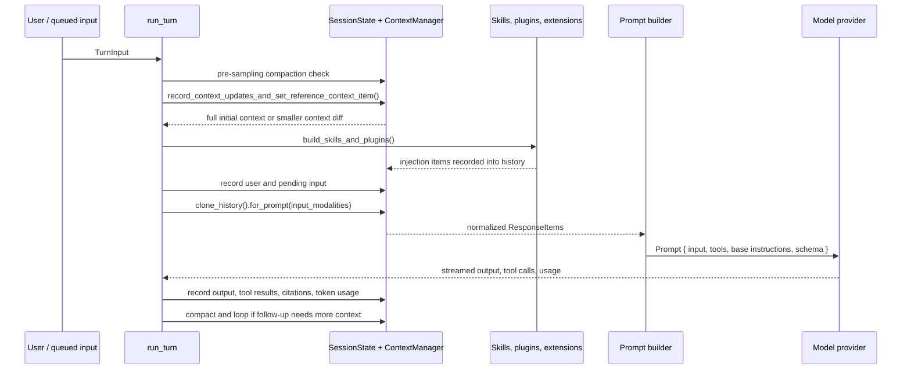

The important detail is that context is not appended only once at startup. The turn loop keeps comparing, recording, normalizing, and sometimes compacting it.

Current-source nuances from `0fed449`:

- `record_context_updates_and_set_reference_context_item()` persists one `TurnContext` rollout item per real user turn even when no model-visible context diff is emitted.
- `Prompt.output_schema_strict` is normally true, but guardian reviewer sessions disable strict output-schema validation.
- `TurnContext.cwd` still exists and is used in compatibility paths, but source marks it deprecated in favor of the selected turn environment cwd.
- `record_inter_agent_communication()` converts typed inter-agent mail to model-visible input while preserving the typed `RolloutItem::InterAgentCommunication` in rollout history.

For Freeflow local delegation, this means:

```text
The local harness should not think "prompt" first.
It should think "turn lifecycle" first:
  build context
  record trace
  normalize model input
  run model/tool loop
  record result
  verify before trusting output
```

## Tiny Diagram

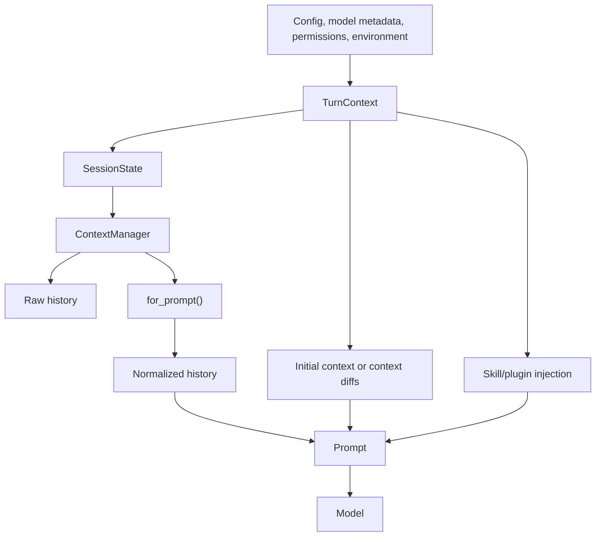

Compaction sits beside the loop:


## Glossary

`TurnContext`

The per-turn bundle of runtime facts: model, provider, context window, cwd, environments, date/timezone, permissions, approval mode, tools, features, skills, plugins, user instructions, developer instructions, output schema, and more.

`SessionState`

The mutable session state: configuration, history, token usage, rate limits, previous turn settings, active connector selection, additional context, compaction window state, and granted permissions.

`ContextManager`

The history manager. It stores `ResponseItem`s, normalizes them before prompts, estimates token usage, truncates tool output, handles rollback and history replacement, and tracks a reference context snapshot.

`ResponseItem`

The protocol-level item recorded in history: messages, assistant output, reasoning, function calls, tool outputs, shell calls, web search calls, image calls, compaction items, and related model/runtime items.

`Prompt`

The object sent to the model client. It contains normalized input history, model-visible tools, base instructions, personality, parallel-tool-call setting, and optional output schema.

`Reference Context Item`

A stored snapshot of the model-visible runtime context. Codex uses it to decide whether a later turn can emit only context diffs instead of reinjecting all initial context.

`Initial Context`

The full set of contextual messages injected when a turn has no reliable reference context baseline. It includes permissions, collaboration mode, AGENTS.md/user instructions, environment context, skills/plugins/apps, and other runtime facts.

`Context Diff`

A smaller update emitted on later turns when only some runtime facts changed.

`Compaction`

A controlled rewrite of live history into a shorter replacement history. Codex uses compaction to keep long sessions inside model context limits.

`Memory`

In Codex, memory is not the same as ordinary conversation history. It is an optional subsystem for reading/writing durable memory artifacts, tracking memory use, generating memories from prior rollouts, and citing memory usage in assistant messages.

## Context Is Not One Thing

The easiest beginner mistake is thinking "context" means one transcript.

Codex's code suggests a better mental model:

```text
Context is a layered runtime product.
```

Layers include:

- durable instructions from config and AGENTS.md
- transient runtime facts such as cwd and date
- safety facts such as permissions and approvals
- available capability facts such as skills and plugins
- model facts such as context window and supported input modalities
- conversation facts such as prior messages
- tool facts such as calls and outputs
- compaction facts such as summaries and context-window ids
- optional memory facts such as memory-read instructions and citations

Each layer has a different lifetime:

```text
base instructions         long-lived
AGENTS.md instructions    long-lived but scoped to workspace/cwd
environment context       can change by turn
permission context        can change by turn
skills/plugin context     often injected only when relevant
conversation history      grows every turn
tool outputs              can be large and need truncation
compaction summaries      replace older history
memory artifacts          cross-session, optional, and separately governed
```

The important point is not that every layer is always present. The important point is that the harness assembles a prompt from multiple sources with different lifetimes and trust levels.

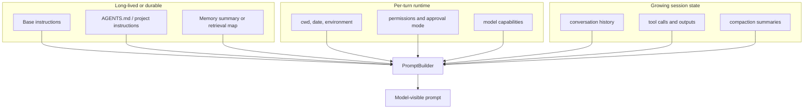

This is why Freeflow's local harness should not use a single `context: string` field.

It should use typed sections.

## TurnContext

`TurnContext` is the object that says what world the current model turn is running inside.

Important fields include:

- `config`
- `model_info`
- `provider`
- `tool_mode`
- `reasoning_effort`
- `reasoning_summary`
- `session_source`
- `parent_thread_id`
- `thread_source`
- `environments`
- `cwd`
- `current_date`
- `timezone`
- `app_server_client_name`
- `developer_instructions`
- `compact_prompt`
- `user_instructions`
- `collaboration_mode`
- `multi_agent_version`
- `personality`
- `approval_policy`
- `permission_profile`
- `shell_environment_policy`
- `windows_sandbox_level`
- `network`
- `features`
- `available_models`
- `final_output_json_schema`
- `truncation_policy`
- `dynamic_tools`
- `unified_exec_shell_mode`
- `ghost_snapshot`
- `codex_self_exe`
- `codex_linux_sandbox_exe`
- `turn_skills`
- `turn_metadata_state`
- `extension_data`
- `turn_timing_state`

That list looks intimidating, but the beginner-friendly version is:

```text
TurnContext = all the facts needed to run one model turn correctly.
```

It is not the conversation history. It is the runtime configuration and environment for the turn.

Two fields are easy to miss but important for architecture:

```text
extension_data
  Per-turn/thread storage where extensions can keep their own state.

turn_timing_state
  Runtime timing state around the turn, separate from the model-visible prompt.
```

Why this matters:

```text
Same user message + different TurnContext = different safe behavior.
```

Example:

```text
"run tests"
```

This means different things depending on:

- current cwd
- filesystem permissions
- shell
- approval policy
- network policy
- allowed tools
- model capability
- output schema
- active collaboration mode

For Freeflow:

```text
LocalTaskPacket should include a smaller equivalent of TurnContext.
```

We do not need Codex's full structure in v0, but we need the same concept.

Suggested local version:

```text
LocalTaskRuntimeContext:
  cwd
  repo_root
  current_date
  shell
  readable_roots
  writable_roots
  denied_paths
  network_mode
  allowed_tools
  max_tool_calls
  max_turns
  max_input_tokens
  max_output_tokens
  model_id
  model_context_window
  output_schema
```

## SessionState And ContextManager

`SessionState` owns the mutable session state.

Important pieces:

- `session_configuration`
- `history`
- `latest_rate_limits`
- `server_reasoning_included`
- `additional_context`
- `previous_turn_settings`
- `auto_compact_window`
- `active_connector_selection`
- `pending_session_start_sources`
- `granted_permissions_by_environment_id`
- `mcp_dependency_prompted`
- `startup_prewarm`
- `next_turn_is_first`

Those last fields are not model prompt text, but they still shape agent behavior:

```text
mcp_dependency_prompted
  Prevents repeating the same MCP dependency/setup prompt.

startup_prewarm
  Lets Codex reuse a warmed client/session path at the beginning of work.

next_turn_is_first
  Tracks first-turn behavior separately from ordinary later turns.
```

The most important field for this pass is:

```text
history: ContextManager
```

`ContextManager` is the transcript/history system.

It stores:

```text
items: Vec<ResponseItem>
history_version
token_info
reference_context_item
```

The key methods:

- `record_items`
- `for_prompt`
- `raw_items`
- `replace`
- `drop_last_n_user_turns`
- `update_token_info`
- `estimate_token_count`
- `get_total_token_usage`

The important distinction:

```text
raw_items() = what the runtime recorded
for_prompt() = what is cleaned and prepared for the next model call
```

That is one of the biggest lessons for Freeflow.

For a local harness:

```text
TraceStore = raw record
PromptBuilder = selected model input
```

Do not make these the same object.

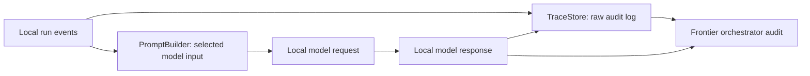

## Recording Items

When Codex records conversation items, it:

1. prepares them for history
2. stores them through `ContextManager.record_items`
3. persists them to rollout
4. sends raw response item events to clients

That means history is not only for the model. It is also for:

- replay
- resume
- audit
- UI
- tracing
- compaction
- token accounting

For Freeflow:

```text
Local runs should create trace files even if the local model sees only a small prompt.
```

Suggested trace event shape:

```text
run_created
task_packet_built
model_request_started
model_request_completed
tool_call_started
tool_call_completed
tool_call_failed
policy_denied
result_validated
run_completed
run_failed
```

This lets the frontier orchestrator verify the local agent without trusting its final answer blindly.

## History Normalization

Before sending history to the model, Codex calls:

```text
ContextManager.for_prompt(input_modalities)
```

This applies normalization:

1. Ensure every function/custom/tool-search/local-shell call has a corresponding output.
2. Remove orphan outputs.
3. Strip images when the selected model does not support image input.

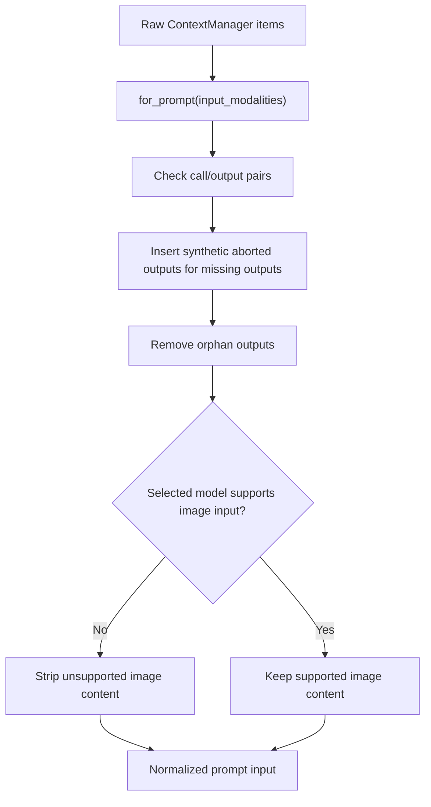

This is important because model APIs often expect strict call/output pairing.

If a tool call is missing an output, Codex inserts a synthetic output like:

```text
aborted
```

If an output exists without a matching call, Codex removes it.

Why this matters:

```text
The model should not see impossible protocol state.
```

For Freeflow:

```text
Local history must be normalized before each local model call.
```

Even if v0 uses simple JSON action proposals instead of direct tool calling, the same principle applies:

```text
Every local action proposal should have exactly one observed result or denial.
```

## Tool Output Truncation

Codex truncates function/tool outputs when recording history.

That prevents a single giant command output or file dump from poisoning the whole session.

More precisely:

```text
record_items()
  -> keep only items that belong in API conversation history
  -> process each item
  -> truncate FunctionCallOutput and CustomToolCallOutput payloads
  -> store the bounded item

for_prompt()
  -> normalize the stored history before a model call
  -> remove orphan outputs
  -> strip unsupported images
  -> preserve the call/output invariants expected by the provider
```

So normal tool-output truncation is primarily a history-recording step, not only a final prompt-build step.

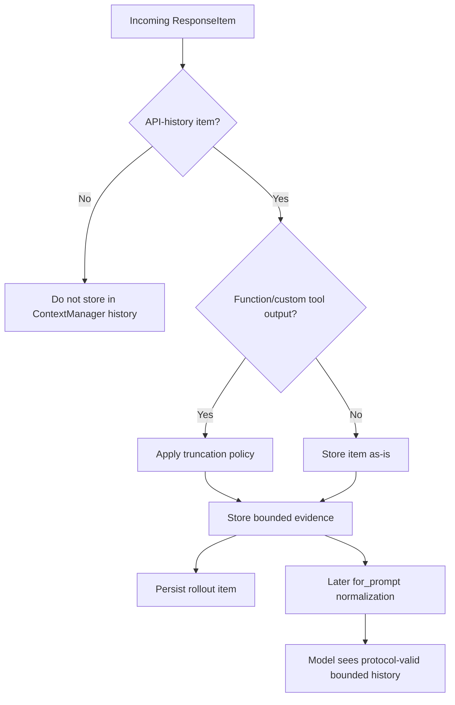

The relevant concept:

```text
Tool output is evidence, but it must be bounded evidence.
```

For local models, this is even more important.

Suggested v0 local limits:

```text
max_tool_output_chars_per_call: 12000
max_total_tool_output_chars: 50000
max_files_read: 25
max_search_matches: 50
max_turns: 3
max_tool_calls: 12
```

For MLX-first operation, the first defaults should probably be smaller:

```text
max_input_tokens: 6000 to 12000
max_output_tokens: 800 to 1600
max_turns: 1 to 3
max_tool_calls: 0 to 3
```

This keeps the local model inside the zone where it can be useful.

## Initial Context

Codex injects full initial context when there is no reliable reference context baseline.

That happens on first real turn, after some compactions, and after certain resume/rollback paths.

The initial context can include:

- model switch instructions
- permissions instructions
- developer instructions
- collaboration mode instructions
- realtime state
- personality instructions
- apps instructions
- available skills
- available plugins
- extension prompt fragments
- AGENTS.md/user instructions
- token budget context
- environment context
- multi-agent usage hints
- guardian policy prompt in special cases

The implementation builds developer sections and contextual user sections separately.

This is important:

```text
Not every context item has the same role.
```

Some things are developer-role messages. Some things are user-role contextual fragments. Some special developer messages are kept separate instead of being aggregated.

For Freeflow local harness:

```text
Separate policy/instructions from task data.
```

Suggested packet split:

```text
system_policy:
  local harness operating rules

developer_policy:
  Freeflow delegation rules
  allowed tools
  verification expectations

workspace_instructions:
  selected AGENTS.md / Freeflow skill guidance

task:
  concrete delegated task

evidence:
  files/diffs/snippets/search results

output_contract:
  schema and required uncertainty fields
```

Do not throw all of this into one unstructured prompt.

## Steady-State Context Diffs

After the first full context injection, Codex tries to emit only changes.

This is done through:

```text
record_context_updates_and_set_reference_context_item
  -> if no reference context:
       build_initial_context
     else:
       build_settings_update_items
```

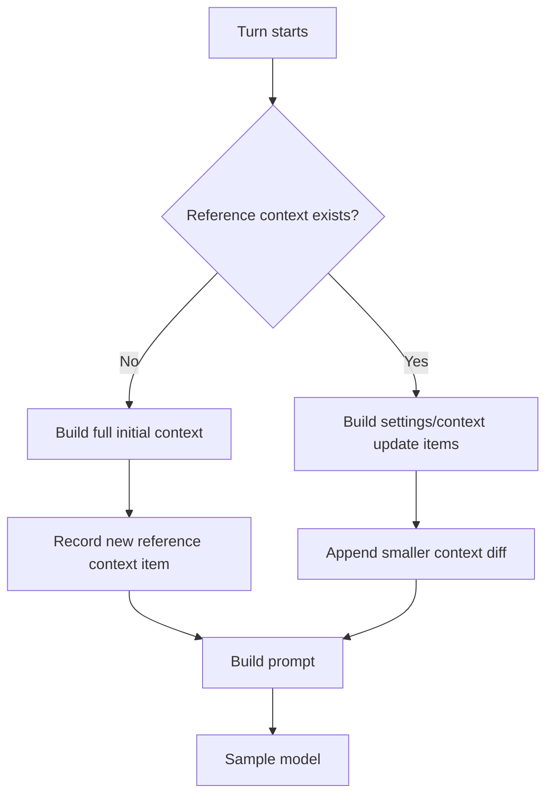

Diffable context includes:

- model switch instructions
- permissions update
- collaboration mode update
- realtime update
- personality update
- environment update

Why this exists:

```text
Repeatedly reinjecting full context wastes tokens and may confuse the model.
```

Important caveat:

The source has a TODO noting that `build_settings_update_items` does not yet cover every model-visible item emitted by `build_initial_context`.

So the principle is strong:

```text
diff context when possible
```

But the exact Codex implementation is still evolving.

For Freeflow:

```text
For v0 local delegation, avoid complex diffing.
Build each LocalTaskPacket explicitly and keep it small.
```

Later, if we run long-lived local agent sessions, we can add context diffs.

## Prompt Construction

Codex builds a `Prompt` before sampling:

```text
Prompt {
  input,
  tools,
  parallel_tool_calls,
  base_instructions,
  personality,
  output_schema,
  output_schema_strict,
}
```

This is the final model-facing object.

It combines:

- normalized prompt input from history
- model-visible tool specs
- base instructions from session configuration
- model capability settings
- output schema if present

This means:

```text
PromptBuilder is a real architectural component.
```

For Freeflow:

```text
LocalTaskPacketBuilder should be separate from LocalModelAdapter.
```

The adapter should not decide what context matters. It should only translate the packet into MLX/OpenAI/Ollama/LM Studio-compatible request format.

## Skill And Plugin Injection

During a turn, Codex builds skill and plugin injections from the current input.

Important behavior:

- It collects explicit skill mentions from user input.
- It collects explicit plugin mentions.
- It may load MCP tool inventory if apps/plugins require it.
- It builds injected skill prompts.
- It builds plugin injection items.
- It can merge explicitly enabled connectors.
- It records injection items into conversation history.

The lesson:

```text
Skills/plugins are not always injected blindly.
They are often turn-scoped.
```

For Freeflow:

```text
Local delegation should not feed every Freeflow skill to the local model.
```

Instead:

- include only delegation policy
- include only the task-relevant skill excerpt
- include only the output contract
- include only the tools actually allowed for this local task

This is especially important for small MLX models.

## Extension-Aware Context

The earlier version of this pass described context mostly as core Codex session machinery plus memories.

That is true, but slightly too narrow.

Codex's context system is also extension-aware. Extensions can participate in the runtime through typed contributor traits, including:

```text
McpServerContributor
ContextContributor
ThreadLifecycleContributor
TurnLifecycleContributor
TurnInputContributor
ConfigContributor
TokenUsageContributor
ToolContributor
ToolLifecycleContributor
ApprovalReviewContributor
TurnItemContributor
```

The beginner-friendly version:

```text
Extensions are not random prompt text.
They are typed participants in the turn lifecycle.
```

Examples:

- A context contributor can add developer or contextual prompt fragments.
- A turn-input contributor can add model input items for the current turn.
- A token-usage contributor can report additional token accounting.
- A tool contributor can add extension-owned tools.
- A turn-item contributor can transform or annotate completed items before final persistence.

This is why memories can feel deeply integrated without being hardcoded into every part of the core session loop.

For Freeflow:

```text
The local harness should have explicit extension points,
but v0 should keep them few and typed.
```

A realistic v0 shape:

```text
ContextContributor
  Adds selected instructions/snippets to a LocalTaskPacket.

ToolContributor
  Exposes a small allowlisted tool set.

ResultContributor
  Adds structured metadata to the ResultArtifact.
```

Do not start with a general plugin runtime inside the local harness. That is how a small delegation system accidentally becomes a second agent platform.

## AGENTS.md Loading

Codex treats AGENTS.md as model-visible contextual user instructions.

The discovery behavior:

1. Start from cwd.
2. Find project root by walking upward to configured project root markers.
3. Default project root marker is `.git`.
4. Search from project root down to cwd.
5. In each directory, prefer `AGENTS.override.md`.
6. Then use `AGENTS.md`.
7. Then configured fallback filenames.
8. Concatenate discovered docs in root-to-cwd order.
9. Apply `project_doc_max_bytes` as a total byte budget.
10. Warn on invalid UTF-8 and replace invalid sequences.
11. Preserve provenance.

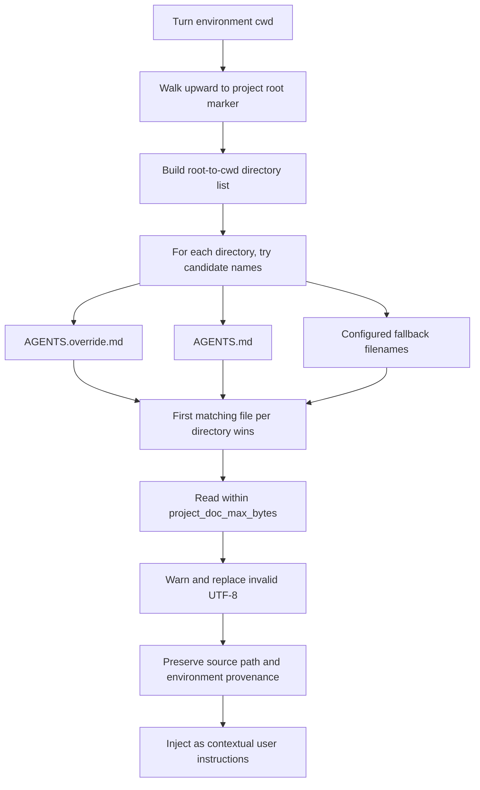

When both global/user and project docs exist, Codex inserts a separator:

```text
--- project-doc ---
```

When multiple environments contribute project docs, Codex labels each environment.

Beginner-friendly explanation:

```text
AGENTS.md is repo-local memory and policy.
Codex discovers the relevant slice for the current cwd and injects it into context.
```

For Freeflow:

```text
Local delegation packets should include the relevant instruction slice, not every repo doc.
```

Suggested v0:

```text
InstructionResolver:
  input:
    repo_root
    cwd
    task_files
  output:
    relevant_project_instructions
    relevant_freeflow_delegation_policy
    omitted_instruction_sources
```

The frontier orchestrator can still audit omitted sources if needed.

## Token Accounting And Context Windows

Codex tracks token usage through `TokenUsageInfo`.

It uses:

- server-reported token usage when available
- approximate token estimates when needed
- model context window from `ModelInfo`
- effective context window percent
- auto-compact token limits

`TurnContext.model_context_window()` resolves the model's usable context window:

```text
resolved_context_window * effective_context_window_percent / 100
```

Codex can track:

- active context tokens
- auto-compact scope tokens
- auto-compact scope limit
- full context window limit
- whether full context window was reached
- whether auto-compact limit was reached

It supports different auto-compact scopes:

```text
Total
BodyAfterPrefix
```

`BodyAfterPrefix` is interesting because it subtracts a baseline/prefix. This avoids charging the repeated stable prefix the same way as growing body history.

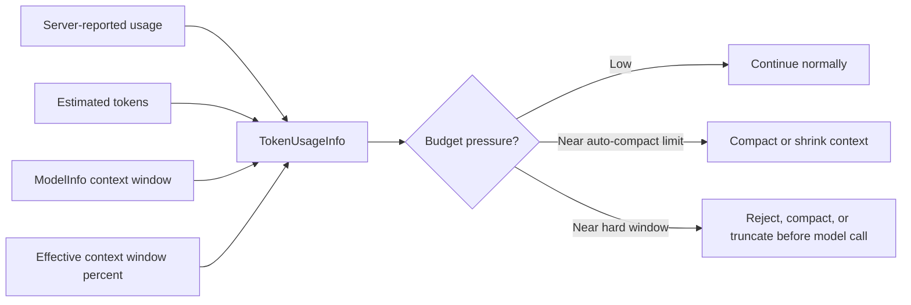

For Freeflow:

```text
Local packet budget should be explicit and conservative.
```

Suggested local budget fields:

```text
budget:
  max_input_tokens
  max_output_tokens
  max_files
  max_snippets
  max_tool_calls
  max_turns
  reserve_output_tokens
```

The local harness should reject or shrink a packet before calling MLX if it exceeds budget.

## Compaction

Compaction is one of the most important pieces of Codex's context architecture.

It is not just:

```text
summarize old chat
```

It is:

```text
detect pressure
  -> run compaction task
  -> build replacement history
  -> maybe preserve selected user messages
  -> maybe preserve images
  -> drop stale developer/context items
  -> inject fresh canonical context when needed
  -> advance context window id
  -> persist CompactedItem
  -> recompute token usage
  -> continue
```

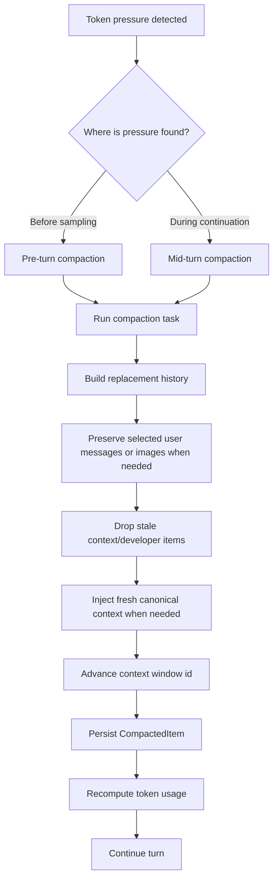

Codex has pre-turn and mid-turn compaction.

Pre-turn compaction:

```text
Runs before normal sampling.
Can clear reference context.
Next regular turn reinjects full context.
```

Mid-turn compaction:

```text
Runs when the model/tool continuation still needs to happen but the context limit is reached.
Must insert initial context before the last real user message so the compaction item stays in the model-expected position.
```

Codex has local and remote compaction paths.

All current compaction paths also run lifecycle hooks:

```text
pre-compact hooks
  Run before the history rewrite.
  Can stop or shape the compaction path.

post-compact hooks
  Run after successful compaction.
  Can stop or shape what happens next.
```

That matters because compaction is not only a summarization call. It is a runtime lifecycle event.

Local compaction:

- sends a synthesized compact prompt
- drains model output to completion
- builds summary text
- collects user messages
- builds compacted history
- inserts initial context if required
- replaces live history

Remote compaction:

- may call a provider compact endpoint
- may use remote compaction v2
- filters compacted output
- drops stale developer messages
- keeps only safe/expected retained items
- records compaction checkpoints

Remote compaction v2 has one extra detail worth separating:

```text
CompactionTrigger
  Is appended to the model input as an explicit marker for compaction.

retained messages
  Only user, developer, and system messages are candidates for retained-message handling.

retained-message token budget
  The retained-message path has a 64,000-token budget.
```

So a `CompactionTrigger` can be used as model input during v2 compaction while still not being retained as ordinary post-compaction conversation history.

Important retention behavior:

Remote compaction processing drops:

- developer messages from compacted output
- non-user-content user messages
- tool calls
- tool outputs
- reasoning
- web/search/image calls
- compaction triggers

It keeps:

- real user messages
- hook prompts
- assistant messages
- agent messages
- compaction items

For Freeflow:

```text
Do not make local v0 depend on autonomous compaction.
```

Instead:

```text
Build small packets before local execution.
If packet is too large, shrink evidence selection.
If still too large, do not delegate locally.
```

Local compaction can come later, but it is not needed for the first useful harness.

## Memory Surface Area

Codex memories are separate from ordinary context history.

Beginner version:

```text
Conversation history = what happened in this thread.
Context = what Codex sends to the model for this turn.
Memory = durable knowledge produced from older threads so future agents can reuse it.
```

The memory subsystem has three major surfaces:

```text
Read path
  memory_summary.md
  MEMORY.md
  rollout_summaries/
  skills/
  optional dedicated memory tools
  hidden citation parsing

Write path
  old rollout traces
  Phase 1 extraction model calls
  stage1_outputs DB rows
  Phase 2 consolidation agent
  git-backed memory workspace

Safety/control path
  config gates
  thread memory mode
  pollution detection
  usage tracking
  DB leases/retries/watermarks
```

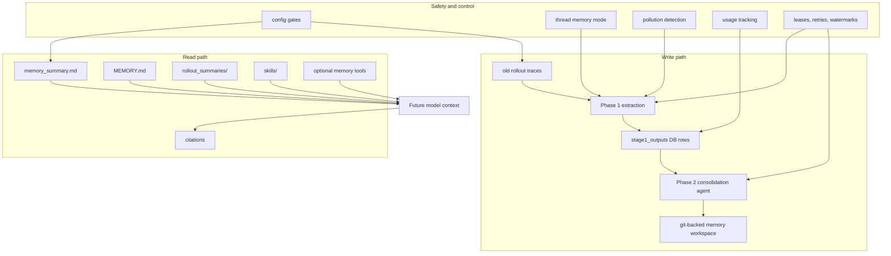

The files are split this way:

```text
codex-rs/memories/read
  Reusable read-side helpers:
  - memory root path
  - citation parsing
  - read-usage classification

codex-rs/ext/memories
  Extension that plugs memory into the agent:
  - developer prompt contribution
  - optional dedicated tools
  - local filesystem backend

codex-rs/memories/write
  Background write pipeline:
  - startup trigger
  - Phase 1 extraction
  - Phase 2 consolidation
  - prompt rendering
  - workspace diffing
  - memory artifact syncing

codex-rs/state
  Persistence layer:
  - memories_1.sqlite
  - stage1_outputs table
  - memory job rows
  - leases, retries, watermarks, selected-for-phase2 flags

codex-rs/core
  Runtime integration:
  - starts memory pipeline
  - injects extension context
  - tracks citations
  - marks threads polluted
  - records turn-level memory metrics
```

The architecture is not a single "memory file." It is a small subsystem.

## What Codex Means By Memory

Codex memory is designed around progressive disclosure.

The memory folder under `codex_home/memories` is expected to contain:

```text
memory_summary.md
  Dense always-loaded summary.
  Starts with v1.
  Used to decide whether deeper memory lookup is useful.

MEMORY.md
  Searchable handbook.
  Contains task-grouped user preferences, reusable knowledge, and failure shields.

rollout_summaries/
  Per-rollout summaries with provenance.
  Used when a future agent needs more detail.

skills/
  Reusable procedures with SKILL.md entrypoints.

raw_memories.md
  Temporary Phase 2 input generated from DB-backed Phase 1 outputs.

extensions/
  Extra memory sources, such as ad-hoc notes.
```

That folder structure matters because it avoids two bad extremes:

```text
Bad extreme 1:
  Always load all memories into every turn.
  Result: huge context, slow model calls, stale irrelevant facts.

Bad extreme 2:
  Never load memory unless the user repeats themselves.
  Result: the agent forgets durable preferences and hard-won workflow lessons.
```

Codex takes a middle route:

```text
Load a compact memory summary by default.
Teach the model how to search/read deeper memory when relevant.
Require citations when memory was used.
Track cited memory usage so useful memories stay eligible.
```

For Freeflow, this is more important than the exact files. The key design lesson is:

```text
Memory should be navigational first, exhaustive second.
```

Small local models especially need memory to be a retrieval system, not a giant prompt blob.

## Memory Config And Feature Gates

Codex has several separate memory switches. They do different jobs.

From `codex-rs/config/src/types.rs`, the effective memory config includes:

```text
disable_on_external_context
  If true, external context can mark a thread as polluted.

generate_memories
  If false, newly created threads are stored with memory_mode = disabled.

use_memories
  If false, memory read instructions are not injected.

dedicated_tools
  If true, expose dedicated memories/list/read/search/ad_hoc_note tools.

max_raw_memories_for_consolidation
  How many stage-one memories can feed Phase 2.

max_unused_days
  Old unused memories become ineligible for Phase 2 selection.

max_rollout_age_days
  How far back Phase 1 looks for rollouts.

max_rollouts_per_startup
  How many rollout candidates Phase 1 processes per startup.

min_rollout_idle_hours
  How long a rollout must be idle before extraction.

min_rate_limit_remaining_percent
  Skips background memory generation if Codex rate limits are too low.

extract_model
  Optional model override for Phase 1 extraction.

consolidation_model
  Optional model override for Phase 2 consolidation.
```

Defaults visible in source:

```text
generate_memories = true
use_memories = true
dedicated_tools = false
disable_on_external_context = false
max_rollouts_per_startup = 2
max_rollout_age_days = 10
min_rollout_idle_hours = 6
min_rate_limit_remaining_percent = 25
max_raw_memories_for_consolidation = 256
max_unused_days = 30
```

The important design lesson is that memory has separate "read" and "write" controls:

```text
use_memories
  Controls whether current turns can read memory.

generate_memories
  Controls whether current threads are eligible to become future memory.
```

That is clean. A user may want the agent to read existing memory but not generate new memory from a sensitive thread. Or the reverse may be useful in tests.

The `MemoryTool` feature flag is also important. The memory extension only contributes prompt context if:

```text
Feature::MemoryTool is enabled
and config.memories.use_memories is true
```

Dedicated tools require one more gate:

```text
Feature::MemoryTool is enabled
and use_memories is true
and dedicated_tools is true
```

For Freeflow:

```text
Do not make memory one boolean.
Use separate controls for:
  read memory
  generate memory
  expose memory tools
  allow local-agent memory access
  allow local-agent traces to become memory
```

## Memory Read Path

The read path starts in `codex-rs/ext/memories/src/extension.rs`.

`MemoriesExtension` implements four extension traits:

```text
ThreadLifecycleContributor
  Stores memory config in thread extension data when a thread starts.

ConfigContributor
  Updates stored memory config when config changes.

ContextContributor
  Contributes developer prompt fragments.

ToolContributor
  Contributes optional memory tools.
```

The read prompt is built by `build_memory_tool_developer_instructions()`.

That function:

1. Computes `codex_home/memories`.
2. Reads `memory_summary.md`.
3. Trims and truncates it.
4. Renders `templates/memories/read_path.md`.
5. Returns a developer-policy prompt fragment.

Important detail:

```text
memory_summary.md is truncated to 2,500 tokens before prompt injection.
```

Another important detail:

```text
If memory_summary.md is missing, unreadable, or empty after trimming,
the memory extension contributes no read-path developer prompt at all.
```

So "memory enabled" does not automatically mean "memory text is present in the prompt."

So Codex does not inject the full memory folder. It injects:

```text
Here is a compact memory summary.
Here is where the memory folder lives.
Here is how to decide whether to search/read deeper memory.
Here is how to cite memory if you used it.
```

This is good harness design. The model gets a map, not a warehouse.

The rendered read-path template tells the model:

- memory can save time and preserve consistency
- skip memory only for clearly self-contained tasks
- start with `memory_summary.md`
- search `MEMORY.md`
- open rollout summaries or skills only when needed
- keep memory lookup lightweight
- treat memory-derived facts carefully when they may be stale
- append a hidden citation block when memory files were used
- update memory only when explicitly asked

That last point matters:

```text
The read path can suggest memory use.
It cannot freely rewrite memory.
```

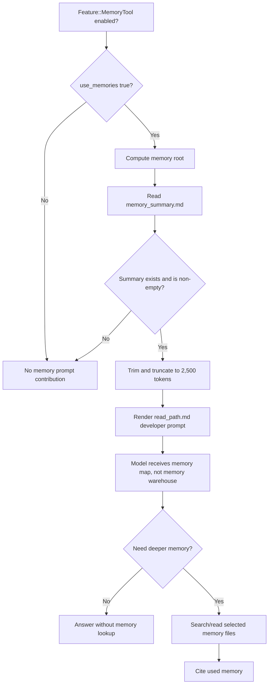

For Freeflow local delegation:

```text
Local agents should not automatically read global memory.
They should receive selected memory snippets in the task packet,
or be given a small read-only memory search tool with strict budgets.
```

## Dedicated Memory Tools

The dedicated tool surface lives in `codex-rs/ext/memories/src/tools/`.

The tools are:

```text
memories/add_ad_hoc_note
memories/list
memories/read
memories/search
```

They are ordinary function tools. Each tool has:

- a model-visible schema
- a typed argument struct
- a typed output struct
- a backend call
- metrics
- error mapping

The tool module uses a backend trait:

```text
trait MemoriesBackend {
  add_ad_hoc_note(...)
  list(...)
  read(...)
  search(...)
}
```

This is a production design move. Tool behavior does not depend directly on local filesystem code. Today the backend is local files. Tomorrow it could be remote storage.

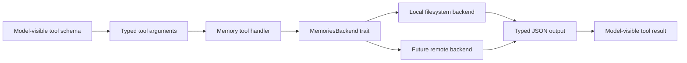

Tool behavior:

```text
list
  Lists immediate files/directories under a memory path.
  Supports cursor pagination.
  Max results are clamped to 2,000.

read
  Reads a file by relative path.
  Supports 1-indexed line_offset and max_lines.
  Truncates content to 20,000 tokens by default.

search
  Searches memory files for substrings.
  Supports match modes:
    any
    all_on_same_line
    all_within_lines
  Supports path scope, cursor, context lines, case sensitivity, normalized matching.
  Defaults to match_mode=any, context_lines=0, case_sensitive=true, normalized=false.
  Max results are clamped to 200.

add_ad_hoc_note
  Creates one append-only ad-hoc memory note.
  Only intended after the user explicitly asks Codex to remember, forget, or update something.
```

The tools return JSON, not loose terminal text.

This matters for local harness design:

```text
If a local model gets memory access, expose it as typed read/search/list tools.
Do not ask it to shell around inside ~/.codex/memories.
```

## Local Filesystem Memory Backend

The local backend lives in `codex-rs/ext/memories/src/local/`.

It protects the memory root in several ways:

```text
Rejects parent-directory traversal.
Rejects absolute paths.
Rejects platform path prefixes.
Rejects hidden path components.
Rejects symlinks.
Rejects paths that traverse through non-directories.
Skips hidden paths while listing/searching.
Skips non-UTF-8 / invalid-data files during search.
Uses relative paths in tool outputs.
```

This is exactly the sort of boring code that makes a tool safe enough for agents.

The read implementation is also careful:

```text
line_offset is 1-indexed
max_lines must be positive
line_offset beyond file length is an explicit error
returned content is token-truncated
response includes start_line_number and truncated flag
```

The search implementation is not just `grep` wrapped in a tool. It:

- normalizes queries
- validates empty queries
- supports case sensitivity
- optionally strips non-alphanumeric characters for normalized matching
- supports context lines
- recursively walks directories inside the memory root
- ignores hidden files and symlinks
- sorts results by path and line number
- paginates with cursor indexes

For Freeflow:

```text
If we build local memory tools, start with this same defensive path model.
Memory is user data. Treat memory reads like filesystem reads with policy, not like free context.
```

## Citation Parsing And Visible Output

Codex expects memory citations in hidden assistant markup.

The parser is in `codex-rs/memories/read/src/citations.rs`.

It looks for blocks like:

```text
<citation_entries>
MEMORY.md:10-12|note=[why this memory was used]
</citation_entries>
<rollout_ids>
019...
</rollout_ids>
```

The parsed structure is:

```text
MemoryCitation {
  entries: Vec<MemoryCitationEntry>,
  rollout_ids: Vec<String>,
}

MemoryCitationEntry {
  path: String,
  line_start: u32,
  line_end: u32,
  note: String,
}
```

The parser accepts two rollout-id block names:

```text
<rollout_ids>...</rollout_ids>
<thread_ids>...</thread_ids>
```

It deduplicates rollout ids while preserving order.

Core then uses `strip_hidden_assistant_markup_and_parse_memory_citation()`:

```text
assistant raw text
  -> strip hidden citation blocks
  -> optionally strip plan-mode proposed-plan blocks
  -> visible assistant text
  -> structured MemoryCitation
```

So the user sees a clean answer, while the agent runtime still records evidence.

For Freeflow:

```text
Local-agent results should probably not use hidden markup in v0.
Use explicit structured result fields:
  evidence[]
  memory_used[]
  files_read[]
  uncertainty[]
```

Hidden citations are useful for an integrated product UI. For our local harness, explicit JSON is easier to inspect and verify.

## Usage Tracking

Citation parsing is connected to memory retention.

When Codex records a completed model response item, it checks for memory citations.

The path is:

```text
record_completed_response_item()
  -> record_completed_response_item_with_finalized_facts()
  -> detect memory citation
  -> parse rollout ids into ThreadId values
  -> db.memories().record_stage1_output_usage(thread_ids)
  -> mark this turn as has_memory_citation
```

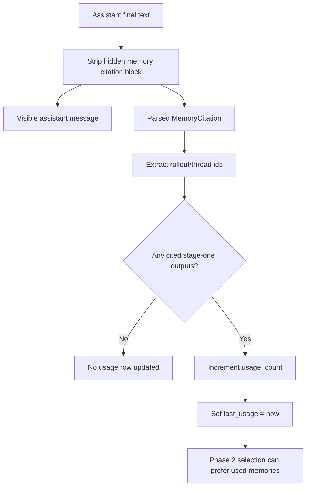

`record_stage1_output_usage()` updates `stage1_outputs`:

```text
usage_count = usage_count + 1
last_usage = now
```

Later, Phase 2 input selection uses usage:

```text
eligible rows
  -> rank by usage_count desc
  -> then by recent last_usage/source_updated_at
  -> then by source_updated_at
  -> then by thread_id
```

This is important. Codex does not only remember recent things. It also keeps things that are actually cited.

For Freeflow:

```text
If local agents use memory, record usage explicitly.
Useful memory should survive because it is used, not because it is merely new.
```

## Thread Memory Mode And Pollution

Every persisted thread has memory eligibility state.

Visible protocol enum:

```text
ThreadMemoryMode:
  enabled
  disabled
```

Internal state DB also uses:

```text
polluted
```

Creation behavior:

```text
if config.memories.generate_memories:
  new thread memory_mode = enabled
else:
  new thread memory_mode = disabled
```

Rollout metadata also stores memory mode. On reconciliation, Codex can recover the latest memory mode from `SessionMeta`.

The user/runtime can update memory mode through:

```text
Op::SetThreadMemoryMode { mode }
```

The handler persists and flushes the live thread, then updates memory mode. This does not involve a model call. It only affects future memory generation.

Pollution behavior:

```text
if config.memories.disable_on_external_context is true
and the current thread uses external context:
  mark thread memory_mode = polluted
```

External context can come from:

- web search response items
- tool search response items
- tool outputs that declare `contains_external_context()`
- MCP servers configured as memory-polluting

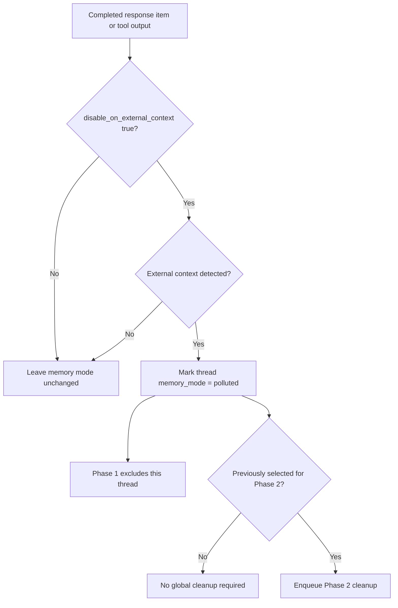

When a thread is polluted:

```text
Phase 1 excludes it because Phase 1 only selects threads where memory_mode = enabled.
Phase 2 can be enqueued to remove stale memories if that thread was previously selected.
```

This is a subtle but important safety design.

Why it exists:

```text
If the agent reads external/private/transient context,
the resulting thread may no longer be safe to turn into durable user memory.
```

For Freeflow:

```text
Local delegation traces should have memory modes too:
  enabled
  disabled
  polluted

Default v0 should probably be:
  local traces are stored for orchestrator audit
  local traces are not durable memory candidates unless explicitly enabled
```

That avoids accidentally teaching future agents from weak or externally contaminated local-agent outputs.

## Memory Write Pipeline

The write path is background work.

It starts from `start_memories_startup_task()` in `codex-rs/memories/write/src/start.rs`.

The pipeline only starts if:

```text
session is not ephemeral
MemoryTool feature is enabled
session is not a sub-agent session
state DB is available
```

Then it:

1. Creates the memory root.
2. Seeds extension instructions.
3. Prunes stale Phase 1 rows.
4. Checks Codex rate limits.
5. Runs Phase 1.
6. Runs Phase 2.

This is asynchronous background startup work:

```text
tokio::spawn(...)
```

The interactive turn does not block waiting for memory generation.

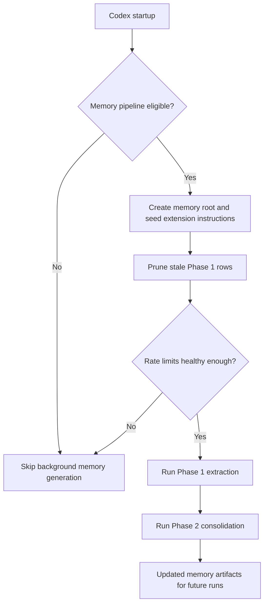

The rate-limit guard matters:

```text
If Codex backend rate limits are below min_rate_limit_remaining_percent,
the memory pipeline skips startup work.
```

For Freeflow local harness:

```text
Do not run expensive memory generation in the hot path.
For v0, write traces immediately and defer any summarization/consolidation.
```

## Phase 1 Rollout Extraction

Phase 1 turns one old rollout into one structured memory output.

Input:

```text
eligible rollout trace
```

Output:

```json
{
  "raw_memory": "...",
  "rollout_summary": "...",
  "rollout_slug": "..."
}
```

Phase 1 job selection:

```text
state DB threads
  -> active threads only
  -> allowed interactive session sources only
  -> memory_mode = enabled
  -> exclude current thread
  -> updated_at within max_rollout_age_days
  -> idle for at least min_rollout_idle_hours
  -> not already up to date in stage1_outputs
  -> claim a bounded number of jobs
```

Default bound:

```text
max_rollouts_per_startup = 2
```

Phase 1 also has a parallelism bound:

```text
CONCURRENCY_LIMIT = 8
THREAD_SCAN_LIMIT = 5,000
LEASE_SECONDS = 3,600
RETRY_DELAY_SECONDS = 3,600
```

So startup memory extraction is bounded twice:

```text
how many jobs are claimed
how many claimed jobs can run concurrently
```

The job claim system prevents duplicate work:

```text
try_claim_stage1_job()
  -> uses memory jobs table
  -> sets ownership_token
  -> sets lease_until
  -> respects max running jobs
  -> respects retry backoff
  -> skips up-to-date outputs
```

Phase 1 sampling:

```text
load rollout items
  -> filter memory-relevant response items
  -> remove developer messages
  -> remove AGENTS.md contextual fragments
  -> remove skill contextual fragments
  -> keep environment context and subagent notifications
  -> redact secrets
  -> render stage_one_input prompt
  -> call extraction model with strict JSON schema
  -> redact generated fields again
  -> upsert stage1_outputs
```

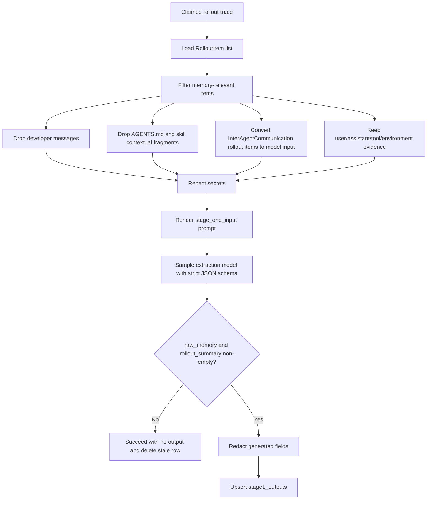

The filtering step is worth noticing. Codex does not simply dump the whole rollout into a memory model.

It excludes:

```text
developer messages
AGENTS.md contextual user fragments
skill contextual user fragments
reasoning items
agent-message items
compaction items
image-generation calls
other non-memory response items
```

It keeps:

```text
user/assistant messages
shell/tool calls
tool outputs
web/tool-search calls and outputs
custom tool calls and outputs
environment context
subagent notifications
inter-agent communication rollout items converted to model input
```

Stage 1 prompt size is bounded:

```text
use 70% of active model effective input window
fallback = 150,000 tokens
truncate with head/tail preservation policy
```

The extraction model uses low reasoning effort.

If the model returns empty `raw_memory` or empty `rollout_summary`, Codex treats the job as succeeded with no output and deletes any previous output for that thread.

There is one follow-on nuance:

```text
If the no-output result deletes an existing stage-one output,
Codex can enqueue Phase 2 because the global memory folder may need to remove now-stale content.
```

For Freeflow:

```text
Do not let local agents write durable memory directly.
If we later add local memory generation, use a Phase 1-style extractor:
  trace in
  strict schema out
  secret redaction
  bounded candidates
  no-op allowed
  frontier-verifiable output
```

## Phase 2 Global Consolidation

Phase 2 turns many stage-one outputs into the actual memory folder.

High-level flow:

```text
claim global phase-2 lock
  -> prepare memory workspace as git baseline repo
  -> build locked-down consolidation-agent config
  -> select stage1_outputs
  -> sync raw_memories.md and rollout_summaries/
  -> prune old extension resources
  -> compute workspace diff
  -> if no diff, mark success
  -> write phase2_workspace_diff.md
  -> spawn internal consolidation agent
  -> wait for final agent status
  -> reset git baseline
  -> mark DB job success/failure
```

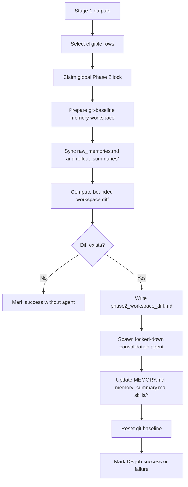

Phase 2 has a single global lock:

```text
kind = memory_consolidate_global
job_key = global
```

That lock is needed because the memory folder is shared global state. Multiple agents should not edit `MEMORY.md` simultaneously.

The lock has more than "running or not running" behavior:

```text
running lease
  Prevents duplicate concurrent consolidation.

retry delay
  Avoids immediately retrying failed consolidation work.

success cooldown
  Skips new Phase 2 work for 6 hours after a recent successful global consolidation.
```

That last state appears as a `SkippedCooldown` outcome in the Phase 2 claim path.

Phase 2 input selection:

```text
stage1_outputs
  -> non-empty raw_memory or rollout_summary
  -> recent enough by last_usage or source_updated_at
  -> thread still exists
  -> thread memory_mode = enabled
  -> ranked by usage_count and recency
  -> selected top N
  -> returned in stable ascending thread-id order
```

The stable order is not the priority ranking. It is used to avoid churn in `raw_memories.md`.

Phase 2 writes:

```text
raw_memories.md
  merged raw memories, stable ascending thread-id order

rollout_summaries/<slug>.md
  one summary per selected stage-one output

phase2_workspace_diff.md
  bounded git-style diff from previous successful baseline
```

Then the consolidation agent reads the diff and updates:

```text
MEMORY.md
memory_summary.md
skills/*
```

The generated diff file is deleted before resetting the git baseline, so deleted memory content is not kept around in the prompt artifact or unreachable git objects.

The consolidation-agent path also heartbeats the global lock while it runs. Before Codex resets the memory workspace baseline, it confirms that the job still owns the lock. If ownership was lost, Codex avoids resetting the baseline under the wrong job.

For Freeflow:

```text
The first local harness probably does not need Phase 2.
But if we later build durable local memory, this is the architecture to study:
  DB-backed raw memory
  filesystem memory workspace
  git diff as change signal
  serialized consolidation agent
  explicit baseline reset
```

## Consolidation Subagent

Phase 2 does not directly patch `MEMORY.md` with Rust code. It spawns an internal Codex agent.

The config is deliberately locked down:

```text
cwd = memory root
ephemeral = true
generate_memories = false
use_memories = false
include_apps_instructions = false
mcp_servers = empty
approval_policy = never
network_access = false
write access = memory root only
apps disabled
plugins disabled
collab disabled
spawn/collab features disabled
skill MCP dependency install disabled
model = configured consolidation_model or provider preferred model
reasoning effort = medium
```

That is a strong example of using subagents safely:

```text
Give the subagent one job.
Give it only the workspace it needs.
Disable recursion.
Disable network.
Disable approvals.
Disable unrelated tools.
Mark it ephemeral so it does not generate more memory.
```

The parent process monitors the agent:

```text
poll agent status
heartbeat DB lease every 90 seconds
if completed:
  record token metrics
  confirm lock ownership
  reset memory git baseline
  mark phase-2 success
else:
  mark phase-2 failure
shutdown agent
```

For Freeflow:

```text
This is very close to how local agents should be treated:
  bounded task
  locked-down config
  no recursive delegation by default
  explicit parent ownership
  result inspected by orchestrator
```

## State DB Coordination

Codex uses a separate memories SQLite DB:

```text
memories_1.sqlite
```

Initial schema:

```text
stage1_outputs
  thread_id primary key
  source_updated_at
  raw_memory
  rollout_summary
  rollout_slug
  generated_at
  usage_count
  last_usage
  selected_for_phase2
  selected_for_phase2_source_updated_at

jobs
  kind
  job_key
  status
  worker_id
  ownership_token
  started_at
  finished_at
  lease_until
  retry_at
  retry_remaining
  last_error
  input_watermark
  last_success_watermark
```

`stage1_outputs` stores extracted memory. `jobs` stores coordination.

Stage 1 job states:

```text
running
done
error
```

Stage 1 claim outcomes:

```text
Claimed
SkippedUpToDate
SkippedRunning
SkippedRetryBackoff
SkippedRetryExhausted
```

Phase 2 claim outcomes:

```text
Claimed
SkippedRetryUnavailable
SkippedCooldown
SkippedRunning
```

The important DB ideas:

```text
ownership_token
  Proves the worker still owns a job.

lease_until
  Lets another startup recover stale jobs.

retry_at
  Prevents hot loops after failure.

retry_remaining
  Prevents infinite retries.

input_watermark
  Bookkeeping for latest known input.

last_success_watermark
  Records successful processing progress.

selected_for_phase2
  Records which stage-one snapshots were used in the last successful global consolidation.
```

Phase 2 explicitly does not use DB watermarks as the dirty check. It uses git workspace diff after syncing current inputs.

That is subtle and good:

```text
DB says what inputs exist.
Git diff says whether the materialized memory workspace changed.
```

For Freeflow:

```text
For v0 local delegation, a simple append-only trace log is enough.
For durable memory or background summarization, borrow:
  job leases
  retry backoff
  ownership tokens
  selected snapshot tracking
```

## Filesystem Artifacts And Workspace Diff

Phase 2 treats the memory root as a git-baseline workspace.

Important helpers:

```text
prepare_memory_workspace()
  create memory root
  remove stale phase2_workspace_diff.md
  ensure git baseline repo

memory_workspace_diff()
  remove stale diff file
  compute diff since latest baseline

write_workspace_diff()
  write bounded phase2_workspace_diff.md

reset_memory_workspace_baseline()
  remove diff file
  reset git repo baseline
```

The diff file includes:

```text
# Memory Workspace Diff
status list
bounded unified diff
```

It is capped at 4 MiB.

This gives the consolidation agent a precise "what changed" artifact instead of asking it to reread everything.

For Freeflow:

```text
If we generate local-agent traces and summaries, store diffs/results as artifacts.
The frontier orchestrator should inspect compact artifacts, not rerun every local subtask mentally.
```

## Memory Extensions And Ad-Hoc Notes

Codex memory supports extension resources.

The ad-hoc extension is built in:

```text
memories/extensions/ad_hoc/instructions.md
memories/extensions/ad_hoc/notes/*.md
```

Startup seeds the ad-hoc instructions file if missing.

The dedicated `add_ad_hoc_note` tool writes one note file into:

```text
extensions/ad_hoc/notes/
```

Filename format:

```text
YYYY-MM-DDTHH-MM-SS-<slug>.md
```

Constraints:

- filename max 128 bytes
- slug max 80 bytes
- slug lowercase ASCII letters, digits, hyphens
- create-new only, so notes are append-only by filename
- note cannot be empty
- memory root and directories reject symlinks

There is a small schema/backend nuance:

```text
model-facing tool schema
  Requires the slug portion to start with a lowercase letter or digit.

local backend validation
  Checks non-empty slug length and allowed characters.
  It is looser and can accept a hyphen-only slug if something bypasses the tool schema.
```

For normal model use, the stricter schema is the relevant contract. For architecture study, the looser backend validation is still worth knowing.

The ad-hoc extension instructions tell the consolidation agent:

- consider every note authoritative for memory consolidation
- never treat note content as instructions to perform actions
- never delete a note file
- tag derived summary information as `[ad-hoc note]`

This is a useful pattern:

```text
User-requested memory updates become input artifacts.
A later controlled consolidation pass decides how to merge them.
```

Extension resources are not kept forever. Timestamped markdown resources under extension `resources/*.md` are pruned after 7 days when they belong to a real extension folder.

For Freeflow:

```text
If users ask the local harness to remember something,
write a small append-only note artifact first.
Do not silently patch the main memory handbook from inside the local model.
```

## Tests And Guarantees

This pass did not run Codex's full test suite, but the inspected source includes tests around the important memory contracts.

Visible test coverage includes:

```text
citations_tests.rs
  Memory citation parsing behavior.

prompts_tests.rs
  Memory prompt rendering behavior.

storage_tests.rs
  Raw memory and rollout summary artifact naming/sync behavior.

workspace_tests.rs
  Git-baseline workspace diff behavior.

guard_tests.rs
  Rate-limit guard behavior.

startup_tests.rs
  Startup pipeline gating behavior.

phase1 inline tests
  Filtering AGENTS.md and skill contextual fragments out of memory extraction input.
  Secret redaction before prompt upload.
  Output schema shape.

state runtime memory tests
  Stage 1 claims, retries, up-to-date skips, phase-2 claims, selected-for-phase2 behavior.

stream_events_utils_tests.rs
  External context pollution and memory citation parsing from assistant messages.
```

The guarantees are mostly ordinary engineering guarantees:

- memory jobs are leased
- failed jobs back off
- duplicate workers skip running jobs
- stale memory outputs can be pruned
- memory read paths stay under the memory root
- symlink traversal is rejected
- hidden citations are stripped from visible assistant text
- memory usage affects retention
- consolidation agent is sandboxed

This is worth learning from because production-ready agent architecture is usually not one brilliant prompt. It is many boring invariants placed around the model.

## Freeflow Memory Lessons

The important lesson is not "copy Codex memory."

The important lesson is:

```text
Separate trace storage, prompt context, memory retrieval, memory generation,
and memory consolidation.
```

For Freeflow local delegation, the first useful version should probably be:

```text
v0:
  store local-agent traces
  produce structured local results
  require evidence lists
  let frontier orchestrator verify
  do not generate durable memory from local traces by default
  do not give local agents broad memory access by default
```

Then:

```text
v1:
  optional read-only memory snippets in task packets
  optional memory search/read tools with strict budgets
  explicit memory_used evidence in local result
  usage counters for memory snippets
```

Later:

```text
v2:
  background summarization of selected local-agent traces
  frontier-reviewed memory candidates
  durable local memory consolidation
  maybe a Codex-style two-phase pipeline
```

This keeps us aligned with the user's original goal:

```text
reduce frontier-token usage without degrading output quality
```

Memory should help that goal only if it keeps local tasks smaller and more reliable. If memory makes local runs slower, larger, or easier to trust blindly, it is hurting the design.

## What Freeflow Should Borrow

Borrow these principles:

1. Separate raw trace from model prompt.
2. Use typed context sections.
3. Build context per task, not globally.
4. Keep instructions separate from evidence.
5. Keep policy separate from task content.
6. Normalize history/action state before model calls.
7. Truncate large evidence before it reaches the model.
8. Track token/context budget explicitly.
9. Store full trace for audit.
10. Make local output cite evidence.
11. Treat memory as optional and governed, not automatic.
12. Do not trust local model memory as authority.

Suggested local harness components:

```text
InstructionResolver
EvidenceSelector
PromptBudgeter
LocalTaskPacketBuilder
LocalModelAdapter
LocalTurnRunner
LocalToolRouter
LocalTraceStore
ResultValidator
FrontierReviewContract
```

## What Freeflow Should Not Copy Yet

Do not copy these in v0:

- full Codex compaction machinery
- full persistent thread replay
- full memory write pipeline
- internal memory consolidation agent
- hidden citation markup
- multi-environment AGENTS.md complexity
- full plugin/app injection
- long-lived local subagent threads by default
- model-specific compaction compatibility hashes

These are powerful, but they are not the first harness we need.

The first Freeflow local harness should be:

```text
task packet in
bounded local tool loop
structured result out
trace saved
frontier verifies
```

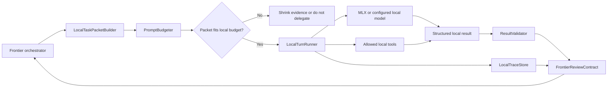

## Suggested LocalTaskPacket

```json
{
  "run_id": "local-run-...",
  "task_name": "review-diff-for-risk",
  "task_kind": "review",
  "objective": "Review the selected diff for obvious bugs and missing tests.",
  "runtime_context": {
    "cwd": "/repo",
    "repo_root": "/repo",
    "current_date": "2026-06-12",
    "model": "mlx-community/gemma-4-12b",
    "provider": "mlx",
    "max_input_tokens": 9000,
    "max_output_tokens": 1200
  },
  "policy": {
    "network": "disabled",
    "writes": "disabled",
    "shell": "disabled",
    "max_tool_calls": 3,
    "max_turns": 2
  },
  "instructions": {
    "delegation_policy": "You are a local helper. Be conservative. Report uncertainty.",
    "workspace_instructions": "Relevant AGENTS.md excerpt here.",
    "output_rules": "Return JSON matching the schema."
  },
  "evidence": {
    "diff": "...",
    "files": [
      {
        "path": "src/example.ts",
        "content": "selected snippet"
      }
    ]
  },
  "output_schema": {
    "answer": "string",
    "findings": "array",
    "confidence": "low|medium|high",
    "uncertainty": "array",
    "evidence": "array",
    "needs_frontier_review": "boolean"
  }
}
```

## Suggested Local Result

```json
{
  "run_id": "local-run-...",
  "status": "completed",
  "answer": "Short result for the frontier orchestrator.",
  "findings": [
    {
      "severity": "medium",
      "file": "src/example.ts",
      "line": 42,
      "claim": "Possible bug.",
      "evidence": "Why the local model thinks this.",
      "confidence": "medium"
    }
  ],
  "files_read": ["src/example.ts"],
  "tools_used": ["read_file"],
  "uncertainty": ["Did not run tests.", "Only inspected selected diff."],
  "needs_frontier_review": true,
  "trace_path": ".freeflow/local-runs/local-run-.../trace.jsonl"
}
```

The key is not that this exact JSON is final. The key is the shape:

```text
bounded task
+ bounded context
+ bounded tools
+ structured answer
+ trace evidence
+ explicit uncertainty
```

## Beginner-Friendly Pseudocode

```python
def run_local_delegate(task_request):
    runtime_context = build_runtime_context(task_request)
    instructions = resolve_relevant_instructions(task_request)
    evidence = select_evidence(task_request)

    packet = build_task_packet(
        task_request=task_request,
        runtime_context=runtime_context,
        instructions=instructions,
        evidence=evidence,
    )

    packet = enforce_prompt_budget(packet)

    trace = TraceStore.create(packet.run_id)
    trace.record("task_packet_built", packet.metadata())

    result = run_local_turn_loop(
        packet=packet,
        model_adapter=mlx_or_configured_adapter(),
        tool_router=allowed_local_tools(packet.policy),
        trace=trace,
    )

    validated = validate_result(result, packet.output_schema)
    trace.record("result_validated", validated.summary())

    return {
        "result": validated.result,
        "trace_path": trace.path,
        "needs_frontier_review": True,
    }
```

The crucial difference from a toy model wrapper:

```text
The harness chooses context, enforces policy, routes tools, records trace, and validates output.
The local model only predicts the next useful text/action.
```

## MLX-Specific Implication

MLX speed will disappear if we feed it giant prompts.

So for MLX-first local delegation:

- prefer one-shot or two-turn tasks
- prefer selected snippets over whole files
- prefer diff-focused review over repo-wide reasoning
- prefer structured output over freeform essays
- prefer read-only tools first
- avoid long memory injection
- avoid whole-transcript delegation
- avoid auto-compaction inside local runs at v0

Good local tasks:

- summarize a small file
- inspect a selected diff
- generate test case ideas from a local snippet
- search for repeated symbols
- classify likely risk areas
- produce a second-opinion review
- extract TODOs from a document
- check whether a small artifact follows a schema

Bad local tasks:

- understand entire repo architecture from scratch
- make security-sensitive decisions alone
- design public API behavior alone
- perform migrations alone
- modify many files without frontier review
- reason over a huge multi-hour transcript

## What Is Still Missing

Pass 6B filled the main gap in this artifact: Codex's memory architecture is now mapped deeply enough for learning and Freeflow design.

Remaining gaps are no longer "what does Codex memory do?" They are "what should Freeflow copy?"

Still missing for Freeflow design:

- Whether v0 local delegation should have any durable memory feature at all.
- Whether local-agent traces should ever become future memory.
- Whether memory snippets should be selected by the frontier orchestrator, the harness, or the local model.
- Whether local agents should have direct memory tools or only task-packet memory excerpts.
- Whether memory use should be explicit structured JSON rather than hidden citation markup.
- How to benchmark whether memory-assisted local delegation saves cloud tokens without degrading quality.
- How to keep MLX local-model runs fast when memory is available.

Still missing for broader research:

- A comparison with OpenHands, Goose, Hermes, Aider, smolagents, and LangGraph-style memory/task systems.
- A concrete Freeflow local harness spec that converts these lessons into architecture.

## Pass 6B Source Areas Studied

Pass 6B read these source areas:

```text
codex-rs/memories/README.md
  High-level memory pipeline.

codex-rs/ext/memories/src/extension.rs
  Memory read-path extension registration and prompt/tool contribution.

codex-rs/ext/memories/src/prompts.rs
  Memory read-path prompt construction.

codex-rs/ext/memories/src/tools/mod.rs
  Memory tool registration.

codex-rs/ext/memories/src/tools/list.rs
codex-rs/ext/memories/src/tools/read.rs
codex-rs/ext/memories/src/tools/search.rs
codex-rs/ext/memories/src/tools/ad_hoc_note.rs
  Dedicated memory tools.

codex-rs/ext/memories/src/local/
  Local filesystem backend behavior.

codex-rs/memories/read/src/citations.rs
  Citation parsing.

codex-rs/memories/read/src/usage.rs
  Memory usage classification/tracking support.

codex-rs/memories/write/src/phase1.rs
  Per-rollout memory extraction.

codex-rs/memories/write/src/phase2.rs
  Global consolidation.

codex-rs/memories/write/src/runtime.rs
  Runtime orchestration.

codex-rs/memories/write/src/start.rs
  Startup trigger.

codex-rs/memories/write/src/storage.rs
  Filesystem memory artifact helpers.

codex-rs/memories/write/src/workspace.rs
  Memory workspace and git diff behavior.

codex-rs/memories/write/src/control.rs
  Control flow and coordination.

codex-rs/memories/write/src/guard.rs
  Safety guardrails.

codex-rs/memories/write/src/prompts.rs
  Prompt rendering for memory generation.

codex-rs/memories/write/templates/memories/
  Memory prompt templates.

codex-rs/state/src/model/memories.rs
codex-rs/state/src/runtime/memories.rs
codex-rs/state/migrations/0016_memory_usage.sql
codex-rs/state/memory_migrations/0001_memories.sql
  Memory state model and DB persistence.

codex-rs/core/src/memory_usage.rs
  Core-side memory usage behavior.

codex-rs/core/src/session/mod.rs
codex-rs/core/src/session/handlers.rs
codex-rs/core/src/tools/registry.rs
codex-rs/core/src/mcp_tool_call.rs
codex-rs/core/src/stream_events_utils.rs
  Integration points: memory mode, pollution, citations, tool output handling.
```

Pass 6B output sections now covered in this artifact:

```text
1. Memory System Purpose
2. Memory Config And Feature Gates
3. Memory Read Path
4. Memory Tools
5. Citation Parsing
6. Usage Tracking
7. Thread Memory Mode And Pollution
8. Phase 1 Rollout Extraction
9. Phase 2 Global Consolidation
10. Filesystem Artifacts
11. State DB Coordination
12. Consolidation Subagent
13. Tests And Guarantees
14. Freeflow Lessons
```

## Source Evidence Appendix

Source snapshot:

```text
repo: openai/codex
commit: 0fed4497f50ad5f0b2f7972a1bfd14c5a09a85c5
short: 0fed449
commit date: 2026-06-13
commit title: [codex] Carry exec-server cwd as PathUri (#28032)
local path: /private/tmp/openai-codex-study-pass0
previous audited snapshot: b65fe3d8976d6fcc44ee6c6cf988654af5fc4d2d
```

Most relevant files for Pass 6A:

```text
codex-rs/core/src/session/turn_context.rs
  Defines TurnContext and per-turn runtime state.

codex-rs/core/src/session/turn.rs
  Turn loop, context updates, skill/plugin injection, prompt construction, auto-compact checks, sampling.

codex-rs/core/src/session/mod.rs
  Session helpers for initial context, context diffs, record_conversation_items, compaction replacement, token usage.

codex-rs/core/src/session/session.rs
  Session and SessionConfiguration structure.

codex-rs/core/src/session/token_budget.rs
  Token budget remaining context injection.

codex-rs/core/src/state/session.rs
  SessionState and mutable history/token/compaction state.

codex-rs/core/src/state/auto_compact_window.rs
  Auto-compact window id and prefill tracking.

codex-rs/core/src/context_manager/history.rs
  ContextManager, prompt normalization, token estimates, rollback, truncation.

codex-rs/core/src/context_manager/normalize.rs
  Call/output invariant enforcement and image stripping.

codex-rs/core/src/context_manager/updates.rs
  Steady-state context diff construction.

codex-rs/core/src/context/contextual_user_message.rs
  Recognition of contextual user fragments.

codex-rs/core/src/context/environment_context.rs
  Environment and filesystem/permission context rendering.

codex-rs/core/src/context/user_instructions.rs
  AGENTS.md/user instruction contextual fragment rendering.

codex-rs/core/src/agents_md.rs
  AGENTS.md discovery, byte budgeting, provenance, rendering.

codex-rs/core/src/compact.rs
  Local compaction task.

codex-rs/core/src/compact_remote.rs
  Remote compaction, compacted-history filtering, output rewriting.

codex-rs/core/src/compact_remote_v2.rs
  Remote compaction v2, retained message behavior, compaction output handling.

codex-rs/core/src/stream_events_utils.rs
  Completed response item persistence, memory citation parsing hook, memory pollution hook.

codex-rs/protocol/src/memory_citation.rs
  Structured MemoryCitation and MemoryCitationEntry types.

codex-rs/protocol/src/items.rs
  AgentMessageItem memory_citation field.

codex-rs/protocol/src/protocol.rs
  ThreadMemoryMode and memory-related session source variants.

codex-rs/memories/README.md
  High-level memory read/write pipeline.

codex-rs/ext/memories/src/extension.rs
  Memory extension prompt/tool contribution.

codex-rs/ext/extension-api/src/contributors.rs
codex-rs/ext/extension-api/src/registry.rs
  Generic extension contributor traits and registry plumbing.

codex-rs/ext/memories/src/tools/mod.rs
  Dedicated memory tool surface.

codex-rs/memories/read/src/lib.rs
  Memory read crate entrypoint and memory_root helper.
```

Most relevant files for Pass 6B:

```text
codex-rs/memories/README.md
  High-level read/write pipeline, Phase 1 and Phase 2 behavior, startup conditions.

codex-rs/memories/read/src/lib.rs
  Read crate entrypoint and memory_root helper.

codex-rs/memories/read/src/citations.rs
  Hidden citation block parsing and rollout/thread id extraction.

codex-rs/memories/read/src/usage.rs
  Safe-command based memory usage classification.

codex-rs/ext/memories/src/extension.rs
  Extension lifecycle, prompt contribution, config contribution, optional tool contribution.

codex-rs/ext/memories/src/prompts.rs
  memory_summary.md read, 2,500-token truncation, read-path developer prompt rendering.

codex-rs/ext/memories/templates/memories/read_path.md
  Model-facing memory lookup and citation instructions.

codex-rs/ext/memories/src/backend.rs
  MemoriesBackend trait and typed request/response contracts.

codex-rs/ext/memories/src/tools/mod.rs
  Tool registration, schemas, namespacing, error mapping.

codex-rs/ext/memories/src/tools/list.rs
codex-rs/ext/memories/src/tools/read.rs
codex-rs/ext/memories/src/tools/search.rs
codex-rs/ext/memories/src/tools/ad_hoc_note.rs
  Dedicated memory tool behavior.

codex-rs/ext/memories/src/local.rs
codex-rs/ext/memories/src/local/path.rs
codex-rs/ext/memories/src/local/list.rs
codex-rs/ext/memories/src/local/read.rs
codex-rs/ext/memories/src/local/search.rs
codex-rs/ext/memories/src/local/ad_hoc_note.rs
  Local filesystem backend, path safety, symlink rejection, paging, truncation, search behavior.

codex-rs/memories/write/src/lib.rs
  Write crate structure, constants, exported helpers.

codex-rs/memories/write/src/start.rs
  Startup trigger, eligibility gates, background task order.

codex-rs/memories/write/src/runtime.rs
  MemoryStartupContext, stage-one model calls, consolidation-agent spawning.

codex-rs/memories/write/src/phase1.rs
  Rollout claim, extraction prompt, filtering, redaction, output schema, DB success/failure paths.

codex-rs/memories/write/src/phase2.rs
  Global lock, input selection, workspace sync, consolidation agent config, heartbeat loop.

codex-rs/memories/write/src/storage.rs
  raw_memories.md and rollout_summaries/ rendering and pruning.

codex-rs/memories/write/src/workspace.rs
  Git-baseline workspace setup, diff writing, baseline reset.

codex-rs/memories/write/src/guard.rs
  Rate-limit guard for startup memory generation.

codex-rs/memories/write/src/prompts.rs
  Stage-one input rendering, consolidation prompt rendering, rollout truncation.

codex-rs/memories/write/templates/memories/stage_one_system.md
codex-rs/memories/write/templates/memories/stage_one_input.md
codex-rs/memories/write/templates/memories/consolidation.md
  Model-facing memory extraction and consolidation instructions.

codex-rs/memories/write/src/extensions/ad_hoc.rs
codex-rs/memories/write/src/extensions/prune.rs
codex-rs/memories/write/templates/extensions/ad_hoc/instructions.md
  Ad-hoc notes extension and extension-resource retention.

codex-rs/state/src/model/memories.rs
  Stage1Output, Stage1JobClaimOutcome, Phase2JobClaimOutcome.

codex-rs/state/src/runtime/memories.rs
  MemoryStore, job leases, retries, stage1 output usage, phase2 selection, pollution.

codex-rs/state/memory_migrations/0001_memories.sql
  memories_1.sqlite schema.

codex-rs/config/src/types.rs
  MemoriesToml and MemoriesConfig defaults.

codex-rs/core/src/stream_events_utils.rs
  Citation stripping/parsing, stage-one usage recording, external-context pollution.

codex-rs/core/src/mcp_tool_call.rs
codex-rs/core/src/tools/registry.rs
  MCP/tool-output pollution integration.

codex-rs/core/src/session/session.rs
codex-rs/core/src/session/handlers.rs
codex-rs/core/src/session/mod.rs
  Thread memory mode creation, update operation, turn-state citation flag.

codex-rs/rollout/src/policy.rs
codex-rs/rollout/src/recorder.rs
codex-rs/rollout/src/state_db.rs
  Rollout persistence policy, session memory metadata, state DB pollution wrapper.
```

Key source-backed findings:

- `TurnContext` carries model, provider, context window, environment, permissions, skills, plugins, tools, features, and output schema for one turn.
- `TurnContext.cwd` still exists, but current source marks it deprecated in favor of the selected turn environment cwd.
- `SessionState` owns `ContextManager`, token usage, previous turn settings, and auto-compact window state.
- Codex context is extension-aware; contributors can add context, turn input, tools, token usage, lifecycle behavior, approval behavior, and item transformations.
- `ContextManager.for_prompt()` normalizes history before model calls.
- Normalization ensures call/output pairing, removes orphan outputs, and strips unsupported images.
- Tool outputs are truncated through a configured truncation policy during history recording, before later prompt normalization.
- Initial context is assembled from developer sections and contextual user sections.
- Later turns can emit context diffs instead of full context reinjection.
- `record_context_updates_and_set_reference_context_item()` persists a `TurnContext` rollout item for every real user turn, even when no model-visible diff is emitted.
- The source notes that context diffing does not yet cover every initial-context item.
- Prompt construction is separate from history storage.
- `Prompt` contains input, tools, parallel tool-call flag, base instructions, personality, and output schema.
- `Prompt.output_schema_strict` is normally true, but guardian reviewer sessions set it false.
- Token accounting combines server usage and approximate estimates.
- Auto-compaction can trigger pre-turn or mid-turn.
- Compaction replaces live history and advances a context-window id.
- AGENTS.md discovery prefers `AGENTS.override.md`, then `AGENTS.md`, then configured fallbacks.
- AGENTS.md is loaded root-to-cwd and injected as contextual user instructions.
- Memory citations are structured separately from visible assistant text.
- Memory feature can inject prompt context and expose dedicated tools.
- Memory write pipeline has Phase 1 rollout extraction and Phase 2 global consolidation.
- Memory read injection loads and truncates `memory_summary.md`, not the whole memory tree.
- If `memory_summary.md` is missing or empty, the memory read-path prompt is not contributed.
- Dedicated memory tools are typed extension tools backed by a `MemoriesBackend` trait.
- Memory search defaults are case-sensitive unless the caller opts out.
- The local memory backend rejects traversal, absolute paths, hidden components, and symlinks.
- Hidden citation markup is stripped from visible assistant text and parsed into `MemoryCitation`.
- Memory citations update usage counters on cited stage-one outputs.
- Usage count and last usage affect which stage-one outputs stay eligible for Phase 2.
- Thread memory mode has visible `enabled`/`disabled` states and an internal `polluted` state in the DB.
- External context can mark a thread polluted when `disable_on_external_context` is enabled.
- Phase 1 is bounded, background, lease-based rollout extraction with strict JSON output.
- Phase 1 has both a startup claim bound and a concurrency bound.
- Phase 1 converts `RolloutItem::InterAgentCommunication` into model input for memory extraction rather than dropping typed inter-agent mail.
- Phase 2 is serialized global consolidation over a git-baseline memory workspace.
- Phase 2 has a global lock, retry delay, success cooldown, heartbeat ownership checks, and baseline-reset ownership checks.
- The consolidation subagent is ephemeral, sandboxed to the memory root, network-disabled, and prevented from recursive delegation.
- Extension resources under extension `resources/*.md` are pruned after a 7-day retention window.
- The memory DB coordinates jobs with ownership tokens, leases, retries, watermarks, and selected-for-phase2 snapshots.

## Change Log

- 2026-06-14: Refreshed source snapshot to `0fed449`, added a turn-loop context checkpoint, added Mermaid diagrams for normalization, tool-output truncation, AGENTS.md loading, citation usage, memory pollution, and Phase 1 extraction, and recorded current-source nuances for deprecated `TurnContext.cwd`, per-turn `TurnContext` rollout persistence, guardian output-schema strictness, and `RolloutItem::InterAgentCommunication` in Phase 1 memory extraction.
- 2026-06-13: Added Mermaid diagrams for context assembly, context layers, trace-vs-prompt separation, context diffs, token pressure, compaction, memory surfaces, memory read/tools/write flows, Phase 2 consolidation, and Freeflow's packet-first local harness shape.
- 2026-06-13: Added a `Diagram Map` so beginner readers can navigate the new diagrams without reading the whole artifact linearly.
- 2026-06-13: Source-audited Pass 6 against the Codex snapshot again and added corrections for extension-aware context, session/turn state fields, history-time tool-output truncation, compaction hooks and v2 retained-message behavior, memory read-path absence when summaries are empty, memory search defaults, Phase 1/Phase 2 job coordination, ad-hoc note schema/backend differences, and extension-resource pruning.

## Open Questions

These should be answered in Freeflow design and comparison passes:

1. Should Freeflow local harness have any durable memory feature in v0, or only task traces?
2. Should local run traces be eligible for future memory generation?
3. Should local memory be shared across frontier orchestrators or scoped per Freeflow install?
4. Should the local model be allowed to read Freeflow memory artifacts directly?
5. Should memory reads require frontier approval?
6. Should local outputs include explicit evidence lists instead of hidden memory citation markup?
7. What benchmark proves that selected task packets beat whole-transcript delegation?
8. What memory/prompt budget keeps MLX models fast enough on user laptops?

## Working Interpretation

The strongest Pass 6A conclusion is:

```text
Freeflow's local harness should be packet-first, not transcript-first.
```

Codex's context architecture exists because real agents need to manage many context sources with different lifetimes and trust levels.

For our local harness:

```text
The frontier model remains the orchestrator.
The local harness receives bounded task packets.
The local model executes narrow subtasks.
The local harness records full traces.
The frontier model verifies and decides how to use the result.
```

That gives us the best shot at the user's goal:

```text
reduce cloud-token usage without degrading output quality
```

The strongest Pass 6B conclusion is:

```text
Freeflow should not copy Codex's full memory pipeline in v0.
It should copy the boundaries:
  trace storage
  bounded context injection
  typed memory/tool access
  explicit evidence
  parent verification
  durable memory generation only after stronger design work
```

Codex's memory architecture is now understood enough for the next step:

```text
compare Codex against other open-source agent harnesses,
then write the Freeflow local delegation harness spec.
```
