# Codex CLI Agent Harness Study - Pass 7 Config And Extensibility

> **Doc ID:** RESEARCH-2026-06-12-codex-cli-agent-harness-pass-7
> **Date:** 2026-06-12
> **Owner:** Hassan Mohiddin
> **Type:** Research
> **Status:** Draft
> **Source:** `openai/codex` source snapshot `b65fe3d8976d6fcc44ee6c6cf988654af5fc4d2d`; Pass 0 repo map; Pass 1 turn-loop artifact; Pass 2 tool-system artifact; Pass 3 sandboxing-and-permissions artifact; Pass 4 subagents-and-delegation artifact; Pass 5 model-provider/runtime-adapter artifact; Pass 6 memory-and-context artifact.

## Purpose

Preserve the Pass 7 research into how Codex configures and extends its agent harness.

This pass covers:

- config loading and precedence;
- `config.toml` versus normalized runtime `Config`;
- profiles;
- permission profiles;
- feature flags;
- model/provider config hooks;
- MCP server config;
- skill discovery and skill injection;
- plugin-provided capabilities;
- app connector policy;
- hooks;
- agent roles;
- extension registry and extension contribution points;
- what Freeflow should copy, simplify, or avoid for a local-agent harness.

This is research memory, not an implementation plan. It should inform Freeflow local delegation design, but it does not define shipped Freeflow behavior.

## How To Read This

If this is your first pass, read:

- `If You Only Read 10 Minutes`
- `Diagram Map`
- `Core Idea`
- `Tiny Diagram`
- `What Freeflow Should Borrow`
- `What Freeflow Should Not Copy Yet`

If you are trying to understand Codex architecture, read:

- `Config Layers`
- `Raw ConfigToml Versus Effective Config`
- `Profiles Are Not The Whole System`
- `Feature Flags`
- `MCP Configuration`
- `Skills`
- `Plugins And Apps`
- `Hooks`
- `Agent Roles`
- `Extensions`
- `Turn Loop Integration From Source Audit`

If you are designing the local harness, read:

- `Turn Loop Integration From Source Audit`
- `Freeflow Design Translation`
- `Suggested Local Harness Config Shape`
- `Open Questions`

## Diagram Map

| Concept | Diagram |
| --- | --- |
| Overall config pipeline | `If You Only Read 10 Minutes` |
| Config layers to effective runtime | `Tiny Diagram` |
| Config as a turn-loop input | `Turn Loop Integration From Source Audit` |
| Tool call and approval path | `Tool Call Path Inside A Turn` |
| Runtime config refresh | `Runtime Config Refresh Path` |
| MCP and native tool catalog shape | `MCP Configuration` |
| Agent role config overlay | `Agent Roles` |
| Extension slots and surface boundary | `Extensions` |
| Freeflow local harness split | `Freeflow Design Translation` |

## If You Only Read 10 Minutes

Codex is not a single hardcoded agent loop with every feature wired directly into it.

The central design is:

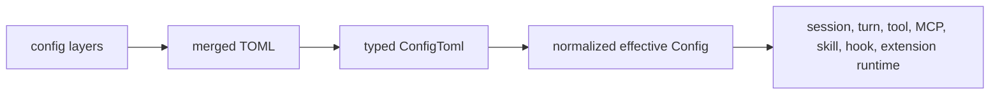

That matters because the runtime should not ask:

```text
Did the user set this random option somewhere?
```

It should ask:

```text
What is the effective runtime policy for this thread?
```

Codex has several separate but connected configuration concepts:

1. `profiles`
   - Bundles of model, provider, reasoning, tools, feature, and UI-ish settings.

2. Permission profiles
   - Filesystem and network access policy.
   - Can extend built-in or custom profiles.

3. Agent roles
   - Subagent type definitions such as `default`, `explorer`, and `worker`.
   - Can apply extra config at spawn time.

4. Feature flags
   - Central switches for capabilities such as hooks, memory, plugins, apps, goals, multi-agent v2, web search, image generation, network proxy, and token budget.

5. MCP server config
   - Transport, approval policy, allowed tools, disabled tools, OAuth, env vars, timeouts, and requirement filtering.

6. Skills
   - `SKILL.md` packages discovered from repo, user, system, plugin, and `.agents` locations.
   - Metadata is advertised in context; full skill bodies are injected only when selected.

7. Plugins and apps
   - Capability bundles that can contribute skills, MCP servers, hooks, app connectors, and summaries.

8. Hooks
   - Event callbacks around prompts, tools, permissions, compaction, session start/stop, and subagent start/stop.

9. Extensions
   - Typed runtime contribution points for adding context, tools, MCP servers, lifecycle behavior, approval review, token usage handling, and turn item processing.

For Freeflow, the biggest lesson is:

```text
Do not solve local delegation with many duplicated profiles.
Use a small effective config object with separate provider, permission, task-policy, tool, memory, trace, and verification settings.
```

## Pass Scope Boundary

Done in this pass:

- Config source layering.
- Merge and precedence model.
- Runtime `Config` as the normalized contract.
- Profile versus permission-profile distinction.
- Feature flag registry.
- MCP config mechanics.
- Skill loading and injection mechanics.
- Plugin and app connector policy.
- Hook config and hook runtime behavior.
- Agent roles and role config layering.
- Extension API and app-server extension installation.
- Freeflow implications for local delegation.

Not done in this pass:

- Full UI/TUI config analysis.
- Full enterprise managed config analysis.
- Full analytics/OTEL behavior.
- Full app connector implementation internals.
- Full plugin marketplace/install flow.
- Comparison with OpenHands, Goose, Hermes, smolagents, or Aider.

Those remaining items either belong to a later comparison pass or are not central to Freeflow's first local-agent harness.

## Source Audit Updates From This Pass

This second audit reread Pass 7 against the same Codex source snapshot and added the turn-loop details that the first version underexplained.

Key corrections:

1. Effective config is not only a startup object.
   - `Session::refresh_runtime_config` can replace the user layer for an existing session, clear skill/plugin caches, rebuild hooks, and notify config contributors when the effective config changes.

2. The turn loop consumes config through `TurnContext`, not by repeatedly reading raw TOML.
   - Prompt construction, tool visibility, permission instructions, app instructions, skill metadata, plugin summaries, feature gates, collaboration mode, output schema, and service tier are all resolved through `TurnContext` plus the session configuration.

3. Tool availability is rebuilt at sampling time.
   - `built_tools` builds a `ToolRouter` from MCP manager state, plugin capability state, app connector state, discoverable tool suggestions, extension tools, and dynamic tools.

4. Hooks and extensions are separate mechanisms.
   - Hooks are configured event handlers. Extensions are typed runtime contributors. `PermissionRequest` hooks can answer approval prompts; extension `ApprovalReviewContributor`s can claim rendered approval-review prompts. Those are related safety paths, not the same API.

5. Profiles are narrower than the whole config system.
   - Named profiles include common runtime settings, `tools`, `features`, and some UI/TUI options, but named permission profiles live under `default_permissions` and `[permissions]`, not inside `ConfigProfile`.

6. App-server extensions are a product-surface bundle.
   - Core can run with an empty extension registry. The app-server surface installs goals, guardian, memories, hosted MCP, web search, image generation, and skills extensions.

7. Pass 7 now has enough turn-loop context to guide a local harness config spec.
   - The missing piece was not more TOML detail. It was where config enters prompt assembly, tool routing, approval, lifecycle, and trace behavior.

## Core Idea

Codex treats configuration as a runtime contract.

The codebase has broad user-facing config input, but the agent loop mostly consumes a normalized effective `Config`.

In beginner terms:

```text
config.toml is the user's editable recipe.
ConfigToml is the parsed recipe.
Config is the cooked meal the runtime actually eats.
```

That separation is important because users, projects, enterprise policy, command-line overrides, profiles, and runtime session settings can all influence behavior.

If every subsystem read raw TOML directly, the codebase would become fragile:

- one module might miss profile overrides;
- another might ignore enterprise requirements;
- another might fail to resolve relative paths;
- another might accidentally read a disabled MCP server;
- another might treat legacy sandbox syntax differently.

Codex avoids that by centralizing config assembly.

## Tiny Diagram

Simplified Codex:

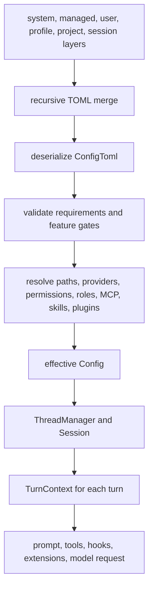

Suggested Freeflow local harness:

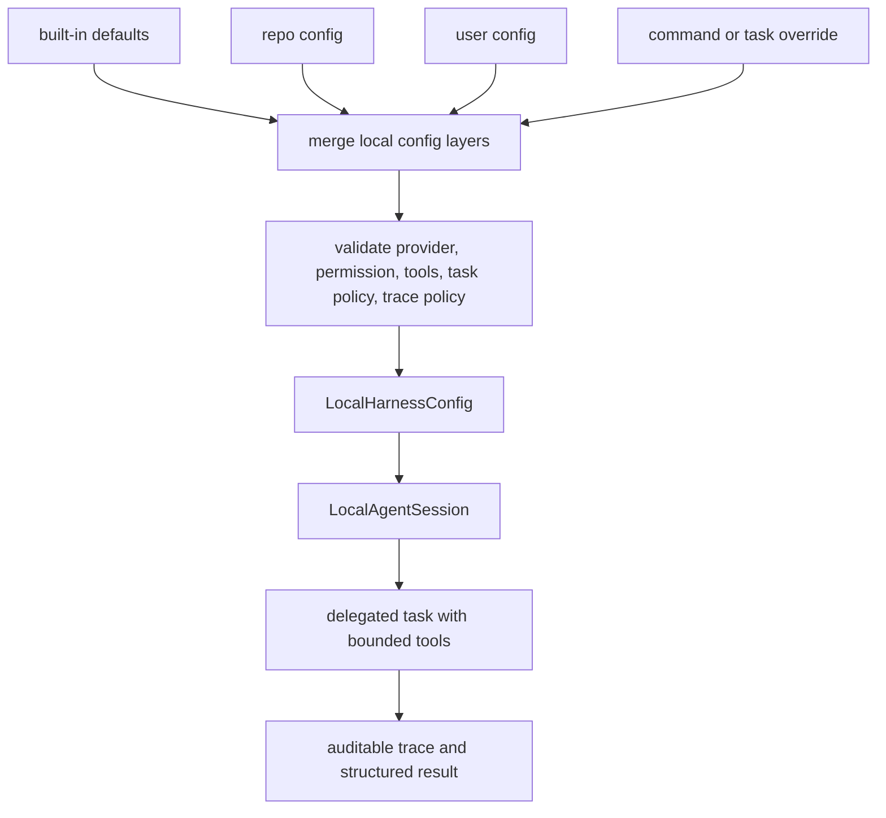

## Config Layers

Codex config is not a single file.

The config loader builds a layer stack. The loader README describes the effective precedence as higher layers overriding lower layers. Internally, the stack is stored lowest-precedence first so recursive merge can apply overlays in order.

Important layer concepts:

- System layer.
- Enterprise managed layer.
- User `config.toml`.
- User profile config.
- Project `.codex/config.toml`.
- Session flags and CLI overrides.
- Legacy managed preferences.
- Requirements layers.
- Disabled layer tracking.
- Per-key origin metadata.

Each layer can carry:

- source name;
- raw TOML;
- resolved config folder;
- version/fingerprint;
- disabled reason;
- hook config folder override.

The practical design lesson:

```text
Store where config came from.
Do not just store the final values.
```

This makes warnings, debugging, reloads, and policy enforcement possible.

## Raw ConfigToml Versus Effective Config

`ConfigToml` is the broad raw user-facing schema.

It includes fields for:

- model and review model;
- provider;
- context window and compaction settings;
- approval policy;
- sandbox and permission profiles;
- shell environment policy;
- instructions;
- MCP servers;
- model providers;
- project docs;
- tool output limits;
- profiles;
- history;
- SQLite and rollout paths;
- file opener;
- TUI;
- reasoning;
- web search;
- tools;
- tool suggestion;
- agents;
- memories;
- skills;
- hooks;
- plugins;
- marketplaces;
- features;
- apps;
- desktop;
- telemetry.

The effective `Config` is the normalized runtime object.

It contains already-resolved values such as:

- selected model and provider;
- model metadata;
- permission profile;
- approval policy;
- cwd and workspace roots;
- tool output limits;
- loaded model providers;
- MCP config input;
- plugin config input;
- memory config;
- feature flags;
- agent concurrency/depth;
- agent role configs;
- app policy;
- hooks config;
- environment executables;
- Codex home, log home, SQLite home, rollout home.

The important rule:

```text
Runtime code should prefer ConfigBuilder / effective Config.
Runtime code should not casually deserialize raw ConfigToml and call it truth.
```

Codex even has source comments warning that direct `ConfigToml` loading is deprecated for most callers because it can bypass requirements enforcement.

## Profiles Are Not The Whole System

This matters for Freeflow because we noticed repeated tool lists under profiles.

In Codex, profiles are useful, but they do not carry the whole architecture.

There are several separate mechanisms:

- `profiles`
  - Named bundles of common runtime settings.

- `permissions`
  - Named filesystem/network profiles, with inheritance.

- `features`
  - Central capability gates.

- `agents`
  - Named subagent roles.

- `skills`
  - Discoverable instruction packages.

- `plugins`
  - Capability bundles.

- `mcp_servers`
  - Tool server catalog entries.

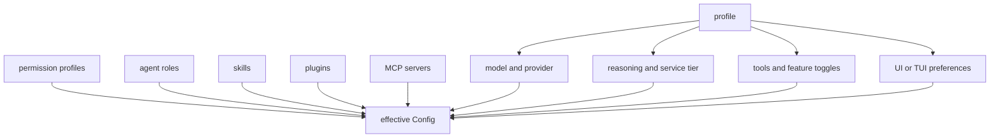

The design lesson:

```text
Use profiles for convenience.
Use policies and capability tags for correctness.
```

For Freeflow local delegation, that means we should avoid this shape:

```toml
[profiles.research-local]
tools = ["read", "rg", "sed", "summarize", "trace"]

[profiles.review-local]
tools = ["read", "rg", "sed", "summarize", "trace"]

[profiles.code-local]
tools = ["read", "rg", "sed", "summarize", "trace", "patch"]
```

That repeats too much.

A cleaner shape is:

```toml
[local_delegation]
provider = "mlx"
model = "gemma-4-12b"
default_task_policy = "read_only_research"

[local_delegation.tool_sets.read_only]
allow = ["read_file", "list_files", "search"]

[local_delegation.tool_sets.patch_propose]
allow = ["read_file", "list_files", "search", "propose_patch"]

[local_delegation.task_policies.research]
tool_set = "read_only"
max_context_files = 12
require_evidence = true

[local_delegation.task_policies.review]
tool_set = "read_only"
require_findings = true
require_confidence = true
```

Profiles can still exist, but they should select these smaller reusable parts.

## Permission Profiles

Codex permission profiles are separate from normal profiles.

They can define:

- workspace roots;
- filesystem entries;
- network entries;
- inheritance through `extends`;
- built-in parents such as `:read-only`, `:workspace`, and `:danger-full-access`.

Validation catches:

- undefined parent profiles;
- cycles;
- reserved custom names starting with `:`.

For Freeflow local delegation, this is one of the most useful patterns to copy.

The local model should not receive broad write access by default.

Suggested v0 permission profiles:

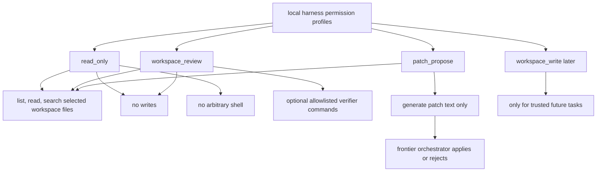

The main orchestrator should treat local output as evidence, not authority.

## Feature Flags

Codex has a centralized feature registry.

Features include capabilities such as:

- shell tool;
- unified exec;
- code mode;
- web search;
- memory tool;
- child AGENTS.md behavior;
- network proxy;
- collaboration;
- multi-agent v2;
- apps;
- MCP apps;
- plugins;
- remote plugins;
- image generation;
- skill MCP dependency install;
- guardian approval;
- goals;
- token budget;
- auth elicitation;
- personality;
- artifacts;
- fast mode.

Some features are simple booleans. Others carry nested config.

Examples:

- `multi_agent_v2`
  - max concurrent threads;
  - wait timeout defaults;
  - usage hints;
  - tool namespace;
  - prompt text;
  - non-code-mode-only behavior.

- `code_mode`
  - enabled flag;
  - excluded tool namespaces.

- `network_proxy`
  - proxy settings and domain policies.

Managed features can pin or constrain feature state. That lets the runtime say:

```text
The config requested X, but policy requires Y.
```

For Freeflow, the local harness should also have explicit feature flags:

```text
tools_enabled
patch_proposals_enabled
shell_enabled
write_enabled
background_runs_enabled
parallel_local_agents_enabled
local_memory_enabled
trace_capture_enabled
mlx_streaming_enabled
```

This is better than scattering booleans throughout the code.

## MCP Configuration

Codex treats MCP servers as a resolved catalog.

MCP config includes:

- stdio transport;
- streamable HTTP transport;
- local versus remote environment IDs;
- enabled/disabled state;
- required state;
- startup timeout;
- tool timeout;
- per-server default tool approval mode;
- enabled tools;
- disabled tools;
- per-tool approval overrides;
- OAuth client config;
- OAuth resource;
- scopes;
- env vars;
- HTTP headers;
- bearer token env var.

Two safety details matter:

1. Inline bearer tokens are rejected or skipped.
   - The user must use an environment variable.

2. Requirements can disable MCP servers.
   - Disabling is identity-aware by command or URL.

Codex also merges MCP contributions from:

- user config;
- plugins;
- app compatibility server;
- runtime extensions.

For Freeflow local delegation, we probably do not need full MCP server management in v0.

But we should copy the policy shape:

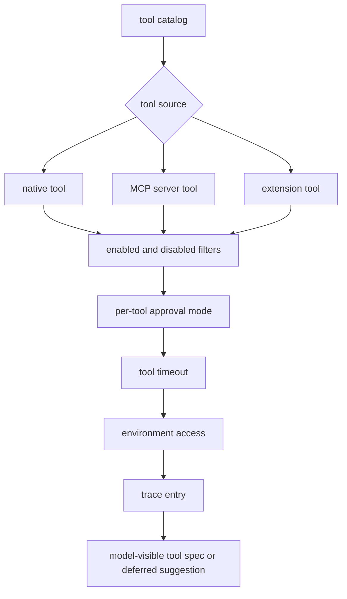

## Skills

Codex skills are discovered from multiple roots:

- repo `.codex/skills`;
- user `$CODEX_HOME/skills`;
- user `$HOME/.agents/skills`;
- embedded system skills;
- system `/etc/codex/skills`;
- plugin skill roots;
- extra roots;
- repo `.agents/skills`.

A skill is centered on `SKILL.md`.

The loader:

- discovers skill roots;
- deduplicates by path;
- sorts by scope;
- applies config rules;
- renders metadata into prompt context;
- injects full skill instructions only when selected.

The important design is progressive disclosure:

```text
Advertise skill summaries.
Load full skill instructions only when needed.
```

For Freeflow local delegation, this is directly useful.

The local model should not receive all Freeflow skill text. It should receive:

- a task-specific system/developer instruction;
- a compact local-delegation policy;
- maybe one selected skill or distilled skill excerpt;
- the exact output contract.

The frontier orchestrator can still see and enforce the richer Freeflow skill set.

## Plugins And Apps

Codex plugins are capability bundles.

A plugin can contribute:

- skills;
- MCP servers;
- hooks;
- app-facing metadata;
- capability summaries.

The plugin manager loads configured and remote-installed plugins, filters by product restriction, applies skill config rules, and produces capability summaries.

Apps have their own config:

- global default app config;
- per-app config;
- enabled/disabled;
- approvals reviewer;
- destructive tool policy;
- open-world tool policy;
- default tool approval;
- per-tool approval and enabled settings.

The practical lesson:

```text
Do not think of plugins as just prompts.
Do not think of apps as just tools.
They are policy-bearing capability bundles.
```

For Freeflow, this supports the earlier packaging decision:

```text
Freeflow should remain the portable workflow/policy layer.
The local harness should be an optional companion runtime.
```

The plugin can teach Codex/Claude/Gemini how and when to call the local harness. The companion runtime can own the actual model loop, tool execution, traces, and local provider adapters.

## Hooks

Codex hooks are configured event handlers.

Hook events include:

- `PreToolUse`;
- `PermissionRequest`;
- `PostToolUse`;
- `PreCompact`;
- `PostCompact`;
- `SessionStart`;
- `UserPromptSubmit`;
- `SubagentStart`;
- `SubagentStop`;
- `Stop`.

Hook handlers can be:

- command handlers;
- prompt handlers;
- agent handlers.

Command hooks receive JSON on stdin, run through the configured shell, capture stdout/stderr, and obey timeouts.

Important behavior:

- `PreToolUse` can block a tool call.
- `PreToolUse` can return updated tool input.
- `PermissionRequest` can return approval decisions.
- `PostToolUse` runs after successful tool output.
- Stop hooks differ between root sessions and thread-spawned subagents.
- Plugin hooks can receive plugin-root/data environment variables.
- Managed requirements can force only managed hooks.

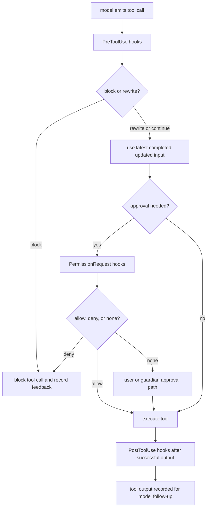

One small but important detail:

```text
allow_managed_hooks_only belongs in requirements.toml, not config.toml.
```

For Freeflow local delegation, v0 probably should not copy Codex hooks.

But we should copy the lifecycle idea:

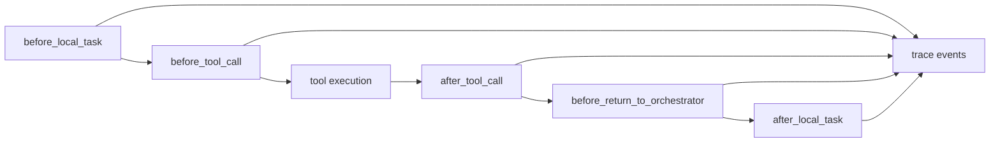

In v0, those can be internal harness events written into traces rather than user-configurable hook scripts.

## Agent Roles

Agent roles are Codex's config-backed way to define subagent types.

The raw config supports:

- max threads;
- max depth;
- job max runtime;
- interrupt message;
- user-defined roles;
- role descriptions;
- role config files;
- nickname candidates.

Roles can be declared inline or discovered from an `agents` directory next to a config layer.

Built-in roles include:

- `default`;
- `explorer`;
- `worker`.

The source also contains an `awaiter.toml`, but the built-in role registration for `awaiter` is commented out at the inspected snapshot.

The role application flow is important:

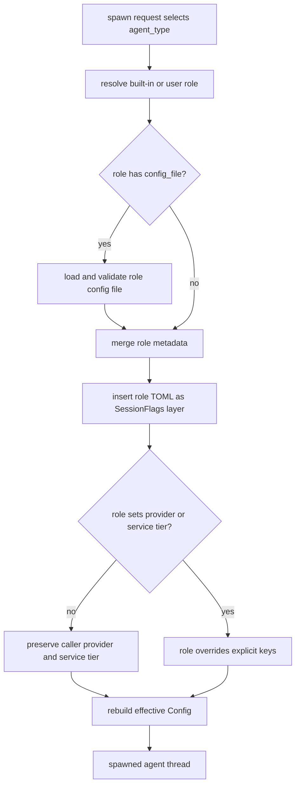

This is elegant because a role is not just a prompt. It can change runtime configuration.

For Freeflow local delegation, we should borrow the concept but simplify the implementation:

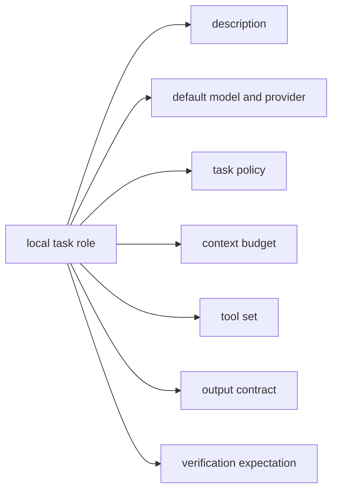

Example local roles:

```text
reader
  read/search only; summarize evidence.

reviewer
  read/search only; produce findings with confidence and file references.

patch_planner
  read/search only; produce patch plan, not writes.

patch_proposer
  read/search plus generate patch text; orchestrator applies.

judge
  compare two outputs; produce verdict and uncertainty.
```

These are roles, not frontier-model replacements.

## Extensions

Codex has a formal extension API.

The extension registry supports typed contributor traits:

- `McpServerContributor`
  - Add or remove runtime MCP server entries.

- `ContextContributor`
  - Add prompt fragments during prompt assembly.

- `ThreadLifecycleContributor`
  - Handle thread start, resume, idle, and stop.

- `TurnLifecycleContributor`
  - Handle turn start, stop, abort, and error.

- `TurnInputContributor`
  - Add turn-local model-visible contextual fragments.

- `ConfigContributor`
  - Observe effective config changes.

- `TokenUsageContributor`
  - Observe token usage updates.

- `ToolContributor`
  - Expose native tools.

- `ToolLifecycleContributor`
  - Observe tool start and finish.

- `ApprovalReviewContributor`
  - Claim rendered approval-review prompts.

- `TurnItemContributor`
  - Mutate or process parsed turn items before emission.

The registry has typed state stores:

- session-level extension data;
- thread-level extension data;
- turn-level extension data;
- initial thread data.

This matters because extensions can coordinate state without being given all internal session objects.

The core runtime accepts an extension registry. The app-server layer installs the standard bundle:

- goal extension;
- guardian extension;
- memories extension;
- hosted MCP extension;
- web search extension;
- image generation extension;
- skills extension.

Other surfaces can run with an empty extension registry.

That split is a strong architecture boundary:

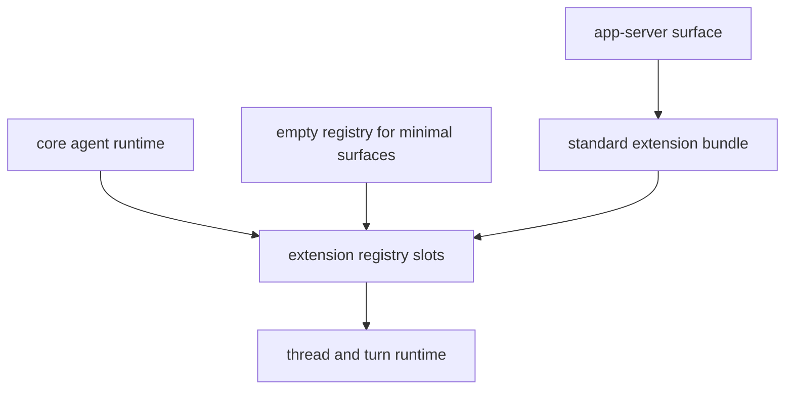

For Freeflow, a future local harness could use a smaller extension system, but v0 does not need the full machinery.

The first local harness can start with explicit internal interfaces:

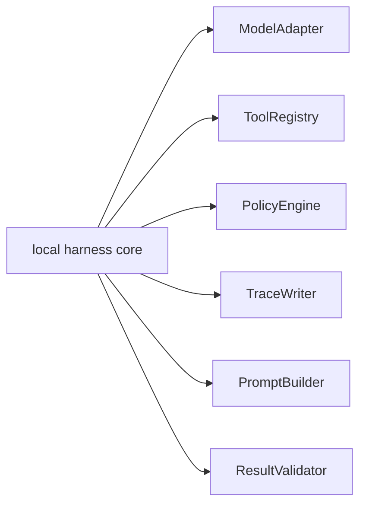

If it grows, those can become extension points later.

## Turn Loop Integration From Source Audit

The first Pass 7 draft explained config pieces, but it did not show how those pieces enter the live turn loop.

The important source path is:

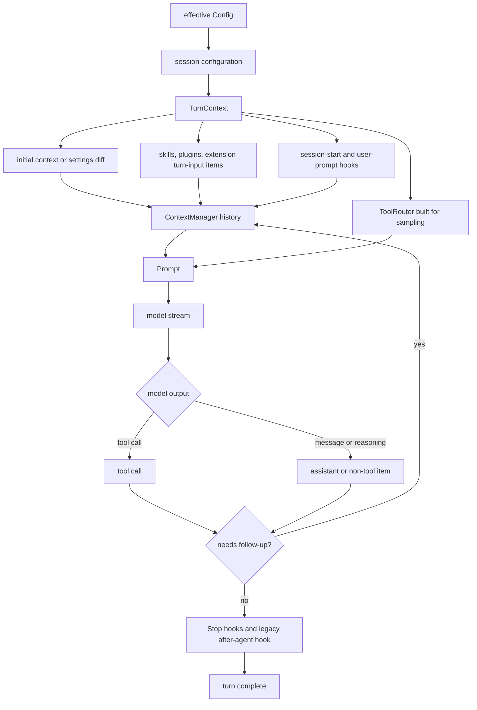

In source terms, `run_turn` starts with a `Session`, a `TurnContext`, turn-scoped extension data, submitted `TurnInput`, an optional prewarmed model session, and a cancellation token.

The rough order is:

1. Run pre-sampling compaction if needed.
2. Record full initial context or a settings diff from the current `TurnContext`.
3. Build skill, plugin, connector, and extension turn-input injection items.
4. Run pending session-start hooks and user-prompt hooks.
5. Record injected items and track resolved config analytics for the turn.
6. Enter the sampling loop.
7. Build prompt input from `ContextManager` history.
8. Build the current `ToolRouter`.
9. Stream the model response.
10. Execute tool calls and record outputs, or record assistant/non-tool items.
11. Continue if a tool output, pending input, `end_turn = false`, new context window, or compaction requires another sampling request.
12. When no follow-up is needed, run Stop hooks and legacy after-agent hook, then finish.

This means Pass 7 should not describe config as a static boot-time concern. Effective config is part of every turn's prompt, tools, approvals, hooks, extension state, analytics, and context-window behavior.

### Tool Call Path Inside A Turn

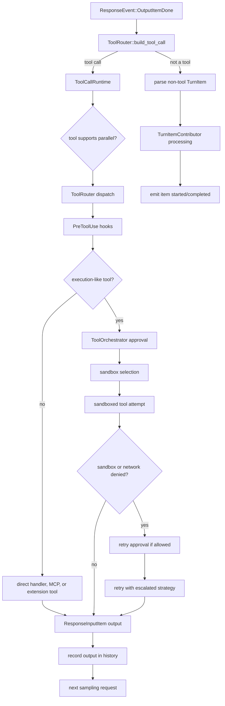

Two details matter for a local harness design:

- The model does not execute tools directly. It emits tool requests; the host runtime validates, gates, dispatches, records, and feeds outputs back.
- The tool router is turn-aware and config-aware. It includes core tools, MCP tools, app/plugin behavior, extension tools, dynamic tools, and deferred discoverable tools.

### Runtime Config Refresh Path

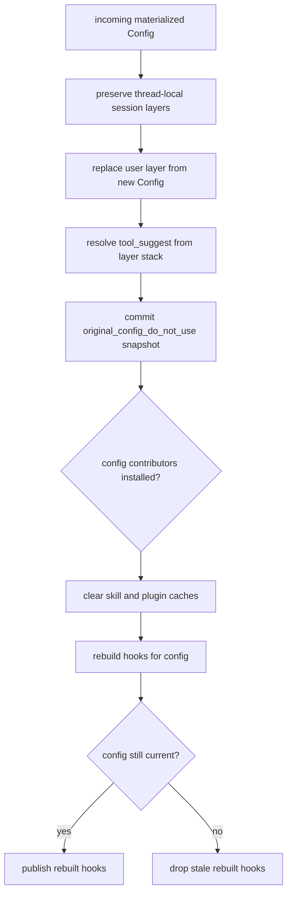

`refresh_runtime_config` is deliberately conservative. It refreshes the user layer from a new materialized snapshot, preserves session-local layers, clears skills/plugins caches, rebuilds hooks, and only publishes the rebuilt hook registry if the config snapshot is still current.

That is useful for Freeflow because local harness config should have the same principle even if it is much smaller:

```text
Reload user-owned config without destroying task-scoped overrides.
Clear caches whose inputs came from config.
Do not publish stale rebuilt runtime state after an overlapping refresh.
```

## Freeflow Design Translation

Codex's config/extensibility architecture points toward this Freeflow shape:

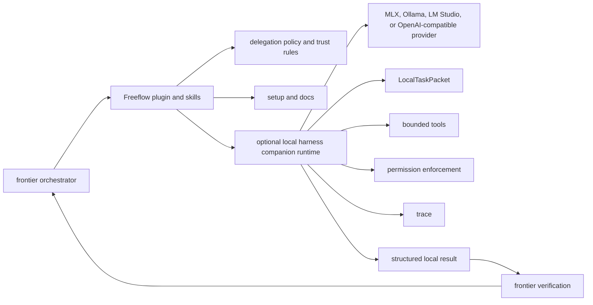

The local model should not be treated as a magical second Codex.

It should be treated as:

```text
a fast, cheap, local worker with limited context, bounded tools, explicit output schema, and mandatory evidence.
```

The frontier orchestrator remains responsible for:

- deciding whether to delegate;
- choosing task type;
- preparing the task packet;
- checking local output;
- deciding whether to trust, ignore, retry, or escalate.

## Suggested Local Harness Config Shape

This is not a final spec. It is a research-derived starting point.

```toml
[local_delegation]
enabled = true
default_provider = "mlx"
default_model = "gemma-4-12b"
trace_dir = ".freeflow/local-runs"
max_parallel_agents = 2

[local_delegation.providers.mlx]
kind = "openai_chat_completions"
base_url = "http://127.0.0.1:8080/v1"
timeout_seconds = 120
stream = true

[local_delegation.permissions]
protected_metadata = [".git", ".agents", ".codex"]
denied_reads = ["**/.env", "**/.env.*", "**/*.pem", "**/*.key", "**/id_rsa", "**/id_ed25519", "**/.npmrc", "**/.pypirc", "**/.netrc"]

[local_delegation.permissions.read_only]
filesystem = "read"
shell = "disabled"
network = "disabled"

[local_delegation.permissions.patch_propose]
filesystem = "read"
shell = "disabled"
network = "disabled"
patch = "propose_only"

[local_delegation.tool_sets.search_reader]
allow = ["list_files", "read_file", "search"]

[local_delegation.tool_sets.review_reader]
allow = ["list_files", "read_file", "search", "summarize_diff"]

[local_delegation.tool_sets.patch_proposer]
allow = ["list_files", "read_file", "search", "summarize_diff", "propose_patch"]

[local_delegation.roles.reader]
description = "Answer a narrow codebase or document question with citations."
permission_profile = "read_only"
tool_set = "search_reader"
max_context_files = 10
require_evidence = true

[local_delegation.roles.reviewer]
description = "Review a scoped diff or artifact and return findings."
permission_profile = "read_only"
tool_set = "review_reader"
require_confidence = true
require_file_references = true

[local_delegation.roles.patch_proposer]
description = "Prepare a proposed patch for orchestrator review."
permission_profile = "patch_propose"
tool_set = "patch_proposer"
output = "patch_text"
write_files = false
```

Important: repeated profiles are avoided. Roles compose provider, permission, tool set, and output contract. Shell stays disabled in this starting shape; if a future local verifier needs shell, make it an explicit allowlisted verifier capability rather than a profile default.

## What Freeflow Should Borrow

Borrow these ideas directly:

1. Effective runtime config.
   - Build one normalized config object before running a local task.

2. Config origin tracking.
   - Know whether a value came from defaults, repo config, user config, or command override.

3. Permission profiles.
   - Keep read/write/network/shell policy separate from task roles.

4. Feature flags.
   - Gate writes, shell, parallelism, memory, tracing, and provider-specific behavior explicitly.

5. Agent roles.
   - Define local task types as config-backed roles, not one-off prompts.

6. Tool catalog with per-tool policy.
   - Each tool should have allowed/disabled state, timeout, and trace behavior.

7. Progressive skill/context injection.
   - Give the local model only the selected policy/instructions needed for the task.

8. Extension/lifecycle thinking.
   - Even if v0 does not expose hooks, design around clear lifecycle points.

9. App-server/core split.
   - Keep the local runtime core generic; let Freeflow plugin setup decide when to install/use it.

10. Structured trace.
   - Every local result should have evidence, tool calls, denied actions, and config summary.

## What Freeflow Should Not Copy Yet

Do not copy these in v0:

- enterprise managed config;
- MDM preferences;
- full hook scripting;
- plugin marketplace;
- remote plugin install flow;
- app connector approval system;
- full MCP server manager;
- full extension API;
- complex profile-v2 behavior;
- config lock replay;
- background memory consolidation;
- guardian approval subagents.

Those are production-scale features, but they are too much for the first local harness.

The first harness should prove:

```text
Can a local MLX model handle delegated subtasks fast, cheaply, and safely enough to reduce frontier token use without degrading output?
```

Everything else should support that proof.

## Beginner-Friendly Pseudocode

This is the shape Freeflow should aim for:

```python
def run_local_delegation(request):
    raw_config = load_config_layers(
        defaults="built_in_defaults.toml",
        user="~/.freeflow/config.toml",
        repo=".freeflow/config.toml",
        override=request.override_config,
    )

    config = build_effective_local_config(raw_config)
    role = config.roles[request.role]
    policy = config.permission_profiles[role.permission_profile]
    tools = build_tool_registry(config.tool_sets[role.tool_set], policy)
    adapter = build_model_adapter(config.providers[role.provider])

    task_packet = build_local_task_packet(
        objective=request.objective,
        role=role,
        selected_context=request.context,
        output_schema=role.output_schema,
        constraints=request.constraints,
    )

    trace = TraceWriter(config.trace_dir)
    result = run_agent_loop(
        model=adapter,
        tools=tools,
        task_packet=task_packet,
        policy=policy,
        trace=trace,
    )

    validated = validate_local_result(result, role.output_schema)

    return LocalAgentResult(
        answer=validated.answer,
        evidence=validated.evidence,
        confidence=validated.confidence,
        uncertainty=validated.uncertainty,
        trace_path=trace.path,
        used_tools=trace.used_tools,
        denied_actions=trace.denied_actions,
    )
```

The goal is not to copy Codex's Rust implementation. The goal is to copy the separation of concerns.

## Design Risk Notes

Risk: too many profiles.

Mitigation:

```text
Use composable roles + permission profiles + tool sets.
```

Risk: local model gets too much context and becomes slow.

Mitigation:

```text
Use small LocalTaskPacket inputs and trace everything else separately.
```

Risk: local output is trusted too much.

Mitigation:

```text
Return evidence, uncertainty, confidence, and trace path. Main orchestrator verifies.
```

Risk: harness becomes a second giant Codex clone.

Mitigation:

```text
Start with model adapter, prompt builder, tool registry, policy engine, trace writer, and result validator.
Defer public extension APIs.
```

Risk: Freeflow plugin claims runtime behavior it does not ship.

Mitigation:

```text
Keep local delegation setup optional and companion-runtime based until verified.
```

## Open Questions

These should be answered in the Freeflow local harness spec, not inside this research artifact:

1. Should the first local harness be written in Python, TypeScript, or Rust?
2. Should MLX be the default provider or just the first optimized provider?
3. Should local agents ever write files in v0, or only return proposed patches?
4. Should local harness traces live under `.freeflow/local-runs/` or another tool-owned directory?
5. Should roles be configured in `.freeflow/config.toml`, a separate `local-delegation.toml`, or both?
6. Should the frontier orchestrator call the harness through CLI, MCP, or both?
7. Should local memory exist in v0, or should every local run be stateless?
8. What benchmark proves local delegation saves frontier tokens without quality loss?
9. How much local trace should be injected back into frontier context by default?
10. How should Freeflow skills instruct Codex/Claude/Gemini to choose local delegation?
11. Should the local harness support live config refresh, or should every local task run with an immutable task-scoped config snapshot?
12. Which config-derived caches must be invalidated when local providers, skills, tools, or policy rules change?

## Next Research Passes

The canonical pass index and roadmap should live in:

```text
docs/research/codex-cli-agent-harness/README.md
```

Current local state after this Pass 7 audit:

```text
Pass 8 now exists as 2026-06-13-pass-8-agent-harness-comparisons.md and is marked Complete.
Pass 7 now has config-to-turn-loop details that should feed the local harness spec.
```

Recommended next work:

1. Reconcile the README pass index with the existing Pass 8 artifact if the index is being maintained in the same cleanup round.
2. Then write the Freeflow local delegation harness design spec from Passes 3, 6, 7, and 8.

## Source Evidence Appendix

Source snapshot:

```text
repo: openai/codex
commit: b65fe3d8976d6fcc44ee6c6cf988654af5fc4d2d
short: b65fe3d
commit date: 2026-06-12
commit title: fix: serialize auth environment tests (#27879)
local path: /private/tmp/openai-codex-study-pass0
```

Most relevant files:

```text
codex-rs/config/src/config_toml.rs
  Raw user-facing config schema.

codex-rs/config/src/state.rs
  Config layer stack, layer metadata, active user layer, effective user config.

codex-rs/config/src/loader/README.md
  Config loader architecture and precedence model.

codex-rs/config/src/merge.rs
  Recursive TOML merge behavior.

codex-rs/core/src/config/mod.rs
  Effective runtime Config, ConfigBuilder, MCP conversion, feature/config resolution.

codex-rs/config/src/profile_toml.rs
  Named profile schema.

codex-rs/config/src/permissions_toml.rs
  Permission profile TOML schema, inheritance, validation.

codex-rs/core/src/config/permissions.rs
  Built-in permission profiles and effective permission behavior.

codex-rs/features/src/lib.rs
  Feature registry, feature state, feature normalization.

codex-rs/features/src/feature_configs.rs
  Nested feature config for code mode, multi-agent v2, and network proxy.

codex-rs/core/src/config/managed_features.rs
  Managed/pinned feature handling.

codex-rs/config/src/mcp_types.rs
  MCP server config, tool approval modes, transport validation, env/OAuth fields.

codex-rs/core/src/mcp.rs
  Runtime MCP manager and extension MCP contributions.

codex-rs/core/src/config/agent_roles.rs
  Agent role discovery, role config file parsing, role validation.

codex-rs/core/src/agent/role.rs
  Applying role layers at spawn time and built-in role descriptions.

codex-rs/core/src/agent/builtins/awaiter.toml
  Awaiter role config file present in source, though registration is commented out at this snapshot.

codex-rs/config/src/skills_config.rs
  Skill config schema.

codex-rs/core-skills/src/loader.rs
  Skill root discovery and ordering.

codex-rs/core-skills/src/config_rules.rs
  Skill enable/disable rules by path or name.

codex-rs/core-skills/src/render.rs
  Available skill metadata rendering and context budget.

codex-rs/core-skills/src/injection.rs
  Explicit skill mention detection and full skill instruction injection.

codex-rs/ext/skills/src/extension.rs
  Skills extension contribution to prompt context, turn input, and tools.

codex-rs/core-plugins/src/manager.rs
  Plugin manager inputs and effective plugin roots.

codex-rs/core-plugins/src/loader.rs
  Plugin capability loading, hooks-only loading, plugin skill roots.

codex-rs/config/src/plugin_edit.rs
  Plugin config persistence.

codex-rs/config/src/hook_config.rs
  Hook config schema and hook event names.

codex-rs/core/src/hook_runtime.rs
  Hook runtime requests and hook event execution.

codex-rs/config/src/requirements_layers/hooks.rs
  Requirements-level hook merging and managed hook constraints.

codex-rs/hooks/src/registry.rs
  Hook registry creation and legacy notify bridge.

codex-rs/hooks/src/engine/discovery.rs
  Hook discovery from config layers and plugins.

codex-rs/hooks/src/engine/dispatcher.rs
  Hook dispatch, event matching, concurrent execution, ordered results.

codex-rs/hooks/src/engine/command_runner.rs
  Command hook process execution.

codex-rs/hooks/src/events/pre_tool_use.rs
  PreToolUse hook request and outcome behavior.

codex-rs/hooks/src/events/permission_request.rs
  PermissionRequest hook decisions for allow/deny approval handling.

codex-rs/hooks/src/events/post_tool_use.rs
  PostToolUse hook request and outcome behavior.

codex-rs/ext/extension-api/src/contributors.rs
  Extension contributor traits.

codex-rs/ext/extension-api/src/registry.rs
  Extension registry and registration slots.

codex-rs/ext/extension-api/src/state.rs
  Typed extension data stores.

codex-rs/core/src/session/mod.rs
  Config refresh, prompt assembly, extension prompt contribution integration.

codex-rs/core/src/session/turn.rs
  `run_turn`, sampling loop, skill/plugin injection, tool router construction, and turn input contributor integration.

codex-rs/core/src/tools/router.rs
  Extension tool collection.

codex-rs/core/src/tools/parallel.rs
  ToolCallRuntime, parallel tool gating, cancellation, and tool-output response shaping.

codex-rs/core/src/tools/orchestrator.rs
  Approval, sandbox selection, network approval, retry, and denial handling for tool execution.

codex-rs/core/src/tools/lifecycle.rs
  Tool lifecycle contributor start/finish notifications.

codex-rs/core/src/tasks/lifecycle.rs
  Turn/thread lifecycle contributor calls.

codex-rs/core/src/stream_events_utils.rs
  Turn item contributor integration.

codex-rs/app-server/src/extensions.rs
  Standard extension bundle installed by the app-server surface.
```

## Current Research State

At the end of Pass 7:

```text
We understand how Codex configures the harness.
We understand why profiles are useful but insufficient alone.
We understand how permissions, features, roles, plugins, skills, hooks, MCP, apps, and extensions fit together.
We understand where effective config enters prompt assembly, tool routing, approval handling, extension callbacks, and turn-loop continuation.
We understand enough to design a smaller Freeflow local-harness config model.
```

The next Codex-only technical gap is no longer more broad config inventory. The next useful step is to turn Passes 3, 6, 7, and 8 into a Freeflow-specific local harness spec with explicit config, policy, trace, and verification contracts.
