# Codex CLI Agent Harness Study - Pass 8 Agent Harness Comparisons

> **Doc ID:** RESEARCH-2026-06-13-codex-cli-agent-harness-pass-8
> **Date:** 2026-06-13
> **Owner:** Hassan Mohiddin
> **Type:** Research
> **Status:** Complete - audited 2026-06-14; Pi addendum added 2026-06-15
> **Source:** Recovered Pass 8A/8B chat context after compaction, temporary handoff, local Pass 0-7 artifacts, Freeflow local delegation design docs, primary external sources refreshed on 2026-06-13, current Codex CLI source spot-check at `0fed4497f50ad5f0b2f7972a1bfd14c5a09a85c5`, primary external-source spot-checks on 2026-06-14, and Pi source audit on 2026-06-15 at `bb959aae017eedc8edaa91d01d0475d483ea9371`.

## Purpose

Preserve the comparison research for open-source agent harnesses and frameworks that can inform Freeflow's optional local delegation harness.

This pass follows the Codex CLI architecture study in Passes 0-7. Codex remains the deepest local reference. Pass 8 asks what to borrow, avoid, or simplify from other agent systems before designing a small Freeflow companion harness.

This document is research memory, not an implementation plan. It does not define shipped Freeflow behavior.

## Recovery Note

This artifact was created after chat compaction. Pass 8A and Pass 8B were first completed in chat without a saved artifact. The notes below reconstruct those passes from:

- `/private/tmp/freeflow-codex-cli-agent-harness-tmp-handoff-2026-06-13.md`
- local research artifacts under `docs/codex-cli-agent-harness/`
- `docs/designs/local-delegation-harness-design.md`
- `docs/research/2026-06-10-local-model-delegation-routing.md`
- fresh primary-source checks for external projects on 2026-06-13

Treat this file as evidence-linked continuation memory. Before implementation work, re-open the relevant live docs or repositories.

## Audit Pass 1 - 2026-06-14

This first audit pass focused on structure, Mermaid diagrams, and current Codex CLI source alignment. It did not re-fetch every external project source. Treat the OpenHands, Goose, Aider, smolagents, PydanticAI, LangGraph, and Hermes sections as research memory from the 2026-06-13 source refresh unless a later pass explicitly revalidates them. Audit Pass 2 below provides that later spot-check for the highest-drift external claims.

Current Codex CLI source was checked at:

- repo path: `/private/tmp/openai-codex-study-current`
- commit: `0fed4497f50ad5f0b2f7972a1bfd14c5a09a85c5`
- commit title: `[codex] Carry exec-server cwd as PathUri (#28032)`

Source-backed additions from this audit:

- Codex's turn loop is still centered on `run_turn` in `codex-rs/core/src/session/turn.rs`.
- `ModelClientSession` is created once per turn and reused across retries/follow-up sampling within that turn, not reused across unrelated turns.
- A turn now clearly includes pre-sampling compaction, context updates, skill/plugin/extension injection, pending-input handling, prompt construction, streaming response handling, tool execution, token accounting, mid-turn compaction, and stop-hook handling.
- Codex current source has a real multi-agent control plane under `codex-rs/core/src/agent/`: `AgentControl`, `AgentRegistry`, thread-spawn metadata, agent paths, completion notifications, fork modes, execution caps, and MultiAgent V2 residency behavior.
- Pass 8's recommendation remains valid, but the Codex evidence makes the "parent-created child runs with bounded control-plane metadata" lesson stronger than the original comparison-only synthesis.

Current Codex source anchors:

- turn loop: `codex-rs/core/src/session/turn.rs:137` (`run_turn`)
- sampling and stream handling: `codex-rs/core/src/session/turn.rs:1030` (`run_sampling_request`), `codex-rs/core/src/session/turn.rs:1803` (`try_run_sampling_request`)
- tool routing: `codex-rs/core/src/session/turn.rs:1129` (`built_tools`)
- multi-agent usage hints: `codex-rs/core/src/session/multi_agents.rs:6`
- control plane: `codex-rs/core/src/agent/control.rs:91` (`AgentControl`), `codex-rs/core/src/agent/control.rs:400` (completion watcher), `codex-rs/core/src/agent/control.rs:477` (thread-spawn preparation)
- spawning/resume: `codex-rs/core/src/agent/control/spawn.rs:103` (`spawn_agent_with_metadata`), `codex-rs/core/src/agent/control/spawn.rs:194` (`spawn_agent_internal`), `codex-rs/core/src/agent/control/spawn.rs:524` (`resume_agent_from_rollout`)
- registry and limits: `codex-rs/core/src/agent/registry.rs:23` (`AgentRegistry`), `codex-rs/core/src/agent/registry.rs:71` (thread-spawn depth), `codex-rs/core/src/agent/control/execution.rs:14` (`AgentExecutionLimiter`)
- residency: `codex-rs/core/src/agent/control/residency.rs:17` (`V2Residency`), `codex-rs/core/src/agent/control/residency.rs:48` (residency slot), `codex-rs/core/src/agent/control/residency.rs:221` (V2 resident session source)

### Audit Scope Diagram

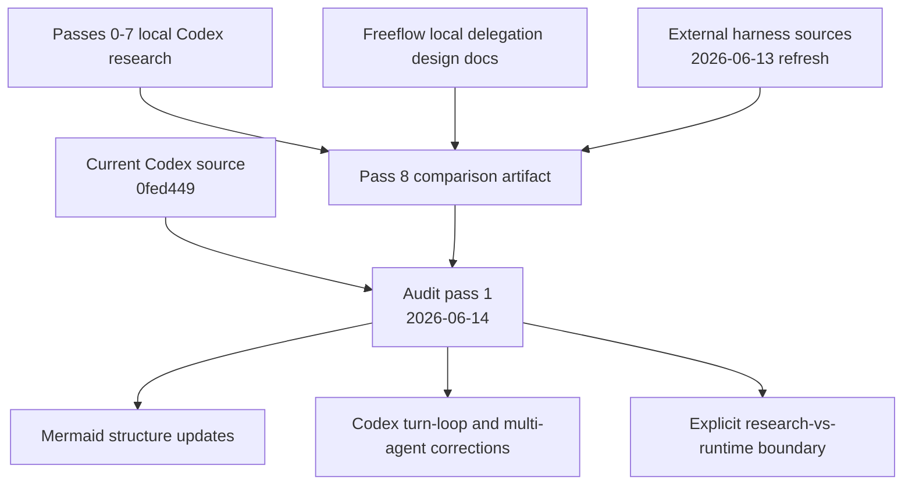

### Codex Current-Source Delta

Pass 8 compares external harnesses, but the Codex CLI source should remain the local mechanism anchor. Current source reinforces two design rules:

1. Keep the turn loop event-driven and traceable. Codex does not "ask the model once and then run tools afterward." It streams model events, starts tool work from completed tool-call items, drains tool results, records observations, and decides whether the same user turn needs follow-up sampling.
2. Keep multi-agent control out of prompt text. Codex represents spawned agents as threads with control-plane metadata, paths, status, capacity rules, fork behavior, and completion notifications. Freeflow's local helper should use a real task/run control plane too, even if it is much smaller.

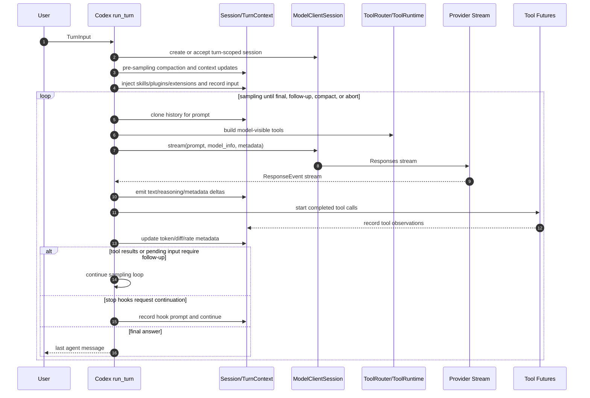

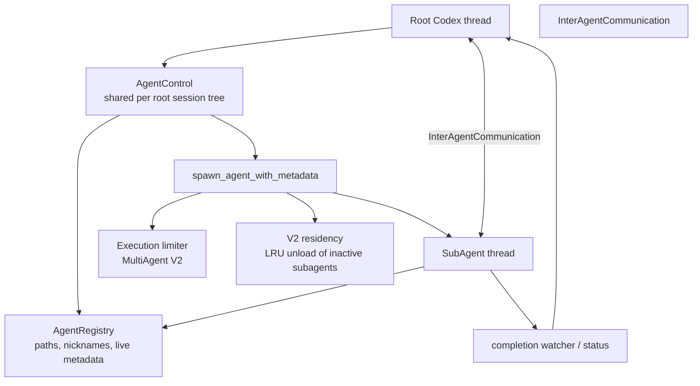

Freeflow should not copy Codex's full thread manager. The useful lesson is the separation: a child run is an addressable runtime object with identity, policy, budget, status, and trace, not merely a paragraph inside the parent's prompt.

## Audit Pass 2 - 2026-06-14 External Source Freshness

This second audit pass rechecked the most drift-prone external claims against primary project docs and repositories. It did not clone and line-audit every current external repository. Treat the web-checked external notes below as current documentation evidence, while treating line-number source claims for Codex and Hermes as pinned to the explicitly named local snapshots.

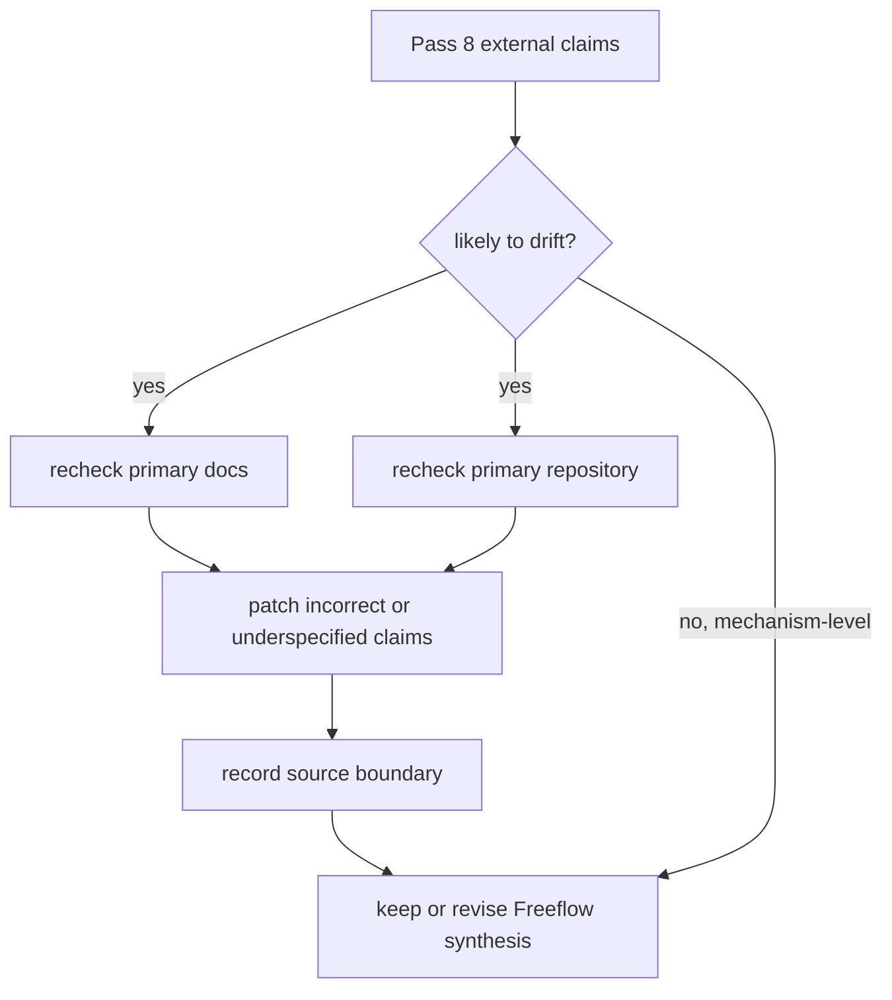

Freshness findings:

| Area | 2026-06-14 source signal | Pass 8 effect |
| --- | --- | --- |
| OpenHands | Current docs still describe the SDK as the foundation with agents, LLMs, conversations, tools, workspaces, events, and security policy; four packages remain the documented architecture; local development still runs without Docker, while production/sandboxed usage swaps workspace type. The local-LLM page now explicitly recommends `Qwen3.6-35B-A3B` and calls out 24 GB VRAM or 64 GB Apple Silicon unified memory for quantized variants. | Keep the boundary/workspace/tool conclusions. Strengthen the hardware caution for local autonomous coding. |
| Goose | Current docs confirm `goose run --no-session`, `--output-format json`, and `--output-format stream-json`. Current logging docs state saved session records live in SQLite at `sessions.db` since v1.10.0; legacy `.jsonl` sessions remain on disk but are no longer managed. Subagent docs still say autonomous mode is the default, subagents are disabled in manual/smart/chat-only modes, default max turns is 25, timeout is 5 minutes, inherited extensions are the default, and recursive subagent spawning is blocked. | Add a correction: Goose's primary session store is SQLite now. Freeflow should still use plain JSONL traces for v0 because its run shape is smaller, not because Goose currently does. |
| Aider | Current docs still support the repo-map claim: graph-ranking selects a relevant slice under a `--map-tokens` budget that defaults to 1k tokens. Current mode docs still show `code`, `ask`, `architect`, and `help`, with architect using a separate editor model. Current troubleshooting docs warn that local and quantized models are more likely to have editing problems. | Keep the repo-map, edit-mode, patch-artifact, and local-model caution conclusions. |
| smolagents | Current docs still make `CodeAgent` first-class and document `ToolCallingAgent` for JSON/text tool-calling. Secure execution docs still put sandboxing around code actions through Modal, E2B, Blaxel, or Docker. | Keep structured tool calls as Freeflow v0 default; code actions remain a later isolated tool, not the core loop. |
| PydanticAI | Current docs emphasize type safety, dependency injection, validated outputs, validation reflection, evals, observability, reusable capabilities, MCP/A2A/UI streams, human approval, and durable execution. The docs now also expose a Pydantic AI Harness capability library concept. | Keep Pydantic-style schemas as the strongest dependency candidate if the harness is Python; do not let the richer capability/harness surface leak into v0 before contracts stabilize. |
| LangGraph | Current docs explicitly position LangGraph as the orchestration runtime for durable execution, streaming, human-in-the-loop, memory, and persistence. They also position Deep Agents as an agent harness on top of LangGraph, not LangGraph itself. | Keep LangGraph as state/event vocabulary, not a mandatory v0 runtime. The Deep Agents mention reinforces the distinction between orchestration runtime and harness product. |
| Hermes Agent | Current GitHub/docs still show a broad agent product with gateway surfaces, ACP-related files, tools, skills, memory, providers, tests, and session storage. Current docs describe concurrent tool execution, intercepted stateful tools such as `todo`, `memory`, `session_search`, and `delegate_task`, SQLite persistence, and independent subagent budgets. | Keep Hermes as a broad source reference. The line-level Hermes section remains pinned to commit `1899c8f507c34338d3c66493cffd7d10ba705a8d`; re-clone before implementation if any Hermes-specific mechanism becomes load-bearing. |

The overall synthesis did not change. The strongest correction is the Goose storage correction. The strongest reinforcement is the OpenHands local-model hardware warning: Freeflow should not promise full local autonomous coding on ordinary laptop resources.

## Pass 8H Addendum - 2026-06-15 Pi Source Audit

Pi was added after the initial Pass 8 audit because it became a directly relevant comparison target for a minimal extensible terminal harness.

Current Pi source was checked at:

- repo path: `/private/tmp/pi-pass8h`
- upstream: `https://github.com/earendil-works/pi.git`
- commit: `bb959aae017eedc8edaa91d01d0475d483ea9371`
- commit date/title: `2026-06-15 fix(coding-agent): wrap tree help on narrow terminals`
- observed package version: `@earendil-works/pi-coding-agent` `0.79.3`

Source-backed additions from this addendum:

- Pi is a minimal TypeScript terminal coding harness with first-class extension, skill, prompt-template, theme, package, JSON, RPC, and SDK surfaces.
- Pi's low-level loop is a reusable event-streaming agent core, while `AgentSession` is the coding-agent runtime that adds resource loading, tools, sessions, compaction, retries, project trust, and mode bindings.
- Pi's project trust gates project-local settings/resources/extensions. It is explicitly not a sandbox or capability policy.
- Pi packages and extensions are powerful enough to implement plan mode and subprocess subagents, but they run with the user's local permissions.
- Pi is a strong mechanism reference and possible TypeScript dependency candidate, but it should not be treated as the default Freeflow local-delegation runtime without a separate language/runtime decision.

## Diagram Map

This audit starts replacing structural text sketches with Mermaid. Short code fences that are commands, schemas, file trees, or memorable one-line rules remain plain text. They are examples, not diagrams.

Key diagrams now present:

- audit scope and current Codex turn loop
- current Codex multi-agent control plane
- Freeflow host-to-local delegation path
- comparison candidate map
- harness component lens
- provider/tool/workspace boundaries
- OpenHands, Goose, Aider, frameworks, Hermes, Pi, and synthesis design translations
- policy, trace, task-kind, and implementation-sequence flows

## Prior Local Context

Freeflow's current direction is:

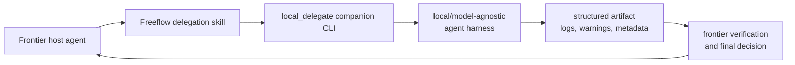

Important constraints from the local design docs:

- Freeflow remains a plugin/skill pack, not a new agent runtime.
- The local harness is optional companion software, not hidden Markdown skill behavior.
- Normal `setup-freeflow` stays compact.
- Local delegation setup belongs in a separate path, likely `setup-local-delegation`.
- Local models produce compact, checkable evidence packets.
- The frontier orchestrator verifies, reasons, and decides.
- Capability tags plus task policy plus risk gates should be the core abstraction, not many duplicated fixed profiles.

Minimum harness components already identified:

- model adapter
- turn/tool loop
- tool registry
- workspace/sandbox policy
- step and context budget
- structured outputs
- verifier
- logs and trace

## Pass 8 Plan

The comparison pass is split intentionally:

1. Pass 8A - Comparison Map
2. Pass 8B - OpenHands Deep Dive
3. Pass 8C - Goose Deep Dive
4. Pass 8D - Aider Deep Dive
5. Pass 8E - smolagents / PydanticAI / LangGraph
6. Pass 8F - Hermes Agent
7. Pass 8H - Pi
8. Pass 8I - Synthesis

Do not collapse this into one shallow feature-list comparison. Each deep dive should explain mechanisms and design tradeoffs.

## Pass 8A - Comparison Map

### Question

Which external agent systems are useful references for Freeflow's optional local delegation harness, and which deserve deeper passes?

### Candidate Map

| Candidate | Category | Primary relevance | Pass decision |
| --- | --- | --- | --- |
| OpenHands | Full software-agent SDK/platform | Agent core boundaries, typed tools, workspace abstraction, security policy, local-to-sandboxed deployment | Deep dive completed in Pass 8B |
| Goose | Native local desktop/CLI/API agent | Local machine agent ergonomics, MCP/ACP integration, subagents, adversary/security patterns, recipes/config | Deep dive completed in Pass 8C |
| Aider | Focused terminal coding agent | Repo map, git/diff workflow, file selection, edit/test discipline, undoable changes | Deep dive in Pass 8D |
| smolagents | Python agent library | Minimal loop, code agents, local/model-agnostic support, tools, sandboxed code execution options | Combined framework pass in Pass 8E |
| PydanticAI | Python agent framework | Typed agents, structured outputs, tool approval, model abstraction, evals, observability | Combined framework pass in Pass 8E |
| LangGraph | Low-level orchestration runtime | Durable stateful workflows, persistence, human-in-the-loop, graph/subgraph mental model | Combined framework pass in Pass 8E |
| Hermes Agent | Full agent project, exact target: `NousResearch/hermes-agent` | Long-lived memory, skills, gateways, subagents, terminal backends, self-improvement claims | Deep dive completed in Pass 8F after source-focused disambiguation |
| Pi | Minimal terminal coding harness, exact target: `earendil-works/pi` | Small TypeScript agent loop, provider abstraction, extension/packages surface, session tree, TUI/JSON/RPC/SDK modes | Deep dive completed in Pass 8H |

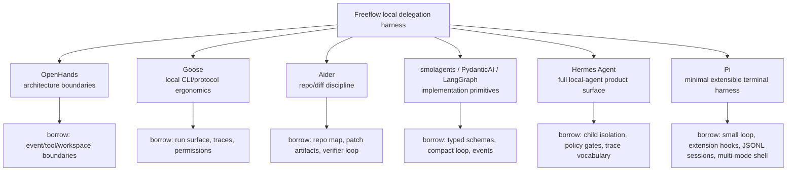

### Pass 8A Judgment

OpenHands, Goose, and Aider are the most directly comparable to the Freeflow local harness problem.

- OpenHands is the best full architecture reference.
- Goose is the best "agent lives on the user's machine and integrates with tools/protocols" reference.
- Aider is the best small focused coding-agent reference.

smolagents, PydanticAI, and LangGraph are important, but they are more useful as libraries or architectural ingredients than as product-shape references.

Hermes Agent is useful after source disambiguation, but as a mechanism reference rather than a product shape to copy.

Pi is useful as the closest minimal TypeScript harness reference: it is smaller than OpenHands/Hermes, more extensible than Aider, and already exposes TUI, JSON, RPC, and SDK integration modes. Its project-trust and package model also show why Freeflow must keep capability policy separate from extension loading.

### Harness Component Lens

Use this lens for every remaining pass:

| Harness component | What to inspect |
| --- | --- |
| Model adapter | Providers, local model support, retry/streaming, cost/latency metadata |
| Turn loop | Action/observation shape, step budget, stopping conditions, error handling |
| Tool registry | Tool schemas, discovery, dispatch, MCP or extension support |
| Workspace policy | Filesystem access, command execution, local vs remote execution |
| Sandbox/permissions | Read/write boundaries, approvals, destructive operation controls |
| Memory/context | Prompt assembly, history compression, saved sessions, artifact shape |
| Subagents | Context fork, tool inheritance, concurrency caps, result consolidation |
| Trace/logging | JSONL/events, observability, replay, user-visible status |
| Verification | Tests, linting, reviewers, policy gates, structured output validation |
| Packaging | CLI shape, setup/doctor/smoke commands, optional install boundary |

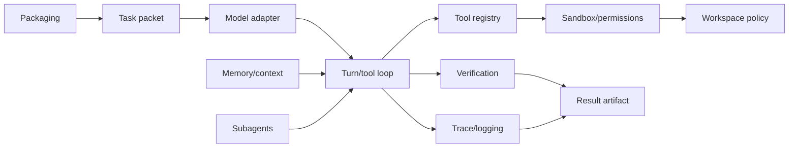

## Pass 8B - OpenHands Deep Dive

### Why OpenHands Matters

OpenHands is the strongest full software-agent harness reference in this comparison set.

It is too large to copy, but its boundaries are valuable. Its SDK documentation presents a system with agents, LLMs, conversations, tools, workspaces, events, security policy, skills, condensation, and server deployment as separable pieces rather than one tangled loop.

The Freeflow takeaway is:

```text
Copy the boundaries, not the platform.
```

### Source Refresh

Primary OpenHands sources checked for this pass:

- [SDK architecture overview](https://docs.openhands.dev/sdk/arch/overview)
- [SDK design principles](https://docs.openhands.dev/sdk/arch/design)
- [Tool System and MCP](https://docs.openhands.dev/sdk/arch/tool-system)
- [Workspace architecture](https://docs.openhands.dev/sdk/arch/workspace)
- [Security architecture](https://docs.openhands.dev/sdk/arch/security)
- [LLM architecture](https://docs.openhands.dev/sdk/arch/llm)
- [Sub-Agent Delegation](https://docs.openhands.dev/sdk/guides/agent-delegation)
- [Local LLMs](https://docs.openhands.dev/openhands/usage/llms/local-llms)

### Mechanisms That Matter

#### Four-package boundary

OpenHands V1 separates:

- `openhands.sdk`: core agent framework
- `openhands.tools`: prebuilt tools
- `openhands.workspace`: Docker/remote workspace implementations
- `openhands.agent_server`: remote API/server layer

Freeflow should keep a similar separation:


That keeps the existing plugin clean while allowing a real executable harness to grow separately.

#### Optional isolation over mandatory sandboxing

OpenHands explicitly moved away from making sandboxing universal. Local development can use `LocalWorkspace` with direct subprocess execution instead of the remote agent-server/container path. Production or higher-risk usage can swap in Docker/remote workspaces.

Freeflow should copy the principle:

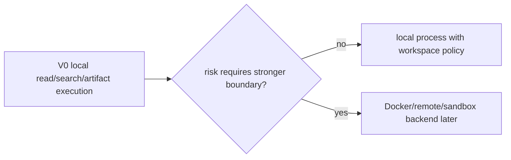

Do not require a heavy Docker-style environment for the first local delegation spike.

#### Typed tool system

OpenHands uses a typed Action/Observation/Executor pattern. Tool definitions, actions, observations, annotations, and registry are separate concepts.

Freeflow's local harness should have equivalent primitives:

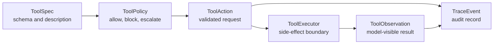

This is more important than copying any specific tool.

#### Workspace abstraction

OpenHands distinguishes local and remote workspaces. The same agent can target different execution environments by swapping workspace implementations.

Freeflow should not let tools directly assume "the host filesystem is the workspace." Even a small harness needs an explicit workspace policy object so reads, writes, shell commands, and artifact locations are auditable.

#### Provider abstraction

OpenHands uses a provider-agnostic LLM layer with retry, telemetry, and cost tracking.

Freeflow should keep the provider boundary model-agnostic:

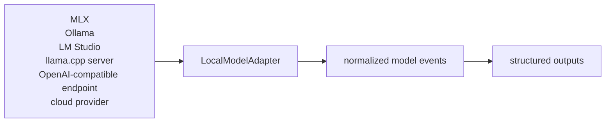

MLX can be the preferred Apple Silicon path without becoming the architecture.

#### Security and confirmation

OpenHands security includes risk assessment, confirmation policies, action validation, and event-history audit.

One caution: its documented security analyzer can capture LLM-provided risk levels from actions. That may be acceptable in a frontier-model SDK, but Freeflow should not let a weak local model be the primary source of risk classification.

Freeflow should use deterministic gates first:

- task risk level
- allowed capabilities
- denied capabilities
- workspace scope
- tool annotations
- command allowlists
- output schema validation

Optional LLM or reviewer judgment can supplement those gates, but should not replace them.

#### Subagent delegation

OpenHands subagents have:

- explicit spawn and delegate operations
- unique subagent identifiers
- separate conversation contexts
- parallel execution
- consolidated observations
- per-subagent error reporting

Freeflow should borrow:

- stable child run IDs
- separate context per child
- bounded turn budgets
- structured per-child results
- clear parent consolidation

Freeflow should not borrow same-workspace and same-tool parity by default. Local workers should usually get narrower capabilities than the frontier parent.

#### Local model warning

OpenHands' local LLM docs warn that local LLM functionality may be limited and recommend large hardware for its preferred agentic coding model path. As of the 2026-06-14 audit, the docs recommend `Qwen3.6-35B-A3B` for local software-development use and list at least 24 GB VRAM for GPU quantized variants or at least 64 GB Apple Silicon unified memory for Mac quantized variants.

That reinforces Freeflow's conservative local v0:

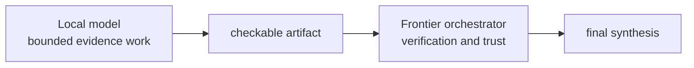

Freeflow should not promise that an ordinary laptop, or a 24 GB Apple Silicon machine, will run a full OpenHands-style coding agent reliably.

### What Freeflow Should Borrow

- A small SDK/runtime boundary instead of a prompt wrapper.
- Typed action/observation tool execution.
- A registry that separates tool definition from execution.
- Workspace abstraction even for local-only v0.
- Event trace as the integration spine.
- Provider-agnostic model adapter.
- Confirmation/policy checks before risky actions.
- Context fork and structured consolidation for subagents.
- Local mode first, stronger isolation later.

### What Freeflow Should Avoid For v0

- Full OpenHands clone.
- Multi-user web/server platform.
- GUI or browser workspace.
- Remote workspace orchestration.
- Mandatory Docker setup.
- Same-tool subagent parity.
- Local-model autonomous coding as the default promise.
- LLM self-rated risk as the primary safety gate.
- Heavy local model requirements baked into setup.

### Freeflow Design Translation

The OpenHands-inspired Freeflow local harness should look like this:

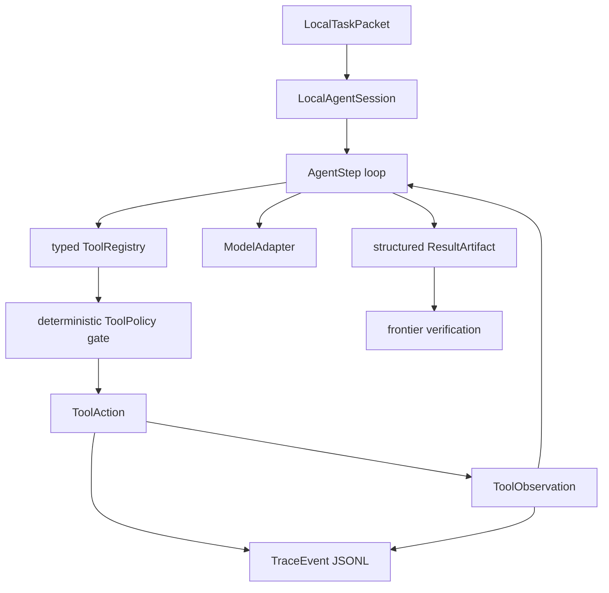

The smallest useful implementation is not:

```text
prompt local model with "act like an agent"
```

It is:

```text
give a local model a bounded task packet,
let it choose from a small typed tool set,
record each action/observation,
validate the output schema,
return compact evidence for frontier review
```

### Pass 8B Recommendation

Use OpenHands as the architecture reference for boundaries and event/tool/workspace shape.

Do not use it as the initial dependency or product surface. Freeflow's first local harness should be smaller, terminal-first, artifact-first, and conservative about local model autonomy.

## Pass 8C - Goose Deep Dive

### Why Goose Matters

Goose is the strongest reference for the "local agent as a real machine tool" shape.

OpenHands is the better architecture boundary reference. Goose is the better ergonomics and protocol reference: it has a desktop app, CLI, background server, local session history, MCP extensions, ACP integration, permission modes, recipes, subagents, structured `run` output, logging, and optional sandboxing.

The Freeflow takeaway is:

```text
Borrow the operating model, not the product shell.
```

Freeflow does not need a Goose clone. It needs a small local companion that feels executable, inspectable, configurable, and scriptable in the same broad way Goose does.

### Source Refresh

Primary Goose sources checked for this pass:

- [Goose architecture](https://goose-docs.ai/docs/goose-architecture/)
- [Extensions design](https://goose-docs.ai/docs/goose-architecture/extensions-design/)
- [Error handling](https://goose-docs.ai/docs/goose-architecture/error-handling/)
- [Guides index](https://goose-docs.ai/docs/category/guides/)
- [CLI commands](https://goose-docs.ai/docs/guides/goose-cli-commands/)
- [Running tasks](https://goose-docs.ai/docs/guides/running-tasks/)
- [Configuration files](https://goose-docs.ai/docs/guides/config-files/)
- [Logging system](https://goose-docs.ai/docs/guides/logs/)
- [Permission modes](https://goose-docs.ai/docs/guides/managing-tools/goose-permissions/)
- [Tool permissions](https://goose-docs.ai/docs/guides/managing-tools/tool-permissions/)
- [Subagents](https://goose-docs.ai/docs/guides/context-engineering/subagents/)
- [Adversary mode](https://goose-docs.ai/docs/guides/security/adversary-mode/)
- [MCP roots](https://goose-docs.ai/docs/guides/mcp-roots/)
- [Extension allowlist](https://goose-docs.ai/docs/guides/allowlist/)
- [goose in ACP clients](https://goose-docs.ai/docs/guides/acp-clients/)
- [ACP providers](https://goose-docs.ai/docs/guides/acp-providers/)
- [Code mode](https://goose-docs.ai/docs/guides/managing-tools/code-mode/)
- [macOS sandbox](https://goose-docs.ai/docs/guides/sandbox/)
- [Remote goose server](https://goose-docs.ai/docs/guides/remote-goose-server/)
- [Terminal integration](https://goose-docs.ai/docs/guides/terminal-integration/)
- [Managing projects](https://goose-docs.ai/docs/guides/managing-projects/)
- [Recipes](https://goose-docs.ai/docs/guides/recipes/)

### Mechanisms That Matter

#### Interface, agent, extensions

Goose describes three main components:

- interface: Desktop or CLI
- agent: the core interactive loop
- extensions: MCP-backed tool providers

The important design shape is that the interface can be separate from the agent, and tool capability enters through extensions rather than being baked into one prompt.

Freeflow should map that to:

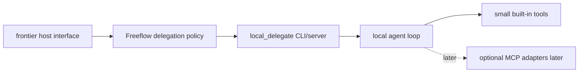

Do not hide the harness inside Markdown skill text. Goose reinforces that local delegation needs an executable runtime boundary.

#### MCP-first extension model

Goose uses MCP as its extension boundary. Its extension design exposes tools with names, descriptions, parameters, status, and async `call_tool` behavior. The docs also emphasize explicit state modification, structured status, tool-specific error handling, and tests for extensions.

Freeflow should borrow the shape even if v0 does not expose arbitrary MCP installation:

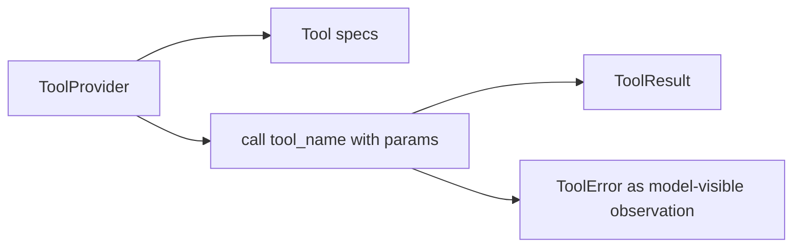

The first Freeflow harness can have a tiny built-in provider set:

- read files
- list/search files
- run allowlisted commands
- write only approved artifact paths
- maybe apply patch later

MCP can be an adapter after that, not the starting dependency.

#### `goose run` as automation surface

Goose's CLI has a useful `run` shape:

- text or instruction-file input
- stdin support
- optional interactive continuation
- named/resumable sessions
- no-session mode for one-off automation
- provider/model overrides
- built-in or external extensions per run
- max turns
- max repeated tool calls
- debug output
- JSON or streaming JSON output for automation

This is very close to the eventual `local_delegate` surface.

Freeflow should borrow:

```text
local_delegate run task.json
local_delegate run task.json --no-session
local_delegate run task.json --output-format json
local_delegate run task.json --output-format stream-json
local_delegate run task.json --max-turns 8
local_delegate run task.json --model-profile mlx-qwen
```

For delegated Freeflow tasks, `--no-session` should probably be the default mental model: each child run receives a bounded packet, emits a trace and artifact, then exits. Durable sessions are useful later for humans, but the first harness should minimize hidden memory.

#### Structured output and traces

Goose stores sessions locally and supports JSON / stream-JSON output for `run`. Current docs say saved session records moved to SQLite `sessions.db` in v1.10.0; legacy `.jsonl` session files remain on disk but are no longer managed by Goose. Its session records include metadata, messages, tool calls/results, token usage, extension data, and configuration. CLI logs include tool invocations, command execution details, session identifiers, timestamps, tool schemas, extension activity, and errors. Raw LLM request logs are still documented as rotated `.jsonl` files.

Freeflow should borrow the observability spine but keep the artifact smaller:

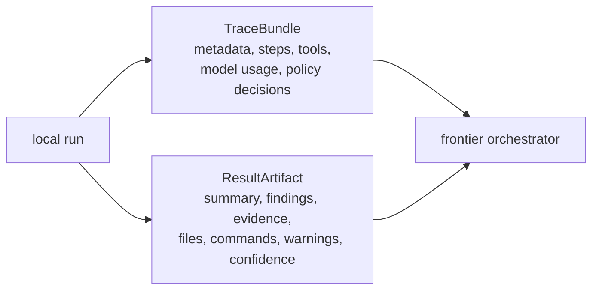

The local harness can store full traces on disk, while returning compact evidence packets to the frontier orchestrator. Freeflow's plain JSONL trace recommendation is a deliberate smaller-harness choice, not a claim that current Goose stores primary sessions as JSONL.

#### Working directory as root

Goose uses MCP Roots to share the active session working directory with roots-aware extensions. Current Goose docs describe one root per session, tied to the session working directory.

Freeflow should borrow this directly:

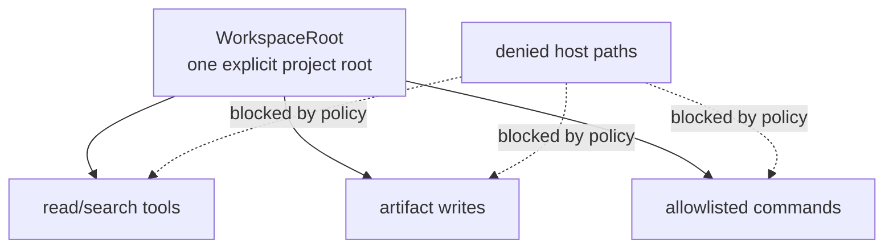

Every tool should receive that boundary. The harness should avoid implicit access to arbitrary host paths, even when running locally.

#### Permission modes and tool permissions

Goose has coarse permission modes:

- autonomous
- manual approval
- smart approval
- chat only

It also has per-tool permissions:

- always allow
- ask before
- never allow

The docs warn that autonomous mode is default. They also recommend keeping total enabled tools under 25 for performance and decision quality.

Freeflow should borrow the permission vocabulary but not the default.

For `local_delegate`, the safe default should be:

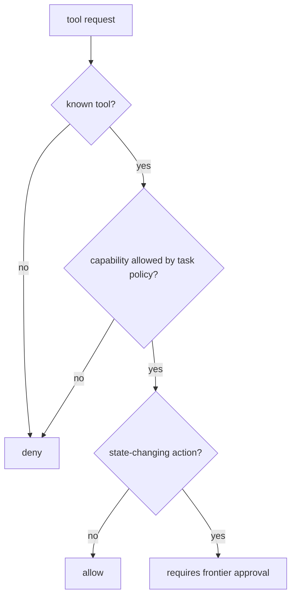

This maps well to the existing Freeflow direction: capability tags plus task policy plus risk gates.

#### Subagents

Goose subagents are independent instances that keep the main conversation focused. They can run sequentially or in parallel, expose tool-call monitoring, use direct prompts or recipes, and can even bring in external agents such as Codex through MCP.

Useful Goose defaults and constraints:

- subagents are enabled by default only in autonomous permission mode
- disabled in manual, smart approval, and chat-only modes
- default max turns is 25
- default timeout is 5 minutes
- extensions are inherited unless restricted
- child tool calls are visible with subagent identifiers
- failed or timed-out subagents may produce no output
- parallel execution returns successful results only
- subagents cannot spawn more subagents
- subagents cannot manage extensions or schedules

Freeflow should borrow the constraints, not the autonomous spawning behavior.

For Freeflow:

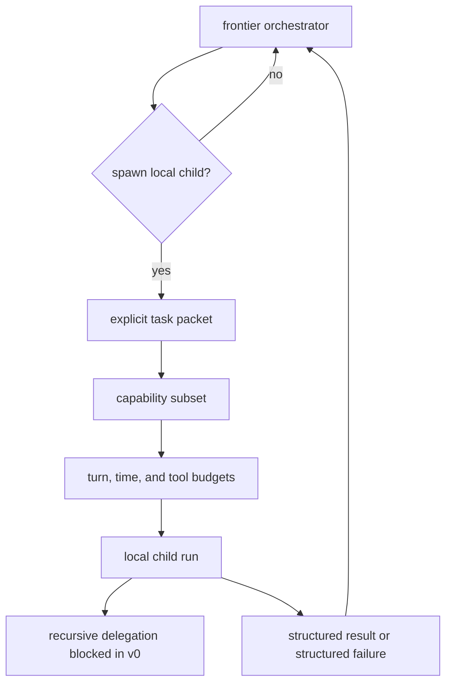

The failure behavior should differ from Goose. Freeflow should not silently lose failed child outputs. A failed local worker should return a compact failure packet with last action, error, and trace path.

#### Recipes and reusable task shapes

Goose recipes package prompts, extensions, settings, parameters, and activities into reusable workflows. They can also configure subagents.

Freeflow should treat this as evidence for a future `TaskTemplate`, but avoid making recipes the first abstraction.

First Freeflow shape:

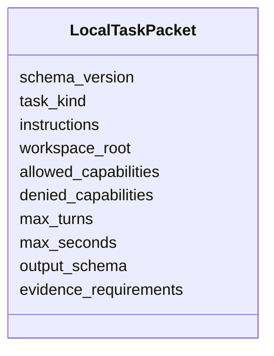

Later:

```text
TaskTemplate -> renders LocalTaskPacket
```

#### Adversary mode

Goose adversary mode adds a silent independent reviewer before selected tool calls execute. It checks the original task, recent messages, and tool call details, then returns `ALLOW` or `BLOCK`. Its rules live in a plain Markdown policy file. By default it reviews the highest-risk arbitrary-execution tools. It uses the same model/provider as Goose and fails open if the reviewer fails.

Freeflow should borrow:

- policy-as-file
- tool-call review before execution
- separate reviewer channel
- focus on high-risk tools first
- reviewer decisions in logs

Freeflow should not borrow fail-open for consequential local delegation.

For the local harness:

```mermaid
flowchart TD
  ToolCall[tool call]
  Deterministic[deterministic policy gate]
  Optional{reviewer gate configured?}
  Reviewer[reviewer gate]
  ReviewerFail{reviewer failed?}
  Risk{medium/high risk?}
  Allow[execute tool]
  Warn[continue with warning]
  Block[block and return needs_frontier_decision]

  ToolCall --> Deterministic
  Deterministic -->|block| Block
  Deterministic -->|allow| Optional
  Optional -->|no| Allow
  Optional -->|yes| Reviewer
  Reviewer -->|allow| Allow
  Reviewer -->|block| Block
  Reviewer -->|failed| ReviewerFail
  ReviewerFail --> Risk
  Risk -->|no| Warn --> Allow
  Risk -->|yes| Block
```

A weak local model should never be the primary safety authority over its own shell/file actions.

#### ACP as future integration, not v0 dependency

Goose supports ACP in both directions:

- `goose acp` lets ACP clients connect to Goose over stdio JSON-RPC.
- Goose can use ACP agents such as Codex or Claude Code as providers, passing Goose extensions through as MCP servers.

This is important protocol evidence. It suggests Freeflow should keep its local companion protocol-shaped, not just CLI-shaped.

But v0 should not require ACP. The stable Freeflow contract should be the task packet and result artifact. ACP can become an adapter later:

```mermaid
flowchart LR
  Contract[LocalTaskPacket / ResultArtifact]
  CLI[CLI adapter first]
  ACP[ACP adapter later]
  MCP[MCP adapter later]

  Contract --> CLI
  Contract -. future .-> ACP
  Contract -. future .-> MCP
```

#### Context revision

Goose documents context revision for token management: summarize with faster/smaller models, remove old or irrelevant content, use find-and-replace instead of rewriting large files, use `ripgrep`, and summarize verbose command output.

Freeflow should borrow the discipline, not an opaque context mutator.

For the harness:

- cap file reads
- cap command output
- summarize large observations with trace links
- keep original observations in the trace
- make context trimming visible in run metadata

#### Code mode

Goose Code Mode is a programmatic MCP tool-calling approach. It exposes a few meta-tools, discovers enabled tools on demand, batches calls, chains intermediate results locally, and asks the model to write JavaScript executed in a Deno-based runtime.

That is powerful, but too much for Freeflow v0.

Freeflow should start with a small explicit tool registry. On-demand tool discovery is a later optimization only if the harness really needs many tools.

#### Sandbox, allowlists, and remote server

Goose Desktop has optional macOS sandboxing using Apple's `sandbox-exec` and an outbound proxy. It also has an extension allowlist mechanism for controlling which MCP servers can be installed. Goose Desktop can run a local or remote `goosed` backend, with TLS required for remote server connections.

Freeflow should borrow the threat model:

- file access boundaries
- network policy
- extension allowlists
- remote execution as an explicit trust boundary

Freeflow should avoid copying the Desktop-specific implementation into v0. The first companion CLI can use workspace scoping, command allowlists, no network by default for risky tasks, and traceable configuration before adding OS-level sandboxing.

### What Freeflow Should Borrow

- Real executable companion surface, not a prompt wrapper.
- `run` command ergonomics for one-off delegated tasks.
- JSON and stream-JSON output for automation and progress.
- Explicit provider/model profiles.
- Max turns, timeouts, and repeated-tool-call guards.
- Local traces with compact returned artifacts.
- MCP-style tool provider boundary.
- One explicit workspace root per run.
- Permission vocabulary: allow, ask, deny.
- Small enabled tool set as a quality and safety feature.
- Recipe-like task templates later, after the packet schema stabilizes.
- Subagent caps: child IDs, timeouts, turn budgets, capability restrictions, no recursive spawn.
- External-agent protocol awareness through ACP/MCP, but only as a future adapter.
- Policy-as-file for risky tool review.
- Context/output trimming that leaves trace evidence behind.
- Extension allowlist concept for any future MCP expansion.

### What Freeflow Should Avoid For v0

- Desktop app.
- Terminal shell integration.
- Background server as the only execution mode.
- Default autonomous mode.
- Arbitrary MCP server installation.
- Broad tool sets.
- Code Mode / model-written JavaScript tool orchestration.
- ACP provider complexity as an initial dependency.
- Silent subagent failure.
- Recursive subagents.
- Same-tool inheritance for local children.
- Fail-open reviewer behavior for medium/high-risk actions.
- Hidden durable sessions as the default for delegated tasks.
- Remote execution before the local trust model is proven.

### Freeflow Design Translation

The Goose-inspired local harness should feel like this:

```text
local_delegate doctor
local_delegate smoke
local_delegate run task.json --output-format stream-json --trace trace.jsonl
```

And internally:

```mermaid
flowchart TD
  Packet[LocalTaskPacket]
  TaskPolicy[TaskPolicy]
  Workspace[WorkspaceRoot]
  Allowlist[ToolAllowlist]
  Session[LocalAgentSession]
  Adapter[ModelAdapter]
  Registry[small ToolRegistry]
  Permission[deterministic PermissionGate]
  Reviewer[optional ReviewerGate]
  Stream[AgentStep stream]
  Result[ResultArtifact]
  Trace[TraceBundle]
  Frontier[frontier verification]

  Packet --> TaskPolicy --> Workspace --> Allowlist --> Session
  Session --> Adapter
  Session --> Registry --> Permission --> Reviewer --> Stream
  Stream --> Result --> Frontier
  Stream --> Trace --> Frontier
```

The key difference from Goose:

```text
Goose is a full local user-facing agent.
Freeflow local_delegate is a bounded child-worker runtime for a frontier orchestrator.
```

That means Freeflow can be smaller and stricter:

- no user-facing desktop
- no broad extension ecosystem by default
- no autonomous delegation by local model
- no hidden trust transfer from frontier model to local model
- no final answer authority in local output

### Pass 8C Recommendation

Use Goose as the ergonomics and protocol-awareness reference for `local_delegate`.

Borrow the `run` surface, structured output, local trace discipline, one-root workspace model, permission vocabulary, subagent constraints, and protocol-shaped extension thinking.

Do not adopt Goose itself as the harness dependency and do not copy its product surface. Freeflow's first local harness should be a smaller, stricter CLI companion that accepts task packets and returns compact evidence artifacts for frontier verification.

## Pass 8D - Aider Deep Dive

### Why Aider Matters

Aider is the strongest focused coding-agent reference in this comparison set.

OpenHands teaches harness boundaries. Goose teaches local agent ergonomics and protocol surface. Aider teaches how a small terminal coding agent stays useful inside a real git repository without pretending that the whole machine is one giant editable prompt.

The Freeflow takeaway is:

```text
Borrow the repo discipline, not the pair-programming product.
```

Freeflow's local harness should not become an interactive Aider clone. But if `local_delegate` ever supports coding-style subtasks, it needs Aider-like discipline around which files are editable, which files are context only, how patches are represented, how diffs are surfaced, how tests feed repair, and how user-owned work is protected.

### Source Refresh

Primary Aider sources checked for this pass:

- [Usage](https://aider.chat/docs/usage.html)
- [Repository map](https://aider.chat/docs/repomap.html)
- [Git integration](https://aider.chat/docs/git.html)
- [In-chat commands](https://aider.chat/docs/usage/commands.html)
- [Chat modes](https://aider.chat/docs/usage/modes.html)
- [Linting and testing](https://aider.chat/docs/usage/lint-test.html)
- [Scripting aider](https://aider.chat/docs/scripting.html)
- [Edit formats](https://aider.chat/docs/more/edit-formats.html)
- [File editing problems](https://aider.chat/docs/troubleshooting/edit-errors.html)
- [Model warnings](https://aider.chat/docs/llms/warnings.html)
- [YAML config file](https://aider.chat/docs/config/aider_conf.html)
- [Specifying coding conventions](https://aider.chat/docs/usage/conventions.html)
- [Supported languages](https://aider.chat/docs/languages.html)

### Mechanisms That Matter

#### Explicit editable files

Aider's core interaction starts by adding specific files to the chat. The docs recommend adding only the files that need editing, because too many files can overwhelm the model. Aider can infer files, but its best path still asks the user to think about the edit set.

Freeflow should borrow this as a policy primitive:

```mermaid
flowchart LR
  Editable[editable_files<br/>may be changed only if policy allows]
  Readable[readable_context_files<br/>may be read and cited]
  RepoMap[repo_map_context<br/>summarized orientation only]

  Editable -. distinct from .-> Readable
  Readable -. distinct from .-> RepoMap
  RepoMap -. does not imply edit permission .-> Editable
```

For local delegation, a coding task packet should distinguish:

- files the local worker may edit
- files it may read in full
- files it may cite from summarized repo context
- paths it must not touch

Do not give the local model broad workspace-write authority because the repo root is available.

#### Repo map

Aider's repository map is the most valuable mechanism in this pass. It builds a concise map of the whole git repo, including important symbols and signatures, and sends the most relevant portions with each request. The docs describe graph ranking over dependency relationships and a token budget controlled by `--map-tokens`, with a 1k-token default.

Freeflow should copy the idea, not necessarily the exact implementation:

```mermaid
flowchart LR
  Files[file list]
  Symbols[symbol map]
  Ranking[dependency/relevance ranking]
  Budget[token/byte budget]
  Slice[bounded context slice]

  Files --> Symbols --> Ranking --> Budget --> Slice
```

For `local_delegate`, the first version can be simpler:

- file list from `rg --files`
- selected file snippets around matches
- language-aware symbol extraction only where cheap
- explicit token/byte budget
- trace note explaining what context was omitted

The important discipline is that the local model sees a bounded, relevant map instead of whole-repo sprawl.

#### Git as safety boundary

Aider is tightly integrated with git. It auto-commits AI changes, protects dirty files by committing preexisting user work separately before edits, exposes `/diff`, and offers `/undo` for AI changes.

Freeflow should not auto-commit in v0, but it should borrow the safety semantics:

```mermaid
flowchart TD
  Start[before local coding task]
  Status[capture git status]
  Dirty[detect dirty files]
  DirtyEditable{dirty editable files?}
  Refuse[refuse or require explicit policy]
  Run[run local coding task]
  Patch[produce patch/diff]
  Touched[list files touched]
  Existing[list preexisting dirty files]
  Visible[never hide user-owned changes]

  Start --> Status --> Dirty --> DirtyEditable
  DirtyEditable -->|yes| Refuse
  DirtyEditable -->|no| Run
  Refuse --> Run
  Run --> Patch --> Touched --> Existing --> Visible
```

For delegated workers, "undo" should usually mean "discard the generated patch/artifact" rather than "rewrite git history." The frontier orchestrator should decide whether to apply or reject local changes.

#### Diff and edit formats

Aider uses model-specific edit formats, including whole-file output, search/replace diff blocks, fenced diff variants, and simplified unified diffs. The docs also acknowledge that weaker models can fail to follow edit formats, and local or quantized models are more prone to editing problems.

This matters directly for local models.

Freeflow should not start by letting a local model write directly to source files. A safer v0 shape is:

```mermaid
flowchart LR
  Model[local model]
  Patch[PatchArtifact]
  Parse[deterministic parser validation]
  DryRun[dry-run patch apply]
  Verify[optional lint/test commands]
  Frontier[frontier decides whether to apply]

  Model --> Patch --> Parse --> DryRun --> Verify --> Frontier
```

When a patch cannot be parsed or applied, return a structured failure packet. Do not keep asking the local model to mutate files until something sticks.

#### Ask, code, and architect modes

Aider separates different work modes:

- `ask`: discuss code without edits
- `code`: make edits
- `architect`: one model proposes a solution and an editor model turns it into file edits
- `help`: answer usage/config questions

Freeflow should borrow the mode separation as task kinds:

```mermaid
flowchart TD
  TaskKind{task kind}
  Research[research<br/>read, search, summarize<br/>no edits]
  Review[review<br/>inspect diff, findings<br/>no edits]
  Patch[patch<br/>propose PatchArtifact]
  Repair[repair<br/>use failed verifier output<br/>propose next patch]

  TaskKind --> Research
  TaskKind --> Review
  TaskKind --> Patch
  TaskKind --> Repair
```

The architect/editor split is also useful, but in Freeflow the frontier model is usually the architect and the local model is usually an evidence worker or patch drafter. A weak local model should not become both planner and editor for risky code changes.

#### Lint and test feedback loop

Aider can run linters and tests after edits. It expects failed lint/test commands to produce stdout/stderr and non-zero exit codes, then uses that feedback to try repairs.

Freeflow should borrow this loop, but keep execution policy explicit:

```text
allowed_verifiers:
  - npm test -- --runInBand
  - pytest path/to/test.py
  - cargo test -p crate_name

local worker may run only allowed verifier commands
failed output is summarized into observations
full output is stored in trace
repair loops are capped
```

For local delegation, the verifier is evidence. Passing tests do not make the local model authoritative.

#### Scripting surface

Aider can run one instruction and exit with `--message` or `--message-file`, supports streaming controls, dry-run, auto-commit toggles, and Python API usage through `Coder`.

This confirms the design direction from Goose:

```text
local_delegate run task.json
```

Freeflow should prefer a one-shot, scriptable child-run surface for frontier delegation. Interactive chat can come later, if ever.

#### Read-only conventions

Aider supports loading convention files as read-only context, including through config. This is a small but important pattern.

Freeflow should include read-only instruction/context files in task packets:

```text
readonly_context:
  - AGENTS.md
  - CONTEXT.md
  - docs/adr/...
```

The harness should be able to read them, cite them, and obey them, but never edit them unless explicitly included in `editable_files`.

#### Local model warning

Aider's troubleshooting docs are blunt that local and quantized models are more likely to have editing-format problems.

That reinforces the same conservative conclusion as OpenHands:

```mermaid
flowchart LR
  Local[local model<br/>bounded code evidence<br/>draft patches]
  Frontier[frontier orchestration]
  Apply[patch application decision]
  Merge[merge readiness claim]

  Local --> Frontier --> Apply --> Merge
```

### What Freeflow Should Borrow

- Explicit editable file set.
- Separate read-only context files.
- Repo-map idea: bounded whole-repo context, not whole-repo dumping.
- Token/byte budgets for repo context.
- File add/drop mental model as task-packet scope.
- Patch artifacts instead of direct source mutation for v0.
- Deterministic patch parsing and dry-run apply.
- Diff-first reporting.
- Dirty-worktree detection before any coding task.
- Clear files-touched list.
- Lint/test commands as structured verifier tools.
- Capped repair loops from failing verifier output.
- Ask/review/patch/repair mode separation.
- One-shot scripting surface.
- Conventional project instructions as read-only context.
- Local-model caution around edit conformance.

### What Freeflow Should Avoid For v0

- Interactive pair-programming CLI.
- Auto-committing local worker changes.
- Letting the local model write source files directly.
- Letting the local worker run arbitrary shell commands as tests.
- Broad file auto-add without policy.
- Treating repo map context as permission to edit.
- Depending on model-specific edit formats as the only safety layer.
- Undo through git history rewriting.
- Human-facing slash command surface.
- Assuming local or quantized models can reliably follow complex patch formats.

### Freeflow Design Translation

The Aider-inspired coding task should look like this:

```mermaid
classDiagram
  class LocalCodingTaskPacket {
    task_kind patch_or_review_or_repair
    workspace_root
    editable_files
    read_only_files
    repo_map_budget
    allowed_commands
    denied_paths
    output_schema
  }
```

And the local run should produce:

```mermaid
classDiagram
  class PatchArtifact {
    summary
    rationale
    patch
    files_touched
    tests_suggested
    tests_run
    verifier_results
    risks
    apply_status
    trace_path
  }
```

The smallest useful Aider-inspired loop is:

```mermaid
flowchart TD
  Git[inspect git status]
  Context[build bounded repo context]
  Read[read allowed files]
  Model[ask model for structured patch or review]
  Parse[parse output]
  Patch{patch task?}
  DryRun[dry-run patch]
  Verifier{allowed verifiers configured?}
  RunVerifier[run allowed verifier commands]
  Return[return artifact for frontier review]

  Git --> Context --> Read --> Model --> Parse --> Patch
  Patch -->|yes| DryRun --> Verifier
  Patch -->|no| Verifier
  Verifier -->|yes| RunVerifier --> Return
  Verifier -->|no| Return
```

### Pass 8D Recommendation

Use Aider as the coding-discipline reference for `local_delegate`.

Borrow repo maps, editable/read-only context boundaries, patch/diff artifacts, dirty-worktree protection, lint/test repair loops, and local-model caution.

Do not adopt Aider as the harness dependency for v0 and do not make local workers auto-commit or directly mutate source files. Freeflow's coding delegation should start as patch proposal plus evidence, with the frontier orchestrator deciding whether to apply.

## Pass 8E - smolagents / PydanticAI / LangGraph

### Why This Combined Pass Matters

These three projects are less useful as product-shape references than OpenHands, Goose, or Aider. They are more useful as ingredient references.

The Freeflow takeaway is:

```text
Borrow the primitives; avoid inheriting a whole framework shape too early.
```

For `local_delegate`, the question is not "which framework wins?" It is "which concepts reduce custom harness risk without making Freeflow depend on a large orchestration stack before the task packet, tool policy, trace, and result artifact are stable?"

### Source Refresh

Primary sources checked for this pass:

- [smolagents introduction](https://huggingface.co/docs/smolagents/index)
- [smolagents intro to agents](https://huggingface.co/docs/smolagents/conceptual_guides/intro_agents)
- [smolagents guided tour](https://huggingface.co/docs/smolagents/guided_tour)
- [smolagents multi-step agents](https://huggingface.co/docs/smolagents/conceptual_guides/react)
- [smolagents secure code execution](https://huggingface.co/docs/smolagents/tutorials/secure_code_execution)
- [PydanticAI overview](https://pydantic.dev/docs/ai/overview/)
- [PydanticAI testing](https://pydantic.dev/docs/ai/guides/testing/)
- [Pydantic Evals overview](https://pydantic.dev/docs/ai/evals/evals/)
- [PydanticAI MCP overview](https://pydantic.dev/docs/ai/mcp/overview/)
- [LangGraph overview](https://docs.langchain.com/oss/python/langgraph/overview)
- [LangGraph workflows and agents](https://docs.langchain.com/oss/python/langgraph/workflows-agents)
- [LangGraph persistence](https://docs.langchain.com/oss/python/langgraph/persistence)
- [LangGraph event streaming](https://docs.langchain.com/oss/python/langgraph/event-streaming)
- [LangGraph interrupts](https://docs.langchain.com/oss/python/langgraph/interrupts)
- [LangGraph subgraphs](https://docs.langchain.com/oss/python/langgraph/use-subgraphs)

### smolagents

#### What it is

smolagents is a compact Python agent library. Its docs emphasize minimal abstractions, model-agnostic adapters, tool support, MCP/LangChain/Hub tool integrations, and two agent styles:

- `CodeAgent`: the model writes Python code snippets as actions.
- `ToolCallingAgent`: the model emits structured JSON-style tool calls.

It also documents the basic multi-step ReAct loop:

```mermaid
flowchart TD
  Memory[structured memory/log]
  Model[model proposes action]
  Parse[harness parses action]
  Execute[harness executes action]
  Observe[harness records observation]
  Continue{continue?}
  Final[final answer/result]

  Memory --> Model --> Parse --> Execute --> Observe --> Continue
  Continue -->|yes| Model
  Continue -->|no| Final
```

That is directly aligned with the minimum Freeflow harness loop.

#### What to borrow

smolagents is useful as a reminder that the first harness can be small.

Freeflow should borrow:

- explicit model object boundary
- explicit tool list
- multi-step action/observation loop
- memory as structured agent logs, not ambient chat transcript
- step callbacks as trace hooks
- final answer checks
- distinction between code actions and structured tool calls
- local model support as one adapter among many
- sandbox warning for any model-written code path

#### What to avoid

Freeflow should not default to a `CodeAgent` style in v0.

Code actions are expressive, but they raise the security floor. smolagents itself warns that local model-generated code can be harmful, that no local Python sandbox is completely safe, and that stronger isolation may require Docker, E2B, Modal, Blaxel, or running the whole agentic system remotely.

For Freeflow:

```mermaid
flowchart TD
  Default[default action mode<br/>structured tool calls]
  Later[optional later<br/>sandboxed code execution tool]
  Avoid[avoid as core action mode<br/>model-written code]

  Default -. can add later .-> Later
  Avoid -. not v0 default .-> Default
```

The local harness should keep tools boring and typed first. A computation sandbox can be added later as one tool with narrow inputs and outputs.

### PydanticAI

#### What it is

PydanticAI is a Python agent framework built around Pydantic validation, type hints, model-agnostic providers, tool schemas, structured outputs, capabilities, MCP/A2A/UI integrations, tool approval, durable execution, evals, and observability.

It is the strongest reference in this pass for schema discipline.

#### What to borrow

Freeflow should borrow the PydanticAI mental model even if it does not adopt the dependency:

- typed task inputs
- typed result outputs
- Pydantic/JSON Schema validation
- tool schemas from function signatures
- dependency injection for workspace/model/policy resources
- validation errors fed back as retry observations
- explicit output type for every task kind
- test models or fake model adapters for deterministic harness tests
- evals as first-class harness evidence
- tool approval as a policy hook
- observability for agent/tool traces
- capabilities as reusable bundles of tools, hooks, instructions, and model settings

The most important local design translation is:

```mermaid
flowchart LR
  Packet[LocalTaskPacket]
  PacketCheck[validate before run]
  Action[ToolAction]
  ActionCheck[validate before execution]
  Observation[ToolObservation]
  ObservationCheck[validate before model sees it]
  Result[ResultArtifact]
  ResultCheck[validate before frontier return]

  Packet --> PacketCheck --> Action --> ActionCheck --> Observation --> ObservationCheck --> Result --> ResultCheck
```

That reduces the chance that local model weirdness leaks into the frontier orchestrator as vague prose.

#### What to avoid

Freeflow should avoid adopting the whole PydanticAI product surface too early:

- no need for full UI event streams in v0
- no need for A2A in v0
- no need for durable execution before one-shot child tasks work
- no need for capability package ecosystem before the local packet schema stabilizes
- no need to expose arbitrary MCP toolsets by default

But Pydantic-style validation should be non-negotiable for the custom harness.

### LangGraph

#### What it is

LangGraph is a low-level orchestration framework/runtime for long-running, stateful agents. Its docs emphasize durable execution, persistence, streaming, human-in-the-loop, memory, subgraphs, and control over agent workflows. It also distinguishes workflows with predetermined paths from agents that dynamically define process and tool use.

LangGraph is the best reference here for state and event semantics.

#### What to borrow

Freeflow should borrow concepts:

- graph/state-machine vocabulary for nontrivial harness flows
- short-term thread state versus long-term store distinction
- explicit run/thread IDs
- checkpoint-like trace points
- event stream channels
- human-in-the-loop interrupts as structured pauses
- resume tokens or commands for approval flows
- subgraph/subagent boundaries with explicit input/output schemas
- streaming projections for model output, tool events, state updates, and final output

Useful Freeflow translation:

```mermaid
flowchart LR
  Trace[TraceEvent]
  Lifecycle[lifecycle]
  Model[model]
  Tool[tool]
  Policy[policy]
  Verifier[verifier]
  Artifact[artifact]

  Trace --> Lifecycle
  Trace --> Model
  Trace --> Tool
  Trace --> Policy
  Trace --> Verifier
  Trace --> Artifact
```

And:

```mermaid
flowchart LR
  Gate[PolicyGate]
  Allow[allow]
  Block[block]
  Decision[needs_frontier_decision]

  Gate --> Allow
  Gate --> Block
  Gate --> Decision
```

This gives Freeflow a way to represent local pauses and approvals without adopting a full graph runtime on day one.

#### What to avoid

Freeflow should avoid starting with LangGraph as the required runtime.

The first `local_delegate` target is bounded child work:

```mermaid
flowchart LR
  Packet[task packet in]
  Loop[short loop]
  Output[artifact and trace out]
  Verify[frontier verifies]

  Packet --> Loop --> Output --> Verify
```

LangGraph becomes more interesting if Freeflow later needs long-running local workflows, resumable jobs, multiple local workers, or human approval inside a persisted local run. It is probably too much dependency surface for the first harness spike.

### Cross-Framework Design Lessons

#### Agents are a spectrum

smolagents explicitly frames agency as a spectrum: simple processors, routers, tool calls, multi-step agents, multi-agent systems, and code agents. That helps Freeflow avoid overbuilding.

For local delegation:

```mermaid
flowchart TD
  Task[local delegation task]
  Deterministic{deterministic workflow sufficient?}
  DeterministicPath[use deterministic workflow]
  Flexible{needs flexible tool choice?}
  ToolLoop[use tool-calling loop]
  CodeAgent{needs code-agent autonomy?}
  Isolated[require isolation and justification]
  Avoid[avoid]

  Task --> Deterministic
  Deterministic -->|yes| DeterministicPath
  Deterministic -->|no| Flexible
  Flexible -->|yes| ToolLoop
  Flexible -->|no| Avoid
  ToolLoop --> CodeAgent
  CodeAgent -->|yes| Isolated
  CodeAgent -->|no| ToolLoop
```

#### Typed boundaries are the center

Across these frameworks, the stable pieces are not the prompts. They are:

- model adapter
- tool schema
- action parser
- observation shape
- state/memory representation
- output schema
- trace/event stream
- test/eval harness

This supports the custom-harness direction.

#### Frameworks can be dependencies later

The first Freeflow local harness should make framework adoption reversible. If we build around stable local interfaces, we can later implement the internals with PydanticAI, LangGraph, smolagents, or a smaller custom runtime.

The stable contract should be:

```mermaid
flowchart LR
  Packet[LocalTaskPacket]
  Spec[ToolSpec]
  Action[ToolAction]
  Observation[ToolObservation]
  Policy[PolicyDecision]
  Trace[TraceEvent]
  Result[ResultArtifact]

  Packet --> Spec --> Action --> Policy --> Observation --> Result
  Action --> Trace
  Policy --> Trace
  Observation --> Trace
```

### What Freeflow Should Borrow

- smolagents: compact ReAct loop, model/tool abstractions, step callbacks, final answer checks.
- smolagents: clear distinction between structured tool-calling and code-action agents.
- smolagents: serious sandbox caution for model-written code.
- PydanticAI: typed task/output schemas and validation.
- PydanticAI: dependency injection for run resources.
- PydanticAI: validation retry/reflection pattern.
- PydanticAI: test/fake model adapters for deterministic harness tests.
- PydanticAI: evals and observability as design requirements.
- PydanticAI: tool approval as an explicit policy hook.
- LangGraph: state-machine and graph vocabulary for complex flows.
- LangGraph: checkpointer/store distinction, but simplified.
- LangGraph: event stream channels and typed projections.
- LangGraph: interrupts as structured `needs_frontier_decision` pauses.
- LangGraph: subgraphs as a conceptual model for child workers.

### What Freeflow Should Avoid For v0

- Full smolagents adoption as product shape.
- CodeAgent as default action mode.
- Local execution of model-written code without strong isolation.
- PydanticAI UI/A2A/durable execution surface before needed.
- Arbitrary capability package or MCP expansion before policy is stable.
- LangGraph as mandatory runtime for one-shot child tasks.
- Long-lived local state before traces and artifacts are trustworthy.
- Framework-specific public API leakage into Freeflow docs.

### Freeflow Design Translation

The framework-inspired harness core should stay small:

```mermaid
flowchart TD
  TaskSchema[TaskSchema]
  Packet[validated LocalTaskPacket]
  Loop[AgentLoop]
  Adapter[ModelAdapter]
  Registry[ToolRegistry]
  Gate[PolicyGate]
  Trace[TraceWriter]
  ResultSchema[ResultSchema]
  Result[validated ResultArtifact]

  TaskSchema --> Packet --> Loop
  Loop --> Adapter
  Loop --> Registry
  Loop --> Gate
  Loop --> Trace
  Loop --> ResultSchema --> Result
```

For implementation:

```text
Use Pydantic-style models for schemas.
Hand-roll the first loop unless a library removes real complexity.
Keep code execution out of the default loop.
Represent approvals as structured pauses.
Persist traces, not hidden conversation authority.
```

### Pass 8E Recommendation

Use this pass as ingredients, not a dependency decision.

The first Freeflow harness should be custom and schema-first. Borrow PydanticAI-style validation and testing most aggressively. Borrow smolagents' compact loop and sandbox warnings. Borrow LangGraph's state/event/interrupt vocabulary only where the first implementation actually needs it.

Do not choose a drop-in framework yet.

## Pass 8F - Hermes Agent Deep Dive

Hermes Agent is the closest comparison target to a full local/personal agent runtime.

The question for this pass is not "is Hermes impressive?" It is:

```text
Can Freeflow use Hermes directly, or should Freeflow borrow narrower mechanisms
for a smaller optional local delegation harness?
```

### Source Snapshot And Method

Primary external sources inspected:

- [NousResearch/hermes-agent](https://github.com/NousResearch/hermes-agent)
- [README](https://raw.githubusercontent.com/NousResearch/hermes-agent/main/README.md)
- [Architecture](https://hermes-agent.nousresearch.com/docs/developer-guide/architecture)
- [Agent Loop Internals](https://hermes-agent.nousresearch.com/docs/developer-guide/agent-loop)
- [Tools Runtime](https://hermes-agent.nousresearch.com/docs/developer-guide/tools-runtime)
- [Tools & Toolsets](https://hermes-agent.nousresearch.com/docs/user-guide/features/tools)
- [Built-in Tools Reference](https://hermes-agent.nousresearch.com/docs/reference/tools-reference)
- [Security](https://hermes-agent.nousresearch.com/docs/user-guide/security)
- [Persistent Memory](https://hermes-agent.nousresearch.com/docs/user-guide/features/memory)
- [Memory Providers](https://hermes-agent.nousresearch.com/docs/user-guide/features/memory-providers)
- [Skills System](https://hermes-agent.nousresearch.com/docs/user-guide/features/skills)
- [Curator](https://hermes-agent.nousresearch.com/docs/user-guide/features/curator)
- [Gateway Internals](https://hermes-agent.nousresearch.com/docs/developer-guide/gateway-internals)
- [Session Storage](https://hermes-agent.nousresearch.com/docs/developer-guide/session-storage)

Source-level inspection used a local scratch clone:

```text
repo: https://github.com/NousResearch/hermes-agent.git
scratch path: /private/tmp/hermes-agent-pass8f
commit: 1899c8f507c34338d3c66493cffd7d10ba705a8d
project version at snapshot: hermes-agent 0.16.0
```

The clone was clean when inspected. This path is not a durable dependency; it records the exact snapshot used for the line-level findings below.

### Executive Finding

Hermes is not a prompt wrapper. It is a broad Python agent product with:

- a large `AIAgent` runtime
- CLI, gateway, ACP, batch, API, desktop/TUI, and library surfaces
- multiple API/provider modes
- a central tool registry and named toolsets
- local and sandboxed terminal backends
- memory providers and prompt-injected durable memory
- skill management and skill self-improvement flows
- session persistence, FTS search, and compression lineage
- cron/background work
- messaging gateways and authorization policy
- subagent delegation with child `AIAgent` instances

That makes Hermes a useful source reference for "what a real local agent runtime grows into."

It also makes Hermes a poor direct dependency for Freeflow's first optional local delegation harness. Freeflow needs compact, checkable helper runs under a frontier orchestrator. Hermes is a whole personal-agent platform.

The correct Freeflow move is:

```mermaid
flowchart LR
  Hermes[Hermes full agent product]
  Borrow[borrow mechanisms<br/>loop, tool registry boundaries,<br/>child isolation, policy gates,<br/>trace vocabulary]
  Avoid[avoid product surface<br/>gateway, autonomous memory,<br/>autonomous skill mutation,<br/>broad backend matrix]
  Freeflow[Freeflow local_delegate v0]

  Hermes --> Borrow --> Freeflow
  Hermes --> Avoid -. out of scope .-> Freeflow
```

### System Shape

The package boundary matters. In `pyproject.toml`, Hermes defines a real Python package with exact-pinned core dependencies, optional extras, and CLI entry points:

- project metadata and Python bound: `pyproject.toml:8-20`
- exact pinning policy and lazy dependency rationale: `pyproject.toml:24-44`
- `[all]` extra policy that excludes lazy-install backends after supply-chain concerns: `pyproject.toml:238-270`
- script entry points: `hermes`, `hermes-agent`, and `hermes-acp`: `pyproject.toml:272-275`
- package/module inventory: `pyproject.toml:277-322`

This is an operating reference, not a shape Freeflow should copy wholesale.

Freeflow implication:

- keep `setup-freeflow` compact
- keep local delegation opt-in
- keep local runtime packaging separate from the plugin/skill pack
- do not pull provider, gateway, memory, messaging, and sandbox extras into Freeflow's base install

### Agent Loop

Hermes' loop is source-backed, not just documented.

`agent/conversation_loop.py` says the extracted loop drives one user turn through model call, tool dispatch, retries, fallbacks, compression, post-turn hooks, and memory/skill review nudges. `run_agent.AIAgent.run_conversation` forwards into this module.

The loop has three load-bearing regions:

1. Turn prologue: `agent/turn_context.py`
2. Main sample/tool loop: `agent/conversation_loop.py`
3. Turn finalizer: `agent/turn_finalizer.py`

Concrete source behavior:

- `build_turn_context` resets counters, creates `task_id`/`turn_id`, restores runtime, hydrates todos/nudge counters, persists the inbound user turn early, does preflight compression, runs `pre_llm_call` hooks, and prefetches external memory once before the tool loop.
- The main loop runs while both API-call and iteration budgets remain, with an optional budget grace call.
- Before each API call, Hermes repairs malformed tool-call arguments and role alternation.
- External memory and plugin context are injected into the current user message only; they are not persisted and not put into the system prompt.
- The system prompt is cached once per session and kept byte-stable for prefix/cache reuse.
- Hermes prefers streaming even without display consumers, because streaming gives stale-stream and read-timeout health checks that non-streaming lacks.
- Response validation and fallback happen before tool execution.
- The finalizer handles budget-exhaustion summaries, persists the cleaned session, appends file-mutation failure footers, records turn-exit diagnostics, returns a structured result dict, and triggers background memory/skill review after the user-visible response.

Key source anchors:

- loop extraction purpose: `agent/conversation_loop.py:1-15`
- run entry and prologue call: `agent/conversation_loop.py:371-433`
- loop budget/interrupt skeleton: `agent/conversation_loop.py:461-486`
- memory/plugin injection and stable system prompt: `agent/conversation_loop.py:610-674`
- streaming health preference: `agent/conversation_loop.py:962-1010`
- finalizer responsibilities: `agent/turn_finalizer.py:30-70`, `agent/turn_finalizer.py:124-143`, `agent/turn_finalizer.py:189-212`, `agent/turn_finalizer.py:325-354`, `agent/turn_finalizer.py:375-399`

Freeflow translation:

```mermaid
flowchart TD
  Runner[LocalAgentRunner]
  Prologue[prologue<br/>validate packet<br/>assign task_id/turn_id<br/>select context slice<br/>open trace]
  Loop[loop<br/>build request<br/>call model adapter<br/>validate response<br/>dispatch allowed tools<br/>append observations]
  Stop{stop condition?<br/>final, budget, block, failure}
  Finalizer[finalizer<br/>produce ResultArtifact<br/>attach trace/log refs<br/>attach verifier results]
  Frontier[frontier verifies<br/>child self-report is not final truth]

  Runner --> Prologue --> Loop --> Stop
  Stop -->|continue| Loop
  Stop -->|stop| Finalizer --> Frontier
```

Freeflow should copy the loop separation, not Hermes' full provider/hook/compression surface.

### Tool Runtime

Hermes has a real tool registry.

`tools/registry.py` is the central self-registration layer. Tool files call `registry.register()` at module import time with schema, handler, toolset membership, availability checks, metadata, and optional dynamic schema overrides.

Important source behavior:

- built-in tool modules are discovered by parsing top-level `registry.register(...)` calls before import
- `ToolEntry` carries name, toolset, schema, handler, availability check, result size metadata, and dynamic schema overrides
- availability checks are TTL-cached
- registry mutations bump a generation counter for callers' caches
- cross-toolset name shadowing is rejected unless it is explicitly an MCP refresh or `override=True`
- dispatch catches exceptions and returns structured tool errors

`model_tools.py` then turns the registry into model-visible schemas:

- tool definitions are memoized for quiet-mode callers
- enabled toolsets add tools; disabled toolsets subtract at the end
- unavailable tools are filtered out by `check_fn`
- dynamic schema patching only references tools that actually passed availability checks
- schemas are sanitized for backend compatibility
- Tool Search defers non-core MCP/plugin tools when the tool surface is too large, but never defers core Hermes tools
- agent-loop tools are explicitly special-cased because they need agent state: `todo`, `memory`, `session_search`, `delegate_task`

`toolsets.py` shows the scale of the tool surface: web, terminal, file, vision/image, skills, browser, TTS, todo/memory, session search, clarify, code execution, delegation, cron, messaging, Home Assistant, kanban, and computer use.

Key source anchors:

- registry design: `tools/registry.py:1-15`
- AST discovery: `tools/registry.py:29-74`
- `ToolEntry`: `tools/registry.py:77-106`
- registration/shadowing policy: `tools/registry.py:234-305`
- schema retrieval and dynamic overrides: `tools/registry.py:337-384`
- dispatch error wrapping: `tools/registry.py:390-416`
- tool definition cache: `model_tools.py:243-347`
- enabled/disabled filtering: `model_tools.py:350-414`
- dynamic schema cleanup and Tool Search: `model_tools.py:416-536`
- agent-loop tools: `model_tools.py:565-570`
- core tool list and toolsets: `toolsets.py:29-76`, `toolsets.py:91-249`

Freeflow translation:

```mermaid
flowchart LR
  ToolSpec[ToolSpec<br/>name, tags, schemas,<br/>availability, policy requirements,<br/>side-effect class, handler]
  Registry[ToolRegistry]
  Policy[task_policy]
  Allowed[list_allowed]
  Schemas[get_model_schemas]
  Dispatch[dispatch tool_call]
  Observation[ToolObservation or ToolError]

  ToolSpec --> Registry
  Policy --> Registry
  Registry --> Allowed --> Schemas
  Registry --> Dispatch --> Observation
```

The key lesson is not "build a giant registry." The key lesson is the separation between:

- what exists
- what is available now
- what the child is allowed to see
- what the model sees in schema text
- how execution is guarded and recorded

### Tool Execution And Parallelism

Hermes does not simply run any tool batch in parallel.

`run_agent.AIAgent._execute_tool_calls` dispatches to sequential or concurrent execution only after `_should_parallelize_tool_batch` says the batch is safe.

The parallel gate says:

- `clarify` never runs concurrently
- read-only tools such as `read_file`, `search_files`, `session_search`, `skill_view`, `skills_list`, `vision_analyze`, `web_extract`, and `web_search` are parallel-safe
- path-scoped file tools may run concurrently only when target paths do not overlap
- unknown tools are sequential unless an MCP server explicitly marks them parallel-safe
- destructive terminal-looking commands force sequential behavior

`agent/tool_executor.py` adds another important detail: when Tool Search unwraps a deferred call, it re-validates the underlying tool against the current session's enabled/disabled toolset scope. Otherwise, a restricted subagent could use the bridge to call a tool it was never granted.

Key source anchors:

- dispatch choice: `run_agent.py:5048-5068`
- parallel gate constants and path logic: `agent/tool_dispatch_helpers.py:39-146`
- Tool Search scope guard: `agent/tool_executor.py:135-181`, `agent/tool_executor.py:281-313`
- concurrent result ordering: `agent/tool_executor.py:243-247`

Freeflow translation:

- default local child tool execution should be sequential
- permit parallel reads only when the registry marks the tool as read-only
- permit parallel path tools only with non-overlapping paths
- do not let tool discovery/progressive-disclosure bridges bypass task policy
- record every tool call and result in trace order, even if execution was parallel

### Delegation And Subagents

`tools/delegate_tool.py` is the most relevant Hermes source file for Freeflow.

It implements real child agents, not a one-shot prompt wrapper.

Source-backed child shape:

- fresh conversation
- separate `task_id`
- separate terminal/session state
- restricted toolsets
- focused child system prompt
- no parent history by default
- parent sees only delegation call and summary result, not intermediate child calls/reasoning
- single-task and batch modes
- parent blocks until children complete
- progress callbacks and subagent lifecycle hooks
- active subagent registry for interrupt/status/kill controls

The child restrictions are especially relevant:

- children must not receive `delegate_task`, `clarify`, `memory`, `send_message`, or `execute_code` by default
- `clarify` is removed because children cannot ask the user questions
- `memory` is removed because children should not mutate shared durable memory
- `send_message` is removed because children should not create cross-channel side effects
- `execute_code` is removed because children should reason/tool-call directly rather than hide work in arbitrary scripts
- recursive delegation is off by default through `max_spawn_depth`
- orchestrator children can delegate only when explicitly enabled and depth allows it

Current source correction:

Earlier shallow notes confused child delegation timeout with the terminal foreground timeout. That is wrong for this source snapshot.

Hermes currently sets `DEFAULT_CHILD_TIMEOUT = None`, and `_get_child_timeout()` returns `None` unless `delegation.child_timeout_seconds` or `DELEGATION_CHILD_TIMEOUT_SECONDS` is set to a positive value. The source explicitly says the default is no hard timeout because legitimate heavy subagent work was being killed mid-task. Stuck-child protection is handled through heartbeat staleness rather than a blanket child wall clock.

Concrete defaults and limits in the inspected source:

- `max_concurrent_children` default: 3
- `max_spawn_depth` default: 1, which means flat parent -> child delegation
- `DEFAULT_MAX_ITERATIONS`: 50 for children
- `DEFAULT_CHILD_TIMEOUT`: `None`
- default child toolsets: `terminal`, `file`, `web`
- dangerous subagent terminal approvals auto-deny by default unless `delegation.subagent_auto_approve` is true
- model-supplied `max_iterations` is ignored; config is authoritative
- too many batch tasks returns a clear tool error instead of silently truncating

Key source anchors:

- subagent architecture docstring: `tools/delegate_tool.py:1-17`
- blocked child tools: `tools/delegate_tool.py:44-52`
- subagent auto-deny approval callback: `tools/delegate_tool.py:59-111`
- concurrency/depth defaults: `tools/delegate_tool.py:132-139`
- max concurrency config: `tools/delegate_tool.py:362-397`
- child timeout correction: `tools/delegate_tool.py:400-439`, `tools/delegate_tool.py:561-579`
- child prompt builder: `tools/delegate_tool.py:624-697`
- blocked toolset strip: `tools/delegate_tool.py:727-735`
- child role/toolset inheritance and intersection: `tools/delegate_tool.py:965-1029`
- child `AIAgent` construction with `skip_context_files=True` and `skip_memory=True`: `tools/delegate_tool.py:1169-1200`
- optional timeout execution: `tools/delegate_tool.py:1580-1607`
- result summary, tokens, tool trace, files read/written, output tail: `tools/delegate_tool.py:1714-1795`, `tools/delegate_tool.py:1816-1907`
- public `delegate_task` validation: `tools/delegate_tool.py:2014-2118`
- batch execution and interrupt polling: `tools/delegate_tool.py:2186-2308`
- dynamic schema tells the model actual limits and warns summaries are self-reports: `tools/delegate_tool.py:2644-2739`

Freeflow translation:

```mermaid
flowchart LR
  Packet[LocalTaskPacket<br/>task_id, goal, context,<br/>capability/workspace policy,<br/>verifier plan, budgets]
  Run[LocalRun<br/>fresh child context<br/>no durable memory<br/>no user clarification<br/>no cross-channel messaging<br/>no recursive delegation]
  Result[ResultArtifact<br/>status, summary, evidence,<br/>files, commands, verifier results,<br/>questions, trace_ref]
  Frontier[frontier orchestrator]

  Packet --> Run --> Result --> Frontier
```

Hermes returns a useful child summary. Freeflow needs a stricter artifact, because a cheap local helper's self-report is not enough.

### Terminal Backends And Workspace Execution

Hermes has a larger terminal backend matrix than Freeflow needs:

- local
- Docker
- Modal
- SSH
- Singularity
- Daytona

The terminal source clarifies an important runtime distinction: Hermes says filesystem, cwd, and exported env vars persist between calls, but `tools/environments/base.py` implements this with a spawn-per-call model. Each command is a fresh shell/process, while environment/cwd state is restored or tracked between calls.

Source-backed terminal behavior:

- foreground timeout defaults to 600 seconds unless overridden
- `workdir` is validated with an allowlist of safe characters
- local host commands go through the consolidated approval guard
- terminal prompt text tells the model to use file tools rather than shelling out to `cat`, `grep`, `sed`, or heredocs for file operations
- background process lifecycle is explicit through the process tool
- Docker execution is hardened with dropped capabilities, no-new-privileges, PID limits, size-limited tmpfs, optional network off, persistent workspaces, labels, and optional cross-process container reuse

Key source anchors:

- terminal backend docstring: `tools/terminal_tool.py:1-23`
- foreground timeout: `tools/terminal_tool.py:106-112`
- guard delegation and workdir validation: `tools/terminal_tool.py:254-292`
- model-facing terminal guidance: `tools/terminal_tool.py:836-858`
- environment lifecycle registry: `tools/terminal_tool.py:860-873`
- spawn-per-call model: `tools/environments/base.py:1-7`
- sandbox storage root: `tools/environments/base.py:81-93`
- command execution state: `tools/environments/base.py:829-860`
- Docker security args: `tools/environments/docker.py:312-336`
- Docker environment purpose: `tools/environments/docker.py:503-513`
- persistent workspace mounts: `tools/environments/docker.py:575-620`
- container labels/reuse: `tools/environments/docker.py:787-830`
- Docker cleanup/persistence policy: `tools/environments/docker.py:1180-1235`

Freeflow translation:

```mermaid
flowchart TD
  Backend[WorkspaceBackend]
  ReadOnly[host_readonly]
  PatchProposal[host_patch_proposal]
  Sandbox[sandbox_exec_optional]
  Gate[PolicyGate]
  ReadCmd[allow read-only commands]
  Verifier[allow verifier commands from task packet]
  Risky[block or escalate risky commands]
  Trace[record command and output tail]

  Backend --> ReadOnly
  Backend --> PatchProposal
  Backend -. later .-> Sandbox
  Gate --> ReadCmd --> Trace
  Gate --> Verifier --> Trace
  Gate --> Risky --> Trace
```

Freeflow should not start with Hermes' backend matrix. It should start with a strict workspace contract and leave richer execution backends as later opt-ins.

### Safety And Approval Policy

Hermes has a layered command safety model.

`tools/approval.py` is the single source of truth for dangerous command detection, approvals, session state, gateway approval, smart approval, and permanent allowlist persistence.

Important source behavior:

- process-level YOLO mode is frozen at import time so a skill or tool cannot set an env var mid-process to bypass approvals
- there is a hardline blocklist below YOLO, `approvals.mode=off`, and cron approve mode
- hardline commands include root/system deletion, filesystem format, raw block device writes, fork bombs, kill-all, and shutdown/reboot
- sudo stdin guessing is blocked unconditionally when no `SUDO_PASSWORD` is configured
- dangerous patterns catch recursive deletes, permissive chmod, SQL destructive operations, shell/script execution, curl/wget pipe-to-shell, sensitive config writes, xargs/find delete, Docker lifecycle operations, gateway self-termination, heredoc script execution, destructive git operations, and privileged sudo forms
- command text is normalized before detection to strip ANSI, null bytes, Unicode fullwidth variants, backslash escapes, empty-string token splits, and resolved Hermes home paths
- containerized backends skip host dangerous-command approval because the container is treated as the boundary
- non-interactive contexts fail closed or skip prompts depending on cron/session policy
- `approvals.mode=smart` can ask an auxiliary LLM to approve, deny, or escalate

Key source anchors:

- approval module responsibilities: `tools/approval.py:1-9`
- YOLO freeze: `tools/approval.py:26-29`
- hardline rationale and patterns: `tools/approval.py:214-277`
- sudo stdin guard: `tools/approval.py:292-323`
- dangerous patterns: `tools/approval.py:373-494`
- normalization and detection: `tools/approval.py:531-605`
- session approval state: `tools/approval.py:612-617`, `tools/approval.py:706-769`
- prompt fail-closed when prompt toolkit owns input: `tools/approval.py:822-930`
- consolidated pre-exec guard order: `tools/approval.py:1273-1415`

Freeflow translation:

- start with a smaller hardline blocklist, but keep the same layered shape
- freeze any unsafe override at process start, or better, avoid a YOLO equivalent in v0
- make local child agents fail closed on risky commands
- do not allow child agents to request broad persistent approval prefixes
- require verifier commands to be explicit in the task packet
- treat policy decisions as trace events, not hidden runtime behavior

### Memory

Hermes has two memory systems:

1. built-in bounded file-backed memory
2. optional external memory providers through `MemoryManager`

Built-in memory:

- stores agent notes and user profile/preferences under Hermes home
- loads a frozen system-prompt snapshot at session start
- writes are durable on disk but do not change the active system prompt mid-session
- entries are bounded by character limits
- add/replace/remove actions mutate live state
- memory writes can be gated/staged through write approval
- on-disk entries are scanned for prompt-injection/exfiltration patterns before system-prompt injection
- drift detection refuses writes when external/manual changes would not round-trip cleanly

External memory:

- `MemoryManager` allows built-in memory plus at most one external provider
- provider prefetch context is wrapped in a fenced memory block
- prefetched context is injected into the current user message, not the system prompt
- provider sync/prefetch runs in a single background worker so slow providers do not hold the turn open
- provider tools are rejected if they shadow reserved core tool names

Key source anchors:

- memory manager one-external-provider rule: `agent/memory_manager.py:1-24`, `agent/memory_manager.py:252-336`
- memory context fencing/scrubbing: `agent/memory_manager.py:47-249`
- provider prefetch/sync: `agent/memory_manager.py:371-480`
- built-in memory design: `tools/memory_tool.py:1-24`
- snapshot sanitization: `tools/memory_tool.py:132-207`
- add/replace/remove and drift guards: `tools/memory_tool.py:297-448`, `tools/memory_tool.py:522-597`
- memory write gate and schema: `tools/memory_tool.py:609-807`

Freeflow translation:

Do not give local helpers durable memory writes in v0.

For local delegation, memory should be:

- explicit parent-provided context
- task-local trace
- optional read-only artifact history
- candidate suggestions only, such as `MemoryCandidateArtifact`

If a local helper discovers a durable lesson, it should report it. The frontier orchestrator decides whether to store, evaluate, or ignore it.

### Skills And Self-Improvement

Hermes treats skills as procedural memory. This is valuable, but it is also one of the clearest "do not copy into Freeflow local workers" areas.

`tools/skill_manager_tool.py` allows the agent to:

- create a new skill
- edit a skill
- patch a skill or supporting file
- delete a skill
- write or remove supporting files under `references`, `templates`, `scripts`, or `assets`

The source includes safety controls:

- frontmatter validation
- name/category validation
- content and file size limits
- targeted patching through the same fuzzy matching engine as file patching
- security scan with rollback
- pinned-skill deletion guard
- write approval staging
- cache invalidation after successful writes
- telemetry for patch counts and agent-created skills

`tools/skills_guard.py` scans externally sourced skills for exfiltration, prompt injection, destructive commands, persistence, network, and obfuscation patterns. Its install policy distinguishes built-in, trusted, community, and agent-created skills.

Key source anchors:

- skill management scope: `tools/skill_manager_tool.py:1-33`
- agent-created guard setting: `tools/skill_manager_tool.py:50-102`
- validation and path rules: `tools/skill_manager_tool.py:164-253`, `tools/skill_manager_tool.py:403-421`
- create/edit/patch/delete/write actions: `tools/skill_manager_tool.py:485-790`
- write gate and schema: `tools/skill_manager_tool.py:833-1125`
- skill guard trust policy and patterns: `tools/skills_guard.py:1-23`, `tools/skills_guard.py:40-61`, `tools/skills_guard.py:96-220`

Freeflow translation:

- do not let local workers mutate Freeflow skills
- do not let local workers create durable workflow behavior
- if a tactic looks reusable, return `SkillCandidateArtifact`
- promote only through Freeflow's normal skill authoring/eval process
- borrow Hermes' provenance, approval, validation, rollback, and scanning vocabulary for later

### Session Storage, Search, And Trace

Hermes persists conversation state in SQLite and supports FTS search.

`hermes_state.py` is a large session database layer. The schema includes sessions, messages, state metadata, compression locks, FTS5 indexes, trigram FTS, parent/child session relationships, active-message flags, token/cost metadata, and maintenance/pruning logic.

`tools/session_search_tool.py` exposes that history through:

- discovery: FTS5 search returning session hits, snippets, message windows, and bookends
- scroll: anchored windows around a message id
- browse: recent sessions
- read: bounded full session dump

Subagent and tool sessions are hidden from normal browsing/search by default.

Key source anchors:

- session DB purpose: `hermes_state.py:1-14`
- schema tables/indexes/FTS: `hermes_state.py:510-649`
- WAL/fallback and lock contention handling: `hermes_state.py:116-147`, `hermes_state.py:666-725`, `hermes_state.py:881-923`
- compression locks: `hermes_state.py:1347-1464`
- FTS search implementation: `hermes_state.py:3227-3478`
- session search modes: `tools/session_search_tool.py:1-29`
- hidden session sources: `tools/session_search_tool.py:36-40`
- browse and read shaping: `tools/session_search_tool.py:178-260`

Freeflow translation:

Freeflow v0 should use trace files, not SQLite:

```mermaid
flowchart TD
  RunDir[".freeflow/local-runs/<task_id>/"]
  Task[task.json]
  Trace[trace.jsonl]
  Result[result.json]
  Patch[patch.diff]
  Verifier[verifier.log]

  RunDir --> Task
  RunDir --> Trace
  RunDir --> Result
  RunDir --> Patch
  RunDir --> Verifier
```

SQLite becomes interesting only if:

- local delegation becomes a persistent server
- many local workers run concurrently
- prior local runs need search
- runs become resumable
- trace volume makes plain files painful

### Gateway, Cron, And Long-Lived Product Surface

Hermes has a real gateway product.

The gateway runner manages platform adapters, long-lived agent caches, per-session routing, status filtering, provider error shaping, secret redaction, authorization, and session expiry. Gateway authorization checks platform allow-all flags, allowlists, chat/group allowlists, role authorization, bot allowances, DM policies, and adapter-owned auth.

This is powerful. It is also the wrong scope for Freeflow's local delegation v0.

Key source anchors:

- gateway runner scope: `gateway/run.py:1-14`, `gateway/run.py:60-67`
- gateway secret/provider filtering examples: `gateway/run.py:71-136`
- gateway authorization mixin: `gateway/authz_mixin.py:1-16`, `gateway/authz_mixin.py:90-220`
- session source/context and dynamic prompt context: `gateway/session.py:1-9`, `gateway/session.py:70-193`, `gateway/session.py:232-240`

Freeflow translation:

```mermaid
sequenceDiagram
  autonumber
  participant Frontier as frontier orchestrator
  participant CLI as local_delegate
  participant Helper as local helper
  participant Files as trace/result files

  Frontier->>CLI: bounded task packet
  CLI->>Helper: run local helper
  Helper->>Files: write trace and result artifacts
  Helper-->>CLI: exit with structured status
  CLI-->>Frontier: compact result metadata
  Frontier->>Files: inspect evidence if needed
  Frontier->>Frontier: verify result and decide next action
```

No messaging gateway, cron surface, cross-platform delivery, or independent long-lived local agent is needed for v0.

### Evidence From Tests

The Hermes repo has a large test surface: the inspected clone had 1,533 files under `tests/`.

Relevant test families exist for:

- delegate/subagent behavior
- approval plugin hooks and command guard policy
- terminal requirements, env backends, Docker, SSH, Daytona, Modal, interrupt cleanup, foreground/background semantics
- tool registry, tool search, dynamic discovery, output limits
- memory tool and memory providers
- skill manager, skill usage, skills sync, skill view path checks
- session search
- file state and stale read/write coordination

This matters because the mechanisms above are not just documentation claims. Hermes maintains many regression tests around the same failure modes a Freeflow harness would face.

Freeflow translation:

The first local harness should ship with adversarial evals/tests for:

- child cannot use disallowed tools
- child cannot write durable memory or skills
- child cannot ask user clarification
- child cannot bypass tool policy through a discovery bridge
- risky commands fail closed
- parallel reads are allowed but overlapping writes are not
- child self-report is checked against trace/result evidence
- verifier command allowlist is enforced
- result artifact is produced on success, partial, failure, and blocked states

### Answers To Pass 8F Questions

Question: Which claims are actually implemented in the repository?

Answer:

Implemented source surfaces include the core `AIAgent` loop, CLI/package entry points, ACP entry point, gateway, tool registry, toolsets, terminal backends, dangerous-command approvals, built-in memory, memory providers, skills and skill management, session storage/search, cron/gateway product surfaces, and subagent delegation.

The README is still marketing/product framing. For Freeflow design, rely on source mechanisms and tests, not broad product copy.

Question: How do memory, skills, gateways, subagents, and terminal backends work?

Answer:

- Memory is bounded prompt-injected state plus optional provider prefetch/sync. It has write gates, threat scanning, drift protection, and one-external-provider policy.
- Skills are procedural artifacts the agent can create/edit/patch/delete, with validation, optional approval, scanning, pin protection, telemetry, and curator-style maintenance.
- Gateways route external platform events into `AIAgent` with session context, authorization, redaction/filtering, and long-lived agent caches.
- Subagents are child `AIAgent` runs with fresh context, restricted tools, separate task/session state, parent-visible summaries, progress events, batch execution, interrupt support, and bounded nesting.
- Terminal backends abstract host and sandbox execution. They preserve cwd/env state between fresh process calls, gate risky host commands, and can run hardened persistent Docker containers.

Question: Is Hermes a usable reference for Freeflow?

Answer:

Yes as a source reference. No as a direct dependency or product model for v0.

Hermes shows the real moving parts Freeflow will need if it builds a local harness:

- loop
- model adapter
- tool registry
- capability policy
- workspace backend
- policy gate
- child isolation
- trace/result contract
- verification boundary

It also shows how quickly the runtime becomes a second product if boundaries are not enforced.

### What Freeflow Should Borrow

- Separate prologue, loop, and finalizer.
- Keep provider/model adaptation separate from tool execution.
- Use a registry that separates tool existence, availability, policy, schema, and dispatch.
- Make task capability policy explicit and subtractive.
- Special-case stateful harness-owned operations instead of exposing them as ordinary tools.
- Gate parallelism by read-only status, path overlap, and explicit tool metadata.
- Use fresh child context for local workers.
- Remove child access to clarification, durable memory, cross-channel messaging, and recursive delegation by default.
- Treat child summaries as self-reports.
- Emit progress, output tails, files read/written, tool traces, and verifier results.
- Make dangerous command policy fail closed for local children.
- Keep verifier commands explicit.
- Make runtime limits visible to the model schema and enforced by config.

### What Freeflow Should Avoid

- Directly depending on Hermes as the v0 runtime.
- Recreating Hermes' gateway, cron, messaging, TUI, desktop, and session product.
- Giving local helpers durable memory writes.
- Giving local helpers skill creation or patch authority.
- Giving local helpers broad shell/script execution.
- Letting model-supplied budgets override config.
- Treating a child summary as proof.
- Starting with SQLite/session search before trace files are insufficient.
- Bundling every provider/backend into the base Freeflow plugin.
- Shipping a default unsafe mode analogous to always-auto-approve.

### Design Translation

Hermes concept to Freeflow concept:

```mermaid
flowchart LR
  AIAgent[AIAgent] --> LocalAgentRunner[LocalAgentRunner]
  Prologue[conversation prologue] --> ContextBuilder[LocalRunContext builder]
  Provider[provider/api-mode resolver] --> Adapter[ModelAdapter]
  Registry[tool registry/toolsets] --> ToolPolicy[ToolRegistry + CapabilityPolicy]
  Delegate[delegate_task] --> Runner[local_delegate task runner]
  Child[child AIAgent] --> LocalRun[LocalRun]
  Approval[dangerous command approval] --> PolicyGate[PolicyGate]
  Terminal[terminal backend] --> WorkspaceBackend[WorkspaceBackend]
  SessionDB[SessionDB] --> TraceStore[TraceStore, plain files first]
  Final[child final response] --> ResultArtifact[ResultArtifact]
  Skill[skill_manage] --> SkillCandidate[SkillCandidateArtifact only]
  Memory[memory writes] --> MemoryCandidate[MemoryCandidateArtifact only]
  Gateway[gateway] -. out of scope .-> V0[v0]
```

Minimal Freeflow harness after this pass:

```mermaid
flowchart TD
  Run[local_delegate run task.json]
  Validate[validate LocalTaskPacket]
  TraceDir[create task_id and trace dir]
  Adapter[select ModelAdapter]
  Tools[select ToolRegistry subset<br/>through CapabilityPolicy]
  Workspace[select WorkspaceBackend]
  Loop[run bounded LocalAgentRunner loop]
  Gate[enforce PolicyGate<br/>before every tool]
  Trace[write TraceEvent JSONL]
  Verifier[run allowed verifier commands]
  Result[emit ResultArtifact]
  Frontier[frontier orchestrator verifies and decides]

  Run --> Validate --> TraceDir --> Adapter --> Tools --> Workspace --> Loop
  Loop --> Gate --> Trace
  Loop --> Verifier --> Result --> Frontier
```

First useful result schema:

```text
ResultArtifact
  task_id: string
  status: success | partial | failed | blocked
  summary: string
  evidence:
    files_read: string[]
    commands_run: CommandRecord[]
    tool_calls: ToolCallRecord[]
    output_tail: string[]
  patch:
    proposed_diff?: string
    files_changed?: string[]
  verification:
    verifier_commands: CommandRecord[]
    passed: boolean | null
  unresolved_questions: string[]
  policy_events: PolicyEvent[]
  trace_ref: string
```

### Pass 8F Recommendation

Use Hermes as the reference for what a real local agent runtime contains.

Do not use Hermes directly as Freeflow's first local delegation runtime.

The source strengthens the custom-harness conclusion:

- Hermes proves a real agent needs an execution loop, policy gates, tool schemas, child isolation, and trace/result vocabulary.
- Hermes also proves that a local agent easily expands into a full product if memory, skills, gateway, cron, session search, provider routing, and sandbox backends are all in scope.

Freeflow should build the narrow version:

```mermaid
flowchart LR
  Harness[Freeflow local harness]
  Small[small]
  OptIn[opt-in]
  Local[local]
  Bounded[bounded]
  Observable[observable]
  Subordinate[subordinate to frontier orchestrator]

  Harness --> Small
  Harness --> OptIn
  Harness --> Local
  Harness --> Bounded
  Harness --> Observable
  Harness --> Subordinate
```

The local helper can be cheap and useful. It should not become the final authority.

## Pass 8H - Pi Deep Dive

Pi is the closest comparison target to a small extensible terminal coding harness.

The question for this pass is not "should Freeflow become Pi?" It is:

```text
What should Freeflow borrow from a minimal TypeScript coding harness that already has
provider adapters, an agent loop, session trees, extension packages, and multi-mode I/O?
```

### Source Boundary

This section was source-audited against `earendil-works/pi` at commit `bb959aae017eedc8edaa91d01d0475d483ea9371`.

Primary source anchors:

- product statement and modes: [`packages/coding-agent/README.md:20`](https://github.com/earendil-works/pi/blob/bb959aae017eedc8edaa91d01d0475d483ea9371/packages/coding-agent/README.md#L20), [`packages/coding-agent/README.md:24`](https://github.com/earendil-works/pi/blob/bb959aae017eedc8edaa91d01d0475d483ea9371/packages/coding-agent/README.md#L24)
- default coding tools: [`packages/coding-agent/README.md:96`](https://github.com/earendil-works/pi/blob/bb959aae017eedc8edaa91d01d0475d483ea9371/packages/coding-agent/README.md#L96), [`packages/coding-agent/src/core/sdk.ts:244`](https://github.com/earendil-works/pi/blob/bb959aae017eedc8edaa91d01d0475d483ea9371/packages/coding-agent/src/core/sdk.ts#L244)
- low-level loop: [`packages/agent/src/agent-loop.ts:155`](https://github.com/earendil-works/pi/blob/bb959aae017eedc8edaa91d01d0475d483ea9371/packages/agent/src/agent-loop.ts#L155), [`packages/agent/src/agent-loop.ts:275`](https://github.com/earendil-works/pi/blob/bb959aae017eedc8edaa91d01d0475d483ea9371/packages/agent/src/agent-loop.ts#L275), [`packages/agent/src/agent-loop.ts:373`](https://github.com/earendil-works/pi/blob/bb959aae017eedc8edaa91d01d0475d483ea9371/packages/agent/src/agent-loop.ts#L373)
- `Agent` wrapper and parallel tool default: [`packages/agent/src/agent.ts:166`](https://github.com/earendil-works/pi/blob/bb959aae017eedc8edaa91d01d0475d483ea9371/packages/agent/src/agent.ts#L166), [`packages/agent/src/agent.ts:218`](https://github.com/earendil-works/pi/blob/bb959aae017eedc8edaa91d01d0475d483ea9371/packages/agent/src/agent.ts#L218)
- coding-agent session factory: [`packages/coding-agent/src/core/sdk.ts:166`](https://github.com/earendil-works/pi/blob/bb959aae017eedc8edaa91d01d0475d483ea9371/packages/coding-agent/src/core/sdk.ts#L166), [`packages/coding-agent/src/core/sdk.ts:293`](https://github.com/earendil-works/pi/blob/bb959aae017eedc8edaa91d01d0475d483ea9371/packages/coding-agent/src/core/sdk.ts#L293), [`packages/coding-agent/src/core/sdk.ts:375`](https://github.com/earendil-works/pi/blob/bb959aae017eedc8edaa91d01d0475d483ea9371/packages/coding-agent/src/core/sdk.ts#L375)
- higher-level harness direction: [`packages/agent/src/harness/agent-harness.ts:174`](https://github.com/earendil-works/pi/blob/bb959aae017eedc8edaa91d01d0475d483ea9371/packages/agent/src/harness/agent-harness.ts#L174), [`packages/agent/src/harness/agent-harness.ts:331`](https://github.com/earendil-works/pi/blob/bb959aae017eedc8edaa91d01d0475d483ea9371/packages/agent/src/harness/agent-harness.ts#L331), [`packages/agent/src/harness/agent-harness.ts:421`](https://github.com/earendil-works/pi/blob/bb959aae017eedc8edaa91d01d0475d483ea9371/packages/agent/src/harness/agent-harness.ts#L421)
- built-in tools and mutation queue: [`packages/coding-agent/src/core/tools/index.ts:83`](https://github.com/earendil-works/pi/blob/bb959aae017eedc8edaa91d01d0475d483ea9371/packages/coding-agent/src/core/tools/index.ts#L83), [`packages/coding-agent/src/core/tools/read.ts:212`](https://github.com/earendil-works/pi/blob/bb959aae017eedc8edaa91d01d0475d483ea9371/packages/coding-agent/src/core/tools/read.ts#L212), [`packages/coding-agent/src/core/tools/bash.ts:279`](https://github.com/earendil-works/pi/blob/bb959aae017eedc8edaa91d01d0475d483ea9371/packages/coding-agent/src/core/tools/bash.ts#L279), [`packages/coding-agent/src/core/tools/edit.ts:296`](https://github.com/earendil-works/pi/blob/bb959aae017eedc8edaa91d01d0475d483ea9371/packages/coding-agent/src/core/tools/edit.ts#L296), [`packages/coding-agent/src/core/tools/file-mutation-queue.ts:32`](https://github.com/earendil-works/pi/blob/bb959aae017eedc8edaa91d01d0475d483ea9371/packages/coding-agent/src/core/tools/file-mutation-queue.ts#L32)
- extension API: [`packages/coding-agent/src/core/extensions/types.ts:1120`](https://github.com/earendil-works/pi/blob/bb959aae017eedc8edaa91d01d0475d483ea9371/packages/coding-agent/src/core/extensions/types.ts#L1120), [`packages/coding-agent/src/core/extensions/types.ts:1170`](https://github.com/earendil-works/pi/blob/bb959aae017eedc8edaa91d01d0475d483ea9371/packages/coding-agent/src/core/extensions/types.ts#L1170), [`packages/coding-agent/src/core/extensions/types.ts:1329`](https://github.com/earendil-works/pi/blob/bb959aae017eedc8edaa91d01d0475d483ea9371/packages/coding-agent/src/core/extensions/types.ts#L1329)
- sessions and compaction: [`packages/coding-agent/src/core/session-manager.ts:30`](https://github.com/earendil-works/pi/blob/bb959aae017eedc8edaa91d01d0475d483ea9371/packages/coding-agent/src/core/session-manager.ts#L30), [`packages/coding-agent/src/core/session-manager.ts:325`](https://github.com/earendil-works/pi/blob/bb959aae017eedc8edaa91d01d0475d483ea9371/packages/coding-agent/src/core/session-manager.ts#L325), [`packages/coding-agent/src/core/agent-session.ts:1641`](https://github.com/earendil-works/pi/blob/bb959aae017eedc8edaa91d01d0475d483ea9371/packages/coding-agent/src/core/agent-session.ts#L1641), [`packages/coding-agent/src/core/agent-session.ts:1798`](https://github.com/earendil-works/pi/blob/bb959aae017eedc8edaa91d01d0475d483ea9371/packages/coding-agent/src/core/agent-session.ts#L1798)
- project trust and security: [`packages/coding-agent/docs/security.md:7`](https://github.com/earendil-works/pi/blob/bb959aae017eedc8edaa91d01d0475d483ea9371/packages/coding-agent/docs/security.md#L7), [`packages/coding-agent/docs/security.md:33`](https://github.com/earendil-works/pi/blob/bb959aae017eedc8edaa91d01d0475d483ea9371/packages/coding-agent/docs/security.md#L33), [`packages/coding-agent/src/core/project-trust.ts:45`](https://github.com/earendil-works/pi/blob/bb959aae017eedc8edaa91d01d0475d483ea9371/packages/coding-agent/src/core/project-trust.ts#L45)

### Product Shape

Pi describes itself as "a minimal terminal coding harness" that should be adapted through extensions, skills, prompt templates, themes, and Pi packages rather than forks. It also explicitly says it skips built-in plan mode and subagents, expecting users or packages to add them when wanted.

That shape matters for Freeflow because Pi is not a maximal agent platform like OpenHands or Hermes. It is closer to a compact host runtime with a deliberately broad extension surface.

```mermaid
flowchart TD
  Pi[Pi coding agent]
  Core[pi-agent-core<br/>evented loop + tool execution]
  AI[pi-ai<br/>providers, models, streams]
  Coding[pi-coding-agent<br/>CLI, sessions, resources, tools]
  TUI[pi-tui<br/>terminal UI primitives]
  Ext[extensions / skills / prompts / themes / packages]
  Modes[TUI / print / JSON / RPC / SDK]

  Pi --> Core
  Pi --> AI
  Pi --> Coding
  Pi --> TUI
  Coding --> Ext
  Coding --> Modes
```

Observed package boundaries:

| Package | Role | Freeflow relevance |
| --- | --- | --- |
| `@earendil-works/pi-ai` | Provider/model metadata, normalized stream/event protocol, API registry | Good model-adapter reference; possible dependency only if Freeflow's harness is TypeScript. |
| `@earendil-works/pi-agent-core` | Stateful agent loop, tool execution, event stream, harness experiments | Strong loop reference; shows how little code can own model/tool iteration. |
| `@earendil-works/pi-coding-agent` | `pi` CLI, built-in coding tools, sessions, resource loading, extensions, modes | Strong host-runtime reference; too broad to copy wholesale. |
| `@earendil-works/pi-tui` | Differential terminal rendering and components | Useful only if Freeflow builds a TUI; not required for local delegation v0. |

### Turn Loop

Pi's low-level loop is small and explicit.

`agentLoop()` and `agentLoopContinue()` return event streams. `runLoop()` owns the nested loop: inject pending steering messages, stream an assistant response, execute tool calls, append tool results, emit `turn_end`, let `prepareNextTurn` refresh state, check stop conditions, and then drain follow-up messages if the agent would otherwise stop.

```mermaid
sequenceDiagram
  autonumber
  participant Host
  participant Loop as pi-agent-core runLoop
  participant Provider as pi-ai streamSimple
  participant Tools as AgentTool execute
  participant Session as AgentSession / persistence

  Host->>Loop: prompt or continue
  Loop->>Loop: drain steering messages
  Loop->>Provider: stream assistant response
  Provider-->>Loop: AssistantMessageEvent stream
  Loop-->>Host: message_start/update/end events
  alt assistant requested tools
    Loop->>Tools: validate and preflight tool calls
    Tools-->>Loop: tool execution events and results
    Loop-->>Session: toolResult messages
    Loop->>Provider: next LLM call with tool results
  else no tools
    Loop->>Loop: check follow-up queue
  end
  Loop-->>Host: agent_end
```

Important mechanics:

- `streamAssistantResponse()` applies optional `transformContext`, converts `AgentMessage[]` to provider-compatible messages, builds a provider `Context`, and forwards the normalized provider event stream.
- Tool calls are prepared sequentially but execute in parallel by default; source-order tool result messages are preserved after parallel execution. Any per-tool `executionMode: "sequential"` forces the batch to sequential execution.
- Tools can return `terminate: true`; the batch stops only when every finalized result asks to terminate.
- The `Agent` wrapper adds state, subscribers, steering/follow-up queues, API key resolution, provider options, and defaults `toolExecution` to `parallel`.

Freeflow lesson: the first local harness loop can be small if it has a crisp event protocol and treats model requests as proposals routed through tool policy. The loop does not need a full graph runtime to be testable.

### Coding-Agent Session Runtime

`AgentSession` is the heavier coding-agent layer shared by Pi's interactive, print, JSON, RPC, and SDK modes.

`createAgentSession()` wires together auth storage, model registry, settings, session manager, resource loader, default tools, custom tools, extension runner hooks, provider request options, image blocking, and model/thinking-level restoration. The default active tools are exactly `read`, `bash`, `edit`, and `write`; read-only `grep`, `find`, and `ls` exist but are not part of the default active set unless selected.

`AgentSession.prompt()` does more than append a user message:

1. execute extension slash commands immediately when matched
2. emit extension `input` handlers before expansion
3. expand skill commands and prompt templates
4. queue steering/follow-up messages if streaming
5. validate selected model and auth
6. run pre-prompt compaction checks
7. inject extension custom messages from `before_agent_start`
8. set the turn system prompt
9. call the underlying `Agent`
10. post-process retries, compaction, and queued messages after agent runs

This is the correct layering lesson: the loop should stay small, while the session runtime owns resource discovery, command expansion, persistence, and host-mode behavior.

### AgentHarness Direction

Pi also contains a newer `AgentHarness` layer in `@earendil-works/pi-agent-core`. It owns explicit phases, turn snapshots, pending session writes, resource snapshots, compaction, branch summaries, and hooks.

The useful idea is the turn snapshot: model, thinking level, tools, resources, system prompt, stream options, and session id are snapshotted for one provider request. Runtime config changes can affect the next turn without mutating an in-flight request.

Freeflow's local harness should copy this concept even if it does not use Pi's implementation:

```mermaid
flowchart LR
  Runtime[latest runtime config]
  Snapshot[turn snapshot]
  Provider[in-flight provider request]
  Save[save point]
  Next[next turn snapshot]

  Runtime --> Snapshot --> Provider --> Save --> Next
  Runtime -. changes during turn .-> Next
  Runtime -. do not mutate .-> Provider
```

For local delegation, the equivalent is an immutable task/run snapshot: task packet, workspace policy, capability allowlist, model adapter, verifier allowlist, and output schema should be fixed for one child run.

### Tools And Authority

Pi's built-in coding tool surface is intentionally practical:

- `read` reads text and images, truncating text output and supporting offsets.
- `bash` runs local shell commands in the current working directory, streams output, truncates long output, and persists full output to a temp file when needed.
- `edit` performs exact replacement with multi-edit support; replacements must be unique and non-overlapping.
- `write` writes files and creates parents.
- `grep`, `find`, and `ls` are read-only tools available through tool selection and read-only tool factories.
- file mutations are serialized per file by `withFileMutationQueue()`.

This tool design is strong for an interactive coding assistant. It is too permissive for Freeflow's first local helper unless wrapped by stricter capability and workspace policy.

The key distinction:

```mermaid
flowchart LR
  PiTool[Pi built-in tool]
  LocalPerm[user process permissions]
  FFPolicy[Freeflow capability + workspace policy]
  Helper[local delegation helper]

  PiTool --> LocalPerm
  Helper --> FFPolicy --> PiTool
```

If Freeflow ever runs a Pi-based child, it must not expose `bash`, `edit`, or `write` merely because Pi has them. The task packet should decide the active tool subset and the policy gate should still validate every call.

### Providers And Models

`pi-ai` gives Pi a normalized provider layer. The source defines known APIs/providers, model metadata, thinking levels, token/cost metadata, provider stream options, normalized assistant/tool-result messages, and a stream event protocol. `streamSimple()` resolves the API provider and injects environment API keys when appropriate. The API registry supports dynamic provider registration and unregistering.

`ModelRegistry` adds the coding-agent layer: built-in models, `models.json`, provider/model overrides, request headers, OAuth providers, dynamic extension provider registration, and custom `streamSimple` handlers.

This is useful for Freeflow because the local harness should distinguish:

| Layer | Pi mechanism | Freeflow equivalent |
| --- | --- | --- |
| provider stream | `pi-ai` stream protocol | `ModelAdapter` event stream |
| model metadata | `Model` with context/cost/input/reasoning | local model profile and budget metadata |
| provider config | `models.json` and registry overrides | local runtime config or task-scoped adapter config |
| custom provider | extension `registerProvider()` | explicit adapter plugin point, later |

Freeflow should copy the separation, not necessarily the provider catalog.

### Resources, Extensions, And Packages

Pi has a broad resource layer:

- context files: global and project `AGENTS.md` / `CLAUDE.md`
- skills: `SKILL.md` directories with frontmatter, model-visible descriptions, and lazy read-on-use instructions
- prompt templates: slash-command expansion into prompts
- themes: TUI styling resources
- extensions: TypeScript modules that register tools, commands, shortcuts, flags, event handlers, message renderers, UI, providers, and session mutations
- packages: npm/git/local bundles for extensions, skills, prompts, and themes

The extension API is powerful. It can intercept context, provider requests, agent lifecycle, tool calls/results, user bash, input, session operations, compaction, and UI. It can also send user/custom messages, append custom session entries, set active tools, set model/thinking level, execute commands, and register providers.

This is a major lesson and a major warning.

```mermaid
flowchart TD
  Extension[Pi extension]
  Tools[register tools]
  Commands[register commands]
  Hooks[event hooks]
  UI[custom UI]
  Providers[register providers]
  Session[session entries/messages]
  Power[full local process power]

  Extension --> Tools
  Extension --> Commands
  Extension --> Hooks
  Extension --> UI
  Extension --> Providers
  Extension --> Session
  Extension --> Power
```

For Freeflow's optional local delegation, broad extension loading is a v0 anti-goal. Local helpers should start with a closed built-in tool registry and explicit task packets. A later plugin point can exist only after policy, trace, and evals are boring.

### Project Trust Is Not A Sandbox

Pi's project trust is a resource-loading gate. `resolveProjectTrusted()` checks explicit overrides, whether trust-requiring project resources exist, extension `project_trust` handlers, saved trust decisions, global defaults, and UI prompts. The security docs are explicit: project trust is not a sandbox and does not restrict what the model can ask tools to do after the session starts.

Pi's security docs also say the process runs with the user's local permissions and real isolation should come from OS/container/VM/micro-VM boundaries.

Freeflow should preserve this distinction:

| Concept | What it can do | What it cannot do |
| --- | --- | --- |
| Project trust | Decide whether to load project-local settings/resources/extensions | Enforce tool capability, file path, network, or command policy |
| Tool allowlist | Decide which tools are visible | Prove individual calls are safe |
| Capability/workspace policy | Validate each requested action | Sandbox the process by itself |
| Container/VM/micro-VM | Provide isolation boundary | Replace agent policy and trace requirements |

This strengthens a Pass 8 synthesis rule: do not confuse input-loading trust with local-worker authority.

### Session Tree And Context

Pi stores sessions as JSONL entries under `~/.pi/agent/sessions` by default. Current session version is `3`. Entries form a tree using `id` and `parentId`, not just a flat transcript.

`buildSessionContext()` follows the active leaf back to root, applies model/thinking entries, handles latest compaction, emits compaction summaries before kept messages, includes branch summaries and custom messages, and returns the LLM context.

Session entries include:

- regular messages
- model and thinking-level changes
- compaction entries
- branch summaries
- custom entries not sent to the LLM
- custom messages sent to the LLM
- labels and session info

This gives Pi richer transcript navigation than Freeflow's first local helper needs. The useful ideas are:

- JSONL is easy to inspect and replay.
- The trace should distinguish model-visible messages from extension/runtime state.
- Branch/fork metadata belongs in structured entries, not just prose.
- Compaction should be an explicit entry with source details and kept-message boundary.

For Freeflow v0, plain per-run `trace.jsonl` remains the right storage choice. Pi shows how that can later evolve into branchable sessions without changing the basic event-entry discipline.

### Compaction And Retry

Pi handles context pressure in the session runtime. Manual compaction, threshold auto-compaction, and overflow recovery all emit `compaction_start` / `compaction_end` events. Extensions can intercept `session_before_compact` and provide custom compaction output. Auto-compaction can retry after overflow once, while threshold compaction does not automatically retry the user's task.

Freeflow's local helper may not need transcript compaction in v0 because each child run should be small and task-scoped. But Pi's distinction is worth copying:

- expected context pressure is a lifecycle event, not a random error string
- compaction output is persisted as structured state
- overflow recovery must be bounded
- extensions/custom policy can affect compaction only through typed hooks

### Modes And Integration Surface

Pi's run modes are unusually relevant to Freeflow:

- interactive TUI for humans
- print mode for one-shot text output
- JSON event stream mode for process integration
- RPC mode over strict JSONL stdin/stdout
- SDK embedding through `createAgentSession()` and `AgentSessionRuntime`

The JSON/RPC/SDK surfaces are more relevant to Freeflow than Pi's TUI. They show how a coding agent can expose the same session runtime through multiple shells without duplicating the core loop.

For Freeflow local delegation, the comparable surface should still be smaller:

```mermaid
flowchart LR
  CLI[local_delegate CLI]
  Json[structured stdout / result.json]
  Trace[trace.jsonl]
  SDK[later SDK]
  TUI[not v0]

  CLI --> Json
  CLI --> Trace
  SDK -. later .-> Trace
  TUI -. avoid for v0 .-> CLI
```

### Subagents And Plan Mode

Pi's core product intentionally does not ship built-in subagents or plan mode. The examples prove those can be implemented as extensions:

- the subagent example runs separate `pi` subprocesses with isolated context windows, supports single/parallel/chain modes, streams progress, caps model-visible output, and limits parallel mode to eight tasks with four concurrent
- the plan-mode example toggles read-only exploration, restricts tools, filters bash through an allowlist, tracks plan steps, and restores full access for execution

These examples are a useful proof of extension power, not a Freeflow v0 design to copy directly.

For Freeflow:

- subprocess child agents are a plausible implementation technique
- child prompts/toolsets should be generated from typed task packets, not ad hoc markdown agent files
- project-local child definitions should not be trusted by default
- local helper output must be a schema-valid artifact, not just rendered markdown

### Answers To Pass 8H Questions

Question: Is Pi a useful reference for Freeflow?

Answer: Yes. Pi is the best minimal TypeScript reference in this pass. It shows a compact evented loop, normalized provider stream, practical coding tools, JSONL session tree, broad extension surface, and multi-mode process integration.

Question: Should Freeflow use Pi directly as the local delegation runtime?

Answer: Not by default. That is a future implementation-language and dependency decision.

Pi is already a coding agent product. Depending on `@earendil-works/pi-coding-agent` would bring a broad CLI/session/resource/extension/tool surface that is larger than Freeflow's first local helper. Depending only on `@earendil-works/pi-ai` or `@earendil-works/pi-agent-core` may be attractive if the harness is TypeScript, but that should be compared against the MLX/Python-first direction and the need for a small, policy-gated, schema-first local worker.

Question: Can Pi host Freeflow?

Answer: Yes, as a host environment. Freeflow already targets agents like Codex, Claude, and Pi-style harnesses. Pi's extension and skills model is an excellent host surface for a Freeflow plugin. That does not mean Pi should also become the optional local-delegation companion runtime.

Question: What should Freeflow copy?

Copy mechanisms:

- event stream with `message_start/update/end`, tool execution events, turn events, and final settlement
- separate provider stream normalization from agent loop logic
- distinguish runtime messages from provider-visible messages
- turn/run snapshots that cannot mutate an in-flight provider request
- file mutation serialization per target file
- exact edit semantics and diff/patch details
- JSONL session/trace entries with typed runtime records
- extension hooks as typed event/result pairs, if Freeflow later adds extension points
- project trust wording that clearly says "not a sandbox"

Question: What should Freeflow avoid?

Avoid copying product scope:

- no full Pi CLI clone
- no TUI in the first local helper
- no broad Pi package ecosystem for local workers
- no project-local extension execution in v0 local delegation
- no default `bash`/`edit`/`write` authority for child runs
- no session tree as the first trace store
- no plan-mode/subagent behavior through prompts alone

### Pi Concept To Freeflow Concept

| Pi concept | Freeflow local-delegation translation |
| --- | --- |
| `AgentMessage[] -> transformContext -> convertToLlm -> Message[]` | `TraceEvent[] / task state -> context builder -> provider messages` |
| `AgentTool` | `ToolSpec` plus runtime executor |
| `beforeToolCall` / `tool_call` hook | deterministic `PolicyGate` before execution |
| `afterToolCall` / `tool_result` hook | observation sanitizer and trace writer |
| `AgentSessionEvent` | `TraceEvent` channels |
| `SessionManager` JSONL tree | v0 per-run `trace.jsonl`, later branchable sessions if needed |
| project trust | resource-loading gate, not worker authority |
| Pi packages | later extension distribution, not v0 worker plugin model |
| JSON/RPC modes | process integration precedent for `local_delegate run task.json` |
| SDK | possible later embedding path after CLI behavior is stable |
| subagent extension | evidence that subprocess children work, not a v0 contract |

### Pass 8H Recommendation

Use Pi as a primary mechanism reference for a TypeScript-flavored minimal harness.

Do not adopt `pi` itself as the first Freeflow local-delegation runtime unless a later spec explicitly chooses TypeScript and accepts the dependency/surface-area tradeoff.

The main Freeflow conclusion is stronger after Pi:

```mermaid
flowchart TD
  Pi[Pi evidence]
  Small[small loop is enough]
  Powerful[extension surfaces get powerful fast]
  Trust[project trust is not policy]
  Modes[JSON/RPC/SDK make process integration clean]
  Freeflow[Freeflow local helper]

  Pi --> Small --> Freeflow
  Pi --> Powerful --> Freeflow
  Pi --> Trust --> Freeflow
  Pi --> Modes --> Freeflow
```

A Freeflow local worker should start smaller than Pi's coding agent, but it should borrow Pi's clean separation between provider stream, agent loop, session/trace, tools, and host integration.

## Pass 8I - Synthesis

### Synthesis Question

After the Codex CLI architecture study and the Pass 8 comparisons, what should Freeflow actually do for local delegation?

The answer is not "pick the best agent framework."

The answer is:

```mermaid
flowchart TD
  Answer[Pass 8 answer]
  Custom[build a small custom companion harness<br/>with stable typed contracts]
  References[use external systems<br/>as mechanism references]
  Clean[keep Freeflow plugin runtime clean]
  Subordinate[keep local workers subordinate<br/>to frontier orchestrator]

  Answer --> Custom
  Answer --> References
  Answer --> Clean
  Answer --> Subordinate
```

### Final Judgment

Freeflow should not adopt OpenHands, Goose, Aider, Hermes, Pi, smolagents, PydanticAI, or LangGraph as the v0 local delegation runtime.

The converged direction is:

```mermaid
flowchart LR
  Plugin[Freeflow plugin<br/>workflow, delegation policy,<br/>verification expectations]
  CLI[local_delegate companion CLI<br/>bounded task packets<br/>small model-agnostic loop<br/>tiny allowed tool set]
  Gates[deterministic policy gates]
  Trace[trace files]
  Artifact[validated evidence artifacts]
  Frontier[frontier orchestrator<br/>delegation decision<br/>evidence verification<br/>final synthesis and completion claims]

  Plugin --> Frontier
  Frontier --> CLI --> Gates --> Trace
  Gates --> Artifact --> Frontier
```

This matches the existing local delegation design docs:

```mermaid
flowchart LR
  Local[local models]
  Packet[compact, checkable evidence packets]
  Orchestrator[orchestrator verifies, reasons, and decides]

  Local --> Packet --> Orchestrator
```

### Pattern Convergence

All useful references point toward the same core harness spine.

| Concern | Reference evidence | Freeflow synthesis |
| --- | --- | --- |
| Runtime boundary | OpenHands package separation, Goose interface/agent/extensions, Hermes product breadth, Pi package boundaries | Keep plugin, companion CLI, harness runtime, and workspace executors separate |
| Execution surface | Goose `run`, Aider scripting, Hermes CLI/package entry points, Pi print/JSON/RPC/SDK modes | Start with `local_delegate doctor`, `local_delegate smoke`, `local_delegate run task.json` |
| Agent loop | smolagents ReAct loop, Hermes prologue/loop/finalizer, OpenHands action/observation, Pi evented loop | Hand-roll a small loop with explicit prologue, step dispatch, stop conditions, and finalizer |
| Tool shape | OpenHands typed tools, Goose MCP-style providers, Hermes registry/toolsets, PydanticAI tool schemas, Pi tool definitions | Define `ToolSpec`, `ToolAction`, `ToolObservation`, and `ToolPolicy` before adding many tools |
| Workspace boundary | OpenHands workspaces, Goose MCP roots, Aider editable/read-only files, Pi process-cwd tools | Use one explicit workspace root plus editable/read-only/denied path policy |
| Safety | Goose permission modes, Hermes approval guards, OpenHands confirmation, smolagents sandbox warnings, Pi security docs | Deterministic policy gate first; optional reviewer later; fail closed on risky child actions |
| Coding discipline | Aider repo map, dirty-worktree protection, diffs, lint/test repair, Pi exact-edit semantics | Start with patch artifacts and dry-run validation, not direct source mutation |
| Subagents | OpenHands subagent contexts, Goose subagents, Hermes child `AIAgent` instances, Pi subprocess subagent example | Parent-created child runs only, with fresh context, restricted tools, bounded budgets, and no recursive delegation by default |
| State and traces | Goose session logs, Hermes SQLite/search, LangGraph events/checkpoints, Pi JSONL session tree | Plain trace files first; SQLite/durable workflows only after one-shot runs prove insufficient |
| Validation and evals | PydanticAI schemas/evals, Aider verifier loops, Hermes tests, Pi event/session tests | Validate task, tool calls, observations, result artifact, and verifier evidence |

### What Freeflow Should Copy

Copy mechanisms, not products:

- OpenHands: clean runtime boundaries, typed action/observation concepts, workspace abstraction, event trace as the integration spine.
- Goose: one-shot `run` ergonomics, JSON/streaming output, model profiles, one workspace root, permission vocabulary, protocol-shaped extension thinking, subagent caps.
- Aider: repo maps, explicit editable/read-only scope, dirty-worktree checks, patch/diff artifacts, dry-run apply, verifier repair loops, local-model edit caution.
- smolagents: compact multi-step loop, explicit model/tool objects, step callbacks, final answer checks, default preference for structured tool calls over model-written code.
- PydanticAI: schema-first task/result contracts, dependency injection for run resources, validation retry/reflection, fake model adapters, eval discipline, observability hooks.
- LangGraph: state/event vocabulary, structured interrupts, run IDs, event channels, and subgraph mental model where local workers are bounded child graphs.
- Hermes: real child-agent isolation, tool registry/policy separation, dangerous-command guard layering, terminal backend boundaries, result/trace vocabulary, and evidence that full local agents quickly become their own product.
- Pi: compact evented loop, provider stream normalization, turn snapshots, exact edit and file-mutation discipline, JSONL session entries, project-trust wording, and JSON/RPC/SDK integration surfaces.

### What Freeflow Should Simplify

The first harness should be intentionally smaller than every full product reference.

Simplify to:

- one-shot child runs by default
- one explicit workspace root
- small built-in tool set
- structured tool calls only
- plain JSON schemas
- plain JSONL traces
- local filesystem run directories
- task-local context only
- no hidden durable memory
- no hidden session authority
- no direct source mutation in the first coding path
- explicit verifier commands
- explicit result artifacts

The first useful runtime can be:

```mermaid
flowchart TD
  Run[local_delegate run task.json]
  ValidatePacket[validate LocalTaskPacket]
  RunDir[create run_id and trace dir]
  Context[build bounded context]
  Adapter[select ModelAdapter]
  Tools[select ToolRegistry subset<br/>through CapabilityPolicy]
  Loop[run capped tool-calling loop]
  Gate[enforce PolicyGate<br/>before every tool call]
  Trace[write TraceEvent JSONL]
  ValidateResult[validate ResultArtifact]
  Verifier[run allowed verifier checks]
  Return[return compact metadata<br/>to frontier host]

  Run --> ValidatePacket --> RunDir --> Context --> Adapter --> Tools --> Loop
  Loop --> Gate --> Trace --> ValidateResult --> Verifier --> Return
```

### What Freeflow Should Avoid

Avoid product sprawl:

- no OpenHands clone
- no Goose desktop/background-agent clone
- no Aider pair-programming clone
- no Hermes personal-agent platform
- no Pi coding-agent/TUI/package ecosystem clone
- no LangGraph durable runtime as a v0 requirement
- no arbitrary MCP extension ecosystem in the first build
- no gateway, cron, messaging, or external platform adapters
- no local-worker durable memory writes
- no local-worker skill creation or skill mutation
- no default model-written code execution
- no broad shell access
- no recursive local subagents by default
- no auto-commit
- no auto-apply to the real worktree
- no fail-open reviewer behavior for medium/high-risk actions
- no source-of-truth updates based only on local output
- no plugin-runtime docs claiming the harness exists before smoke/eval evidence exists

The most important avoid:

```mermaid
flowchart LR
  Helper[local helper]
  Evidence[evidence producer]
  Trusted[second trusted orchestrator]
  Frontier[frontier orchestrator]

  Helper --> Evidence --> Frontier
  Helper -. do not become .-> Trusted
```

Local helpers can be cheap and useful. They should remain easy to ignore.

### Minimal Stable Contracts

These names should become the center of the first implementation plan:

```mermaid
flowchart LR
  Packet[LocalTaskPacket]
  Adapter[ModelAdapter]
  Spec[ToolSpec]
  Action[ToolAction]
  Observation[ToolObservation]
  CapPolicy[CapabilityPolicy]
  Workspace[WorkspacePolicy]
  Decision[PolicyDecision]
  Trace[TraceEvent]
  Verifier[VerifierCommand]
  Result[ResultArtifact]

  Packet --> Adapter
  Packet --> CapPolicy
  Packet --> Workspace
  Spec --> Action --> Decision --> Observation --> Result
  CapPolicy --> Decision
  Workspace --> Decision
  Action --> Trace
  Observation --> Trace
  Verifier --> Result
```

Suggested `LocalTaskPacket` shape:

```json
{
  "schema_version": "local_task_packet_v1",
  "task_id": "repo-inspection-001",
  "task_kind": "repo_inspection",
  "goal": "Find files related to auth session handling and summarize risks.",
  "workspace_root": "/path/to/repo",
  "read_only_paths": ["src/", "docs/"],
  "editable_paths": [],
  "denied_paths": [".env", "secrets/"],
  "allowed_capabilities": ["read", "search", "git_read", "write_artifact"],
  "denied_capabilities": ["patch", "git_write", "shell_destructive", "network"],
  "max_steps": 12,
  "max_seconds": 300,
  "context_budget": {
    "max_files": 40,
    "max_bytes_per_file": 20000,
    "max_observation_bytes": 12000
  },
  "allowed_verifier_commands": [],
  "output_schema": "repo_inspection_result_v1"
}
```

Suggested `ResultArtifact` shape:

```json
{
  "schema_version": "repo_inspection_result_v1",
  "task_id": "repo-inspection-001",
  "status": "success",
  "summary": "...",
  "findings": [],
  "evidence": {
    "files_read": [],
    "commands_run": [],
    "tool_calls": [],
    "citations": []
  },
  "patch": {
    "proposed_diff": null,
    "files_changed": []
  },
  "verification": {
    "commands": [],
    "passed": null
  },
  "warnings": [],
  "unresolved_questions": [],
  "policy_events": [],
  "trace_ref": ".freeflow/local-delegate/runs/.../trace.jsonl",
  "model": {
    "provider": "...",
    "name": "...",
    "settings": {}
  }
}
```

The exact fields can change during implementation. The invariant should not:

```mermaid
flowchart LR
  Result[local result]
  Schema[schema-valid]
  Evidence[evidence-linked]
  Trace[traceable]
  Rejectable[rejectable]

  Result --> Schema
  Result --> Evidence
  Result --> Trace
  Result --> Rejectable
```

### First Tool Set

Start with boring tools.

V0 read/research tools:

- `list_files`
- `read_file`
- `search_text`
- `git_status`
- `write_artifact`

Optional v0 verifier tools:

- `run_allowed_command`

Later, after read-only delegation works:

- `propose_patch`
- `dry_run_patch`
- `run_allowed_test`
- `summarize_large_observation`
- `repo_map`

Do not start with:

- arbitrary shell
- arbitrary network
- model-written code execution
- MCP server installation
- direct file writes outside artifact paths
- git writes
- skill/memory mutation

### First Task Kinds

The safest first task kinds are evidence preparation tasks:

1. `repo_inspection`
   - read/search only
   - returns file/module map, risks, citations, unknowns
   - proves workspace policy, trace, output schema, and hallucinated-path checks

2. `review_assist`
   - read diff/context only
   - returns findings with path/line evidence and severity
   - frontier decides what is blocking

3. `diagnostic_summary`
   - reads logs/test output/source snippets
   - clusters failures and suggests hypotheses
   - no patch authority

4. `patch_suggestion`
   - later than the first read-only path
   - proposes patch artifact only
   - dry-run applies in sandbox or temp copy
   - frontier decides whether to apply

This ordering matches the trust model:

```mermaid
flowchart LR
  Read[read evidence first]
  Review[review second]
  Diagnose[diagnose third]
  Patch[patch only after policy<br/>and verification work]

  Read --> Review --> Diagnose --> Patch
```

### Policy Model

Use capability tags plus risk gates as the architecture.

Profiles can exist, but only as presets:

```mermaid
flowchart TD
  Presets[profile presets]
  Research[research_readonly]
  Repo[repo_inspection]
  Review[review_assist]
  Diagnostic[diagnostic]
  Patch[patch_suggestion]
  Sandbox[coding_sandbox]

  Presets --> Research
  Presets --> Repo
  Presets --> Review
  Presets --> Diagnostic
  Presets --> Patch
  Presets --> Sandbox
```

The real decision should be computed from:

```mermaid
flowchart TD
  Inputs[policy inputs]
  Task[task_kind]
  Risk[risk_level]
  Workspace[workspace_policy]
  Allowed[allowed_capabilities]
  Denied[denied_capabilities]
  Tool[tool metadata]
  Verifier[verifier allowlist]
  Dirty[dirty-worktree state]
  Decision[PolicyDecision]

  Inputs --> Task --> Decision
  Inputs --> Risk --> Decision
  Inputs --> Workspace --> Decision
  Inputs --> Allowed --> Decision
  Inputs --> Denied --> Decision
  Inputs --> Tool --> Decision
  Inputs --> Verifier --> Decision
  Inputs --> Dirty --> Decision
```

Policy decisions should be explicit trace events:

```mermaid
flowchart LR
  Decision[PolicyDecision]
  Allow[allow]
  Block[block]
  Frontier[needs_frontier_decision]
  Trace[TraceEvent]

  Decision --> Allow --> Trace
  Decision --> Block --> Trace
  Decision --> Frontier --> Trace
```

For the first harness, local children should not ask the user questions. If they hit ambiguity, they return `blocked` with the question and evidence. The frontier host decides whether to ask Hassan.

### Trace And Storage

Use plain files first.

Suggested run directory:

```text
.freeflow/local-delegate/runs/<run_id>/
  task.json
  result.json
  trace.jsonl
  artifacts/
  verifier.log
  metadata.json
  warnings.json
```

Trace channels:

```mermaid
flowchart LR
  Trace[trace.jsonl]
  Lifecycle[lifecycle]
  Model[model]
  Tool[tool]
  Policy[policy]
  Workspace[workspace]
  Verifier[verifier]
  Artifact[artifact]
  Error[error]

  Trace --> Lifecycle
  Trace --> Model
  Trace --> Tool
  Trace --> Policy
  Trace --> Workspace
  Trace --> Verifier
  Trace --> Artifact
  Trace --> Error
```

SQLite, FTS search, resumable sessions, background workers, and long-lived local servers are later concerns. They become justified only if plain one-shot runs create real friction.

### Dependency Decision

The v0 dependency decision should be:

```text
custom loop, schema-first, reversible internals
```

Pydantic-style validation is the most likely dependency to earn its weight if the harness is Python. PydanticAI may become useful if it removes real implementation complexity around typed agents, fake models, approvals, and evals.

LangGraph should wait until Freeflow needs durable, resumable, multi-step local workflows.

smolagents should remain an implementation reference unless its compact loop directly accelerates the prototype.

OpenHands, Goose, Aider, Hermes, and full Pi coding-agent should not be runtime dependencies for v0.

If the harness is TypeScript, `@earendil-works/pi-ai` and `@earendil-works/pi-agent-core` are narrower dependency candidates worth evaluating. That should be a future language/dependency decision, not a research default.

### Required Evals Before Plugin Docs Move

Do not update shipped plugin docs to imply local delegation works until these pass against a real harness.

Minimum eval families:

- setup/doctor/smoke eval: installed harness can validate config and complete a tiny structured task
- schema eval: malformed model output is repaired or rejected, not passed through
- policy eval: disallowed tools and capabilities are blocked
- workspace eval: denied paths cannot be read; artifact writes stay in allowed paths
- citation eval: hallucinated file paths, page refs, or command claims are caught
- trace completeness eval: every model/tool/policy/verifier step appears in `trace.jsonl`
- dirty-worktree eval: patch tasks detect and report preexisting changes
- verifier allowlist eval: only explicit verifier commands run
- local failure eval: timeout, model crash, bad JSON, and tool error return structured failure artifacts
- prompt-injection eval: hostile repo text cannot grant new capabilities
- hybrid quality eval: frontier plus local delegation does not degrade final answer quality versus frontier-only baseline
- token/latency eval: local delegation saves meaningful frontier context or time on representative workloads

Useful first adversarial fixtures:

- repo contains `.env` or secret-looking file under denied path
- source file asks the agent to ignore policy in comments
- task asks for a file that does not exist
- local model claims it ran a command it did not run
- patch touches a file outside `editable_paths`
- verifier command tries to chain an unapproved destructive command
- review task includes one real bug and several distracting style issues

### Research-Implied Ordering Constraints

This is not an approved build plan. It records the ordering constraints the research implies if separate implementation work is requested later.

1. Freeze the task/result/trace schemas.
2. Build `local_delegate doctor`.
3. Build `local_delegate smoke`.
4. Build read-only `local_delegate run task.json` for `repo_inspection`.
5. Add deterministic fake-model tests before real-model demos.
6. Add one real local runtime adapter.
7. Add policy/workspace adversarial evals.
8. Add `review_assist`.
9. Add verifier allowlist support.
10. Add patch proposal only after read-only and review paths are boring.
11. Add `setup-local-delegation` and `local-model-delegation` skill wording after harness behavior is proven.

```mermaid
flowchart TD
  Schemas[1. Freeze task/result/trace schemas]
  Doctor[2. local_delegate doctor]
  Smoke[3. local_delegate smoke]
  RepoInspect[4. read-only repo_inspection run]
  FakeTests[5. deterministic fake-model tests]
  Adapter[6. one real local runtime adapter]
  PolicyEvals[7. policy/workspace adversarial evals]
  ReviewAssist[8. review_assist]
  Verifier[9. verifier allowlist]
  Patch[10. patch proposal after read-only paths are stable]
  Skills[11. setup-local-delegation and skill wording]

  Schemas --> Doctor --> Smoke --> RepoInspect --> FakeTests --> Adapter
  Adapter --> PolicyEvals --> ReviewAssist --> Verifier --> Patch --> Skills
```

This is intentionally narrower than the comparison targets. The goal is not to prove Freeflow can build a general agent. The goal is to prove a local helper can return useful evidence safely enough for a frontier orchestrator to consume.

### Remaining User-Owned Decisions

Pass 8 does not settle:

- first real local runtime: MLX, Ollama, LM Studio, llama.cpp server, or OpenAI-compatible endpoint
- implementation language/package shape for `packages/local-delegate`
- project-local versus user-global config split
- whether `patch_suggestion` should ever apply automatically after verification
- first benchmark fixture representing Hassan's real workload
- exact installed distribution path for the companion CLI

Those are future-work decisions, not research blockers.

### Pass 8I Recommendation

Treat Pass 8 as complete with the Pi addendum.

This audit stops at research closure. Any future spec, plan, or implementation artifact should be created only after an explicit follow-up request.

The audited implementation-facing constraint set is:

```mermaid
flowchart LR
  First[first implementation]
  Small[small]
  Schema[schema-first]
  ReadOnly[read-only first]
  Trace[trace-heavy]
  Policy[policy-gated]
  Reject[easy to reject]
  Optional[optional to install]
  Subordinate[subordinate to frontier host]

  First --> Small
  First --> Schema
  First --> ReadOnly
  First --> Trace
  First --> Policy
  First --> Reject
  First --> Optional
  First --> Subordinate
```

Do not choose a drop-in framework yet.

Do not move local delegation into shipped plugin docs until smoke tests and adversarial evals prove the behavior.

## Audit Closure - 2026-06-14; Pi Addendum Closure - 2026-06-15

This audit closes Pass 8 as a research artifact. It does not create, approve, or imply an implementation plan.

Audit coverage completed:

- Added Mermaid diagrams for dense conceptual flows and replaced structural text sketches where a diagram made the mechanism clearer.
- Rechecked the current Codex CLI turn loop and multi-agent control-plane source at `0fed4497f50ad5f0b2f7972a1bfd14c5a09a85c5`.
- Rechecked high-drift external claims against primary docs/repositories on 2026-06-14.
- Added a Pi source-audited deep dive on 2026-06-15 at `bb959aae017eedc8edaa91d01d0475d483ea9371`.
- Corrected stale or underspecified claims around OpenHands local execution/hardware expectations, Goose session storage, and Goose Pass 8C status.
- Preserved the research/runtime boundary: this file is evidence memory, not shipped Freeflow behavior.

```mermaid
flowchart TD
  Audit[Pass 8 audit]
  Diagrams[diagram coverage]
  Codex[current Codex source spot-check]
  External[external primary-doc spot-check]
  Pi[Pi source addendum]
  Corrections[patched corrections]
  Boundary[research/runtime boundary]
  Closed[Pass 8 audit + addendum complete]

  Audit --> Diagrams
  Audit --> Codex
  Audit --> External
  Audit --> Pi
  Diagrams --> Corrections
  Codex --> Corrections
  External --> Corrections
  Pi --> Corrections
  Corrections --> Boundary --> Closed
```

Remaining caveats for future readers:

- External docs are active projects; refresh them before using a specific upstream behavior as implementation evidence.
- Hermes line-level claims are pinned to commit `1899c8f507c34338d3c66493cffd7d10ba705a8d`; do not treat those line anchors as current unless the repo is re-cloned.
- Pi line-level claims are pinned to commit `bb959aae017eedc8edaa91d01d0475d483ea9371`; refresh before making Pi a dependency.
- Codex line-level claims are pinned to commit `0fed4497f50ad5f0b2f7972a1bfd14c5a09a85c5`.
- The Pass 8 synthesis is stable enough for research closure, but any implementation work should start from a separate spec or plan only if explicitly requested.
