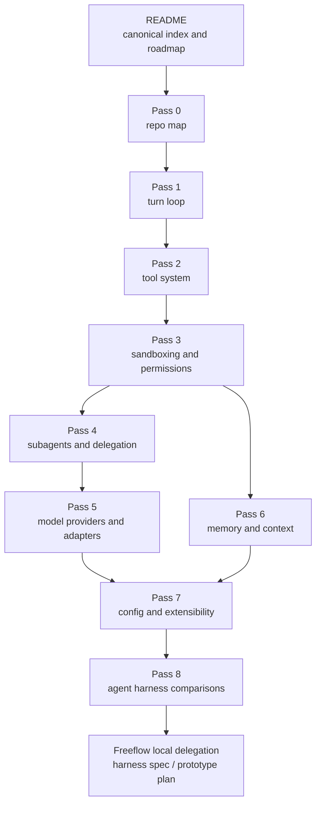

# Codex CLI Agent Harness Research

> **Doc ID:** RESEARCH-2026-06-12-codex-cli-agent-harness-index
> **Date:** 2026-06-12
> **Owner:** Hassan Mohiddin
> **Type:** Research index
> **Status:** Active - Pass 0-8 complete, including Pi addendum; ready for design/spec synthesis
> **Source:** Pass 0-8 artifacts in this directory, `openai/codex` source snapshots `b65fe3d8976d6fcc44ee6c6cf988654af5fc4d2d` and `0fed4497f50ad5f0b2f7972a1bfd14c5a09a85c5`, external harness sources refreshed for Pass 8, Pi source snapshot `bb959aae017eedc8edaa91d01d0475d483ea9371`, and Freeflow local delegation design discussion.

## Purpose

This directory preserves the Codex CLI agent-harness study for Freeflow's future optional local-delegation harness.

These docs are research memory, not shipped Freeflow behavior and not an implementation plan. They explain how Codex CLI works, what Freeflow can learn from it, what the comparison harnesses add, and which decisions must still be made before implementation.

Live Freeflow runtime source under `plugins/freeflow/` and agreed specs override these research artifacts.

## Source Snapshots

Primary Codex source studied:

```text
repo: openai/codex
commit: b65fe3d8976d6fcc44ee6c6cf988654af5fc4d2d
short: b65fe3d
commit date: 2026-06-12
commit title: fix: serialize auth environment tests (#27879)
local path used during research: /private/tmp/openai-codex-study-pass0
```

Follow-up Codex source-audit reference used by audited passes:

```text
repo: openai/codex
commit: 0fed4497f50ad5f0b2f7972a1bfd14c5a09a85c5
short: 0fed449
commit date: 2026-06-13
commit title: [codex] Carry exec-server cwd as PathUri (#28032)
```

Pass 5 also used MLX-LM source material fetched on 2026-06-12 and spot-checked on 2026-06-14. Pass 8 used primary external sources for OpenHands, Goose, Aider, smolagents, PydanticAI, LangGraph, and Hermes refreshed on 2026-06-13, plus Pi source audited on 2026-06-15.

Refresh upstream sources before implementation work because Codex, MLX-LM, Pi, and the comparison harnesses are active projects.

## Series Map



## How To Read This Series

If you are new to the study:

1. Read this README.
2. Read [Pass 0 - Repo Map](2026-06-12-pass-0-repo-map.md).
3. Read the `If You Only Read 10 Minutes` or `Core Idea` sections in Passes 1-7.
4. Read the Pass 8 synthesis for comparison findings and the first harness direction.

If you want to understand how a real agent harness works:

1. [Pass 1 - Turn Loop](2026-06-12-pass-1-turn-loop.md)
2. [Pass 2 - Tool System](2026-06-12-pass-2-tool-system.md)
3. [Pass 3 - Sandboxing And Permissions](2026-06-12-pass-3-sandboxing-and-permissions.md)
4. [Pass 6 - Memory And Context](2026-06-12-pass-6-memory-and-context.md)
5. [Pass 7 - Config And Extensibility](2026-06-12-pass-7-config-and-extensibility.md)

If you want the most visual explanation, use the `Diagram Map` sections in Passes 0-7.

If you are designing Freeflow's local delegation harness:

1. [Pass 3 - Sandboxing And Permissions](2026-06-12-pass-3-sandboxing-and-permissions.md)
2. [Pass 6 - Memory And Context](2026-06-12-pass-6-memory-and-context.md)
3. [Pass 7 - Config And Extensibility](2026-06-12-pass-7-config-and-extensibility.md)
4. [Pass 8 - Agent Harness Comparisons](2026-06-13-pass-8-agent-harness-comparisons.md)

Also read Pass 1 for the loop, Pass 4 for child-run boundaries, and Pass 5 for provider/runtime adapter choices.

If you are reviewing future implementation work:

1. Read the source evidence appendix in the relevant pass.
2. Refresh the upstream source before treating any finding as current.
3. Treat Freeflow runtime source under `plugins/freeflow/` as the live source of truth.
4. Treat `docs/designs/local-delegation-harness-design.md` as the current design draft, not shipped runtime behavior.

## Pass Index

| Pass | Artifact | State | What It Covers |
| --- | --- | --- | --- |
| 0 | [Repo Map](2026-06-12-pass-0-repo-map.md) | Draft; audited in cleanup | High-level `openai/codex` map, `codex-rs/` map, core crate orientation, and where the harness lives. |
| 1 | [Turn Loop](2026-06-12-pass-1-turn-loop.md) | Draft; audited | How a prompt becomes repeated model calls, tool calls, tool outputs, history updates, context-window handling, and final response. |
| 2 | [Tool System](2026-06-12-pass-2-tool-system.md) | Draft; audited | Tool specs, registry, router, handlers, output shaping, deferred tools, MCP/native tools, lifecycle, and execution boundaries. |
| 3 | [Sandboxing And Permissions](2026-06-12-pass-3-sandboxing-and-permissions.md) | Draft; audited in cleanup | Filesystem policy, network policy, approvals, command execution, patching, permission grants, sandbox retry, and safety tests. |
| 4 | [Subagents And Delegation](2026-06-12-pass-4-subagents-and-delegation.md) | Audited draft | Spawn/list/wait/message/follow-up/interrupt, child thread identity, roles, mailboxes, traces, and parent authority. |
| 5 | [Model Providers And Runtime Adapters](2026-06-12-pass-5-model-providers-runtime-adapters.md) | Source-audited 2026-06-14 | Provider abstraction, model metadata, event normalization, local server adapters, MLX-first implications, and model-agnostic runtime shape. |
| 6 | [Memory And Context](2026-06-12-pass-6-memory-and-context.md) | Draft; diagram-audited | Context assembly, history normalization, compaction, AGENTS.md loading, memory read/write pipeline, memory citations, trace-vs-prompt split, and packet-first local harness shape. |
| 7 | [Config And Extensibility](2026-06-12-pass-7-config-and-extensibility.md) | Draft; source-audited 2026-06-14 | Config layering, profiles, feature flags, MCP, skills, plugins, apps, hooks, roles, extension points, runtime config refresh, and config-to-turn-loop integration. |
| 8 | [Agent Harness Comparisons](2026-06-13-pass-8-agent-harness-comparisons.md) | Complete; Pi addendum 2026-06-15 | Comparison map plus OpenHands, Goose, Aider, smolagents, PydanticAI, LangGraph, Hermes, Pi, and synthesis for the first Freeflow local harness. |

## Current Study State

The Codex-only technical research for Passes 0-7 and the external harness comparison in Pass 8 are now complete enough for design work.

Current conclusions:

- A local model is not an agent by itself. The harness adds the loop, tools, policy, memory/context, traces, and verification boundary.
- Build a loop, not a wrapper.
- Separate model-visible tool descriptions from runtime tool execution.
- The model can request action; the harness owns authority.
- A local subagent should be a traceable bounded worker, not an invisible autocomplete helper.
- Freeflow should be MLX-first in runtime priority but model-agnostic in architecture.
- Freeflow local delegation should be packet-first, not transcript-first.
- The frontier orchestrator remains the final authority for trusting, rejecting, or rechecking local outputs.
- Local results should carry evidence, uncertainty, tool usage, files read, denials, warnings, and trace paths.
- Config should use a small effective runtime object instead of many duplicated fixed profiles.
- The first harness should start read-only, schema-first, trace-heavy, policy-gated, and easy to reject.

## Audit Corrections To Preserve

These corrections should survive into the design spec:

- Codex config is not only a startup object. Effective config feeds prompt assembly, tool routing, approval behavior, hooks, extensions, and refresh paths.
- Profiles are not the whole config system. Named permissions, feature flags, tools, MCP servers, hooks, roles, and project/session overlays are separate concerns.
- Tool availability is rebuilt at sampling time from native tools, MCP, plugins, apps/connectors, extension tools, discoverable suggestions, and dynamic tools.
- Not every tool is an approval/sandbox tool. Execution-like tools use approval and sandbox retry machinery; other tools still move through router, lifecycle, and hook paths.
- Hooks and extensions are related but different. Hooks are configured event handlers; extensions are typed contributors.
- Context should be assembled as structured layers and task packets, not as one giant transcript string.
- Pass 8 framework and harness comparisons should inform boundaries and tests, not become runtime dependencies by default.
- Pi's project trust model is a resource-loading guard, not a sandbox or local-worker capability policy.

## Design Direction

The research points to a small optional companion harness:

```text
Frontier host agent
  -> Freeflow delegation skill
  -> local_delegate companion CLI
      -> model-agnostic local harness
      -> policy-gated tools
      -> structured result, artifacts, warnings, trace
  -> frontier verification and final decision
```

V0 should prioritize:

- `local_delegate doctor`
- `local_delegate smoke`
- read-only `local_delegate run task.json`
- deterministic fake-model tests
- one real local runtime adapter after the schema and policy path is proven
- adversarial policy/workspace/citation/trace evals before plugin docs imply the feature works

Do not move local delegation into shipped plugin docs until smoke tests and adversarial evals prove the behavior.

## Next Roadmap

Pass 8 is the last research pass in this series, with Pi added as a source-audited addendum. The next artifact should be the Freeflow local delegation harness spec or a narrow implementation plan for a tiny `local_delegate` smoke harness.

The first design artifact should freeze:

- task/result/trace schemas
- workspace and denied-path policy
- capability tags and risk gates
- first task kinds, starting with `repo_inspection`
- tool registry shape
- verifier allowlist contract
- run directory and trace format
- setup boundary between normal Freeflow and optional local delegation

No new broad Codex-only pass is needed unless upstream source changes invalidate a specific finding.

## Open Questions To Carry Forward

- Should the first harness implementation be Python, TypeScript, or Rust?
- Should the first public surface be CLI only, MCP server, plugin tool, or more than one?
- Which real local runtime should be first: MLX, Ollama, LM Studio, llama.cpp server, or OpenAI-compatible endpoint?
- Should v0 local agents be read-only plus patch proposals, or allowed to write under strict policy later?
- Where should local traces live: `.freeflow/local-delegate/runs/`, another project path, or a user-global cache?
- Should local runs ever have durable memory, or only task traces?
- What benchmark proves token savings without output degradation?
- How much local trace should be injected back into the frontier context by default?
- How should Freeflow skills instruct Codex, Claude, Gemini, or other orchestrators to choose local delegation?
- Should the local harness support live config refresh, or should every task run with an immutable task-scoped config snapshot?
- Should `patch_suggestion` ever apply automatically after verification, or always return a rejectable patch artifact?

## Maintenance Rules

- Keep this README as the canonical pass index and roadmap.
- Avoid repeating long future roadmaps in each pass artifact.
- Keep per-pass docs deep; do not remove source evidence just to make them shorter.
- When adding or closing a pass, update this README.
- When turning research into implementation work, refresh upstream sources first.
- Treat these artifacts as research memory. Live Freeflow source and agreed specs override them.
