# Freeflow Output Router Architecture

> **Doc ID:** DESIGN-2026-06-19-freeflow-output-router-architecture
> **Last updated:** 2026-06-28
> **Owner:** Hassan Mohiddin
> **Type:** Architecture Design
> **Status:** Current
> **Source:** Live router source under `router/src/`, Pi extension source under `pi-extension/src/`, `skills/output-router/`, public plugin docs, runtime specs, and release evidence current through the `freeflow_run` script-producer implementation.

## Purpose

This is the A-to-Z architecture guide for Freeflow Output Router.

It explains:

- what the router is,
- why it exists,
- how the current tool surface works,
- how output flows from repo files, commands, scripts, MCP/web/fetch/code-search producers, and native tools into bounded evidence,
- how exact recovery works,
- how the vault, vault index, transforms, reducers, and script sandbox fit together,
- how Pi exposes and renders the router,
- how to configure, operate, debug, and extend it safely.

The code is still the source of truth. This document describes the live architecture in human terms and points at the files that own each behavior.

## Current Product Shape

Freeflow Output Router is a deterministic context-saving layer for coding agents.

It keeps model-visible output small while preserving exact evidence outside the context window when exactness matters.

The public Pi tool surface is:

| Tool | Job |
| --- | --- |
| `freeflow_status` | Inspect effective router/config/vault/script/observed-routing status without changing config. |
| `freeflow_search` | Search, locate, get, retrieve, expand, explain, or transform existing repo/vault evidence. |
| `freeflow_run` | Create new output from either a shell command or sandboxed script producer, store it by policy, and return compact evidence. |
| `freeflow_batch` | Run independent Freeflow-owned `run`/`search` steps in parallel and optionally answer query prompts from child evidence. |
| Pi observed routing | Route configured MCP/web/fetch/code-search tool results after direct host execution. |
| Pi native safety net | Optionally route large/noisy native `read`/`bash` results after the host tool returns. Off by default. |

Important naming boundary:

- `freeflow_search` is the current retrieval/search tool. The older public `freeflow_retrieve` name is gone.
- Public `freeflow_capture` is gone. Observed routing handles configured external producer output.
- `capture` and `providers` are removed config concepts. Do not write them into `.freeflow/config.json`.

## The One-Page Mental Model

```text
unknown-size or noisy source
-> capture or locate exact source truth outside model context
-> route deterministically
-> return smallest useful evidence/facts to the model
-> keep exact recovery pointers when policy promises recovery
```

The central invariant:

```text
Smallest sufficient evidence in context.
Exact raw recovery outside context.
No surprise native tool semantics.
```

The router separates four concerns that agents often mix up:

| Concern | Meaning |
| --- | --- |
| Source truth | Repo file bytes, command stdout/stderr, vaulted raw output, observed host output, or transformed text. |
| Routing decision | Why this evidence/span/summary was selected. |
| Model-visible evidence | The bounded lines/facts the agent needs now. |
| Recovery | How to get exact text later without re-running or dumping everything. |

The router does **not** replace native tools. It chooses evidence transport.

Use native tools when the output is intentionally small, direct, exact, or mutating:

- native `read`: known whole file or intentionally direct file content,
- native `bash`: small exact command output or shell behavior that must not be routed,
- native `edit` / `write`: file mutation.

Use Freeflow routed tools when output size, generated artifacts, log volume, or recovery risk is unknown.

## Product Boundary

The output router is:

- a deterministic output-routing and recovery layer,
- a repo/vault lexical evidence searcher,
- a command/script-output capture layer,
- a safe transform and reducer surface,
- a Pi extension tool/rendering layer,
- a vault and local vault-index implementation.

It is not:

- a new agent,
- a semantic code-intelligence engine,
- an LSP/reference/call-graph system,
- a vector database,
- a model-assisted summarizer by default,
- an enforcement hook system,
- a replacement for host permissions/sandboxing/approvals,
- a reason to change workflow mode or user-owned decisions.

Specialist code-intelligence tools such as Serena remain external specialists. Freeflow focuses on tool-output context savings, deterministic evidence, and exact recovery.

## Architecture At A Glance

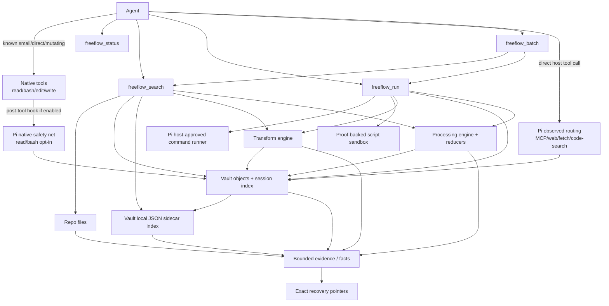

## Source Map

Router runtime source is under `router/src/`:

```text
router/src/
  config/
    config.ts                 defaults, normalization, safe fallbacks
    router-contract.ts        config invariant helpers
    schema.ts                 result/config schema helpers
    types.ts                  public router/result/vault/config types

  tools/
    search.ts                 freeflow_search repo/vault retrieval dispatcher
    run.ts                    freeflow_run command/script capture and routing
    batch.ts                  freeflow_batch parallel Freeflow step execution

  repo/
    repo-traversal.ts         safe repo path resolution and broad-scan skips

  evidence/
    evidence-search.ts        deterministic repo chunk scoring
    evidence-range-selector.ts narrows winning chunks to useful spans
    bounded-evidence.ts       bounded repo/vault excerpts and edge chunks
    evidence.ts               command important-line assembly and byte/line caps
    line-ranges.ts            exact 1-based line-range validation
    failure-contracts.ts      structured failure result builders

  routing/
    parsers.ts                command parsers for tests, diagnostics, git, builds, generic
    run-filters.ts            declarative run filters
    run-reducers.ts           reducer selection for freeflow_run output
    observed-routing.ts       observed host-tool output normalization/storage/routing
    observed-reducers.ts      reducers for observed host-tool output

  transform/
    engine.ts                 deterministic and sandboxed script transform engine

  processing/
    engine.ts                 repo/vault/file/output processing path
    reducers.ts               built-in fact reducers
    scripts.ts                sandboxed and local unsafe processing scripts
    renderers.ts              fact-first processing output renderer

  sandbox/
    script-sandbox.ts         sandbox adapter contract, proof gates, selection
    adapter-roots.ts          global adapter cache/env-root discovery
    quickjs-wasi-adapter.ts   JavaScript adapter
    jq-wasm-adapter.ts        jq adapter
    eryx-python-adapter.ts    Python/Eryx adapter

  setup/
    script-transform-adapters.ts optional adapter installer/status CLI

  vault/
    vault.ts                  exact/metadata vault records and session indexes
    vault-index.ts            local JSON sidecar search index over vault records

  benchmarks/                 runtime benchmark harnesses and reports
  experiments/                non-default search/index experiments
  index.ts                    package barrel exports
```

Pi integration is under `pi-extension/src/`:

```text
pi-extension/src/
  index.ts                    lifecycle hooks, tool_result routing, commands
  runtime-context.ts          mode/config reads and context injection
  router-tools.ts             public Pi tools and parameter normalization
  schemas.ts                  Pi JSON schemas for public tools
  renderers.ts                compact/expanded TUI renderers
  utils.ts                    compact model-visible result text helpers
  status.ts                   freeflow_status reports and migration hints
  observed-tool-routing.ts    Pi tool_result observed-routing adapter
  host-producer-identification.ts MCP/web/fetch/code-search producer detection
  native-safety-net.ts        optional post-tool routing for native read/bash
  mcp-config.ts               Pi MCP config helpers
```

Generated package output mirrors these under `router/dist/` and `pi-extension/dist/`.

## Core Data Model

All routed results share the same vocabulary.

### Status Axes

Keep these separate:

| Field | Owns | Example |
| --- | --- | --- |
| `toolStatus` | Did the Freeflow tool itself complete? | `ok`, `error` |
| `execution.status` | Did the run producer complete? Only on `freeflow_run`. | `success`, `failed`, `timed_out`, `cancelled` |
| `routing.status` | What did the router do with the output? | `routed`, `passed_through`, `partial`, `failed` |

A command can fail while `toolStatus` is `ok`: the router successfully captured and routed a failed command.

A tool can have `toolStatus: "error"` after the producer already ran if routing/storage failed and only fallback evidence is available.

### Routes

`routing.route` is an internal result category, not the public tool/action name. Most `freeflow_search` actions currently report route `retrieve` because they return evidence from existing sources.

Current route kinds in `router/src/config/types.ts`:

- `retrieve`: existing-source evidence routing for public `freeflow_search` actions such as `query`, `locate`, `get`, `retrieve`, `expand`, and `explain`.
- `run`: command or script-producer output routing.
- `transform`: deterministic/script transform output.
- `batch`: parallel Freeflow-owned operations.
- `observed`: configured Pi observed-routing outputs.
- `safety-net`: optional native `read`/`bash` post-tool routing.
- `pass-through`: reserved/typed for pass-through cases.

### Producers

Producer descriptors explain where output came from:

- `command`: shell command through the host-approved runner.
- `script`: `freeflow_run` script producer.
- `native`: native host output captured by the safety net.
- `repo`: repo file references.
- `web`, `fetch`, `code_search`: built-in Pi observed producers.
- `mcp`: Pi MCP observed producer.
- `transform`: deterministic reducer/transform/script-derived output.
- `other`: batch or fallback producer.

### Persistence And Recoverability

`persistence.status` says what was persisted:

- `vaulted`: exact content was stored.
- `metadata_only`: only metadata/hash/counts/recovery linkage were stored.
- `not_persisted`: no durable record was stored.
- `redacted`: typed but not a current config option; reserved future behavior.

`persistence.recoverability` says what can be recovered:

- `exact`: exact text is recoverable from the vault.
- `metadata_only`: no raw stream is recoverable from this record.
- `none`: no persisted recovery.
- `redacted`: future-only; do not offer/write it in config.

Metadata-only records must never claim exact recovery. The only exception-like shape is duplicate metadata: the current record can be metadata-only while pointing to a previous exact `outputId` for exact duplicate recovery.

### Evidence Packets And Important Lines

`freeflow_search` returns `EvidencePacket[]`:

- `id`: stable evidence handle for expansion.
- `source`: repo/vault/native source reference.
- `path`: repo path or vault `outputId:stream` label.
- `lines`: exact line span when known.
- `excerpt`: bounded exact text.
- `why`: deterministic reason the span was chosen.
- `window`: `exact`, `small`, `lines_30`, `lines_80`, `section`, or `full`.
- `expandable`: whether `action=expand` can widen it.
- `match`: optional exact-phrase/lexical/metadata match metadata for `get`.

`freeflow_run` returns `importantLines[]`:

- `stream`: `stdout`, `stderr`, or `combined`.
- `lines`: exact line span in that stream.
- `excerpt`: selected exact output text.

Transform and processing results may also return `evidence[]` or fact-first `summary`/`visibleText` through Pi compact renderers.

### Lineage

Derived outputs carry lineage:

- source `recordId`s,
- source `outputId`s,
- operation name,
- operation hash.

Lineage lets a future tool answer:

```text
this transformed fact came from outputId X stream Y through operation Z
```

Script code is not persisted. Operation metadata stores code hashes such as `sha256_...`, labels, language, adapter metadata, and limits.

## Tool Choice Policy

Use this table when deciding how output should move.

| Need | Use |
| --- | --- |
| Answer a direct question with no repo/tool need | Chat directly. |
| Read a known whole file intentionally | Native `read`. |
| Edit/create files | Native `edit` / `write`. |
| Run small exact shell behavior | Native `bash`. |
| Explore unknown-size repo evidence | `freeflow_search action=query` or `locate`. |
| Find candidate paths/output ids first | `freeflow_search action=locate`. |
| Find best exact-ish match for a snippet/query | `freeflow_search action=get`. |
| Retrieve known exact repo/vault line range | `freeflow_search action=retrieve`. |
| Widen previous evidence | `freeflow_search action=expand`. |
| Explain a routed decision or vault output | `freeflow_search action=explain`. |
| Transform existing repo/vault/file/output data | `freeflow_search action=transform`. |
| Run likely-large/noisy command | `freeflow_run` with `command`. |
| Run code as new output without repo/home/env/network access | `freeflow_run` with `script`. |
| Filter captured run output with code | `freeflow_run` with `scriptFilter`. |
| Run independent Freeflow operations in parallel | `freeflow_batch`. |
| Route MCP/web/fetch/code-search output | Call host tool directly; Pi observed routing runs after the host result if configured. |
| Inspect effective behavior/config/vault/script adapters | `freeflow_status`. |

The output-router skill chooses evidence transport only. Workflow, interview-gate, and discover still decide whether the task should proceed, stop, or ask.

## End-To-End Flow

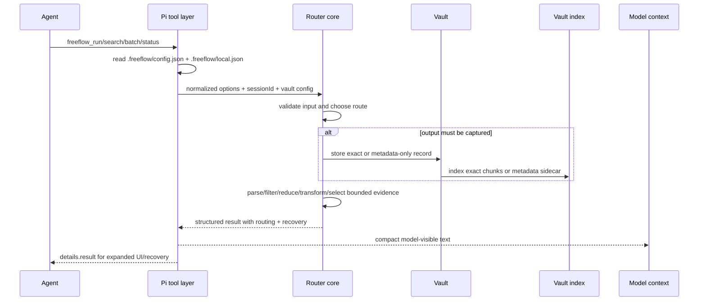

## `freeflow_status`

`freeflow_status` is read-only.

Actions:

- `status`: effective config/status summary.
- `doctor`: deeper diagnostics.
- `migration`: non-destructive stale/unknown config recommendations.

It reports:

- mode state (`defaultMode`, session override, effective mode),
- effective `outputRouter`, `observedRouting`, and `scriptTransform` config,
- effective local unsafe processing config,
- built-in defaults,
- vault root, retention, and writability without creating directories,
- vault-index status,
- observed-routing status and supported persistence modes,
- script-sandbox adapter availability, required proofs, registered adapters, rejected mechanisms, configured languages, limits, and raw-script persistence,
- local unsafe processing status,
- config warnings and local-config warnings,
- migration recommendations that require explicit confirmation before any rewrite.

`freeflow_status` must not rewrite `.freeflow/config.json` or `.freeflow/local.json`.

## `freeflow_search`

`freeflow_search` is the public surface for existing data.

It works over two public source kinds:

```text
repo   current checkout files
vault  previous Freeflow routed/captured/derived outputs
```

Actions:

| Action | Job |
| --- | --- |
| `query` | Return focused evidence snippets for a query. |
| `locate` | Return candidate locations with tiny evidence/previews. |
| `get` | Content/snippet to coordinates: user gave exact-ish text/code or asks where something exists; return the best matching path/outputId, line range, and matched content. |
| `retrieve` | Coordinates to content: caller already knows the path/outputId and line range; return those exact lines. |
| `expand` | Widen a previous evidence packet. |
| `explain` | Explain a prior routed decision or a vault output. |
| `transform` | Process existing repo/vault data through deterministic operations, reducers, or scripts. |

### Search Input Normalization In Pi

Pi supplies runtime-only details before calling router core:

- repo root becomes `ctx.cwd`,
- vault root comes from normalized config,
- session id comes from Pi session state,
- generated path globs come from `outputRouter.generatedPaths`,
- vault query filters are copied from `source` and `filters`.

For repo sources:

```json
{
  "action": "query",
  "source": { "kind": "repo", "path": "optional/subtree" },
  "query": "output router storage policy"
}
```

For vault sources:

```json
{
  "action": "query",
  "source": { "kind": "vault" },
  "query": "AssertionError",
  "filters": { "producerKind": "command", "recoverability": "exact" }
}
```

Vault `outputId` is optional for `query`, `locate`, and `get`; omitting it searches the vault index for the current session. `outputId` is required for `retrieve`, `expand`, and `explain`.

### Repo Query Flow

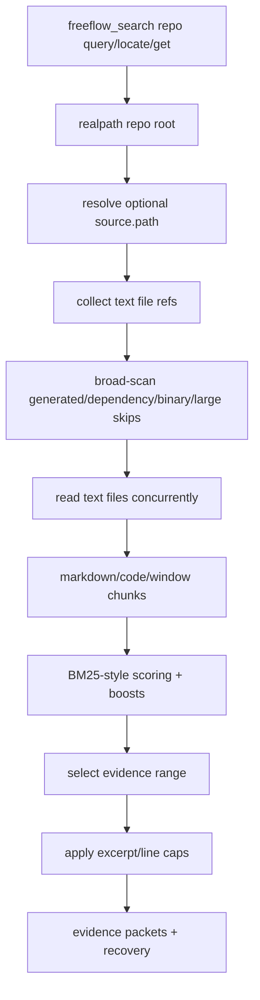

Repo traversal is owned by `router/src/repo/repo-traversal.ts`.

Safety rules:

- all paths are resolved through `realpath`,
- requested paths must remain inside repo root,
- symlink/root escapes are rejected,
- broad scans skip generated/dependency/cache/log/build output,
- explicit path retrieval remains available even if broad scans would skip that path.

Broad-scan default skip examples:

- `.git`, `node_modules`, `dist`, `build`, `out`, `.next`, `coverage`, `target`, `graphify-out`, `.cache`, logs/temp/generated dirs,
- binary/media/archive/database/font/wasm extensions,
- `.min.js`, `.min.css`, source maps, bundles, `.log`,
- files over 1MB,
- large HTML/JSON files over 64KB.

Configured `outputRouter.generatedPaths` adds project-specific broad-scan skips such as `graphify-out/**`. These affect broad scans only; explicit path retrieval still works.

### Repo Scoring

Repo scoring is deterministic and lexical. It is not semantic/vector search.

Owned by `router/src/evidence/evidence-search.ts`.

Candidate chunks are built from:

- Markdown preamble before first heading,
- Markdown sections,
- code symbol chunks for `fn`, `struct`, `enum`, `class`, `interface`, `type`, `const`, `def`, etc.,
- fallback line windows when no structure exists.

Scoring combines:

- exact normalized phrase boost,
- BM25-style term scoring,
- query-token coverage,
- heading coverage,
- identifier/code-definition boosts,
- ordered phrase boost for multi-token queries,
- path intent boosts,
- source/test priors,
- length penalty.

The router selects one top candidate per file to avoid one noisy file consuming all results. `topK` defaults to `1` for `query`, `5` for `locate`, and is capped at `10` in the public search tool.

`evidence-range-selector.ts` narrows winning chunks to the smallest useful line range. `bounded-evidence.ts` then enforces byte and line caps and marks evidence as expandable.

### Repo Retrieve And Expand

`action=retrieve` with `source.kind=repo` supports:

- explicit `source.path`,
- optional exact `lineRange`,
- `preserve="full"` for full-file retrieval up to a cap,
- bounded edge chunks when requested exact/full content is over cap.

`action=expand` requires a previous repo `EvidencePacket` with `path` and `lines`.

Expansion options:

- `lines_30`,
- `lines_80`,
- `full`.

`full` still means exact fidelity under caps, not unlimited context injection. Over cap, Freeflow returns bounded start/end chunks and tells the agent how to recover narrower exact spans.

### Vault Query Flow

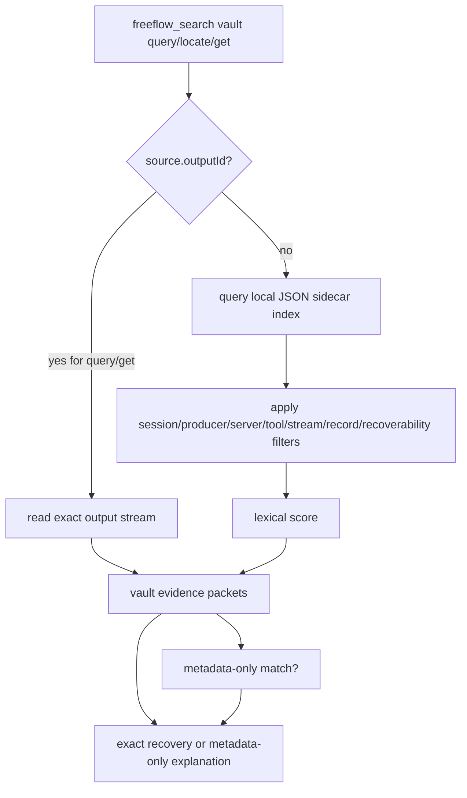

Vault-wide query/locate/get is powered by `router/src/vault/vault-index.ts`.

The current index backend is a deterministic local JSON sidecar:

```text
<vaultRoot>/index/v1/state.json
```

It indexes:

- exact text chunks for exact records,
- metadata text for metadata-only records,
- producer metadata,
- session id,
- output id,
- record kind,
- stream,
- recoverability,
- optional host-tool metadata.

Default vault-index chunks are 40 lines and 8KB max. Default query result excerpt cap is 2KB. The index is intentionally simple and dependency-free; SQLite/FTS remains deferred/non-default.

### Vault Retrieve And Expand

Exact vault recovery uses:

```json
{
  "action": "retrieve",
  "source": { "kind": "vault", "outputId": "ffout_...", "stream": "combined" },
  "lineRange": { "start": 1, "end": 40 },
  "preserve": "full"
}
```

Streams:

- command/script-producer run records: `stdout`, `stderr`, `combined`,
- text/native/observed/transform records: `raw`,
- metadata-only records: no raw stream.

If a requested vault line span is over cap, Freeflow returns bounded edge chunks, not a lossy summary.

`action=explain` reads the vault record metadata and reports:

- record kind,
- producer,
- execution status when available,
- persistence and recoverability,
- lineage when available,
- whether exact recovery exists.

## `freeflow_search action=transform`

Transform is the public surface for computing useful facts from existing data without dumping raw bytes into context.

There are two implementation branches in Pi.

### Branch 1: Explicit `operation` -> Transform Engine

When `params.operation` is present, Pi calls `router/src/transform/engine.ts`.

Current source support:

- deterministic operations use one `source.kind="vault"` with `outputId` and optional `stream`,
- `operation.kind="script"` uses `sources[]`, currently vault sources only, each with an `alias`.

Deterministic operations:

- `regexFilter`,
- `countMatches`,
- `jsonExtract` with JSON Pointer or supported JSON path,
- `groupByRegex`,
- `dedupe`,
- `topN`,
- `extractUrls`,
- `extractCitations`,
- `lineStats`,
- `sizeStats`.

Flow:

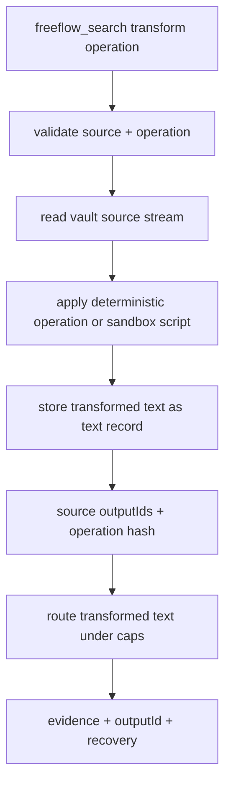

Successful transform output is stored as a `TextOutputRecord` with `sourceKind="transform"`, exact recovery for transformed text, and lineage back to source outputs.

Raw script code is not persisted. Script operation metadata stores:

- language,
- label when present,
- `codeSha256`,
- operation hash,
- source aliases/output ids/streams,
- adapter/runtime metadata when applicable.

### Branch 2: No `operation` -> Processing Engine

When `action="transform"` has no `operation`, Pi calls `router/src/processing/engine.ts`.

This is the file/output processing path. It supports:

- repo file source: `source.kind="repo"` with `path`,
- vault output source: `source.kind="vault"` with `outputId` and optional `stream`,
- built-in reducers,
- optional processing script via `params.script`,
- local-only unsafe unsandboxed processing when explicitly requested and locally enabled.

Processing flow:

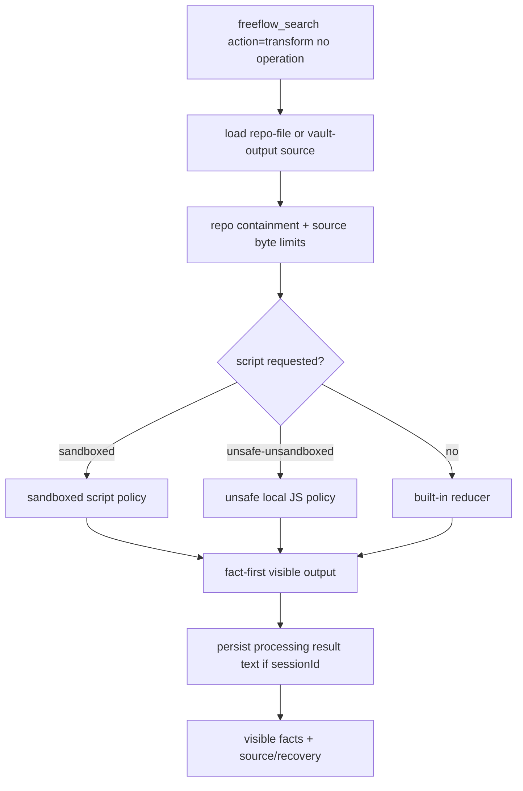

Default processing limits:

- max source bytes: 2MB,
- max visible bytes: 4KB.

Processing output is rendered fact-first:

```text
facts...
source: repo path or vault outputId:stream
recovery: exact-result | exact-source | metadata-only | hint-only | none
reducer/script metadata
```

### Built-In Reducers

Reducers live in `router/src/processing/reducers.ts`.

Current reducer families:

| Reducer | Facts produced |
| --- | --- |
| `test-output` | test file/test counts, failed files, failed test names. |
| `diagnostics` | total diagnostics, error/warning counts, top files/codes, first diagnostics. |
| `build-output` | final status, errors/warnings, compiled count, issue files, first issues. |
| `access-log` | request count, status counts, error rate, average latency, slow examples. |
| `table` | CSV row/column counts, categorical counts, numeric min/max/average. |
| `mcp-tools` | tool counts, categories, signatures, required params. |
| `json-query` | object/array summaries, matched paths, categorical/numeric summaries, mentions, samples. |
| `browser-snapshot` | role counts, refs, links, text nodes, top interactive/text nodes. |
| `git-log` | commit counts by type/scope/author, recent commits. |

Reducers are used by both processing and `freeflow_run` reducer routing.

### Processing Scripts

Processing scripts use `params.script`:

```json
{
  "action": "transform",
  "source": { "kind": "repo", "path": "logs/access.log" },
  "script": {
    "language": "javascript",
    "code": "const text = readText('source'); writeText(String(text.length));",
    "policy": "sandboxed"
  }
}
```

Supported policies:

- `sandboxed` (default),
- `unsafe-unsandboxed` (local-only JavaScript processing path).

Sandboxed processing requires `scriptTransform.enabled=true` and a proof-backed adapter for the requested language.

Unsafe unsandboxed processing is deliberately separate:

- only available through processing scripts, not `freeflow_run` script producers and not `operation.kind="script"`,
- local-only opt-in via `.freeflow/local.json`,
- each call must request `script.policy="unsafe-unsandboxed"`,
- currently JavaScript only,
- result must say unsafe/unsandboxed,
- raw script text still is not persisted.

Shared `.freeflow/config.json` cannot enable unsafe unsandboxed processing.

## `freeflow_run`

`freeflow_run` creates new output.

It accepts exactly one base producer:

```text
command XOR script
```

- `command`: shell command executed through Pi's approved runner.
- `script`: sandboxed code-as-producer with no repo/home/env/network access.

It then routes stdout/stderr/combined through the same capture, storage, parsing, filtering, reducer, and recovery pipeline.

### Run Command Flow

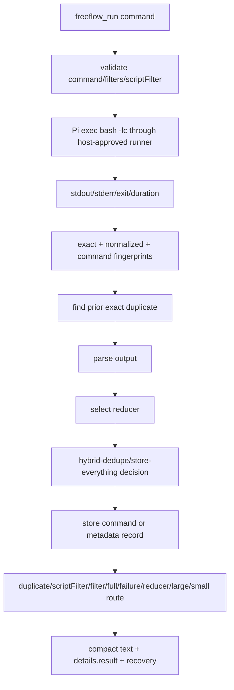

If the host runner throws before output is captured, `freeflow_run` returns a structured no-recovery error. No vault record exists.

### Run Script Producer Flow

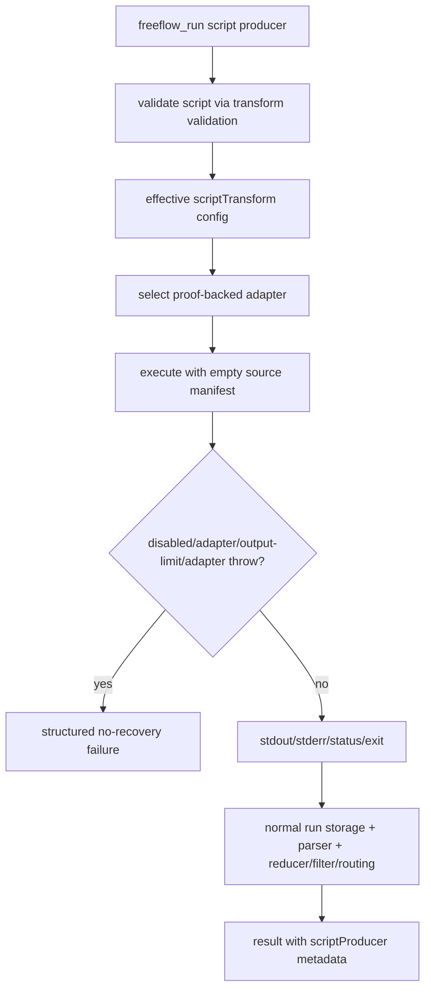

A script producer does not receive repo files, home files, environment variables, network access, or vault access. It receives an empty source manifest and language-specific guest helpers from the adapter.

Raw script code is never stored. Metadata includes:

- `producer.kind: "script"`,
- `scriptProducer.language`,
- `policy: "sandboxed"`,
- `rawScriptPersistence: "disabled"`,
- `codeSha256`,
- limits,
- label when present,
- adapter id/version/runtime when available,
- stdout/stderr byte counts,
- failure metadata when unavailable/failed.

Important failure distinction:

- disabled sandbox, missing adapter, adapter exception, or output-limit overflow can fail before capture; no output id exists,
- a script that executes and exits non-zero or returns `status="failed"` still has stdout/stderr captured and routed as a failed run when the adapter returns bounded output.

### Run Storage Policy

Default storage policy: `hybrid-dedupe`.

Override: `store-everything`.

`store-everything` stores every run output exactly.

`hybrid-dedupe` stores exact output when output is exactness-sensitive, and metadata-only for small non-sensitive successes.

Output is exactness-sensitive when any of these is true:

- `preserve="full"`,
- execution did not succeed,
- declarative filters are present,
- `scriptFilter` is present,
- a reducer is selected,
- producer is `script`,
- output exceeds `largeOutputBytes` or `largeOutputLines`,
- goal/command indicates verification/test/lint/typecheck/diagnosis/debug/build/CI,
- parser is not generic.

Exact duplicate behavior:

- command/script output is fingerprinted by exact output hash plus producer/cwd/status fingerprint,
- if exactness-sensitive output duplicates a prior exact record and no script filter is involved, the current record may be metadata-only,
- recovery points to the prior exact `outputId`,
- model-visible output gets a compact duplicate note instead of repeated evidence.

Small non-sensitive command successes may be metadata-only. They get rerun guidance, not exact recovery claims.

Script producers are always exactness-sensitive because the raw script text is not persisted and stdout/stderr are the evidence of what happened.

### Vault Records Created By Run

Exact run storage creates a `CommandOutputRecord`:

```text
meta.json
stdout.txt
stderr.txt
combined.txt
```

Metadata-only run storage creates a `MetadataOutputRecord`:

```text
meta.json only
```

Both records are appended to the session index and vault index. Metadata-only records are searchable by metadata but have no raw stream.

### Run Parsers

`router/src/routing/parsers.ts` picks deterministic important lines before generic fallback.

Parser order:

1. `test-runner`
2. `typescript-lint`
3. `git-status-diffstat`
4. `build-toolchain`
5. `generic`

Parser metadata includes:

- parser name,
- confidence,
- fidelity (`exact` or `lossy`),
- compressed flag,
- counts,
- references for diagnostics where available.

Parsers select exact line spans. They do not perform model summaries.

### Run Reducers

`router/src/routing/run-reducers.ts` can route successful command/script output through built-in processing reducers.

Reducer selection is skipped when:

- `preserve="full"`,
- execution failed/timed out/cancelled,
- declarative filters are present,
- `scriptFilter` is present,
- successful output mixes stdout and stderr, to avoid hiding warnings.

A reducer is selected only when:

- the processing reducer has high confidence, and
- output is large enough **or** goal/command intent allows that reducer.

Selected reducer output is stored as a transformed text record when the raw run record is exact. Recovery includes both raw run output and reducer-transformed output ids.

### Declarative Run Filters

`filters` are line filters applied after raw capture/storage and before routed evidence is returned.

Supported fields:

- `stream`: `stdout`, `stderr`, or `combined`,
- `include`: regex string(s),
- `exclude`: regex string(s),
- `flags`: `gimsu` without duplicates,
- `head`,
- `tail`,
- `maxLines`,
- `maxBytes`.

Filters never rerun the producer. They operate over already captured output.

If a failed command has no matching filtered lines, Freeflow preserves parsed failure evidence instead of hiding the failure. Metadata records this as `fallbackPreservedFailureEvidence`.

### Script Filters

`scriptFilter` runs a sandboxed script over already captured run output.

Flow:

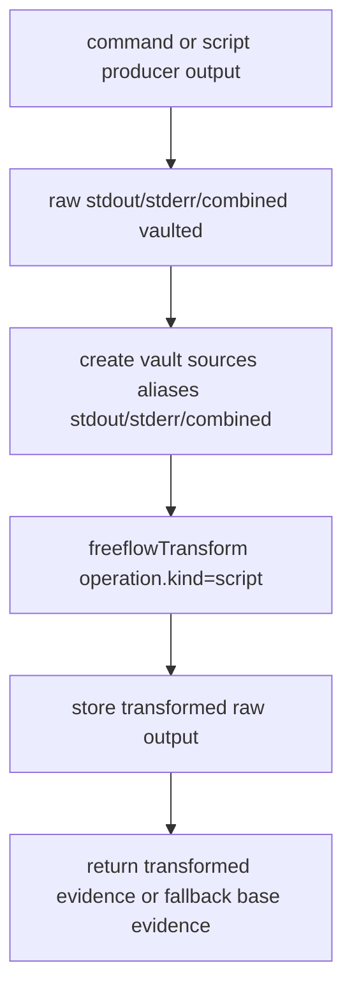

Aliases exposed to the script transform:

- `stdout`,
- `stderr`,
- `combined`.

Script filters require the same proof-backed sandbox adapters as other script transforms. There is no unsafe fallback.

If the script filter succeeds:

- transformed output is vaulted as a separate text record,
- `scriptFilter.outputId` points to transformed output,
- raw output remains recoverable by the raw `outputId`,
- lineage connects transformed output to the raw run record.

If it fails/unavailable:

- raw output remains recoverable when raw storage succeeded,
- base routed evidence is returned,
- failure metadata says why the script filter did not produce transformed output.

## Script Sandbox Architecture

Script sandboxing is shared by:

- `freeflow_search action=transform operation.kind="script"`,
- `freeflow_run` script producers,
- `freeflow_run` script filters,
- processing scripts with `policy="sandboxed"`.

The contract lives in `router/src/sandbox/script-sandbox.ts`.

Supported languages:

- `javascript` through `quickjs-wasi`,
- `jq` through `jq-wasm`,
- `python` through `@bsull/eryx`.

Script execution is disabled by default. A language can execute only when:

1. `.freeflow/config.json` has `scriptTransform.enabled=true`,
2. the requested language is in `scriptTransform.languages`,
3. a registered adapter for that language is discovered,
4. the adapter passes every required proof,
5. per-call and configured limits are valid.

Required proofs:

- `env_access_denied`,
- `home_access_denied`,
- `repo_access_denied`,
- `vault_access_denied`,
- `network_access_denied`,
- `input_read_only`,
- `output_escape_denied`,
- `stdout_stderr_bounded`,
- `timeout_enforced`.

Rejected mechanisms:

- Node `vm`,
- plain Python subprocess,
- plain jq subprocess.

An OS sandbox adapter remains candidate-unproven until it passes the same contract.

### Adapter Discovery

Adapter roots are discovered from:

- global Freeflow adapter cache: `~/.cache/freeflow-script-adapters`,
- `FREEFLOW_SCRIPT_TRANSFORM_ADAPTERS_HOME`,
- `FREEFLOW_QUICKJS_WASI_ROOT`,
- `FREEFLOW_JQ_WASM_ROOT`,
- `FREEFLOW_ERYX_ROOT`,
- `FREEFLOW_SCRIPT_TRANSFORM_NODE` for the Node 24 child runner used by Python/Eryx.

Setup helper:

```text
node <plugin-root>/router/dist/setup/script-transform-adapters.js install --config .freeflow/config.json
```

The installer can install:

- `quickjs-wasi@3.0.1`,
- `jq-wasm@1.2.0-jq-1.8.2`,
- `@bsull/eryx@0.5.0`,
- `node@24` for Python child execution.

It writes only proof-passing languages to config when `--config` is provided.

Python/Eryx uses a setup-installed Node 24 child process with `--experimental-wasm-jspi` when the host runtime lacks JSPI support. Python remains unavailable unless that runner passes proofs.

### Adapter Execution Boundary

The transform engine creates a temp root with:

```text
input/
work/
output/
```

For source-based transforms, selected vault streams are copied into `input/<alias>.txt` and described in `input/manifest.json`. The vault root and repo root are never mounted.

For `freeflow_run` script producers, the source list is empty. The script creates new stdout/stderr rather than transforming existing sources.

Adapters receive:

- language,
- code,
- temp input/work/output dirs,
- source mounts,
- limits,
- `network: "off"`.

Adapters return bounded stdout/stderr/status/output-file metadata. The product currently uses stdout/stderr; output-limit overflow is treated as structured failure with no hidden exact recovery claim.

Proof results are cached in-process by adapter/runtime/content/limit keys so repeated status checks do not rerun expensive adversarial probes unnecessarily.

## Vault Architecture

The vault is the router's exact-evidence store.

Default root:

```text
~/.cache/freeflow-router/vault
```

Configured by `outputRouter.vaultRoot`. Retention defaults to TTL 7 days.

### Object Identity

Records use content-derived ids:

- `objectId`: object directory id,
- `outputId`: public recovery id (`ffout_...`),
- `recordId`: record identity (`ffrec_...`).

Ids are derived from hashed payload metadata/content. Records include `contentHashSha256` and per-stream hashes.

### Record Kinds

| Kind | Stored files | Used for |
| --- | --- | --- |
| `command` | `meta.json`, `stdout.txt`, `stderr.txt`, `combined.txt` | `freeflow_run` exact command/script-producer output. |
| `text` | `meta.json`, `raw.txt` | native safety-net text, observed exact text, transform/reducer/processing output. |
| `metadata` | `meta.json` | metadata-only run/observed records. |
| `repo-file` | `meta.json` | repo file reference records from processing paths. |

### Session Index

Each session has a session index:

```text
<vaultRoot>/sessions/<sessionId>/index.json
```

The session index tracks:

- outputs,
- records by output id,
- successful/failed/timed_out/cancelled command groups,
- producer metadata,
- persistence,
- lineage,
- fingerprints.

Writes are guarded by an in-process lock with a timeout/retry loop.

### Vault Index

The local JSON sidecar index lives under:

```text
<vaultRoot>/index/v1/state.json
```

It is updated after each vault append. Index failures are non-blocking: storage still succeeds, and the index records degraded status for `freeflow_status`.

The index stores exact text chunks when recoverability is exact and metadata-only text otherwise. It supports filters by:

- `sessionId`,
- `outputId`,
- `recordKind`,
- `producerKind`,
- MCP server/tool,
- host tool name,
- stream,
- recoverability.

It powers vault-wide `freeflow_search` query/locate/get without reading every raw vault object into model context.

## Pi Observed Routing

Observed routing is a Pi `tool_result` hook for external producers.

It is off by default. It runs only when:

- `observedRouting.enabled=true`, and
- the specific producer/server is enabled.

Supported producer families:

- MCP servers via `observedRouting.mcp.servers`,
- Pi `web_search`,
- Pi `fetch_content`,
- Pi `code_search`.

Flow:

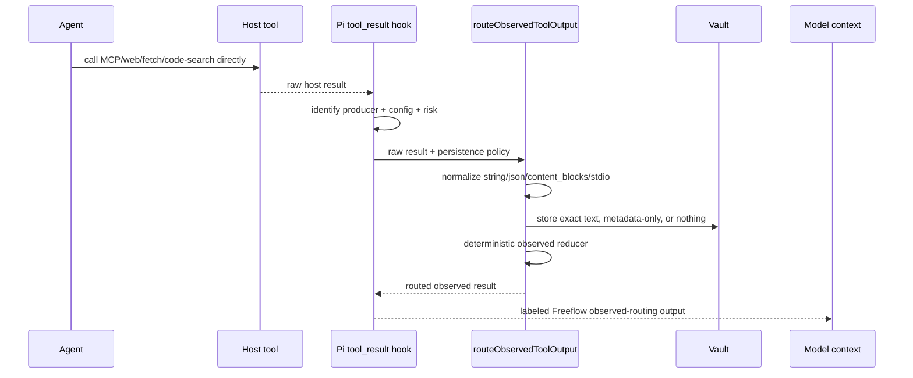

Host execution remains owned by Pi. Freeflow does not grant permissions, block mutating tools, or decide whether an MCP action is allowed. It classifies producer risk as routing metadata:

- configured override,
- MCP annotations,
- built-in manifest for web/fetch/code-search,
- read/write verb heuristics,
- unknown fallback.

Persistence modes:

- `exact`: store exact raw normalized text and return vault recovery.
- `metadata-only`: store metadata/hash/counts only; no raw stream recovery.
- `none`: no persistence.

`redacted` is future-only and must not be offered as a setup option.

Observed routing fails open. If normalization/storage/reduction fails after the host tool completes, Pi returns the original host output with a Freeflow warning rather than silently shortening or blocking it.

## Pi Native Safety Net

Native safety-net routing is optional post-tool routing for Pi native `read` and `bash` outputs.

Default:

```json
{
  "outputRouter": {
    "postToolRouting": "off"
  }
}
```

Modes:

- `off`: native output passes through unchanged.
- `safety-net`: large/noisy native `read`/`bash` results may be vaulted and replaced with labeled routed output.
- `strict`: reserved; no stronger blocking behavior exists today.

Safety-net flow:

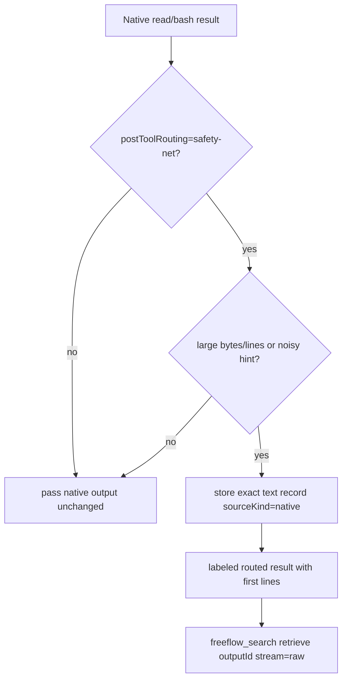

Trigger conditions:

- native tool is `read` or `bash`,
- output exceeds configured `largeOutputBytes` or `largeOutputLines`, or
- configured noisy/generated hints match and a conservative minimum is exceeded.

Safety-net output is always labeled as Freeflow-routed output and includes recovery instructions. If safety-net routing fails, it fails open and appends a warning; native output is not silently removed.

## `freeflow_batch`

`freeflow_batch` runs independent Freeflow-owned steps concurrently.

Step kinds:

- `run`,
- `search`.

It does not support:

- sequenced workflows,
- arbitrary external tool orchestration,
- mutating batch work,
- public batch transform steps in v1 Pi normalization.

Defaults and caps:

- default concurrency: `4`,
- max concurrency: `16`,
- max steps: `50`,
- max query prompts: `10`,
- max query length: `500`.

Flow:

```mermaid
flowchart TD
  Input[freeflow_batch]
  Validate[validate steps/concurrency/queries]
  Parallel[run steps with bounded concurrency]
  Child[child freeflow_run/freeflow_search results]
  Query{queries[]?}
  Match[match child evidence + important lines + exact vault refs]
  Summary[compact batch summary]
  Details[full child results in details.result.steps]

  Input --> Validate --> Parallel --> Child --> Query
  Query -->|yes| Match --> Summary --> Details
  Query -->|no| Summary --> Details
```

Query aggregation is deterministic. It searches:

- child evidence packets,
- child run important lines,
- recoverable child vault refs when `vaultRoot` is available.

It returns up to three matches per query. It does not ask a model to summarize child outputs.

## Pi Rendering And Model-Visible Text

Pi tool results have two layers:

1. compact model-visible `content[0].text`,
2. full structured `details.result` for expanded UI/recovery/debugging.

Renderers live in `pi-extension/src/renderers.ts`; compact text helpers live in `pi-extension/src/utils.ts`.

The UI is designed so collapsed tool rows stay readable while expanded rows show:

- status axes,
- routing reason,
- storage/persistence,
- evidence/important lines,
- filters/reducers/script metadata,
- parser metadata,
- vault recovery,
- exact `freeflow_search` recovery hints,
- status/migration diagnostics.

Do not treat compact text as the complete result. For debugging or review, inspect `details.result`.

## Configuration

Minimal setup writes only:

```json
{
  "defaultMode": "workflow"
}
```

All router config has built-in defaults. Optional config is written only after an explicit setup branch/request.

Supported `.freeflow/config.json` keys:

```json
{
  "defaultMode": "workflow",
  "outputRouter": {
    "enabled": true,
    "profile": "standard",
    "postToolRouting": "off",
    "storagePolicy": "hybrid-dedupe",
    "largeOutputBytes": 64000,
    "largeOutputLines": 1000,
    "vaultRoot": "~/.cache/freeflow-router/vault",
    "vaultRetentionDays": 7,
    "generatedPaths": ["graphify-out/**"],
    "noisyCommandHints": ["npm test"]
  },
  "observedRouting": {
    "enabled": true,
    "onRoutingFailure": "fail-open",
    "mcp": {
      "servers": {
        "github": { "enabled": true, "persistence": "exact" }
      }
    },
    "web": { "enabled": true, "persistence": "exact" },
    "fetch": { "enabled": true, "persistence": "exact" },
    "codeSearch": { "enabled": true, "persistence": "exact" }
  },
  "scriptTransform": {
    "enabled": true,
    "sandbox": "auto",
    "languages": ["javascript", "jq", "python"],
    "network": "off",
    "limits": {
      "timeoutMs": 5000,
      "maxInputBytes": 1048576,
      "maxOutputBytes": 65536
    },
    "rawScriptPersistence": "disabled"
  }
}
```

Do not dump defaults into config. Missing optional sections mean built-in defaults.

### Defaults

| Setting | Default |
| --- | --- |
| `outputRouter.enabled` | `true` |
| `outputRouter.profile` | `standard` |
| `outputRouter.postToolRouting` | `off` |
| `outputRouter.storagePolicy` | `hybrid-dedupe` |
| `largeOutputBytes` | `64000` |
| `largeOutputLines` | `1000` |
| `vaultRoot` | `~/.cache/freeflow-router/vault` |
| `vaultRetentionDays` | `7` |
| `observedRouting.enabled` | `false` |
| observed persistence defaults | `none` |
| `scriptTransform.enabled` | `false` |
| `scriptTransform.languages` | `javascript`, `python`, `jq` |
| `scriptTransform.network` | `off` |
| `scriptTransform.rawScriptPersistence` | `disabled` |

Invalid config falls back safely with warnings.

### Local Unsafe Processing Config

Unsafe processing opt-in is local-only:

```json
{
  "processing": {
    "unsafeUnsandboxed": {
      "enabled": true
    }
  }
}
```

This belongs in `.freeflow/local.json`, not shared config.

Rules:

- shared `.freeflow/config.json` cannot enable unsafe processing,
- each call must still request `script.policy="unsafe-unsandboxed"`,
- result must label unsafe/unsandboxed,
- no sandbox/read-only/network-off claims are allowed for unsafe results.

## Runtime Context Integration

Output Router is loaded as part of Pi runtime context.

Pi extension lifecycle:

- `session_start`: restore mode override, refresh runtime context, read config, update UI status.
- `session_compact`: refresh runtime context, read config, update UI status.
- `before_agent_start`: inject full mode-contract/workflow/interview-gate/output-router skill context plus discovery-light before every agent turn.
- the full Discover skill, workflow-map reference, and full output-router safety-policy reference are not injected by default; the active skills carry compact rules and point to references for deeper cases.
- `tool_result`: observed routing first, native safety net second.

Runtime priority stated to the model:

1. Mode Contract handles mode setting, interpretation, and mismatch.
2. Workflow classifies conversation vs consequential work.
3. Interview Gate stops silent decisions and source-truth conflicts.
4. Discovery-light handles context-building.
5. Output Router chooses evidence transport after the route is clear.

Output Router must not bypass workflow decisions. It only chooses how evidence is transported.

## Exactness And Safety Policy

Exactness-sensitive output must not be silently summarized or compressed.

Exactness-sensitive cases include:

- user asked for exact/full output,
- verification/failure evidence,
- source-truth conflict evidence,
- security/privacy/billing/data-loss/public API evidence,
- `preserve="full"`,
- failed/timed-out/cancelled runs,
- script producers,
- filters/script filters/reducers,
- large/noisy output under storage policy.

Rules:

- Capture raw evidence before transforming whenever output is routed.
- Label transformed native/observed results as Freeflow-routed.
- Include `outputId` and recovery instructions when exact recovery exists.
- Preserve exact failure and verification evidence lines.
- For huge exactness-sensitive output, return vault pointers and bounded exact chunks, not lossy summaries.
- If post-tool native safety-net routing fails, fail open.
- Do not pretend routed output is native output.

## Recovery Cookbook

Recover exact run output:

```json
{
  "action": "retrieve",
  "source": { "kind": "vault", "outputId": "ffout_...", "stream": "combined" },
  "lineRange": { "start": 1, "end": 40 },
  "preserve": "full"
}
```

Recover exact native/observed/transform text:

```json
{
  "action": "retrieve",
  "source": { "kind": "vault", "outputId": "ffout_...", "stream": "raw" },
  "lineRange": { "start": 1, "end": 40 },
  "preserve": "full"
}
```

Search the vault when line numbers are unknown:

```json
{
  "action": "query",
  "source": { "kind": "vault" },
  "query": "AssertionError expected false",
  "filters": { "producerKind": "command", "recoverability": "exact" }
}
```

Explain whether a vault output is recoverable:

```json
{
  "action": "explain",
  "source": { "kind": "vault", "outputId": "ffout_..." }
}
```

Expand previous evidence:

```json
{
  "action": "expand",
  "source": { "kind": "repo" },
  "evidence": { "...": "previous evidence packet" },
  "expansion": "lines_80"
}
```

## Common Flows

### Broad Repo Question

```text
Agent needs architecture fact
-> freeflow_search action=query source.kind=repo
-> router skips generated paths and scores source chunks
-> model sees 1-5 evidence packets
-> if needed, expand or retrieve exact spans
```

### Failing Test Suite

```text
Agent runs npm test
-> freeflow_run command with goal=verification
-> host runner executes once
-> stdout/stderr/combined captured
-> output exactness-sensitive because goal/test/failure
-> vault stores raw output
-> parser selects failure block + summary
-> model sees exact failure lines and outputId
```

### Large Logs

```text
Agent needs facts from access log
-> freeflow_run command or freeflow_search transform repo/vault source with goal=log analysis
-> raw source stays outside model context
-> access-log reducer computes status counts/error rate/slow examples
-> transformed/reduced result has lineage and recovery
```

### Script Producer

```text
Agent needs generated data from code but no repo/env/network access
-> freeflow_run script language=javascript/jq/python
-> sandbox adapter must be enabled and proof-backed
-> script stdout/stderr become run output
-> normal run storage/routing/recovery applies
```

### Script Filter

```text
Agent already captured huge command output
-> freeflow_run command + scriptFilter
-> base producer runs once
-> raw output vaulted
-> script transform reads stdout/stderr/combined aliases
-> transformed output vaulted separately
-> result points to raw and transformed output ids
```

### Observed MCP Output

```text
Agent calls MCP tool directly
-> Pi host executes MCP call
-> tool_result hook detects configured MCP server
-> observed routing normalizes/stores/reduces output
-> model sees labeled Freeflow observed result
-> host permissions remain Pi-owned
```

### Native Safety Net

```text
Agent accidentally runs broad native bash while safety-net enabled
-> Pi receives native bash result
-> safety net sees threshold/noise match
-> exact native text vaulted
-> model sees labeled first lines + recovery id
-> if safety-net fails, native output passes through with warning
```

## Extending The Router

### Add A New Search Behavior

Prefer improving scanner scoring/range selection before adding a new default index.

Touchpoints:

- `router/src/evidence/evidence-search.ts`,
- `router/src/evidence/evidence-range-selector.ts`,
- `router/src/evidence/bounded-evidence.ts`,
- tests under `router/tests/`,
- benchmark reports under `evals/reports/runtime/` when behavior changes meaningfully.

Do not make FTS/vector/semantic search default without benchmark-backed adoption and dependency decisions.

### Add A New Run Parser

Touchpoints:

- `router/src/routing/parsers.ts`,
- `CommandParserMetadata` expectations in `router/src/config/types.ts` if needed,
- `router/tests/tools/run.test.js`,
- Pi renderer expectations if new metadata must display.

Parser rules:

- deterministic only,
- select exact lines,
- preserve failure evidence,
- expose counts/references when useful,
- do not model-summarize.

### Add A New Reducer

Touchpoints:

- `router/src/processing/reducers.ts`,
- `router/src/routing/run-reducers.ts` for run auto-selection intent,
- processing/rendering tests,
- benchmark fixtures that assert facts, not just byte reduction.

Reducer rules:

- output facts first,
- keep source recovery/lineage,
- avoid selecting on low confidence,
- do not hide stderr warnings from mixed successful output.

### Add A New Transform Operation

Touchpoints:

- operation type in `router/src/transform/engine.ts`,
- validation,
- execution implementation,
- operation summary/hash,
- Pi schema in `pi-extension/src/schemas.ts`,
- renderer/test coverage.

Transform rules:

- validate before reading broad data,
- store transformed result with lineage,
- hash operation metadata,
- keep raw source recovery separate from transformed output recovery.

### Add A New Script Adapter

Touchpoints:

- `router/src/sandbox/script-sandbox.ts` adapter contract,
- new adapter under `router/src/sandbox/`,
- adapter-root discovery if package-installed,
- setup installer if user-global install is supported,
- status reporting,
- adversarial proof tests.

Adapter must pass every required proof before execution is available. No plain subprocess or partial-proof adapter can be enabled as sandboxed.

### Add A New Observed Producer

Touchpoints:

- `pi-extension/src/host-producer-identification.ts`,
- `router/src/config/types.ts` producer kinds if needed,
- `router/src/routing/observed-routing.ts`,
- `pi-extension/src/schemas.ts` config/status/schema if public config changes,
- release/setup docs.

Observed producer decisions are routing decisions, not host permission decisions.

## Operating And Debugging

Use this checklist when something looks wrong.

### Did The Right Tool Run?

Inspect:

- Pi tool call name,
- `details.result.routing.route`,
- `producer.kind`,
- compact text label.

If native output was routed, it must explicitly say Freeflow routed it.

### Did The Producer Run?

For `freeflow_run`, inspect:

- `toolStatus`,
- `execution.status`,
- `execution.exitCode`,
- `producer.kind`,
- `scriptProducer` if present.

A script producer can fail before capture; then `outputId` is empty and recovery is unavailable.

### Was Output Stored Exactly?

Inspect:

- `persistence.status`,
- `persistence.recoverability`,
- `recovery.outputId`,
- `recordId`,
- `lineage` for transformed outputs.

Use `freeflow_search action=explain` on the `outputId` when in doubt.

### Why Did A Result Look Too Small?

Inspect:

- `routing.status` (`partial` often means bounded by caps),
- parser/reducer/filter metadata,
- `recovery.how`,
- `evidence[].why`,
- `importantLines[].lines`.

Small model-visible output is expected. Exact recovery should be available when policy says exact.

### Why Did Vault Query Miss Something?

Possible reasons:

- record is in a different session,
- record is metadata-only and only metadata terms are searchable,
- vault index is degraded/stale,
- filters are too narrow,
- exact text was never persisted,
- source was native and safety net/observed routing was off.

Use `freeflow_status action=doctor`, `action=explain`, or a known `outputId` retrieve.

### Why Did A Script Not Run?

Check `freeflow_status`:

- `scriptTransform.enabled`,
- configured languages,
- registered adapters,
- failed proofs,
- adapter home/env roots,
- limits,
- `rawScriptPersistence`.

Common causes:

- script transform disabled by default,
- adapter package not installed/discovered,
- adapter did not pass proofs,
- language not enabled,
- input exceeds max input bytes,
- output exceeds max output bytes,
- unsafe policy requested without `.freeflow/local.json` opt-in.

### What Should Be Committed?

Runtime source changes usually require generated dist updates:

- `router/src/**` -> `router/dist/**`,
- `pi-extension/src/**` -> `pi-extension/dist/**`.

Docs-only changes do not require rebuild.

Before claiming a behavior change is complete, run relevant tests and `git diff --check`.

## Non-Goals And Deferred Work

Current non-goals:

- replacing native `read`, `bash`, `edit`, `write`,
- blocking host tools,
- granting tool permissions,
- making `postToolRouting` strict/blocking,
- making semantic code intelligence a Freeflow responsibility,
- making model-assisted summaries the default router path,
- adding vector search,
- making SQLite/FTS the default vault/repo index,
- enabling script execution without proof-backed adapters,
- enabling unsafe processing through shared config,
- storing raw script code,
- supporting arbitrary sequenced/mutating batch workflows.

Deferred/adoption-gated work:

- default repo index adoption,
- SQLite/FTS dependency adoption,
- broader observed-routing producer set,
- stricter native safety-net modes,
- richer deterministic reducers,
- benchmark-backed public superiority claims over other context-saving tools,
- enforcement hooks only after repeated behavior failures prove they are needed.

## Evidence And Current Confidence

High-signal current evidence is summarized in `plugin-docs/release-evidence.md` and runtime reports under `evals/reports/runtime/`.

Current adoption decisions:

- scanner retrieval remains default,
- generated-path broad-scan skipping is default,
- local JSON vault sidecar index is adopted for vault search,
- `hybrid-dedupe` is the default `freeflow_run` storage policy,
- native safety-net routing is off by default,
- observed routing is off by default and explicit per producer/server,
- script transform execution is disabled by default and adapter/proof-gated,
- QuickJS, jq-wasm, and Eryx adapters are product execution paths only when installed, discovered, enabled, and proof-passing,
- unsafe unsandboxed processing is local-only and explicit per call,
- public `freeflow_capture` and old provider-summary config are removed.

## Source Evidence Appendix

Primary source files:

- `router/src/tools/search.ts`
- `router/src/tools/run.ts`
- `router/src/tools/batch.ts`
- `router/src/transform/engine.ts`
- `router/src/processing/engine.ts`
- `router/src/processing/reducers.ts`
- `router/src/processing/scripts.ts`
- `router/src/routing/parsers.ts`
- `router/src/routing/run-filters.ts`
- `router/src/routing/run-reducers.ts`
- `router/src/routing/observed-routing.ts`
- `router/src/vault/vault.ts`
- `router/src/vault/vault-index.ts`
- `router/src/repo/repo-traversal.ts`
- `router/src/evidence/evidence-search.ts`
- `router/src/evidence/evidence-range-selector.ts`
- `router/src/evidence/bounded-evidence.ts`
- `router/src/sandbox/script-sandbox.ts`
- `router/src/sandbox/quickjs-wasi-adapter.ts`
- `router/src/sandbox/jq-wasm-adapter.ts`
- `router/src/sandbox/eryx-python-adapter.ts`
- `router/src/setup/script-transform-adapters.ts`
- `router/src/config/config.ts`
- `router/src/config/types.ts`
- `pi-extension/src/router-tools.ts`
- `pi-extension/src/schemas.ts`
- `pi-extension/src/renderers.ts`
- `pi-extension/src/status.ts`
- `pi-extension/src/observed-tool-routing.ts`
- `pi-extension/src/native-safety-net.ts`
- `pi-extension/src/host-producer-identification.ts`
- `pi-extension/src/runtime-context.ts`
- `skills/output-router/SKILL.md`
- `skills/output-router/references/safety-policy.md`
- `plugin-docs/output-router.md`
- `plugin-docs/release-evidence.md`

## Change Log

### 2026-06-28

Rewrote the architecture document around the current `freeflow_search`, `freeflow_run`, `freeflow_batch`, `freeflow_status`, observed-routing, processing, transform, script-sandbox, vault-index, and Pi rendering architecture. Removed stale `freeflow_retrieve`/`freeflow_capture` framing and documented script producers, script filters, built-in reducers, `hybrid-dedupe`, local unsafe processing, and current config boundaries.
