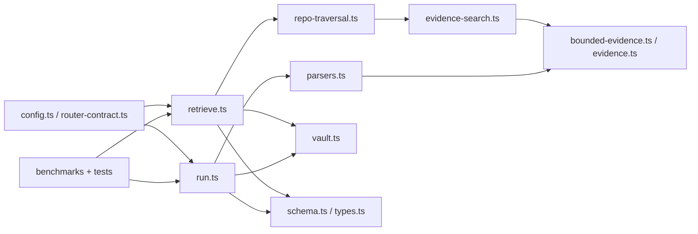
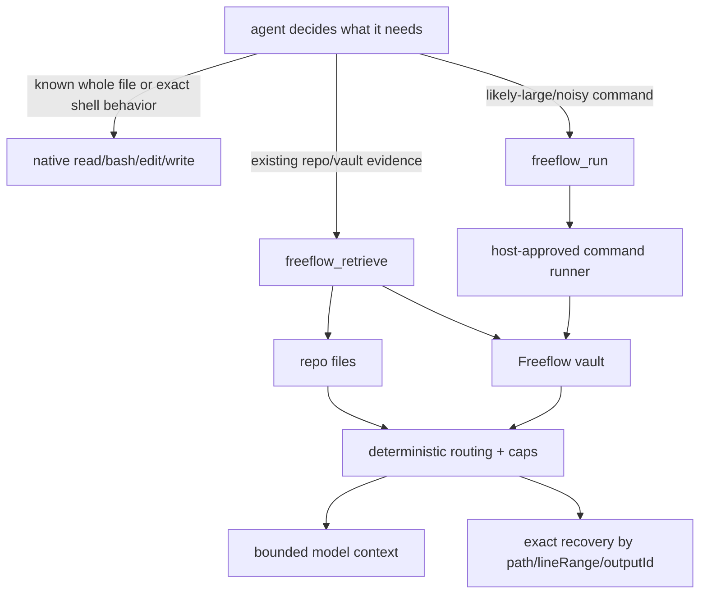
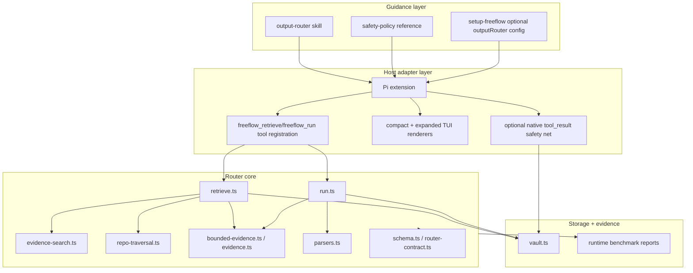
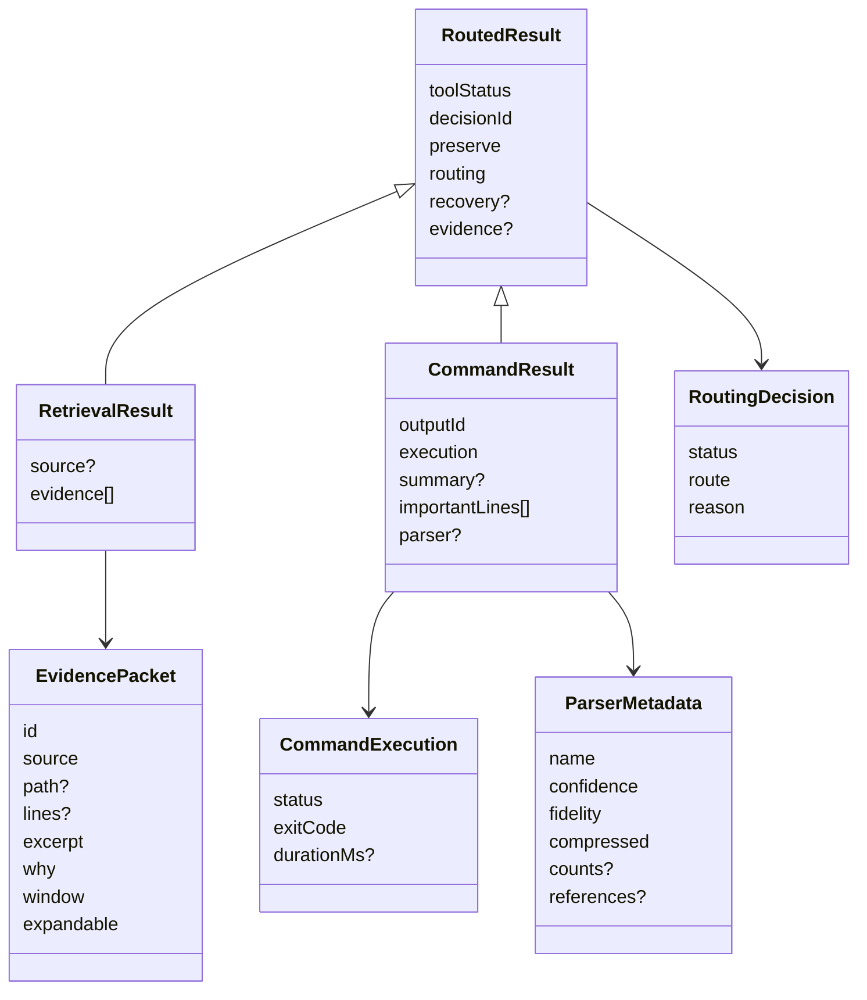
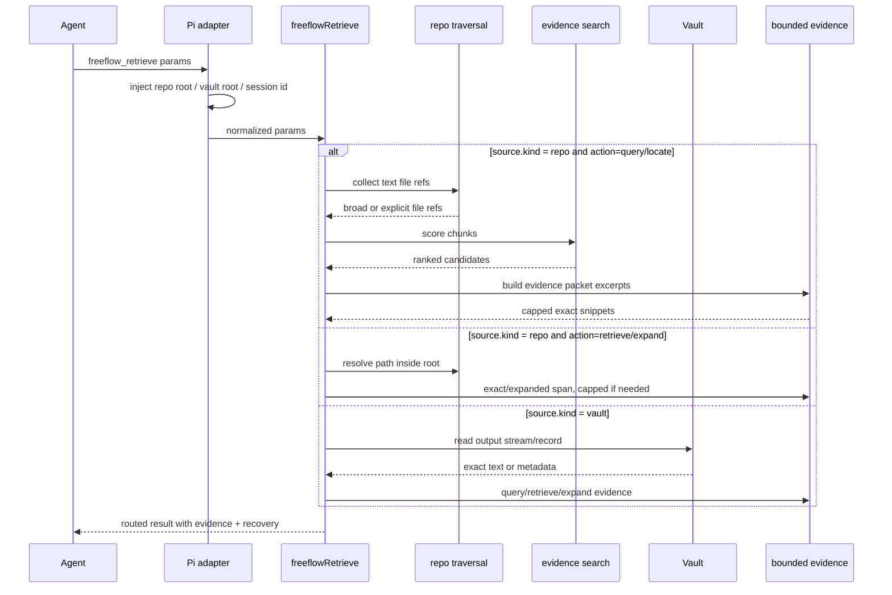
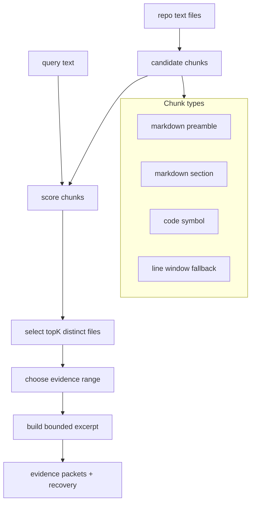
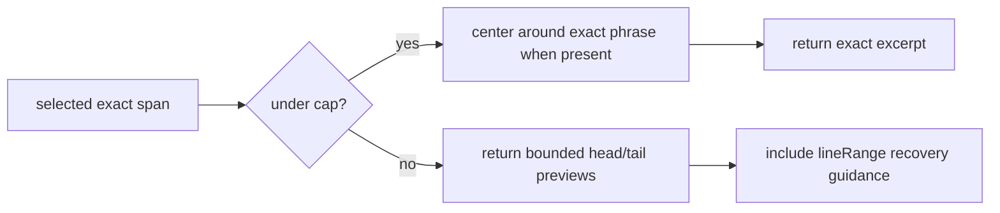
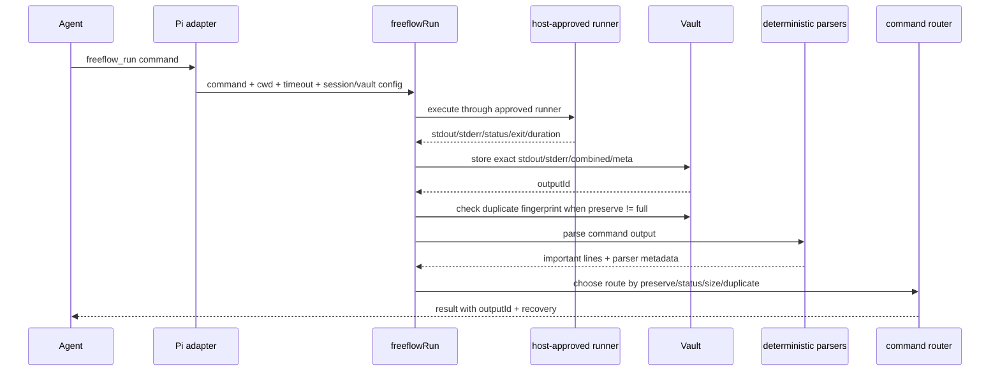
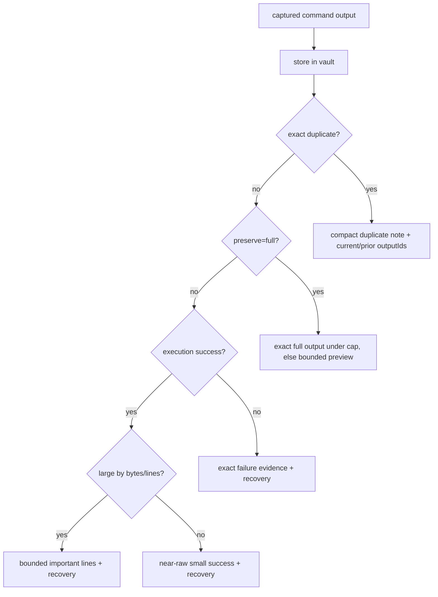
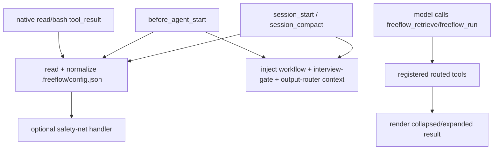

# Freeflow Output Router Architecture

> **Doc ID:** DESIGN-2026-06-19-freeflow-output-router-architecture
> **Date:** 2026-06-19
> **Owner:** Hassan Mohiddin
> **Type:** Architecture Design
> **Status:** Current
> **Source:** Live router source under `router/src/`, Pi extension source, output-router skills, setup docs, and runtime benchmark reports dated 2026-06-19/2026-06-20.

## Purpose

This is the A-to-Z architecture guide for Freeflow Output Router: what it is, why it exists, how it works, what ships today, what is experimental, and how to operate or extend it safely.

The detailed source-of-truth code lives under `router/src/`. This document explains that implementation in human terms and links concepts to the files that own them.

## How To Read This

If you are new to the router, read:

- `If You Only Read 10 Minutes`
- `Core Idea`
- `Tiny Diagram`
- `Glossary`
- `Tool Choice Policy`
- `The Two Main Tools`

If you are implementing or debugging, also read:

- `Runtime Architecture`
- `freeflow_retrieve Architecture`
- `freeflow_run Architecture`
- `Vault Architecture`
- `Config And Setup`
- `Pi Integration`
- `Safety Net Routing`

If you are reviewing release readiness, read:

- `Evidence And Benchmarks`
- `Adoption Decisions`
- `Known Non-Goals And Deferred Work`
- `Source Evidence Appendix`

## Diagram Map

| If you are trying to understand... | Start with... |
| --- | --- |
| Why the router exists | `Problem` and `Core Idea` |
| How routed tools fit around native tools | `Tiny Diagram` and `Runtime Architecture` |
| How repo retrieval chooses snippets | `Repo Query Flow` and `Retrieval Scoring` |
| How commands stay recoverable | `freeflow_run Architecture` and `Vault Architecture` |
| Why output is bounded | `Bounded Evidence` |
| How Pi exposes the router | `Pi Integration` |
| What config is allowed | `Config And Setup` |
| What is default versus experimental | `Adoption Decisions` |

## Router Repo Map

This is the router-specific map, not the whole Freeflow repo.

```text
router/
  src/
    index.ts                    public barrel exports
    types.ts                    preserve/action/status/result/vault types
    schema.ts                   runtime validation for results, config, records
    router-contract.ts          config invariants such as postToolRouting modes and positive thresholds
    config.ts                   defaults and .freeflow outputRouter normalization

    retrieve.ts                 freeflow_retrieve action dispatcher and repo/vault retrieval
    repo-traversal.ts           safe repo path resolution, broad-scan skips, generated-path globs
    evidence-search.ts          structural chunks, BM25-style scoring, exact phrase boosts
    evidence-range-selector.ts  narrows winning chunks to useful line spans
    bounded-evidence.ts         UTF-8-safe repo/vault excerpt caps and edge chunks
    line-ranges.ts              exact 1-based line-range validation

    run.ts                      freeflow_run execution routing, duplicate handling, recovery hints
    parsers.ts                  deterministic command parsers for tests, diagnostics, git, builds, generic output
    evidence.ts                 command important-line assembly and truncation markers
    vault.ts                    file-backed raw output vault, session index, locks, hashes, recovery reads

    benchmark-harness.ts        shared benchmark helpers
    benchmarks.ts               retrieval benchmark CLI/report
    command-benchmarks.ts       freeflow_run benchmark CLI/report
    index-benchmarks.ts         optional local-index benchmark CLI/report
    codex-qa-benchmarks.ts      Codex Structured Q&A macro benchmark
    experimental-local-index.ts compatibility export for the experimental index capsule
    experiments/local-index.ts  no-dependency local index experiment; not default runtime behavior

  tests/                        public API, regression, benchmark, safety, config, and module tests
  dist/                         built package runtime generated from src/
  tsconfig.json                 router TypeScript build config
```

Mental model:



## If You Only Read 10 Minutes

Freeflow Output Router is a deterministic evidence router for coding agents.

It exists because native tools like `read` and `bash` are direct and useful, but broad file reads, generated artifacts, logs, and long command output can flood the model context before the agent has proven the output is needed.

The router adds two explicit tools:

- `freeflow_retrieve`: find targeted, labeled, expandable evidence from repo files or previously vaulted output.
- `freeflow_run`: run likely-large/noisy commands once, vault exact raw output, then return compact important evidence plus an `outputId` for exact recovery.

The core rule is:

```text
Smallest sufficient evidence in context.
Exact raw recovery outside context.
No surprise native semantics.
```

Important defaults:

- Native `read`, `bash`, `edit`, and `write` keep their normal meaning.
- Scanner retrieval is the product default.
- The local index is experimental and not adopted by default.
- Native post-tool safety-net routing is off by default.
- `postToolRouting: "safety-net"` is opt-in.
- `postToolRouting: "strict"` is reserved; do not invent stronger blocking behavior.
- Runtime summarization/routing is deterministic; model-assisted routing is not default.

The router is not a new agent, not a global replacement for host tools, not a vector database, and not an enforcement hook system.

## Problem

Native tools are excellent when the agent knows exactly what it needs:

- read a known file,
- run a short command,
- edit a targeted region,
- inspect exact output.

They are weak when the agent is still exploring:

- searching broad repos,
- avoiding generated artifacts,
- handling huge single-line files,
- reading noisy command logs,
- preserving exact failed-command evidence,
- recovering raw output later without rerunning a command.

The dangerous failure is not merely “large output exists.” The deeper failure is:

```text
irrelevant or generated output enters context before the agent proves it is useful
```

The original router hardening work was motivated by a concrete failure: a broad query for the Codex Sandbox Permissions section selected a generated `graphify-out/graph.html` blob instead of the source markdown file. The improved router fixes that shape by skipping generated paths in broad scans, scoring source chunks more accurately, bounding evidence, and keeping exact recovery paths.

## Core Idea

The router separates three concerns:

```text
source truth       exact repo/vault/command output
routing decision  why this span/output was selected
model context     bounded evidence needed for the current turn
```

The model should not have to choose between “dump everything into context” and “lose exact evidence.”

The router captures or locates exact source truth, then returns a structured routed result:

- `toolStatus`: did the tool call itself succeed?
- `execution.status`: for commands, what happened to the command?
- `routing.status`: did routing pass through, reduce, partially return, or fail?
- `evidence` or `importantLines`: what exact snippets are currently useful?
- `recovery`: how to retrieve the exact/raw evidence later.

## Tiny Diagram



## Glossary

`Routed tool`
: A Freeflow tool that returns structured evidence instead of raw bulk output. Current routed tools are `freeflow_retrieve` and `freeflow_run`.

`Native tool`
: A host-provided tool such as Pi `read`, `bash`, `edit`, or `write`. Native tools remain available and direct.

`Evidence packet`
: A labeled excerpt returned by `freeflow_retrieve`. It includes source, path, lines, excerpt, `why`, window, and whether it can expand.

`Important line`
: A selected exact command-output span returned by `freeflow_run`.

`Vault`
: File-backed store for exact raw command/native output outside model context. The vault provides `outputId` recovery.

`Preserve mode`
: Fidelity request: `summary`, `important`, or `full`. Today the router is mostly exact/important-line oriented; `full` means exact fidelity up to caps, not unlimited context.

`Expansion`
: Breadth request for previous evidence: `lines_30`, `lines_80`, or `full`.

`Safety net`
: Optional post-tool routing for large native `read`/`bash` results. It is off by default.

`Scanner`
: The default deterministic repo traversal and scoring path used by `freeflow_retrieve`.

`Index`
: Experimental no-dependency local index benchmark path. It is not the default retrieval backend.

## Product Boundary

Output Router is a companion runtime inside Freeflow.

It ships as:

- TypeScript core under `router/src/`.
- Compiled runtime under `router/dist/` for package use.
- Pi extension integration under `pi-extension/index.js`.
- User/agent guidance under `skills/output-router/`.
- Optional setup config guidance under `skills/setup-freeflow/references/output-router-setup.md`.
- Benchmarks and reports under `evals/`.

It does not require Freeflow skills to depend on the router runtime. When the router is unavailable, agents can still use normal Freeflow workflow skills and host tools.

## Tool Choice Policy

Use this decision table:

| Need | Prefer |
| --- | --- |
| Existing unknown repo information | `freeflow_retrieve` |
| Candidate paths without broad excerpts | `freeflow_retrieve action=locate` |
| Exact known repo span | `freeflow_retrieve action=retrieve` with `source.path` and `lineRange` |
| More context around previous evidence | `freeflow_retrieve action=expand` |
| Exact output from a previous routed command/native safety-net result | `freeflow_retrieve` with `source.kind=vault` and `outputId` |
| Likely-large/noisy command | `freeflow_run` |
| Small exact command where raw output is desired directly | native `bash` |
| Whole known file/artifact | native `read` |
| File mutation | native `edit` / `write` |

Do not use the router to hide a lack of understanding. Use it to retrieve bounded evidence, then decide.

## Runtime Architecture

The current implementation has four layers:

1. Agent-facing skill guidance.
2. Host adapter integration.
3. Deterministic router core.
4. Vault and benchmark evidence.



## The Two Main Tools

### `freeflow_retrieve`

Retrieves existing information.

Sources:

- `repo`: local repo text files.
- `vault`: prior Freeflow-vaulted command/native output.

Actions:

| Action | Meaning |
| --- | --- |
| `query` | Find and return best evidence packets. Defaults to top 1. |
| `locate` | Return candidate locations with minimal evidence. Defaults to top 5. |
| `retrieve` | Retrieve an explicit repo/vault path and optional exact line range. |
| `expand` | Widen a previous evidence packet to more context. |
| `explain` | Explain a prior decision or vault output. |

Example repo query:

```json
{
  "action": "query",
  "source": { "kind": "repo" },
  "query": "Sandbox Permissions UseDefault RequireEscalated WithAdditionalPermissions",
  "preserve": "important"
}
```

Example exact repo span:

```json
{
  "action": "retrieve",
  "source": { "kind": "repo", "path": "docs/example.md" },
  "lineRange": { "start": 10, "end": 25 },
  "preserve": "full"
}
```

Example vault recovery:

```json
{
  "action": "retrieve",
  "source": { "kind": "vault", "outputId": "ffout_...", "stream": "combined" },
  "lineRange": { "start": 1, "end": 40 },
  "preserve": "full"
}
```

### `freeflow_run`

Runs a command through the host-approved runner, captures raw output, stores it in the vault, and returns routed evidence.

Example:

```json
{
  "command": "npm test",
  "cwd": ".",
  "timeoutMs": 900000,
  "goal": "verification",
  "preserve": "important"
}
```

The returned result includes:

- `outputId` for exact recovery,
- `execution.status` and `exitCode`,
- route reason,
- parser metadata,
- selected important lines,
- recovery instructions.

## Routed Result Contract

All routed results use stable status fields. They intentionally avoid a vague top-level `status`.



Status dimensions:

| Field | Values | Meaning |
| --- | --- | --- |
| `toolStatus` | `ok`, `error` | Did the Freeflow tool call complete? |
| `execution.status` | `success`, `failed`, `timed_out`, `cancelled` | What happened to the command? Only command results have this. |
| `routing.status` | `routed`, `passed_through`, `partial`, `failed` | How did output routing behave? |
| `routing.route` | `retrieve`, `run`, `safety-net`, `pass-through` | Which route handled the output? |

This separation prevents ambiguity such as “status failed” when the command failed but routing succeeded and preserved exact evidence.

## `freeflow_retrieve` Architecture

### Retrieve Flow



### Repo Path Resolution

`repo-traversal.ts` owns safe repo traversal.

Key behaviors:

- Realpaths the repo root and requested path.
- Rejects paths that escape the repo root.
- Distinguishes broad traversal from explicit requested paths.
- Broad traversal skips generated/dependency/cache directories.
- Explicit file or directory retrieval remains available even when broad scans would skip that path.
- Text files larger than the broad-scan cap are skipped in broad traversal.
- Binary-like extensions are skipped in broad traversal.
- Lockfiles are not skipped merely because they are large-ish/generated-like.

Default broad-scan skipped directories include:

```text
.git, node_modules, dist, build, out, .next, .nuxt, coverage, target,
graphify-out, .cache, .tmp, tmp, temp, logs, generated
```

Default broad-scan file exclusions include binary/media/archive/native artifacts, `.map`, `.log`, minified assets, bundle outputs, files over 1 MiB, and large HTML/JSON files over 64 KiB.

Repo-specific `generatedPaths` config adds broad-scan hints such as:

```json
{
  "outputRouter": {
    "generatedPaths": ["graphify-out/**", "dist/**"]
  }
}
```

Those hints affect broad scans. They must not remove the ability to explicitly retrieve a known path.

### Repo Query Flow

Repo query is scanner-based by default.



Candidate chunks come from:

1. Markdown preamble before the first heading.
2. Markdown heading sections.
3. Code symbol chunks for simple definitions such as `fn`, `class`, `interface`, `type`, `def`, etc.
4. Line windows when no structural chunks exist.

### Retrieval Scoring

`evidence-search.ts` owns deterministic scoring.

The scorer combines:

- token matching after stopword filtering,
- exact normalized phrase boost,
- BM25-style term frequency / inverse document frequency,
- query-token coverage ratio,
- complete coverage boost,
- missing coverage penalty for longer queries,
- heading coverage,
- backtick identifier coverage,
- ordered phrase boost,
- code definition boost for symbol chunks,
- chunk kind boost for symbols/sections,
- path intent boost,
- source/test prior,
- path text score,
- length penalty.

Important design details:

- Exact phrase matches receive a very high boost so copied text beats loose token repetition.
- Test paths are not blindly preferred unless the query looks test-related.
- Results are de-duplicated by file so `topK` returns distinct candidate files.
- `query` defaults to `topK=1`.
- `locate` defaults to `topK=5`.
- The maximum `topK` is 10.

### Evidence Range Selection

After a chunk wins, the router chooses a narrower line range when possible. Exact phrase matches and query-token coverage guide the range. Evidence is then bounded before it enters context.

Evidence packets include:

```json
{
  "id": "ev_...",
  "source": { "kind": "repo", "path": "docs/example.md" },
  "path": "docs/example.md",
  "lines": "10-25",
  "excerpt": "...",
  "why": "BM25-style scored section chunk with 6/6 query-token coverage near docs/example.md:12.",
  "window": "small",
  "expandable": true
}
```

### Locate Versus Query

`query` returns evidence that is intended to be read immediately.

`locate` returns candidate locations with smaller one-line evidence. Use it when you want a ranked candidate list before deciding what to expand or read.

### Retrieve Explicit Repo Spans

`action=retrieve` with a repo `source.path` supports:

- default first small span when no `lineRange` is supplied,
- exact 1-based line ranges,
- full-file retrieval when `preserve=full` and file size is under cap,
- bounded edge previews when full or exact ranges exceed caps.

Invalid line ranges are errors. The router should not silently clamp a requested line range past EOF.

### Expand Repo Evidence

`action=expand` widens previous repo evidence:

- default `lines_30`: ±30 lines,
- `lines_80`: ±80 lines,
- `full`: full file span subject to caps.

When expanded output exceeds caps, the router returns bounded head/tail chunks with recovery instructions rather than a lossy summary.

## Vault Retrieval Architecture

Vault retrieval mirrors repo retrieval, but the source is an `outputId` plus stream.

Supported streams:

- command records: `stdout`, `stderr`, `combined`,
- native safety-net text records: `raw`.

Vault actions:

| Action | Behavior |
| --- | --- |
| `query` | Lexically finds the best line in the selected stream and returns a small context window. |
| `retrieve` | Returns an exact 1-based line range, or bounded edge chunks if over cap. |
| `expand` | Expands previous vault evidence to `lines_30`, `lines_80`, or `full`. |
| `explain` | Reads vault metadata and explains output kind/status/decision ids. |

Vault query is intentionally simpler than repo query because the output is already scoped by `outputId`. The agent can query first, then retrieve exact line ranges after identifying the region.

## Bounded Evidence

Bounded evidence prevents context flooding while preserving exact recovery.

Current caps:

| Context | Cap |
| --- | ---: |
| Query excerpt | 8 KiB |
| Per-line preview | 2 KiB |
| `expand lines_30` | 32 KiB or 120 lines |
| `expand lines_80` | 64 KiB or 240 lines |
| Exact repo/vault line range before edge chunks | 64 KiB |
| Edge chunk | 32 KiB |
| `freeflow_run` large output threshold | 64 KiB or 1,000 lines by default |

Key properties:

- Truncation is UTF-8/code-point safe.
- Exact phrase excerpts try to keep the phrase inside the returned excerpt.
- Over-cap exact retrieval returns bounded head/tail chunks, not a model-written summary.
- Recovery instructions tell the agent how to request narrower exact spans.



## `freeflow_run` Architecture

### Command Run Flow



### Host Runner Boundary

The core router does not spawn arbitrary processes by itself. It depends on a host-provided runner.

In Pi, `freeflow_run` uses `pi.exec("bash", ["-lc", command])` through the Pi extension. The adapter maps host results into:

- `stdout`,
- `stderr`,
- `executionStatus`,
- `exitCode`,
- `durationMs`.

Execution statuses are:

| Status | Meaning |
| --- | --- |
| `success` | process exited with code 0 |
| `failed` | process exited non-zero |
| `timed_out` | host runner killed the process |
| `cancelled` | signal was aborted |

### Raw Capture First

The command output path is:

```text
execute once -> capture stdout/stderr/combined -> write vault -> route bounded evidence
```

If the adapter fails before output is captured, the result has `toolStatus: "error"`, empty `outputId`, and recovery says no command output was captured.

If routing fails after command execution, the router still tries to return bounded in-memory evidence and, if available, an `outputId` for recovery.

### Command Routing Rules

`run.ts` owns command routing.



Routing behavior:

| Case | Result |
| --- | --- |
| Exact duplicate output | Compact duplicate note, current and prior outputs remain recoverable. |
| `preserve=full` under cap | Exact output returned after vault capture. |
| `preserve=full` over cap | Bounded preview plus raw vault recovery. |
| Failed/timed-out/cancelled command | Selected failure evidence returned; raw output vaulted. |
| Large successful output | Bounded important lines returned; raw output vaulted. |
| Small successful output | Near-raw bounded output returned and vaulted. |

### Command Parsers

`parsers.ts` owns deterministic command parsing.

Current parsers run in priority order:

| Parser | Confidence | Trigger shape | Evidence selected |
| --- | ---: | --- | --- |
| `test-runner` | 0.92 | test-like commands | failure block and test summary lines |
| `typescript-lint` | 0.88 | TypeScript/lint-like commands | diagnostic references and error/warning lines |
| `git-status-diffstat` | 0.76 | `git status`, `git diff --stat`, `git show --stat`, diffstat | status/diffstat evidence lines |
| `build-toolchain` | 0.66 | build-like commands with errors | build failure block |
| `generic` | 0.35 | fallback | verification summary, failure block, stderr, or first non-empty line |
| `duplicate-output` | 1.00 | exact duplicate command output | compact duplicate metadata |
| `router-fallback` | 0.00 | router error after execution | bounded fallback evidence |

Parser metadata tells the agent how much trust to place in the extraction:

```json
{
  "name": "typescript-lint",
  "confidence": 0.88,
  "fidelity": "exact",
  "compressed": true,
  "counts": { "errors": 2, "warnings": 0 },
  "references": [
    { "path": "src/file.ts", "line": 12, "column": 5, "message": "..." }
  ]
}
```

The router does not pretend parser output is the only truth. The raw output remains recoverable by `outputId`.

## Vault Architecture

### What The Vault Stores

The vault is a filesystem-backed exact-output store.

Default root:

```text
~/.cache/freeflow-router/vault
```

Default retention:

```json
{ "strategy": "ttl", "ttlDays": 7 }
```

Command records store:

```text
objects/sha256_<content-hash>/
  meta.json
  stdout.txt
  stderr.txt
  combined.txt
```

Native safety-net text records store:

```text
objects/sha256_<content-hash>/
  meta.json
  raw.txt
```

Each session has an index:

```text
sessions/<session-id>/
  index.json
  index.json.lock
```

### IDs And Hashes

The vault uses content-derived IDs:

- `objectId`: `sha256_<full hash>`
- `outputId`: `ffout_<first 24 hash chars>`

Command fingerprints include:

- exact stdout/stderr/combined hash,
- normalized stdout/stderr/combined hash,
- command/cwd/execution status/exit-code fingerprint.

These fingerprints allow exact duplicate detection without relying on fuzzy text comparison.

### Session Index

The session index records:

- `outputs`,
- `records` by output id,
- `successful`, `failed`, `timedOut`, `cancelled` command groups,
- output kind,
- object id,
- timestamps,
- fingerprints.

Session index writes use:

- in-process promise chaining,
- file-backed lock file,
- atomic JSON write via temp file and rename.

That protects cross-process/session-index updates from common write races.

### Recovery Pattern

For exact command recovery:

```json
{
  "action": "retrieve",
  "source": { "kind": "vault", "outputId": "ffout_...", "stream": "combined" },
  "lineRange": { "start": 1, "end": 40 },
  "preserve": "full"
}
```

For exact native safety-net recovery:

```json
{
  "action": "retrieve",
  "source": { "kind": "vault", "outputId": "ffout_...", "stream": "raw" },
  "lineRange": { "start": 1, "end": 40 },
  "preserve": "full"
}
```

## Config And Setup

### Built-In Defaults

The router works without repo config.

Default normalized config:

```json
{
  "postToolRouting": "off",
  "thresholds": {
    "largeOutputBytes": 64000,
    "largeOutputLines": 1000
  },
  "vault": {
    "root": "~/.cache/freeflow-router/vault",
    "retention": { "strategy": "ttl", "ttlDays": 7 }
  }
}
```

### Optional Repo Config

`.freeflow/config.json` may include optional `outputRouter` config, but only when explicitly requested.

Supported setup-facing keys:

```json
{
  "defaultMode": "workflow",
  "outputRouter": {
    "postToolRouting": "off",
    "largeOutputBytes": 64000,
    "largeOutputLines": 1000,
    "vaultRoot": "~/.cache/freeflow-router/vault",
    "vaultRetentionDays": 7,
    "generatedPaths": ["graphify-out/**"],
    "noisyCommandHints": ["npm test"]
  }
}
```

Mapping into normalized runtime config:

| Repo key | Runtime field |
| --- | --- |
| `postToolRouting` | `config.postToolRouting` |
| `largeOutputBytes` | `config.thresholds.largeOutputBytes` |
| `largeOutputLines` | `config.thresholds.largeOutputLines` |
| `vaultRoot` | `config.vault.root` |
| `vaultRetentionDays` | `config.vault.retention.ttlDays` |
| `generatedPaths` | `config.hints.generatedPathGlobs` |
| `noisyCommandHints` | `config.hints.noisyCommandPatterns` |

Invalid config falls back safely with warnings.

### Setup Contract

`setup-freeflow` owns optional output-router config setup.

Rules:

- Minimal setup writes only `{ "defaultMode": "workflow" }`.
- Do not ask every setup user about router config.
- Do not write an empty `outputRouter` object.
- Do not dump defaults.
- Write only keys the user explicitly requested.
- Do not create a separate `setup-output-router` skill.
- Do not enable native safety-net routing unless explicitly requested.

The STP-011 setup eval verifies optional router config while preserving minimal setup behavior.

## Pi Integration

The Pi extension is the strongest current host adapter.

It does five router-related things:

1. Loads `output-router` skill and safety policy into runtime context.
2. Reads `.freeflow/config.json` and normalizes optional router config.
3. Registers `freeflow_retrieve` and `freeflow_run` tools.
4. Renders compact and expanded TUI views for routed results.
5. Optionally handles native `read`/`bash` safety-net routing on `tool_result` when configured.



Pi tool parameter normalization:

- Repo source gets `root: ctx.cwd`.
- Vault source gets `root` from router config and `sessionId` from Pi session id.
- Generated path hints are passed into repo retrieval.
- `freeflow_run` gets vault root, retention, thresholds, current cwd, and host runner.

Pi TUI behavior:

- Collapsed rows show route status, evidence count, output id, parser, and recovery hint availability.
- Expanded rows show routing details, evidence excerpts, parser metadata, important lines, and vault recovery instructions.

## Safety Net Routing

Safety net routing is optional post-tool routing for native `read` and `bash` outputs.

Default:

```json
{ "postToolRouting": "off" }
```

When enabled with `safety-net`, the Pi extension may vault and replace large native results with a labeled routed output.

A native result may route when:

- the tool is `read` or `bash`, and
- safety net is enabled, and
- output exceeds configured bytes or lines, or
- output matches configured generated/noisy hints and exceeds conservative heuristic floors.

The returned text must say:

- Freeflow routed this native result,
- why it routed,
- `outputId`, stream, line and byte stats,
- exact recovery instructions,
- exact first captured lines.

If safety-net routing fails, it fails open: the native output passes through with a warning.

This behavior follows `skills/output-router/references/safety-policy.md`.

## Safety Policy

The safety policy protects exactness-sensitive output.

Exactness-sensitive output includes:

- user-requested exact/full output,
- small outputs,
- verification output needed for completion claims,
- failure evidence needed for diagnosis,
- source-truth conflict evidence,
- security/privacy/billing/data-loss/public API evidence,
- anything marked `preserve: full`.

Required behavior:

- Capture raw evidence before transformation whenever output is routed.
- Label transformed native results as Freeflow-routed output.
- Include `outputId` and recovery instructions for routed output.
- Preserve exact failure and verification evidence lines.
- Pass small native outputs through unchanged.
- For huge exactness-sensitive output, use vaulting and exact chunk retrieval instead of lossy summarization.

## Experimental Local Index

A no-dependency local index exists as an experiment and benchmark target.

It is not the default backend.

Current adoption decision:

```text
scanner remains default
index is not adopted by default
SQLite/FTS is not adopted
external/vector services are not required
```

The index benchmark measures cold build, warm query, stale refresh, generated false positives, context bytes, and latency. It is useful evidence, but not product behavior.

Do not change docs or setup to imply indexing is required.

## Evidence And Benchmarks

Durable runtime reports live under `evals/reports/runtime/`.

### Retrieval Benchmark

Report: `output-router-benchmark-1-report.md`

Summary:

- Improved router passed 7/7 gated fixtures.
- Native baseline proxy passed 3/7.
- Pre-hardening Freeflow proxy passed 2/7.
- Improved generated false positives: 0/7.
- Improved path/span/excerpt checks: 7/7 each.
- Sandbox failure fixed: yes.

Important fixtures include:

- exact copied text,
- markdown heading/body query,
- generated artifact decoy,
- huge single-line decoy,
- ambiguous multi-file query,
- vaulted output query,
- expand narrow evidence.

### Command Benchmark

Report: `output-router-command-benchmark-1-report.md`

Summary:

- Improved `freeflow_run` passed 8/8 fixtures.
- Exact fact preservation: 8/8.
- Raw vault recovery: 8/8.
- Failed command facts preserved: yes.
- Weighted byte/token reduction: 85.03% / 85.02%.

Fixtures include:

- noisy success,
- failed stack trace,
- test summary,
- TypeScript/lint diagnostics,
- git output,
- repetitive log,
- huge JSON/table,
- repeated command output.

### Optional Index Benchmark

Report: `output-router-index-benchmark-1-report.md`

Summary:

- Scanner remains default: yes.
- Index adopted by default: no.
- Scanner pass: 3/3.
- Warm index pass: 3/3.
- Generated false positives: 0/12.

### Codex Structured Q&A Macro Benchmark

Report: `output-router-codex-qa-benchmark-1-report.md`

Summary:

- Improved Freeflow Router passed 1/1.
- Native broad-search proxy passed 0/1.
- The native proxy selected `graphify-out/graph.html`.
- Improved router selected `docs/codex-cli-agent-harness/2026-06-12-pass-3-sandboxing-and-permissions.md` and expanded enough evidence to answer the question.

### Setup Config Eval

Report: `evals/reports/by-skill/setup-freeflow-5-report.md`

Summary:

- `setup-freeflow` supports optional `outputRouter` config only when requested.
- Minimal setup still writes only `defaultMode`.
- STP-011 passed for requested `postToolRouting: "off"`, `largeOutputLines: 2000`, and generated paths.

## Adoption Decisions

Current release/adoption state:

| Area | Decision |
| --- | --- |
| Repo retrieval backend | Scanner is default. |
| Generated artifact handling | Broad scans skip generated/dependency/cache paths; explicit retrieval remains available. |
| Local index | Experimental only. |
| SQLite/FTS | Not adopted. Needs benchmark evidence and explicit approval. |
| Model-assisted routing/summarization | Not default. |
| Native post-tool routing | Off by default. Opt-in only. |
| `strict` post-tool mode | Reserved; do not invent blocking behavior. |
| External tools | Graphify, Claude Context, RTK, and Squeez are optional comparators/references, not dependencies. |
| Public tool contract | Keep `freeflow_retrieve`, `freeflow_run`, and routed-result schema stable. |

## Failure Modes And How The Router Handles Them

| Failure mode | Router response |
| --- | --- |
| Generated artifact wins broad search | Broad traversal skips generated paths; scorer rewards exact phrase/source chunks. |
| Huge single-line file floods context | Per-line preview and excerpt byte caps truncate safely with recovery guidance. |
| Agent needs exact lines beyond cap | Return bounded edge chunks and instruct narrower `lineRange` retrieval. |
| Command fails | Preserve exact failure evidence and vault raw output. |
| Command output is huge but successful | Return bounded important lines and recovery id. |
| Same command output repeats | Return compact duplicate note; current and prior output ids remain recoverable. |
| Router config is invalid | Fall back to built-in defaults and warn. |
| Safety-net routing fails | Fail open: pass native output through with warning. |
| User wants raw/direct behavior | Use native read/bash or exact `freeflow_retrieve` line ranges. |

## Extensibility Points

Safe extension paths:

- Add deterministic command parsers with confidence/fidelity metadata.
- Add benchmark fixtures before changing retrieval ranking.
- Extend repo chunking only if it improves measured accuracy without breaking exact recovery.
- Add adapters for other hosts while preserving public tool names and result schema.
- Expand vault browsing/pruning only as explicit tools or setup workflows.
- Keep optional index work behind benchmark/adoption gates.

Risky changes that require owner approval:

- enabling native post-tool routing by default,
- making model-assisted routing default,
- requiring SQLite/FTS/vector databases/external services,
- changing `freeflow_retrieve` or `freeflow_run` public names,
- changing routed-result schema fields,
- hiding exact recovery behind summaries,
- treating generated-path hints as explicit-path denial rules.

## Operational Guidance

### When Using The Router

1. Use `freeflow_retrieve query` before broad reads.
2. Use `locate` when you need candidate paths first.
3. Use `expand` when the first evidence is relevant but too narrow.
4. Use `retrieve` with exact line ranges when you need precise recovery.
5. Use `freeflow_run` for commands likely to be noisy.
6. Use native `bash` for small direct commands where exact raw behavior is the point.
7. Mention what was verified before claiming work is complete.

### When Changing The Router

1. Add or update benchmark fixtures first when behavior changes.
2. Preserve scanner/default behavior unless an explicit adoption decision changes it.
3. Preserve public routed-result schema.
4. Preserve raw capture before transformation.
5. Run targeted tests and benchmark scripts.
6. Update release evidence only with measured claims.

Common verification commands:

```sh
npm run test:router
npm run bench:router
npm run bench:router:commands
npm run bench:router:index
npm run bench:router:codex-qa
evals/scripts/check-runtime-context-hook.sh
evals/scripts/check-activation-contract.sh
npm pack --dry-run --json
git diff --check
```

## Known Non-Goals And Deferred Work

Not current behavior:

- mandatory index build,
- SQLite/FTS default retrieval,
- vector database dependency,
- model-assisted router default,
- native post-tool safety-net default,
- repo-local hooks created by setup,
- separate `setup-output-router` skill,
- external Graphify/Claude Context/RTK/Squeez dependency,
- vault browser/pruning command,
- full corpus recreation benchmark as a release gate.

Deferred work:

- larger Codex macro benchmark stages,
- optional external comparator wiring,
- long-session vault retention/pruning UX,
- additional deterministic command parsers,
- future host adapters beyond Pi,
- adoption decision for any index backend only after stronger evidence.

## Source Evidence Appendix

Primary implementation files:

| File | Owns |
| --- | --- |
| `router/src/config/types.ts` | Public internal types: preserve modes, actions, statuses, evidence packets, routed results, vault records. |
| `router/src/config/config.ts` | Defaults and `outputRouter` config normalization. |
| `router/src/config/router-contract.ts` | Config contract invariants. |
| `router/src/config/schema.ts` | Runtime validation of preserve/actions/results/config/records. |
| `router/src/tools/retrieve.ts` | `freeflow_retrieve` implementation. |
| `router/src/evidence-search.ts` | Structural chunking and ranking. |
| `router/src/evidence-range-selector.ts` | Evidence span narrowing. |
| `router/src/repo/repo-traversal.ts` | Safe repo traversal and broad-scan filters. |
| `router/src/bounded-evidence.ts` | UTF-8-safe bounded repo/vault excerpts. |
| `router/src/tools/run.ts` | `freeflow_run` execution/routing. |
| `router/src/routing/parsers.ts` | Deterministic command parsers. |
| `router/src/evidence/evidence.ts` | Important-line assembly for command output. |
| `router/src/vault/vault.ts` | File-backed vault, session index, duplicate fingerprints. |
| `router/src/experiments/local-index.ts` | Experimental no-dependency index. |
| `pi-extension/index.js` | Pi tool registration, runtime context, TUI rendering, safety net. |
| `hooks/freeflow-runtime-context.mjs` | Codex/Claude setup detection; accepts optional object-shaped `outputRouter`. |

Primary docs and skills:

| File | Owns |
| --- | --- |
| `skills/output-router/SKILL.md` | Agent-facing tool choice and recovery guidance. |
| `skills/output-router/references/safety-policy.md` | Exactness-sensitive routing policy. |
| `skills/setup-freeflow/references/output-router-setup.md` | Optional repo config setup rules. |
| `docs/specs/freeflow-output-router-design.md` | Original router design spec. |
| `docs/specs/freeflow-output-router-excellence-spec.md` | Accuracy/benchmark/index hardening spec. |
| `plugin-docs/release-evidence.md` | Current release evidence summary. |

Primary reports:

| Report | Evidence |
| --- | --- |
| `evals/reports/runtime/output-router-benchmark-1-report.md` | Retrieval benchmark, 7/7 improved pass. |
| `evals/reports/runtime/output-router-command-benchmark-1-report.md` | Command benchmark, 8/8 improved pass and recovery. |
| `evals/reports/runtime/output-router-index-benchmark-1-report.md` | Optional index experiment; scanner default preserved. |
| `evals/reports/runtime/output-router-codex-qa-benchmark-1-report.md` | Codex Structured Q&A macro benchmark. |
| `evals/reports/by-skill/setup-freeflow-5-report.md` | Optional outputRouter setup/config eval. |
