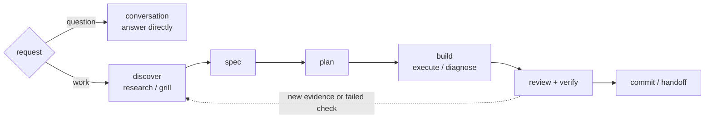
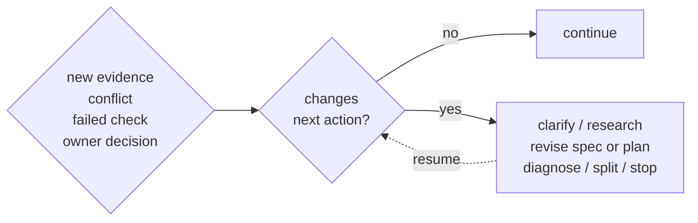

# Workflow

Freeflow is a workflow layer, not a new agent. It helps the agent choose the right amount of process for the task.

## Modes

- `conversation`: answer, explain, critique, or explore without workflow pressure.
- `workflow`: default for consequential work; use the workflow spine and scale detail to risk.
- `strict-workflow`: high-risk or hard-to-reverse work with stronger gates.

Use strict-workflow for security, privacy, billing, public APIs, migrations, data loss, compatibility, permissions, deployment, or irreversible architecture.

## Map

The map is orienting, not mandatory. Small reversible work can skip unnecessary artifacts and gates.

## Backward Edge

Loop back when new evidence changes the path:

The agent should not silently choose the backward destination when the choice changes product behavior, scope, compatibility, public APIs, security, privacy, billing, data loss, permissions, or irreversible architecture.

## Bypass

Bypass skips ceremony, not judgment.

Use `bypass` only to skip an unnecessary gate. It does not skip user-owned decisions, source-truth conflicts, risky checks, or fresh verification before completion claims.
