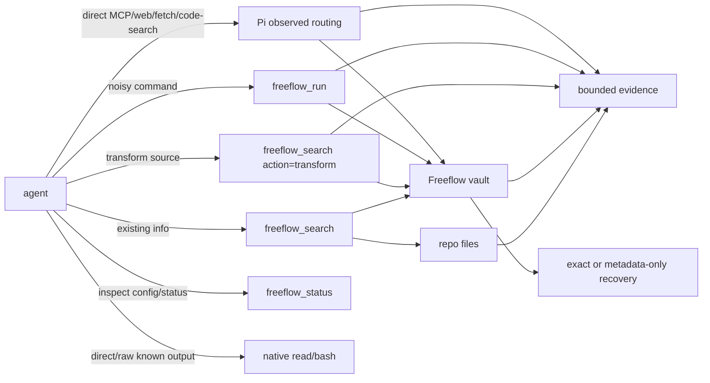

# Output Router

Freeflow Output Router keeps agent context focused while preserving exact evidence outside context.

Use it when broad repo exploration, generated artifacts, large logs, or noisy command output would otherwise flood the model.

For the full architecture, see [`docs/designs/freeflow-output-router-architecture.md`](../docs/designs/freeflow-output-router-architecture.md).

## Core Idea

```text
smallest sufficient evidence in context
+ exact recovery when exactness matters
+ no surprise native tool semantics
```

The router ships explicit tools and Pi observed routing:

- `freeflow_search`: search/retrieve repo or vault evidence, and transform file/output sources through `action="transform"`.
- `freeflow_run`: run shell commands or sandboxed script producers, apply the run storage policy, and return compact evidence with recovery guidance.
- `freeflow_batch`: run independent `run`/`search` steps and optionally aggregate query answers.
- Pi observed routing: route enabled MCP/web/fetch/code-search outputs after direct host tool calls.
- `freeflow_status`: inspect effective config, observed routing, script transform, vault writability/index state, and non-destructive migration recommendations.

Native tools still matter:

- use native `read` for known whole files,
- use native `bash` for small/direct raw shell behavior,
- use native `edit`/`write` for mutations.

## Tiny Map



## Tool Choice

| Need | Use |
| --- | --- |
| Find repo evidence before reading files | `freeflow_search action=query` |
| Get candidate paths first | `freeflow_search action=locate` |
| Find where exact-ish text/code exists | `freeflow_search action=get` |
| Retrieve exact known repo/vault lines | `freeflow_search action=retrieve` with `lineRange` |
| Widen previous evidence | `freeflow_search action=expand` |
| Explain a previous routed decision/output | `freeflow_search action=explain` |
| Run noisy/large command output | `freeflow_run` with `command` |
| Run code as a sandboxed base producer | `freeflow_run` with `script` |
| Use enabled Pi MCP/web/fetch/code-search output | Call the host tool directly; observed routing runs after the tool result |
| Transform repo/vault sources or compute deterministic subsets/stats from vaulted output | `freeflow_search action=transform` |
| Inspect script-transform disabled/unavailable state | `freeflow_status` |
| Inspect effective config, observed routing, script transform, vault/index state, or migration recommendations | `freeflow_status` |
| Read a known whole file | native `read` |
| Run small exact command | native `bash` |

## `freeflow_search`

Sources:

- `repo`: local repo files.
- `vault`: previous routed command/native/observed/transformed output, either by known `outputId` or vault-wide index query.

Actions:

- `query`: returns best evidence packets; default `topK=1`. For vault sources, omit `outputId` to search the current session's vault index.
- `locate`: returns candidate locations; default `topK=5`. For vault sources, omit `outputId` to locate indexed vault outputs without raw retrieval.
- `get`: maps exact-ish text/code/query to the best matching path or output id plus line range and matched content.
- `retrieve`: maps known coordinates to exact content; use it when path/output id and line range are already known.
- `expand`: expands a previous evidence packet to `lines_30`, `lines_80`, or `full`.
- `explain`: explains a route decision or vault output.

Example:

```json
{
  "action": "query",
  "source": { "kind": "repo" },
  "query": "Sandbox Permissions UseDefault RequireEscalated WithAdditionalPermissions",
  "preserve": "important"
}
```

Vault-wide indexed query:

```json
{
  "action": "query",
  "source": { "kind": "vault" },
  "query": "rate limit deployment failed github issue",
  "filters": { "producerKind": "mcp", "server": "github" }
}
```

Evidence packets include:

- source/path,
- line range,
- exact excerpt,
- why the router selected it,
- expansion/recovery guidance.

Repo retrieval uses deterministic scanner ranking by default. Broad scans skip generated/dependency/cache paths such as `graphify-out/**`, but explicit path retrieval remains available.

Vault-wide retrieval uses the vault index sidecar. Exact records return source output ids, streams, and line ranges for recovery; metadata-only records can be found by metadata but do not expose raw recovery. Use `filters` for producer/server/tool/hostToolName/stream/record-kind/recoverability narrowing. Use `source.outputId` with `retrieve`, `expand`, or `explain` when the exact vaulted output is known.

## `freeflow_run`

`freeflow_run` executes one base producer, applies the configured run storage policy, then returns useful evidence. The base producer can be either a host-approved shell command or a sandboxed script. The default `hybrid-dedupe` policy keeps exact raw recovery for exactness-sensitive output while allowing small non-sensitive command successes to become metadata-only. Script producers are treated as exactness-sensitive because raw script text is not persisted.

Command example:

```json
{
  "command": "npm test",
  "goal": "verification",
  "preserve": "important"
}
```

Sandboxed script producer example:

```json
{
  "script": {
    "language": "javascript",
    "code": "console.log(JSON.stringify({ ok: true }))",
    "label": "emit-json"
  },
  "preserve": "important"
}
```

Returned results include:

- `outputId`,
- `execution.status` and `exitCode`,
- `producer.kind` (`command` or `script`),
- `scriptProducer` metadata for sandboxed script producers, including language, policy, adapter, limits, and code hash,
- parser metadata,
- important lines,
- exact recovery instructions when exact recovery exists, or metadata-only rerun guidance when it does not.

Command parsers currently cover:

- test runner output,
- TypeScript/lint diagnostics,
- git status/diffstat,
- build/toolchain errors,
- generic fallback,
- duplicate output detection.

## Pi Observed Routing

Pi observed routing handles configured MCP, web, fetch, and code-search outputs after direct host tool execution. Public Pi `freeflow_capture` has been removed; use the host MCP/web/fetch/code-search tool directly and configure `observedRouting` when routed recovery is needed.

Mutating MCP/tools remain direct host calls after explicit user intent. Freeflow treats read/write classification as routing metadata, not as a host permission gate.

## `freeflow_search action=transform`

`freeflow_search action=transform` transforms existing vaulted output. Current deterministic operations do not execute arbitrary code.

`operation.kind="script"` is the sandboxed transform branch under the same tool. `freeflow_run` also exposes the same sandbox engine as a base `script` producer. Both are disabled by default, have no unsandboxed fallback, and do not persist raw script text. Transform scripts vault successful stdout as transformed text with source lineage. Run script producers capture stdout/stderr/combined as run output with `producer.kind="script"`; failures and output-limit overflows return structured no-recovery results.

Current product execution support is Pi-first and explicit package-root opt-in:

- JavaScript can run through a proof-backed QuickJS adapter only when script transform is explicitly enabled and Pi can discover a local `quickjs-wasi` package root.
- Python can run through a proof-backed Eryx adapter only when script transform is explicitly enabled and Freeflow can discover an installed `@bsull/eryx` package root plus a JSPI-capable Node runtime. Setup installs `node@24` for this Python child runner. When the host process lacks JSPI, the adapter runs Eryx through that setup-installed child Node process launched with `--experimental-wasm-jspi` and enables Python only if the runner passes sandbox proofs.
- jq can run through a proof-backed `jq-wasm` adapter only when script transform is explicitly enabled and Pi can discover a local `jq-wasm` package root.

`freeflow_status` reports the script-sandbox contract version, configured languages, required adversarial proofs, rejected unsafe mechanisms such as Node `vm`/plain subprocesses, candidate-unproven OS sandbox adapters, and whether QuickJS, Eryx, and jq-wasm adapters are available. A language remains unavailable until a registered adapter passes every required proof. Proof results are cached in-process by adapter content hash and probe limits so repeated status/transform checks do not rerun the same adversarial probes.

Current deterministic operations include:

- regex filtering and match counts,
- JSON Pointer/path extraction,
- grouping, dedupe, and topN extraction,
- URL/citation extraction,
- line and size stats.

Transformed output is vaulted separately and points back to source output ids through lineage. Script operation hashing records code hashes, not raw code.

### Optional script adapters

Freeflow setup can install script adapters into a user-global cache after explicit consent. The default adapter home is `~/.cache/freeflow-script-adapters`; override it with `FREEFLOW_SCRIPT_TRANSFORM_ADAPTERS_HOME` when needed. Setup installs:

- `quickjs-wasi@3.0.1` for JavaScript.
- `jq-wasm@1.2.0-jq-1.8.2` for jq.
- `@bsull/eryx@0.5.0` plus `node@24` for Python. The adapter launches the setup-installed child Node process with `--experimental-wasm-jspi` when needed; setup enables Python only after that child runner passes sandbox proofs.

Freeflow auto-discovers adapters from the global cache. Explicit package-root overrides remain available:

- `FREEFLOW_QUICKJS_WASI_ROOT` for a custom `quickjs-wasi` package root.
- `FREEFLOW_JQ_WASM_ROOT` for a custom `jq-wasm` package root.
- `FREEFLOW_ERYX_ROOT` for a custom `@bsull/eryx` package root.

Discovery alone does not enable execution. `.freeflow/config.json` must opt in. The setup installer writes only proof-passing languages, for example:

```json
{
  "defaultMode": "workflow",
  "scriptTransform": {
    "enabled": true,
    "languages": ["javascript", "jq"]
  }
}
```

Supported `scriptTransform` keys are `enabled`, `sandbox`, `languages`, `network`, `limits`, and `rawScriptPersistence`. Defaults keep `sandbox: "auto"`, `network: "off"`, `rawScriptPersistence: "disabled"`, and conservative input/output/time limits. Per-call script limits may only tighten configured limits.

QuickJS guest JavaScript receives only `readText(alias)`, `writeText(text)`, `console.log`, and `console.error`. Eryx guest Python receives `read_text(alias)`, `write_text(text)`, and a `sources` dict keyed by source alias. jq receives a JSON object keyed by source alias, so a source with alias `log` is available as `.log`. Vault sources are copied into temporary input files before adapter execution; repo, home, vault, process, require, fetch, package loading, and host filesystem APIs are not exposed to guest code. Invalid or missing adapter roots fail closed as adapter unavailable.

The Python adapter runs Eryx inside a Node Worker with Worker termination for timeouts, bounded stdout/stderr before results cross the Worker-to-host boundary, a temp-copy import rewrite to force preview2 browser/in-memory shims, and a deny-only network shim. It collects no output files; transformed content comes from stdout. Residual caveat: Eryx/Python can still materialize large strings inside the Worker before wrapper truncation; product execution treats output-limit overflow as a structured failure with no exact recovery.

The jq adapter runs `jq-wasm` inside a Node Worker with Worker termination for timeouts and bounded stdout/stderr before results cross the Worker-to-host boundary. Residual caveat: `jq-wasm` can still generate large in-Worker strings before truncation; product execution treats output-limit overflow as a structured failure with no exact recovery.

### Local unsafe processing opt-in

Freeflow also has an internal processing-engine branch for local power users who explicitly accept unsandboxed execution risk. This is not enabled by shared repo config.

Use local-only `.freeflow/local.json`:

```json
{
  "processing": {
    "unsafeUnsandboxed": {
      "enabled": true
    }
  }
}
```

Rules:

- `.freeflow/local.json` is local-only and should be ignored by git.
- `.freeflow/config.json` cannot enable unsafe unsandboxed processing.
- Each call must still request `script.policy="unsafe-unsandboxed"`; sandboxed remains the default.
- Unsafe results must say `unsafe/unsandboxed`; they must not claim sandbox, read-only, or network-off execution.
- Missing or invalid local opt-in rejects the unsafe call. Freeflow must not silently fall back to an unsandboxed host path.

## `freeflow_status`

`freeflow_status` reports effective Freeflow behavior without rewriting config.

It shows:

- router enabled/profile and thresholds,
- vault path and writability,
- observed-routing policy and recoverability defaults,
- script-transform enabled/off state through `scriptTransform`, adapter availability, configured languages, required sandbox proofs, rejected/candidate mechanisms, no-network policy, limits, and raw-script persistence state,
- config warnings and safe fallbacks,
- non-destructive migration recommendations for stale explicit defaults or unknown keys.

Migration recommendations are informational only. They require explicit confirmation before any future rewrite of `.freeflow/config.json`.

## Vault Recovery

Recover exact command output with:

```json
{
  "action": "retrieve",
  "source": { "kind": "vault", "outputId": "ffout_...", "stream": "combined" },
  "lineRange": { "start": 1, "end": 40 },
  "preserve": "full"
}
```

Streams:

- command output: `stdout`, `stderr`, `combined`,
- native safety-net output: `raw`.

Default vault root:

```text
~/.cache/freeflow-router/vault
```

## Config

The router works with built-in defaults. Minimal `/setup-freeflow` writes only `defaultMode`.

Optional repo config lives in `.freeflow/config.json` only after the setup evidence-routing decision point or an explicit request:

```json
{
  "defaultMode": "workflow",
  "outputRouter": {
    "enabled": true,
    "profile": "standard",
    "postToolRouting": "off",
    "storagePolicy": "hybrid-dedupe",
    "largeOutputBytes": 64000,
    "largeOutputLines": 1000,
    "vaultRoot": "~/.cache/freeflow-router/vault",
    "vaultRetentionDays": 7,
    "generatedPaths": ["graphify-out/**"],
    "noisyCommandHints": ["npm test"]
  },
  "observedRouting": {
    "enabled": true,
    "onRoutingFailure": "fail-open",
    "mcp": {
      "servers": {
        "github": { "enabled": true, "persistence": "exact" },
        "gmail": { "enabled": true, "persistence": "metadata-only" }
      }
    },
    "web": { "enabled": true, "persistence": "exact" },
    "fetch": { "enabled": true, "persistence": "exact" },
    "codeSearch": { "enabled": true, "persistence": "exact" }
  }
}
```

Rules:

- `postToolRouting` defaults to `off`.
- `storagePolicy` defaults to `hybrid-dedupe` for `freeflow_run` command/script capture. `store-everything` is the compatibility/diagnostic override.
- Small non-sensitive successful command output may be metadata-only; failures, verification/diagnosis/build/test output, `preserve=full`, filters/script filters, script producers, and large/noisy output stay exact.
- Exact duplicate run output may store current metadata pointing to a prior exact `outputId`; plain metadata-only records must not claim exact recovery.
- `safety-net` is opt-in.
- `strict` is reserved.
- Observed routing is opt-in per producer/server. Setup writes explicit entries only after the user chooses them.
- Observed-routing persistence modes are `exact`, `metadata-only`, and `none`. `redacted` is future-only and not a setup option.
- Native safety-net routing is configured with `outputRouter.postToolRouting`; removed `capture` and `providers` config must not be written.
- Do not dump defaults into config.
- Write only requested keys.

## Observed Routing

Pi can route enabled MCP, web, fetch, and code-search outputs after the direct host tool call. The agent still calls the host tool directly; Freeflow only routes/reduces/stores the completed output.

Observed routing is off by default. Setup must choose each enabled producer/server and its persistence mode up front.

## Native Safety Net

Pi can optionally route large native `read`/`bash` results after the tool runs.

Default: off.

When enabled, a routed native result is labeled, vaulted, and includes an `outputId`. If safety-net routing fails, Freeflow fails open and returns native output with a warning.

## Defaults And Experiments

Current adoption decisions:

- Scanner retrieval is the default backend.
- The no-dependency local index is experimental and not adopted by default.
- SQLite/FTS is not adopted.
- Model-assisted routing is not default.
- Graphify, Claude Context, RTK, and Squeez are optional references/comparators, not dependencies.

## Evidence

Current release evidence:

- Retrieval benchmark: improved router passed 7/7 fixtures.
- Command benchmark: `freeflow_run` passed 8/8 fixtures with exact recovery for exactness-sensitive command fixtures and duplicate recovery through prior exact output ids.
- Historical capture/transform/provider eval: targeted Slice 9 eval passed 14/14 objective gates before the provider-summary config surface was removed; observed routing now owns producer output routing.
- Pi observed-routing eval: targeted eval passed 28/28 objective gates for MCP, web, fetch, code-search, metadata-only persistence, and Pi capability status.
- Vault-index storage spike: selected deterministic local JSON sidecar behind the vault-index interface; SQLite/FTS remains deferred because native/runtime dependency adoption needs owner approval.
- Optional repo-source index benchmark: scanner remains default; repo-source index not adopted. Latest repo search backend benchmark compared scanner-only, local lexical index, Node `node:sqlite` FTS5/BM25/trigram, and conservative hybrid scanner+index; all passed 3/3 fixtures with recall@3 3/3 and zero generated false positives. FTS was tested through the experimental Node runtime available in this environment; no package dependency was added.
- Storage-policy benchmark: `hybrid-dedupe` is the command-capture default after benchmark evidence; threshold-only storage was disqualified.
- Codex Structured Q&A benchmark: improved router passed the Sandbox Permissions fixture where native broad search selected `graphify-out/graph.html`.
- Context Mode normalized benchmark: Freeflow-owned tools and the normalized Context Mode-style proxy both passed 6/6 fixtures. Freeflow preserved exact facts/recovery on 6/6 but did not beat the proxy on model-visible bytes in these normalized fixtures; no public superiority claim is made.
- Setup eval: optional `outputRouter`/`observedRouting`/`scriptTransform` config is opt-in through the capabilities branch; minimal setup remains only `defaultMode`.

See `release-evidence.md` and runtime reports under `evals/reports/runtime/`.
