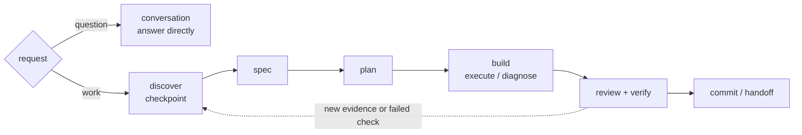
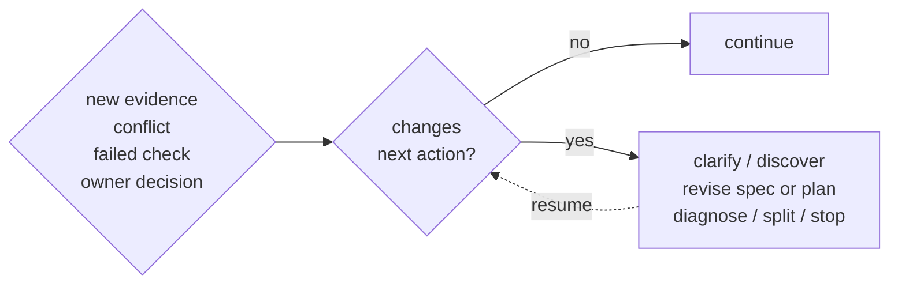

# Workflow

Freeflow is a workflow layer, not a new agent. It helps the agent choose the right amount of process for the task.

## Modes

- `conversation`: non-mutating discussion, read-only exploration, and planning in chat; edits or other state-changing work require switching to `workflow` or `strict-workflow` first.
- `workflow`: default for consequential work; use the workflow spine and scale detail to risk.
- `strict-workflow`: high-risk or hard-to-reverse work with stronger gates.

Use strict-workflow for security, privacy, billing, public APIs, migrations, data loss, compatibility, permissions, deployment, or irreversible architecture.

## Activation and toggles

Freeflow is repo-local. A global install stays inactive until `/setup-freeflow` creates a `.freeflow/config.json` that parses and matches the supported setup config shape.

Pi users can run `/freeflow` for one control and settings surface. `/freeflow mode` opens the session-mode selector; `/freeflow mode conversation|workflow|strict-workflow|reset` changes or clears the temporary session override. The settings screen keeps Session mode separate from the persisted Default mode in `.freeflow/config.json`.

- `enabled: false` turns the full Freeflow runtime off and makes nested settings inactive.
- `skills.enabled: false` hides model workflow skills and suppresses mode-contract, workflow, interview-gate, and discovery-light runtime context.
- `outputRouter.enabled` is a layer toggle, but only takes effect while top-level Freeflow is enabled.

`/freeflow enable` remains available while Freeflow is disabled.

## Map

The map is orienting, not mandatory. Small reversible work can skip unnecessary artifacts and gates. Use `/discover` for the discovery loop.

## Backward Edge

Loop back when new evidence changes the path:

The agent should not silently choose the backward destination when the choice changes product behavior, scope, compatibility, public APIs, security, privacy, billing, data loss, permissions, or irreversible architecture.

## Bypass

Bypass skips ceremony, not judgment.

Use `bypass` only to skip an unnecessary gate. It does not skip user-owned decisions, source-truth conflicts, risky checks, or fresh verification before completion claims.
