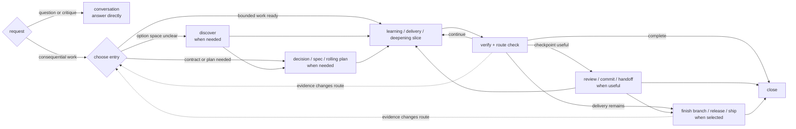
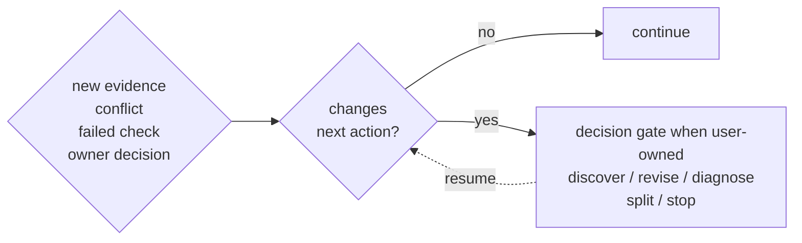

# Workflow

Freeflow is a workflow layer, not a new agent. It helps the agent choose the right amount of process for the task.

## Modes

- `conversation`: non-mutating discussion, read-only exploration, and planning in chat; edits or other state-changing work require switching to `workflow` or `strict-workflow` first.
- `workflow`: default for consequential work; use the adaptive loop and scale detail to risk.
- `strict-workflow`: high-risk or hard-to-reverse work with stronger gates.

Use strict-workflow for security, privacy, billing, public APIs, migrations, data loss, compatibility, permissions, deployment, or irreversible architecture.

## Activation and toggles

Freeflow is repo-local. A global install stays inactive until `/setup-freeflow` creates a `.freeflow/config.json` that parses and matches the supported setup config shape.

Pi users can run `/freeflow` for one control and settings surface. `/freeflow mode` opens the session-mode selector; `/freeflow mode conversation|workflow|strict-workflow|reset` changes or clears the temporary session override. The settings screen keeps Session mode separate from the persisted Default mode in `.freeflow/config.json`.

- `enabled: false` turns the full Freeflow runtime off and makes nested settings inactive.
- `skills.enabled: false` hides model workflow skills and suppresses the compact runtime kernel.
- `outputRouter.enabled` and `delegationHarness.enabled` remain layer toggles, but only take effect while top-level Freeflow is enabled.

`/freeflow enable` remains available while Freeflow is disabled.

## Map

The map is adaptive, not mandatory or linear. Enter at the narrowest useful state. Discovery and durable artifacts are conditional. Every meaningful slice gets fresh verification and a route check; review, commit, handoff, branch integration, release, and launch are selected only when they reduce risk or complete the requested delivery.

## Backward Edge

Loop back when new evidence changes the path:

Route to the narrowest activity that owns the invalidated assumption while preserving valid work. The agent should not silently choose the backward destination when the choice changes product behavior, scope, compatibility, public APIs, security, privacy, billing, data loss, permissions, or irreversible architecture; that requires the Decision Gate.

## Bypass

Bypass skips ceremony, not judgment.

Use `bypass` only to skip an unnecessary gate. It does not skip user-owned decisions, source-truth conflicts, risky checks, or fresh verification before completion claims.
