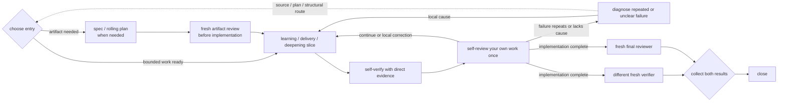

# Workflow

Freeflow is a workflow layer, not a new agent. It helps the active agent work as a responsible engineer while applying only the process the task needs.

## Modes

- `conversation`: non-mutating discussion, read-only exploration, and planning in chat; edits or other state-changing work require switching to `workflow` or `strict-workflow` first.
- `workflow`: default for consequential work; use the adaptive loop and scale detail to risk.
- `strict-workflow`: high-risk or hard-to-reverse work with stronger owner and evidence boundaries, not review after every slice.

Use strict-workflow for security, privacy, billing, public APIs, migrations, data loss, compatibility, permissions, deployment, or irreversible architecture.

## Activation and toggles

Freeflow is repo-local. A global install stays inactive until `/setup-freeflow` creates a `.freeflow/config.json` that parses and matches the supported setup config shape.

Pi users can run `/freeflow` for one control and settings surface. `/freeflow mode` opens the session-mode selector; `/freeflow mode conversation|workflow|strict-workflow|reset` changes or clears the temporary session override. The settings screen keeps Session mode separate from the persisted Default mode in `.freeflow/config.json`.

- `enabled: false` turns the full Freeflow runtime off and makes nested settings inactive.
- `skills.enabled: false` hides model workflow skills and suppresses the compact runtime kernel and first-turn Workflow bootstrap.
- `outputRouter.enabled` and `delegationHarness.enabled` remain layer toggles, but only take effect while top-level Freeflow is enabled.

`/freeflow enable` remains available while Freeflow is disabled.

## Primary feedback loop

Implementation, tests, runtime evidence, and one sequential self-check—self-verification first, then bounded self-review only on support—are the primary feedback loop. Kernel/Workflow provide the basic methods; review/verify skills may enhance either inline after a meaningful slice without creating independence. The agent corrects local reversible mistakes directly and diagnoses repeated or unexplained failure before redesigning.

Three standing assurance roles need no repeated confirmation:

1. the artifact-review route selected by `write-spec`: one combined review, separate spec and plan reviews when high risk, or spec-only review;
2. after the final sequential self-check, a fresh verifier and different fresh reviewer dispatched in parallel against one frozen state.

Verifier evidence and reviewer judgment are independent parallel results. Implementer, verifier, and reviewer use distinct contexts, and the final agents do not consume each other's output. An artifact-only task uses its artifact review as final review and needs no verifier unless executable claims require one.

Any additional reviewer or independent verifier needs scoped user authorization. Reading review/verify skills enhances self-review/self-verification and does not dispatch. `/review-work` and `/review-artifact` default to formal review unless inline use is explicit; `/verify-work` defaults to self-verification. Ask once when plain “review” is ambiguous and retain the answer. Collect both results before adjudicating. Completion needs verifier Pass plus resolved review for the same unchanged state. Any code change stales both; self-check the fix and ask before another independent dispatch.

A phase boundary does not trigger extra review. Keep formal roles strict, scoped, and capable of a clean pass.

## Artifact review route

`write-spec` chooses how the standing artifact review is packaged:

- **Combined:** review the settled spec first and then its concise provisional plan in one independent context.
- **Spec first:** review a high-risk source contract before writing the dependent plan, then review the plan separately.
- **Spec only:** no plan is currently needed or the task ends with the spec.

When no spec exists and a consequential durable plan is the only artifact, review that plan before implementation. Routine rolling-plan updates use direct evidence and self-review unless they materially change the reviewed boundary.

## Adaptive routing

Enter at the narrowest useful state. Small reversible work may go directly from inspection to execution and verification. Discovery, durable artifacts, commits, handoffs, integration, release, and launch remain conditional.

Route only affected work backward:

- clear local defect -> fix and verify;
- repeated or unexplained failure -> diagnose;
- diagnosed structural pressure -> design-for-depth;
- new option space -> Discover;
- changed behavior, scope, acceptance, public contract, or failure semantics -> revise spec;
- changed order, slices, checks, or later assumptions -> revise plan;
- user-owned decision or source conflict -> Decision Gate;
- no safe in-scope path -> defer or stop.

Preserve valid work. Do not redesign because ordinary mistakes exist, restart from zero, or patch around an invalid path.

## User and agent roles

The agent is the responsible collaborative engineer: it owns locally authorized implementation, verification, correction, and learning. The user is the accountable owner and collaborator: they own product intent and consequential decisions, but live evidence owns factual behavior. Either may correct the other with evidence.

Delegation parent/child names context topology, not competence. Reviewers are strict independent peers or tech leads; verifiers are separate factual evidence runners. Neither continuously supervises the implementing agent or replaces source truth.

## Bypass

Bypass may skip optional ceremony, not standing artifact/final assurance for readiness or completion. If required assurance is unavailable or skipped, preserve and report the work as unreviewed or unassured rather than claiming it ready or complete.
