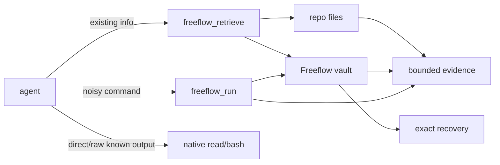

# Output Router

Freeflow Output Router keeps agent context focused while preserving exact evidence outside context.

Use it when broad repo exploration, generated artifacts, large logs, or noisy command output would otherwise flood the model.

For the full architecture, see [`docs/designs/freeflow-output-router-architecture.md`](../../../docs/designs/freeflow-output-router-architecture.md) in the repo root.

## Core Idea

```text
smallest sufficient evidence in context
+ exact raw recovery outside context
+ no surprise native tool semantics
```

The router ships two explicit tools:

- `freeflow_retrieve`: retrieve targeted repo/vault evidence.
- `freeflow_run`: run likely-large/noisy commands, vault raw output, and return compact evidence.

Native tools still matter:

- use native `read` for known whole files,
- use native `bash` for small/direct raw shell behavior,
- use native `edit`/`write` for mutations.

## Tiny Map



## Tool Choice

| Need | Use |
| --- | --- |
| Find repo evidence before reading files | `freeflow_retrieve action=query` |
| Get candidate paths first | `freeflow_retrieve action=locate` |
| Retrieve exact repo/vault lines | `freeflow_retrieve action=retrieve` with `lineRange` |
| Widen previous evidence | `freeflow_retrieve action=expand` |
| Explain a previous routed decision/output | `freeflow_retrieve action=explain` |
| Run noisy/large command output | `freeflow_run` |
| Read a known whole file | native `read` |
| Run small exact command | native `bash` |

## `freeflow_retrieve`

Sources:

- `repo`: local repo files.
- `vault`: previous routed command/native output.

Actions:

- `query`: returns best evidence packets; default `topK=1`.
- `locate`: returns candidate locations; default `topK=5`.
- `retrieve`: returns explicit path/line range evidence.
- `expand`: expands a previous evidence packet to `lines_30`, `lines_80`, or `full`.
- `explain`: explains a route decision or vault output.

Example:

```json
{
  "action": "query",
  "source": { "kind": "repo" },
  "query": "Sandbox Permissions UseDefault RequireEscalated WithAdditionalPermissions",
  "preserve": "important"
}
```

Evidence packets include:

- source/path,
- line range,
- exact excerpt,
- why the router selected it,
- expansion/recovery guidance.

Repo retrieval uses deterministic scanner ranking by default. Broad scans skip generated/dependency/cache paths such as `graphify-out/**`, but explicit path retrieval remains available.

## `freeflow_run`

`freeflow_run` executes once through the host-approved runner, stores exact raw output in the vault, then returns useful command evidence.

Example:

```json
{
  "command": "npm test",
  "goal": "verification",
  "preserve": "important"
}
```

Returned results include:

- `outputId`,
- `execution.status` and `exitCode`,
- parser metadata,
- important lines,
- exact recovery instructions.

Command parsers currently cover:

- test runner output,
- TypeScript/lint diagnostics,
- git status/diffstat,
- build/toolchain errors,
- generic fallback,
- duplicate output detection.

## Vault Recovery

Recover exact command output with:

```json
{
  "action": "retrieve",
  "source": { "kind": "vault", "outputId": "ffout_...", "stream": "combined" },
  "lineRange": { "start": 1, "end": 40 },
  "preserve": "full"
}
```

Streams:

- command output: `stdout`, `stderr`, `combined`,
- native safety-net output: `raw`.

Default vault root:

```text
~/.cache/freeflow-router/vault
```

## Config

The router works with built-in defaults. Minimal `/setup-freeflow` writes only `defaultMode`.

Optional repo config lives in `.freeflow/config.json` only when explicitly requested:

```json
{
  "defaultMode": "workflow",
  "outputRouter": {
    "postToolRouting": "off",
    "largeOutputBytes": 64000,
    "largeOutputLines": 1000,
    "vaultRoot": "~/.cache/freeflow-router/vault",
    "vaultRetentionDays": 7,
    "generatedPaths": ["graphify-out/**"],
    "noisyCommandHints": ["npm test"]
  }
}
```

Rules:

- `postToolRouting` defaults to `off`.
- `safety-net` is opt-in.
- `strict` is reserved.
- Do not dump defaults into config.
- Write only requested keys.

## Native Safety Net

Pi can optionally route large native `read`/`bash` results after the tool runs.

Default: off.

When enabled, a routed native result is labeled, vaulted, and includes an `outputId`. If safety-net routing fails, Freeflow fails open and returns native output with a warning.

## Defaults And Experiments

Current adoption decisions:

- Scanner retrieval is the default backend.
- The no-dependency local index is experimental and not adopted by default.
- SQLite/FTS is not adopted.
- Model-assisted routing is not default.
- Graphify, Claude Context, RTK, and Squeez are optional references/comparators, not dependencies.

## Evidence

Current release evidence:

- Retrieval benchmark: improved router passed 7/7 fixtures.
- Command benchmark: `freeflow_run` passed 8/8 fixtures with exact recovery.
- Optional index benchmark: scanner remains default; index not adopted.
- Codex Structured Q&A benchmark: improved router passed the Sandbox Permissions fixture where native broad search selected `graphify-out/graph.html`.
- Setup eval: optional `outputRouter` config is opt-in; minimal setup remains only `defaultMode`.

See `release-evidence.md` and runtime reports under `plugins/freeflow/evals/reports/runtime/`.
