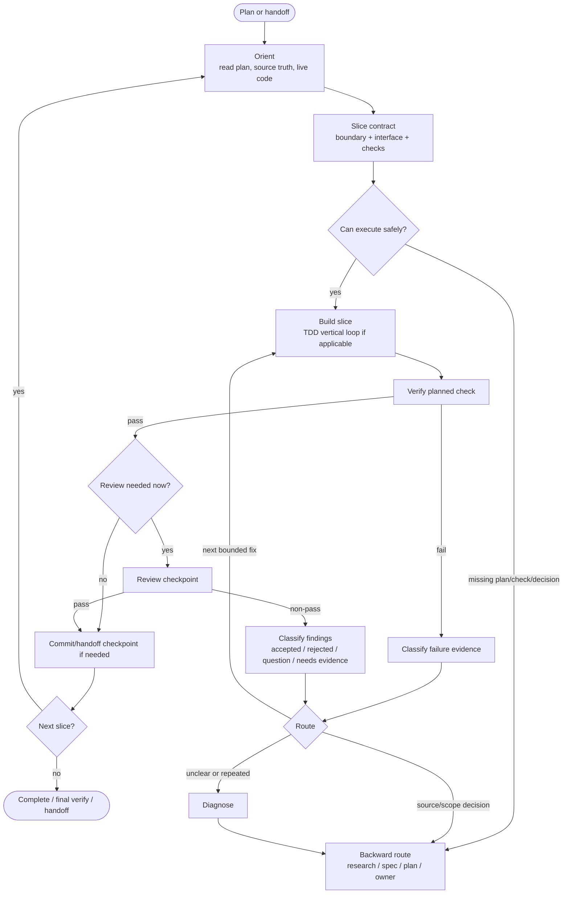

# Execute Plan Map

Use this when carrying out a multi-slice plan, resuming from handoff, combining TDD with execution, deciding whether to review/commit, or handling failed checks/reviews/scope changes.

The map is a control surface, not ceremony. Small reversible slices can use the compact map only.

## Compact Map

```text
Orient
-> Slice contract
-> Red / Green / Refactor when TDD applies
-> Verify
-> Review checkpoint when needed
-> Commit or handoff checkpoint when needed
-> Next slice

Any failed check, non-pass review, source conflict, or scope expansion
-> Classify evidence
-> Report route
-> Fix | Diagnose | Research | Spec | Plan | Stop
```

## Contract Map

Before a non-trivial slice, name:

```text
Slice: what part of the plan is active
Source truth: spec/docs/tests/policies/code that own behavior
Module/interface changed: outside contract affected by this slice
Behavior/test/benchmark: observable behavior to prove
Verification: command or check that proves this slice
Review checkpoint: none | after this slice | after stack | final
Commit or handoff checkpoint: when rollback/resume needs a snapshot
Stop conditions: decisions/conflicts/failures that end the slice
```

A slice contract prevents hidden broadening. If the contract changes materially, stop and route backward.

## Reference Map



## Entry Points

Use this map when the current task is:

- start or continue an approved plan;
- execute the next planned slice;
- resume from a handoff;
- run a TDD or benchmark-backed implementation slice;
- handle a planned verification failure;
- handle review findings during execution;
- decide whether to commit after a slice;
- context is getting low before the next slice;
- implementation reveals scope or source truth changed.

## Exits

- **Forward** — slice verified; next slice boundary is clear.
- **Bounded fix** — accepted finding/check failure is small, in-scope, and source-truth-supported.
- **Commit checkpoint** — verified slice should be committed before continuing.
- **Handoff checkpoint** — context is too low or continuation state must survive.
- **Backward** — scope/source truth/review evidence invalidates the plan.
- **Diagnose** — repeated failure or edge-case patching suggests a deeper problem.
- **Stop** — blocked on owner decision or plan/spec/source change.

## Review Failure Routing

A non-pass review is not an edit script.

Classify before action:

- **Accepted** — valid, source-truth-supported, and in scope.
- **Rejected** — stale, unsupported, already resolved, equivalent, or not important.
- **Question** — needs owner/product/domain/security/API/etc. decision.
- **Needs evidence** — inspect before deciding.

Route:

- Accepted + bounded + in scope -> recommend one fix pass next; do not perform it in the same turn that received the non-pass review.
- Non-blocking -> defer or bundle only when safe.
- Question -> ask; do not implement the answer silently.
- Needs evidence -> inspect or diagnose before editing.
- Third review pass -> diagnose; no fourth broad review.

Repeated edge-case findings are a design signal. Ask whether the module/interface is too shallow, the plan slice is wrong, the spec is under-specified, or reviewer context is stale.

## Context And Snapshot Discipline

Do not start a slice if you cannot finish the edit, verification, and checkpoint in the current context window.

When per-slice commits are requested, a verified slice should route to `commit-work` before the next slice. When a commit is not appropriate, make a handoff if future execution depends on the slice state.
