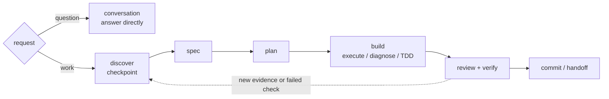
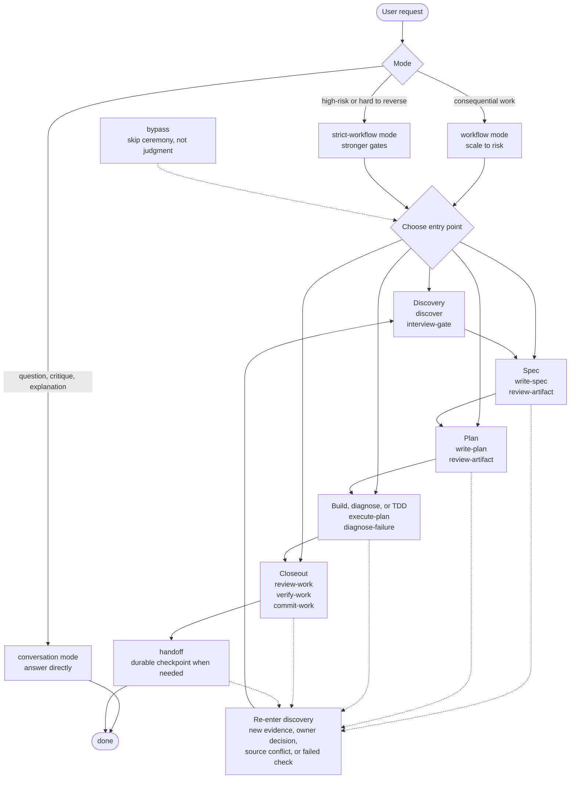

# Freeflow Map

Use this when the user asks how the whole workflow fits together, public docs need a diagram, or the next workflow entry point is unclear.

This map is orienting, not mandatory. Small reversible work can skip unnecessary artifacts and gates. Re-enter clarification whenever new ambiguity would change the next action.

## Compact Map

Use this compact version in public README-style docs.



```text
Use conversation mode for questions. Use workflow mode for consequential work.
Use strict-workflow for risky work; same spine, stronger gates.
Loop back when new evidence, source conflicts, user-owned decisions, or failed checks change the path.
Use `Next:` when a response leaves a useful next route. Completed consequential phases should close with forward, backward, branch, or stop unless the reply is only an answer, status update, clarification, or direct owner-decision question.
```

## Reference Map

Use this fuller version when choosing an entry point or explaining the workflow lifecycle.



## Common Entry Points

- Use `conversation mode` when the user asks a question, wants critique, or is exploring.
- Use `discover` when repo, domain, evidence, current facts, brainstorming, targeted questions, or a decision checkpoint are needed before spec, plan, build, or durable memory.
- Use `interview-gate` when direction is vague, source truth conflicts, or user-owned decisions are still open.
- Use `write-spec` when requirements are agreed but not durable.
- Use `review-artifact` when a spec, plan, handoff, or decision note must guide future work.
- Use `write-plan` when an approved spec or explicit task context exists.
- Use `execute-plan` when an approved plan exists; method skills like TDD run inside that build phase when requested or appropriate.
- Use `diagnose-failure` when behavior is broken, failing, flaky, slow, or unclear.
- Use `review-work` and `verify-work` before claiming consequential work is ready.
- Use `commit-work` only after the intended diff is reviewed and verification evidence exists.
- Use `handoff` when pausing, compacting, or transferring context.
- Use `bypass` only to skip unnecessary ceremony. It cannot skip user-owned decisions, source-truth conflicts, risky checks, or verification claims.

## Route Closeout

Use `Next:` when naming the next route helps the user, not only when a workflow phase changes. Do not force it onto every reply.

Completed consequential work and phase exits should include `Next:` unless the reply is only a direct answer, mid-task status, clarification-only turn, or direct owner-decision question.

- Forward: name the next action or entry point, such as `write-spec`, `write-plan`, `execute-plan`, `review-work`, `verify-work`, `commit-work`, or `handoff`.
- Backward: return to `interview-gate`, `discover`, `diagnose-failure`, or plan/spec revision when evidence, failed checks, or repeated review findings change the path.
- Branch: show 2-3 valid next routes or actions when more than one is reasonable.
- Stop: say no useful next action remains.

After completed discovery with decisions that must survive beyond chat, prefer `write-spec`, an owning decision artifact, or handoff before planning or execution.

Do not create the next artifact or take the next action just because it is the next route.
