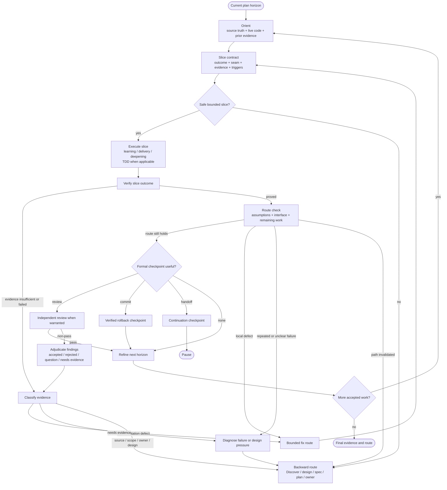

# Execute Plan Map

Use this for multi-slice execution, learning work, rolling-plan refinement, accumulated design pressure, or failed verification/review/source/scope conditions.

The map is adaptive. It preserves the accepted outcome while allowing evidence to change the path.

## Compact Loop

```text
Orient to current horizon
-> Name slice contract
-> Execute one learning / delivery / deepening slice
-> Verify
-> Route check
   -> continue
   -> formal review / commit / handoff when useful
   -> bounded fix
   -> diagnose
   -> Discover / design
   -> revise spec / plan
   -> decision gate
   -> stop or defer
-> Refine only the next executable horizon
```

Every meaningful slice gets verification and a route check. Formal checkpoints are conditional.

## Slice Contract

```text
Slice outcome:
Source requirement / acceptance:
Type: learning | delivery | deepening
Module / interface / seam:
Semantic failure unit and observing boundary when relevant:
Behavior, experiment, test, or benchmark:
Failure contract when relevant:
Verification:
Assumptions under test:
Route-change triggers:
Formal checkpoint if needed: review | commit | handoff | owner
```

A slice is a proof-bearing unit, not a file batch. If this contract changes materially during execution, stop and classify the new route.

## Route Map



## Route Check

After verification, ask:

- What did this slice prove?
- Which assumption changed?
- Does the module still hide complexity behind the intended interface?
- Is remaining work shrinking?
- Can the next bounded finish path be stated clearly?
- Did a deferred capability or unplanned subsystem enter scope?
- Did this slice invalidate earlier evidence or later phases?
- Is independent review, a rollback checkpoint, or a handoff useful now?

Choose one route:

- **Continue:** current outcome, scope, interface, and plan remain valid.
- **Bounded fix:** one source-backed local defect; no scope or design change.
- **Review:** independent judgment could change confidence or route.
- **Commit:** coherent verified rollback point.
- **Handoff:** context or continuity boundary.
- **Diagnose:** failure signal or repeated loop needs root-cause evidence.
- **Discover/design:** option space, ownership, failure unit, or interface reopened.
- **Revise spec:** behavior, scope, acceptance, public contract, or failure semantics changed.
- **Revise plan:** order, slices, mechanism, checks, or later phases changed.
- **Decision gate:** owner choice or source/path conflict blocks progress.
- **Stop/defer:** no safe in-scope continuation.

## Review Readiness

Use this once before formal review when architecture, security, consequential state transitions, or proof validity makes omissions expensive:

```text
Accepted outcome and source requirement:
Owning invariant and semantic failure unit:
Known entrypoints, callers, and adapters that can affect it:
Forbidden effects and prior accepted-state preservation:
Load-bearing claim -> direct observer -> adversarial disproof:
Known evidence or fidelity gaps:
Unresolved assumptions and owning activity:
Route: review | design | TDD | diagnose | revise plan/spec | verify | decide | stop
```

Inspect available source evidence before filling the map. Do not turn unknown facts into confident entries or user questions. Ask only when the unresolved item is user-owned and changes the next safe action.

This is one bounded author-side readiness pass, not recursive self-review, independent judgment, or verification. If a gap changes the route, leave valid work intact and re-enter its owning activity before dispatching review.

## Dynamic Backward Triggers

Route backward when:

- an accepted defect reveals another branch, caller, adapter, or persisted-state consequence of the same invariant;
- caller knowledge, public states, flags, retries, or test setup keep growing;
- a slice requires an unplanned subsystem;
- deferred scope enters the active milestone;
- implementation invalidates earlier evidence;
- later phases depend on a changed interface or ordering;
- remaining work grows after completed slices;
- the bounded finish path is no longer clear;
- review or verification repeatedly fails for different local reasons.

These triggers do not authorize a refactor. Preserve valid evidence, name the affected layer, and choose the narrowest backward route.

## Rolling Horizon

At phase boundaries:

1. preserve completed evidence and settled decisions;
2. update invalidated assumptions;
3. refine the next phase into executable slices;
4. keep later phases directional;
5. record new backward checkpoints and formal checkpoint forecasts;
6. stop if refinement would silently change behavior or scope.

A changed plan is healthy adaptation when evidence and owner authority support it. Following an invalidated plan is not discipline.

## Separate Execution Contexts

When work is distributed, each work package should contain:

- one bounded slice outcome;
- source requirements and constraints;
- relevant module/interface context;
- expected output and evidence;
- write boundary;
- route-change and escalation conditions.

The execution harness owns agents, models, worktrees, parallelism, persistence, timeouts, and transport.