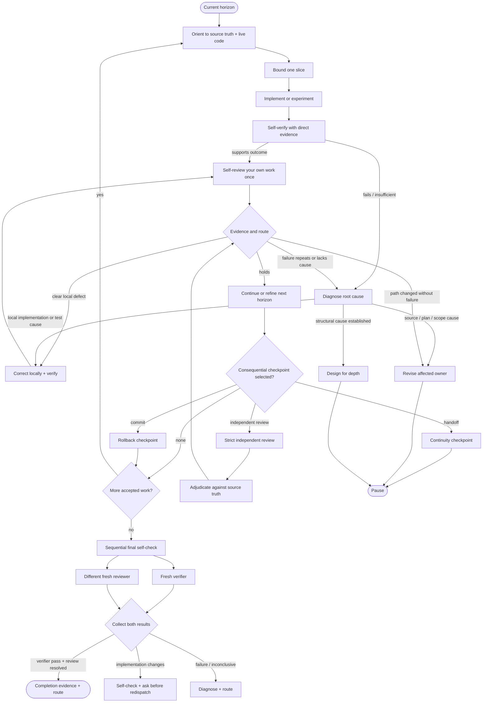

# Execute Plan Map

Use this for multi-slice execution, learning work, rolling-plan refinement, distributed work, or failed source, scope, verification, or formal-review conditions.

## Compact Loop

```text
Orient to current horizon
-> Bound one learning / delivery / deepening slice
-> Execute
-> Self-verify with direct evidence
-> If supported, silently self-review your own work once
   -> continue
   -> correct a local reversible mistake
   -> diagnose repeated or unexplained failure
   -> revise affected source / plan / design only when evidence requires it
   -> select a formal checkpoint only when useful
-> Refine the next executable horizon
```

The active agent owns this loop. Review/verify skills may enhance self-review or self-verification without creating independence.

## Slice Contract

Name only what execution needs:

```text
Outcome and source requirement:
Stable seam or write boundary:
Behavior or learning question:
Direct verification:
Route-changing assumptions or stop conditions:
```

Add semantic failure unit, observing boundary, forbidden outcomes, and recovery only when consequential state, authority, atomic visibility, or durable evidence requires them. A slice is a coherent behavior or evidence unit, not a file batch.

## Route Map



## Bounded Self-Review

Only after self-verification supports the outcome, silently ask once:

- Does the change match the accepted outcome and source truth?
- What does the evidence prove, and what remains outside its boundary?
- Is there a clear local correction, or did evidence change the route?

Correct a local reversible mistake and rerun affected checks. Workflow guidance is enough for routine work; read review/verify skills when richer self-review or self-verification helps. Reading them does not create a formal verdict, independent context, or user question. Surface only route-changing gaps.

## Diagnose Before Redesign

Repeated failure is a signal that the current explanation may be wrong, not proof that the architecture is wrong.

Diagnosis may find:

- one local implementation defect;
- an inadequate or stale test;
- a missing reproduction or observer;
- a source-truth or owner conflict;
- a bad slice boundary or plan assumption;
- stale reviewer context;
- structural ownership, interface, state, or failure-unit pressure.

Only the last category routes to redesign. Direct structural evidence may enter design-for-depth without manufacturing a failure first.

## Final Assurance

The final slice closes in this order:

1. sequential self-check: self-verification, then bounded self-review only on support;
2. freeze one source identity;
3. dispatch one fresh verifier and one different fresh reviewer in parallel;
4. collect both results, then adjudicate.

Implementer, verifier, and reviewer use separate contexts. Verifier supplies factual evidence; reviewer supplies judgment without depending on verifier output. Completion requires verifier Pass and resolved review for the same unchanged state.

If one result fails without source changes, preserve the unaffected result when its boundary still holds. Any implementation change stales both; self-check the fix and ask before another independent verifier or reviewer dispatch.

Commit, handoff, owner, integration, release, and launch checkpoints remain separately conditional.

## Rolling Horizon

At phase boundaries:

1. preserve completed evidence and settled decisions;
2. update only invalidated assumptions;
3. refine the next phase into executable slices;
4. keep later phases directional;
5. stop only when the next safe action truly depends on unresolved source truth or owner authority.

A changed plan is healthy adaptation. Following an invalidated plan is not discipline; rewriting it after every local correction is not adaptation.

## Separate Execution Contexts

For distributed work, give each package:

- bounded outcome and source constraints;
- relevant seam and write boundary;
- expected output and direct evidence;
- route-change and escalation conditions.

Reuse worker context while it remains useful. The harness owns agents, models, worktrees, parallelism, persistence, timeouts, and transport.
