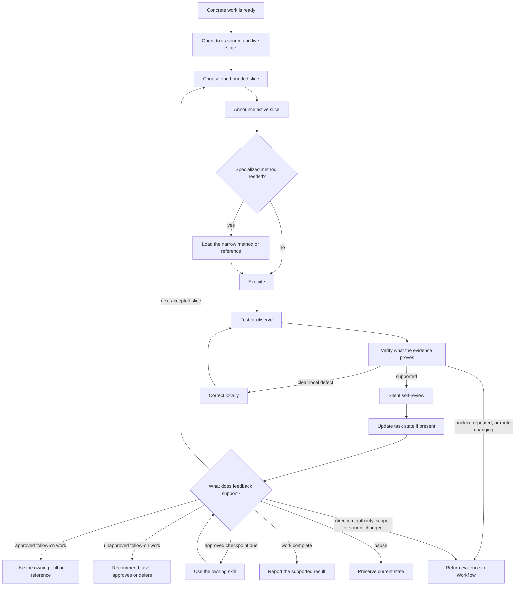

# Execute Work Loop

Read this when execution spans multiple slices, resumes from prior state, needs a specialized execution method, or reveals approved follow-on work. [Execute Work](../SKILL.md) defines the normal path; this reference shows how conditional branches fit around it.

## Multi-Slice Loop

## Methods During A Slice

Use only the method needed by the current work:

- Use [TDD](../../tdd/SKILL.md) for test-first execution. Read [Test Design](../../tdd/references/test-design.md) when the test boundary, double, or seam is unclear.
- Use [Simplify Code](../../simplify-code/SKILL.md) for behavior-preserving simplification. Read [Simplification Patterns](../../simplify-code/references/simplification-patterns.md) when choosing a concrete transformation.
- Read [Design Pressure Signals](../../design-for-depth/references/design-pressure-signals.md) when implementation starts spreading caller knowledge, states, flags, tests, or coordination. If the interface or ownership is structurally wrong, use [Design for Depth](../../design-for-depth/SKILL.md) and read the [Interface Design Loop](../../design-for-depth/references/interface-design-loop.md) when materially different designs must be compared.
- Use [Diagnose Failure](../../diagnose-failure/SKILL.md) when a failure lacks a supported cause. Read the [Feedback Loop Catalog](../../diagnose-failure/references/feedback-loop-catalog.md) when choosing a reproduction method, or [Flaky and Performance Diagnosis](../../diagnose-failure/references/flaky-and-performance.md) for those failure types.

## Approved Checkpoints And Follow-On Routes

A user-approved Plan or explicit discussion may select review, local commit, user, or continuity checkpoints. Use the owning skill when a checkpoint becomes due, and do not start another slice first. If its conditions no longer hold, return the deviation to Workflow instead of forcing it.

Use these follow-on routes only when the work is already requested or approved:

- Use [Migration Work](../../migration-work/SKILL.md). Read the [Migration Lifecycle](../../migration-work/references/migration-lifecycle.md) when choosing migration units, compatibility, cutover, rollback, or removal proof.
- Use [Commit Work](../../commit-work/SKILL.md). Read [Staging Decisions](../../commit-work/references/staging-decisions.md) when staged or changed state is mixed.
- Use [Finish Branch](../../finish-branch/SKILL.md). Read [Integration Options](../../finish-branch/references/integration-options.md) when choosing merge, pull request, keep, or discard.
- Use [Release Work](../../release-work/SKILL.md). Read [Release Evidence](../../release-work/references/release-evidence.md) when source, version, artifact, tag, publication, or consumer identity matters.
- Use [Launch Work](../../launch-work/SKILL.md). Read [Launch Readiness](../../launch-work/references/launch-readiness.md) when choosing readiness evidence, rollout stages, signals, or recovery.
- Use [Handoff](../../handoff/SKILL.md). Read [Handoff Templates](../../handoff/references/templates.md) after its destination and purpose are clear.

## Resume Or Return

When resuming, reopen the source that established the work and inspect live state before continuing. If a Working Record exists, use its current slice and evidence pointers rather than replaying its full history.

Continue only while the next slice remains accepted and evidence supports the execution basis. Report unapproved follow-on work so the user can approve or defer it. Return to Workflow when direction, authority, scope, source truth, or the execution basis changes.
