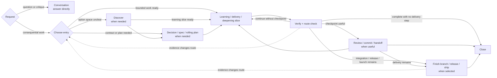
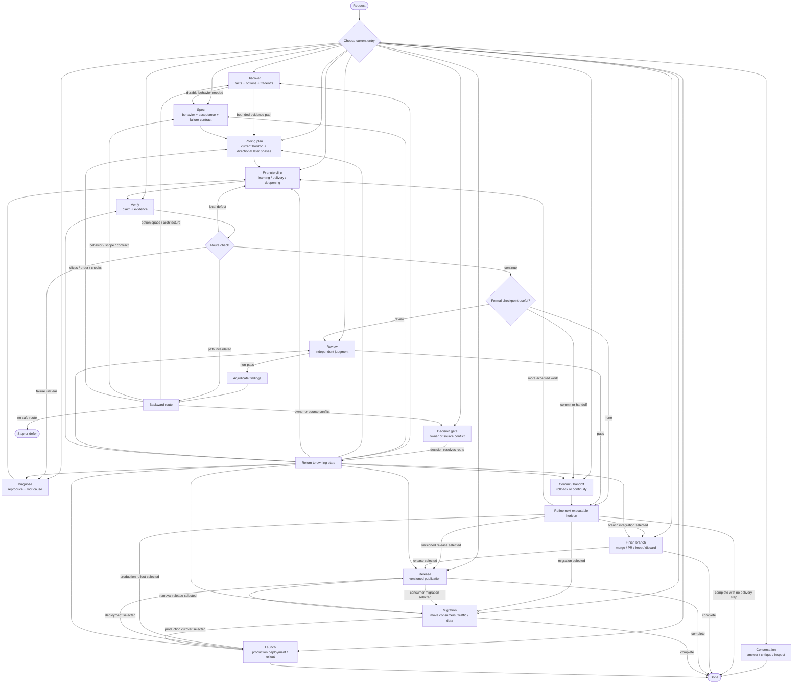

# Freeflow Workflow Map

Use this when work spans phases, the current entry point is unclear, or public documentation needs the complete lifecycle.

This map is adaptive. It is not a mandatory sequence.

## Compact Map



Small reversible work may use:

```text
inspect -> execute -> verify -> route closeout
```

## Adaptive Lifecycle



## Entry Points

- **Conversation:** non-mutating answer, explanation, critique, or bounded read-only exploration.
- **Discover:** problem, outcome, approaches, architecture direction, or evidence path is unsettled.
- **Decision gate:** owner decision, source conflict, or material path substitution blocks action.
- **Write spec:** accepted behavior, scope, contracts, or acceptance need durability.
- **Review artifact:** a spec, plan, decision, or handoff must guide future work safely.
- **Write plan:** immediate execution needs phases, slices, verification, and backward checkpoints.
- **Execute plan:** an approved current horizon exists.
- **TDD:** one accepted behavior should drive one test-first implementation loop.
- **Simplify code:** working code needs behavior-preserving reduction of accidental complexity.
- **Migration work:** consumers, traffic, configuration, or data must move before an old path can be removed.
- **Diagnose failure:** a broken, flaky, slow, or repeated workflow signal needs root cause.
- **Review work:** independent judgment may change confidence or route.
- **Verify work:** a slice or completion claim needs fresh proof.
- **Commit work:** a coherent verified rollback checkpoint is useful and authorized.
- **Handoff:** context or continuity requires compact continuation state.
- **Finish branch:** choose and verify merge, PR, keep, discard, or cleanup.
- **Release work:** publish and verify an immutable versioned consumer artifact.
- **Launch work:** deploy or expose production behavior through an observable recoverable rollout.

## Slice Loop

```text
Slice contract
-> implement or experiment
-> verify
-> route check
   -> continue
   -> bounded fix
   -> review
   -> commit / handoff
   -> diagnose
   -> Discover / design
   -> revise spec / plan
   -> decision gate
   -> stop
```

Verification and route check occur after every meaningful slice. Formal review, commit, handoff, and user checkpoints are selected by risk and route value.

## Rolling Horizon

A rolling plan separates:

- **Current phase:** concrete slices, seams, checks, dependencies, and stop conditions.
- **Next phase:** directional outcome, likely dependencies, and questions current evidence must resolve.
- **Later phases:** provisional outcomes and major constraints only.

At each phase boundary, preserve evidence and refine only the next executable horizon.

## Backward Routing

- New option space or invalidated assumptions -> Discover.
- Growing caller knowledge, states, flags, retries, or test machinery -> design-for-depth.
- Changed behavior, scope, acceptance, public contract, or failure semantics -> spec revision.
- Changed implementation order, slices, checks, or later-phase assumptions -> plan revision.
- Unclear root cause -> diagnosis.
- Owner or source conflict -> decision gate.
- No safe in-scope continuation -> defer or stop.

Route only affected work backward. Preserve valid decisions, code, and evidence.

## Route Closeout

Use `Next:` when a consequential phase exit leaves a useful route:

- **Forward:** next bounded action.
- **Backward:** invalidated path and owning earlier activity.
- **Branch:** two or three valid routes.
- **Stop:** no useful safe continuation.

Do not use routing language as permission to take the next action.