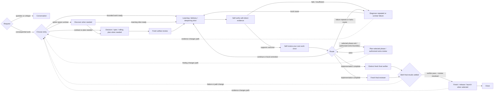

# Freeflow Workflow Map

Use this when work spans phases, the current entry point is unclear, or public documentation needs the complete lifecycle.

This map is adaptive. It is not a mandatory sequence.

## Compact Map



Small reversible work may use:

```text
inspect -> execute -> self-verify -> self-review once -> parallel distinct verifier + reviewer -> close
```

## Feedback Hierarchy

Use the cheapest direct feedback that can disagree with the claim:

1. implementation, tests, runtime observations, compilers, and focused checks;
2. self-verification of what the evidence actually proves;
3. only on support, one bounded self-review of the agent's own work against outcome, evidence, and route;
4. diagnosis when failure repeats or remains unexplained;
5. standing independent artifact/final assurance at their boundaries, with extra separate contexts only when authorized.

Basic self-review and self-verification come from the kernel and Workflow. When richer guidance helps, read the applicable review or verify skill after any slice. Reading enhances the current agent's method; it does not create independence, reviewer passes, or another context.

## Entry Points

- **Conversation:** non-mutating answer, explanation, critique, or bounded read-only exploration.
- **Discover:** problem, outcome, approaches, architecture direction, or evidence path is unsettled.
- **Decision gate:** owner decision, source conflict, or material path substitution blocks action.
- **Write spec:** accepted behavior, scope, contracts, or acceptance need durability.
- **Write plan:** immediate execution needs phases, slices, verification, and backward checkpoints.
- **Execute plan:** an approved current horizon exists.
- **TDD:** one accepted behavior should drive one test-first implementation loop.
- **Simplify code:** working code needs behavior-preserving reduction of accidental complexity.
- **Migration work:** consumers, traffic, configuration, or data must move before an old path can be removed.
- **Diagnose failure:** a broken, flaky, slow, repeated, or unexplained signal needs root cause.
- **Formal artifact review:** a consequential durable artifact needs evidence-backed independent judgment.
- **Formal work review:** integrated work or a critical promotion needs evidence-backed independent judgment.
- **Verify work:** enhanced self-verification or a separately selected verifier needs structured proof guidance; reading it does not imply another agent.
- **Commit work:** a coherent verified rollback checkpoint is useful and authorized.
- **Handoff:** context or continuity requires compact continuation state.
- **Finish branch:** choose and verify merge, PR, keep, discard, or cleanup.
- **Release work:** publish and verify an immutable versioned consumer artifact.
- **Launch work:** deploy or expose production behavior through an observable recoverable rollout.

## Slice Loop

```text
Slice contract
-> implement or experiment
-> self-verify with direct evidence
-> if supported, silently self-review your own work once
   -> continue
   -> correct a local reversible mistake
   -> diagnose repeated or unclear failure
   -> revise the affected spec / plan / design only when evidence requires it
   -> formal review only at a selected consequential boundary
   -> commit / handoff when useful
   -> stop
```

Basic self-verification occurs after every meaningful slice; bounded self-review follows only when evidence supports the outcome. Review/verify skills may be read to enhance either method; reading alone never dispatches another agent or satisfies an independent boundary.

## Independent Boundaries

Standing authorization requires:

- the artifact-review route selected by `write-spec`: one combined review, separate spec and plan reviews when high risk, or spec-only review;
- after the final sequential self-check, one fresh verifier and one different fresh reviewer dispatched in parallel against the same frozen implementation.

An artifact-only task uses its artifact review as final review and needs no separate verifier unless executable claims require one. Standing artifact/final assurance cannot be bypassed for readiness or completion. Bypass may skip only optional extra checkpoints and must leave the claim unassured.

A consequential phase-exit review selected by an approved plan carries scoped authorization. Any other additional reviewer or independent verifier needs scoped user authorization. Ask once for ambiguous review wording and retain the answer. `/verify-work` is not verifier authorization. The implementing agent, reviewer, and verifier use distinct contexts; reviewer and verifier roles never collapse silently.

Collect both results before adjudicating. Completion needs verifier Pass and resolved review with no later implementation change. Any code change stales both results; self-check the fix and ask before another independent dispatch. If one result fails without a source change, preserve the unaffected result when its boundary still holds.

## Rolling Horizon

A rolling plan separates:

- **Current phase:** concrete outcomes, slices, checks, dependencies, and stop conditions.
- **Next phase:** directional outcome, likely dependencies, and questions current evidence must resolve.
- **Later phases:** provisional outcomes and major constraints only.

At each phase boundary, preserve evidence and complete the independent review selected by the approved plan before dependent work. If none was selected, assess whether the integrated outcome promotes architecture, combines interacting risk, or crosses sensitive/hard-to-reverse behavior; ask before an emergent dispatch. Then refine only the next executable horizon.

## Backward Routing

- Clear local defect with a valid seam -> fix and verify.
- Repeated or unexplained failure -> diagnose.
- Diagnosis or direct evidence establishes structural coordination pressure -> design-for-depth.
- New option space or invalidated assumptions -> Discover.
- Changed behavior, scope, acceptance, public contract, or failure semantics -> spec revision.
- Changed implementation order, slices, checks, or later-phase assumptions -> plan revision.
- Owner or source conflict -> decision gate.
- No safe in-scope continuation -> defer or stop.

Diagnosis may conclude that the implementation, test, evidence, spec, plan, reviewer context, or design is wrong. Do not assume redesign before establishing the cause. Route only affected work backward and preserve valid decisions, code, and evidence.

## Conditional Lifecycle

After verified work:

- commit only when a coherent rollback point is useful and authorized;
- hand off only when continuity requires durable context;
- finish a branch only when integration is the next job;
- release only when versioned publication is selected;
- launch only when production exposure is selected.

These activities may require their own risk-specific verification or review. Their existence does not add review checkpoints to earlier slices.

## Route Closeout

Use `Next:` when a consequential phase exit leaves a useful route:

- **Forward:** next bounded action.
- **Backward:** invalidated path and owning earlier activity.
- **Branch:** two or three valid routes.
- **Stop:** no useful safe continuation.

Do not use routing language as permission to take the next action.
